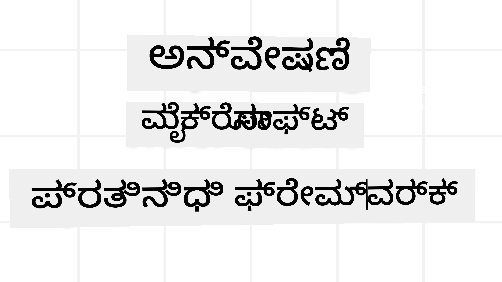
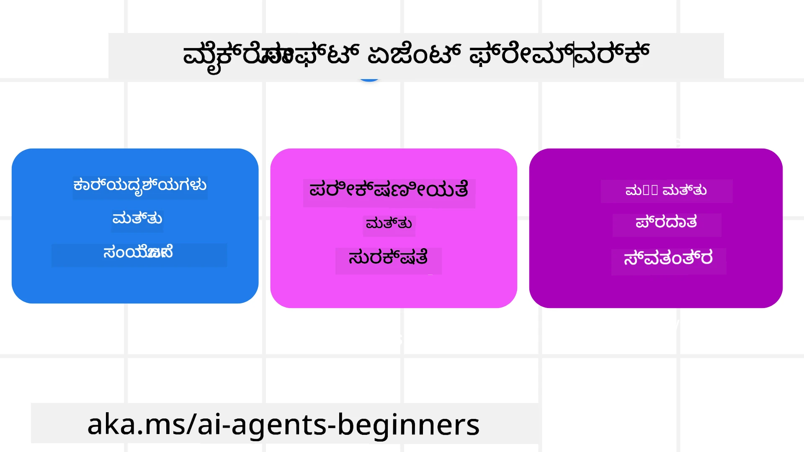
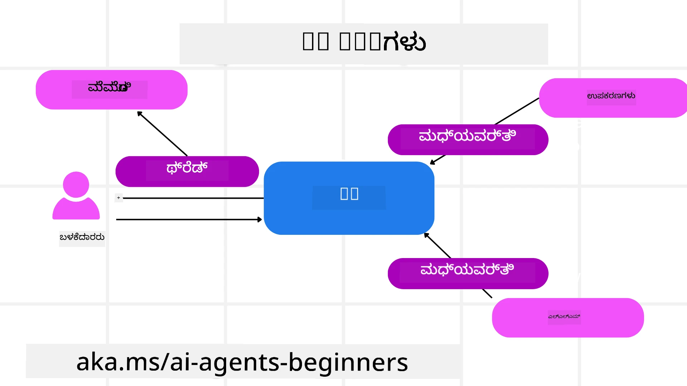

<!--
CO_OP_TRANSLATOR_METADATA:
{
  "original_hash": "19c4dab375acbc733855cc7f2f04edbc",
  "translation_date": "2025-12-03T16:34:01+00:00",
  "source_file": "14-microsoft-agent-framework/README.md",
  "language_code": "kn"
}
-->
# ಮೈಕ್ರೋಸಾಫ್ಟ್ ಏಜೆಂಟ್ ಫ್ರೇಮ್‌ವರ್ಕ್ ಅನ್ನು ಅನ್ವೇಷಿಸುವುದು



### ಪರಿಚಯ

ಈ ಪಾಠದಲ್ಲಿ ನಾವು:

- ಮೈಕ್ರೋಸಾಫ್ಟ್ ಏಜೆಂಟ್ ಫ್ರೇಮ್‌ವರ್ಕ್ ಅನ್ನು ಅರ್ಥಮಾಡಿಕೊಳ್ಳುವುದು: ಪ್ರಮುಖ ವೈಶಿಷ್ಟ್ಯಗಳು ಮತ್ತು ಮೌಲ್ಯ  
- ಮೈಕ್ರೋಸಾಫ್ಟ್ ಏಜೆಂಟ್ ಫ್ರೇಮ್‌ವರ್ಕ್‌ನ ಪ್ರಮುಖ ಪರಿಕಲ್ಪನೆಗಳನ್ನು ಅನ್ವೇಷಿಸುವುದು
- MAF ಅನ್ನು ಸೆಮ್ಯಾಂಟಿಕ್ ಕರ್ಣಲ್ ಮತ್ತು AutoGen ಗೆ ಹೋಲಿಸುವುದು: ಮೈಗ್ರೇಶನ್ ಗೈಡ್

## ಕಲಿಕೆಯ ಗುರಿಗಳು

ಈ ಪಾಠವನ್ನು ಪೂರ್ಣಗೊಳಿಸಿದ ನಂತರ, ನೀವು:

- ಮೈಕ್ರೋಸಾಫ್ಟ್ ಏಜೆಂಟ್ ಫ್ರೇಮ್‌ವರ್ಕ್ ಬಳಸಿ ಉತ್ಪಾದನಾ ಮಟ್ಟದ AI ಏಜೆಂಟ್‌ಗಳನ್ನು ನಿರ್ಮಿಸಲು
- ನಿಮ್ಮ ಏಜೆಂಟಿಕ್ ಬಳಕೆ ಪ್ರಕರಣಗಳಿಗೆ ಮೈಕ್ರೋಸಾಫ್ಟ್ ಏಜೆಂಟ್ ಫ್ರೇಮ್‌ವರ್ಕ್‌ನ ಮೂಲ ವೈಶಿಷ್ಟ್ಯಗಳನ್ನು ಅನ್ವಯಿಸಲು
- ಇತ್ತೀಚಿನ ಏಜೆಂಟಿಕ್ ಫ್ರೇಮ್‌ವರ್ಕ್‌ಗಳು ಮತ್ತು ಸಾಧನಗಳನ್ನು ಮೈಗ್ರೇಟ್ ಮತ್ತು ಏಕೀಕರಿಸಲು  

## ಕೋಡ್ ಮಾದರಿಗಳು 

[ಮೈಕ್ರೋಸಾಫ್ಟ್ ಏಜೆಂಟ್ ಫ್ರೇಮ್‌ವರ್ಕ್ (MAF)](https://aka.ms/ai-agents-beginners/agent-framewrok) ಗೆ ಸಂಬಂಧಿಸಿದ ಕೋಡ್ ಮಾದರಿಗಳನ್ನು ಈ ರೆಪೊಸಿಟರಿಯ `xx-python-agent-framework` ಮತ್ತು `xx-dotnet-agent-framework` ಫೈಲ್‌ಗಳಲ್ಲಿ ಕಾಣಬಹುದು.

## ಮೈಕ್ರೋಸಾಫ್ಟ್ ಏಜೆಂಟ್ ಫ್ರೇಮ್‌ವರ್ಕ್ ಅನ್ನು ಅರ್ಥಮಾಡಿಕೊಳ್ಳುವುದು



[ಮೈಕ್ರೋಸಾಫ್ಟ್ ಏಜೆಂಟ್ ಫ್ರೇಮ್‌ವರ್ಕ್ (MAF)](https://aka.ms/ai-agents-beginners/agent-framewrok) ಸೆಮ್ಯಾಂಟಿಕ್ ಕರ್ಣಲ್ ಮತ್ತು AutoGen ನ ಅನುಭವ ಮತ್ತು ಪಾಠಗಳ ಮೇಲೆ ಆಧಾರಿತವಾಗಿದೆ. ಇದು ಉತ್ಪಾದನೆ ಮತ್ತು ಸಂಶೋಧನಾ ಪರಿಸರಗಳಲ್ಲಿ ಕಂಡುಬರುವ ವಿವಿಧ ಏಜೆಂಟಿಕ್ ಬಳಕೆ ಪ್ರಕರಣಗಳನ್ನು ಪರಿಹರಿಸಲು ಲಚ್ಯತೆಯನ್ನು ನೀಡುತ್ತದೆ:

- **ಅನುಕ್ರಮ ಏಜೆಂಟ್ ಆರ್ಕೆಸ್ಟ್ರೇಷನ್** - ಹಂತ ಹಂತವಾಗಿ ಕಾರ್ಯಪಟುಗಳನ್ನು ನಿರ್ವಹಿಸುವ ಸಂದರ್ಭಗಳಲ್ಲಿ.
- **ಸಮಕಾಲೀನ ಆರ್ಕೆಸ್ಟ್ರೇಷನ್** - ಏಜೆಂಟ್‌ಗಳು ಒಂದೇ ಸಮಯದಲ್ಲಿ ಕಾರ್ಯಗಳನ್ನು ಪೂರ್ಣಗೊಳಿಸಬೇಕಾದ ಸಂದರ್ಭಗಳಲ್ಲಿ.
- **ಗುಂಪು ಚಾಟ್ ಆರ್ಕೆಸ್ಟ್ರೇಷನ್** - ಏಜೆಂಟ್‌ಗಳು ಒಂದೇ ಕಾರ್ಯದಲ್ಲಿ ಸಹಕರಿಸಬಹುದಾದ ಸಂದರ್ಭಗಳಲ್ಲಿ.
- **ಹ್ಯಾಂಡ್ಫ್ ಆರ್ಕೆಸ್ಟ್ರೇಷನ್** - ಉಪಕಾರ್ಯಗಳನ್ನು ಪೂರ್ಣಗೊಳಿಸಿದಂತೆ ಏಜೆಂಟ್‌ಗಳು ಕಾರ್ಯವನ್ನು ಪರಸ್ಪರ ಹಸ್ತಾಂತರಿಸುವ ಸಂದರ್ಭಗಳಲ್ಲಿ.
- **ಮ್ಯಾಗ್ನೆಟಿಕ್ ಆರ್ಕೆಸ್ಟ್ರೇಷನ್** - ನಿರ್ವಾಹಕ ಏಜೆಂಟ್ ಕಾರ್ಯಪಟ್ಟಿಯನ್ನು ರಚಿಸಿ ತಿದ್ದುಪಡಿ ಮಾಡುತ್ತದೆ ಮತ್ತು ಉಪಏಜೆಂಟ್‌ಗಳ ಸಂಯೋಜನೆಯನ್ನು ನಿರ್ವಹಿಸುತ್ತದೆ.

ಉತ್ಪಾದನೆಯಲ್ಲಿ AI ಏಜೆಂಟ್‌ಗಳನ್ನು ಒದಗಿಸಲು, MAF ಈ ವೈಶಿಷ್ಟ್ಯಗಳನ್ನು ಒಳಗೊಂಡಿದೆ:

- **ಆಬ್ಸರ್ವಬಿಲಿಟಿ** - OpenTelemetry ಬಳಸಿ, AI ಏಜೆಂಟ್‌ನ ಪ್ರತಿಯೊಂದು ಕ್ರಿಯೆಯನ್ನು, ಸಾಧನದ ಕರೆಯುವಿಕೆ, ಆರ್ಕೆಸ್ಟ್ರೇಷನ್ ಹಂತಗಳು, ತಾರ್ಕಿಕ ಪ್ರಕ್ರಿಯೆಗಳು ಮತ್ತು Azure AI Foundry ಡ್ಯಾಶ್‌ಬೋರ್ಡ್‌ಗಳ ಮೂಲಕ ಕಾರ್ಯಕ್ಷಮತೆಯನ್ನು ನಿಗಾ ಮಾಡುವುದು.
- **ಭದ್ರತೆ** - ಏಜೆಂಟ್‌ಗಳನ್ನು Azure AI Foundry ನಲ್ಲಿ ನೈಸರ್ಗಿಕವಾಗಿ ಹೋಸ್ಟ್ ಮಾಡುವುದು, ಇದರಲ್ಲಿ ಪಾತ್ರ-ಆಧಾರಿತ ಪ್ರವೇಶ, ಖಾಸಗಿ ಡೇಟಾ ನಿರ್ವಹಣೆ ಮತ್ತು ಒಳಗೊಂಡ ವಿಷಯದ ಸುರಕ್ಷತೆಯನ್ನು ಒಳಗೊಂಡಿದೆ.
- **ಟಕಾವು** - ಏಜೆಂಟ್ ಥ್ರೆಡ್‌ಗಳು ಮತ್ತು ಕಾರ್ಯಪಟುಗಳು ತಾತ್ಕಾಲಿಕವಾಗಿ ನಿಲ್ಲಿಸಬಹುದು, ಪುನರಾರಂಭಿಸಬಹುದು ಮತ್ತು ದೋಷಗಳಿಂದ ಚೇತರಿಸಿಕೊಳ್ಳಬಹುದು, ಇದು ದೀರ್ಘಾವಧಿಯ ಪ್ರಕ್ರಿಯೆಯನ್ನು ಸಾಧ್ಯವಾಗಿಸುತ್ತದೆ.
- **ನಿಯಂತ್ರಣ** - ಮಾನವ-ಮಧ್ಯಸ್ಥ ಕಾರ್ಯಪಟುಗಳನ್ನು ಬೆಂಬಲಿಸುವ ಮೂಲಕ, ಕಾರ್ಯಗಳು ಮಾನವ ಅನುಮೋದನೆಗೆ ಅಗತ್ಯವಿದೆ ಎಂದು ಗುರುತಿಸಲಾಗುತ್ತದೆ.

ಮೈಕ್ರೋಸಾಫ್ಟ್ ಏಜೆಂಟ್ ಫ್ರೇಮ್‌ವರ್ಕ್ ಸಹ ಪರಸ್ಪರ ಕಾರ್ಯನಿರ್ವಹಣೆಯನ್ನು ಒತ್ತಿಹಿಡಿಯುತ್ತದೆ:

- **ಕ್ಲೌಡ್-ಅಗ್ನಾಸ್ಟಿಕ್** - ಏಜೆಂಟ್‌ಗಳು ಕಂಟೈನರ್‌ಗಳಲ್ಲಿ, ಆನ್-ಪ್ರೆಮ್ ಮತ್ತು ವಿವಿಧ ಕ್ಲೌಡ್‌ಗಳಲ್ಲಿ ಕಾರ್ಯನಿರ್ವಹಿಸಬಹುದು.
- **ಪ್ರೊವೈಡರ್-ಅಗ್ನಾಸ್ಟಿಕ್** - ಏಜೆಂಟ್‌ಗಳನ್ನು ನಿಮ್ಮ ಇಚ್ಛಿತ SDK ಮೂಲಕ ರಚಿಸಬಹುದು, ಇದರಲ್ಲಿ Azure OpenAI ಮತ್ತು OpenAI ಸೇರಿವೆ.
- **ತೆರೆದ ಮಾನದಂಡಗಳ ಏಕೀಕರಣ** - ಏಜೆಂಟ್‌ಗಳು Agent-to-Agent(A2A) ಮತ್ತು Model Context Protocol (MCP) ಪ್ರೋಟೋಕಾಲ್‌ಗಳನ್ನು ಬಳಸಬಹುದು.
- **ಪ್ಲಗಿನ್‌ಗಳು ಮತ್ತು ಕನೆಕ್ಟರ್‌ಗಳು** - ಡೇಟಾ ಮತ್ತು ಮೆಮೊರಿ ಸೇವೆಗಳಿಗೆ ಸಂಪರ್ಕಗಳನ್ನು Microsoft Fabric, SharePoint, Pinecone ಮತ್ತು Qdrant ಗೆ ಮಾಡಬಹುದು.

ಈ ವೈಶಿಷ್ಟ್ಯಗಳು ಮೈಕ್ರೋಸಾಫ್ಟ್ ಏಜೆಂಟ್ ಫ್ರೇಮ್‌ವರ್ಕ್‌ನ ಕೆಲವು ಪ್ರಮುಖ ಪರಿಕಲ್ಪನೆಗಳಿಗೆ ಹೇಗೆ ಅನ್ವಯಿಸುತ್ತವೆ ಎಂಬುದನ್ನು ನೋಡೋಣ.

## ಮೈಕ್ರೋಸಾಫ್ಟ್ ಏಜೆಂಟ್ ಫ್ರೇಮ್‌ವರ್ಕ್‌ನ ಪ್ರಮುಖ ಪರಿಕಲ್ಪನೆಗಳು

### ಏಜೆಂಟ್‌ಗಳು



**ಏಜೆಂಟ್‌ಗಳನ್ನು ರಚಿಸುವುದು**

ಏಜೆಂಟ್ ರಚನೆ AI ಏಜೆಂಟ್ ಅನುಸರಿಸಲು ಸೂಚನೆಗಳ ಸೆಟ್ ಮತ್ತು `name` ಅನ್ನು ನಿಯೋಜಿಸುವ ಮೂಲಕ ಮಾಡಲಾಗುತ್ತದೆ:

```python
agent = AzureOpenAIChatClient(credential=AzureCliCredential()).create_agent( instructions="You are good at recommending trips to customers based on their preferences.", name="TripRecommender" )
```

ಮೇಲಿನ ಉದಾಹರಣೆಯಲ್ಲಿ `Azure OpenAI` ಬಳಸಲಾಗಿದೆ ಆದರೆ ಏಜೆಂಟ್‌ಗಳನ್ನು `Azure AI Foundry Agent Service` ಸೇರಿದಂತೆ ವಿವಿಧ ಸೇವೆಗಳನ್ನು ಬಳಸಿಕೊಂಡು ರಚಿಸಬಹುದು:

```python
AzureAIAgentClient(async_credential=credential).create_agent( name="HelperAgent", instructions="You are a helpful assistant." ) as agent
```

OpenAI `Responses`, `ChatCompletion` APIs

```python
agent = OpenAIResponsesClient().create_agent( name="WeatherBot", instructions="You are a helpful weather assistant.", )
```

```python
agent = OpenAIChatClient().create_agent( name="HelpfulAssistant", instructions="You are a helpful assistant.", )
```

ಅಥವಾ A2A ಪ್ರೋಟೋಕಾಲ್ ಬಳಸಿ ದೂರದ ಏಜೆಂಟ್‌ಗಳು:

```python
agent = A2AAgent( name=agent_card.name, description=agent_card.description, agent_card=agent_card, url="https://your-a2a-agent-host" )
```

**ಏಜೆಂಟ್‌ಗಳನ್ನು ಚಲಿಸುವುದು**

ಏಜೆಂಟ್‌ಗಳನ್ನು `.run` ಅಥವಾ `.run_stream` ವಿಧಾನಗಳನ್ನು ಬಳಸಿಕೊಂಡು ಚಲಿಸಲಾಗುತ್ತದೆ.

```python
result = await agent.run("What are good places to visit in Amsterdam?")
print(result.text)
```

```python
async for update in agent.run_stream("What are the good places to visit in Amsterdam?"):
    if update.text:
        print(update.text, end="", flush=True)

```

ಪ್ರತಿ ಏಜೆಂಟ್ ರನ್‌ಗೂ `max_tokens`, `tools`, ಮತ್ತು `model` ಅನ್ನು ಕಸ್ಟಮೈಸ್ ಮಾಡಲು ಆಯ್ಕೆಗಳು ಇರಬಹುದು.

**ಟೂಲ್‌ಗಳು**

ಟೂಲ್‌ಗಳನ್ನು ಏಜೆಂಟ್ ಅನ್ನು ವ್ಯಾಖ್ಯಾನಿಸುವಾಗ:

```python
def get_attractions( location: Annotated[str, Field(description="The location to get the top tourist attractions for")], ) -> str: """Get the top tourist attractions for a given location.""" return f"The top attractions for {location} are." 


# ಚಾಟ್ ಏಜೆಂಟ್ ಅನ್ನು ನೇರವಾಗಿ ರಚಿಸುವಾಗ

agent = ChatAgent( chat_client=OpenAIChatClient(), instructions="You are a helpful assistant", tools=[get_attractions]

```

ಮತ್ತು ಏಜೆಂಟ್ ಅನ್ನು ಚಲಿಸುವಾಗ:

```python

result1 = await agent.run( "What's the best place to visit in Seattle?", tools=[get_attractions] # ಈ ಓಟಕ್ಕೆ ಮಾತ್ರ ಸಾಧನ ಒದಗಿಸಲಾಗಿದೆ )
```

**ಏಜೆಂಟ್ ಥ್ರೆಡ್‌ಗಳು**

ಏಜೆಂಟ್ ಥ್ರೆಡ್‌ಗಳು ಬಹು-ಮಲತೂಗು ಸಂಭಾಷಣೆಯನ್ನು ನಿರ್ವಹಿಸಲು ಬಳಸಲಾಗುತ್ತದೆ. ಥ್ರೆಡ್‌ಗಳನ್ನು `get_new_thread()` ಬಳಸಿ ರಚಿಸಬಹುದು.

```python
# ಹೊಸ ಥ್ರೆಡ್ ಅನ್ನು ರಚಿಸಿ.
thread = agent.get_new_thread() # ಥ್ರೆಡ್‌ನೊಂದಿಗೆ ಏಜೆಂಟ್ ಅನ್ನು ಚಲಾಯಿಸಿ.
response = await agent.run("Hello, I am here to help you book travel. Where would you like to go?", thread=thread)

```

ನಂತರ ಥ್ರೆಡ್ ಅನ್ನು ಸಂಗ್ರಹಿಸಲು ಸರಿಯಲೈಸ್ ಮಾಡಬಹುದು:

```python
# ಹೊಸ ಥ್ರೆಡ್ ಅನ್ನು ರಚಿಸಿ.
thread = agent.get_new_thread() 

# ಥ್ರೆಡ್‌ನೊಂದಿಗೆ ಏಜೆಂಟ್ ಅನ್ನು ಚಲಾಯಿಸಿ.

response = await agent.run("Hello, how are you?", thread=thread) 

# ಸಂಗ್ರಹಕ್ಕಾಗಿ ಥ್ರೆಡ್ ಅನ್ನು ಸರಳೀಕರಿಸಿ.

serialized_thread = await thread.serialize() 

# ಸಂಗ್ರಹದಿಂದ ಲೋಡ್ ಮಾಡಿದ ನಂತರ ಥ್ರೆಡ್ ಸ್ಥಿತಿಯನ್ನು ಡಿಸೆರಿಯಲೈಸ್ ಮಾಡಿ.

resumed_thread = await agent.deserialize_thread(serialized_thread)
```

**ಏಜೆಂಟ್ ಮಿಡಲ್‌ವೇರ್**

ಏಜೆಂಟ್‌ಗಳು ಸಾಧನಗಳು ಮತ್ತು LLM‌ಗಳೊಂದಿಗೆ ಸಂವಹನ ಮಾಡುತ್ತವೆ. ಕೆಲವು ಸಂದರ್ಭಗಳಲ್ಲಿ, ಈ ಸಂವಹನದ ನಡುವೆ ಕಾರ್ಯವನ್ನು ನಿರ್ವಹಿಸಲು ಅಥವಾ ಟ್ರ್ಯಾಕ್ ಮಾಡಲು ಮಿಡಲ್‌ವೇರ್ ಬಳಸಬಹುದು.

*ಫಂಕ್ಷನ್ ಮಿಡಲ್‌ವೇರ್*

```python
async def logging_function_middleware(
    context: FunctionInvocationContext,
    next: Callable[[FunctionInvocationContext], Awaitable[None]],
) -> None:
    """Function middleware that logs function execution."""
    # ಪೂರ್ವ-ಪ್ರಕ್ರಿಯೆ: ಕಾರ್ಯಾಚರಣೆಯ ಕಾರ್ಯಕ್ಷಮತೆಯ ಮೊದಲು ಲಾಗ್ ಮಾಡಿ
    print(f"[Function] Calling {context.function.name}")

    # ಮುಂದಿನ ಮಧ್ಯಸ್ಥಿಕೆ ಅಥವಾ ಕಾರ್ಯಾಚರಣೆಯ ಕಾರ್ಯಕ್ಷಮತೆಯನ್ನು ಮುಂದುವರಿಸಿ
    await next(context)

    # ನಂತರ-ಪ್ರಕ್ರಿಯೆ: ಕಾರ್ಯಾಚರಣೆಯ ಕಾರ್ಯಕ್ಷಮತೆಯ ನಂತರ ಲಾಗ್ ಮಾಡಿ
    print(f"[Function] {context.function.name} completed")
```

*ಚಾಟ್ ಮಿಡಲ್‌ವೇರ್*

```python
async def logging_chat_middleware(
    context: ChatContext,
    next: Callable[[ChatContext], Awaitable[None]],
) -> None:
    """Chat middleware that logs AI interactions."""
    # ಪೂರ್ವ ಪ್ರಕ್ರಿಯೆ: AI ಕರೆಗೂ ಮುನ್ನ ಲಾಗ್ ಮಾಡಿ
    print(f"[Chat] Sending {len(context.messages)} messages to AI")

    # ಮುಂದಿನ ಮಧ್ಯವರ್ತಿತಂತ್ರ ಅಥವಾ AI ಸೇವೆಗೆ ಮುಂದುವರಿಯಿರಿ
    await next(context)

    # ನಂತರದ ಪ್ರಕ್ರಿಯೆ: AI ಪ್ರತಿಕ್ರಿಯೆಯ ನಂತರ ಲಾಗ್ ಮಾಡಿ
    print("[Chat] AI response received")

```

**ಏಜೆಂಟ್ ಮೆಮೊರಿ**

MAF ವಿವಿಧ ಮೆಮೊರಿ ಪ್ರಕಾರಗಳನ್ನು ಒದಗಿಸುತ್ತದೆ:

*ಇನ್-ಮೆಮೊರಿ ಸ್ಟೋರೇಜ್*

```python
# ಹೊಸ ಥ್ರೆಡ್ ಅನ್ನು ರಚಿಸಿ.
thread = agent.get_new_thread() # ಥ್ರೆಡ್‌ನೊಂದಿಗೆ ಏಜೆಂಟ್ ಅನ್ನು ಚಲಾಯಿಸಿ.
response = await agent.run("Hello, I am here to help you book travel. Where would you like to go?", thread=thread)
```

*ಸ್ಥಿರ ಸಂದೇಶಗಳು*

```python
from agent_framework import ChatMessageStore

# ಕಸ್ಟಮ್ ಸಂದೇಶ ಸಂಗ್ರಹವನ್ನು ರಚಿಸಿ
def create_message_store():
    return ChatMessageStore()

agent = ChatAgent(
    chat_client=OpenAIChatClient(),
    instructions="You are a Travel assistant.",
    chat_message_store_factory=create_message_store
)

```

*ಡೈನಾಮಿಕ್ ಮೆಮೊರಿ*

```python
from agent_framework.mem0 import Mem0Provider

# ಮೆಮ್0 ಅನ್ನು ಉನ್ನತ ಮೆಮೊರಿ ಸಾಮರ್ಥ್ಯಗಳಿಗಾಗಿ ಬಳಸಲಾಗುತ್ತಿದೆ
memory_provider = Mem0Provider(
    api_key="your-mem0-api-key",
    user_id="user_123",
    application_id="my_app"
)

agent = ChatAgent(
    chat_client=OpenAIChatClient(),
    instructions="You are a helpful assistant with memory.",
    context_providers=memory_provider
)

```

**ಏಜೆಂಟ್ ಆಬ್ಸರ್ವಬಿಲಿಟಿ**

```python
from agent_framework.observability import get_tracer, get_meter

tracer = get_tracer()
meter = get_meter()
with tracer.start_as_current_span("my_custom_span"):
    # ಏನಾದರೂ ಮಾಡಿ
    pass
counter = meter.create_counter("my_custom_counter")
counter.add(1, {"key": "value"})
```

### ಕಾರ್ಯಪಟುಗಳು

MAF ಕಾರ್ಯಪಟುಗಳನ್ನು ಪೂರ್ಣಗೊಳಿಸಲು ಪೂರ್ವನಿರ್ಧರಿತ ಹಂತಗಳನ್ನು ಒದಗಿಸುತ್ತದೆ.

**ಎಕ್ಸಿಕ್ಯೂಟರ್‌ಗಳು**

```python
from agent_framework import WorkflowBuilder

builder = WorkflowBuilder()
builder.add_edge(source_executor, target_executor)
builder.set_start_executor(source_executor)
workflow = builder.build()
```

**ಎಡ್ಜ್‌ಗಳು**

```python
agent = AzureOpenAIChatClient(credential=AzureCliCredential()).create_agent( instructions="You are good at reccomending trips to customers based on their preferences.", name="TripRecommender" )
```

**ಈವೆಂಟ್‌ಗಳು**

```python
thread = agent.get_new_thread() # ಥ್ರೆಡ್‌ನೊಂದಿಗೆ ಏಜೆಂಟ್ ಅನ್ನು ಚಲಾಯಿಸಿ.
```

## ಇತರ ಫ್ರೇಮ್‌ವರ್ಕ್‌ಗಳಿಂದ (ಸೆಮ್ಯಾಂಟಿಕ್ ಕರ್ಣಲ್ ಮತ್ತು AutoGen) ಮೈಗ್ರೇಟ್ ಮಾಡುವುದು

### MAF ಮತ್ತು ಸೆಮ್ಯಾಂಟಿಕ್ ಕರ್ಣಲ್ ನಡುವಿನ ವ್ಯತ್ಯಾಸಗಳು

```python
agent = ChatAgent( chat_client=OpenAIChatClient(), instructions="You are a helpful assistant", tools=[get_attractions]
```

### MAF ಮತ್ತು AutoGen ನಡುವಿನ ವ್ಯತ್ಯಾಸಗಳು

@@CODE_BLOCK_21@@
## ಕೋಡ್ ಮಾದರಿಗಳು 

ಮೈಕ್ರೋಸಾಫ್ಟ್ ಏಜೆಂಟ್ ಫ್ರೇಮ್‌ವರ್ಕ್‌ಗೆ ಸಂಬಂಧಿಸಿದ ಕೋಡ್ ಮಾದರಿಗಳನ್ನು ಈ ರೆಪೊಸಿಟರಿಯ `xx-python-agent-framework` ಮತ್ತು `xx-dotnet-agent-framework` ಫೈಲ್‌ಗಳಲ್ಲಿ ಕಾಣಬಹುದು.

## ಮೈಕ್ರೋಸಾಫ್ಟ್ ಏಜೆಂಟ್ ಫ್ರೇಮ್‌ವರ್ಕ್ ಬಗ್ಗೆ ಇನ್ನಷ್ಟು ಪ್ರಶ್ನೆಗಳಿದೆಯೇ?

[Azure AI Foundry Discord](https://aka.ms/ai-agents/discord) ಗೆ ಸೇರಿ, ಇತರ ಕಲಿಯುವವರನ್ನು ಭೇಟಿಯಾಗಿ, ಆಫೀಸ್ ಅವರ್ಸ್‌ನಲ್ಲಿ ಭಾಗವಹಿಸಿ ಮತ್ತು ನಿಮ್ಮ AI ಏಜೆಂಟ್‌ಗಳ ಪ್ರಶ್ನೆಗಳಿಗೆ ಉತ್ತರ ಪಡೆಯಿರಿ.

---

<!-- CO-OP TRANSLATOR DISCLAIMER START -->
**ಅಸ್ವೀಕಾರ**:  
ಈ ದಸ್ತಾವೇಜನ್ನು AI ಅನುವಾದ ಸೇವೆ [Co-op Translator](https://github.com/Azure/co-op-translator) ಬಳಸಿ ಅನುವಾದಿಸಲಾಗಿದೆ. ನಾವು ನಿಖರತೆಯನ್ನು ಸಾಧಿಸಲು ಪ್ರಯತ್ನಿಸುತ್ತಿದ್ದರೂ, ದಯವಿಟ್ಟು ಗಮನಿಸಿ, ಸ್ವಯಂಚಾಲಿತ ಅನುವಾದಗಳಲ್ಲಿ ದೋಷಗಳು ಅಥವಾ ಅಸಡ್ಡೆಗಳು ಇರಬಹುದು. ಮೂಲ ಭಾಷೆಯಲ್ಲಿರುವ ಮೂಲ ದಸ್ತಾವೇಜು ಪ್ರಾಮಾಣಿಕ ಮೂಲವೆಂದು ಪರಿಗಣಿಸಬೇಕು. ಮಹತ್ವದ ಮಾಹಿತಿಗಾಗಿ, ವೃತ್ತಿಪರ ಮಾನವ ಅನುವಾದವನ್ನು ಶಿಫಾರಸು ಮಾಡಲಾಗುತ್ತದೆ. ಈ ಅನುವಾದವನ್ನು ಬಳಸುವ ಮೂಲಕ ಉಂಟಾಗುವ ಯಾವುದೇ ತಪ್ಪು ಅರ್ಥಗಳ ಅಥವಾ ತಪ್ಪು ವ್ಯಾಖ್ಯಾನಗಳ ಬಗ್ಗೆ ನಾವು ಹೊಣೆಗಾರರಲ್ಲ.
<!-- CO-OP TRANSLATOR DISCLAIMER END -->