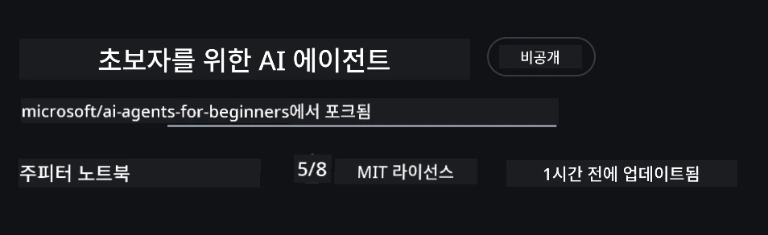
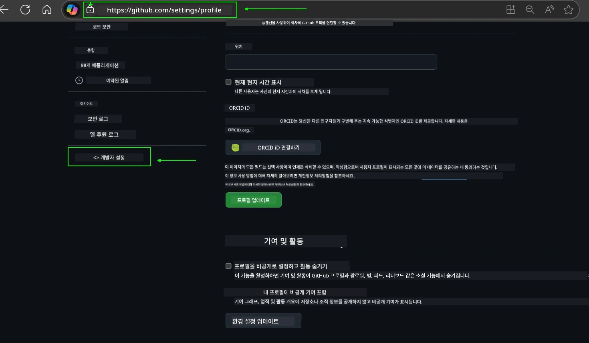
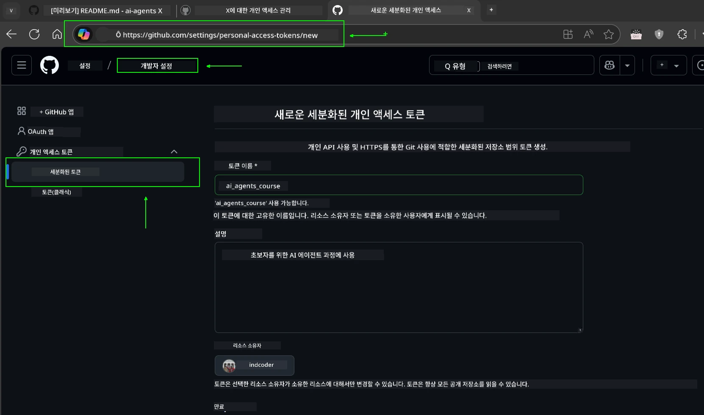
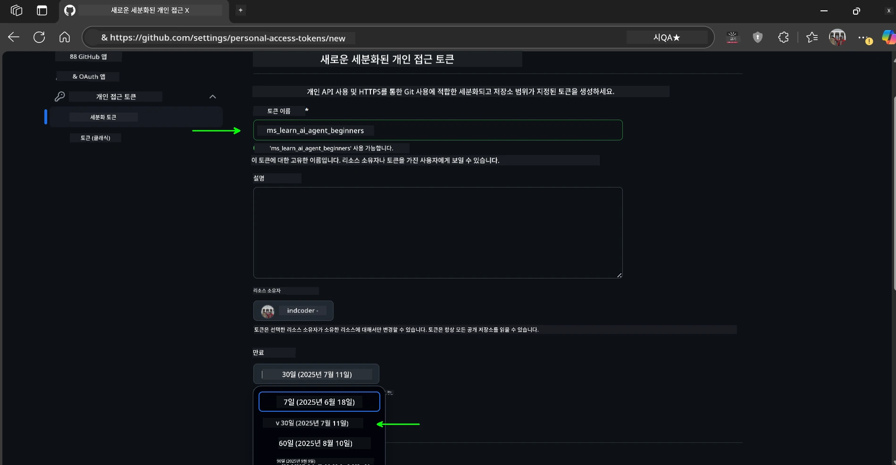
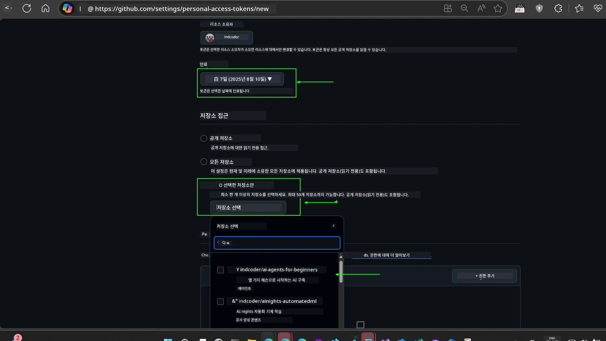
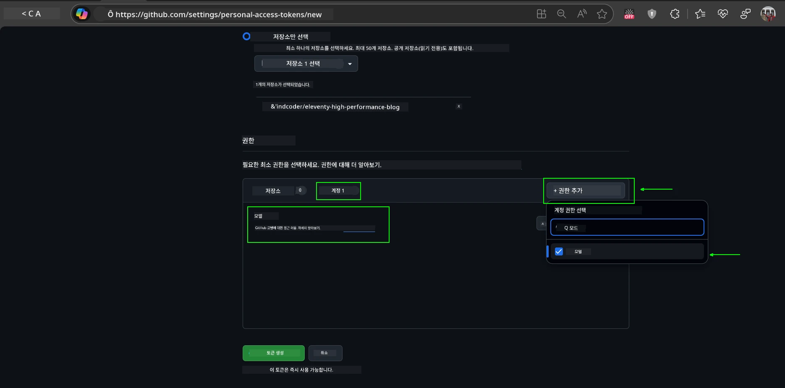
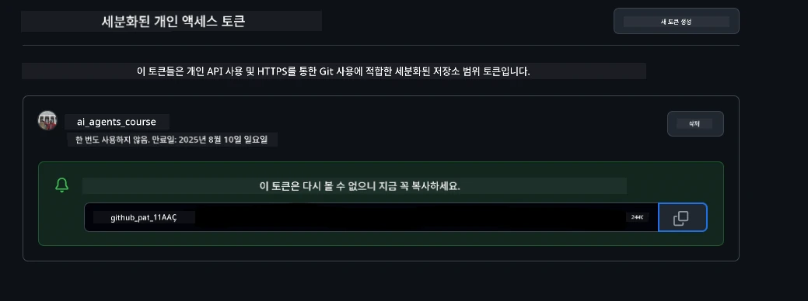
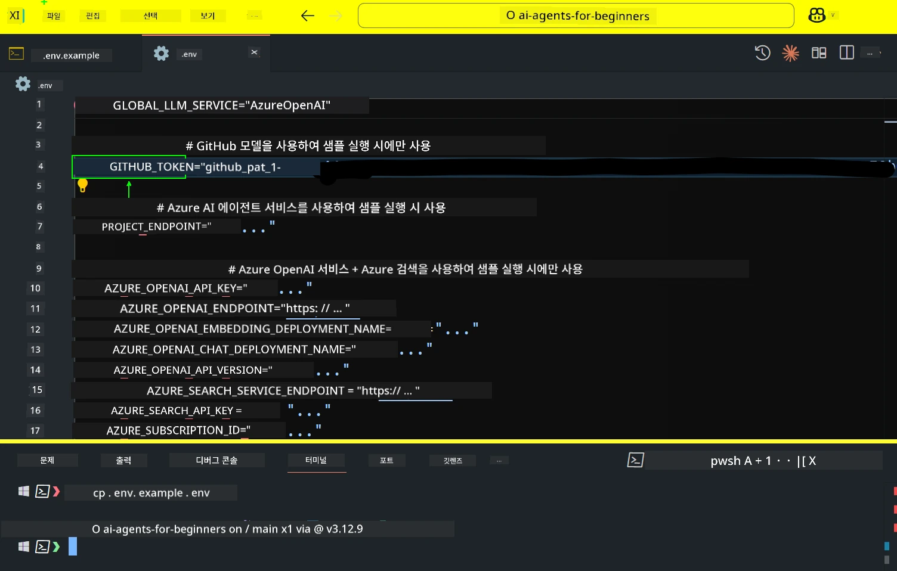
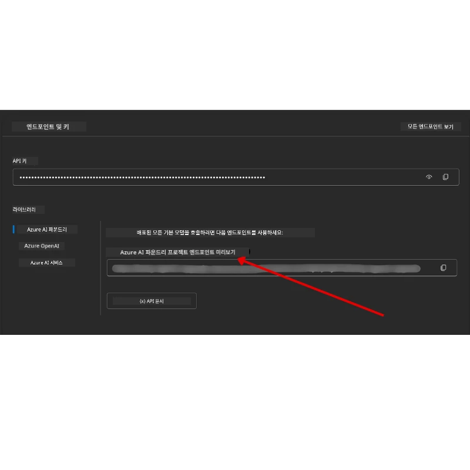

<!--
CO_OP_TRANSLATOR_METADATA:
{
  "original_hash": "63b1a8f6e840df15934935b728e569f0",
  "translation_date": "2025-12-03T14:03:06+00:00",
  "source_file": "00-course-setup/README.md",
  "language_code": "ko"
}
-->
# 과정 설정

## 소개

이 강의에서는 코드 샘플을 실행하는 방법을 다룹니다.

## 다른 학습자들과 소통하고 도움받기

저장소를 복제하기 전에 [AI Agents For Beginners Discord 채널](https://aka.ms/ai-agents/discord)에 가입하세요. 설정에 대한 도움을 받거나, 강의에 대한 질문을 하거나, 다른 학습자들과 소통할 수 있습니다.

## 이 저장소 복제 또는 포크하기

먼저 GitHub 저장소를 복제하거나 포크하세요. 이렇게 하면 강의 자료의 개인 버전을 만들어 코드를 실행하고, 테스트하고, 수정할 수 있습니다!

<a href="https://github.com/microsoft/ai-agents-for-beginners/fork" target="_blank">저장소 포크하기</a> 링크를 클릭하여 진행하세요.

이제 아래 링크에서 이 강의의 포크된 버전을 확인할 수 있습니다:



### 얕은 복제 (워크숍 / Codespaces에 권장)

  > 전체 저장소는 전체 기록과 모든 파일을 다운로드할 경우 크기가 클 수 있습니다 (~3GB). 워크숍에 참석하거나 몇 개의 강의 폴더만 필요한 경우, 얕은 복제(또는 희소 복제)를 통해 대부분의 다운로드를 피할 수 있습니다.

#### 빠른 얕은 복제 — 최소 기록, 모든 파일

아래 명령에서 `<your-username>`을 포크 URL(또는 선호하는 경우 업스트림 URL)로 바꾸세요.

최신 커밋 기록만 복제하려면(작은 다운로드):

```bash|powershell
git clone --depth 1 https://github.com/<your-username>/ai-agents-for-beginners.git
```

특정 브랜치를 복제하려면:

```bash|powershell
git clone --depth 1 --branch <branch-name> https://github.com/<your-username>/ai-agents-for-beginners.git
```

#### 부분(희소) 복제 — 최소 블롭 + 선택된 폴더만

이 방법은 부분 복제와 희소 체크아웃을 사용합니다(Git 2.25+ 필요, 부분 복제 지원이 있는 최신 Git 권장):

```bash|powershell
git clone --depth 1 --filter=blob:none --sparse https://github.com/<your-username>/ai-agents-for-beginners.git
```

저장소 폴더로 이동:

```bash|powershell
cd ai-agents-for-beginners
```

그런 다음 원하는 폴더를 지정하세요(아래 예는 두 개의 폴더를 보여줍니다):

```bash|powershell
git sparse-checkout set 00-course-setup 01-intro-to-ai-agents
```

파일을 복제하고 확인한 후, 파일만 필요하고 공간을 확보하려면(기록 없음), 저장소 메타데이터를 삭제하세요(💀되돌릴 수 없음 — 모든 Git 기능을 잃게 됩니다: 커밋, 풀, 푸시 또는 기록 액세스 불가).

```bash
# zsh/bash
rm -rf .git
```

```powershell
# 파워셸
Remove-Item -Recurse -Force .git
```

#### GitHub Codespaces 사용 (로컬 대규모 다운로드 방지를 위해 권장)

- [GitHub UI](https://github.com/codespaces)를 통해 이 저장소에 대한 새 Codespace를 만드세요.  

- 새로 생성된 Codespace의 터미널에서 위의 얕은/희소 복제 명령 중 하나를 실행하여 필요한 강의 폴더만 Codespace 작업 공간으로 가져오세요.
- 선택 사항: Codespaces 내부에서 복제한 후, .git을 제거하여 추가 공간을 확보하세요(위의 제거 명령 참조).
- 참고: 저장소를 Codespaces에서 직접 열기를 선호하는 경우(추가 복제 없이), Codespaces는 devcontainer 환경을 구성하며 여전히 필요 이상을 프로비저닝할 수 있습니다. 새 Codespace 내부에서 얕은 복사를 수행하면 디스크 사용량을 더 잘 제어할 수 있습니다.

#### 팁

- 편집/커밋하려면 항상 복제 URL을 포크로 교체하세요.
- 나중에 더 많은 기록이나 파일이 필요하면 가져오거나 희소 체크아웃을 조정하여 추가 폴더를 포함할 수 있습니다.

## 코드 실행하기

이 강의는 AI 에이전트를 구축하는 실습 경험을 제공하는 일련의 Jupyter 노트북을 제공합니다.

코드 샘플은 다음을 사용합니다:

**GitHub 계정 필요 - 무료**:

1) Semantic Kernel Agent Framework + GitHub Models Marketplace. (semantic-kernel.ipynb로 표시됨)
2) AutoGen Framework + GitHub Models Marketplace. (autogen.ipynb로 표시됨)

**Azure 구독 필요**:

3) Azure AI Foundry + Azure AI Agent Service. (azureaiagent.ipynb로 표시됨)

세 가지 예제를 모두 시도해 보시길 권장합니다. 어떤 것이 가장 적합한지 확인해 보세요.

선택한 옵션에 따라 아래의 설정 단계를 따르세요:

## 요구 사항

- Python 3.12+
  - **참고**: Python3.12가 설치되어 있지 않다면 설치하세요. 그런 다음 python3.12를 사용하여 venv를 생성하여 requirements.txt 파일에서 올바른 버전을 설치하세요.
  
    >예시

    Python venv 디렉토리 생성:

    ```bash|powershell
    python -m venv venv
    ```

    그런 다음 venv 환경 활성화:

    ```bash
    # zsh/bash
    source venv/bin/activate
    ```
  
    ```dos
    # Command Prompt for Windows
    venv\Scripts\activate
    ```

- .NET 10+: .NET을 사용하는 샘플 코드를 위해 [.NET 10 SDK](https://dotnet.microsoft.com/download/dotnet/10.0) 이상을 설치하세요. 그런 다음 설치된 .NET SDK 버전을 확인하세요:

    ```bash|powershell
    dotnet --list-sdks
    ```

- GitHub 계정 - GitHub Models Marketplace에 액세스하기 위해 필요
- Azure 구독 - Azure AI Foundry에 액세스하기 위해 필요
- Azure AI Foundry 계정 - Azure AI Agent Service에 액세스하기 위해 필요

이 저장소의 루트에 있는 `requirements.txt` 파일에는 코드 샘플을 실행하는 데 필요한 모든 Python 패키지가 포함되어 있습니다.

다음 명령을 저장소 루트에서 터미널에 실행하여 설치할 수 있습니다:

```bash|powershell
pip install -r requirements.txt
```

Python 가상 환경을 생성하여 충돌 및 문제를 방지하는 것을 권장합니다.

## VSCode 설정

VSCode에서 올바른 Python 버전을 사용하고 있는지 확인하세요.


## GitHub Models 샘플 설정

### 1단계: GitHub 개인 액세스 토큰(PAT) 가져오기

이 강의는 GitHub Models Marketplace를 활용하여 대형 언어 모델(LLM)에 무료로 액세스할 수 있도록 합니다. 이를 통해 AI 에이전트를 구축할 수 있습니다.

GitHub Models를 사용하려면 [GitHub 개인 액세스 토큰](https://docs.github.com/en/authentication/keeping-your-account-and-data-secure/managing-your-personal-access-tokens)을 생성해야 합니다.

GitHub 계정의 <a href="https://github.com/settings/personal-access-tokens" target="_blank">개인 액세스 토큰 설정</a>으로 이동하여 생성할 수 있습니다.

토큰을 생성할 때 [최소 권한 원칙](https://docs.github.com/en/get-started/learning-to-code/storing-your-secrets-safely)을 따르세요. 즉, 이 강의의 코드 샘플을 실행하는 데 필요한 권한만 부여해야 합니다.

1. 화면 왼쪽의 **개발자 설정**으로 이동하여 `세분화된 토큰` 옵션을 선택하세요.

   

   그런 다음 `새 토큰 생성`을 선택하세요.

   

2. 나중에 쉽게 식별할 수 있도록 토큰의 목적을 반영하는 설명적인 이름을 입력하세요.

    🔐 토큰 기간 추천

    추천 기간: 30일  
    더 안전한 설정을 원한다면 7일과 같은 짧은 기간을 선택할 수 있습니다 🛡️  
    이는 학습 동력을 유지하며 강의를 완료하는 데 좋은 목표가 될 수 있습니다 🚀.

    

3. 토큰의 범위를 이 저장소의 포크로 제한하세요.

    

4. 토큰의 권한을 제한하세요: **권한** 아래에서 **계정** 탭을 클릭하고 "+ 권한 추가" 버튼을 클릭하세요. 드롭다운이 나타납니다. **모델**을 검색하고 해당 상자를 선택하세요.

    

5. 토큰을 생성하기 전에 필요한 권한을 확인하세요. 

6. 토큰을 생성하기 전에 비밀번호 관리자 금고와 같은 안전한 장소에 토큰을 저장할 준비가 되었는지 확인하세요. 생성 후에는 다시 표시되지 않습니다. 

방금 생성한 새 토큰을 복사하세요. 이제 이 강의에 포함된 `.env` 파일에 추가합니다.

### 2단계: `.env` 파일 생성

터미널에서 다음 명령을 실행하여 `.env` 파일을 생성하세요.

```bash
# zsh/bash
cp .env.example .env
```

```powershell
# 파워셸
Copy-Item .env.example .env
```

이 명령은 예제 파일을 복사하여 `.env` 파일을 디렉토리에 생성하며, 환경 변수 값을 입력할 수 있습니다.

복사한 토큰을 열어 선호하는 텍스트 편집기에서 `.env` 파일을 열고 `GITHUB_TOKEN` 필드에 붙여넣으세요.



이제 이 강의의 코드 샘플을 실행할 수 있습니다.

## Azure AI Foundry 및 Azure AI Agent Service 샘플 설정

### 1단계: Azure 프로젝트 엔드포인트 가져오기

Azure AI Foundry에서 허브와 프로젝트를 생성하는 단계는 여기에서 확인하세요: [허브 리소스 개요](https://learn.microsoft.com/azure/ai-foundry/concepts/ai-resources)

프로젝트를 생성한 후, 프로젝트의 연결 문자열을 가져와야 합니다.

이는 Azure AI Foundry 포털의 **개요** 페이지에서 확인할 수 있습니다.



### 2단계: `.env` 파일 생성

터미널에서 다음 명령을 실행하여 `.env` 파일을 생성하세요.

```bash
# zsh/bash
cp .env.example .env
```

```powershell
# 파워셸
Copy-Item .env.example .env
```

이 명령은 예제 파일을 복사하여 `.env` 파일을 디렉토리에 생성하며, 환경 변수 값을 입력할 수 있습니다.

복사한 토큰을 열어 선호하는 텍스트 편집기에서 `.env` 파일을 열고 `PROJECT_ENDPOINT` 필드에 붙여넣으세요.

### 3단계: Azure에 로그인

보안 모범 사례로, Microsoft Entra ID를 사용하여 Azure OpenAI에 [키리스 인증](https://learn.microsoft.com/azure/developer/ai/keyless-connections?tabs=csharp%2Cazure-cli?WT.mc_id=academic-105485-koreyst)을 사용할 것입니다.

다음으로 터미널을 열고 `az login --use-device-code`를 실행하여 Azure 계정에 로그인하세요.

로그인한 후 터미널에서 구독을 선택하세요.

## 추가 환경 변수 - Azure Search 및 Azure OpenAI 

에이전틱 RAG 강의 - 강의 5 -에서는 Azure Search 및 Azure OpenAI를 사용하는 샘플이 포함되어 있습니다.

이 샘플을 실행하려면 `.env` 파일에 다음 환경 변수를 추가해야 합니다:

### 개요 페이지 (프로젝트)

- `AZURE_SUBSCRIPTION_ID` - 프로젝트의 **개요** 페이지에서 **프로젝트 세부 정보**를 확인하세요.

- `AZURE_AI_PROJECT_NAME` - 프로젝트의 **개요** 페이지 상단을 확인하세요.

- `AZURE_OPENAI_SERVICE` - **개요** 페이지의 **포함된 기능** 탭에서 **Azure OpenAI Service**를 확인하세요.

### 관리 센터

- `AZURE_OPENAI_RESOURCE_GROUP` - **관리 센터**의 **개요** 페이지에서 **프로젝트 속성**으로 이동하세요.

- `GLOBAL_LLM_SERVICE` - **연결된 리소스** 아래에서 **Azure AI Services** 연결 이름을 찾으세요. 나열되지 않은 경우, 리소스 그룹의 AI Services 리소스 이름을 Azure 포털에서 확인하세요.

### 모델 + 엔드포인트 페이지

- `AZURE_OPENAI_EMBEDDING_DEPLOYMENT_NAME` - 임베딩 모델(예: `text-embedding-ada-002`)을 선택하고 모델 세부 정보에서 **배포 이름**을 확인하세요.

- `AZURE_OPENAI_CHAT_DEPLOYMENT_NAME` - 채팅 모델(예: `gpt-4o-mini`)을 선택하고 모델 세부 정보에서 **배포 이름**을 확인하세요.

### Azure 포털

- `AZURE_OPENAI_ENDPOINT` - **Azure AI 서비스**를 찾아 클릭한 다음, **리소스 관리**, **키 및 엔드포인트**로 이동하여 "Azure OpenAI 엔드포인트"에서 "언어 API"를 복사하세요.

- `AZURE_OPENAI_API_KEY` - 동일한 화면에서 KEY 1 또는 KEY 2를 복사하세요.

- `AZURE_SEARCH_SERVICE_ENDPOINT` - **Azure AI Search** 리소스를 찾아 클릭한 다음 **개요**를 확인하세요.

- `AZURE_SEARCH_API_KEY` - 그런 다음 **설정**으로 이동하여 **키**에서 기본 또는 보조 관리자 키를 복사하세요.

### 외부 웹페이지

- `AZURE_OPENAI_API_VERSION` - [API 버전 수명 주기](https://learn.microsoft.com/azure/ai-services/openai/api-version-deprecation#latest-ga-api-release) 페이지에서 **최신 GA API 릴리스**를 확인하세요.

### 키리스 인증 설정

자격 증명을 하드코딩하는 대신, Azure OpenAI와 키리스 연결을 사용합니다. 이를 위해 `DefaultAzureCredential`을 가져오고 나중에 `DefaultAzureCredential` 함수를 호출하여 자격 증명을 가져옵니다.

```python
# 파이썬
from azure.identity import DefaultAzureCredential, InteractiveBrowserCredential
```

## 어디에서 막히셨나요?
이 설정을 실행하는 데 문제가 있다면, <a href="https://discord.gg/kzRShWzttr" target="_blank">Azure AI 커뮤니티 Discord</a>에 참여하거나 <a href="https://github.com/microsoft/ai-agents-for-beginners/issues?WT.mc_id=academic-105485-koreyst" target="_blank">이슈를 생성</a>하세요.

## 다음 강의

이제 이 강좌의 코드를 실행할 준비가 되었습니다. AI 에이전트의 세계에 대해 더 많이 배우는 즐거운 시간을 보내세요!

[AI 에이전트와 에이전트 사용 사례 소개](../01-intro-to-ai-agents/README.md)

---

<!-- CO-OP TRANSLATOR DISCLAIMER START -->
**면책 조항**:  
이 문서는 AI 번역 서비스 [Co-op Translator](https://github.com/Azure/co-op-translator)를 사용하여 번역되었습니다. 정확성을 위해 노력하고 있지만, 자동 번역에는 오류나 부정확성이 포함될 수 있습니다. 원본 문서를 해당 언어로 작성된 상태에서 권위 있는 자료로 간주해야 합니다. 중요한 정보의 경우, 전문적인 인간 번역을 권장합니다. 이 번역 사용으로 인해 발생하는 오해나 잘못된 해석에 대해 당사는 책임을 지지 않습니다.
<!-- CO-OP TRANSLATOR DISCLAIMER END -->