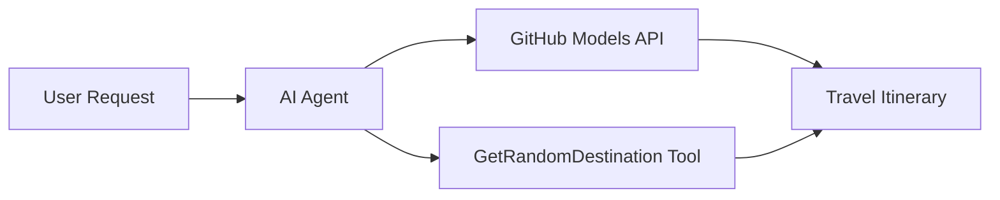

<!--
CO_OP_TRANSLATOR_METADATA:
{
  "original_hash": "5f351412e934f0833c8c821a0a60efaf",
  "translation_date": "2025-11-13T11:34:36+00:00",
  "source_file": "01-intro-to-ai-agents/code_samples/01-dotnet-agent-framework.md",
  "language_code": "ko"
}
-->
# 🌍 Microsoft Agent Framework (.NET)을 활용한 AI 여행 에이전트

## 📋 시나리오 개요

이 예제는 Microsoft Agent Framework for .NET을 사용하여 지능형 여행 계획 에이전트를 구축하는 방법을 보여줍니다. 이 에이전트는 전 세계의 랜덤 목적지에 대해 개인화된 당일 여행 일정을 자동으로 생성할 수 있습니다.

### 주요 기능:

- 🎲 **랜덤 목적지 선택**: 휴양지를 선택하는 커스텀 도구 사용
- 🗺️ **지능형 여행 계획**: 상세한 일별 일정 생성
- 🔄 **실시간 스트리밍**: 즉각적이고 스트리밍 응답 지원
- 🛠️ **커스텀 도구 통합**: 에이전트 기능 확장 방법 시연

## 🔧 기술 아키텍처

### 핵심 기술

- **Microsoft Agent Framework**: AI 에이전트 개발을 위한 최신 .NET 구현
- **GitHub Models 통합**: GitHub의 AI 모델 추론 서비스 사용
- **OpenAI API 호환성**: 커스텀 엔드포인트와 함께 OpenAI 클라이언트 라이브러리 활용
- **보안 구성**: 환경 기반 API 키 관리

### 주요 구성 요소

1. **AIAgent**: 대화 흐름을 관리하는 주요 에이전트 오케스트레이터
2. **커스텀 도구**: 에이전트가 사용할 수 있는 `GetRandomDestination()` 함수
3. **채팅 클라이언트**: GitHub Models 기반 대화 인터페이스
4. **스트리밍 지원**: 실시간 응답 생성 기능

### 통합 패턴



## 🚀 시작하기

### 사전 준비 사항

- [.NET 10 SDK](https://dotnet.microsoft.com/download/dotnet/10.0) 이상
- [GitHub Models API 액세스 토큰](https://docs.github.com/github-models/github-models-at-scale/using-your-own-api-keys-in-github-models)

### 필수 환경 변수

```bash
# zsh/bash
export GH_TOKEN=<your_github_token>
export GH_ENDPOINT=https://models.github.ai/inference
export GH_MODEL_ID=openai/gpt-5-mini
```

```powershell
# PowerShell
$env:GH_TOKEN = "<your_github_token>"
$env:GH_ENDPOINT = "https://models.github.ai/inference"
$env:GH_MODEL_ID = "openai/gpt-5-mini"
```

### 샘플 코드

코드 예제를 실행하려면,

```bash
# zsh/bash
chmod +x ./01-dotnet-agent-framework.cs
./01-dotnet-agent-framework.cs
```

또는 dotnet CLI를 사용하여:

```bash
dotnet run ./01-dotnet-agent-framework.cs
```

전체 코드는 [`01-dotnet-agent-framework.cs`](../../../../01-intro-to-ai-agents/code_samples/01-dotnet-agent-framework.cs)에서 확인할 수 있습니다.

```csharp
#!/usr/bin/dotnet run

#:package Microsoft.Extensions.AI@9.*
#:package Microsoft.Agents.AI.OpenAI@1.*-*

using System.ClientModel;
using System.ComponentModel;

using Microsoft.Agents.AI;
using Microsoft.Extensions.AI;

using OpenAI;

// Tool Function: Random Destination Generator
// This static method will be available to the agent as a callable tool
// The [Description] attribute helps the AI understand when to use this function
// This demonstrates how to create custom tools for AI agents
[Description("Provides a random vacation destination.")]
static string GetRandomDestination()
{
    // List of popular vacation destinations around the world
    // The agent will randomly select from these options
    var destinations = new List<string>
    {
        "Paris, France",
        "Tokyo, Japan",
        "New York City, USA",
        "Sydney, Australia",
        "Rome, Italy",
        "Barcelona, Spain",
        "Cape Town, South Africa",
        "Rio de Janeiro, Brazil",
        "Bangkok, Thailand",
        "Vancouver, Canada"
    };

    // Generate random index and return selected destination
    // Uses System.Random for simple random selection
    var random = new Random();
    int index = random.Next(destinations.Count);
    return destinations[index];
}

// Extract configuration from environment variables
// Retrieve the GitHub Models API endpoint, defaults to https://models.github.ai/inference if not specified
// Retrieve the model ID, defaults to openai/gpt-5-mini if not specified
// Retrieve the GitHub token for authentication, throws exception if not specified
var github_endpoint = Environment.GetEnvironmentVariable("GH_ENDPOINT") ?? "https://models.github.ai/inference";
var github_model_id = Environment.GetEnvironmentVariable("GH_MODEL_ID") ?? "openai/gpt-5-mini";
var github_token = Environment.GetEnvironmentVariable("GH_TOKEN") ?? throw new InvalidOperationException("GH_TOKEN is not set.");

// Configure OpenAI Client Options
// Create configuration options to point to GitHub Models endpoint
// This redirects OpenAI client calls to GitHub's model inference service
var openAIOptions = new OpenAIClientOptions()
{
    Endpoint = new Uri(github_endpoint)
};

// Initialize OpenAI Client with GitHub Models Configuration
// Create OpenAI client using GitHub token for authentication
// Configure it to use GitHub Models endpoint instead of OpenAI directly
var openAIClient = new OpenAIClient(new ApiKeyCredential(github_token), openAIOptions);

// Create AI Agent with Travel Planning Capabilities
// Initialize OpenAI client, get chat client for specified model, and create AI agent
// Configure agent with travel planning instructions and random destination tool
// The agent can now plan trips using the GetRandomDestination function
AIAgent agent = openAIClient
    .GetChatClient(github_model_id)
    .CreateAIAgent(
        instructions: "You are a helpful AI Agent that can help plan vacations for customers at random destinations",
        tools: [AIFunctionFactory.Create(GetRandomDestination)]
    );

// Execute Agent: Plan a Day Trip
// Run the agent with streaming enabled for real-time response display
// Shows the agent's thinking and response as it generates the content
// Provides better user experience with immediate feedback
await foreach (var update in agent.RunStreamingAsync("Plan me a day trip"))
{
    await Task.Delay(10);
    Console.Write(update);
}
```

## 🎓 주요 학습 내용

1. **에이전트 아키텍처**: Microsoft Agent Framework는 .NET에서 AI 에이전트를 구축하기 위한 깔끔하고 타입 안전한 접근 방식을 제공합니다.
2. **도구 통합**: `[Description]` 속성으로 장식된 함수는 에이전트가 사용할 수 있는 도구로 제공됩니다.
3. **구성 관리**: 환경 변수와 보안 자격 증명 처리는 .NET의 모범 사례를 따릅니다.
4. **OpenAI 호환성**: GitHub Models 통합은 OpenAI 호환 API를 통해 원활하게 작동합니다.

## 🔗 추가 자료

- [Microsoft Agent Framework 문서](https://learn.microsoft.com/agent-framework)
- [GitHub Models 마켓플레이스](https://github.com/marketplace?type=models)
- [Microsoft.Extensions.AI](https://learn.microsoft.com/dotnet/ai/microsoft-extensions-ai)
- [.NET 단일 파일 앱](https://devblogs.microsoft.com/dotnet/announcing-dotnet-run-app)

---

<!-- CO-OP TRANSLATOR DISCLAIMER START -->
**면책 조항**:  
이 문서는 AI 번역 서비스 [Co-op Translator](https://github.com/Azure/co-op-translator)를 사용하여 번역되었습니다. 정확성을 위해 노력하고 있지만, 자동 번역에는 오류나 부정확성이 포함될 수 있습니다. 원본 문서를 해당 언어로 작성된 상태에서 권위 있는 자료로 간주해야 합니다. 중요한 정보의 경우, 전문적인 인간 번역을 권장합니다. 이 번역 사용으로 인해 발생하는 오해나 잘못된 해석에 대해 당사는 책임을 지지 않습니다.
<!-- CO-OP TRANSLATOR DISCLAIMER END -->