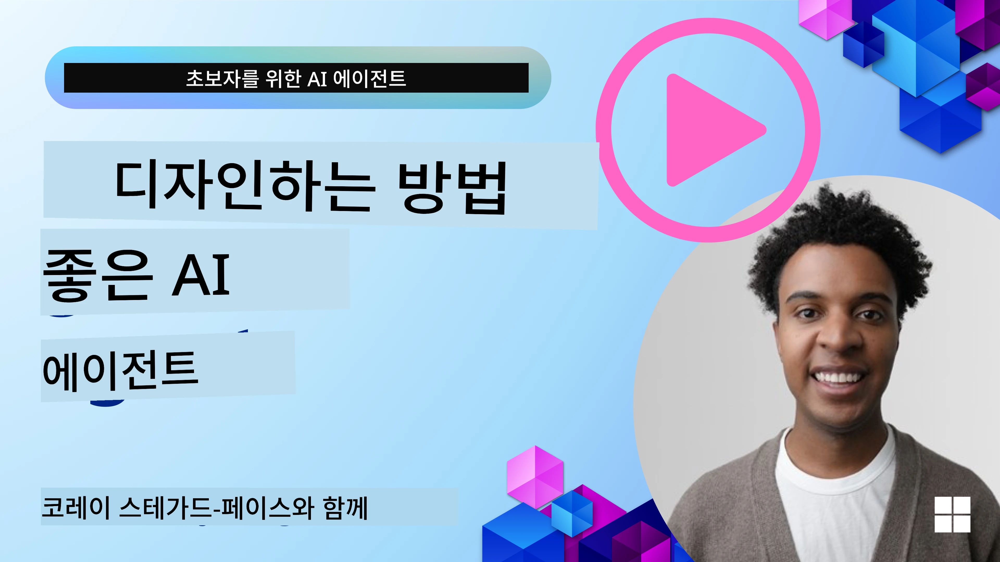
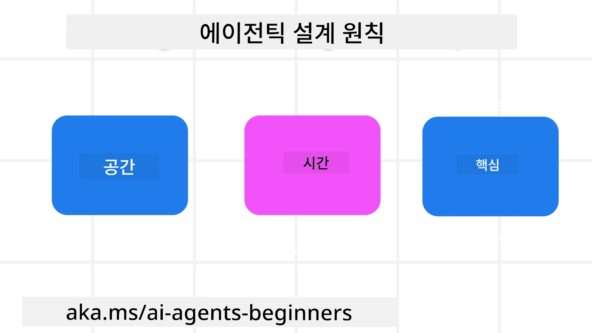

<!--
CO_OP_TRANSLATOR_METADATA:
{
  "original_hash": "d71524fe83a23829ae7a23b4031aaac8",
  "translation_date": "2025-11-13T11:36:36+00:00",
  "source_file": "03-agentic-design-patterns/README.md",
  "language_code": "ko"
}
-->

> _(위 이미지를 클릭하면 이 강의의 영상을 볼 수 있습니다)_
# AI 에이전트 설계 원칙

## 소개

AI 에이전트 시스템을 구축하는 방법에는 여러 가지가 있습니다. 생성형 AI 설계에서 모호성이 버그가 아닌 기능이라는 점을 고려할 때, 엔지니어들이 어디서부터 시작해야 할지 어려움을 겪는 경우가 많습니다. 우리는 개발자가 고객 중심의 에이전트 시스템을 구축하여 비즈니스 요구를 해결할 수 있도록 인간 중심의 UX 설계 원칙을 만들었습니다. 이 설계 원칙은 규정된 아키텍처가 아니라 에이전트 경험을 정의하고 구축하려는 팀을 위한 출발점입니다.

일반적으로 에이전트는 다음을 수행해야 합니다:

- 인간의 능력을 확장하고 규모를 확대합니다 (브레인스토밍, 문제 해결, 자동화 등).
- 지식 격차를 메웁니다 (지식 도메인에 대한 이해, 번역 등).
- 우리가 다른 사람들과 협력하는 방식을 촉진하고 지원합니다.
- 우리를 더 나은 버전으로 만듭니다 (예: 라이프 코치/작업 관리자, 감정 조절 및 마음챙김 기술 학습 지원, 회복력 구축 등).

## 이 강의에서 다룰 내용

- 에이전트 설계 원칙이란 무엇인가
- 이러한 설계 원칙을 구현할 때 따라야 할 지침
- 설계 원칙을 사용하는 몇 가지 예시

## 학습 목표

이 강의를 완료한 후, 여러분은 다음을 할 수 있습니다:

1. 에이전트 설계 원칙이 무엇인지 설명할 수 있습니다.
2. 에이전트 설계 원칙을 사용하는 지침을 설명할 수 있습니다.
3. 에이전트 설계 원칙을 사용하여 에이전트를 구축하는 방법을 이해할 수 있습니다.

## 에이전트 설계 원칙

### 에이전트 (공간)

이것은 에이전트가 작동하는 환경입니다. 이러한 원칙은 물리적 및 디지털 세계에서 에이전트를 설계하는 방법에 대한 정보를 제공합니다.

- **연결, 단절이 아닌 연결** – 사람들을 다른 사람, 이벤트, 실행 가능한 지식과 연결하여 협업과 연결을 가능하게 합니다.
  - 에이전트는 이벤트, 지식, 사람들을 연결합니다.
  - 에이전트는 사람들을 더 가까이 연결합니다. 사람을 대체하거나 폄하하도록 설계되지 않았습니다.
- **쉽게 접근 가능하지만 때로는 보이지 않음** – 에이전트는 주로 배경에서 작동하며 관련성과 적절성에 따라 우리를 살짝 자극합니다.
  - 에이전트는 모든 기기나 플랫폼에서 권한이 있는 사용자가 쉽게 발견하고 접근할 수 있습니다.
  - 에이전트는 다중 모드 입력 및 출력(소리, 음성, 텍스트 등)을 지원합니다.
  - 에이전트는 사용자 요구를 감지하여 전경과 배경, 능동적과 반응적 상태 간에 원활하게 전환할 수 있습니다.
  - 에이전트는 보이지 않는 형태로 작동할 수 있지만, 배경 프로세스 경로와 다른 에이전트와의 협업은 사용자에게 투명하고 제어 가능합니다.

### 에이전트 (시간)

이것은 에이전트가 시간에 따라 작동하는 방식입니다. 이러한 원칙은 과거, 현재, 미래를 가로지르는 에이전트 상호작용을 설계하는 방법에 대한 정보를 제공합니다.

- **과거**: 상태와 컨텍스트를 포함한 역사를 반영합니다.
  - 에이전트는 이벤트, 사람, 상태뿐만 아니라 더 풍부한 역사적 데이터를 분석하여 더 관련성 높은 결과를 제공합니다.
  - 에이전트는 과거 이벤트에서 연결을 생성하고 현재 상황에 참여하기 위해 기억을 적극적으로 반영합니다.
- **현재**: 알림보다는 자극을 제공합니다.
  - 에이전트는 사람들과 상호작용하는 포괄적인 접근 방식을 구현합니다. 이벤트가 발생하면 에이전트는 정적 알림이나 기타 정적 형식성을 넘어섭니다. 에이전트는 흐름을 간소화하거나 동적으로 큐를 생성하여 적절한 순간에 사용자의 주의를 끌 수 있습니다.
  - 에이전트는 컨텍스트 환경, 사회적 및 문화적 변화에 따라 정보를 제공하며 사용자 의도에 맞게 조정됩니다.
  - 에이전트 상호작용은 점진적이고, 장기적으로 사용자를 강화하기 위해 복잡성이 진화/성장할 수 있습니다.
- **미래**: 적응하고 진화합니다.
  - 에이전트는 다양한 기기, 플랫폼 및 모달리티에 적응합니다.
  - 에이전트는 사용자 행동, 접근성 요구에 적응하며 자유롭게 사용자화할 수 있습니다.
  - 에이전트는 지속적인 사용자 상호작용을 통해 형성되고 진화합니다.

### 에이전트 (핵심)

이것은 에이전트 설계의 핵심 요소들입니다.

- **불확실성을 수용하되 신뢰를 구축합니다**.
  - 에이전트 설계에서 일정 수준의 불확실성은 예상됩니다. 불확실성은 에이전트 설계의 핵심 요소입니다.
  - 신뢰와 투명성은 에이전트 설계의 기본 계층입니다.
  - 에이전트가 켜져 있거나 꺼져 있는 시점은 인간이 제어하며 에이전트 상태는 항상 명확하게 표시됩니다.

## 이러한 원칙을 구현하기 위한 지침

이전 설계 원칙을 사용할 때 다음 지침을 따르세요:

1. **투명성**: AI가 관여하고 있다는 사실, 작동 방식(과거 행동 포함), 피드백 제공 및 시스템 수정 방법을 사용자에게 알립니다.
2. **제어**: 사용자가 시스템과 속성을 사용자화하고, 선호도를 지정하며, 개인화할 수 있도록 하고(잊을 수 있는 기능 포함) 시스템에 대한 제어권을 제공합니다.
3. **일관성**: 기기와 엔드포인트 전반에 걸쳐 일관된 다중 모드 경험을 목표로 합니다. 가능한 경우 친숙한 UI/UX 요소를 사용하고(예: 음성 상호작용을 위한 마이크 아이콘) 고객의 인지적 부담을 최대한 줄이세요(예: 간결한 응답, 시각적 도움, '자세히 알아보기' 콘텐츠).

## 이러한 원칙과 지침을 사용하여 여행 에이전트 설계 방법

여행 에이전트를 설계한다고 가정해보세요. 설계 원칙과 지침을 사용하는 방법은 다음과 같습니다:

1. **투명성** – 여행 에이전트가 AI 기반 에이전트임을 사용자에게 알립니다. 시작하는 방법에 대한 기본 지침을 제공합니다(예: "안녕하세요" 메시지, 샘플 프롬프트). 제품 페이지에 이를 명확히 문서화합니다. 사용자가 과거에 요청한 프롬프트 목록을 표시합니다. 피드백을 제공하는 방법(좋아요/싫어요, 피드백 보내기 버튼 등)을 명확히 합니다. 에이전트가 사용 제한이나 주제 제한이 있는 경우 이를 명확히 설명합니다.
2. **제어** – 에이전트가 생성된 후 수정하는 방법(예: 시스템 프롬프트)을 사용자에게 명확히 합니다. 에이전트의 상세도, 작성 스타일, 에이전트가 다루지 말아야 할 주제에 대한 제한을 선택할 수 있도록 합니다. 관련 파일이나 데이터, 프롬프트, 과거 대화를 보고 삭제할 수 있도록 합니다.
3. **일관성** – 프롬프트 공유, 파일 또는 사진 추가, 누군가 또는 무언가를 태그하는 아이콘이 표준적이고 인식 가능하도록 합니다. 에이전트와 파일 업로드/공유를 나타내는 클립 아이콘과 그래픽 업로드를 나타내는 이미지 아이콘을 사용합니다.

## 샘플 코드

- Python: [에이전트 프레임워크](./code_samples/03-python-agent-framework.ipynb)
- .NET: [에이전트 프레임워크](./code_samples/03-dotnet-agent-framework.md)

## AI 에이전트 설계 패턴에 대한 추가 질문이 있나요?

[Azure AI Foundry Discord](https://aka.ms/ai-agents/discord)에 참여하여 다른 학습자들과 만나고, 오피스 아워에 참석하며 AI 에이전트에 대한 질문을 해결하세요.

## 추가 자료

- <a href="https://openai.com" target="_blank">에이전트 AI 시스템 관리 실습 | OpenAI</a>
- <a href="https://microsoft.com" target="_blank">HAX Toolkit 프로젝트 - Microsoft Research</a>
- <a href="https://responsibleaitoolbox.ai" target="_blank">Responsible AI Toolbox</a>

## 이전 강의

[에이전트 프레임워크 탐구](../02-explore-agentic-frameworks/README.md)

## 다음 강의

[도구 사용 설계 패턴](../04-tool-use/README.md)

---

<!-- CO-OP TRANSLATOR DISCLAIMER START -->
**면책 조항**:  
이 문서는 AI 번역 서비스 [Co-op Translator](https://github.com/Azure/co-op-translator)를 사용하여 번역되었습니다. 정확성을 위해 노력하고 있지만, 자동 번역에는 오류나 부정확성이 포함될 수 있습니다. 원본 문서를 해당 언어로 작성된 상태에서 권위 있는 자료로 간주해야 합니다. 중요한 정보의 경우, 전문적인 인간 번역을 권장합니다. 이 번역 사용으로 인해 발생하는 오해나 잘못된 해석에 대해 당사는 책임을 지지 않습니다.
<!-- CO-OP TRANSLATOR DISCLAIMER END -->