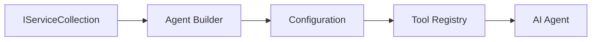

<!--
CO_OP_TRANSLATOR_METADATA:
{
  "original_hash": "bcc874e190347bd6a095aed56dc16de8",
  "translation_date": "2025-11-13T11:37:19+00:00",
  "source_file": "03-agentic-design-patterns/code_samples/03-dotnet-agent-framework.md",
  "language_code": "ko"
}
-->
# 🎨 GitHub 모델과 함께하는 에이전트 디자인 패턴 (.NET)

## 📋 학습 목표

이 예제는 Microsoft Agent Framework를 사용하여 .NET에서 GitHub 모델을 통합한 지능형 에이전트를 구축하기 위한 엔터프라이즈급 디자인 패턴을 보여줍니다. 에이전트를 프로덕션 준비 상태로 만들고, 유지 관리 가능하며, 확장 가능한 전문적인 패턴과 아키텍처 접근 방식을 배울 수 있습니다.

### 엔터프라이즈 디자인 패턴

- 🏭 **팩토리 패턴**: 의존성 주입을 통한 표준화된 에이전트 생성
- 🔧 **빌더 패턴**: 유연한 에이전트 구성 및 설정
- 🧵 **스레드 안전 패턴**: 동시 대화 관리
- 📋 **리포지토리 패턴**: 도구 및 기능 관리의 체계화

## 🎯 .NET 특화 아키텍처 이점

### 엔터프라이즈 기능

- **강력한 타입 지정**: 컴파일 시 유효성 검사 및 IntelliSense 지원
- **의존성 주입**: 내장 DI 컨테이너 통합
- **구성 관리**: IConfiguration 및 Options 패턴
- **Async/Await**: 일급 비동기 프로그래밍 지원

### 프로덕션 준비 패턴

- **로깅 통합**: ILogger 및 구조적 로깅 지원
- **헬스 체크**: 내장 모니터링 및 진단
- **구성 유효성 검사**: 데이터 주석을 활용한 강력한 타입 지정
- **에러 처리**: 구조화된 예외 관리

## 🔧 기술 아키텍처

### 핵심 .NET 구성 요소

- **Microsoft.Extensions.AI**: 통합 AI 서비스 추상화
- **Microsoft.Agents.AI**: 엔터프라이즈 에이전트 오케스트레이션 프레임워크
- **GitHub 모델 통합**: 고성능 API 클라이언트 패턴
- **구성 시스템**: appsettings.json 및 환경 통합

### 디자인 패턴 구현



## 🏗️ 구현된 엔터프라이즈 패턴

### 1. **생성 패턴**

- **에이전트 팩토리**: 일관된 구성으로 중앙 집중화된 에이전트 생성
- **빌더 패턴**: 복잡한 에이전트 구성을 위한 유연한 API
- **싱글톤 패턴**: 공유 리소스 및 구성 관리
- **의존성 주입**: 느슨한 결합 및 테스트 가능성

### 2. **행동 패턴**

- **전략 패턴**: 교체 가능한 도구 실행 전략
- **커맨드 패턴**: 실행 취소/재실행이 가능한 에이전트 작업 캡슐화
- **옵저버 패턴**: 이벤트 기반 에이전트 생명주기 관리
- **템플릿 메서드**: 표준화된 에이전트 실행 워크플로

### 3. **구조 패턴**

- **어댑터 패턴**: GitHub 모델 API 통합 계층
- **데코레이터 패턴**: 에이전트 기능 확장
- **퍼사드 패턴**: 간소화된 에이전트 상호작용 인터페이스
- **프록시 패턴**: 성능을 위한 지연 로딩 및 캐싱

## 📚 .NET 디자인 원칙

### SOLID 원칙

- **단일 책임 원칙**: 각 구성 요소는 명확한 목적을 가짐
- **개방/폐쇄 원칙**: 수정 없이 확장 가능
- **리스코프 치환 원칙**: 인터페이스 기반 도구 구현
- **인터페이스 분리 원칙**: 집중적이고 응집력 있는 인터페이스
- **의존성 역전 원칙**: 구체화가 아닌 추상화에 의존

### 클린 아키텍처

- **도메인 계층**: 핵심 에이전트 및 도구 추상화
- **애플리케이션 계층**: 에이전트 오케스트레이션 및 워크플로
- **인프라 계층**: GitHub 모델 통합 및 외부 서비스
- **프레젠테이션 계층**: 사용자 상호작용 및 응답 포맷팅

## 🔒 엔터프라이즈 고려사항

### 보안

- **자격 증명 관리**: IConfiguration을 사용한 안전한 API 키 처리
- **입력 유효성 검사**: 강력한 타입 지정 및 데이터 주석 유효성 검사
- **출력 정화**: 안전한 응답 처리 및 필터링
- **감사 로깅**: 포괄적인 작업 추적

### 성능

- **비동기 패턴**: 비차단 I/O 작업
- **연결 풀링**: 효율적인 HTTP 클라이언트 관리
- **캐싱**: 성능 향상을 위한 응답 캐싱
- **리소스 관리**: 적절한 해제 및 정리 패턴

### 확장성

- **스레드 안전성**: 동시 에이전트 실행 지원
- **리소스 풀링**: 효율적인 리소스 활용
- **부하 관리**: 속도 제한 및 역압 처리
- **모니터링**: 성능 메트릭 및 헬스 체크

## 🚀 프로덕션 배포

- **구성 관리**: 환경별 설정
- **로깅 전략**: 상관 ID를 활용한 구조적 로깅
- **에러 처리**: 적절한 복구를 포함한 전역 예외 처리
- **모니터링**: 애플리케이션 인사이트 및 성능 카운터
- **테스트**: 단위 테스트, 통합 테스트 및 부하 테스트 패턴

.NET으로 엔터프라이즈급 지능형 에이전트를 구축할 준비가 되셨나요? 견고한 아키텍처를 설계해 봅시다! 🏢✨

## 🚀 시작하기

### 사전 요구 사항

- [.NET 10 SDK](https://dotnet.microsoft.com/download/dotnet/10.0) 이상
- [GitHub 모델 API 액세스 토큰](https://docs.github.com/github-models/github-models-at-scale/using-your-own-api-keys-in-github-models)

### 필요한 환경 변수

```bash
# zsh/bash
export GH_TOKEN=<your_github_token>
export GH_ENDPOINT=https://models.github.ai/inference
export GH_MODEL_ID=openai/gpt-5-mini
```

```powershell
# PowerShell
$env:GH_TOKEN = "<your_github_token>"
$env:GH_ENDPOINT = "https://models.github.ai/inference"
$env:GH_MODEL_ID = "openai/gpt-5-mini"
```

### 샘플 코드

코드 예제를 실행하려면,

```bash
# zsh/bash
chmod +x ./03-dotnet-agent-framework.cs
./03-dotnet-agent-framework.cs
```

또는 dotnet CLI를 사용하여:

```bash
dotnet run ./03-dotnet-agent-framework.cs
```

전체 코드는 [`03-dotnet-agent-framework.cs`](../../../../03-agentic-design-patterns/code_samples/03-dotnet-agent-framework.cs)에서 확인하세요.

```csharp
#!/usr/bin/dotnet run

#:package Microsoft.Extensions.AI@10.*
#:package Microsoft.Agents.AI.OpenAI@1.*-*

using System.ClientModel;
using System.ComponentModel;

using Microsoft.Agents.AI;
using Microsoft.Extensions.AI;

using OpenAI;

// Tool Function: Random Destination Generator
// This static method will be available to the agent as a callable tool
// The [Description] attribute helps the AI understand when to use this function
// This demonstrates how to create custom tools for AI agents
[Description("Provides a random vacation destination.")]
static string GetRandomDestination()
{
    // List of popular vacation destinations around the world
    // The agent will randomly select from these options
    var destinations = new List<string>
    {
        "Paris, France",
        "Tokyo, Japan",
        "New York City, USA",
        "Sydney, Australia",
        "Rome, Italy",
        "Barcelona, Spain",
        "Cape Town, South Africa",
        "Rio de Janeiro, Brazil",
        "Bangkok, Thailand",
        "Vancouver, Canada"
    };

    // Generate random index and return selected destination
    // Uses System.Random for simple random selection
    var random = new Random();
    int index = random.Next(destinations.Count);
    return destinations[index];
}

// Extract configuration from environment variables
// Retrieve the GitHub Models API endpoint, defaults to https://models.github.ai/inference if not specified
// Retrieve the model ID, defaults to openai/gpt-5-mini if not specified
// Retrieve the GitHub token for authentication, throws exception if not specified
var github_endpoint = Environment.GetEnvironmentVariable("GH_ENDPOINT") ?? "https://models.github.ai/inference";
var github_model_id = Environment.GetEnvironmentVariable("GH_MODEL_ID") ?? "openai/gpt-5-mini";
var github_token = Environment.GetEnvironmentVariable("GH_TOKEN") ?? throw new InvalidOperationException("GH_TOKEN is not set.");

// Configure OpenAI Client Options
// Create configuration options to point to GitHub Models endpoint
// This redirects OpenAI client calls to GitHub's model inference service
var openAIOptions = new OpenAIClientOptions()
{
    Endpoint = new Uri(github_endpoint)
};

// Initialize OpenAI Client with GitHub Models Configuration
// Create OpenAI client using GitHub token for authentication
// Configure it to use GitHub Models endpoint instead of OpenAI directly
var openAIClient = new OpenAIClient(new ApiKeyCredential(github_token), openAIOptions);

// Define Agent Identity and Comprehensive Instructions
// Agent name for identification and logging purposes
var AGENT_NAME = "TravelAgent";

// Detailed instructions that define the agent's personality, capabilities, and behavior
// This system prompt shapes how the agent responds and interacts with users
var AGENT_INSTRUCTIONS = """
You are a helpful AI Agent that can help plan vacations for customers.

Important: When users specify a destination, always plan for that location. Only suggest random destinations when the user hasn't specified a preference.

When the conversation begins, introduce yourself with this message:
"Hello! I'm your TravelAgent assistant. I can help plan vacations and suggest interesting destinations for you. Here are some things you can ask me:
1. Plan a day trip to a specific location
2. Suggest a random vacation destination
3. Find destinations with specific features (beaches, mountains, historical sites, etc.)
4. Plan an alternative trip if you don't like my first suggestion

What kind of trip would you like me to help you plan today?"

Always prioritize user preferences. If they mention a specific destination like "Bali" or "Paris," focus your planning on that location rather than suggesting alternatives.
""";

// Create AI Agent with Advanced Travel Planning Capabilities
// Initialize complete agent pipeline: OpenAI client → Chat client → AI agent
// Configure agent with name, detailed instructions, and available tools
// This demonstrates the .NET agent creation pattern with full configuration
AIAgent agent = openAIClient
    .GetChatClient(github_model_id)
    .CreateAIAgent(
        name: AGENT_NAME,
        instructions: AGENT_INSTRUCTIONS,
        tools: [AIFunctionFactory.Create(GetRandomDestination)]
    );

// Create New Conversation Thread for Context Management
// Initialize a new conversation thread to maintain context across multiple interactions
// Threads enable the agent to remember previous exchanges and maintain conversational state
// This is essential for multi-turn conversations and contextual understanding
AgentThread thread = agent.GetNewThread();

// Execute Agent: First Travel Planning Request
// Run the agent with an initial request that will likely trigger the random destination tool
// The agent will analyze the request, use the GetRandomDestination tool, and create an itinerary
// Using the thread parameter maintains conversation context for subsequent interactions
await foreach (var update in agent.RunStreamingAsync("Plan me a day trip", thread))
{
    await Task.Delay(10);
    Console.Write(update);
}

Console.WriteLine();

// Execute Agent: Follow-up Request with Context Awareness
// Demonstrate contextual conversation by referencing the previous response
// The agent remembers the previous destination suggestion and will provide an alternative
// This showcases the power of conversation threads and contextual understanding in .NET agents
await foreach (var update in agent.RunStreamingAsync("I don't like that destination. Plan me another vacation.", thread))
{
    await Task.Delay(10);
    Console.Write(update);
}
```

---

<!-- CO-OP TRANSLATOR DISCLAIMER START -->
**면책 조항**:  
이 문서는 AI 번역 서비스 [Co-op Translator](https://github.com/Azure/co-op-translator)를 사용하여 번역되었습니다. 정확성을 위해 노력하고 있지만, 자동 번역에는 오류나 부정확성이 포함될 수 있습니다. 원본 문서를 해당 언어로 작성된 상태에서 권위 있는 자료로 간주해야 합니다. 중요한 정보의 경우, 전문적인 인간 번역을 권장합니다. 이 번역 사용으로 인해 발생하는 오해나 잘못된 해석에 대해 당사는 책임을 지지 않습니다.
<!-- CO-OP TRANSLATOR DISCLAIMER END -->