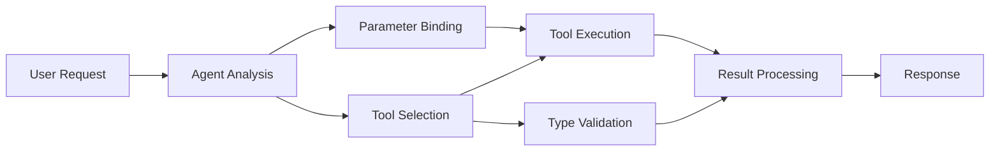

<!--
CO_OP_TRANSLATOR_METADATA:
{
  "original_hash": "91d6061e402489603f2ec8b528cae59b",
  "translation_date": "2025-11-18T16:57:24+00:00",
  "source_file": "04-tool-use/code_samples/04-dotnet-agent-framework.md",
  "language_code": "ko"
}
-->
# 🛠️ GitHub 모델을 활용한 고급 도구 사용 (.NET)

## 📋 학습 목표

이 노트북은 Microsoft Agent Framework를 사용하여 GitHub 모델과 통합하는 엔터프라이즈급 도구 통합 패턴을 보여줍니다. C#의 강력한 타입과 .NET의 엔터프라이즈 기능을 활용하여 여러 전문화된 도구를 갖춘 정교한 에이전트를 구축하는 방법을 배울 수 있습니다.

### 마스터할 고급 도구 기능

- 🔧 **다중 도구 아키텍처**: 여러 전문화된 기능을 갖춘 에이전트 구축
- 🎯 **타입 안전한 도구 실행**: C#의 컴파일 타임 검증 활용
- 📊 **엔터프라이즈 도구 패턴**: 프로덕션 준비된 도구 설계 및 오류 처리
- 🔗 **도구 구성**: 복잡한 비즈니스 워크플로를 위한 도구 결합

## 🎯 .NET 도구 아키텍처의 이점

### 엔터프라이즈 도구 기능

- **컴파일 타임 검증**: 강력한 타입으로 도구 매개변수의 정확성 보장
- **의존성 주입**: IoC 컨테이너를 활용한 도구 관리
- **Async/Await 패턴**: 적절한 리소스 관리를 통한 비차단 도구 실행
- **구조화된 로깅**: 도구 실행 모니터링을 위한 내장 로깅 통합

### 프로덕션 준비된 패턴

- **예외 처리**: 타입화된 예외를 활용한 포괄적인 오류 관리
- **리소스 관리**: 적절한 폐기 패턴 및 메모리 관리
- **성능 모니터링**: 내장된 메트릭 및 성능 카운터
- **구성 관리**: 검증이 포함된 타입 안전한 구성

## 🔧 기술 아키텍처

### 핵심 .NET 도구 구성 요소

- **Microsoft.Extensions.AI**: 통합된 도구 추상화 계층
- **Microsoft.Agents.AI**: 엔터프라이즈급 도구 오케스트레이션
- **GitHub 모델 통합**: 연결 풀링을 지원하는 고성능 API 클라이언트

### 도구 실행 파이프라인



## 🛠️ 도구 카테고리 및 패턴

### 1. **데이터 처리 도구**

- **입력 검증**: 데이터 주석을 활용한 강력한 타입
- **변환 작업**: 타입 안전한 데이터 변환 및 포맷팅
- **비즈니스 로직**: 도메인별 계산 및 분석 도구
- **출력 포맷팅**: 구조화된 응답 생성

### 2. **통합 도구**

- **API 커넥터**: HttpClient를 활용한 RESTful 서비스 통합
- **데이터베이스 도구**: Entity Framework를 활용한 데이터 액세스
- **파일 작업**: 검증을 포함한 안전한 파일 시스템 작업
- **외부 서비스**: 서드파티 서비스 통합 패턴

### 3. **유틸리티 도구**

- **텍스트 처리**: 문자열 조작 및 포맷팅 유틸리티
- **날짜/시간 작업**: 문화권을 고려한 날짜/시간 계산
- **수학적 도구**: 정밀 계산 및 통계 작업
- **검증 도구**: 비즈니스 규칙 검증 및 데이터 확인

엔터프라이즈급 에이전트를 강력하고 타입 안전한 도구 기능으로 구축할 준비가 되셨나요? 전문적인 솔루션을 설계해봅시다! 🏢⚡

## 🚀 시작하기

### 사전 준비 사항

- [.NET 10 SDK](https://dotnet.microsoft.com/download/dotnet/10.0) 이상
- [GitHub 모델 API 액세스 토큰](https://docs.github.com/github-models/github-models-at-scale/using-your-own-api-keys-in-github-models)

### 필요한 환경 변수

```bash
# zsh/bash
export GH_TOKEN=<your_github_token>
export GH_ENDPOINT=https://models.github.ai/inference
export GH_MODEL_ID=openai/gpt-5-mini
```

```powershell
# PowerShell
$env:GH_TOKEN = "<your_github_token>"
$env:GH_ENDPOINT = "https://models.github.ai/inference"
$env:GH_MODEL_ID = "openai/gpt-5-mini"
```

### 샘플 코드

코드 예제를 실행하려면,

```bash
# zsh/bash
chmod +x ./04-dotnet-agent-framework.cs
./04-dotnet-agent-framework.cs
```

또는 dotnet CLI를 사용하여:

```bash
dotnet run ./04-dotnet-agent-framework.cs
```

전체 코드는 [`04-dotnet-agent-framework.cs`](../../../../04-tool-use/code_samples/04-dotnet-agent-framework.cs)를 참조하세요.

```csharp
#!/usr/bin/dotnet run

#:package Microsoft.Extensions.AI@10.*
#:package Microsoft.Agents.AI.OpenAI@1.*-*

using System.ClientModel;
using System.ComponentModel;

using Microsoft.Agents.AI;
using Microsoft.Extensions.AI;

using OpenAI;

// Tool Function: Random Destination Generator
// This static method will be available to the agent as a callable tool
// The [Description] attribute helps the AI understand when to use this function
// This demonstrates how to create custom tools for AI agents
[Description("Provides a random vacation destination.")]
static string GetRandomDestination()
{
    // List of popular vacation destinations around the world
    // The agent will randomly select from these options
    var destinations = new List<string>
    {
        "Paris, France",
        "Tokyo, Japan",
        "New York City, USA",
        "Sydney, Australia",
        "Rome, Italy",
        "Barcelona, Spain",
        "Cape Town, South Africa",
        "Rio de Janeiro, Brazil",
        "Bangkok, Thailand",
        "Vancouver, Canada"
    };

    // Generate random index and return selected destination
    // Uses System.Random for simple random selection
    var random = new Random();
    int index = random.Next(destinations.Count);
    return destinations[index];
}

// Extract configuration from environment variables
// Retrieve the GitHub Models API endpoint, defaults to https://models.github.ai/inference if not specified
// Retrieve the model ID, defaults to openai/gpt-5-mini if not specified
// Retrieve the GitHub token for authentication, throws exception if not specified
var github_endpoint = Environment.GetEnvironmentVariable("GH_ENDPOINT") ?? "https://models.github.ai/inference";
var github_model_id = Environment.GetEnvironmentVariable("GH_MODEL_ID") ?? "openai/gpt-5-mini";
var github_token = Environment.GetEnvironmentVariable("GH_TOKEN") ?? throw new InvalidOperationException("GH_TOKEN is not set.");

// Configure OpenAI Client Options
// Create configuration options to point to GitHub Models endpoint
// This redirects OpenAI client calls to GitHub's model inference service
var openAIOptions = new OpenAIClientOptions()
{
    Endpoint = new Uri(github_endpoint)
};

// Initialize OpenAI Client with GitHub Models Configuration
// Create OpenAI client using GitHub token for authentication
// Configure it to use GitHub Models endpoint instead of OpenAI directly
var openAIClient = new OpenAIClient(new ApiKeyCredential(github_token), openAIOptions);

// Define Agent Identity and Comprehensive Instructions
// Agent name for identification and logging purposes
var AGENT_NAME = "TravelAgent";

// Detailed instructions that define the agent's personality, capabilities, and behavior
// This system prompt shapes how the agent responds and interacts with users
var AGENT_INSTRUCTIONS = """
You are a helpful AI Agent that can help plan vacations for customers.

Important: When users specify a destination, always plan for that location. Only suggest random destinations when the user hasn't specified a preference.

When the conversation begins, introduce yourself with this message:
"Hello! I'm your TravelAgent assistant. I can help plan vacations and suggest interesting destinations for you. Here are some things you can ask me:
1. Plan a day trip to a specific location
2. Suggest a random vacation destination
3. Find destinations with specific features (beaches, mountains, historical sites, etc.)
4. Plan an alternative trip if you don't like my first suggestion

What kind of trip would you like me to help you plan today?"

Always prioritize user preferences. If they mention a specific destination like "Bali" or "Paris," focus your planning on that location rather than suggesting alternatives.
""";

// Create AI Agent with Advanced Travel Planning Capabilities
// Initialize complete agent pipeline: OpenAI client → Chat client → AI agent
// Configure agent with name, detailed instructions, and available tools
// This demonstrates the .NET agent creation pattern with full configuration
AIAgent agent = openAIClient
    .GetChatClient(github_model_id)
    .CreateAIAgent(
        name: AGENT_NAME,
        instructions: AGENT_INSTRUCTIONS,
        tools: [AIFunctionFactory.Create(GetRandomDestination)]
    );

// Create New Conversation Thread for Context Management
// Initialize a new conversation thread to maintain context across multiple interactions
// Threads enable the agent to remember previous exchanges and maintain conversational state
// This is essential for multi-turn conversations and contextual understanding
AgentThread thread = agent.GetNewThread();

// Execute Agent: First Travel Planning Request
// Run the agent with an initial request that will likely trigger the random destination tool
// The agent will analyze the request, use the GetRandomDestination tool, and create an itinerary
// Using the thread parameter maintains conversation context for subsequent interactions
await foreach (var update in agent.RunStreamingAsync("Plan me a day trip", thread))
{
    await Task.Delay(10);
    Console.Write(update);
}

Console.WriteLine();

// Execute Agent: Follow-up Request with Context Awareness
// Demonstrate contextual conversation by referencing the previous response
// The agent remembers the previous destination suggestion and will provide an alternative
// This showcases the power of conversation threads and contextual understanding in .NET agents
await foreach (var update in agent.RunStreamingAsync("I don't like that destination. Plan me another vacation.", thread))
{
    await Task.Delay(10);
    Console.Write(update);
}
```

---

<!-- CO-OP TRANSLATOR DISCLAIMER START -->
**면책 조항**:  
이 문서는 AI 번역 서비스 [Co-op Translator](https://github.com/Azure/co-op-translator)를 사용하여 번역되었습니다. 정확성을 위해 노력하고 있지만, 자동 번역에는 오류나 부정확성이 포함될 수 있습니다. 원본 문서를 해당 언어로 작성된 상태에서 권위 있는 자료로 간주해야 합니다. 중요한 정보의 경우, 전문적인 인간 번역을 권장합니다. 이 번역 사용으로 인해 발생하는 오해나 잘못된 해석에 대해 책임을 지지 않습니다.
<!-- CO-OP TRANSLATOR DISCLAIMER END -->