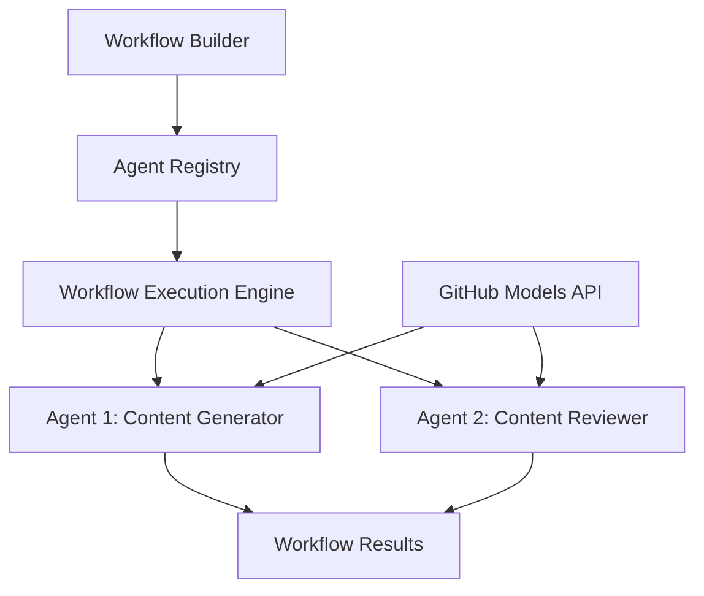

<!--
CO_OP_TRANSLATOR_METADATA:
{
  "original_hash": "034158688d0a45aae06dcbb21b0da5ae",
  "translation_date": "2025-11-11T12:44:01+00:00",
  "source_file": "08-multi-agent/code_samples/workflows-agent-framework/dotNET/01.dotnet-agent-framework-workflow-ghmodel-basic.md",
  "language_code": "ko"
}
-->
# 🔄 GitHub 모델을 활용한 기본 에이전트 워크플로우 (.NET)

## 📋 워크플로우 오케스트레이션 튜토리얼

이 노트북은 Microsoft Agent Framework for .NET과 GitHub 모델을 사용하여 정교한 **에이전트 워크플로우**를 구축하는 방법을 보여줍니다. AI 에이전트가 협력하여 구조화된 오케스트레이션 패턴을 통해 복잡한 작업을 수행하는 다단계 비즈니스 프로세스를 만드는 방법을 배울 수 있습니다.

## 🎯 학습 목표

### 🏗️ **워크플로우 아키텍처 기본**
- **워크플로우 빌더**: 복잡한 다단계 AI 프로세스를 설계하고 오케스트레이션
- **에이전트 협업**: 워크플로우 내에서 여러 전문 에이전트를 조정
- **GitHub 모델 통합**: 워크플로우에서 GitHub의 AI 모델 추론 서비스를 활용
- **시각적 워크플로우 설계**: 워크플로우 구조를 이해하기 쉽게 설계하고 시각화

### 🔄 **프로세스 오케스트레이션 패턴**
- **순차 처리**: 여러 에이전트 작업을 논리적 순서로 연결
- **상태 관리**: 워크플로우 단계 간의 컨텍스트와 데이터 흐름 유지
- **오류 처리**: 강력한 오류 복구 및 워크플로우 복원력 구현
- **성능 최적화**: 엔터프라이즈 규모 운영을 위한 효율적인 워크플로우 설계

### 🏢 **엔터프라이즈 워크플로우 응용**
- **비즈니스 프로세스 자동화**: 복잡한 조직 워크플로우 자동화
- **콘텐츠 제작 파이프라인**: 검토 및 승인 단계를 포함한 편집 워크플로우
- **고객 서비스 자동화**: 다단계 고객 문의 해결
- **데이터 처리 워크플로우**: AI 기반 변환을 포함한 ETL 워크플로우

## ⚙️ 사전 준비 및 설정

### 📦 **필수 NuGet 패키지**

이 워크플로우 데모는 여러 주요 .NET 패키지를 사용합니다:

```xml
<!-- Core AI Framework -->
<PackageReference Include="Microsoft.Extensions.AI" Version="9.9.0" />

<!-- Agent Framework (Local Development) -->
<!-- Microsoft.Agents.AI.dll - Core agent abstractions -->
<!-- Microsoft.Agents.AI.OpenAI.dll - OpenAI/GitHub Models integration -->

<!-- Configuration and Environment -->
<PackageReference Include="DotNetEnv" Version="3.1.1" />
```

### 🔑 **GitHub 모델 설정**

**환경 설정 (.env 파일):**
```env
GITHUB_TOKEN=your_github_personal_access_token
GITHUB_ENDPOINT=https://models.inference.ai.azure.com
GITHUB_MODEL_ID=gpt-4o-mini
```

**GitHub 모델 액세스:**
1. GitHub 모델에 가입 (현재 프리뷰 상태)
2. 모델 액세스 권한이 있는 개인 액세스 토큰 생성
3. 위에 표시된 대로 환경 변수를 구성

### 🏗️ **워크플로우 아키텍처 개요**



**핵심 구성 요소:**
- **WorkflowBuilder**: 워크플로우 설계를 위한 주요 오케스트레이션 엔진
- **AIAgent**: 특정 기능을 가진 개별 전문 에이전트
- **GitHub Models Client**: AI 모델 추론 서비스 통합
- **Execution Context**: 워크플로우 단계 간 상태와 데이터 흐름 관리

## 🎨 **엔터프라이즈 워크플로우 설계 패턴**

### 📝 **콘텐츠 제작 워크플로우**
```
User Request → Content Generation → Quality Review → Final Output
```

### 🔍 **문서 처리 파이프라인**
```
Document Input → Analysis → Extraction → Validation → Structured Output
```

### 💼 **비즈니스 인텔리전스 워크플로우**
```
Data Collection → Processing → Analysis → Report Generation → Distribution
```

### 🤝 **고객 서비스 자동화**
```
Customer Inquiry → Classification → Processing → Response Generation → Follow-up
```

## 🏢 **엔터프라이즈 혜택**

### 🎯 **신뢰성 및 확장성**
- **결정론적 실행**: 일관되고 반복 가능한 워크플로우 결과
- **오류 복구**: 워크플로우 단계에서 발생하는 실패를 우아하게 처리
- **성능 모니터링**: 실행 메트릭 추적 및 최적화 기회 파악
- **자원 관리**: AI 모델 자원의 효율적인 할당 및 활용

### 🔒 **보안 및 준수**
- **안전한 인증**: API 액세스를 위한 GitHub 토큰 기반 인증
- **감사 기록**: 워크플로우 실행 및 의사 결정 지점의 완전한 로깅
- **액세스 제어**: 워크플로우 실행 및 모니터링에 대한 세분화된 권한
- **데이터 프라이버시**: 워크플로우 전반에 걸쳐 민감한 정보의 안전한 처리

### 📊 **가시성 및 관리**
- **시각적 워크플로우 설계**: 프로세스 흐름 및 종속성의 명확한 표현
- **실행 모니터링**: 워크플로우 진행 상황 및 성능의 실시간 추적
- **오류 보고**: 상세한 오류 분석 및 디버깅 기능
- **성능 분석**: 최적화 및 용량 계획을 위한 메트릭

첫 번째 엔터프라이즈 준비 AI 워크플로우를 만들어 봅시다! 🚀

## 💻 코드 실행

전체 구현은 `01.dotnet-agent-framework-workflow-ghmodel-basic.cs` 파일에 있습니다. 이 파일은 다음을 보여줍니다:

1. **환경 설정** - `.env` 파일에서 GitHub 모델 자격 증명 로드
2. **OpenAI 클라이언트 설정** - GitHub 모델 엔드포인트를 사용하도록 클라이언트 구성
3. **에이전트 생성** - 전문 에이전트 정의 (Front Desk 및 Concierge)
4. **워크플로우 빌더** - 순차 처리로 다중 에이전트 워크플로우 생성
5. **워크플로우 실행** - 스트리밍 결과로 워크플로우 실행

### 🚀 예제 실행

```bash
# Make the script executable (Unix/Linux/macOS)
chmod +x 01.dotnet-agent-framework-workflow-ghmodel-basic.cs

# Run the workflow
./01.dotnet-agent-framework-workflow-ghmodel-basic.cs
```

Windows에서 실행:
```powershell
dotnet run 01.dotnet-agent-framework-workflow-ghmodel-basic.cs
```

### 📝 예상 출력

워크플로우는 다음을 수행합니다:
1. 여행 목적지 요청을 수락 ("파리에 가고 싶습니다")
2. Front Desk 에이전트가 초기 추천을 제공합니다
3. Concierge 에이전트가 추천을 검토하고 개선합니다
4. 최종 출력은 전체 대화 스트림을 표시합니다

### 🔧 커스터마이징

워크플로우를 다음과 같이 커스터마이징할 수 있습니다:
- 에이전트 지침을 수정하여 행동 변경
- 더 많은 에이전트를 추가하여 복잡한 다단계 워크플로우 생성
- 사용자 메시지를 변경하여 다양한 시나리오 테스트
- 워크플로우 엣지를 조정하여 다른 실행 패턴 생성

---

<!-- CO-OP TRANSLATOR DISCLAIMER START -->
**면책 조항**:  
이 문서는 AI 번역 서비스 [Co-op Translator](https://github.com/Azure/co-op-translator)를 사용하여 번역되었습니다. 정확성을 위해 최선을 다하고 있지만, 자동 번역에는 오류나 부정확성이 포함될 수 있습니다. 원본 문서의 원어 버전을 권위 있는 출처로 간주해야 합니다. 중요한 정보의 경우, 전문적인 인간 번역을 권장합니다. 이 번역 사용으로 인해 발생하는 오해나 잘못된 해석에 대해 책임을 지지 않습니다.
<!-- CO-OP TRANSLATOR DISCLAIMER END -->