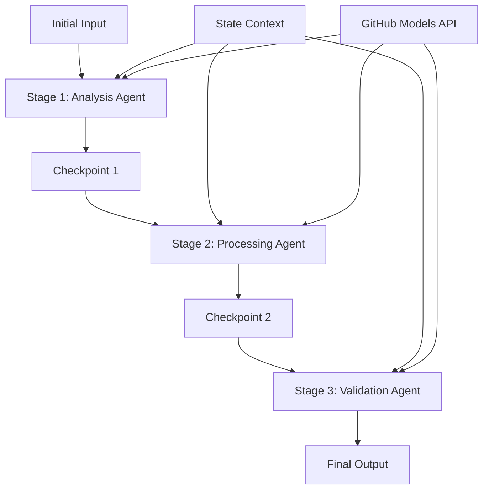

<!--
CO_OP_TRANSLATOR_METADATA:
{
  "original_hash": "1be9c8dcbd79a02d33d2c138684c1394",
  "translation_date": "2025-11-11T13:45:40+00:00",
  "source_file": "08-multi-agent/code_samples/workflows-agent-framework/dotNET/02.dotnet-agent-framework-workflow-ghmodel-sequential.md",
  "language_code": "ko"
}
-->
# ⏩ GitHub 모델(.NET)을 활용한 순차적 에이전트 워크플로우

## 📋 고급 순차 처리 튜토리얼

이 노트북은 Microsoft Agent Framework for .NET과 GitHub 모델을 사용하여 **순차적 워크플로우 패턴**을 구현하는 방법을 보여줍니다. 에이전트가 특정 순서로 실행되며 각 단계가 이전 단계의 결과를 기반으로 구축되는 정교한 단계별 처리 파이프라인을 만드는 방법을 배울 수 있습니다.

## 🎯 학습 목표

### 🔄 **순차 처리 아키텍처**
- **선형 워크플로우 설계**: 명확한 의존성을 가진 단계별 처리 파이프라인 생성
- **상태 관리**: 순차적 워크플로우 단계 간의 컨텍스트와 데이터 흐름 유지
- **GitHub 모델 통합**: GitHub의 AI 모델을 다단계 .NET 워크플로우에 활용
- **엔터프라이즈 파이프라인 패턴**: 실무에 적합한 순차 처리 시스템 구축

### 🏗️ **고급 순차 패턴**
- **스테이지 게이트 처리**: 워크플로우 단계 간의 검증 체크포인트 구현
- **컨텍스트 유지**: 모든 단계에서 상태와 축적된 지식을 유지
- **오류 전파**: 순차 처리 체인에서 실패를 우아하게 처리
- **성능 최적화**: 최소한의 오버헤드로 효율적인 순차 실행

### 🏢 **엔터프라이즈 순차 애플리케이션**
- **문서 처리 파이프라인**: 다단계 문서 분석, 변환 및 검증
- **품질 보증 워크플로우**: 순차적 검토, 검증 및 승인 프로세스
- **콘텐츠 제작 파이프라인**: 연구 → 작성 → 편집 → 검토 → 출판
- **비즈니스 프로세스 자동화**: 명확한 단계 의존성을 가진 다단계 비즈니스 워크플로우

## ⚙️ 사전 준비 및 설정

### 📦 **필수 NuGet 패키지**

.NET 순차 워크플로우에 필요한 필수 패키지:

```xml
<!-- Core AI Framework -->
<PackageReference Include="Microsoft.Extensions.AI" Version="9.9.0" />

<!-- Client Model Abstractions -->
<PackageReference Include="System.ClientModel" Version="1.6.1.0" />

<!-- Azure Identity and Async LINQ Support -->
<PackageReference Include="Azure.Identity" Version="1.15.0" />
<PackageReference Include="System.Linq.Async" Version="6.0.3" />

<!-- Local Agent Framework References -->
<!-- Microsoft.Agents.AI.dll - Core agent abstractions -->
<!-- Microsoft.Agents.AI.OpenAI.dll - GitHub Models integration -->
```

### 🔑 **GitHub 모델 설정**

**환경 설정 (.env 파일):**
```env
GITHUB_TOKEN=your_github_personal_access_token
GITHUB_ENDPOINT=https://models.inference.ai.azure.com
GITHUB_MODEL_ID=gpt-4o-mini
```

**구성 관리:**
```csharp
// Load environment variables securely
Env.Load("../../../.env");
var githubToken = Environment.GetEnvironmentVariable("GITHUB_TOKEN");
var githubEndpoint = Environment.GetEnvironmentVariable("GITHUB_ENDPOINT");
var modelId = Environment.GetEnvironmentVariable("GITHUB_MODEL_ID");
```

### 🏗️ **순차 워크플로우 아키텍처**



**핵심 구성 요소:**
- **순차 에이전트**: 각 처리 단계에 특화된 에이전트
- **상태 컨텍스트**: 단계 간 축적된 데이터와 결정을 유지
- **체크포인트**: 각 단계 간 품질과 일관성을 보장하는 검증 지점
- **GitHub 모델 클라이언트**: 모든 워크플로우 단계에서 일관된 AI 모델 접근

## 🎨 **순차 워크플로우 설계 패턴**

### 📝 **문서 처리 파이프라인**
```
Raw Document → Content Extraction → Analysis → Validation → Structured Output
```

### 🎯 **콘텐츠 제작 워크플로우**
```
Brief/Requirements → Research → Content Creation → Review → Final Polish
```

### 🔍 **품질 보증 파이프라인**
```
Initial Review → Technical Validation → Compliance Check → Final Approval
```

### 💼 **비즈니스 인텔리전스 워크플로우**
```
Data Collection → Processing → Analysis → Report Generation → Distribution
```

## 🏢 **엔터프라이즈 순차적 이점**

### 🎯 **신뢰성 및 품질**
- **결정론적 처리**: 구조화된 단계별로 일관되고 반복 가능한 결과 제공
- **품질 게이트**: 각 단계에서 품질을 보장하는 검증 체크포인트
- **오류 격리**: 한 단계의 문제가 후속 단계로 전파되지 않음
- **감사 추적**: 각 단계에서의 결정과 변환을 완벽히 추적

### 📈 **확장성 및 성능**
- **모듈형 설계**: 각 단계를 독립적으로 최적화 가능
- **리소스 관리**: 단계별로 AI 모델 리소스를 효율적으로 할당
- **상태 최적화**: 최적의 성능을 위해 단계 간 최소 상태 전송
- **병렬 단계 그룹**: 여러 순차 워크플로우를 병렬로 실행 가능

### 🔒 **보안 및 규정 준수**
- **단계별 보안**: 각 처리 단계에 다른 보안 정책 적용
- **데이터 검증**: 각 체크포인트에서 데이터 무결성과 규정 준수 보장
- **접근 제어**: 워크플로우 단계별 세분화된 권한 설정
- **규정 준수**: 구조화된 처리로 규제 요구사항 충족

### 📊 **모니터링 및 분석**
- **단계별 메트릭**: 각 워크플로우 단계의 성능 모니터링
- **병목 현상 식별**: 느린 단계를 찾아 최적화
- **품질 메트릭**: 각 단계에서 품질과 성공률 추적
- **프로세스 최적화**: 단계별 분석을 기반으로 지속적인 개선

정교한 순차적 AI 처리 파이프라인을 만들어 봅시다! 🚀

## 💻 코드 실행

전체 구현은 `02.dotnet-agent-framework-workflow-ghmodel-sequential.cs` 파일에 있습니다. 이 파일은 **3단계 가구 분석 워크플로우**를 보여줍니다:

1. **1단계 - 판매 에이전트**: 가구 이미지를 분석하고 구매 제안을 제공합니다
2. **2단계 - 가격 에이전트**: 상세한 가격 분석과 예산 옵션을 제공합니다
3. **3단계 - 견적 에이전트**: Markdown 형식의 전문 견적 문서를 생성합니다

### 🏗️ **워크플로우 아키텍처**

```
Image Input → Sales Analysis → Price Estimation → Quote Generation → Final Output
```

각 에이전트는:
- 이전 단계의 출력을 컨텍스트로 수신
- 이전 분석을 기반으로 전문성을 추가
- 상태 관리를 통해 워크플로우 연속성을 유지

### 🚀 예제 실행

**사전 준비:**
- 가구 이미지를 `../imgs/home.png`에 배치 (또는 `imgPath` 변수를 업데이트)
- `.env` 파일에 GitHub 모델 자격 증명을 설정

```bash
# Make the script executable (Unix/Linux/macOS)
chmod +x 02.dotnet-agent-framework-workflow-ghmodel-sequential.cs

# Run the sequential workflow
./02.dotnet-agent-framework-workflow-ghmodel-sequential.cs
```

Windows에서는:
```powershell
dotnet run 02.dotnet-agent-framework-workflow-ghmodel-sequential.cs
```

### 📝 예상 출력

워크플로우는 다음을 수행합니다:
1. **판매 에이전트**: 이미지에서 가구 항목을 식별하고 추천을 제공합니다
2. **가격 에이전트**: 예산 등급과 쇼핑 추천을 포함한 상세한 가격 분석 추가
3. **견적 에이전트**: 모든 정보를 종합하여 포맷된 견적 문서 생성

최종 출력은 이미지 분석을 기반으로 한 종합적이고 전문적인 가구 견적이 될 것입니다.

### 🔧 사용자 정의 옵션

**에이전트 동작 수정:**
```csharp
// Adjust agent instructions to change their focus
const string SalesAgentInstructions = "Your custom instructions...";
```

**순차 흐름 변경:**
```csharp
// Add or reorder workflow stages
var workflow = new WorkflowBuilder(salesagent)
    .AddEdge(salesagent, priceagent)
    .AddEdge(priceagent, quoteagent)
    .AddEdge(quoteagent, newAgent)  // Add another stage
    .Build();
```

**다른 입력 사용:**
```csharp
// Process text instead of images
ChatMessage userMessage = new ChatMessage(ChatRole.User, [
    new TextContent("Analyze pricing for a modern living room set")
]);
```

### 🎯 실무 응용

이 순차 패턴은 다음에 적합합니다:
- **전자상거래**: 제품 분석 → 가격 책정 → 견적 생성
- **부동산**: 부동산 분석 → 평가 → 목록 작성
- **보험**: 청구 분석 → 평가 → 견적 생성
- **콘텐츠 제작**: 연구 → 작성 → 편집 → 출판

### 🔍 상태 흐름 이해

순차의 각 에이전트는 다음을 수신합니다:
- **원본 입력**: 초기 사용자 메시지(이미지 + 텍스트)
- **이전 에이전트 출력**: 대화 기록에서 모든 이전 에이전트 응답
- **축적된 컨텍스트**: 워크플로우 전체에서 유지되는 완전한 상태

이를 통해 각 에이전트가 이전 단계의 모든 컨텍스트를 기반으로 구축하는 정교한 다단계 처리가 가능합니다.

---

<!-- CO-OP TRANSLATOR DISCLAIMER START -->
**면책 조항**:  
이 문서는 AI 번역 서비스 [Co-op Translator](https://github.com/Azure/co-op-translator)를 사용하여 번역되었습니다. 정확성을 위해 최선을 다하고 있지만, 자동 번역에는 오류나 부정확성이 포함될 수 있습니다. 원본 문서의 원어 버전을 권위 있는 출처로 간주해야 합니다. 중요한 정보의 경우, 전문적인 인간 번역을 권장합니다. 이 번역 사용으로 인해 발생하는 오해나 잘못된 해석에 대해 책임을 지지 않습니다.
<!-- CO-OP TRANSLATOR DISCLAIMER END -->