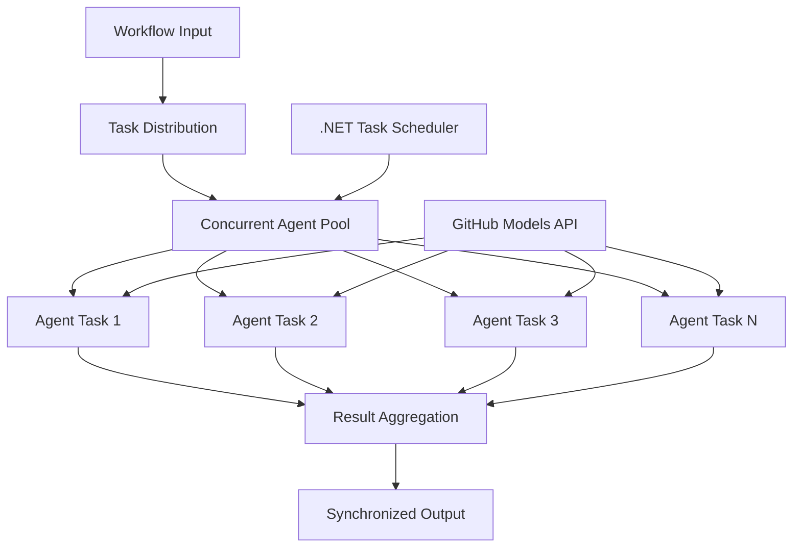

<!--
CO_OP_TRANSLATOR_METADATA:
{
  "original_hash": "b9c6e32c9b5f2fed20b6916984440d88",
  "translation_date": "2025-11-11T13:11:43+00:00",
  "source_file": "08-multi-agent/code_samples/workflows-agent-framework/dotNET/03.dotnet-agent-framework-workflow-ghmodel-concurrent.md",
  "language_code": "ko"
}
-->
# ⚡ GitHub 모델을 활용한 동시 에이전트 워크플로우 (.NET)

## 📋 고성능 병렬 처리 튜토리얼

이 노트북은 Microsoft Agent Framework for .NET과 GitHub 모델을 사용하여 **동시 워크플로우 패턴**을 구현하는 방법을 보여줍니다. 여러 AI 에이전트를 동시에 실행하여 처리량을 극대화하면서도 조정과 데이터 일관성을 유지하는 고성능 병렬 처리 워크플로우를 구축하는 방법을 배울 수 있습니다.

## 🎯 학습 목표

### 🚀 **동시 처리 기본**
- **병렬 에이전트 실행**: 최대 성능을 위해 여러 AI 에이전트를 동시에 실행
- **Async/Await 패턴**: .NET의 비동기 프로그래밍 모델을 활용하여 효율적인 동시성 구현
- **GitHub 모델 통합**: GitHub의 AI 모델 추론 서비스에 대한 여러 동시 호출 조정
- **리소스 관리**: 동시 작업에서 AI 모델 리소스를 효율적으로 관리

### 🏗️ **고급 동시성 아키텍처**
- **Task 기반 병렬 처리**: .NET Task Parallel Library를 사용한 최적의 동시 실행
- **동기화 패턴**: 경쟁 상태를 방지하며 동시 에이전트를 조정
- **로드 밸런싱**: 사용 가능한 동시 처리 용량에 따라 작업을 효율적으로 분배
- **결함 허용성**: 개별 에이전트 실패가 전체 워크플로우를 중단시키지 않도록 처리

### 🏢 **엔터프라이즈 동시 애플리케이션**
- **대량 문서 처리**: 여러 문서를 동시에 처리
- **실시간 콘텐츠 분석**: 들어오는 데이터 스트림의 동시 분석
- **배치 처리 최적화**: 대규모 데이터 처리 작업의 처리량 극대화
- **다중 모달 분석**: 다양한 콘텐츠 유형과 형식의 병렬 처리

## ⚙️ 사전 준비 및 설정

### 📦 **필수 NuGet 패키지**

고성능 동시 워크플로우를 위한 필수 패키지:

```xml
<!-- Core AI Framework with Async Support -->
<PackageReference Include="Microsoft.Extensions.AI" Version="9.9.0" />

<!-- Client Model Abstractions for API Communication -->
<PackageReference Include="System.ClientModel" Version="1.6.1.0" />

<!-- Azure Identity and Async LINQ for Advanced Operations -->
<PackageReference Include="Azure.Identity" Version="1.15.0" />
<PackageReference Include="System.Linq.Async" Version="6.0.3" />

<!-- Local Agent Framework References -->
<!-- Microsoft.Agents.AI.dll - Core agent abstractions with async support -->
<!-- Microsoft.Agents.AI.OpenAI.dll - GitHub Models integration with concurrency -->
```

### 🔑 **GitHub 모델 설정**

**환경 설정 (.env 파일):**
```env
GITHUB_TOKEN=your_github_personal_access_token
GITHUB_ENDPOINT=https://models.inference.ai.azure.com
GITHUB_MODEL_ID=gpt-4o-mini
```

**동시 처리 고려사항:**
```csharp
// Configure for concurrent operations
var clientOptions = new OpenAIClientOptions()
{
    Endpoint = new Uri(githubEndpoint),
    // Configure connection pooling for concurrent requests
    NetworkTimeout = TimeSpan.FromMinutes(5)
};
```

### 🏗️ **동시 워크플로우 아키텍처**



**핵심 구성 요소:**
- **Task Parallel Library**: .NET의 내장 동시 작업 지원
- **에이전트 풀**: 병렬 처리를 위한 여러 에이전트 인스턴스
- **결과 집계**: 동시 에이전트 결과의 조정 및 병합
- **동기화 지점**: 동시 작업 간 데이터 일관성 보장

## 🎨 **동시 워크플로우 디자인 패턴**

### 🔍 **병렬 연구 및 분석**
```
Research Topic → Concurrent Research Agents → Result Synthesis → Final Report
```

### 📊 **다중 소스 데이터 처리**
```
Data Sources → Parallel Processing Agents → Data Integration → Unified Output
```

### 🎭 **콘텐츠 생성 파이프라인**
```
Content Requirements → Concurrent Content Generators → Quality Review → Final Content
```

### 🔄 **Fan-Out/Fan-In 처리**
```
Single Input → Multiple Concurrent Processors → Result Aggregation → Single Output
```

## 🏢 **엔터프라이즈 성능 혜택**

### ⚡ **처리량 및 확장성**
- **선형 성능 확장**: 더 많은 동시 에이전트를 추가하여 처리량 증가
- **리소스 활용**: 사용 가능한 AI 모델 용량의 최대 효율성
- **처리 시간 단축**: 병렬 실행을 통한 처리 시간 대폭 감소
- **탄력적 확장**: 작업량에 따라 동시 에이전트 수를 동적으로 조정

### 🛡️ **신뢰성 및 복원력**
- **결함 격리**: 개별 에이전트 실패가 다른 동시 작업에 영향을 주지 않음
- **점진적 성능 저하**: 에이전트 용량이 감소하더라도 시스템 운영 지속
- **오류 복구**: 실패한 동시 작업에 대한 자동 재시도 메커니즘
- **작업 분배**: 사용 가능한 에이전트 간 작업의 균등 분배

### 📊 **성능 모니터링**
- **동시 실행 메트릭**: 모든 병렬 작업의 성능 추적
- **리소스 사용 분석**: CPU, 메모리, 네트워크 사용량 모니터링
- **처리량 분석**: 동시 처리로 인한 효율성 향상 측정
- **병목 현상 감지**: 성능 제약 식별 및 해결

### 🔧 **개발 및 운영**
- **비동기 프로그래밍 모델**: .NET의 성숙한 async/await 패턴 활용
- **작업 조정**: 내장된 작업 관리 및 조정 기능
- **예외 처리**: 동시 작업에 대한 포괄적인 오류 처리
- **디버깅 지원**: 동시 워크플로우를 위한 Visual Studio 디버깅 도구

.NET으로 고성능 동시 AI 워크플로우를 구축해 봅시다! 🚀

## 💻 코드 실행

전체 구현은 `03.dotnet-agent-framework-workflow-ghmodel-concurrent.cs` 파일에 있습니다. 이 파일은 **Fan-Out/Fan-In 동시 워크플로우**를 활용한 여행 계획을 보여줍니다:

### 🏗️ **워크플로우 아키텍처**

```
User Request → ConcurrentStartExecutor → [Researcher Agent || Planner Agent] → ConcurrentAggregationExecutor → Final Output
```

**핵심 구성 요소:**

1. **ConcurrentStartExecutor**: 사용자 요청을 모든 에이전트에 동시에 브로드캐스트
2. **Researcher Agent**: 목적지와 명소를 병렬로 분석
3. **Planner Agent**: 상세 여행 계획을 병렬로 생성
4. **ConcurrentAggregationExecutor**: 두 에이전트의 결과를 수집하고 병합

### 🎯 **Fan-Out/Fan-In 패턴**

이 워크플로우는 전형적인 **Fan-Out/Fan-In** 패턴을 보여줍니다:
- **Fan-Out**: 하나의 입력 메시지가 여러 에이전트에 동시에 브로드캐스트
- **동시 처리**: 여러 에이전트가 동일한 작업을 병렬로 수행
- **Fan-In**: 모든 에이전트의 결과를 수집하고 하나의 출력으로 병합

### 🚀 예제 실행

```bash
# Make the script executable (Unix/Linux/macOS)
chmod +x 03.dotnet-agent-framework-workflow-ghmodel-concurrent.cs

# Run the concurrent workflow
./03.dotnet-agent-framework-workflow-ghmodel-concurrent.cs
```

Windows에서 실행:
```powershell
dotnet run 03.dotnet-agent-framework-workflow-ghmodel-concurrent.cs
```

### 📝 예상 출력

워크플로우는 다음을 수행합니다:
1. **요청 브로드캐스트**: "12월에 시애틀 여행 계획" 요청을 두 에이전트에 전송
2. **동시 처리**: 두 에이전트가 동시에 작업 수행:
   - Researcher는 명소와 세부 정보를 식별
   - Planner는 일정과 물류를 생성
3. **집계**: 두 응답을 종합하여 포괄적인 결과 생성
4. **결과 표시**: 모든 정보를 포함한 통합 여행 계획 표시

### 🔧 사용자 정의 옵션

**더 많은 동시 에이전트 추가:**
```csharp
// Create additional specialized agents
AIAgent budgetAgent = openAIClient.GetChatClient(github_model_id).CreateAIAgent(
    name: "Budget-Agent", instructions: "Calculate travel costs...");

// Add to fan-out
var workflow = new WorkflowBuilder(startExecutor)
    .AddFanOutEdge(startExecutor, targets: [researcherAgent, plannerAgent, budgetAgent])
    .AddFanInEdge(aggregationExecutor, sources: [researcherAgent, plannerAgent, budgetAgent])
    .WithOutputFrom(aggregationExecutor)
    .Build();

// Update aggregation count
if (this._messages.Count == 3) { ... }
```

**에이전트 지침 수정:**
```csharp
const string ResearcherAgentInstructions = "Your custom instructions for research...";
const string PlanAgentInstructions = "Your custom instructions for planning...";
```

**작업 변경:**
```csharp
StreamingRun run = await InProcessExecution.StreamAsync(
    workflow, 
    "Plan a European vacation for 2 weeks in summer"
);
```

### 🎯 실제 응용 사례

이 동시 패턴은 다음에 적합합니다:
- **콘텐츠 생성**: 여러 작성자가 동시에 다른 섹션 작성
- **코드 리뷰**: 여러 리뷰어가 다양한 관점에서 코드 분석
- **시장 조사**: 다양한 시장 세그먼트의 병렬 분석
- **문서 처리**: 병렬 추출, 분석 및 검증
- **다중 관점 분석**: 동일한 입력에 대한 다양한 관점 확보

### 🔍 사용자 정의 실행기 이해

**ConcurrentStartExecutor:**
- `IMessageHandler<string>`을 구현하여 문자열 입력 수락
- 모든 연결된 에이전트에 메시지 브로드캐스트
- 동시 처리를 트리거하는 `TurnToken` 전송

**ConcurrentAggregationExecutor:**
- `IMessageHandler<ChatMessage>`를 구현하여 에이전트 응답 수신
- 스레드 안전 방식으로 메시지 수집
- 예상 응답이 모두 도착하면 집계 수행
- `context.YieldOutputAsync()`를 사용하여 최종 출력 제공

### ⚡ 성능 혜택

**동시 vs 순차 처리:**
- 순차 처리: Agent1 (30초) → Agent2 (30초) = **총 60초**
- 동시 처리: Agent1 (30초) || Agent2 (30초) = **총 30초**

**처리량 개선**: 작업량과 리소스에 따라 N개의 동시 에이전트로 최대 N배 빠른 처리 가능

### 🛡️ 오류 처리

워크플로우는 개별 에이전트 실패를 유연하게 처리합니다:
- 한 에이전트가 실패하더라도 다른 에이전트는 계속 작업 수행
- 집계기는 타임아웃 로직을 구현 가능
- 필요한 경우 부분 결과 반환 가능

### 📊 고급 기능

**동적 에이전트 수:**
가변 에이전트 수를 지원하도록 집계 로직 수정:

```csharp
private int _expectedAgentCount;
private readonly List<ChatMessage> _messages = [];

public async ValueTask HandleAsync(ChatMessage message, IWorkflowContext context)
{
    this._messages.Add(message);
    if (this._messages.Count == _expectedAgentCount)
    {
        // Process aggregation
    }
}
```

이 동시 워크플로우 패턴은 고성능, 확장 가능한 AI 에이전트 시스템을 구축하는 데 필수적입니다!

---

<!-- CO-OP TRANSLATOR DISCLAIMER START -->
**면책 조항**:  
이 문서는 AI 번역 서비스 [Co-op Translator](https://github.com/Azure/co-op-translator)를 사용하여 번역되었습니다. 정확성을 위해 최선을 다하고 있지만, 자동 번역에는 오류나 부정확성이 포함될 수 있습니다. 원본 문서의 원어 버전을 권위 있는 출처로 간주해야 합니다. 중요한 정보의 경우, 전문적인 인간 번역을 권장합니다. 이 번역 사용으로 인해 발생하는 오해나 잘못된 해석에 대해 책임을 지지 않습니다.
<!-- CO-OP TRANSLATOR DISCLAIMER END -->