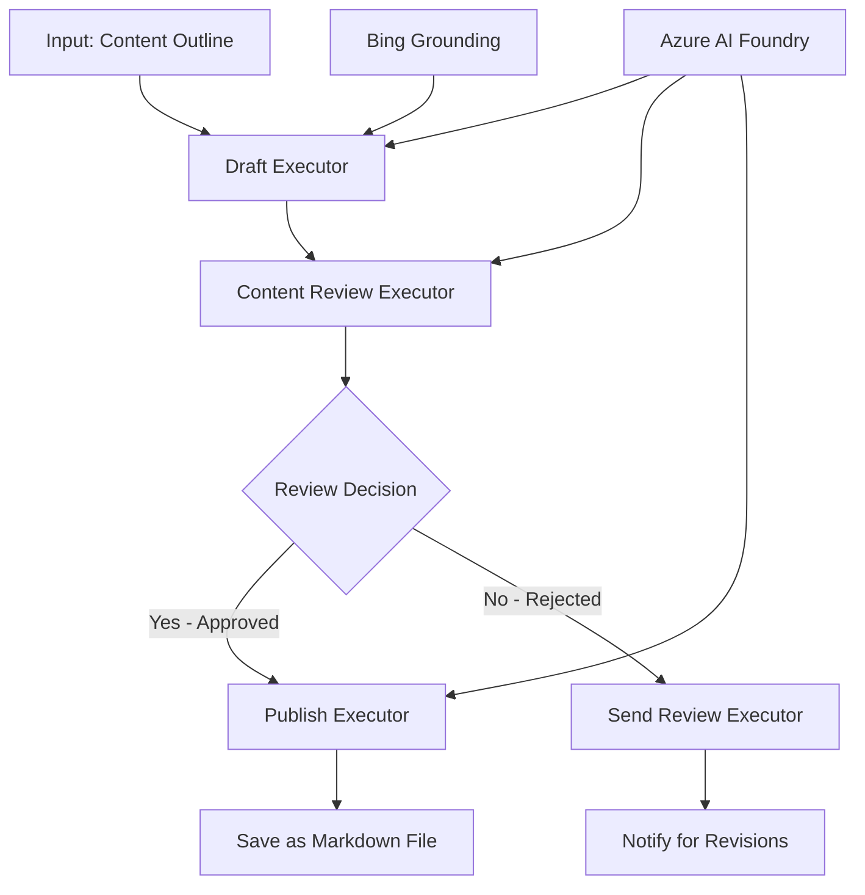

<!--
CO_OP_TRANSLATOR_METADATA:
{
  "original_hash": "8abd335151cee553293b637ee3d80d10",
  "translation_date": "2025-11-11T12:07:45+00:00",
  "source_file": "08-multi-agent/code_samples/workflows-agent-framework/dotNET/04.dotnet-agent-framework-workflow-aifoundry-condition.md",
  "language_code": "ko"
}
-->
# 🔀 Azure AI Foundry (.NET)을 활용한 조건부 에이전트 워크플로우

## 📋 지능형 의사결정 기반 워크플로우 튜토리얼

이 노트북은 Azure AI Foundry와 Microsoft Agent Framework for .NET을 사용하여 **조건부 워크플로우 패턴**을 구현하는 방법을 보여줍니다. AI 분석, 비즈니스 규칙, 동적 조건을 기반으로 처리 경로를 지능적으로 라우팅하는 고급 의사결정 기반 워크플로우를 구축하는 방법을 배울 수 있습니다.

## 🎯 학습 목표

### 🧠 **지능형 의사결정 아키텍처**
- **조건부 로직 구현**: 여러 분기점을 가진 복잡한 의사결정 트리 구축
- **AI 기반 라우팅**: Azure AI Foundry 모델을 사용하여 지능적인 라우팅 결정 수행
- **동적 워크플로우 적응**: 런타임 분석 및 조건에 따라 워크플로우 동작 수정
- **기업 규칙 통합**: 비즈니스 로직 및 규정 요구사항을 워크플로우에 통합

### 🔀 **고급 조건부 패턴**
- **다중 기준 의사결정**: 라우팅 결정을 위해 여러 요인 평가
- **컨텍스트 인식 처리**: 워크플로우 컨텍스트와 히스토리를 기반으로 의사결정 수행
- **적응형 워크플로우 수정**: 실시간 조건에 따라 처리 경로를 동적으로 조정
- **규칙 엔진 통합**: 워크플로우 내에서 복잡한 비즈니스 규칙 엔진 구현

### 🏢 **기업 조건부 애플리케이션**
- **문서 분류 및 라우팅**: 문서를 자동으로 분류하고 적절한 워크플로우로 라우팅
- **고객 서비스 분류**: 고객 문의를 전문 처리 팀으로 지능적으로 라우팅
- **규정 준수 및 위험 처리**: 위험 평가에 따라 다른 검증 및 검토 프로세스 적용
- **품질 보증 워크플로우**: 품질 지표에 따라 콘텐츠를 적절한 검토 프로세스로 라우팅

## ⚙️ 사전 준비 및 설정

### 📦 **필요한 NuGet 패키지**

조건부 워크플로우 처리를 위한 고급 패키지:

```xml
<!-- Core AI Framework -->
<PackageReference Include="Microsoft.Extensions.AI" Version="9.9.0" />

<!-- Azure AI Agents with Persistent State -->
<PackageReference Include="Azure.AI.Agents.Persistent" Version="1.2.0-beta.5" />

<!-- Azure Identity and Utilities -->
<PackageReference Include="Azure.Identity" Version="1.15.0" />
<PackageReference Include="System.Linq.Async" Version="6.0.3" />
<PackageReference Include="DotNetEnv" Version="3.1.1" />

<!-- Local Workflow Framework References -->
<!-- Microsoft.Agents.Workflows.dll - Advanced workflow orchestration -->
<!-- Microsoft.Agents.AI.AzureAI.dll - Azure AI Foundry integration -->
<!-- Microsoft.Agents.AI.dll - Core agent abstractions -->
```

### 🔑 **Azure AI Foundry 구성**

**필요한 Azure 리소스:**
- 조건부 처리 모델이 포함된 Azure AI Foundry 작업 공간
- 적절한 컴퓨팅 할당량 및 권한이 있는 Azure 구독
- 의사결정 및 콘텐츠 분석을 위한 배포된 AI 모델
- (선택 사항) Bing Search API 연결을 통한 정보 기반 기능

**환경 구성 (.env 파일):**
```env
# Azure AI Foundry Configuration
AZURE_AI_PROJECT_ENDPOINT=https://your-project.cognitiveservices.azure.com/
BING_CONNECTION_ID=your-bing-connection-id
```

**인증 설정:**
```csharp
// Azure CLI or Managed Identity authentication
using Azure.Identity;
var credential = new AzureCliCredential();

// Load environment configuration
DotNetEnv.Env.Load("../../../.env");
```

### 🏗️ **조건부 워크플로우 아키텍처**



**핵심 구성 요소:**
- **Draft Executor**: 개요에서 초기 콘텐츠 초안을 생성하는 AI 에이전트
- **Content Review Executor**: 초안의 품질과 규정 준수를 평가하는 AI 에이전트
- **조건부 라우팅**: 검토 결과에 따라 라우팅하는 의사결정 로직
- **게시/검토 경로**: 승인된 콘텐츠와 거부된 콘텐츠를 위한 별도 처리 경로
- **상태 관리**: 워크플로우 전반에 걸쳐 콘텐츠 및 검토 컨텍스트 유지

## 🎨 **조건부 워크플로우 디자인 패턴**

### 📋 **품질 게이트를 활용한 콘텐츠 제작**
```
Outline → Draft Creation → Quality Review → {Approve: Publish | Reject: Revise}
```

### 🎯 **위험 기반 문서 처리**
```
Document → Risk Assessment → {Low: Standard | High: Enhanced Review}
```

### 🔍 **지능형 고객 서비스 라우팅**
```
Customer Query → Analysis → {Simple: FAQ Bot | Complex: Human Agent}
```

### 💼 **규정 준수 중심 워크플로우**
```
Content → Compliance Check → {Pass: Publish | Fail: Legal Review}
```

## 🏢 **기업 조건부 혜택**

### 🎯 **지능형 자동화**
- **스마트 의사결정**: 콘텐츠 분석 및 컨텍스트를 기반으로 한 AI 기반 라우팅 결정
- **적응형 처리**: 변화하는 조건에 따라 자동으로 조정되는 워크플로우
- **비즈니스 규칙 적용**: 복잡한 비즈니스 로직 및 정책의 자동 적용
- **컨텍스트 인식 라우팅**: 전체 워크플로우 히스토리와 누적된 컨텍스트를 기반으로 한 결정

### 📈 **운영 우수성**
- **자원 할당 최적화**: 작업을 가장 적합한 전문가와 프로세스로 라우팅
- **수동 개입 감소**: 자동화된 의사결정으로 인간 라우팅 필요성 최소화
- **빠른 해결 시간**: 적절한 전문성과 처리 능력으로 직접 라우팅
- **일관된 적용**: 비즈니스 규칙 및 의사결정 기준의 균일한 적용

### 🛡️ **위험 관리 및 규정 준수**
- **자동화된 위험 평가**: 콘텐츠 및 상황 위험 수준의 AI 기반 평가
- **규정 준수 적용**: 필요한 규제 프로세스를 통한 자동 라우팅
- **보안 프로토콜 적용**: 위험 평가에 따라 강화된 보안 조치 적용
- **감사 기록 유지**: 라우팅 결정 및 근거의 완전한 문서화

### 📊 **분석 및 지속적 개선**
- **의사결정 분석**: 라우팅 결정의 효과성과 정확성 추적
- **패턴 인식**: 시간 경과에 따른 라우팅 결정의 트렌드 및 패턴 식별
- **성능 최적화**: 의사결정 기준 및 라우팅 효율성의 지속적 개선
- **비즈니스 인텔리전스**: 콘텐츠 특성과 처리 요구사항에 대한 통찰력 제공

### 🔧 **기술적 우수성**
- **지속적인 상태 관리**: 워크플로우 실행 전반에 걸쳐 복잡한 상태 유지
- **확장 가능한 아키텍처**: 대량의 조건부 처리 요구사항 처리
- **통합 기능**: 기존 비즈니스 시스템 및 프로세스와의 원활한 통합
- **모니터링 및 관찰 가능성**: 워크플로우 성능 및 결정의 포괄적 추적

.NET을 사용하여 지능형, 의사결정 기반의 기업 워크플로우를 구축해 봅시다! 🚀

## 💻 코드 실행

완전한 구현은 `04.dotnet-agent-framework-workflow-aifoundry-condition.cs`에 있습니다. 이 파일은 **품질 게이트를 활용한 콘텐츠 제작 워크플로우**를 보여줍니다:

### 🏗️ **워크플로우 아키텍처**

```
Content Outline → Draft Creation → Quality Review → Conditional Routing:
                                                      ├─ Approved (>200 words) → Publish
                                                      └─ Rejected (<200 words) → Review Notification
```

**워크플로우의 에이전트:**
1. **Evangelist Agent**: Bing 기반으로 튜토리얼 초안을 생성
2. **Content Reviewer Agent**: 초안 품질 평가 (단어 수, 완성도)
3. **Publisher Agent**: 승인된 콘텐츠를 타임스탬프가 있는 Markdown 파일로 저장

**사용자 정의 실행기:**
1. **DraftExecutor**: 초안 생성 조정
2. **ContentReviewExecutor**: 품질 평가 수행
3. **PublishExecutor**: 승인된 콘텐츠 게시 처리
4. **SendReviewExecutor**: 거부된 콘텐츠 알림 관리

### 🚀 예제 실행

**사전 준비:**
- 구성된 Azure AI Foundry 작업 공간
- Azure CLI 인증 (`az login`)
- (선택 사항) Bing Search 연결을 통한 정보 기반

```bash
# Make the script executable (Unix/Linux/macOS)
chmod +x 04.dotnet-agent-framework-workflow-aifoundry-condition.cs

# Run the conditional workflow
./04.dotnet-agent-framework-workflow-aifoundry-condition.cs
```

Windows에서 실행:
```powershell
dotnet run 04.dotnet-agent-framework-workflow-aifoundry-condition.cs
```

### 📝 예상 출력

워크플로우는 다음을 수행합니다:
1. **에이전트 생성**: 세 가지 전문 Azure AI Foundry 에이전트 초기화
2. **초안 생성**: Evangelist 에이전트가 개요에서 튜토리얼 초안 생성
3. **콘텐츠 검토**: Content Reviewer가 초안 품질 평가
4. **조건부 라우팅**:
   - **승인됨 (>200 단어)**: Publish Executor가 Markdown 파일로 저장
   - **거부됨 (<200 단어)**: 검토 알림 전송
5. **결과 표시**: 최종 워크플로우 결과 표시

### 🔧 사용자 정의 옵션

**검토 기준 수정:**
```csharp
const string ContentReviewerInstructions = @"
You are a content reviewer...
1. Check if content is more than 500 words (instead of 200)
2. Verify technical accuracy
3. Ensure proper formatting
...";
```

**조건부 경로 추가:**
```csharp
var workflow = new WorkflowBuilder(draftExecutor)
    .AddEdge(draftExecutor, contentReviewerExecutor)
    .AddEdge(contentReviewerExecutor, publishExecutor, condition: GetCondition("Excellent"))
    .AddEdge(contentReviewerExecutor, editExecutor, condition: GetCondition("Good"))
    .AddEdge(contentReviewerExecutor, sendReviewerExecutor, condition: GetCondition("Poor"))
    .Build();
```

**콘텐츠 요구사항 변경:**
```csharp
string OUTLINE_Content = @"
# Your Custom Topic
## Section 1
https://your-reference-url
## Section 2
...
";
```

### 🎯 실제 응용 프로그램

이 조건부 워크플로우 패턴은 다음에 적합합니다:
- **콘텐츠 관리 시스템**: 품질 게이트가 있는 자동화된 편집 워크플로우
- **문서 처리**: 분류 및 규정 준수에 따라 문서 라우팅
- **고객 지원**: 복잡성과 긴급성을 기반으로 한 지능형 티켓 라우팅
- **법률 검토**: 위험 평가 및 가치에 따라 계약서 라우팅
- **인사 프로세스**: 적절한 심사 워크플로우를 통해 지원서 라우팅

### 🔍 조건부 로직 이해

**조건 함수:**
```csharp
public Func<object?, bool> GetCondition(string expectedResult) =>
    reviewResult => reviewResult is ReviewResult review && review.Result == expectedResult;
```

이 함수는 다음을 수행하는 조건을 생성합니다:
1. 결과가 `ReviewResult` 유형인지 확인
2. `Result` 속성을 예상 값과 비교
3. 라우팅을 결정하기 위해 true/false 반환

**조건부가 있는 워크플로우 엣지:**
```csharp
.AddEdge(contentReviewerExecutor, publishExecutor, condition: GetCondition("Yes"))
.AddEdge(contentReviewerExecutor, sendReviewerExecutor, condition: GetCondition("No"))
```

### 📊 고급 기능

**JSON 스키마 검증:**
워크플로우는 구조화된 응답을 보장하기 위해 JSON 스키마를 사용합니다:

```csharp
// Define response structure
public class ReviewResult
{
    [JsonPropertyName("review_result")]
    public string Result { get; set; } = string.Empty;
    
    [JsonPropertyName("reason")]
    public string Reason { get; set; } = string.Empty;
    
    [JsonPropertyName("draft_content")]
    public string DraftContent { get; set; } = string.Empty;
}

// Apply to agent
ResponseFormat = ChatResponseFormat.ForJsonSchema(
    AIJsonUtilities.CreateJsonSchema(typeof(ReviewResult)), 
    "ReviewResult", 
    "Review Result From DraftContent"
)
```

**Bing 기반 통합:**
Evangelist 에이전트는 Bing 기반을 사용하여 실시간 정보를 액세스합니다:

```csharp
var bingGroundingConfig = new BingGroundingSearchConfiguration(bing_conn_id);
BingGroundingToolDefinition bingGroundingTool = new(
    new BingGroundingSearchToolParameters([bingGroundingConfig])
);
```

이를 통해 에이전트는 개요의 URL을 따라가 현재 정보를 추출할 수 있습니다.

### 🛡️ 오류 처리

워크플로우는 거부된 콘텐츠에 대해 강력한 오류 처리를 포함합니다:
- 검토 실패 시 대체 경로를 트리거
- 알림은 명확한 거부 이유를 제공
- 콘텐츠는 수정용으로 보존

### 🔄 워크플로우 확장

**수정 루프 추가:**
콘텐츠를 자동으로 다시 초안 작성하는 피드백 루프 생성:

```csharp
.AddEdge(contentReviewerExecutor, publishExecutor, condition: GetCondition("Yes"))
.AddEdge(contentReviewerExecutor, draftExecutor, condition: GetCondition("No")) // Loop back
```

**다단계 검토 구현:**
다양한 기준을 가진 여러 검토 단계를 추가:

```csharp
.AddEdge(draftExecutor, technicalReviewer)
.AddEdge(technicalReviewer, editorialReviewer, condition: GetCondition("TechPass"))
.AddEdge(editorialReviewer, publishExecutor, condition: GetCondition("EditPass"))
```

이 조건부 워크플로우 패턴은 복잡하고 지능적인 기업 자동화 시스템을 구축하기 위한 기초를 제공합니다! 🚀

---

<!-- CO-OP TRANSLATOR DISCLAIMER START -->
**면책 조항**:  
이 문서는 AI 번역 서비스 [Co-op Translator](https://github.com/Azure/co-op-translator)를 사용하여 번역되었습니다. 정확성을 위해 최선을 다하고 있지만, 자동 번역에는 오류나 부정확성이 포함될 수 있습니다. 원본 문서의 원어 버전을 권위 있는 출처로 간주해야 합니다. 중요한 정보의 경우, 전문적인 인간 번역을 권장합니다. 이 번역 사용으로 인해 발생하는 오해나 잘못된 해석에 대해 책임지지 않습니다.
<!-- CO-OP TRANSLATOR DISCLAIMER END -->