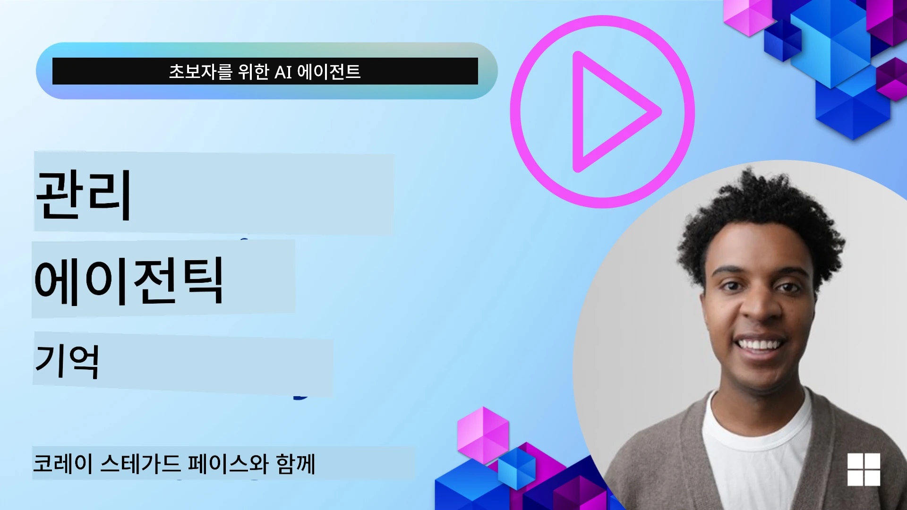

<!--
CO_OP_TRANSLATOR_METADATA:
{
  "original_hash": "a1d90991499ad697c4ad24decaf36968",
  "translation_date": "2025-12-09T12:01:49+00:00",
  "source_file": "13-agent-memory/README.md",
  "language_code": "ko"
}
-->
# AI 에이전트를 위한 메모리  

AI 에이전트를 만드는 고유한 이점에 대해 논의할 때 주로 두 가지가 언급됩니다: 도구를 호출하여 작업을 완료하는 능력과 시간이 지남에 따라 개선되는 능력입니다. 메모리는 사용자에게 더 나은 경험을 제공할 수 있는 자기 개선 에이전트를 만드는 데 핵심적인 요소입니다.

이번 강의에서는 AI 에이전트를 위한 메모리가 무엇인지, 이를 어떻게 관리하고 애플리케이션에 활용할 수 있는지 살펴보겠습니다.

## 소개

이번 강의에서는 다음 내용을 다룹니다:

• **AI 에이전트 메모리 이해하기**: 메모리가 무엇이며 에이전트에게 왜 중요한지.

• **메모리 구현 및 저장**: 단기 및 장기 메모리에 중점을 두고 AI 에이전트에 메모리 기능을 추가하는 실질적인 방법.

• **AI 에이전트를 자기 개선형으로 만들기**: 메모리가 과거 상호작용에서 학습하고 시간이 지남에 따라 개선되도록 돕는 방법.

## 제공되는 구현

이번 강의에는 두 가지 포괄적인 노트북 튜토리얼이 포함되어 있습니다:

• **[13-agent-memory.ipynb](./13-agent-memory.ipynb)**: Mem0와 Azure AI Search를 Semantic Kernel 프레임워크와 함께 사용하여 메모리를 구현.

• **[13-agent-memory-cognee.ipynb](./13-agent-memory-cognee.ipynb)**: Cognee를 사용하여 구조화된 메모리를 구현, 임베딩을 기반으로 지식 그래프를 자동으로 구축하고, 그래프를 시각화하며, 지능형 검색을 수행.

## 학습 목표

이 강의를 완료한 후, 다음을 할 수 있습니다:

• **AI 에이전트 메모리의 다양한 유형을 구분**: 작업 메모리, 단기 메모리, 장기 메모리, 그리고 페르소나 및 에피소드 메모리와 같은 특수 형태 포함.

• **Semantic Kernel 프레임워크를 사용하여 AI 에이전트의 단기 및 장기 메모리를 구현하고 관리**: Mem0, Cognee, 화이트보드 메모리와 같은 도구를 활용하고 Azure AI Search와 통합.

• **자기 개선형 AI 에이전트의 원리를 이해**: 강력한 메모리 관리 시스템이 지속적인 학습과 적응에 어떻게 기여하는지.

## AI 에이전트 메모리 이해하기

본질적으로, **AI 에이전트의 메모리는 정보를 유지하고 회상할 수 있는 메커니즘**을 의미합니다. 이 정보는 대화의 특정 세부사항, 사용자 선호도, 과거 행동 또는 학습된 패턴일 수 있습니다.

메모리가 없으면 AI 애플리케이션은 종종 상태를 유지하지 못하며, 이는 각 상호작용이 처음부터 시작된다는 것을 의미합니다. 이는 에이전트가 이전의 맥락이나 선호도를 "잊어버리는" 반복적이고 답답한 사용자 경험으로 이어집니다.

### 메모리가 왜 중요한가?

에이전트의 지능은 과거 정보를 회상하고 활용하는 능력과 깊이 연관되어 있습니다. 메모리는 에이전트를 다음과 같이 만듭니다:

• **반성적**: 과거 행동과 결과에서 학습.

• **상호작용적**: 진행 중인 대화의 맥락을 유지.

• **능동적 및 반응적**: 과거 데이터를 기반으로 필요를 예측하거나 적절히 반응.

• **자율적**: 저장된 지식을 활용하여 더 독립적으로 작동.

메모리를 구현하는 목표는 에이전트를 더 **신뢰할 수 있고 유능하게** 만드는 것입니다.

### 메모리의 유형

#### 작업 메모리

이것은 에이전트가 단일 작업이나 사고 과정 중에 사용하는 임시 메모지와 같습니다. 다음 단계를 계산하는 데 필요한 즉각적인 정보를 보유합니다.

AI 에이전트의 경우, 작업 메모리는 대화에서 가장 관련성이 높은 정보를 캡처하며, 전체 채팅 기록이 길거나 잘려도 이를 유지합니다. 요구사항, 제안, 결정, 행동과 같은 주요 요소를 추출하는 데 중점을 둡니다.

**작업 메모리 예시**

여행 예약 에이전트에서 작업 메모리는 사용자의 현재 요청, 예를 들어 "파리로 여행을 예약하고 싶어요"와 같은 내용을 캡처할 수 있습니다. 이 특정 요구사항은 현재 상호작용을 안내하기 위해 에이전트의 즉각적인 맥락에 보유됩니다.

#### 단기 메모리

이 메모리는 단일 대화나 세션 동안 정보를 유지합니다. 현재 채팅의 맥락으로, 에이전트가 대화의 이전 턴을 참조할 수 있도록 합니다.

**단기 메모리 예시**

사용자가 "파리로 가는 항공편 비용은 얼마인가요?"라고 묻고, 이어서 "거기 숙박은요?"라고 질문하면, 단기 메모리는 "거기"가 같은 대화 내에서 "파리"를 의미한다는 것을 에이전트가 알 수 있도록 합니다.

#### 장기 메모리

이 메모리는 여러 대화나 세션에 걸쳐 정보를 유지합니다. 사용자 선호도, 과거 상호작용, 일반 지식을 장기간 기억할 수 있게 하여 개인화에 중요한 역할을 합니다.

**장기 메모리 예시**

장기 메모리는 "벤은 스키와 야외 활동을 좋아하고, 산 전망이 있는 커피를 선호하며, 과거 부상으로 인해 고급 스키 슬로프를 피하고 싶어한다"는 정보를 저장할 수 있습니다. 이전 상호작용에서 학습한 이 정보는 향후 여행 계획 세션에서 추천에 영향을 미쳐 매우 개인화된 경험을 제공합니다.

#### 페르소나 메모리

이 특수 메모리 유형은 에이전트가 일관된 "성격" 또는 "페르소나"를 개발하도록 돕습니다. 에이전트가 자신이나 의도된 역할에 대한 세부사항을 기억하여 상호작용을 더 유연하고 집중적으로 만듭니다.

**페르소나 메모리 예시**

여행 에이전트가 "스키 전문가"로 설계되었다면, 페르소나 메모리는 이 역할을 강화하여 전문가의 어조와 지식을 반영하는 응답을 하도록 영향을 미칠 수 있습니다.

#### 워크플로우/에피소드 메모리

이 메모리는 에이전트가 복잡한 작업 중에 수행한 단계, 성공 및 실패를 저장합니다. 이는 특정 "에피소드"나 과거 경험을 기억하여 학습하는 것과 같습니다.

**에피소드 메모리 예시**

에이전트가 특정 항공편 예약을 시도했지만 이용 불가로 실패한 경우, 에피소드 메모리는 이 실패를 기록하여 대체 항공편을 시도하거나 후속 시도에서 사용자에게 문제를 더 잘 알릴 수 있습니다.

#### 엔터티 메모리

이 메모리는 대화에서 특정 엔터티(사람, 장소, 사물)와 이벤트를 추출하고 기억하는 것을 포함합니다. 이를 통해 에이전트는 논의된 주요 요소에 대한 구조화된 이해를 구축할 수 있습니다.

**엔터티 메모리 예시**

과거 여행에 대한 대화에서 에이전트는 "파리", "에펠탑", "Le Chat Noir 레스토랑에서의 저녁 식사"와 같은 엔터티를 추출할 수 있습니다. 이후 상호작용에서 에이전트는 "Le Chat Noir"를 기억하고 새로운 예약을 제안할 수 있습니다.

#### 구조화된 RAG (Retrieval Augmented Generation)

RAG는 더 넓은 기술이지만, "구조화된 RAG"는 강력한 메모리 기술로 강조됩니다. 이는 대화, 이메일, 이미지와 같은 다양한 소스에서 밀도 높은 구조화된 정보를 추출하여 정밀도, 회상, 응답 속도를 향상시킵니다. 고전적인 RAG가 의미적 유사성에만 의존하는 것과 달리, 구조화된 RAG는 정보의 고유한 구조를 활용합니다.

**구조화된 RAG 예시**

단순히 키워드를 일치시키는 대신, 구조화된 RAG는 이메일에서 항공편 세부정보(목적지, 날짜, 시간, 항공사)를 분석하고 구조화된 방식으로 저장할 수 있습니다. 이를 통해 "화요일에 파리로 예약한 항공편은 무엇인가요?"와 같은 정밀한 쿼리가 가능합니다.

## 메모리 구현 및 저장

AI 에이전트의 메모리를 구현하는 것은 **메모리 관리**의 체계적인 과정을 포함합니다. 여기에는 정보 생성, 저장, 검색, 통합, 업데이트, 심지어 "잊기"(또는 삭제)가 포함됩니다. 특히 검색은 중요한 측면입니다.

### 특수 메모리 도구

#### Mem0

에이전트 메모리를 저장하고 관리하는 한 가지 방법은 Mem0과 같은 특수 도구를 사용하는 것입니다. Mem0은 지속적인 메모리 계층으로 작동하여 에이전트가 관련 상호작용을 회상하고, 사용자 선호도와 사실적 맥락을 저장하며, 시간에 따라 성공과 실패에서 학습할 수 있도록 합니다. 이 아이디어는 상태를 유지하지 않는 에이전트를 상태를 유지하는 에이전트로 전환하는 것입니다.

Mem0은 **추출 및 업데이트의 두 단계 메모리 파이프라인**을 통해 작동합니다. 먼저, 에이전트의 스레드에 추가된 메시지가 Mem0 서비스로 전송되며, 이는 대화 기록을 요약하고 새로운 메모리를 추출하기 위해 대형 언어 모델(LLM)을 사용합니다. 이후, LLM 기반 업데이트 단계는 이러한 메모리를 추가, 수정, 삭제할지 여부를 결정하여 벡터, 그래프, 키-값 데이터베이스를 포함할 수 있는 하이브리드 데이터 저장소에 저장합니다. 이 시스템은 다양한 메모리 유형을 지원하며, 엔터티 간 관계를 관리하기 위해 그래프 메모리를 통합할 수도 있습니다.

#### Cognee

또 다른 강력한 접근법은 **Cognee**를 사용하는 것입니다. 이는 구조화된 데이터와 비구조화된 데이터를 임베딩으로 지원되는 쿼리 가능한 지식 그래프로 변환하는 오픈 소스 의미 메모리입니다. Cognee는 벡터 유사성 검색과 그래프 관계를 결합한 **이중 저장소 아키텍처**를 제공하여 에이전트가 단순히 정보가 유사한지뿐만 아니라 개념이 어떻게 연결되어 있는지도 이해할 수 있도록 합니다.

Cognee는 **하이브리드 검색**에서 뛰어나며, 벡터 유사성, 그래프 구조, LLM 추론을 결합하여 원시 청크 조회에서 그래프 인식 질문 응답까지 지원합니다. 이 시스템은 **진화하는 메모리**를 유지하며, 하나의 연결된 그래프로 쿼리 가능하면서도 단기 세션 맥락과 장기 지속 메모리를 모두 지원합니다.

Cognee 노트북 튜토리얼([13-agent-memory-cognee.ipynb](./13-agent-memory-cognee.ipynb))은 이 통합 메모리 계층을 구축하는 방법을 보여주며, 다양한 데이터 소스를 수집하고, 지식 그래프를 시각화하며, 특정 에이전트 요구에 맞춘 다양한 검색 전략으로 쿼리하는 실질적인 예제를 제공합니다.

### RAG를 사용한 메모리 저장

Mem0과 같은 특수 메모리 도구 외에도, **Azure AI Search**와 같은 강력한 검색 서비스를 메모리를 저장하고 검색하는 백엔드로 활용할 수 있습니다. 특히 구조화된 RAG에 적합합니다.

이를 통해 에이전트의 응답을 자체 데이터로 기반화하여 더 관련성 있고 정확한 답변을 보장할 수 있습니다. Azure AI Search는 사용자별 여행 메모리, 제품 카탈로그 또는 기타 도메인별 지식을 저장하는 데 사용할 수 있습니다.

Azure AI Search는 대화 기록, 이메일, 이미지와 같은 대규모 데이터 세트에서 밀도 높은 구조화된 정보를 추출하고 검색하는 데 뛰어난 **구조화된 RAG** 기능을 지원합니다. 이는 전통적인 텍스트 청크 및 임베딩 접근법에 비해 "초인적인 정밀도와 회상"을 제공합니다.

## AI 에이전트를 자기 개선형으로 만들기

자기 개선형 에이전트를 위한 일반적인 패턴은 **"지식 에이전트"**를 도입하는 것입니다. 이 별도의 에이전트는 사용자와 주요 에이전트 간의 주요 대화를 관찰합니다. 그 역할은 다음과 같습니다:

1. **가치 있는 정보 식별**: 대화의 일부가 일반 지식이나 특정 사용자 선호도로 저장할 가치가 있는지 판단.

2. **추출 및 요약**: 대화에서 필수 학습 또는 선호도를 추출.

3. **지식 베이스에 저장**: 추출된 정보를 벡터 데이터베이스에 영구 저장하여 나중에 검색 가능하도록 함.

4. **미래 쿼리 보강**: 사용자가 새로운 쿼리를 시작할 때, 지식 에이전트가 관련 저장 정보를 검색하여 사용자의 프롬프트에 추가, 주요 맥락을 주요 에이전트에 제공(RAG와 유사).

### 메모리 최적화

• **지연 시간 관리**: 사용자 상호작용 속도를 늦추지 않기 위해, 정보가 저장하거나 검색할 가치가 있는지 빠르게 확인하기 위해 더 저렴하고 빠른 모델을 처음에 사용하고, 필요할 때만 더 복잡한 추출/검색 프로세스를 호출.

• **지식 베이스 유지 관리**: 성장하는 지식 베이스의 경우, 덜 자주 사용되는 정보를 "콜드 스토리지"로 이동하여 비용을 관리.

## 에이전트 메모리에 대해 더 궁금한 점이 있나요?

[Azure AI Foundry Discord](https://aka.ms/ai-agents/discord)에 참여하여 다른 학습자들과 만나고, 오피스 아워에 참석하며, AI 에이전트에 대한 질문에 답을 얻으세요.

---

<!-- CO-OP TRANSLATOR DISCLAIMER START -->
**면책 조항**:  
이 문서는 AI 번역 서비스 [Co-op Translator](https://github.com/Azure/co-op-translator)를 사용하여 번역되었습니다. 정확성을 위해 최선을 다하고 있지만, 자동 번역에는 오류나 부정확성이 포함될 수 있습니다. 원본 문서의 원어 버전을 권위 있는 출처로 간주해야 합니다. 중요한 정보에 대해서는 전문적인 인간 번역을 권장합니다. 이 번역 사용으로 인해 발생하는 오해나 잘못된 해석에 대해 책임을 지지 않습니다.
<!-- CO-OP TRANSLATOR DISCLAIMER END -->