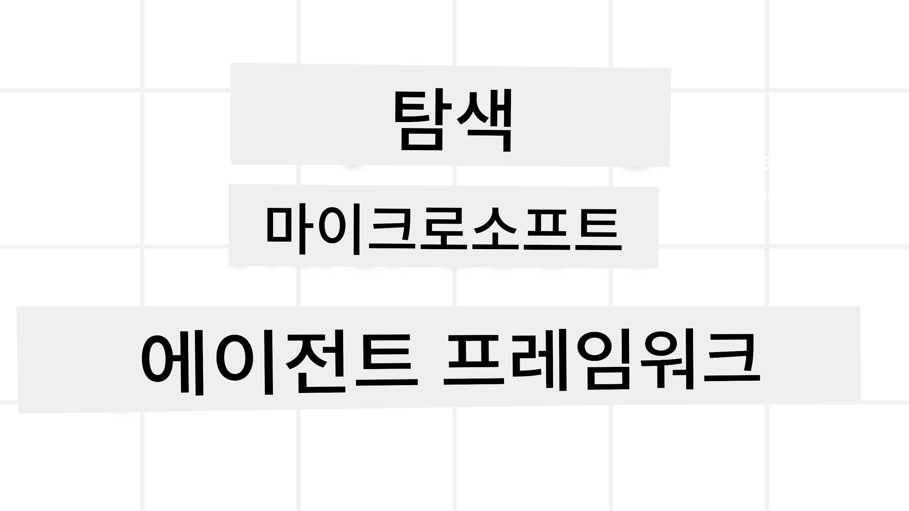
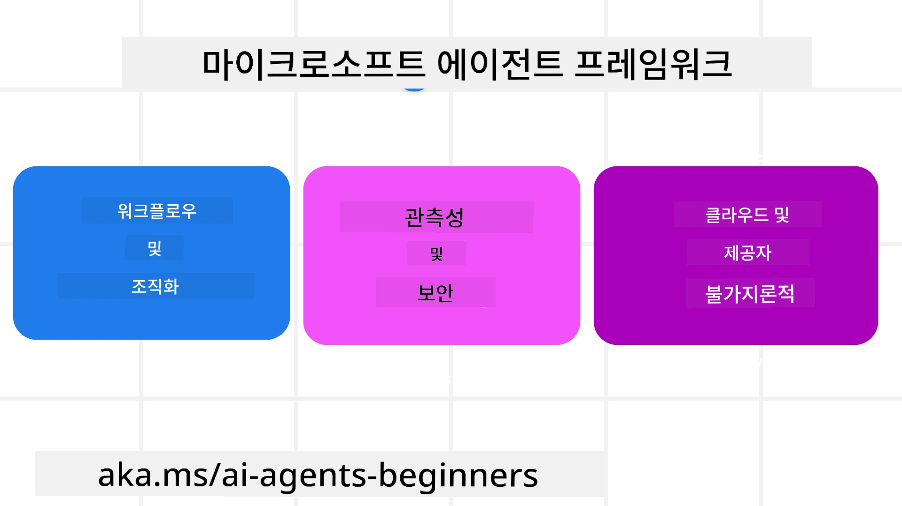
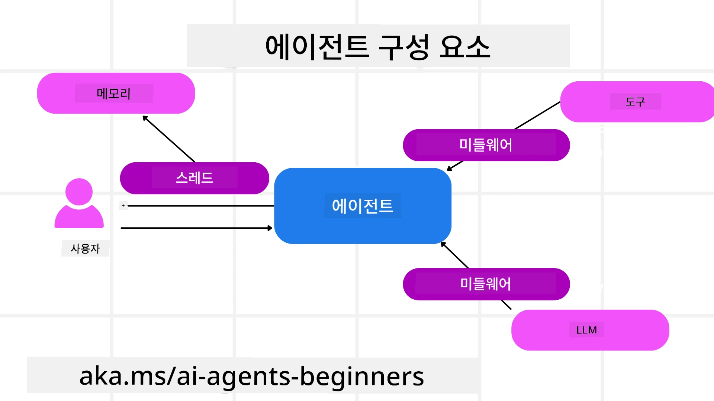

<!--
CO_OP_TRANSLATOR_METADATA:
{
  "original_hash": "19c4dab375acbc733855cc7f2f04edbc",
  "translation_date": "2025-10-01T21:44:50+00:00",
  "source_file": "14-microsoft-agent-framework/README.md",
  "language_code": "ko"
}
-->
# Microsoft Agent Framework 탐구하기



### 소개

이 강의에서는 다음 내용을 다룹니다:

- Microsoft Agent Framework 이해하기: 주요 기능과 가치  
- Microsoft Agent Framework의 핵심 개념 탐구
- MAF와 Semantic Kernel 및 AutoGen 비교: 마이그레이션 가이드

## 학습 목표

이 강의를 완료한 후, 다음을 할 수 있습니다:

- Microsoft Agent Framework를 사용하여 프로덕션 준비된 AI 에이전트 구축
- Microsoft Agent Framework의 핵심 기능을 에이전트 기반 사용 사례에 적용
- 기존 에이전트 기반 프레임워크와 도구를 마이그레이션 및 통합  

## 코드 샘플

[Microsoft Agent Framework (MAF)](https://aka.ms/ai-agents-beginners/agent-framewrok)의 코드 샘플은 이 저장소의 `xx-python-agent-framework` 및 `xx-dotnet-agent-framework` 파일에서 찾을 수 있습니다.

## Microsoft Agent Framework 이해하기



[Microsoft Agent Framework (MAF)](https://aka.ms/ai-agents-beginners/agent-framewrok)는 Semantic Kernel과 AutoGen에서 얻은 경험과 학습을 기반으로 구축되었습니다. 이는 프로덕션 및 연구 환경에서 다양한 에이전트 기반 사용 사례를 처리할 수 있는 유연성을 제공합니다. 주요 시나리오는 다음과 같습니다:

- **순차적 에이전트 오케스트레이션**: 단계별 워크플로가 필요한 경우.
- **동시 오케스트레이션**: 에이전트가 동시에 작업을 완료해야 하는 경우.
- **그룹 채팅 오케스트레이션**: 에이전트가 하나의 작업을 협력하여 수행하는 경우.
- **핸드오프 오케스트레이션**: 에이전트가 하위 작업을 완료하면서 작업을 서로 넘기는 경우.
- **마그네틱 오케스트레이션**: 관리자 에이전트가 작업 목록을 생성 및 수정하고 하위 에이전트를 조정하여 작업을 완료하는 경우.

프로덕션에서 AI 에이전트를 제공하기 위해 MAF는 다음과 같은 기능을 포함합니다:

- **관측 가능성**: OpenTelemetry를 사용하여 AI 에이전트의 모든 작업(도구 호출, 오케스트레이션 단계, 추론 흐름 및 Azure AI Foundry 대시보드를 통한 성능 모니터링)을 추적.
- **보안**: Azure AI Foundry에서 에이전트를 네이티브로 호스팅하여 역할 기반 액세스, 개인 데이터 처리 및 내장된 콘텐츠 안전과 같은 보안 제어 포함.
- **내구성**: 에이전트 스레드와 워크플로가 일시 중지, 재개 및 오류에서 복구 가능하여 장기 실행 프로세스 지원.
- **제어**: 인간이 승인해야 하는 작업을 표시하는 인간 개입 워크플로 지원.

Microsoft Agent Framework는 상호 운용성을 중점적으로 다음을 제공합니다:

- **클라우드 독립성**: 에이전트는 컨테이너, 온프레미스 및 여러 클라우드에서 실행 가능.
- **프로바이더 독립성**: Azure OpenAI 및 OpenAI를 포함한 선호하는 SDK를 통해 에이전트 생성 가능.
- **오픈 표준 통합**: Agent-to-Agent(A2A) 및 Model Context Protocol(MCP)과 같은 프로토콜을 사용하여 다른 에이전트 및 도구를 발견하고 활용 가능.
- **플러그인 및 커넥터**: Microsoft Fabric, SharePoint, Pinecone 및 Qdrant과 같은 데이터 및 메모리 서비스에 연결 가능.

이제 Microsoft Agent Framework의 핵심 개념에 이러한 기능이 어떻게 적용되는지 살펴보겠습니다.

## Microsoft Agent Framework의 핵심 개념

### 에이전트



**에이전트 생성**

에이전트 생성은 추론 서비스(LLM Provider), AI 에이전트가 따를 지침 세트, 그리고 할당된 `name`을 정의하여 이루어집니다:

```python
agent = AzureOpenAIChatClient(credential=AzureCliCredential()).create_agent( instructions="You are good at recommending trips to customers based on their preferences.", name="TripRecommender" )
```

위 코드는 `Azure OpenAI`를 사용하고 있지만, 에이전트는 `Azure AI Foundry Agent Service`를 포함한 다양한 서비스를 사용하여 생성할 수 있습니다:

```python
AzureAIAgentClient(async_credential=credential).create_agent( name="HelperAgent", instructions="You are a helpful assistant." ) as agent
```

OpenAI `Responses`, `ChatCompletion` API

```python
agent = OpenAIResponsesClient().create_agent( name="WeatherBot", instructions="You are a helpful weather assistant.", )
```

```python
agent = OpenAIChatClient().create_agent( name="HelpfulAssistant", instructions="You are a helpful assistant.", )
```

또는 A2A 프로토콜을 사용하는 원격 에이전트:

```python
agent = A2AAgent( name=agent_card.name, description=agent_card.description, agent_card=agent_card, url="https://your-a2a-agent-host" )
```

**에이전트 실행**

에이전트는 `.run` 또는 `.run_stream` 메서드를 사용하여 비스트리밍 또는 스트리밍 응답을 실행합니다.

```python
result = await agent.run("What are good places to visit in Amsterdam?")
print(result.text)
```

```python
async for update in agent.run_stream("What are the good places to visit in Amsterdam?"):
    if update.text:
        print(update.text, end="", flush=True)

```

각 에이전트 실행은 `max_tokens`, 에이전트가 호출할 수 있는 `tools`, 심지어 에이전트에 사용되는 `model`과 같은 매개변수를 사용자 정의할 수 있는 옵션을 포함할 수 있습니다.

이는 특정 모델이나 도구가 사용자의 작업을 완료하는 데 필요한 경우에 유용합니다.

**도구**

도구는 에이전트를 정의할 때:

```python
def get_attractions( location: Annotated[str, Field(description="The location to get the top tourist attractions for")], ) -> str: """Get the top tourist attractions for a given location.""" return f"The top attractions for {location} are." 


# When creating a ChatAgent directly 

agent = ChatAgent( chat_client=OpenAIChatClient(), instructions="You are a helpful assistant", tools=[get_attractions]

```

그리고 에이전트를 실행할 때 정의할 수 있습니다:

```python

result1 = await agent.run( "What's the best place to visit in Seattle?", tools=[get_attractions] # Tool provided for this run only )
```

**에이전트 스레드**

에이전트 스레드는 다중 턴 대화를 처리하는 데 사용됩니다. 스레드는 다음 방법으로 생성할 수 있습니다:

- `get_new_thread()`를 사용하여 스레드를 시간이 지나도 저장 가능.
- 에이전트를 실행할 때 자동으로 스레드를 생성하고 현재 실행 동안만 스레드 유지.

스레드를 생성하려면 코드는 다음과 같습니다:

```python
# Create a new thread. 
thread = agent.get_new_thread() # Run the agent with the thread. 
response = await agent.run("Hello, I am here to help you book travel. Where would you like to go?", thread=thread)

```

그런 다음 스레드를 직렬화하여 나중에 사용할 수 있도록 저장할 수 있습니다:

```python
# Create a new thread. 
thread = agent.get_new_thread() 

# Run the agent with the thread. 

response = await agent.run("Hello, how are you?", thread=thread) 

# Serialize the thread for storage. 

serialized_thread = await thread.serialize() 

# Deserialize the thread state after loading from storage. 

resumed_thread = await agent.deserialize_thread(serialized_thread)
```

**에이전트 미들웨어**

에이전트는 도구와 LLM과 상호작용하여 사용자의 작업을 완료합니다. 특정 시나리오에서는 이러한 상호작용 사이에서 작업을 실행하거나 추적하고 싶을 수 있습니다. 에이전트 미들웨어는 이를 가능하게 합니다:

*Function Middleware*

이 미들웨어는 에이전트와 호출할 함수/도구 사이에서 작업을 실행할 수 있도록 합니다. 예를 들어 함수 호출에 대한 로깅을 수행하고 싶을 때 사용됩니다.

아래 코드에서 `next`는 다음 미들웨어 또는 실제 함수를 호출할지 정의합니다.

```python
async def logging_function_middleware(
    context: FunctionInvocationContext,
    next: Callable[[FunctionInvocationContext], Awaitable[None]],
) -> None:
    """Function middleware that logs function execution."""
    # Pre-processing: Log before function execution
    print(f"[Function] Calling {context.function.name}")

    # Continue to next middleware or function execution
    await next(context)

    # Post-processing: Log after function execution
    print(f"[Function] {context.function.name} completed")
```

*Chat Middleware*

이 미들웨어는 에이전트와 LLM 간 요청 사이에서 작업을 실행하거나 로깅할 수 있도록 합니다.

여기에는 AI 서비스에 전송되는 `messages`와 같은 중요한 정보가 포함됩니다.

```python
async def logging_chat_middleware(
    context: ChatContext,
    next: Callable[[ChatContext], Awaitable[None]],
) -> None:
    """Chat middleware that logs AI interactions."""
    # Pre-processing: Log before AI call
    print(f"[Chat] Sending {len(context.messages)} messages to AI")

    # Continue to next middleware or AI service
    await next(context)

    # Post-processing: Log after AI response
    print("[Chat] AI response received")

```

**에이전트 메모리**

`Agentic Memory` 강의에서 다룬 바와 같이, 메모리는 에이전트가 다양한 컨텍스트에서 작동할 수 있도록 하는 중요한 요소입니다. MAF는 여러 유형의 메모리를 제공합니다:

*인메모리 저장소*

애플리케이션 런타임 동안 스레드에 저장된 메모리입니다.

```python
# Create a new thread. 
thread = agent.get_new_thread() # Run the agent with the thread. 
response = await agent.run("Hello, I am here to help you book travel. Where would you like to go?", thread=thread)
```

*영구 메시지*

다른 세션 간 대화 기록을 저장할 때 사용되는 메모리입니다. `chat_message_store_factory`를 사용하여 정의됩니다:

```python
from agent_framework import ChatMessageStore

# Create a custom message store
def create_message_store():
    return ChatMessageStore()

agent = ChatAgent(
    chat_client=OpenAIChatClient(),
    instructions="You are a Travel assistant.",
    chat_message_store_factory=create_message_store
)

```

*동적 메모리*

에이전트를 실행하기 전에 컨텍스트에 추가되는 메모리입니다. 이러한 메모리는 mem0과 같은 외부 서비스에 저장될 수 있습니다:

```python
from agent_framework.mem0 import Mem0Provider

# Using Mem0 for advanced memory capabilities
memory_provider = Mem0Provider(
    api_key="your-mem0-api-key",
    user_id="user_123",
    application_id="my_app"
)

agent = ChatAgent(
    chat_client=OpenAIChatClient(),
    instructions="You are a helpful assistant with memory.",
    context_providers=memory_provider
)

```

**에이전트 관측 가능성**

관측 가능성은 신뢰할 수 있고 유지 관리 가능한 에이전트 기반 시스템을 구축하는 데 중요합니다. MAF는 OpenTelemetry와 통합하여 추적 및 미터를 제공하여 관측 가능성을 향상시킵니다.

```python
from agent_framework.observability import get_tracer, get_meter

tracer = get_tracer()
meter = get_meter()
with tracer.start_as_current_span("my_custom_span"):
    # do something
    pass
counter = meter.create_counter("my_custom_counter")
counter.add(1, {"key": "value"})
```

### 워크플로

MAF는 작업을 완료하기 위한 사전 정의된 단계를 제공하며, 이러한 단계에서 AI 에이전트를 구성 요소로 포함합니다.

워크플로는 더 나은 제어 흐름을 가능하게 하는 다양한 구성 요소로 구성됩니다. 워크플로는 **다중 에이전트 오케스트레이션** 및 **체크포인트**를 통해 워크플로 상태를 저장할 수 있습니다.

워크플로의 핵심 구성 요소는 다음과 같습니다:

**실행자**

실행자는 입력 메시지를 받고, 할당된 작업을 수행한 후 출력 메시지를 생성합니다. 이는 워크플로를 더 큰 작업 완료로 진행시킵니다. 실행자는 AI 에이전트 또는 사용자 정의 로직일 수 있습니다.

**엣지**

엣지는 워크플로에서 메시지의 흐름을 정의하는 데 사용됩니다. 다음과 같은 유형이 있습니다:

*직접 엣지* - 실행자 간 단순한 일대일 연결:

```python
from agent_framework import WorkflowBuilder

builder = WorkflowBuilder()
builder.add_edge(source_executor, target_executor)
builder.set_start_executor(source_executor)
workflow = builder.build()
```

*조건부 엣지* - 특정 조건이 충족된 후 활성화됩니다. 예를 들어, 호텔 객실이 없을 때 실행자가 다른 옵션을 제안할 수 있습니다.

*스위치-케이스 엣지* - 정의된 조건에 따라 메시지를 다른 실행자로 라우팅합니다. 예를 들어, 여행 고객이 우선 접근 권한을 가지고 있을 경우 다른 워크플로를 통해 작업이 처리됩니다.

*팬아웃 엣지* - 하나의 메시지를 여러 대상에 전송.

*팬인 엣지* - 여러 실행자로부터 여러 메시지를 수집하여 하나의 대상에 전송.

**이벤트**

워크플로에 대한 더 나은 관측 가능성을 제공하기 위해 MAF는 실행에 대한 내장 이벤트를 제공합니다:

- `WorkflowStartedEvent` - 워크플로 실행 시작
- `WorkflowOutputEvent` - 워크플로가 출력 생성
- `WorkflowErrorEvent` - 워크플로에서 오류 발생
- `ExecutorInvokeEvent` - 실행자가 처리 시작
- `ExecutorCompleteEvent` - 실행자가 처리 완료
- `RequestInfoEvent` - 요청 발행

## 다른 프레임워크(Semantic Kernel 및 AutoGen)에서 마이그레이션

### MAF와 Semantic Kernel의 차이점

**간소화된 에이전트 생성**

Semantic Kernel은 에이전트마다 Kernel 인스턴스를 생성해야 합니다. MAF는 주요 프로바이더에 대한 확장을 사용하여 간소화된 접근 방식을 제공합니다.

```python
agent = AzureOpenAIChatClient(credential=AzureCliCredential()).create_agent( instructions="You are good at reccomending trips to customers based on their preferences.", name="TripRecommender" )
```

**에이전트 스레드 생성**

Semantic Kernel은 스레드를 수동으로 생성해야 합니다. MAF에서는 에이전트에 직접 스레드가 할당됩니다.

```python
thread = agent.get_new_thread() # Run the agent with the thread. 
```

**도구 등록**

Semantic Kernel에서는 도구가 Kernel에 등록되고 Kernel이 에이전트에 전달됩니다. MAF에서는 도구가 에이전트 생성 과정에서 직접 등록됩니다.

```python
agent = ChatAgent( chat_client=OpenAIChatClient(), instructions="You are a helpful assistant", tools=[get_attractions]
```

### MAF와 AutoGen의 차이점

**팀 vs 워크플로**

AutoGen에서는 에이전트의 이벤트 기반 활동을 위한 구조로 `Teams`를 사용합니다. MAF는 데이터를 실행자에게 그래프 기반 아키텍처를 통해 라우팅하는 `Workflows`를 사용합니다.

**도구 생성**

AutoGen은 에이전트가 호출할 함수를 래핑하기 위해 `FunctionTool`을 사용합니다. MAF는 @ai_function을 사용하며, 이는 유사하게 작동하지만 각 함수에 대한 스키마를 자동으로 추론합니다.

**에이전트 동작**

AutoGen에서는 기본적으로 에이전트가 단일 턴 에이전트이며, `max_tool_iterations`을 더 높게 설정해야 다중 턴이 가능합니다. MAF에서는 `ChatAgent`가 기본적으로 다중 턴으로 설정되어 있어 사용자의 작업이 완료될 때까지 도구를 계속 호출합니다.

## 코드 샘플

Microsoft Agent Framework의 코드 샘플은 이 저장소의 `xx-python-agent-framework` 및 `xx-dotnet-agent-framework` 파일에서 찾을 수 있습니다.

## Microsoft Agent Framework에 대해 더 궁금한 점이 있으신가요?

[Azure AI Foundry Discord](https://aka.ms/ai-agents/discord)에 참여하여 다른 학습자들과 만나고, 오피스 아워에 참석하며, AI 에이전트에 대한 질문에 답변을 받을 수 있습니다.

---

**면책 조항**:  
이 문서는 AI 번역 서비스 [Co-op Translator](https://github.com/Azure/co-op-translator)를 사용하여 번역되었습니다. 정확성을 위해 최선을 다하고 있으나, 자동 번역에는 오류나 부정확성이 포함될 수 있습니다. 원본 문서의 원어 버전을 권위 있는 자료로 간주해야 합니다. 중요한 정보의 경우, 전문적인 인간 번역을 권장합니다. 이 번역 사용으로 인해 발생하는 오해나 잘못된 해석에 대해 당사는 책임을 지지 않습니다.