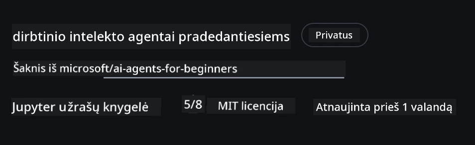
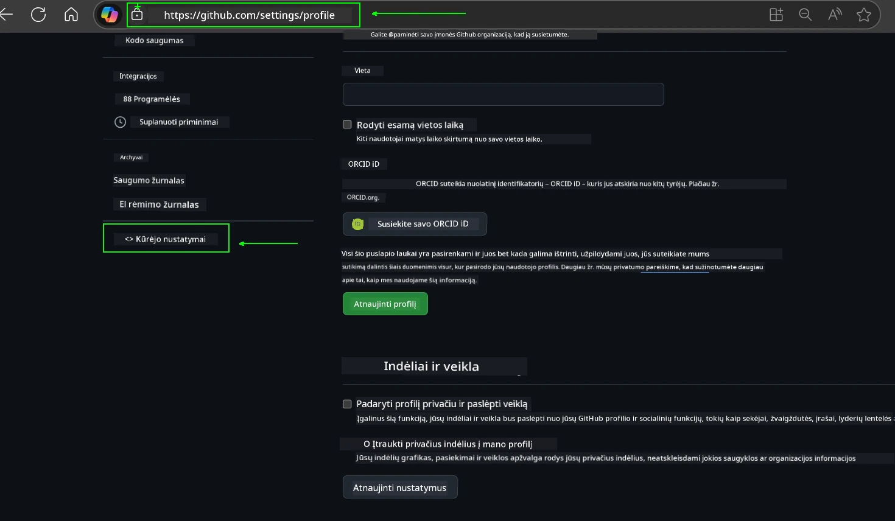
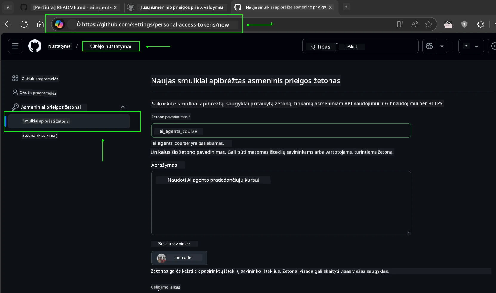
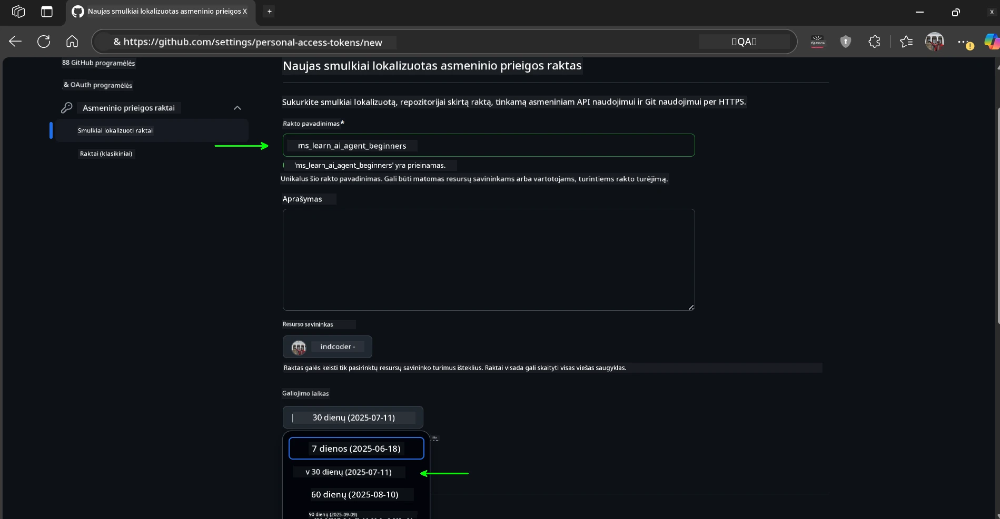
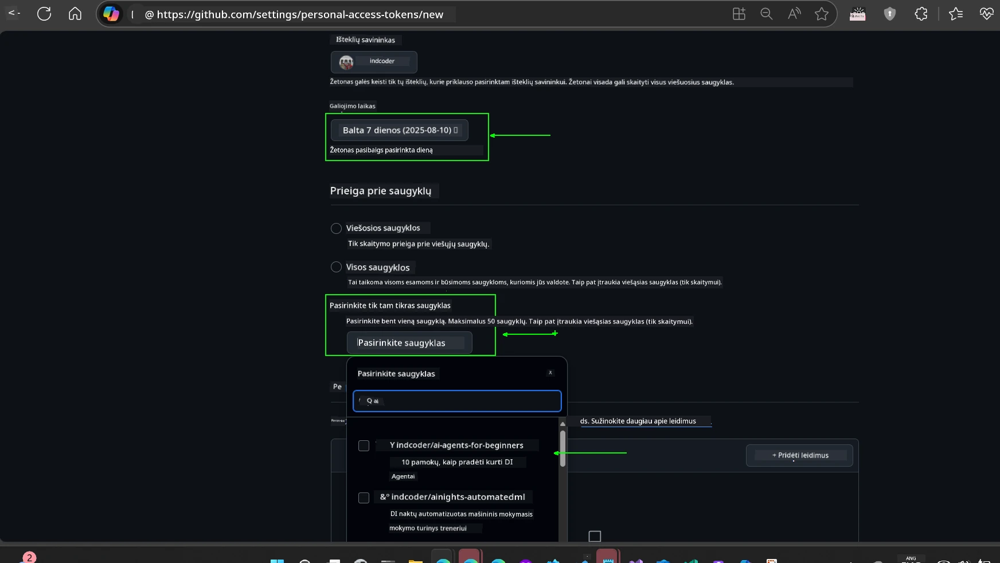
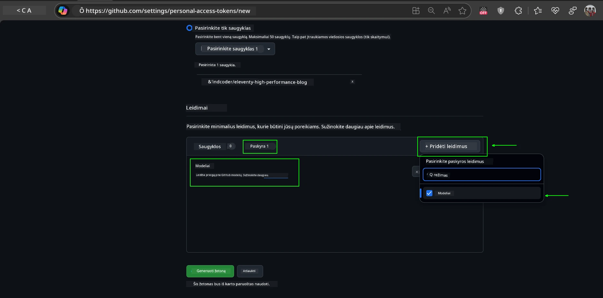
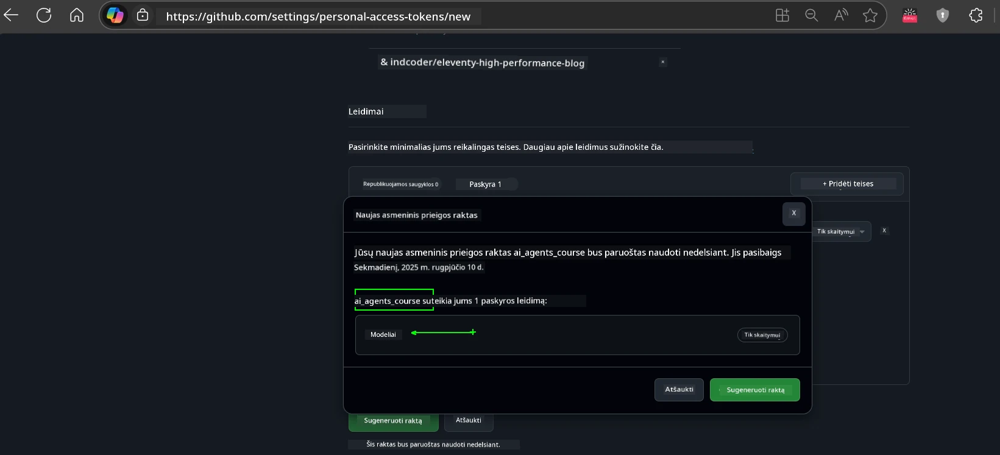
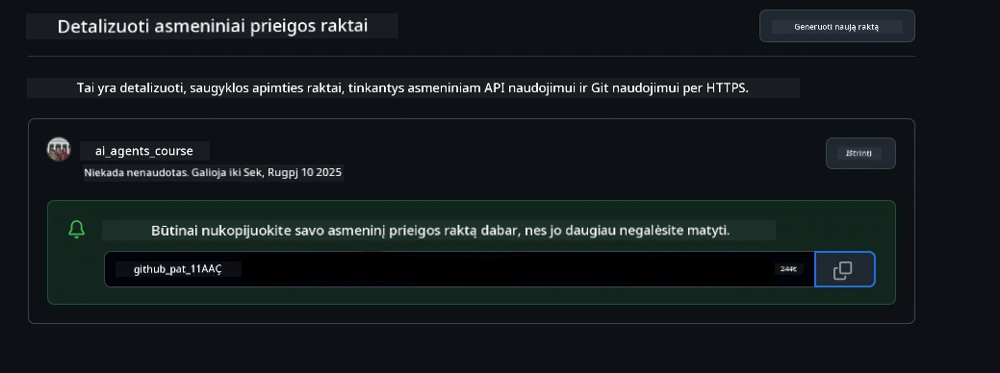
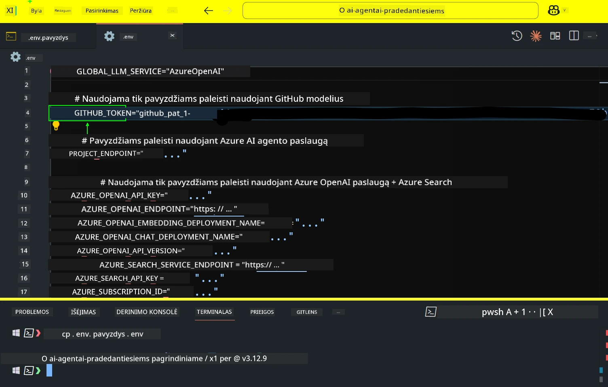
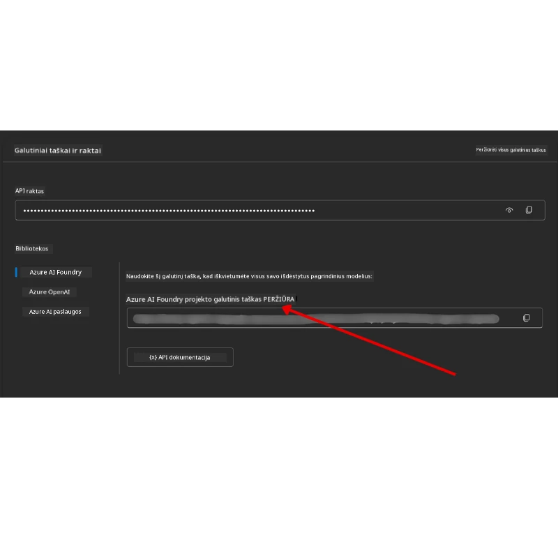

<!--
CO_OP_TRANSLATOR_METADATA:
{
  "original_hash": "63b1a8f6e840df15934935b728e569f0",
  "translation_date": "2025-12-03T15:12:53+00:00",
  "source_file": "00-course-setup/README.md",
  "language_code": "lt"
}
-->
# Kursų nustatymas

## Įvadas

Šioje pamokoje aptarsime, kaip paleisti šio kurso kodų pavyzdžius.

## Prisijunkite prie kitų mokinių ir gaukite pagalbos

Prieš pradėdami klonuoti savo saugyklą, prisijunkite prie [AI Agents For Beginners Discord kanalo](https://aka.ms/ai-agents/discord), kad gautumėte pagalbos dėl nustatymo, atsakymų į klausimus apie kursą ar galėtumėte susisiekti su kitais mokiniais.

## Klonuokite arba šakokite šią saugyklą

Norėdami pradėti, prašome klonuoti arba šakoti GitHub saugyklą. Tai sukurs jūsų asmeninę kurso medžiagos versiją, kad galėtumėte paleisti, testuoti ir koreguoti kodą!

Tai galite padaryti paspaudę nuorodą <a href="https://github.com/microsoft/ai-agents-for-beginners/fork" target="_blank">šakoti saugyklą</a>

Dabar turėtumėte turėti savo šakotą šio kurso versiją šioje nuorodoje:



### Paviršutiniškas klonavimas (rekomenduojama dirbtuvėms / Codespaces)

  >Visa saugykla gali būti didelė (~3 GB), kai atsisiunčiate visą istoriją ir visus failus. Jei dalyvaujate tik dirbtuvėse arba jums reikia tik kelių pamokų aplankų, paviršutiniškas klonavimas (arba dalinis klonavimas) leidžia išvengti didžiosios dalies atsisiuntimo, sutrumpinant istoriją ir/arba praleidžiant failus.

#### Greitas paviršutiniškas klonavimas — minimalus istorijos kiekis, visi failai

Pakeiskite `<your-username>` žemiau pateiktuose komandose savo šakos URL (arba pirminį URL, jei pageidaujate).

Norėdami klonuoti tik naujausią istorijos įrašą (mažas atsisiuntimas):

```bash|powershell
git clone --depth 1 https://github.com/<your-username>/ai-agents-for-beginners.git
```

Norėdami klonuoti konkrečią šaką:

```bash|powershell
git clone --depth 1 --branch <branch-name> https://github.com/<your-username>/ai-agents-for-beginners.git
```

#### Dalinis (dalinis) klonavimas — minimalūs failai + tik pasirinkti aplankai

Tai naudoja dalinį klonavimą ir dalinį patikrinimą (reikalinga Git 2.25+ ir rekomenduojama moderni Git versija su dalinio klonavimo palaikymu):

```bash|powershell
git clone --depth 1 --filter=blob:none --sparse https://github.com/<your-username>/ai-agents-for-beginners.git
```

Pereikite į saugyklos aplanką:

```bash|powershell
cd ai-agents-for-beginners
```

Tada nurodykite, kuriuos aplankus norite (žemiau pateiktame pavyzdyje rodomi du aplankai):

```bash|powershell
git sparse-checkout set 00-course-setup 01-intro-to-ai-agents
```

Po klonavimo ir failų patikrinimo, jei jums reikia tik failų ir norite atlaisvinti vietą (be git istorijos), prašome ištrinti saugyklos metaduomenis (💀negrįžtama — prarasite visą Git funkcionalumą: jokių įrašų, traukimų, stūmimų ar istorijos prieigos).

```bash
# zsh/bash
rm -rf .git
```

```powershell
# PowerShell
Remove-Item -Recurse -Force .git
```

#### Naudojant GitHub Codespaces (rekomenduojama išvengti vietinių didelių atsisiuntimų)

- Sukurkite naują Codespace šiai saugyklai per [GitHub UI](https://github.com/codespaces).  

- Naujoje Codespace terminale paleiskite vieną iš paviršutiniško/dalinio klonavimo komandų, kad įtrauktumėte tik jums reikalingus pamokų aplankus į Codespace darbo aplinką.
- Pasirinktinai: po klonavimo Codespaces viduje, pašalinkite .git, kad atgautumėte papildomą vietą (žr. pašalinimo komandas aukščiau).
- Pastaba: Jei pageidaujate atidaryti saugyklą tiesiogiai Codespaces (be papildomo klonavimo), atkreipkite dėmesį, kad Codespaces sukurs devcontainer aplinką ir vis tiek gali paruošti daugiau nei jums reikia. Klonuojant paviršutinišką kopiją šviežioje Codespace suteikia daugiau kontrolės disko naudojimui.

#### Patarimai

- Visada pakeiskite klonavimo URL savo šaka, jei norite redaguoti/įrašyti.
- Jei vėliau jums reikia daugiau istorijos ar failų, galite juos gauti arba koreguoti dalinį patikrinimą, kad įtrauktumėte papildomus aplankus.

## Kodo paleidimas

Šis kursas siūlo seriją Jupyter Notebooks, kuriuos galite paleisti, kad praktiškai išmoktumėte kurti AI agentus.

Kodo pavyzdžiai naudoja:

**Reikalinga GitHub paskyra - nemokama**:

1) Semantic Kernel Agent Framework + GitHub Models Marketplace. Pažymėta kaip (semantic-kernel.ipynb)
2) AutoGen Framework + GitHub Models Marketplace. Pažymėta kaip (autogen.ipynb)

**Reikalinga Azure prenumerata**:

3) Azure AI Foundry + Azure AI Agent Service. Pažymėta kaip (azureaiagent.ipynb)

Rekomenduojame išbandyti visus tris pavyzdžių tipus, kad pamatytumėte, kuris jums geriausiai tinka.

Kurią parinktį pasirinksite, tai nulems, kokius nustatymo veiksmus turėsite atlikti žemiau:

## Reikalavimai

- Python 3.12+
  - **PASTABA**: Jei neturite Python3.12 įdiegto, įsitikinkite, kad jį įdiegėte. Tada sukurkite savo venv naudodami python3.12, kad užtikrintumėte, jog teisingos versijos bus įdiegtos iš requirements.txt failo.
  
    >Pavyzdys

    Sukurkite Python venv aplanką:

    ```bash|powershell
    python -m venv venv
    ```

    Tada aktyvuokite venv aplinką:

    ```bash
    # zsh/bash
    source venv/bin/activate
    ```
  
    ```dos
    # Command Prompt for Windows
    venv\Scripts\activate
    ```

- .NET 10+: Norėdami naudoti pavyzdinius kodus su .NET, įsitikinkite, kad įdiegėte [.NET 10 SDK](https://dotnet.microsoft.com/download/dotnet/10.0) arba naujesnę versiją. Tada patikrinkite savo įdiegtą .NET SDK versiją:

    ```bash|powershell
    dotnet --list-sdks
    ```

- GitHub paskyra - Norint pasiekti GitHub Models Marketplace
- Azure prenumerata - Norint pasiekti Azure AI Foundry
- Azure AI Foundry paskyra - Norint pasiekti Azure AI Agent Service

Mes įtraukėme `requirements.txt` failą šios saugyklos šaknyje, kuriame yra visi reikalingi Python paketai, kad galėtumėte paleisti kodo pavyzdžius.

Juos galite įdiegti paleisdami šią komandą savo terminale saugyklos šaknyje:

```bash|powershell
pip install -r requirements.txt
```

Rekomenduojame sukurti Python virtualią aplinką, kad išvengtumėte konfliktų ir problemų.

## VSCode nustatymas

Įsitikinkite, kad naudojate tinkamą Python versiją VSCode.


## Nustatymas pavyzdžiams naudojant GitHub Models 

### 1 žingsnis: Gaukite savo GitHub asmeninio prieigos žetoną (PAT)

Šis kursas naudoja GitHub Models Marketplace, suteikiant nemokamą prieigą prie didelių kalbos modelių (LLMs), kuriuos naudosite kurdami AI agentus.

Norėdami naudoti GitHub Models, turėsite sukurti [GitHub asmeninio prieigos žetoną](https://docs.github.com/en/authentication/keeping-your-account-and-data-secure/managing-your-personal-access-tokens).

Tai galite padaryti eidami į savo <a href="https://github.com/settings/personal-access-tokens" target="_blank">Asmeninio prieigos žetonų nustatymus</a> savo GitHub paskyroje.

Prašome laikytis [Mažiausio privilegijų principo](https://docs.github.com/en/get-started/learning-to-code/storing-your-secrets-safely) kuriant savo žetoną. Tai reiškia, kad turėtumėte suteikti žetonui tik tas teises, kurių reikia, kad galėtumėte paleisti šio kurso kodo pavyzdžius.

1. Pasirinkite `Fine-grained tokens` parinktį kairėje ekrano pusėje, eidami į **Kūrėjo nustatymus**

   

   Tada pasirinkite `Generate new token`.

   

2. Įveskite aprašomąjį žetono pavadinimą, kuris atspindi jo paskirtį, kad vėliau būtų lengva jį identifikuoti.

    🔐 Žetono trukmės rekomendacija

    Rekomenduojama trukmė: 30 dienų
    Dėl saugesnės pozicijos galite pasirinkti trumpesnį laikotarpį—pvz., 7 dienas 🛡️
    Tai puikus būdas nustatyti asmeninį tikslą ir baigti kursą, kol jūsų mokymosi tempas yra aukštas 🚀.

    

3. Apribokite žetono apimtį savo šakai šioje saugykloje.

    

4. Apribokite žetono teises: Skiltyje **Teisės**, spustelėkite **Paskyros** skirtuką ir spustelėkite "+ Pridėti teises" mygtuką. Atsiras išskleidžiamasis meniu. Prašome ieškoti **Models** ir pažymėti langelį.

    

5. Patikrinkite reikiamas teises prieš generuodami žetoną. 

6. Prieš generuodami žetoną, įsitikinkite, kad esate pasiruošę saugoti žetoną saugioje vietoje, pvz., slaptažodžių valdymo saugykloje, nes jis nebus rodomas dar kartą po jo sukūrimo. 

Nukopijuokite naują žetoną, kurį ką tik sukūrėte. Dabar pridėsite jį į savo `.env` failą, įtrauktą į šį kursą.

### 2 žingsnis: Sukurkite savo `.env` failą

Norėdami sukurti savo `.env` failą, paleiskite šią komandą savo terminale.

```bash
# zsh/bash
cp .env.example .env
```

```powershell
# PowerShell
Copy-Item .env.example .env
```

Tai nukopijuos pavyzdinį failą ir sukurs `.env` jūsų kataloge, kur užpildysite aplinkos kintamųjų reikšmes.

Nukopijavę savo žetoną, atidarykite `.env` failą savo mėgstamame teksto redaktoriuje ir įklijuokite savo žetoną į `GITHUB_TOKEN` lauką.



Dabar turėtumėte galėti paleisti šio kurso kodo pavyzdžius.

## Nustatymas pavyzdžiams naudojant Azure AI Foundry ir Azure AI Agent Service

### 1 žingsnis: Gaukite savo Azure projekto galutinį tašką

Sekite žingsnius, kaip sukurti centrą ir projektą Azure AI Foundry, pateiktus čia: [Centro išteklių apžvalga](https://learn.microsoft.com/azure/ai-foundry/concepts/ai-resources)

Kai sukursite savo projektą, turėsite gauti savo projekto prisijungimo eilutę.

Tai galite padaryti eidami į **Apžvalgos** puslapį savo projekte Azure AI Foundry portale.



### 2 žingsnis: Sukurkite savo `.env` failą

Norėdami sukurti savo `.env` failą, paleiskite šią komandą savo terminale.

```bash
# zsh/bash
cp .env.example .env
```

```powershell
# PowerShell
Copy-Item .env.example .env
```

Tai nukopijuos pavyzdinį failą ir sukurs `.env` jūsų kataloge, kur užpildysite aplinkos kintamųjų reikšmes.

Nukopijavę savo žetoną, atidarykite `.env` failą savo mėgstamame teksto redaktoriuje ir įklijuokite savo žetoną į `PROJECT_ENDPOINT` lauką.

### 3 žingsnis: Prisijunkite prie Azure

Kaip saugumo geriausia praktika, naudosime [autentifikaciją be raktų](https://learn.microsoft.com/azure/developer/ai/keyless-connections?tabs=csharp%2Cazure-cli?WT.mc_id=academic-105485-koreyst), kad autentifikuotume prie Azure OpenAI su Microsoft Entra ID. 

Tada atidarykite terminalą ir paleiskite `az login --use-device-code`, kad prisijungtumėte prie savo Azure paskyros.

Kai prisijungsite, pasirinkite savo prenumeratą terminale.

## Papildomi aplinkos kintamieji - Azure Search ir Azure OpenAI 

Agentic RAG pamokai - 5 pamoka - yra pavyzdžių, kurie naudoja Azure Search ir Azure OpenAI.

Jei norite paleisti šiuos pavyzdžius, turėsite pridėti šiuos aplinkos kintamuosius į savo `.env` failą:

### Apžvalgos puslapis (Projektas)

- `AZURE_SUBSCRIPTION_ID` - Patikrinkite **Projekto detales** **Apžvalgos** puslapyje savo projekte.

- `AZURE_AI_PROJECT_NAME` - Pažvelkite į **Apžvalgos** puslapio viršų savo projekte.

- `AZURE_OPENAI_SERVICE` - Raskite tai **Įtrauktų galimybių** skirtuke **Azure OpenAI Service** **Apžvalgos** puslapyje.

### Valdymo centras

- `AZURE_OPENAI_RESOURCE_GROUP` - Eikite į **Projekto savybes** **Apžvalgos** puslapyje **Valdymo centre**.

- `GLOBAL_LLM_SERVICE` - Skiltyje **Susiję ištekliai**, raskite **Azure AI Services** prisijungimo pavadinimą. Jei nerandate, patikrinkite **Azure portalą** savo išteklių grupėje dėl AI Services išteklių pavadinimo.

### Modeliai + galutiniai taškai puslapis

- `AZURE_OPENAI_EMBEDDING_DEPLOYMENT_NAME` - Pasirinkite savo įterpimo modelį (pvz., `text-embedding-ada-002`) ir užsirašykite **Diegimo pavadinimą** iš modelio detalių.

- `AZURE_OPENAI_CHAT_DEPLOYMENT_NAME` - Pasirinkite savo pokalbio modelį (pvz., `gpt-4o-mini`) ir užsirašykite **Diegimo pavadinimą** iš modelio detalių.

### Azure portalas

- `AZURE_OPENAI_ENDPOINT` - Ieškokite **Azure AI services**, spustelėkite jį, tada eikite į **Išteklių valdymas**, **Raktai ir galutiniai taškai**, slinkite žemyn iki "Azure OpenAI galutiniai taškai" ir nukopijuokite tą, kuris sako "Kalbos API".

- `AZURE_OPENAI_API_KEY` - Iš to paties ekrano nukopijuokite RAKTĄ 1 arba RAKTĄ 2.

- `AZURE_SEARCH_SERVICE_ENDPOINT` - Raskite savo **Azure AI Search** išteklių, spustelėkite jį ir peržiūrėkite **Apžvalga**.

- `AZURE_SEARCH_API_KEY` - Tada eikite į **Nustatymai** ir tada **Raktai**, kad nukopijuotumėte pirminį arba antrinį administratoriaus raktą.

### Išorinė svetainė

- `AZURE_OPENAI_API_VERSION` - Apsilankykite [API versijos gyvavimo ciklo](https://learn.microsoft.com/azure/ai-services/openai/api-version-deprecation#latest-ga-api-release) puslapyje skiltyje **Naujausia GA API versija**.

### Nustatykite autentifikaciją be raktų

Užuot kodavę savo kredencialus, naudosime ryšį be raktų su Azure OpenAI. Tam importuosime `DefaultAzureCredential` ir vėliau iškviesime `DefaultAzureCredential` funkciją, kad g
Jei kyla problemų vykdant šį nustatymą, prisijunkite prie mūsų <a href="https://discord.gg/kzRShWzttr" target="_blank">Azure AI Community Discord</a> arba <a href="https://github.com/microsoft/ai-agents-for-beginners/issues?WT.mc_id=academic-105485-koreyst" target="_blank">sukurkite problemos pranešimą</a>.

## Kita pamoka

Dabar esate pasiruošę vykdyti šio kurso kodą. Smagaus mokymosi apie AI agentų pasaulį!

[Įvadas į AI agentus ir agentų naudojimo atvejus](../01-intro-to-ai-agents/README.md)

---

<!-- CO-OP TRANSLATOR DISCLAIMER START -->
**Atsakomybės apribojimas**:  
Šis dokumentas buvo išverstas naudojant AI vertimo paslaugą [Co-op Translator](https://github.com/Azure/co-op-translator). Nors stengiamės užtikrinti tikslumą, prašome atkreipti dėmesį, kad automatiniai vertimai gali turėti klaidų ar netikslumų. Originalus dokumentas jo gimtąja kalba turėtų būti laikomas autoritetingu šaltiniu. Kritinei informacijai rekomenduojama naudoti profesionalų žmogaus vertimą. Mes neprisiimame atsakomybės už nesusipratimus ar neteisingus interpretavimus, atsiradusius dėl šio vertimo naudojimo.
<!-- CO-OP TRANSLATOR DISCLAIMER END -->