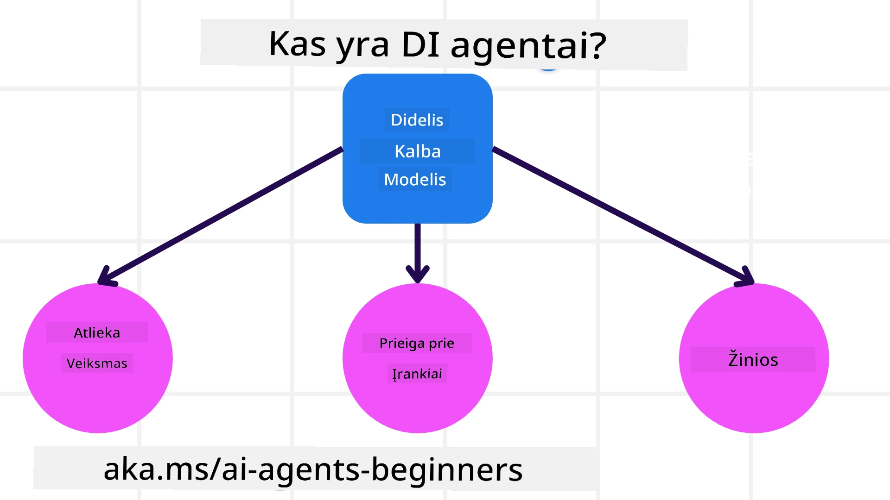
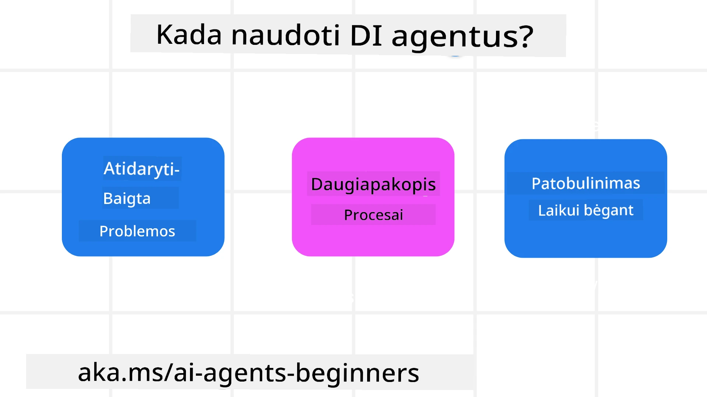

<!--
CO_OP_TRANSLATOR_METADATA:
{
  "original_hash": "cdd28bc00816d2773bb2b5968d782abc",
  "translation_date": "2025-11-11T11:48:22+00:00",
  "source_file": "01-intro-to-ai-agents/README.md",
  "language_code": "lt"
}
-->

> _(Spustelėkite paveikslėlį aukščiau, kad peržiūrėtumėte šios pamokos vaizdo įrašą)_

# Įvadas į AI agentus ir jų panaudojimo atvejus

Sveiki atvykę į kursą „AI agentai pradedantiesiems“! Šis kursas suteikia pagrindines žinias ir praktinius pavyzdžius, kaip kurti AI agentus.

Prisijunkite prie <a href="https://discord.gg/kzRShWzttr" target="_blank">Azure AI Discord bendruomenės</a>, kad susipažintumėte su kitais besimokančiaisiais ir AI agentų kūrėjais bei užduotumėte klausimus apie šį kursą.

Pradėdami šį kursą, pirmiausia geriau suprasime, kas yra AI agentai ir kaip juos galime panaudoti kuriant programas ir darbo eigas.

## Įvadas

Šioje pamokoje aptariama:

- Kas yra AI agentai ir kokie yra jų tipai?
- Kokie panaudojimo atvejai geriausiai tinka AI agentams ir kaip jie gali mums padėti?
- Kokie yra pagrindiniai elementai, kuriant agentinius sprendimus?

## Mokymosi tikslai
Baigę šią pamoką, turėtumėte:

- Suprasti AI agentų koncepcijas ir kuo jie skiriasi nuo kitų AI sprendimų.
- Efektyviai taikyti AI agentus.
- Produktyviai kurti agentinius sprendimus tiek vartotojams, tiek klientams.

## AI agentų apibrėžimas ir tipai

### Kas yra AI agentai?

AI agentai yra **sistemos**, kurios leidžia **dideliems kalbos modeliams (LLMs)** **vykdyti veiksmus**, išplėsdami jų galimybes suteikdami jiems **prieigą prie įrankių** ir **žinių**.

Išskaidykime šį apibrėžimą į mažesnes dalis:

- **Sistema** - Svarbu galvoti apie agentus ne kaip apie vieną komponentą, o kaip apie daugelio komponentų sistemą. Pagrindiniai AI agento komponentai yra:
  - **Aplinka** - Apibrėžta erdvė, kurioje veikia AI agentas. Pavyzdžiui, jei turėtume kelionių rezervavimo AI agentą, aplinka galėtų būti kelionių rezervavimo sistema, kurią agentas naudoja užduotims atlikti.
  - **Jutikliai** - Aplinka turi informaciją ir teikia grįžtamąjį ryšį. AI agentai naudoja jutiklius, kad surinktų ir interpretuotų informaciją apie dabartinę aplinkos būseną. Kelionių rezervavimo agento pavyzdyje sistema gali pateikti informaciją, pvz., viešbučių prieinamumą ar skrydžių kainas.
  - **Aktuatoriai** - Kai AI agentas gauna dabartinę aplinkos būseną, jis nustato, kokį veiksmą atlikti, kad pakeistų aplinką. Kelionių rezervavimo agento atveju tai gali būti kambario rezervavimas vartotojui.

**Dideli kalbos modeliai** - Agentų koncepcija egzistavo dar prieš LLM sukūrimą. AI agentų kūrimo su LLM privalumas yra jų gebėjimas interpretuoti žmogaus kalbą ir duomenis. Šis gebėjimas leidžia LLM interpretuoti aplinkos informaciją ir apibrėžti planą, kaip pakeisti aplinką.

**Veiksmų vykdymas** - Už AI agentų sistemų ribų LLM yra riboti situacijose, kur veiksmas yra turinio ar informacijos generavimas pagal vartotojo užklausą. AI agentų sistemose LLM gali atlikti užduotis interpretuodami vartotojo prašymą ir naudodami įrankius, kurie yra prieinami jų aplinkoje.

**Prieiga prie įrankių** - Kokius įrankius LLM turi prieigą, apibrėžia 1) aplinka, kurioje jis veikia, ir 2) AI agento kūrėjas. Mūsų kelionių agento pavyzdyje agento įrankiai yra ribojami operacijų, kurias galima atlikti rezervavimo sistemoje, arba kūrėjas gali apriboti agento prieigą prie skrydžių.

**Atmintis + žinios** - Atmintis gali būti trumpalaikė, susijusi su pokalbiu tarp vartotojo ir agento. Ilgalaikėje perspektyvoje, be informacijos, kurią teikia aplinka, AI agentai taip pat gali gauti žinių iš kitų sistemų, paslaugų, įrankių ir net kitų agentų. Kelionių agento pavyzdyje šios žinios galėtų būti informacija apie vartotojo kelionių pageidavimus, esančius klientų duomenų bazėje.

### Skirtingi agentų tipai

Dabar, kai turime bendrą AI agentų apibrėžimą, pažvelkime į konkrečius agentų tipus ir kaip jie būtų taikomi kelionių rezervavimo AI agentui.

| **Agentų tipas**              | **Aprašymas**                                                                                                                        | **Pavyzdys**                                                                                                                                                                                                                   |
| ----------------------------- | ------------------------------------------------------------------------------------------------------------------------------------- | ----------------------------------------------------------------------------------------------------------------------------------------------------------------------------------------------------------------------------- |
| **Paprasti refleksiniai agentai** | Atlieka tiesioginius veiksmus pagal iš anksto nustatytas taisykles.                                                                 | Kelionių agentas interpretuoja el. laiško kontekstą ir persiunčia kelionių skundus klientų aptarnavimui.                                                                                                                       |
| **Modeliu pagrįsti refleksiniai agentai** | Atlieka veiksmus remdamiesi pasaulio modeliu ir jo pokyčiais.                                                                      | Kelionių agentas teikia pirmenybę maršrutams su reikšmingais kainų pokyčiais, remdamasis prieiga prie istorinių kainų duomenų.                                                                                                 |
| **Tikslų siekiantys agentai** | Kuria planus, kad pasiektų konkrečius tikslus, interpretuodami tikslą ir nustatydami veiksmus, kaip jį pasiekti.                        | Kelionių agentas rezervuoja kelionę, nustatydamas būtinus kelionės planus (automobilis, viešasis transportas, skrydžiai) nuo dabartinės vietos iki kelionės tikslo.                                                              |
| **Naudingumo pagrindu veikiantys agentai** | Atsižvelgia į pageidavimus ir skaičiuoja kompromisus, kad nustatytų, kaip pasiekti tikslus.                                       | Kelionių agentas maksimaliai padidina naudingumą, vertindamas patogumą ir kainą rezervuojant kelionę.                                                                                                                          |
| **Mokymosi agentai**          | Tobulėja laikui bėgant, reaguodami į grįžtamąjį ryšį ir atitinkamai koreguodami veiksmus.                                              | Kelionių agentas tobulėja, naudodamas klientų atsiliepimus iš apklausų po kelionės, kad atliktų korekcijas būsimoms rezervacijoms.                                                                                              |
| **Hierarchiniai agentai**     | Naudoja kelis agentus hierarchinėje sistemoje, kur aukštesnio lygio agentai suskaido užduotis į mažesnes užduotis, kurias atlieka žemesnio lygio agentai. | Kelionių agentas atšaukia kelionę, suskaidydamas užduotį į mažesnes užduotis (pvz., atšaukiant konkrečias rezervacijas) ir leisdamas žemesnio lygio agentams jas atlikti, pranešant aukštesnio lygio agentui.                     |
| **Daugiagentės sistemos (MAS)** | Agentai savarankiškai atlieka užduotis, bendradarbiaudami arba konkuruodami.                                                          | Bendradarbiavimas: keli agentai rezervuoja konkrečias kelionių paslaugas, tokias kaip viešbučiai, skrydžiai ir pramogos. Konkurencija: keli agentai valdo ir konkuruoja dėl bendro viešbučio rezervavimo kalendoriaus, kad rezervuotų klientus viešbutyje. |

## Kada naudoti AI agentus

Ankstesniame skyriuje mes naudojome kelionių agento panaudojimo atvejį, kad paaiškintume, kaip skirtingi agentų tipai gali būti naudojami skirtingose kelionių rezervavimo scenarijose. Šį pritaikymą naudosime viso kurso metu.

Pažvelkime į panaudojimo atvejus, kuriems AI agentai yra geriausiai pritaikyti:

- **Atviri klausimai** - leidžiant LLM nustatyti reikalingus žingsnius užduočiai atlikti, nes jų ne visada galima užkoduoti darbo eigoje.
- **Daugiapakopiai procesai** - užduotys, kurioms reikia tam tikro sudėtingumo lygio, kai AI agentas turi naudoti įrankius ar informaciją per kelis žingsnius, o ne vienkartinį gavimą.
- **Tobulėjimas laikui bėgant** - užduotys, kuriose agentas gali tobulėti laikui bėgant, gaudamas grįžtamąjį ryšį iš aplinkos ar vartotojų, kad galėtų teikti geresnę naudą.

Daugiau svarstymų apie AI agentų naudojimą aptarsime pamokoje „Patikimų AI agentų kūrimas“.

## Agentinių sprendimų pagrindai

### Agentų kūrimas

Pirmasis žingsnis kuriant AI agentų sistemą yra apibrėžti įrankius, veiksmus ir elgesį. Šiame kurse mes sutelkiame dėmesį į **Azure AI Agent Service** naudojimą, kad apibrėžtume savo agentus. Jis siūlo tokias funkcijas kaip:

- Atvirų modelių, tokių kaip OpenAI, Mistral ir Llama, pasirinkimas
- Licencijuotų duomenų naudojimas per tiekėjus, tokius kaip Tripadvisor
- Standartizuotų OpenAPI 3.0 įrankių naudojimas

### Agentiniai šablonai

Bendravimas su LLM vyksta per užklausas. Atsižvelgiant į pusiau autonominį AI agentų pobūdį, ne visada įmanoma ar būtina rankiniu būdu pakartotinai užklausti LLM po aplinkos pokyčio. Mes naudojame **agentinius šablonus**, kurie leidžia užklausti LLM per kelis žingsnius labiau masteliu pritaikomu būdu.

Šis kursas suskirstytas į kai kuriuos populiarius agentinius šablonus.

### Agentinės sistemos

Agentinės sistemos leidžia kūrėjams įgyvendinti agentinius šablonus per kodą. Šios sistemos siūlo šablonus, įskiepius ir įrankius geresniam AI agentų bendradarbiavimui. Šie privalumai suteikia galimybes geresniam AI agentų sistemų stebėjimui ir trikčių šalinimui.

Šiame kurse mes nagrinėsime moksliniais tyrimais pagrįstą AutoGen sistemą ir gamybai paruoštą Agent sistemą iš Semantic Kernel.

## Pavyzdiniai kodai

- Python: [Agentų sistema](./code_samples/01-python-agent-framework.ipynb)
- .NET: [Agentų sistema](./code_samples/01-dotnet-agent-framework.md)

## Turite daugiau klausimų apie AI agentus?

Prisijunkite prie [Azure AI Foundry Discord](https://aka.ms/ai-agents/discord), kad susipažintumėte su kitais besimokančiaisiais, dalyvautumėte konsultacijų valandose ir gautumėte atsakymus į savo klausimus apie AI agentus.

## Ankstesnė pamoka

[Kurso nustatymas](../00-course-setup/README.md)

## Kita pamoka

[Agentinių sistemų tyrinėjimas](../02-explore-agentic-frameworks/README.md)

---

<!-- CO-OP TRANSLATOR DISCLAIMER START -->
**Atsakomybės apribojimas**:  
Šis dokumentas buvo išverstas naudojant AI vertimo paslaugą [Co-op Translator](https://github.com/Azure/co-op-translator). Nors siekiame tikslumo, prašome atkreipti dėmesį, kad automatiniai vertimai gali turėti klaidų ar netikslumų. Originalus dokumentas jo gimtąja kalba turėtų būti laikomas autoritetingu šaltiniu. Dėl svarbios informacijos rekomenduojama profesionali žmogaus vertimo paslauga. Mes neprisiimame atsakomybės už nesusipratimus ar neteisingus aiškinimus, atsiradusius naudojant šį vertimą.
<!-- CO-OP TRANSLATOR DISCLAIMER END -->