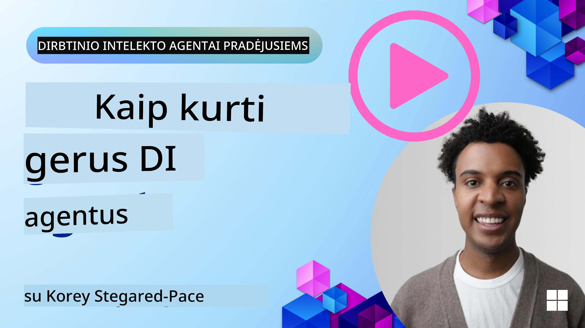
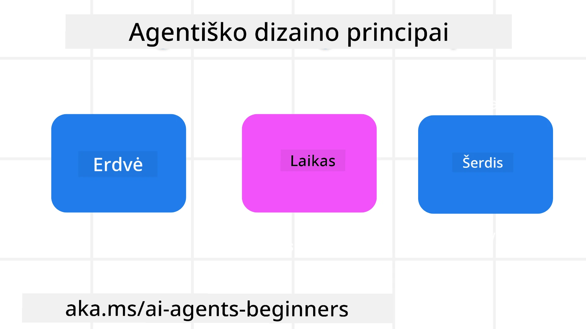

<!--
CO_OP_TRANSLATOR_METADATA:
{
  "original_hash": "d71524fe83a23829ae7a23b4031aaac8",
  "translation_date": "2025-11-13T14:47:31+00:00",
  "source_file": "03-agentic-design-patterns/README.md",
  "language_code": "lt"
}
-->

> _(Spustelėkite aukščiau esančią nuotrauką, kad peržiūrėtumėte šios pamokos vaizdo įrašą)_
# AI agentų dizaino principai

## Įvadas

Yra daug būdų, kaip galvoti apie AI agentų sistemų kūrimą. Kadangi neapibrėžtumas yra savybė, o ne trūkumas generatyvinio AI dizaino srityje, inžinieriams kartais sunku suprasti, nuo ko pradėti. Mes sukūrėme žmogui orientuotus UX dizaino principus, kurie padės kūrėjams kurti klientui orientuotas agentų sistemas, skirtas jų verslo poreikiams spręsti. Šie dizaino principai nėra griežta architektūra, o veikiau atspirties taškas komandoms, kurios apibrėžia ir kuria agentų patirtis.

Apskritai, agentai turėtų:

- Plėsti ir didinti žmogaus galimybes (idėjų generavimas, problemų sprendimas, automatizavimas ir kt.)
- Užpildyti žinių spragas (padėti greitai įsisavinti žinių sritis, vertimas ir kt.)
- Palengvinti ir palaikyti bendradarbiavimą taip, kaip mums, kaip individams, patinka dirbti su kitais
- Padėti mums tapti geresnėmis savo versijomis (pvz., gyvenimo treneris/užduočių vadovas, padedantis išmokti emocijų reguliavimo ir sąmoningumo įgūdžių, ugdyti atsparumą ir kt.)

## Šioje pamokoje aptarsime

- Kas yra agentų dizaino principai
- Kokias gaires reikėtų laikytis įgyvendinant šiuos dizaino principus
- Pavyzdžiai, kaip naudoti šiuos dizaino principus

## Mokymosi tikslai

Baigę šią pamoką, galėsite:

1. Paaiškinti, kas yra agentų dizaino principai
2. Paaiškinti gaires, kaip naudoti agentų dizaino principus
3. Suprasti, kaip sukurti agentą naudojant agentų dizaino principus

## Agentų dizaino principai

### Agentas (Erdvė)

Tai aplinka, kurioje veikia agentas. Šie principai padeda kurti agentus, kurie veikia fiziniame ir skaitmeniniame pasauliuose.

- **Jungti, o ne skaldyti** – padėti žmonėms susisiekti su kitais žmonėmis, įvykiais ir naudinga informacija, kad būtų skatinamas bendradarbiavimas ir ryšiai.
- Agentai padeda susieti įvykius, žinias ir žmones.
- Agentai suartina žmones. Jie nėra skirti pakeisti ar sumenkinti žmones.
- **Lengvai pasiekiami, bet kartais nematomi** – agentas daugiausia veikia fone ir tik tada įsikiša, kai tai yra aktualu ir tinkama.
  - Agentas lengvai randamas ir pasiekiamas įgaliotiems vartotojams bet kuriame įrenginyje ar platformoje.
  - Agentas palaiko įvairius įvesties ir išvesties būdus (garsas, balsas, tekstas ir kt.).
  - Agentas gali sklandžiai pereiti tarp pirmo plano ir fono; tarp proaktyvaus ir reaktyvaus veikimo, priklausomai nuo vartotojo poreikių.
  - Agentas gali veikti nematoma forma, tačiau jo fono procesai ir bendradarbiavimas su kitais agentais yra skaidrūs ir valdomi vartotojo.

### Agentas (Laikas)

Tai, kaip agentas veikia laikui bėgant. Šie principai padeda kurti agentus, kurie sąveikauja su praeitimi, dabartimi ir ateitimi.

- **Praeitis**: Atsižvelgimas į istoriją, apimančią tiek būseną, tiek kontekstą.
  - Agentas pateikia aktualesnius rezultatus, remdamasis turtingesniais istorinių duomenų analizės rezultatais, neapsiribodamas tik įvykiais, žmonėmis ar būsenomis.
  - Agentas kuria ryšius iš praeities įvykių ir aktyviai remiasi atmintimi, kad įsitrauktų į dabartines situacijas.
- **Dabar**: Skatinimas, o ne tik pranešimas.
  - Agentas įgyvendina visapusišką požiūrį į sąveiką su žmonėmis. Kai įvyksta įvykis, agentas eina toliau nei statinis pranešimas ar kita statinė formalumas. Agentas gali supaprastinti procesus arba dinamiškai generuoti užuominas, kad nukreiptų vartotojo dėmesį tinkamu momentu.
  - Agentas pateikia informaciją, atsižvelgdamas į kontekstinę aplinką, socialinius ir kultūrinius pokyčius bei pritaikydamas ją vartotojo ketinimams.
  - Agentų sąveika gali būti laipsniška, evoliucionuojanti/auganti sudėtingumu, kad ilgainiui įgalintų vartotojus.
- **Ateitis**: Prisitaikymas ir evoliucija.
  - Agentas prisitaiko prie įvairių įrenginių, platformų ir modalumų.
  - Agentas prisitaiko prie vartotojo elgesio, prieinamumo poreikių ir yra laisvai pritaikomas.
  - Agentas formuojamas ir evoliucionuoja per nuolatinę vartotojo sąveiką.

### Agentas (Branduolys)

Tai pagrindiniai elementai, esantys agento dizaino šerdyje.

- **Priimti neapibrėžtumą, bet užtikrinti pasitikėjimą**.
  - Tam tikras agento neapibrėžtumo lygis yra tikėtinas. Neapibrėžtumas yra pagrindinis agento dizaino elementas.
  - Pasitikėjimas ir skaidrumas yra pagrindiniai agento dizaino sluoksniai.
  - Žmonės kontroliuoja, kada agentas yra įjungtas/išjungtas, o agento būsena visada aiškiai matoma.

## Gairės, kaip įgyvendinti šiuos principus

Naudodamiesi ankstesniais dizaino principais, laikykitės šių gairių:

1. **Skaidrumas**: Informuokite vartotoją, kad naudojamas AI, kaip jis veikia (įskaitant ankstesnius veiksmus), kaip pateikti atsiliepimus ir modifikuoti sistemą.
2. **Kontrolė**: Leiskite vartotojui pritaikyti, nurodyti pageidavimus ir suasmeninti, taip pat kontroliuoti sistemą ir jos atributus (įskaitant galimybę pamiršti).
3. **Nuoseklumas**: Siekite nuoseklios, daugiarūšės patirties visuose įrenginiuose ir galiniuose taškuose. Naudokite pažįstamus UI/UX elementus, kur įmanoma (pvz., mikrofono piktogramą balso sąveikai), ir kiek įmanoma sumažinkite vartotojo kognityvinę apkrovą (pvz., siekite glaustų atsakymų, vizualinių pagalbų ir „Sužinokite daugiau“ turinio).

## Kaip sukurti kelionių agentą naudojant šiuos principus ir gaires

Įsivaizduokite, kad kuriate kelionių agentą, štai kaip galėtumėte naudoti dizaino principus ir gaires:

1. **Skaidrumas** – Informuokite vartotoją, kad kelionių agentas yra AI pagrįstas agentas. Pateikite pagrindines instrukcijas, kaip pradėti (pvz., „Sveiki“ žinutė, pavyzdiniai raginimai). Aiškiai tai dokumentuokite produkto puslapyje. Parodykite vartotojo anksčiau pateiktų raginimų sąrašą. Aiškiai nurodykite, kaip pateikti atsiliepimus (pvz., nykščio aukštyn ir žemyn mygtukai, mygtukas „Siųsti atsiliepimą“ ir kt.). Aiškiai išdėstykite, ar agentas turi naudojimo ar temų apribojimų.
2. **Kontrolė** – Užtikrinkite, kad vartotojui būtų aišku, kaip modifikuoti agentą po jo sukūrimo, pvz., naudojant sistemos raginimą. Leiskite vartotojui pasirinkti, kaip išsamiai agentas turėtų atsakyti, jo rašymo stilių ir bet kokius apribojimus, apie ką agentas neturėtų kalbėti. Leiskite vartotojui peržiūrėti ir ištrinti bet kokius susijusius failus ar duomenis, raginimus ir ankstesnius pokalbius.
3. **Nuoseklumas** – Užtikrinkite, kad piktogramos, skirtos dalintis raginimu, pridėti failą ar nuotrauką ir pažymėti ką nors, būtų standartinės ir atpažįstamos. Naudokite sąvaržėlės piktogramą, kad nurodytumėte failų įkėlimą/pasidalinimą su agentu, ir paveikslėlio piktogramą, kad nurodytumėte grafikos įkėlimą.

## Pavyzdiniai kodai

- Python: [Agentų karkasas](./code_samples/03-python-agent-framework.ipynb)
- .NET: [Agentų karkasas](./code_samples/03-dotnet-agent-framework.md)

## Turite daugiau klausimų apie AI agentų dizaino modelius?

Prisijunkite prie [Azure AI Foundry Discord](https://aka.ms/ai-agents/discord), kad susitiktumėte su kitais besimokančiaisiais, dalyvautumėte konsultacijų valandose ir gautumėte atsakymus į savo klausimus apie AI agentus.

## Papildomi ištekliai

- <a href="https://openai.com" target="_blank">Agentinių AI sistemų valdymo praktikos | OpenAI</a>
- <a href="https://microsoft.com" target="_blank">HAX įrankių rinkinys - Microsoft Research</a>
- <a href="https://responsibleaitoolbox.ai" target="_blank">Atsakingo AI įrankių rinkinys</a>

## Ankstesnė pamoka

[Tyrinėjant agentų karkasus](../02-explore-agentic-frameworks/README.md)

## Kita pamoka

[Įrankių naudojimo dizaino modelis](../04-tool-use/README.md)

---

<!-- CO-OP TRANSLATOR DISCLAIMER START -->
**Atsakomybės apribojimas**:  
Šis dokumentas buvo išverstas naudojant AI vertimo paslaugą [Co-op Translator](https://github.com/Azure/co-op-translator). Nors siekiame tikslumo, prašome atkreipti dėmesį, kad automatiniai vertimai gali turėti klaidų ar netikslumų. Originalus dokumentas jo gimtąja kalba turėtų būti laikomas autoritetingu šaltiniu. Kritinei informacijai rekomenduojama profesionali žmogaus vertimo paslauga. Mes neprisiimame atsakomybės už nesusipratimus ar neteisingus interpretavimus, atsiradusius naudojant šį vertimą.
<!-- CO-OP TRANSLATOR DISCLAIMER END -->