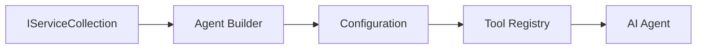

<!--
CO_OP_TRANSLATOR_METADATA:
{
  "original_hash": "bcc874e190347bd6a095aed56dc16de8",
  "translation_date": "2025-11-13T14:48:50+00:00",
  "source_file": "03-agentic-design-patterns/code_samples/03-dotnet-agent-framework.md",
  "language_code": "lt"
}
-->
# 🎨 Agentinio dizaino šablonai su GitHub modeliais (.NET)

## 📋 Mokymosi tikslai

Šis pavyzdys demonstruoja įmonės lygio dizaino šablonus, skirtus kurti intelektualius agentus naudojant Microsoft Agent Framework .NET aplinkoje su GitHub modelių integracija. Jūs išmoksite profesionalių šablonų ir architektūrinių metodų, kurie padaro agentus paruoštus gamybai, lengvai prižiūrimus ir plečiamus.

### Įmonės dizaino šablonai

- 🏭 **Gamyklos šablonas**: Standartizuotas agentų kūrimas su priklausomybių injekcija
- 🔧 **Kūrėjo šablonas**: Sklandus agentų konfigūravimas ir nustatymas
- 🧵 **Saugūs gijų šablonai**: Lygiagretus pokalbių valdymas
- 📋 **Saugyklos šablonas**: Tvarkingas įrankių ir galimybių valdymas

## 🎯 .NET specifiniai architektūriniai privalumai

### Įmonės funkcijos

- **Stiprus tipavimas**: Patikrinimas kompiliavimo metu ir IntelliSense palaikymas
- **Priklausomybių injekcija**: Integruotas DI konteineris
- **Konfigūracijos valdymas**: IConfiguration ir Options šablonai
- **Async/Await**: Pirmo lygio asinchroninio programavimo palaikymas

### Paruošti gamybai šablonai

- **Žurnalų integracija**: ILogger ir struktūrizuoto žurnalų palaikymas
- **Sveikatos patikrinimai**: Integruotas stebėjimas ir diagnostika
- **Konfigūracijos patikrinimas**: Stiprus tipavimas su duomenų anotacijomis
- **Klaidų valdymas**: Struktūrizuotas išimčių valdymas

## 🔧 Techninė architektūra

### Pagrindiniai .NET komponentai

- **Microsoft.Extensions.AI**: Vieningos AI paslaugų abstrakcijos
- **Microsoft.Agents.AI**: Įmonės agentų orkestravimo sistema
- **GitHub modelių integracija**: Aukštos kokybės API klientų šablonai
- **Konfigūracijos sistema**: appsettings.json ir aplinkos integracija

### Dizaino šablonų įgyvendinimas



## 🏗️ Demonstraciniai įmonės šablonai

### 1. **Kūrybiniai šablonai**

- **Agentų gamykla**: Centralizuotas agentų kūrimas su nuoseklia konfigūracija
- **Kūrėjo šablonas**: Sklandus API sudėtingų agentų konfigūravimui
- **Vienetinis šablonas**: Bendrų resursų ir konfigūracijos valdymas
- **Priklausomybių injekcija**: Laisvas susiejimas ir testavimo galimybės

### 2. **Elgesio šablonai**

- **Strategijos šablonas**: Keičiamos įrankių vykdymo strategijos
- **Komandos šablonas**: Inkapsuliuotos agentų operacijos su atšaukimo/atstatymo galimybėmis
- **Stebėtojo šablonas**: Įvykiais pagrįstas agentų gyvavimo ciklo valdymas
- **Šabloninio metodo šablonas**: Standartizuoti agentų vykdymo procesai

### 3. **Struktūriniai šablonai**

- **Adapterio šablonas**: GitHub modelių API integracijos sluoksnis
- **Dekoratoriaus šablonas**: Agentų galimybių plėtra
- **Fasado šablonas**: Supaprastintos agentų sąsajos
- **Proxy šablonas**: Lėtas įkrovimas ir talpyklos naudojimas našumui gerinti

## 📚 .NET dizaino principai

### SOLID principai

- **Vienos atsakomybės**: Kiekvienas komponentas turi aiškų tikslą
- **Atviras/Uždarytas**: Plečiamas be modifikacijų
- **Liskov substitucija**: Įrankių įgyvendinimas pagal sąsajas
- **Sąsajų segregacija**: Koncentruotos, darnios sąsajos
- **Priklausomybės inversija**: Priklausomybė nuo abstrakcijų, o ne nuo konkrečių įgyvendinimų

### Švari architektūra

- **Domeno sluoksnis**: Pagrindinės agentų ir įrankių abstrakcijos
- **Programų sluoksnis**: Agentų orkestravimas ir darbo eigos
- **Infrastruktūros sluoksnis**: GitHub modelių integracija ir išorinės paslaugos
- **Pateikimo sluoksnis**: Vartotojo sąveika ir atsakymų formatavimas

## 🔒 Įmonės svarstymai

### Saugumas

- **Kredencialų valdymas**: Saugus API raktų tvarkymas su IConfiguration
- **Įvesties patikrinimas**: Stiprus tipavimas ir duomenų anotacijų patikrinimas
- **Išvesties valymas**: Saugus atsakymų apdorojimas ir filtravimas
- **Audito žurnalai**: Išsamus operacijų sekimas

### Našumas

- **Asinchroniniai šablonai**: Neužblokuojančios I/O operacijos
- **Jungčių telkinys**: Efektyvus HTTP klientų valdymas
- **Talpyklos naudojimas**: Atsakymų talpyklos našumui gerinti
- **Resursų valdymas**: Tinkamas išteklių atlaisvinimas ir valymas

### Skalavimas

- **Gijų saugumas**: Lygiagretus agentų vykdymo palaikymas
- **Resursų telkinys**: Efektyvus išteklių naudojimas
- **Krovos valdymas**: Greičio ribojimas ir apkrovos valdymas
- **Stebėjimas**: Našumo metrikos ir sveikatos patikrinimai

## 🚀 Gamybinis diegimas

- **Konfigūracijos valdymas**: Aplinkai specifiniai nustatymai
- **Žurnalų strategija**: Struktūrizuoti žurnalai su koreliacijos ID
- **Klaidų valdymas**: Globalus išimčių valdymas su tinkamu atkūrimu
- **Stebėjimas**: Programų įžvalgos ir našumo skaitikliai
- **Testavimas**: Vienetų testai, integraciniai testai ir apkrovos testavimo šablonai

Pasiruošę kurti įmonės lygio intelektualius agentus su .NET? Sukurkime kažką tvirto! 🏢✨

## 🚀 Pradžia

### Reikalavimai

- [.NET 10 SDK](https://dotnet.microsoft.com/download/dotnet/10.0) arba naujesnė versija
- [GitHub Models API prieigos raktas](https://docs.github.com/github-models/github-models-at-scale/using-your-own-api-keys-in-github-models)

### Reikalingi aplinkos kintamieji

```bash
# zsh/bash
export GH_TOKEN=<your_github_token>
export GH_ENDPOINT=https://models.github.ai/inference
export GH_MODEL_ID=openai/gpt-5-mini
```

```powershell
# PowerShell
$env:GH_TOKEN = "<your_github_token>"
$env:GH_ENDPOINT = "https://models.github.ai/inference"
$env:GH_MODEL_ID = "openai/gpt-5-mini"
```

### Pavyzdinis kodas

Norėdami paleisti kodo pavyzdį,

```bash
# zsh/bash
chmod +x ./03-dotnet-agent-framework.cs
./03-dotnet-agent-framework.cs
```

Arba naudojant dotnet CLI:

```bash
dotnet run ./03-dotnet-agent-framework.cs
```

Žr. [`03-dotnet-agent-framework.cs`](../../../../03-agentic-design-patterns/code_samples/03-dotnet-agent-framework.cs) visam kodui.

```csharp
#!/usr/bin/dotnet run

#:package Microsoft.Extensions.AI@10.*
#:package Microsoft.Agents.AI.OpenAI@1.*-*

using System.ClientModel;
using System.ComponentModel;

using Microsoft.Agents.AI;
using Microsoft.Extensions.AI;

using OpenAI;

// Tool Function: Random Destination Generator
// This static method will be available to the agent as a callable tool
// The [Description] attribute helps the AI understand when to use this function
// This demonstrates how to create custom tools for AI agents
[Description("Provides a random vacation destination.")]
static string GetRandomDestination()
{
    // List of popular vacation destinations around the world
    // The agent will randomly select from these options
    var destinations = new List<string>
    {
        "Paris, France",
        "Tokyo, Japan",
        "New York City, USA",
        "Sydney, Australia",
        "Rome, Italy",
        "Barcelona, Spain",
        "Cape Town, South Africa",
        "Rio de Janeiro, Brazil",
        "Bangkok, Thailand",
        "Vancouver, Canada"
    };

    // Generate random index and return selected destination
    // Uses System.Random for simple random selection
    var random = new Random();
    int index = random.Next(destinations.Count);
    return destinations[index];
}

// Extract configuration from environment variables
// Retrieve the GitHub Models API endpoint, defaults to https://models.github.ai/inference if not specified
// Retrieve the model ID, defaults to openai/gpt-5-mini if not specified
// Retrieve the GitHub token for authentication, throws exception if not specified
var github_endpoint = Environment.GetEnvironmentVariable("GH_ENDPOINT") ?? "https://models.github.ai/inference";
var github_model_id = Environment.GetEnvironmentVariable("GH_MODEL_ID") ?? "openai/gpt-5-mini";
var github_token = Environment.GetEnvironmentVariable("GH_TOKEN") ?? throw new InvalidOperationException("GH_TOKEN is not set.");

// Configure OpenAI Client Options
// Create configuration options to point to GitHub Models endpoint
// This redirects OpenAI client calls to GitHub's model inference service
var openAIOptions = new OpenAIClientOptions()
{
    Endpoint = new Uri(github_endpoint)
};

// Initialize OpenAI Client with GitHub Models Configuration
// Create OpenAI client using GitHub token for authentication
// Configure it to use GitHub Models endpoint instead of OpenAI directly
var openAIClient = new OpenAIClient(new ApiKeyCredential(github_token), openAIOptions);

// Define Agent Identity and Comprehensive Instructions
// Agent name for identification and logging purposes
var AGENT_NAME = "TravelAgent";

// Detailed instructions that define the agent's personality, capabilities, and behavior
// This system prompt shapes how the agent responds and interacts with users
var AGENT_INSTRUCTIONS = """
You are a helpful AI Agent that can help plan vacations for customers.

Important: When users specify a destination, always plan for that location. Only suggest random destinations when the user hasn't specified a preference.

When the conversation begins, introduce yourself with this message:
"Hello! I'm your TravelAgent assistant. I can help plan vacations and suggest interesting destinations for you. Here are some things you can ask me:
1. Plan a day trip to a specific location
2. Suggest a random vacation destination
3. Find destinations with specific features (beaches, mountains, historical sites, etc.)
4. Plan an alternative trip if you don't like my first suggestion

What kind of trip would you like me to help you plan today?"

Always prioritize user preferences. If they mention a specific destination like "Bali" or "Paris," focus your planning on that location rather than suggesting alternatives.
""";

// Create AI Agent with Advanced Travel Planning Capabilities
// Initialize complete agent pipeline: OpenAI client → Chat client → AI agent
// Configure agent with name, detailed instructions, and available tools
// This demonstrates the .NET agent creation pattern with full configuration
AIAgent agent = openAIClient
    .GetChatClient(github_model_id)
    .CreateAIAgent(
        name: AGENT_NAME,
        instructions: AGENT_INSTRUCTIONS,
        tools: [AIFunctionFactory.Create(GetRandomDestination)]
    );

// Create New Conversation Thread for Context Management
// Initialize a new conversation thread to maintain context across multiple interactions
// Threads enable the agent to remember previous exchanges and maintain conversational state
// This is essential for multi-turn conversations and contextual understanding
AgentThread thread = agent.GetNewThread();

// Execute Agent: First Travel Planning Request
// Run the agent with an initial request that will likely trigger the random destination tool
// The agent will analyze the request, use the GetRandomDestination tool, and create an itinerary
// Using the thread parameter maintains conversation context for subsequent interactions
await foreach (var update in agent.RunStreamingAsync("Plan me a day trip", thread))
{
    await Task.Delay(10);
    Console.Write(update);
}

Console.WriteLine();

// Execute Agent: Follow-up Request with Context Awareness
// Demonstrate contextual conversation by referencing the previous response
// The agent remembers the previous destination suggestion and will provide an alternative
// This showcases the power of conversation threads and contextual understanding in .NET agents
await foreach (var update in agent.RunStreamingAsync("I don't like that destination. Plan me another vacation.", thread))
{
    await Task.Delay(10);
    Console.Write(update);
}
```

---

<!-- CO-OP TRANSLATOR DISCLAIMER START -->
**Atsakomybės apribojimas**:  
Šis dokumentas buvo išverstas naudojant AI vertimo paslaugą [Co-op Translator](https://github.com/Azure/co-op-translator). Nors siekiame tikslumo, prašome atkreipti dėmesį, kad automatiniai vertimai gali turėti klaidų ar netikslumų. Originalus dokumentas jo gimtąja kalba turėtų būti laikomas autoritetingu šaltiniu. Kritinei informacijai rekomenduojama profesionali žmogaus vertimo paslauga. Mes neprisiimame atsakomybės už nesusipratimus ar neteisingus interpretavimus, atsiradusius dėl šio vertimo naudojimo.
<!-- CO-OP TRANSLATOR DISCLAIMER END -->