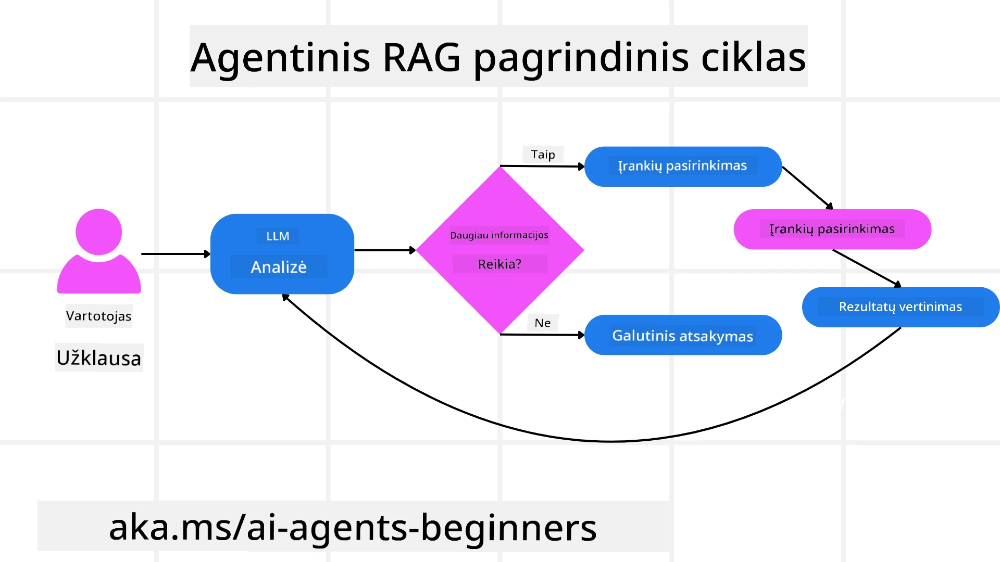
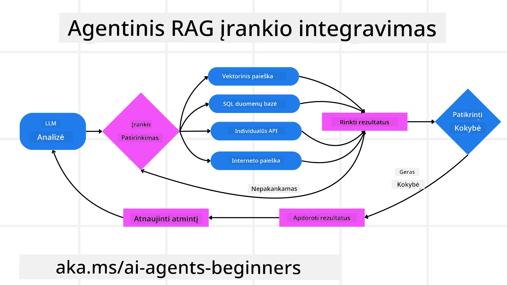
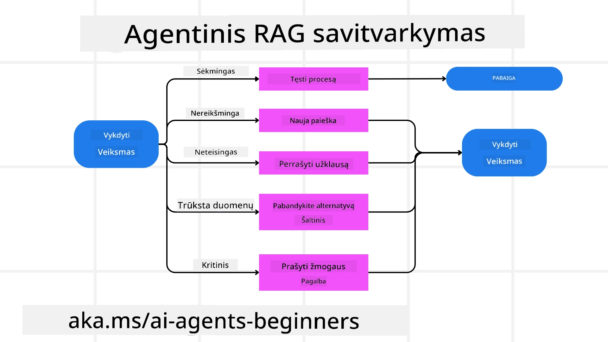

<!--
CO_OP_TRANSLATOR_METADATA:
{
  "original_hash": "0ebf6b2290db55dbf2d10cc49655523b",
  "translation_date": "2025-09-30T08:01:08+00:00",
  "source_file": "05-agentic-rag/README.md",
  "language_code": "lt"
}
-->

> _(Spustelėkite paveikslėlį aukščiau, kad peržiūrėtumėte šios pamokos vaizdo įrašą)_

# Agentic RAG

Ši pamoka pateikia išsamų Agentic Retrieval-Augmented Generation (Agentic RAG) apžvalgą – naują AI paradigmą, kurioje dideli kalbos modeliai (LLMs) savarankiškai planuoja savo veiksmus, tuo pačiu rinkdami informaciją iš išorinių šaltinių. Skirtingai nuo statinių informacijos paieškos ir skaitymo modelių, Agentic RAG apima iteracinius LLM kvietimus, pertraukiamus įrankių ar funkcijų naudojimu ir struktūrizuotais rezultatais. Sistema vertina rezultatus, tobulina užklausas, prireikus naudoja papildomus įrankius ir tęsia šį ciklą, kol pasiekiamas patenkinamas sprendimas.

## Įvadas

Šioje pamokoje aptarsime:

- **Suprasti Agentic RAG:** Susipažinkite su nauja AI paradigma, kurioje dideli kalbos modeliai (LLMs) savarankiškai planuoja savo veiksmus, tuo pačiu rinkdami informaciją iš išorinių duomenų šaltinių.
- **Įsisavinti iteracinį Maker-Checker stilių:** Supraskite iteracinių LLM kvietimų ciklą, pertraukiamą įrankių ar funkcijų naudojimu ir struktūrizuotais rezultatais, skirtą tikslumui gerinti ir netinkamoms užklausoms tvarkyti.
- **Praktinės taikymo sritys:** Nustatykite scenarijus, kuriuose Agentic RAG yra ypač naudingas, pvz., tikslumo reikalaujančiose aplinkose, sudėtingose duomenų bazėse ir ilgalaikiuose darbo procesuose.

## Mokymosi tikslai

Baigę šią pamoką, jūs sužinosite, kaip:

- **Suprasti Agentic RAG:** Susipažinkite su nauja AI paradigma, kurioje dideli kalbos modeliai (LLMs) savarankiškai planuoja savo veiksmus, tuo pačiu rinkdami informaciją iš išorinių duomenų šaltinių.
- **Iteracinis Maker-Checker stilius:** Supraskite iteracinių LLM kvietimų ciklą, pertraukiamą įrankių ar funkcijų naudojimu ir struktūrizuotais rezultatais, skirtą tikslumui gerinti ir netinkamoms užklausoms tvarkyti.
- **Valdyti sprendimų priėmimo procesą:** Supraskite sistemos gebėjimą savarankiškai priimti sprendimus, kaip spręsti problemas, nesiremiant iš anksto nustatytais keliais.
- **Darbo procesas:** Supraskite, kaip agentinis modelis savarankiškai nusprendžia rinkti rinkos tendencijų ataskaitas, identifikuoti konkurentų duomenis, koreliuoti vidinius pardavimų rodiklius, sintetinti išvadas ir įvertinti strategiją.
- **Iteraciniai ciklai, įrankių integracija ir atmintis:** Sužinokite apie sistemos priklausomybę nuo ciklinės sąveikos, išlaikant būseną ir atmintį per žingsnius, kad būtų išvengta pasikartojančių ciklų ir priimami pagrįsti sprendimai.
- **Gedimų valdymas ir savikorekcija:** Ištyrinėkite sistemos tvirtus savikorekcijos mechanizmus, įskaitant iteraciją ir pakartotinį užklausimą, diagnostinių įrankių naudojimą ir žmogaus priežiūros įtraukimą.
- **Agentūros ribos:** Supraskite Agentic RAG apribojimus, susijusius su specifine sritimi, infrastruktūros priklausomybe ir saugumo priemonėmis.
- **Praktinės taikymo sritys ir vertė:** Nustatykite scenarijus, kuriuose Agentic RAG yra ypač naudingas, pvz., tikslumo reikalaujančiose aplinkose, sudėtingose duomenų bazėse ir ilgalaikiuose darbo procesuose.
- **Valdymas, skaidrumas ir pasitikėjimas:** Sužinokite apie valdymo ir skaidrumo svarbą, įskaitant paaiškinamą sprendimų priėmimą, šališkumo kontrolę ir žmogaus priežiūrą.

## Kas yra Agentic RAG?

Agentic Retrieval-Augmented Generation (Agentic RAG) yra nauja AI paradigma, kurioje dideli kalbos modeliai (LLMs) savarankiškai planuoja savo veiksmus, tuo pačiu rinkdami informaciją iš išorinių šaltinių. Skirtingai nuo statinių informacijos paieškos ir skaitymo modelių, Agentic RAG apima iteracinius LLM kvietimus, pertraukiamus įrankių ar funkcijų naudojimu ir struktūrizuotais rezultatais. Sistema vertina rezultatus, tobulina užklausas, prireikus naudoja papildomus įrankius ir tęsia šį ciklą, kol pasiekiamas patenkinamas sprendimas. Šis iteracinis „maker-checker“ stilius gerina tikslumą, tvarko netinkamas užklausas ir užtikrina aukštos kokybės rezultatus.

Sistema aktyviai valdo savo sprendimų priėmimo procesą, perrašydama nepavykusias užklausas, pasirinkdama skirtingus paieškos metodus ir integruodama kelis įrankius – tokius kaip vektorinė paieška Azure AI Search, SQL duomenų bazės ar pritaikytos API – prieš pateikdama galutinį atsakymą. Agentinės sistemos išskirtinė savybė yra gebėjimas savarankiškai valdyti sprendimų priėmimo procesą. Tradicinės RAG implementacijos remiasi iš anksto nustatytais keliais, tačiau agentinė sistema savarankiškai nustato veiksmų seką, remdamasi surinktos informacijos kokybe.

## Agentic Retrieval-Augmented Generation (Agentic RAG) apibrėžimas

Agentic Retrieval-Augmented Generation (Agentic RAG) yra nauja AI vystymo paradigma, kurioje LLM ne tik renka informaciją iš išorinių duomenų šaltinių, bet ir savarankiškai planuoja savo veiksmus. Skirtingai nuo statinių informacijos paieškos ir skaitymo modelių ar kruopščiai sukonstruotų užklausų sekų, Agentic RAG apima iteracinių LLM kvietimų ciklą, pertraukiamą įrankių ar funkcijų naudojimu ir struktūrizuotais rezultatais. Kiekviename žingsnyje sistema vertina gautus rezultatus, nusprendžia, ar reikia tobulinti užklausas, prireikus naudoja papildomus įrankius ir tęsia šį ciklą, kol pasiekiamas patenkinamas sprendimas.

Šis iteracinis „maker-checker“ veikimo stilius skirtas gerinti tikslumą, tvarkyti netinkamas užklausas struktūrizuotose duomenų bazėse (pvz., NL2SQL) ir užtikrinti subalansuotus, aukštos kokybės rezultatus. Vietoj to, kad remtųsi kruopščiai sukonstruotomis užklausų grandinėmis, sistema aktyviai valdo savo sprendimų priėmimo procesą. Ji gali perrašyti nepavykusias užklausas, pasirinkti skirtingus paieškos metodus ir integruoti kelis įrankius – tokius kaip vektorinė paieška Azure AI Search, SQL duomenų bazės ar pritaikytos API – prieš pateikdama galutinį atsakymą. Tai pašalina poreikį sudėtingoms orkestravimo sistemoms. Vietoj to, santykinai paprastas ciklas „LLM kvietimas → įrankio naudojimas → LLM kvietimas → …“ gali duoti sudėtingus ir gerai pagrįstus rezultatus.

## Valdyti sprendimų priėmimo procesą

Agentinės sistemos išskirtinė savybė yra gebėjimas savarankiškai valdyti sprendimų priėmimo procesą. Tradicinės RAG implementacijos dažnai priklauso nuo žmonių, kurie iš anksto nustato modelio kelią: minčių grandinę, nurodančią, ką ir kada rinkti.
Tačiau tikrai agentinė sistema pati nusprendžia, kaip spręsti problemą. Ji ne tik vykdo scenarijų; ji savarankiškai nustato veiksmų seką, remdamasi surinktos informacijos kokybe.
Pavyzdžiui, jei jai pavesta sukurti produkto pristatymo strategiją, ji nesiremia vien užklausa, kuri išdėsto visą tyrimo ir sprendimų priėmimo procesą. Vietoj to, agentinis modelis savarankiškai nusprendžia:

1. Rinkti dabartinių rinkos tendencijų ataskaitas naudojant Bing Web Grounding.
2. Identifikuoti svarbius konkurentų duomenis naudojant Azure AI Search.
3. Koreliuoti istorinius vidinius pardavimų rodiklius naudojant Azure SQL Database.
4. Sintetinti išvadas į nuoseklią strategiją, koordinuojamą per Azure OpenAI Service.
5. Įvertinti strategiją dėl spragų ar nenuoseklumų, prireikus inicijuojant dar vieną informacijos rinkimo etapą.
Visi šie žingsniai – užklausų tobulinimas, šaltinių pasirinkimas, iteracija, kol pasiekiamas „patenkinamas“ atsakymas – yra modelio sprendimai, o ne iš anksto nustatyti žmogaus.

## Iteraciniai ciklai, įrankių integracija ir atmintis

Agentinė sistema remiasi cikline sąveikos struktūra:

- **Pradinis kvietimas:** Vartotojo tikslas (t. y. vartotojo užklausa) pateikiamas LLM.
- **Įrankio naudojimas:** Jei modelis nustato trūkstamą informaciją ar neaiškius nurodymus, jis pasirenka įrankį ar paieškos metodą – pvz., vektorinės duomenų bazės užklausą (pvz., Azure AI Search Hybrid paieška privačiuose duomenyse) arba struktūrizuotą SQL užklausą – kad surinktų daugiau konteksto.
- **Vertinimas ir tobulinimas:** Peržiūrėjęs gautus duomenis, modelis nusprendžia, ar informacija yra pakankama. Jei ne, jis tobulina užklausą, bando kitą įrankį arba koreguoja savo požiūrį.
- **Kartojimas, kol patenkintas:** Šis ciklas tęsiasi, kol modelis nusprendžia, kad turi pakankamai aiškumo ir įrodymų, kad pateiktų galutinį, gerai pagrįstą atsakymą.
- **Atmintis ir būsena:** Kadangi sistema išlaiko būseną ir atmintį per žingsnius, ji gali prisiminti ankstesnius bandymus ir jų rezultatus, išvengti pasikartojančių ciklų ir priimti labiau pagrįstus sprendimus, kai progresuoja.

Laikui bėgant tai sukuria evoliucinio supratimo jausmą, leidžiantį modeliui atlikti sudėtingas, daugiapakopes užduotis, nereikalaujant nuolatinės žmogaus intervencijos ar užklausos formavimo.

## Gedimų valdymas ir savikorekcija

Agentic RAG autonomija taip pat apima tvirtus savikorekcijos mechanizmus. Kai sistema susiduria su kliūtimis – pvz., surenka nereikšmingus dokumentus ar susiduria su netinkamomis užklausomis – ji gali:

- **Iteruoti ir pakartotinai užklausti:** Vietoj to, kad pateiktų mažos vertės atsakymus, modelis bando naujas paieškos strategijas, perrašo duomenų bazės užklausas arba ieško alternatyvių duomenų rinkinių.
- **Naudoti diagnostinius įrankius:** Sistema gali naudoti papildomas funkcijas, skirtas padėti jai ištaisyti sprendimų priėmimo žingsnius arba patvirtinti gautų duomenų teisingumą. Tokie įrankiai kaip Azure AI Tracing bus svarbūs, kad būtų užtikrintas tvirtas stebėjimas ir stebėsena.
- **Pasikliauti žmogaus priežiūra:** Aukštos rizikos ar nuolat nesėkmingais scenarijais modelis gali pažymėti neaiškumą ir prašyti žmogaus pagalbos. Kai žmogus pateikia korekcinį grįžtamąjį ryšį, modelis gali įtraukti tą pamoką ateityje.

Šis iteracinis ir dinamiškas požiūris leidžia modeliui nuolat tobulėti, užtikrinant, kad jis nėra vienkartinė sistema, o tokia, kuri mokosi iš savo klaidų per tam tikrą sesiją.

## Agentūros ribos

Nepaisant autonomijos užduotyje, Agentic RAG nėra analogiškas dirbtiniam bendram intelektui. Jo „agentinės“ galimybės yra apribotos įrankiais, duomenų šaltiniais ir politikomis, kurias pateikia žmogaus kūrėjai. Jis negali sukurti savo įrankių ar peržengti nustatytų srities ribų. Vietoj to, jis puikiai tinka dinamiškai koordinuoti turimus išteklius.
Pagrindiniai skirtumai nuo pažangesnių AI formų apima:

1. **Specifinė srities autonomija:** Agentic RAG sistemos yra orientuotos į vartotojo apibrėžtų tikslų pasiekimą žinomoje srityje, naudojant strategijas, tokias kaip užklausų perrašymas ar įrankių pasirinkimas, siekiant geresnių rezultatų.
2. **Infrastruktūros priklausomybė:** Sistemos galimybės priklauso nuo kūrėjų integruotų įrankių ir duomenų. Ji negali peržengti šių ribų be žmogaus intervencijos.
3. **Saugumo priemonių laikymasis:** Etikos gairės, atitikties taisyklės ir verslo politikos išlieka labai svarbios. Agento laisvė visada yra apribota saugumo priemonėmis ir priežiūros mechanizmais (tikėkimės?).

## Praktinės taikymo sritys ir vertė

Agentic RAG ypač naudingas scenarijuose, kuriems reikia iteracinio tobulinimo ir tikslumo:

1. **Tikslumo reikalaujančios aplinkos:** Atitikties patikrinimuose, reguliavimo analizėje ar teisinių tyrimų srityje agentinis modelis gali pakartotinai tikrinti faktus, konsultuotis su keliais šaltiniais ir perrašyti užklausas, kol pateikia kruopščiai patikrintą atsakymą.
2. **Sudėtingos duomenų bazės sąveikos:** Dirbant su struktūrizuotais duomenimis, kur užklausos dažnai gali nepavykti arba reikalauti korekcijos, sistema gali savarankiškai tobulinti užklausas, naudodama Azure SQL arba Microsoft Fabric OneLake, užtikrindama, kad galutinis rezultatas atitiktų vartotojo ketinimus.
3. **Ilgalaikiai darbo procesai:** Ilgesnės sesijos gali evoliucionuoti, kai atsiranda nauja informacija. Agentic RAG gali nuolat įtraukti naujus duomenis, keisti strategijas, kai sužino daugiau apie problemos sritį.

## Valdymas, skaidrumas ir pasitikėjimas

Kadangi šios sistemos tampa labiau autonomiškos savo sprendimų priėmimo procese, valdymas ir skaidrumas yra labai svarbūs:

- **Paaiškinamas sprendimų priėmimas:** Modelis gali pateikti veiksmų, kuriuos atliko, užklausų, kurias pateikė, šaltinių, kuriuos konsultavo, ir sprendimų priėmimo žingsnių, kuriuos atliko, auditą. Tokie įrankiai kaip Azure AI Content Safety ir Azure AI Tracing / GenAIOps gali padėti išlaikyti skaidrumą ir sumažinti riziką.
- **Šališkumo kontrolė ir subalansuota paieška:** Kūrėjai gali reguliuoti paieškos strategijas, kad būtų užtikrinta subalansuota, reprezentatyvi duomenų šaltinių atranka, ir reguliariai tikrinti rezultatus, kad aptiktų šališkumą ar iškreiptus modelius,
- <a href="https://ragaboutit.com/agentic-rag-a-complete-guide-to-agent-based-retrieval-augmented-generation/" target="_blank">Agentinis RAG: Išsamus vadovas apie agentų pagrindu veikiančią paieškos sustiprintą generaciją – Naujienos iš generacijos RAG</a>
- <a href="https://huggingface.co/learn/cookbook/agent_rag" target="_blank">Agentinis RAG: paspartinkite savo RAG su užklausų reformulavimu ir savarankiška užklausa! Hugging Face atvirojo kodo AI receptų knyga</a>
- <a href="https://youtu.be/aQ4yQXeB1Ss?si=2HUqBzHoeB5tR04U" target="_blank">Agentinių sluoksnių pridėjimas prie RAG</a>
- <a href="https://www.youtube.com/watch?v=zeAyuLc_f3Q&t=244s" target="_blank">Žinių asistentų ateitis: Jerry Liu</a>
- <a href="https://www.youtube.com/watch?v=AOSjiXP1jmQ" target="_blank">Kaip sukurti agentinius RAG sistemas</a>
- <a href="https://ignite.microsoft.com/sessions/BRK102?source=sessions" target="_blank">Azure AI Foundry Agent Service naudojimas AI agentų mastelio didinimui</a>

### Akademiniai straipsniai

- <a href="https://arxiv.org/abs/2303.17651" target="_blank">2303.17651 Self-Refine: Iteratyvus tobulinimas su savarankišku grįžtamuoju ryšiu</a>
- <a href="https://arxiv.org/abs/2303.11366" target="_blank">2303.11366 Reflexion: Kalbos agentai su žodiniu stiprinamuoju mokymusi</a>
- <a href="https://arxiv.org/abs/2305.11738" target="_blank">2305.11738 CRITIC: Dideli kalbos modeliai gali patys taisyti klaidas naudodami įrankių interaktyvų kritikavimą</a>
- <a href="https://arxiv.org/abs/2501.09136" target="_blank">2501.09136 Agentinė paieškos sustiprinta generacija: Agentinio RAG apžvalga</a>

## Ankstesnė pamoka

[Įrankių naudojimo dizaino šablonas](../04-tool-use/README.md)

## Kita pamoka

[Patikimų AI agentų kūrimas](../06-building-trustworthy-agents/README.md)

---

**Atsakomybės apribojimas**:  
Šis dokumentas buvo išverstas naudojant dirbtinio intelekto vertimo paslaugą [Co-op Translator](https://github.com/Azure/co-op-translator). Nors siekiame tikslumo, atkreipiame dėmesį, kad automatiniai vertimai gali turėti klaidų ar netikslumų. Originalus dokumentas jo gimtąja kalba turėtų būti laikomas autoritetingu šaltiniu. Kritinei informacijai rekomenduojama naudotis profesionalių vertėjų paslaugomis. Mes neprisiimame atsakomybės už nesusipratimus ar klaidingus aiškinimus, kylančius dėl šio vertimo naudojimo.