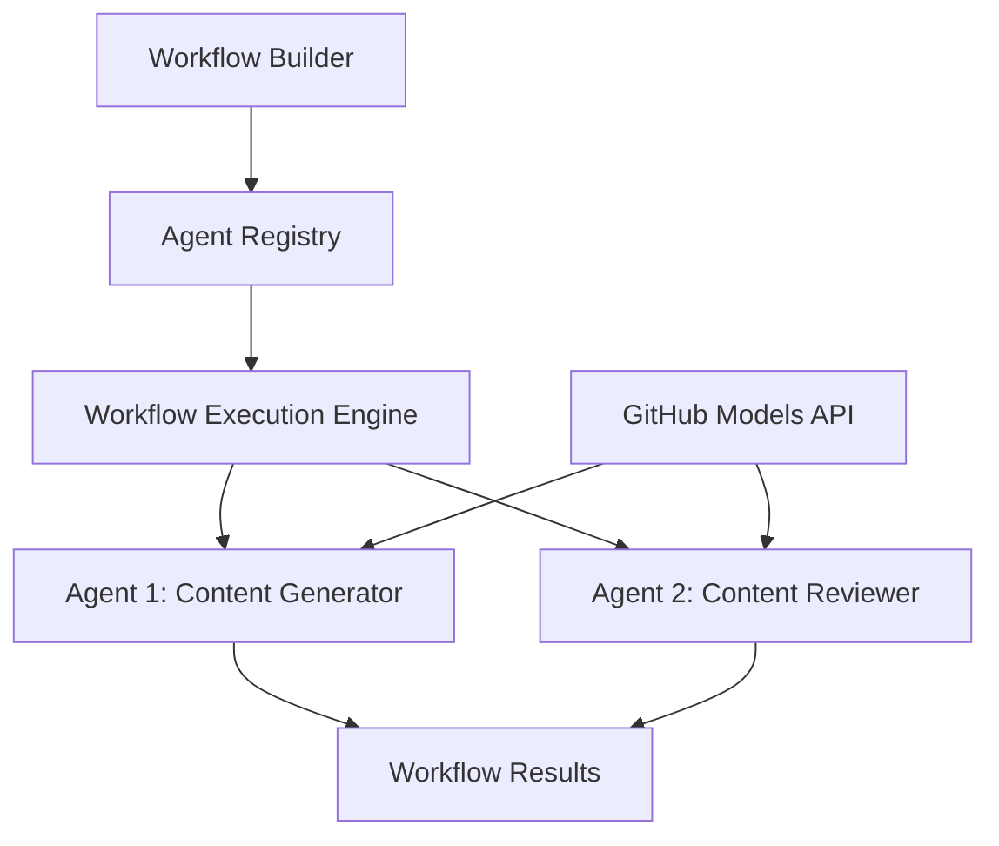

<!--
CO_OP_TRANSLATOR_METADATA:
{
  "original_hash": "034158688d0a45aae06dcbb21b0da5ae",
  "translation_date": "2025-11-11T13:02:06+00:00",
  "source_file": "08-multi-agent/code_samples/workflows-agent-framework/dotNET/01.dotnet-agent-framework-workflow-ghmodel-basic.md",
  "language_code": "lt"
}
-->
# 🔄 Pagrindiniai agentų darbo procesai su GitHub modeliais (.NET)

## 📋 Pamoka apie darbo procesų organizavimą

Šiame užrašų knygelėje parodoma, kaip sukurti sudėtingus **agentų darbo procesus** naudojant Microsoft Agent Framework for .NET ir GitHub modelius. Išmoksite kurti daugiapakopius verslo procesus, kuriuose AI agentai bendradarbiauja, kad atliktų sudėtingas užduotis per struktūrizuotus organizavimo modelius.

## 🎯 Mokymosi tikslai

### 🏗️ **Darbo procesų architektūros pagrindai**
- **Darbo procesų kūrėjas**: Kurkite ir organizuokite sudėtingus daugiapakopius AI procesus
- **Agentų koordinavimas**: Koordinuokite kelis specializuotus agentus darbo procesuose
- **GitHub modelių integracija**: Naudokite GitHub AI modelių paslaugą darbo procesuose
- **Vizualus darbo procesų dizainas**: Kurkite ir vizualizuokite darbo procesų struktūras geresniam supratimui

### 🔄 **Procesų organizavimo modeliai**
- **Sekvencinis apdorojimas**: Susiekite kelias agentų užduotis logine tvarka
- **Būsenos valdymas**: Išlaikykite kontekstą ir duomenų srautą per darbo procesų etapus
- **Klaidų tvarkymas**: Įgyvendinkite patikimą klaidų atkūrimą ir darbo procesų atsparumą
- **Veikimo optimizavimas**: Kurkite efektyvius darbo procesus įmonės masto operacijoms

### 🏢 **Darbo procesų pritaikymas įmonėse**
- **Verslo procesų automatizavimas**: Automatizuokite sudėtingus organizacinius darbo procesus
- **Turinio gamybos procesas**: Redakcijos darbo procesai su peržiūros ir patvirtinimo etapais
- **Klientų aptarnavimo automatizavimas**: Daugiapakopis klientų užklausų sprendimas
- **Duomenų apdorojimo darbo procesai**: ETL procesai su AI pagrįsta transformacija

## ⚙️ Reikalavimai ir nustatymai

### 📦 **Reikalingi NuGet paketai**

Šiame darbo procesų demonstravime naudojami keli pagrindiniai .NET paketai:

```xml
<!-- Core AI Framework -->
<PackageReference Include="Microsoft.Extensions.AI" Version="9.9.0" />

<!-- Agent Framework (Local Development) -->
<!-- Microsoft.Agents.AI.dll - Core agent abstractions -->
<!-- Microsoft.Agents.AI.OpenAI.dll - OpenAI/GitHub Models integration -->

<!-- Configuration and Environment -->
<PackageReference Include="DotNetEnv" Version="3.1.1" />
```

### 🔑 **GitHub modelių konfigūracija**

**Aplinkos nustatymas (.env failas):**
```env
GITHUB_TOKEN=your_github_personal_access_token
GITHUB_ENDPOINT=https://models.inference.ai.azure.com
GITHUB_MODEL_ID=gpt-4o-mini
```

**GitHub modelių prieiga:**
1. Užsiregistruokite GitHub modeliams (šiuo metu peržiūros režime)
2. Sukurkite asmeninį prieigos raktą su modelių prieigos leidimais
3. Konfigūruokite aplinkos kintamuosius, kaip parodyta aukščiau

### 🏗️ **Darbo procesų architektūros apžvalga**



**Pagrindiniai komponentai:**
- **WorkflowBuilder**: Pagrindinis darbo procesų organizavimo variklis
- **AIAgent**: Individualūs specializuoti agentai su specifiniais gebėjimais
- **GitHub Models Client**: AI modelių paslaugos integracija
- **Execution Context**: Valdo būseną ir duomenų srautą tarp darbo procesų etapų

## 🎨 **Įmonių darbo procesų dizaino modeliai**

### 📝 **Turinio gamybos darbo procesas**
```
User Request → Content Generation → Quality Review → Final Output
```

### 🔍 **Dokumentų apdorojimo procesas**
```
Document Input → Analysis → Extraction → Validation → Structured Output
```

### 💼 **Verslo intelekto darbo procesas**
```
Data Collection → Processing → Analysis → Report Generation → Distribution
```

### 🤝 **Klientų aptarnavimo automatizavimas**
```
Customer Inquiry → Classification → Processing → Response Generation → Follow-up
```

## 🏢 **Privalumai įmonėms**

### 🎯 **Patikimumas ir mastelio keitimas**
- **Deterministinis vykdymas**: Nuoseklūs, pakartojami darbo procesų rezultatai
- **Klaidų atkūrimas**: Sklandus klaidų tvarkymas bet kuriame darbo proceso etape
- **Veikimo stebėjimas**: Vykdymo metrikų sekimas ir optimizavimo galimybės
- **Išteklių valdymas**: Efektyvus AI modelių išteklių paskirstymas ir naudojimas

### 🔒 **Saugumas ir atitiktis**
- **Saugus autentifikavimas**: GitHub raktų pagrindu autentifikavimas API prieigai
- **Audito pėdsakai**: Pilnas darbo procesų vykdymo ir sprendimų taškų registravimas
- **Prieigos kontrolė**: Detalūs leidimai darbo procesų vykdymui ir stebėjimui
- **Duomenų privatumas**: Saugus jautrios informacijos tvarkymas darbo procesuose

### 📊 **Stebėjimas ir valdymas**
- **Vizualus darbo procesų dizainas**: Aiškus procesų srautų ir priklausomybių vaizdavimas
- **Vykdymo stebėjimas**: Realaus laiko darbo procesų pažangos ir veikimo stebėjimas
- **Klaidų ataskaitos**: Išsami klaidų analizė ir derinimo galimybės
- **Veikimo analizė**: Metrikos optimizavimui ir pajėgumų planavimui

Sukurkime jūsų pirmąjį įmonės lygio AI darbo procesą! 🚀

## 💻 Kodo vykdymas

Pilna įgyvendinimo versija pateikta `01.dotnet-agent-framework-workflow-ghmodel-basic.cs`. Šiame faile demonstruojama:

1. **Aplinkos konfigūracija** - GitHub modelių kredencialų įkėlimas iš `.env` failo
2. **OpenAI kliento nustatymas** - Kliento konfigūravimas GitHub modelių galiniam taškui
3. **Agentų kūrimas** - Specializuotų agentų (Front Desk ir Concierge) apibrėžimas
4. **Darbo procesų kūrėjas** - Daugiapakopio agentų darbo proceso kūrimas su sekvenciniu apdorojimu
5. **Darbo procesų vykdymas** - Darbo proceso vykdymas su rezultatų srautu

### 🚀 Pavyzdžio vykdymas

```bash
# Make the script executable (Unix/Linux/macOS)
chmod +x 01.dotnet-agent-framework-workflow-ghmodel-basic.cs

# Run the workflow
./01.dotnet-agent-framework-workflow-ghmodel-basic.cs
```

Arba Windows sistemoje:
```powershell
dotnet run 01.dotnet-agent-framework-workflow-ghmodel-basic.cs
```

### 📝 Tikėtinas rezultatas

Darbo procesas:
1. Priims jūsų kelionės tikslo užklausą („Norėčiau vykti į Paryžių“)
2. Front Desk agentas pateiks pradinę rekomendaciją
3. Concierge agentas peržiūrės ir patobulins rekomendaciją
4. Galutinis rezultatas parodys visą pokalbio srautą

### 🔧 Pritaikymas

Galite pritaikyti darbo procesą:
- Keisdami agentų instrukcijas, kad pakeistumėte jų elgesį
- Pridėdami daugiau agentų, kad sukurtumėte sudėtingus daugiapakopius darbo procesus
- Keisdami vartotojo pranešimą, kad išbandytumėte skirtingus scenarijus
- Koreguodami darbo proceso kraštus, kad sukurtumėte skirtingus vykdymo modelius

---

<!-- CO-OP TRANSLATOR DISCLAIMER START -->
**Atsakomybės apribojimas**:  
Šis dokumentas buvo išverstas naudojant AI vertimo paslaugą [Co-op Translator](https://github.com/Azure/co-op-translator). Nors siekiame tikslumo, prašome atkreipti dėmesį, kad automatiniai vertimai gali turėti klaidų ar netikslumų. Originalus dokumentas jo gimtąja kalba turėtų būti laikomas autoritetingu šaltiniu. Kritinei informacijai rekomenduojama profesionali žmogaus vertimo paslauga. Mes neprisiimame atsakomybės už nesusipratimus ar neteisingus aiškinimus, kylančius dėl šio vertimo naudojimo.
<!-- CO-OP TRANSLATOR DISCLAIMER END -->