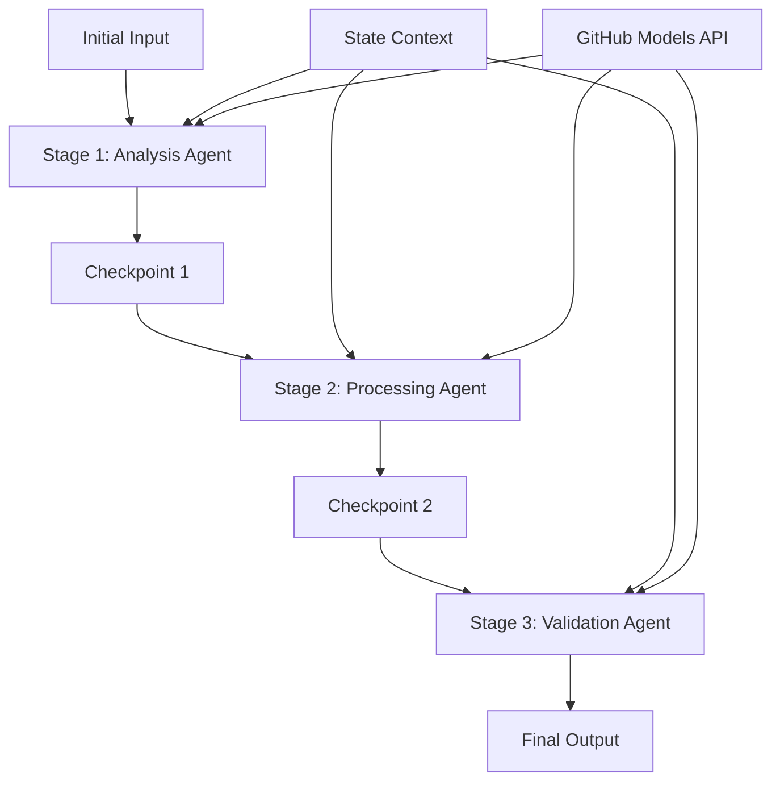

<!--
CO_OP_TRANSLATOR_METADATA:
{
  "original_hash": "1be9c8dcbd79a02d33d2c138684c1394",
  "translation_date": "2025-11-11T14:08:16+00:00",
  "source_file": "08-multi-agent/code_samples/workflows-agent-framework/dotNET/02.dotnet-agent-framework-workflow-ghmodel-sequential.md",
  "language_code": "lt"
}
-->
# ⏩ Sekvenciniai agentų darbo srautai su GitHub modeliais (.NET)

## 📋 Pažangus sekvencinio apdorojimo vadovas

Šiame užrašų knygelėje demonstruojami **sekvencinio darbo srauto modeliai**, naudojant Microsoft Agent Framework for .NET ir GitHub modelius. Sužinosite, kaip kurti sudėtingas, žingsnis po žingsnio apdorojimo sistemas, kuriose agentai vykdo užduotis tam tikra tvarka, kiekviename etape remdamiesi ankstesnio etapo rezultatais.

## 🎯 Mokymosi tikslai

### 🔄 **Sekvencinio apdorojimo architektūra**
- **Linijinio darbo srauto kūrimas**: Sukurkite žingsnis po žingsnio apdorojimo sistemas su aiškiomis priklausomybėmis
- **Būsenos valdymas**: Išlaikykite kontekstą ir duomenų srautą per visus sekvencinio darbo srauto etapus
- **GitHub modelių integracija**: Naudokite GitHub AI modelius kelių etapų .NET darbo srautuose
- **Įmonių darbo srautų modeliai**: Kurkite gamybai paruoštas sekvencinio apdorojimo sistemas

### 🏗️ **Pažangūs sekvenciniai modeliai**
- **Etapų kontrolė**: Įgyvendinkite patikros taškus tarp darbo srauto etapų
- **Konteksto išsaugojimas**: Išlaikykite būseną ir sukauptas žinias per visus etapus
- **Klaidų perdavimas**: Tvarkykite nesėkmes grakščiai sekvencinio apdorojimo grandinėse
- **Našumo optimizavimas**: Efektyvus sekvencinis vykdymas su minimaliomis sąnaudomis

### 🏢 **Įmonių sekvencinės programos**
- **Dokumentų apdorojimo darbo srautas**: Kelių etapų dokumentų analizė, transformacija ir patikra
- **Kokybės užtikrinimo darbo srautai**: Sekvencinė peržiūra, patikra ir patvirtinimo procesai
- **Turinio kūrimo darbo srautas**: Tyrimas → Rašymas → Redagavimas → Peržiūra → Publikavimas
- **Verslo procesų automatizavimas**: Kelių žingsnių verslo darbo srautai su aiškiomis etapų priklausomybėmis

## ⚙️ Reikalavimai ir nustatymai

### 📦 **Būtini NuGet paketai**

Esminiai paketai .NET sekvenciniams darbo srautams:

```xml
<!-- Core AI Framework -->
<PackageReference Include="Microsoft.Extensions.AI" Version="9.9.0" />

<!-- Client Model Abstractions -->
<PackageReference Include="System.ClientModel" Version="1.6.1.0" />

<!-- Azure Identity and Async LINQ Support -->
<PackageReference Include="Azure.Identity" Version="1.15.0" />
<PackageReference Include="System.Linq.Async" Version="6.0.3" />

<!-- Local Agent Framework References -->
<!-- Microsoft.Agents.AI.dll - Core agent abstractions -->
<!-- Microsoft.Agents.AI.OpenAI.dll - GitHub Models integration -->
```

### 🔑 **GitHub modelių konfigūracija**

**Aplinkos nustatymas (.env failas):**
```env
GITHUB_TOKEN=your_github_personal_access_token
GITHUB_ENDPOINT=https://models.inference.ai.azure.com
GITHUB_MODEL_ID=gpt-4o-mini
```

**Konfigūracijos valdymas:**
```csharp
// Load environment variables securely
Env.Load("../../../.env");
var githubToken = Environment.GetEnvironmentVariable("GITHUB_TOKEN");
var githubEndpoint = Environment.GetEnvironmentVariable("GITHUB_ENDPOINT");
var modelId = Environment.GetEnvironmentVariable("GITHUB_MODEL_ID");
```

### 🏗️ **Sekvencinio darbo srauto architektūra**



**Pagrindiniai komponentai:**
- **Sekvenciniai agentai**: Specializuoti agentai kiekvienam apdorojimo etapui
- **Būsenos kontekstas**: Išlaiko sukauptus duomenis ir sprendimus per etapus
- **Patikros taškai**: Kokybės ir nuoseklumo užtikrinimo taškai tarp etapų
- **GitHub modelių klientas**: Nuosekli AI modelių prieiga per visus darbo srauto etapus

## 🎨 **Sekvencinio darbo srauto dizaino modeliai**

### 📝 **Dokumentų apdorojimo darbo srautas**
```
Raw Document → Content Extraction → Analysis → Validation → Structured Output
```

### 🎯 **Turinio kūrimo darbo srautas**
```
Brief/Requirements → Research → Content Creation → Review → Final Polish
```

### 🔍 **Kokybės užtikrinimo darbo srautas**
```
Initial Review → Technical Validation → Compliance Check → Final Approval
```

### 💼 **Verslo intelekto darbo srautas**
```
Data Collection → Processing → Analysis → Report Generation → Distribution
```

## 🏢 **Įmonių sekvencinių darbo srautų privalumai**

### 🎯 **Patikimumas ir kokybė**
- **Deterministinis apdorojimas**: Nuoseklūs, pakartojami rezultatai per struktūrizuotus etapus
- **Kokybės kontrolės taškai**: Patikros taškai užtikrina kokybę kiekviename etape
- **Klaidų izoliacija**: Problemos viename etape neperduodamos į kitus etapus
- **Audito pėdsakai**: Visiškas sprendimų ir transformacijų sekimas kiekviename etape

### 📈 **Mastelio keitimas ir našumas**
- **Modulinis dizainas**: Kiekvienas etapas gali būti optimizuotas atskirai
- **Išteklių valdymas**: Efektyvus AI modelių išteklių paskirstymas per etapus
- **Būsenos optimizavimas**: Minimalus būsenos perdavimas tarp etapų, siekiant optimalaus našumo
- **Paralelinės etapų grupės**: Keli sekvenciniai darbo srautai gali veikti lygiagrečiai

### 🔒 **Saugumas ir atitiktis**
- **Etapo lygio saugumas**: Skirtingos saugumo politikos skirtingiems apdorojimo etapams
- **Duomenų patikra**: Užtikrinkite duomenų vientisumą ir atitiktį kiekviename patikros taške
- **Prieigos kontrolė**: Detalios leidimų teisės skirtingiems darbo srauto etapams
- **Reguliacinė atitiktis**: Atitikite reguliavimo reikalavimus per struktūrizuotą apdorojimą

### 📊 **Stebėjimas ir analizė**
- **Etapo lygio metrika**: Našumo stebėjimas kiekviename darbo srauto etape
- **Silpnųjų vietų identifikavimas**: Nustatykite ir optimizuokite lėtus etapus
- **Kokybės metrika**: Stebėkite kokybę ir sėkmės rodiklius kiekviename etape
- **Procesų optimizavimas**: Nuolatinis tobulinimas, remiantis etapų lygio analize

Kurkime patikimus sekvencinius AI apdorojimo darbo srautus! 🚀

## 💻 Kodo vykdymas

Pilna įgyvendinimo versija pateikta faile `02.dotnet-agent-framework-workflow-ghmodel-sequential.cs`. Šiame faile demonstruojamas **trijų etapų baldų analizės darbo srautas**:

1. **1 etapas - Pardavimų agentas**: Analizuoja baldų nuotraukas ir pateikia pirkimo pasiūlymus
2. **2 etapas - Kainų agentas**: Pateikia detalią kainų analizę ir biudžeto pasirinkimus
3. **3 etapas - Pasiūlymo agentas**: Sukuria profesionalų pasiūlymo dokumentą Markdown formatu

### 🏗️ **Darbo srauto architektūra**

```
Image Input → Sales Analysis → Price Estimation → Quote Generation → Final Output
```

Kiekvienas agentas:
- Priima ankstesnio etapo išvestį kaip kontekstą
- Papildo ankstesnę analizę specializuotomis žiniomis
- Išlaiko darbo srauto tęstinumą per būsenos valdymą

### 🚀 Pavyzdžio vykdymas

**Reikalavimai:**
- Įdėkite baldų nuotrauką į `../imgs/home.png` (arba atnaujinkite `imgPath` kintamąjį)
- Suveskite savo `.env` failą su GitHub modelių prisijungimo duomenimis

```bash
# Make the script executable (Unix/Linux/macOS)
chmod +x 02.dotnet-agent-framework-workflow-ghmodel-sequential.cs

# Run the sequential workflow
./02.dotnet-agent-framework-workflow-ghmodel-sequential.cs
```

Arba Windows sistemoje:
```powershell
dotnet run 02.dotnet-agent-framework-workflow-ghmodel-sequential.cs
```

### 📝 Tikėtinas rezultatas

Darbo srautas atliks:
1. **Pardavimų agentas**: Atpažins baldų elementus iš nuotraukos ir pateiks rekomendacijas
2. **Kainų agentas**: Pridės detalią kainų analizę su biudžeto lygiais ir pirkimo rekomendacijomis
3. **Pasiūlymo agentas**: Sukurs suformatuotą pasiūlymo dokumentą, apjungiantį visą informaciją

Galutinis rezultatas bus išsami, profesionali baldų pasiūlymo ataskaita, paremta nuotraukų analize.

### 🔧 Pritaikymo galimybės

**Keisti agentų elgesį:**
```csharp
// Adjust agent instructions to change their focus
const string SalesAgentInstructions = "Your custom instructions...";
```

**Keisti sekvencinį srautą:**
```csharp
// Add or reorder workflow stages
var workflow = new WorkflowBuilder(salesagent)
    .AddEdge(salesagent, priceagent)
    .AddEdge(priceagent, quoteagent)
    .AddEdge(quoteagent, newAgent)  // Add another stage
    .Build();
```

**Naudoti kitokį įvestį:**
```csharp
// Process text instead of images
ChatMessage userMessage = new ChatMessage(ChatRole.User, [
    new TextContent("Analyze pricing for a modern living room set")
]);
```

### 🎯 Realūs pritaikymo atvejai

Šis sekvencinis modelis puikiai tinka:
- **E-komercijai**: Produktų analizė → Kainų nustatymas → Pasiūlymo generavimas
- **Nekilnojamajam turtui**: Turto analizė → Vertinimas → Skelbimo kūrimas
- **Draudimui**: Pretenzijų analizė → Vertinimas → Pasiūlymo generavimas
- **Turinio kūrimui**: Tyrimas → Rašymas → Redagavimas → Publikavimas

### 🔍 Būsenos srauto supratimas

Kiekvienas sekos agentas gauna:
- **Pradinę įvestį**: Pradinę vartotojo žinutę (nuotrauka + tekstas)
- **Ankstesnių agentų išvestis**: Visus ankstesnių agentų atsakymus pokalbio istorijoje
- **Sukauptą kontekstą**: Visą būseną, išlaikytą per darbo srautą

Tai leidžia sudėtingą kelių etapų apdorojimą, kur kiekvienas agentas remiasi išsamiu kontekstu iš visų ankstesnių etapų.

---

<!-- CO-OP TRANSLATOR DISCLAIMER START -->
**Atsakomybės apribojimas**:  
Šis dokumentas buvo išverstas naudojant AI vertimo paslaugą [Co-op Translator](https://github.com/Azure/co-op-translator). Nors siekiame tikslumo, prašome atkreipti dėmesį, kad automatiniai vertimai gali turėti klaidų ar netikslumų. Originalus dokumentas jo gimtąja kalba turėtų būti laikomas autoritetingu šaltiniu. Dėl svarbios informacijos rekomenduojama profesionali žmogaus vertimo paslauga. Mes neprisiimame atsakomybės už nesusipratimus ar neteisingus aiškinimus, atsiradusius naudojant šį vertimą.
<!-- CO-OP TRANSLATOR DISCLAIMER END -->