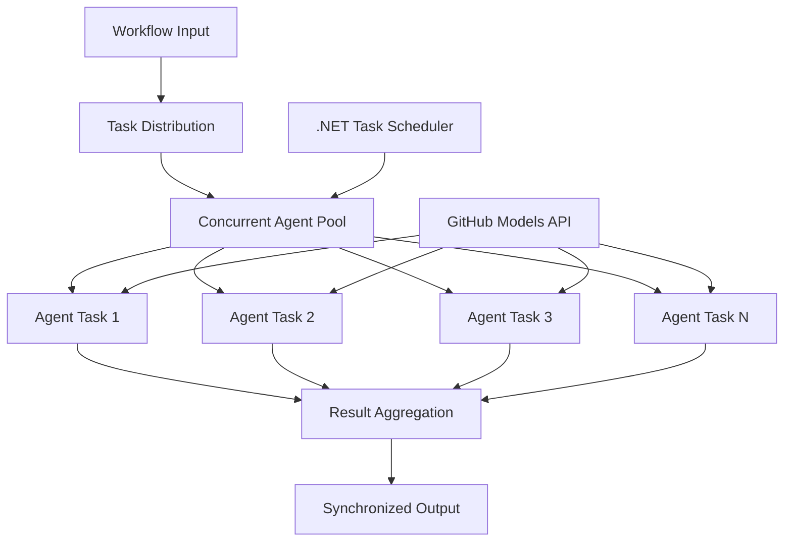

<!--
CO_OP_TRANSLATOR_METADATA:
{
  "original_hash": "b9c6e32c9b5f2fed20b6916984440d88",
  "translation_date": "2025-11-11T13:35:54+00:00",
  "source_file": "08-multi-agent/code_samples/workflows-agent-framework/dotNET/03.dotnet-agent-framework-workflow-ghmodel-concurrent.md",
  "language_code": "lt"
}
-->
# ⚡ Lygiagretūs agentų darbo srautai su GitHub modeliais (.NET)

## 📋 Aukštos našumo lygiagretaus apdorojimo pamoka

Šiame užrašų knygelėje demonstruojami **lygiagretaus darbo srautų modeliai**, naudojant Microsoft Agent Framework for .NET ir GitHub modelius. Sužinosite, kaip kurti aukštos našumo lygiagretaus apdorojimo darbo srautus, kurie maksimaliai padidina našumą vykdant kelis AI agentus vienu metu, išlaikant koordinaciją ir duomenų nuoseklumą.

## 🎯 Mokymosi tikslai

### 🚀 **Lygiagretaus apdorojimo pagrindai**
- **Lygiagretus agentų vykdymas**: Vykdykite kelis AI agentus vienu metu, kad pasiektumėte maksimalų našumą
- **Async/Await modeliai**: Naudokite .NET asinchroninio programavimo modelį efektyviam lygiagrečiam apdorojimui
- **GitHub modelių integracija**: Koordinuokite kelis lygiagrečius GitHub AI modelio užklausų vykdymus
- **Išteklių valdymas**: Efektyviai valdykite AI modelio išteklius lygiagrečių operacijų metu

### 🏗️ **Pažangi lygiagretaus apdorojimo architektūra**
- **Užduočių pagrindu vykdomas lygiagretumas**: Naudokite .NET Task Parallel Library optimaliai lygiagrečiam vykdymui
- **Sinchronizavimo modeliai**: Koordinuokite lygiagrečius agentus, išvengdami lenktynių sąlygų
- **Darbo paskirstymas**: Efektyviai paskirstykite darbą pagal turimą lygiagretaus apdorojimo pajėgumą
- **Gedimų tolerancija**: Tvarkykite atskirų agentų gedimus, nesustabdydami viso darbo srauto

### 🏢 **Lygiagrečios programos verslui**
- **Didelės apimties dokumentų apdorojimas**: Apdorokite kelis dokumentus vienu metu
- **Realaus laiko turinio analizė**: Lygiagrečiai analizuokite gaunamus duomenų srautus
- **Partijų apdorojimo optimizavimas**: Maksimaliai padidinkite našumą apdorojant didelės apimties duomenis
- **Daugiarūšė analizė**: Lygiagrečiai apdorokite skirtingų tipų ir formatų turinį

## ⚙️ Reikalavimai ir paruošimas

### 📦 **Reikalingi NuGet paketai**

Esminiai paketai aukštos našumo lygiagretiems darbo srautams:

```xml
<!-- Core AI Framework with Async Support -->
<PackageReference Include="Microsoft.Extensions.AI" Version="9.9.0" />

<!-- Client Model Abstractions for API Communication -->
<PackageReference Include="System.ClientModel" Version="1.6.1.0" />

<!-- Azure Identity and Async LINQ for Advanced Operations -->
<PackageReference Include="Azure.Identity" Version="1.15.0" />
<PackageReference Include="System.Linq.Async" Version="6.0.3" />

<!-- Local Agent Framework References -->
<!-- Microsoft.Agents.AI.dll - Core agent abstractions with async support -->
<!-- Microsoft.Agents.AI.OpenAI.dll - GitHub Models integration with concurrency -->
```

### 🔑 **GitHub modelių konfigūracija**

**Aplinkos nustatymai (.env failas):**
```env
GITHUB_TOKEN=your_github_personal_access_token
GITHUB_ENDPOINT=https://models.inference.ai.azure.com
GITHUB_MODEL_ID=gpt-4o-mini
```

**Lygiagretaus apdorojimo aspektai:**
```csharp
// Configure for concurrent operations
var clientOptions = new OpenAIClientOptions()
{
    Endpoint = new Uri(githubEndpoint),
    // Configure connection pooling for concurrent requests
    NetworkTimeout = TimeSpan.FromMinutes(5)
};
```

### 🏗️ **Lygiagretaus darbo srauto architektūra**



**Pagrindiniai komponentai:**
- **Task Parallel Library**: .NET įmontuota lygiagrečių operacijų palaikymo biblioteka
- **Agentų grupė**: Keli agentų egzemplioriai lygiagrečiam apdorojimui
- **Rezultatų agregavimas**: Koordinacija ir lygiagrečių agentų rezultatų sujungimas
- **Sinchronizavimo taškai**: Užtikrinkite duomenų nuoseklumą lygiagrečių operacijų metu

## 🎨 **Lygiagretaus darbo srauto projektavimo modeliai**

### 🔍 **Lygiagreti tyrimų ir analizės veikla**
```
Research Topic → Concurrent Research Agents → Result Synthesis → Final Report
```

### 📊 **Daugiakryptis duomenų apdorojimas**
```
Data Sources → Parallel Processing Agents → Data Integration → Unified Output
```

### 🎭 **Turinio generavimo procesas**
```
Content Requirements → Concurrent Content Generators → Quality Review → Final Content
```

### 🔄 **Fan-Out/Fan-In apdorojimas**
```
Single Input → Multiple Concurrent Processors → Result Aggregation → Single Output
```

## 🏢 **Našumo privalumai verslui**

### ⚡ **Našumas ir mastelio keitimas**
- **Linijinis našumo mastelio keitimas**: Pridėkite daugiau lygiagrečių agentų, kad padidintumėte našumą
- **Išteklių panaudojimas**: Maksimalus turimų AI modelio pajėgumų efektyvumas
- **Sutrumpintas apdorojimo laikas**: Reikšmingas laiko sutrumpinimas per lygiagretų vykdymą
- **Elastinis mastelio keitimas**: Dinamiškai reguliuokite lygiagrečių agentų skaičių pagal darbo krūvį

### 🛡️ **Patikimumas ir atsparumas**
- **Gedimų izoliacija**: Atskiri agentų gedimai neturi įtakos kitoms lygiagrečioms operacijoms
- **Sklandus degradavimas**: Sistema toliau veikia su sumažintu agentų pajėgumu
- **Klaidų atkūrimas**: Automatiniai pakartojimo mechanizmai nepavykusioms lygiagrečioms operacijoms
- **Darbo paskirstymas**: Vienodas darbo paskirstymas tarp turimų agentų

### 📊 **Našumo stebėjimas**
- **Lygiagretaus vykdymo metrika**: Stebėkite visų lygiagrečių operacijų našumą
- **Išteklių naudojimo analizė**: Stebėkite CPU, atminties ir tinklo naudojimą
- **Našumo analizė**: Matuokite efektyvumo padidėjimą dėl lygiagretaus apdorojimo
- **Siaurųjų vietų aptikimas**: Nustatykite ir pašalinkite našumo apribojimus

### 🔧 **Kūrimas ir operacijos**
- **Asinchroninio programavimo modelis**: Naudokite .NET brandų async/await modelį
- **Užduočių koordinavimas**: Įmontuotos užduočių valdymo ir koordinavimo galimybės
- **Išimčių tvarkymas**: Išsamus klaidų tvarkymas lygiagrečioms operacijoms
- **Derinimo palaikymas**: Visual Studio derinimo įrankiai lygiagretiems darbo srautams

Kurkime aukštos našumo lygiagrečius AI darbo srautus su .NET! 🚀

## 💻 Kodo vykdymas

Pilna įgyvendinimo versija pateikta `03.dotnet-agent-framework-workflow-ghmodel-concurrent.cs`. Šiame faile demonstruojamas **Fan-Out/Fan-In lygiagretaus darbo srautas** kelionių planavimui:

### 🏗️ **Darbo srauto architektūra**

```
User Request → ConcurrentStartExecutor → [Researcher Agent || Planner Agent] → ConcurrentAggregationExecutor → Final Output
```

**Pagrindiniai komponentai:**

1. **ConcurrentStartExecutor**: Vienu metu perduoda vartotojo užklausą visiems agentams
2. **Researcher Agent**: Lygiagrečiai analizuoja vietas ir lankytinas vietas
3. **Planner Agent**: Lygiagrečiai kuria detalius kelionių planus
4. **ConcurrentAggregationExecutor**: Surenka ir sujungia abiejų agentų rezultatus

### 🎯 **Fan-Out/Fan-In modelis**

Šis darbo srautas demonstruoja klasikinį **Fan-Out/Fan-In** modelį:
- **Fan-Out**: Viena įvesties žinutė perduodama keliems agentams vienu metu
- **Lygiagrečiai apdorojama**: Keli agentai dirba lygiagrečiai su ta pačia užduotimi
- **Fan-In**: Visų agentų rezultatai surenkami ir sujungiami į vieną išvestį

### 🚀 Pavyzdžio vykdymas

```bash
# Make the script executable (Unix/Linux/macOS)
chmod +x 03.dotnet-agent-framework-workflow-ghmodel-concurrent.cs

# Run the concurrent workflow
./03.dotnet-agent-framework-workflow-ghmodel-concurrent.cs
```

Arba Windows sistemoje:
```powershell
dotnet run 03.dotnet-agent-framework-workflow-ghmodel-concurrent.cs
```

### 📝 Tikėtinas rezultatas

Darbo srautas atliks:
1. **Užklausos perdavimą**: Išsiųs „Suplanuokite kelionę į Sietlą gruodžio mėnesį“ abiem agentams
2. **Lygiagretų apdorojimą**: Abu agentai dirbs vienu metu:
   - Tyrėjas nustatys lankytinas vietas ir detales
   - Planuotojas sudarys maršrutą ir logistiką
3. **Agregavimą**: Sujungs abu atsakymus į išsamų rezultatą
4. **Rezultatų rodymą**: Parodys sujungtą kelionių planą su visa informacija

### 🔧 Pritaikymo galimybės

**Pridėkite daugiau lygiagrečių agentų:**
```csharp
// Create additional specialized agents
AIAgent budgetAgent = openAIClient.GetChatClient(github_model_id).CreateAIAgent(
    name: "Budget-Agent", instructions: "Calculate travel costs...");

// Add to fan-out
var workflow = new WorkflowBuilder(startExecutor)
    .AddFanOutEdge(startExecutor, targets: [researcherAgent, plannerAgent, budgetAgent])
    .AddFanInEdge(aggregationExecutor, sources: [researcherAgent, plannerAgent, budgetAgent])
    .WithOutputFrom(aggregationExecutor)
    .Build();

// Update aggregation count
if (this._messages.Count == 3) { ... }
```

**Keiskite agentų instrukcijas:**
```csharp
const string ResearcherAgentInstructions = "Your custom instructions for research...";
const string PlanAgentInstructions = "Your custom instructions for planning...";
```

**Pakeiskite užduotį:**
```csharp
StreamingRun run = await InProcessExecution.StreamAsync(
    workflow, 
    "Plan a European vacation for 2 weeks in summer"
);
```

### 🎯 Realūs pritaikymo būdai

Šis lygiagretaus modelis puikiai tinka:
- **Turinio kūrimui**: Keli rašytojai vienu metu kuria skirtingas dalis
- **Kodo peržiūrai**: Keli peržiūrėtojai analizuoja kodą iš skirtingų perspektyvų
- **Rinkos tyrimams**: Lygiagreti skirtingų rinkos segmentų analizė
- **Dokumentų apdorojimui**: Lygiagrečiai ištraukimas, analizė ir patikrinimas
- **Daugiaperspektyvė analizė**: Skirtingų požiūrių gavimas į tą pačią įvestį

### 🔍 Suprasti pritaikytus vykdytojus

**ConcurrentStartExecutor:**
- Įgyvendina `IMessageHandler<string>` priimti tekstinę įvestį
- Perduoda žinutes visiems prijungtiems agentams
- Siunčia `TurnToken`, kad inicijuotų lygiagretų apdorojimą

**ConcurrentAggregationExecutor:**
- Įgyvendina `IMessageHandler<ChatMessage>` priimti agentų atsakymus
- Surenka žinutes saugiai gijų atžvilgiu
- Agreguoja, kai gaunami visi laukiami atsakymai
- Pateikia galutinę išvestį naudodamas `context.YieldOutputAsync()`

### ⚡ Našumo privalumai

**Lygiagrečiai vs nuosekliai:**
- Nuosekliai: Agent1 (30s) → Agent2 (30s) = **60 sekundžių iš viso**
- Lygiagrečiai: Agent1 (30s) || Agent2 (30s) = **30 sekundžių iš viso**

**Našumo padidėjimas**: Iki N× greičiau su N lygiagrečiais agentais (priklausomai nuo darbo krūvio ir išteklių)

### 🛡️ Klaidų tvarkymas

Darbo srautas tvarko atskirų agentų gedimus sklandžiai:
- Jei vienas agentas sugenda, kiti tęsia apdorojimą
- Agregatorius gali įgyvendinti laiko apribojimo logiką
- Jei reikia, gali būti grąžinti daliniai rezultatai

### 📊 Pažangios funkcijos

**Dinaminis agentų skaičius:**
Pakeiskite agregavimo logiką, kad palaikytumėte kintamą agentų skaičių:

```csharp
private int _expectedAgentCount;
private readonly List<ChatMessage> _messages = [];

public async ValueTask HandleAsync(ChatMessage message, IWorkflowContext context)
{
    this._messages.Add(message);
    if (this._messages.Count == _expectedAgentCount)
    {
        // Process aggregation
    }
}
```

Šis lygiagretaus darbo srauto modelis yra būtinas kuriant aukštos našumo, mastelio keičiamas AI agentų sistemas!

---

<!-- CO-OP TRANSLATOR DISCLAIMER START -->
**Atsakomybės apribojimas**:  
Šis dokumentas buvo išverstas naudojant AI vertimo paslaugą [Co-op Translator](https://github.com/Azure/co-op-translator). Nors siekiame tikslumo, prašome atkreipti dėmesį, kad automatiniai vertimai gali turėti klaidų ar netikslumų. Originalus dokumentas jo gimtąja kalba turėtų būti laikomas autoritetingu šaltiniu. Dėl svarbios informacijos rekomenduojama profesionali žmogaus vertimo paslauga. Mes neprisiimame atsakomybės už nesusipratimus ar neteisingus interpretavimus, atsiradusius naudojant šį vertimą.
<!-- CO-OP TRANSLATOR DISCLAIMER END -->