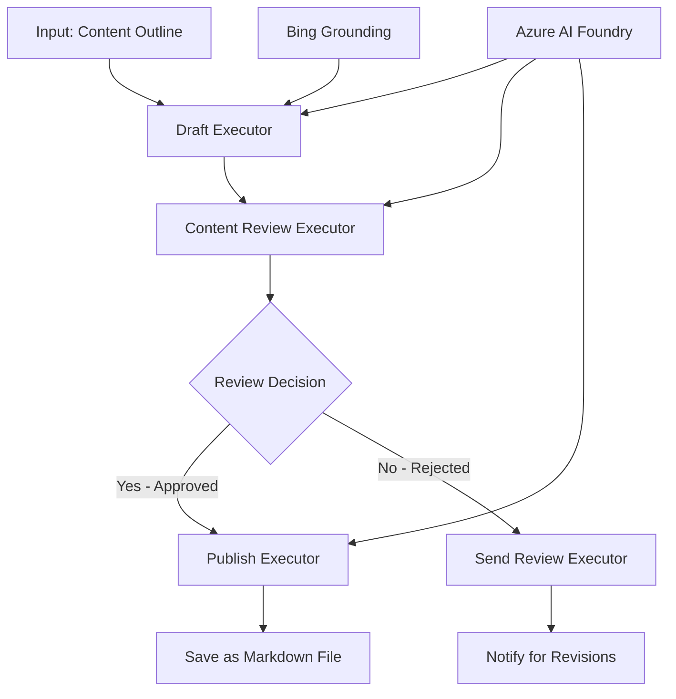

<!--
CO_OP_TRANSLATOR_METADATA:
{
  "original_hash": "8abd335151cee553293b637ee3d80d10",
  "translation_date": "2025-11-11T12:35:24+00:00",
  "source_file": "08-multi-agent/code_samples/workflows-agent-framework/dotNET/04.dotnet-agent-framework-workflow-aifoundry-condition.md",
  "language_code": "lt"
}
-->
# 🔀 Sąlyginiai agentų darbo srautai su Azure AI Foundry (.NET)

## 📋 Pamoka apie intelektualius sprendimų pagrindu veikiančius darbo srautus

Šiame užrašų knygelėje demonstruojami **sąlyginiai darbo srautų modeliai**, naudojant Azure AI Foundry ir Microsoft Agent Framework for .NET. Sužinosite, kaip kurti sudėtingus, sprendimais pagrįstus darbo srautus, kurie protingai nukreipia apdorojimą pagal AI analizę, verslo taisykles ir dinamiškas sąlygas, siekiant aukščiausio lygio automatizavimo.

## 🎯 Mokymosi tikslai

### 🧠 **Intelektuali sprendimų architektūra**
- **Sąlyginės logikos įgyvendinimas**: Kurkite sudėtingus sprendimų medžius su keliais šakojimosi taškais
- **AI pagrįstas nukreipimas**: Naudokite Azure AI Foundry modelius, kad priimtumėte protingus nukreipimo sprendimus
- **Dinaminis darbo srauto pritaikymas**: Keiskite darbo srauto elgesį pagal vykdymo metu atliktą analizę ir sąlygas
- **Verslo taisyklių integracija**: Įtraukite verslo logiką ir atitikties reikalavimus į darbo srautus

### 🔀 **Pažangūs sąlyginiai modeliai**
- **Sprendimų priėmimas pagal kelis kriterijus**: Įvertinkite kelis veiksnius, kad priimtumėte nukreipimo sprendimus
- **Konteksto pagrįstas apdorojimas**: Priimkite sprendimus remdamiesi sukauptu darbo srauto kontekstu ir istorija
- **Adaptacinis darbo srauto modifikavimas**: Dinamiškai koreguokite apdorojimo kelius pagal realaus laiko sąlygas
- **Taisyklių variklio integracija**: Įgyvendinkite sudėtingus verslo taisyklių variklius darbo srautuose

### 🏢 **Sąlyginės programos verslui**
- **Dokumentų klasifikavimas ir nukreipimas**: Automatiškai klasifikuokite ir nukreipkite dokumentus į tinkamus darbo srautus
- **Klientų aptarnavimo triage**: Protingas klientų užklausų nukreipimas į specializuotas komandas
- **Atitikties ir rizikos apdorojimas**: Taikykite skirtingus patikrinimo ir peržiūros procesus pagal rizikos vertinimą
- **Kokybės užtikrinimo darbo srautai**: Nukreipkite turinį per tinkamus peržiūros procesus pagal kokybės metrikas

## ⚙️ Reikalavimai ir nustatymai

### 📦 **Reikalingi NuGet paketai**

Pažangūs paketai sąlyginiam darbo srautų apdorojimui:

```xml
<!-- Core AI Framework -->
<PackageReference Include="Microsoft.Extensions.AI" Version="9.9.0" />

<!-- Azure AI Agents with Persistent State -->
<PackageReference Include="Azure.AI.Agents.Persistent" Version="1.2.0-beta.5" />

<!-- Azure Identity and Utilities -->
<PackageReference Include="Azure.Identity" Version="1.15.0" />
<PackageReference Include="System.Linq.Async" Version="6.0.3" />
<PackageReference Include="DotNetEnv" Version="3.1.1" />

<!-- Local Workflow Framework References -->
<!-- Microsoft.Agents.Workflows.dll - Advanced workflow orchestration -->
<!-- Microsoft.Agents.AI.AzureAI.dll - Azure AI Foundry integration -->
<!-- Microsoft.Agents.AI.dll - Core agent abstractions -->
```

### 🔑 **Azure AI Foundry konfigūracija**

**Reikalingi Azure ištekliai:**
- Azure AI Foundry darbo aplinka su sąlyginio apdorojimo modeliais
- Azure prenumerata su tinkamais skaičiavimo kvotomis ir leidimais
- Diegti AI modeliai sprendimų priėmimui ir turinio analizei
- (Pasirinktinai) Bing Search API ryšys, skirtas informacijos pagrindimui

**Aplinkos konfigūracija (.env failas):**
```env
# Azure AI Foundry Configuration
AZURE_AI_PROJECT_ENDPOINT=https://your-project.cognitiveservices.azure.com/
BING_CONNECTION_ID=your-bing-connection-id
```

**Autentifikacijos nustatymai:**
```csharp
// Azure CLI or Managed Identity authentication
using Azure.Identity;
var credential = new AzureCliCredential();

// Load environment configuration
DotNetEnv.Env.Load("../../../.env");
```

### 🏗️ **Sąlyginė darbo srauto architektūra**



**Pagrindiniai komponentai:**
- **Draft Executor**: AI agentas, kuris kuria pradinį turinio juodraštį iš kontūrų
- **Content Review Executor**: AI agentas, kuris vertina juodraščio kokybę ir atitiktį
- **Sąlyginis nukreipimas**: Sprendimų logika, nukreipianti pagal peržiūros rezultatus
- **Publikavimo/peržiūros keliai**: Atskirti apdorojimo keliai patvirtintam ir atmestam turiniui
- **Būsenos valdymas**: Išlaiko turinio ir peržiūros kontekstą viso darbo srauto metu

## 🎨 **Sąlyginiai darbo srauto dizaino modeliai**

### 📋 **Turinio kūrimas su kokybės vartais**
```
Outline → Draft Creation → Quality Review → {Approve: Publish | Reject: Revise}
```

### 🎯 **Rizikos pagrįstas dokumentų apdorojimas**
```
Document → Risk Assessment → {Low: Standard | High: Enhanced Review}
```

### 🔍 **Intelektualus klientų aptarnavimo nukreipimas**
```
Customer Query → Analysis → {Simple: FAQ Bot | Complex: Human Agent}
```

### 💼 **Atitikties pagrįsti darbo srautai**
```
Content → Compliance Check → {Pass: Publish | Fail: Legal Review}
```

## 🏢 **Sąlyginės naudos verslui**

### 🎯 **Intelektuali automatizacija**
- **Protingas sprendimų priėmimas**: AI pagrįsti nukreipimo sprendimai pagal turinio analizę ir kontekstą
- **Adaptacinis apdorojimas**: Darbo srautai, kurie automatiškai prisitaiko prie besikeičiančių sąlygų
- **Verslo taisyklių laikymasis**: Automatinis sudėtingos verslo logikos ir politikos taikymas
- **Konteksto pagrįstas nukreipimas**: Sprendimai, pagrįsti visa darbo srauto istorija ir sukauptu kontekstu

### 📈 **Operacinis tobulumas**
- **Optimizuotas išteklių paskirstymas**: Nukreipkite darbą į tinkamiausius specialistus ir procesus
- **Sumažintas rankinis įsikišimas**: Automatinis sprendimų priėmimas sumažina poreikį žmogaus nukreipimui
- **Greitesnis sprendimų laikas**: Tiesioginis nukreipimas į tinkamą ekspertizę ir apdorojimo galimybes
- **Nuoseklus taikymas**: Vienodas verslo taisyklių ir sprendimų kriterijų taikymas

### 🛡️ **Rizikos valdymas ir atitiktis**
- **Automatinis rizikos vertinimas**: AI pagrįstas turinio ir situacijos rizikos lygio vertinimas
- **Atitikties laikymasis**: Automatinis nukreipimas per reikiamus reguliavimo procesus
- **Saugumo protokolų taikymas**: Sustiprintos saugumo priemonės, taikomos pagal rizikos vertinimą
- **Audito takų palaikymas**: Pilna nukreipimo sprendimų ir motyvų dokumentacija

### 📊 **Analitika ir nuolatinis tobulinimas**
- **Sprendimų analitika**: Stebėkite nukreipimo sprendimų efektyvumą ir tikslumą
- **Modelių atpažinimas**: Nustatykite tendencijas ir modelius nukreipimo sprendimuose laikui bėgant
- **Veiklos optimizavimas**: Nuolatinis sprendimų kriterijų ir nukreipimo efektyvumo tobulinimas
- **Verslo intelektas**: Įžvalgos apie turinio charakteristikas ir apdorojimo reikalavimus

### 🔧 **Techninis tobulumas**
- **Nuolatinis būsenos valdymas**: Išlaikykite sudėtingą būseną viso darbo srauto vykdymo metu
- **Mastelio architektūra**: Tvarkykite didelės apimties sąlyginio apdorojimo reikalavimus
- **Integracijos galimybės**: Sklandi integracija su esamomis verslo sistemomis ir procesais
- **Stebėjimas ir stebimumas**: Išsamus darbo srauto veiklos ir sprendimų stebėjimas

Kurkime intelektualius, sprendimais pagrįstus verslo darbo srautus su .NET! 🚀

## 💻 Kodo vykdymas

Pilna įgyvendinimo versija pateikta `04.dotnet-agent-framework-workflow-aifoundry-condition.cs`. Tai demonstruoja **turinio kūrimo darbo srautą su kokybės vartais**:

### 🏗️ **Darbo srauto architektūra**

```
Content Outline → Draft Creation → Quality Review → Conditional Routing:
                                                      ├─ Approved (>200 words) → Publish
                                                      └─ Rejected (<200 words) → Review Notification
```

**Agentai darbo sraute:**
1. **Evangelist Agent**: Kuria pamokų juodraščius iš kontūrų su Bing pagrindimu
2. **Content Reviewer Agent**: Vertina juodraščio kokybę (žodžių skaičių, pilnumą)
3. **Publisher Agent**: Išsaugo patvirtintą turinį kaip laiko žymėmis pažymėtus Markdown failus

**Individualūs vykdytojai:**
1. **DraftExecutor**: Orkestruoja juodraščio kūrimą
2. **ContentReviewExecutor**: Atlieka kokybės vertinimą
3. **PublishExecutor**: Tvarko patvirtinto turinio publikavimą
4. **SendReviewExecutor**: Valdo pranešimus apie atmestą turinį

### 🚀 Pavyzdžio vykdymas

**Reikalavimai:**
- Konfigūruota Azure AI Foundry darbo aplinka
- Azure CLI autentifikacija (`az login`)
- (Pasirinktinai) Bing Search ryšys, skirtas pagrindimui

```bash
# Make the script executable (Unix/Linux/macOS)
chmod +x 04.dotnet-agent-framework-workflow-aifoundry-condition.cs

# Run the conditional workflow
./04.dotnet-agent-framework-workflow-aifoundry-condition.cs
```

Arba Windows sistemoje:
```powershell
dotnet run 04.dotnet-agent-framework-workflow-aifoundry-condition.cs
```

### 📝 Tikėtinas rezultatas

Darbo srautas atliks:
1. **Agentų kūrimą**: Inicializuos tris specializuotus Azure AI Foundry agentus
2. **Juodraščio generavimą**: Evangelist agentas sukurs pamokos juodraštį iš kontūro
3. **Turinio peržiūrą**: Content Reviewer įvertins juodraščio kokybę
4. **Sąlyginį nukreipimą**:
   - **Jei patvirtinta (>200 žodžių)**: PublishExecutor išsaugos kaip Markdown failą
   - **Jei atmesta (<200 žodžių)**: SendReviewExecutor išsiųs peržiūros pranešimą
5. **Rezultatų rodymą**: Parodys galutinį darbo srauto rezultatą

### 🔧 Pritaikymo galimybės

**Keisti peržiūros kriterijus:**
```csharp
const string ContentReviewerInstructions = @"
You are a content reviewer...
1. Check if content is more than 500 words (instead of 200)
2. Verify technical accuracy
3. Ensure proper formatting
...";
```

**Pridėti daugiau sąlyginių kelių:**
```csharp
var workflow = new WorkflowBuilder(draftExecutor)
    .AddEdge(draftExecutor, contentReviewerExecutor)
    .AddEdge(contentReviewerExecutor, publishExecutor, condition: GetCondition("Excellent"))
    .AddEdge(contentReviewerExecutor, editExecutor, condition: GetCondition("Good"))
    .AddEdge(contentReviewerExecutor, sendReviewerExecutor, condition: GetCondition("Poor"))
    .Build();
```

**Keisti turinio reikalavimus:**
```csharp
string OUTLINE_Content = @"
# Your Custom Topic
## Section 1
https://your-reference-url
## Section 2
...
";
```

### 🎯 Realūs pritaikymo atvejai

Šis sąlyginio darbo srauto modelis puikiai tinka:
- **Turinio valdymo sistemoms**: Automatiniai redakciniai darbo srautai su kokybės vartais
- **Dokumentų apdorojimui**: Dokumentų nukreipimas pagal klasifikaciją ir atitiktį
- **Klientų aptarnavimui**: Protingas bilietų nukreipimas pagal sudėtingumą ir skubumą
- **Teisinių peržiūrų**: Sutarčių nukreipimas pagal rizikos vertinimą ir vertę
- **HR procesams**: Paraiškų nukreipimas per tinkamus atrankos darbo srautus

### 🔍 Sąlyginės logikos supratimas

**Sąlygos funkcija:**
```csharp
public Func<object?, bool> GetCondition(string expectedResult) =>
    reviewResult => reviewResult is ReviewResult review && review.Result == expectedResult;
```

Ši funkcija sukuria predikatą, kuris:
1. Patikrina, ar rezultatas yra tipo `ReviewResult`
2. Palygina `Result` savybę su numatyta verte
3. Grąžina true/false, kad nustatytų nukreipimą

**Darbo srauto kraštai su sąlygomis:**
```csharp
.AddEdge(contentReviewerExecutor, publishExecutor, condition: GetCondition("Yes"))
.AddEdge(contentReviewerExecutor, sendReviewerExecutor, condition: GetCondition("No"))
```

### 📊 Pažangios funkcijos

**JSON schemos validacija:**
Darbo srautas naudoja JSON schemas, kad užtikrintų struktūrizuotus atsakymus:

```csharp
// Define response structure
public class ReviewResult
{
    [JsonPropertyName("review_result")]
    public string Result { get; set; } = string.Empty;
    
    [JsonPropertyName("reason")]
    public string Reason { get; set; } = string.Empty;
    
    [JsonPropertyName("draft_content")]
    public string DraftContent { get; set; } = string.Empty;
}

// Apply to agent
ResponseFormat = ChatResponseFormat.ForJsonSchema(
    AIJsonUtilities.CreateJsonSchema(typeof(ReviewResult)), 
    "ReviewResult", 
    "Review Result From DraftContent"
)
```

**Bing pagrindimo integracija:**
Evangelist agentas naudoja Bing pagrindimą, kad pasiektų realaus laiko informaciją:

```csharp
var bingGroundingConfig = new BingGroundingSearchConfiguration(bing_conn_id);
BingGroundingToolDefinition bingGroundingTool = new(
    new BingGroundingSearchToolParameters([bingGroundingConfig])
);
```

Tai leidžia agentui sekti URL adresus kontūre ir išgauti dabartinę informaciją.

### 🛡️ Klaidų tvarkymas

Darbo srautas apima patikimą klaidų tvarkymą atmestam turiniui:
- Peržiūros nesėkmės sukelia alternatyvų kelią
- Pranešimai pateikia aiškias atmetimo priežastis
- Turinys išsaugomas peržiūrai

### 🔄 Darbo srauto plėtra

**Pridėti peržiūros ciklą:**
Sukurkite grįžtamojo ryšio ciklą, kuris automatiškai perkuria turinį:

```csharp
.AddEdge(contentReviewerExecutor, publishExecutor, condition: GetCondition("Yes"))
.AddEdge(contentReviewerExecutor, draftExecutor, condition: GetCondition("No")) // Loop back
```

**Įgyvendinti daugiapakopę peržiūrą:**
Pridėkite kelis peržiūros etapus su skirtingais kriterijais:

```csharp
.AddEdge(draftExecutor, technicalReviewer)
.AddEdge(technicalReviewer, editorialReviewer, condition: GetCondition("TechPass"))
.AddEdge(editorialReviewer, publishExecutor, condition: GetCondition("EditPass"))
```

Šis sąlyginio darbo srauto modelis suteikia pagrindą kurti sudėtingas, intelektualias verslo automatizavimo sistemas! 🚀

---

<!-- CO-OP TRANSLATOR DISCLAIMER START -->
**Atsakomybės apribojimas**:  
Šis dokumentas buvo išverstas naudojant AI vertimo paslaugą [Co-op Translator](https://github.com/Azure/co-op-translator). Nors stengiamės užtikrinti tikslumą, prašome atkreipti dėmesį, kad automatiniai vertimai gali turėti klaidų ar netikslumų. Originalus dokumentas jo gimtąja kalba turėtų būti laikomas autoritetingu šaltiniu. Kritinei informacijai rekomenduojama naudoti profesionalų žmogaus vertimą. Mes neprisiimame atsakomybės už nesusipratimus ar neteisingus interpretavimus, atsiradusius dėl šio vertimo naudojimo.
<!-- CO-OP TRANSLATOR DISCLAIMER END -->