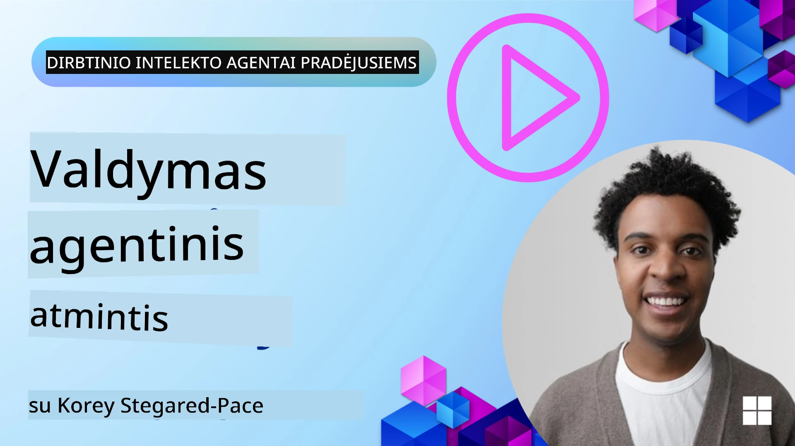

<!--
CO_OP_TRANSLATOR_METADATA:
{
  "original_hash": "a1d90991499ad697c4ad24decaf36968",
  "translation_date": "2025-12-09T13:00:09+00:00",
  "source_file": "13-agent-memory/README.md",
  "language_code": "lt"
}
-->
# Atmintis dirbtinio intelekto agentams 

Kalbant apie unikalius dirbtinio intelekto agentų kūrimo privalumus, dažniausiai aptariami du dalykai: gebėjimas naudoti įrankius užduotims atlikti ir gebėjimas tobulėti laikui bėgant. Atmintis yra pagrindas kuriant savarankiškai tobulėjančius agentus, kurie gali suteikti geresnę patirtį mūsų vartotojams.

Šioje pamokoje aptarsime, kas yra atmintis dirbtinio intelekto agentams, kaip ją valdyti ir panaudoti mūsų programų naudai.

## Įvadas

Šioje pamokoje aptarsime:

• **Dirbtinio intelekto agentų atminties supratimas**: Kas yra atmintis ir kodėl ji būtina agentams.

• **Atminties įgyvendinimas ir saugojimas**: Praktiniai metodai, kaip pridėti atminties funkcijas jūsų dirbtinio intelekto agentams, akcentuojant trumpalaikę ir ilgalaikę atmintį.

• **Dirbtinio intelekto agentų savarankiškas tobulėjimas**: Kaip atmintis leidžia agentams mokytis iš ankstesnių sąveikų ir tobulėti laikui bėgant.

## Galimos įgyvendinimo priemonės

Šioje pamokoje pateikiami du išsamūs mokomieji užrašai:

• **[13-agent-memory.ipynb](./13-agent-memory.ipynb)**: Atminties įgyvendinimas naudojant Mem0 ir Azure AI Search su Semantic Kernel sistema.

• **[13-agent-memory-cognee.ipynb](./13-agent-memory-cognee.ipynb)**: Struktūruotos atminties įgyvendinimas naudojant Cognee, automatiškai kuriant žinių grafą, paremtą įterpimais, vizualizuojant grafą ir protingai ieškant.

## Mokymosi tikslai

Baigę šią pamoką, sužinosite, kaip:

• **Atskirti įvairius dirbtinio intelekto agentų atminties tipus**, įskaitant darbinę, trumpalaikę ir ilgalaikę atmintį, taip pat specializuotas formas, tokias kaip asmenybės ir epizodinė atmintis.

• **Įgyvendinti ir valdyti trumpalaikę ir ilgalaikę atmintį dirbtinio intelekto agentams** naudojant Semantic Kernel sistemą, pasitelkiant tokius įrankius kaip Mem0, Cognee, Whiteboard atmintis ir integraciją su Azure AI Search.

• **Suprasti savarankiškai tobulėjančių dirbtinio intelekto agentų principus** ir kaip tvirtos atminties valdymo sistemos prisideda prie nuolatinio mokymosi ir prisitaikymo.

## Dirbtinio intelekto agentų atminties supratimas

Iš esmės, **dirbtinio intelekto agentų atmintis reiškia mechanizmus, leidžiančius jiems išsaugoti ir prisiminti informaciją**. Ši informacija gali būti specifinės pokalbio detalės, vartotojo pageidavimai, ankstesni veiksmai ar net išmokti modeliai.

Be atminties dirbtinio intelekto programos dažnai yra be būsenos, tai reiškia, kad kiekviena sąveika prasideda nuo nulio. Tai sukelia pasikartojančią ir varginančią vartotojo patirtį, kai agentas „pamiršta“ ankstesnį kontekstą ar pageidavimus.

### Kodėl atmintis svarbi?

Agentų intelektas yra glaudžiai susijęs su jų gebėjimu prisiminti ir panaudoti ankstesnę informaciją. Atmintis leidžia agentams būti:

• **Refleksyviems**: Mokytis iš ankstesnių veiksmų ir rezultatų.

• **Interaktyviems**: Išlaikyti kontekstą per vykstantį pokalbį.

• **Proaktyviems ir reaktyviems**: Nuspėti poreikius arba tinkamai reaguoti remiantis istorine informacija.

• **Autonomiškiems**: Veikti savarankiškiau, remiantis išsaugotomis žiniomis.

Atminties įgyvendinimo tikslas yra padaryti agentus **patikimesnius ir pajėgesnius**.

### Atminties tipai

#### Darbinė atmintis

Tai tarsi popieriaus lapelis, kurį agentas naudoja vykdydamas vieną užduotį ar minties procesą. Ji saugo tiesioginę informaciją, reikalingą kitam žingsniui apskaičiuoti.

Dirbtinio intelekto agentams darbinė atmintis dažnai užfiksuoja svarbiausią informaciją iš pokalbio, net jei visa pokalbio istorija yra ilga ar sutrumpinta. Ji sutelkia dėmesį į pagrindinių elementų, tokių kaip reikalavimai, pasiūlymai, sprendimai ir veiksmai, išskyrimą.

**Darbinės atminties pavyzdys**

Kelionių rezervavimo agentui darbinė atmintis gali užfiksuoti vartotojo dabartinį prašymą, pvz., „Noriu užsisakyti kelionę į Paryžių“. Šis konkretus reikalavimas laikomas agento tiesioginiame kontekste, kad būtų galima vadovautis dabartine sąveika.

#### Trumpalaikė atmintis

Šis atminties tipas išlaiko informaciją vieno pokalbio ar sesijos metu. Tai yra dabartinio pokalbio kontekstas, leidžiantis agentui grįžti prie ankstesnių dialogo posūkių.

**Trumpalaikės atminties pavyzdys**

Jei vartotojas klausia: „Kiek kainuotų skrydis į Paryžių?“ ir vėliau priduria: „O kaip dėl apgyvendinimo ten?“, trumpalaikė atmintis užtikrina, kad agentas žinotų, jog „ten“ reiškia „Paryžių“ tame pačiame pokalbyje.

#### Ilgalaikė atmintis

Tai informacija, kuri išlieka per kelis pokalbius ar sesijas. Ji leidžia agentams prisiminti vartotojo pageidavimus, istorines sąveikas ar bendras žinias per ilgą laikotarpį. Tai svarbu personalizacijai.

**Ilgalaikės atminties pavyzdys**

Ilgalaikė atmintis gali saugoti, kad „Benui patinka slidinėjimas ir lauko veiklos, mėgsta kavą su kalnų vaizdu ir nori vengti sudėtingų slidinėjimo trasų dėl ankstesnės traumos“. Ši informacija, išmokta iš ankstesnių sąveikų, daro rekomendacijas būsimuose kelionių planavimo sesijose labai personalizuotas.

#### Asmenybės atmintis

Šis specializuotas atminties tipas padeda agentui sukurti nuoseklią „asmenybę“ ar „vaidmenį“. Tai leidžia agentui prisiminti detales apie save ar savo numatytą vaidmenį, kad sąveika būtų sklandesnė ir labiau orientuota.

**Asmenybės atminties pavyzdys**

Jei kelionių agentas yra sukurtas kaip „ekspertas slidinėjimo planuotojas“, asmenybės atmintis gali sustiprinti šį vaidmenį, paveikdama jo atsakymus, kad jie atitiktų eksperto toną ir žinias.

#### Darbo eiga/Epizodinė atmintis

Ši atmintis saugo veiksmų seką, kurią agentas atlieka vykdydamas sudėtingą užduotį, įskaitant sėkmes ir nesėkmes. Tai tarsi prisiminimas apie konkrečius „epizodus“ ar ankstesnes patirtis, kad iš jų būtų galima mokytis.

**Epizodinės atminties pavyzdys**

Jei agentas bandė užsisakyti konkretų skrydį, bet nepavyko dėl vietų trūkumo, epizodinė atmintis galėtų užfiksuoti šią nesėkmę, leidžiant agentui bandyti alternatyvius skrydžius arba informuoti vartotoją apie problemą labiau informuotu būdu per kitą bandymą.

#### Subjekto atmintis

Tai apima specifinių subjektų (pvz., žmonių, vietų ar daiktų) ir įvykių iš pokalbių išskyrimą ir prisiminimą. Tai leidžia agentui sukurti struktūruotą supratimą apie aptartus pagrindinius elementus.

**Subjekto atminties pavyzdys**

Iš pokalbio apie ankstesnę kelionę agentas galėtų išskirti „Paryžių“, „Eifelio bokštą“ ir „vakarienę Le Chat Noir restorane“ kaip subjektus. Per būsimą sąveiką agentas galėtų prisiminti „Le Chat Noir“ ir pasiūlyti ten rezervuoti naują vakarienę.

#### Struktūruotas RAG (Retrieval Augmented Generation)

Nors RAG yra platesnė technika, „Struktūruotas RAG“ išskiriamas kaip galinga atminties technologija. Jis ištraukia tankią, struktūruotą informaciją iš įvairių šaltinių (pokalbių, el. laiškų, vaizdų) ir naudoja ją atsakymų tikslumui, prisiminimui ir greičiui pagerinti. Skirtingai nuo klasikinio RAG, kuris remiasi tik semantiniu panašumu, Struktūruotas RAG dirba su informacijos vidine struktūra.

**Struktūruoto RAG pavyzdys**

Užuot tik atitikęs raktinius žodžius, Struktūruotas RAG galėtų analizuoti skrydžio detales (kelionės tikslą, datą, laiką, oro linijas) iš el. laiško ir saugoti jas struktūruotu būdu. Tai leidžia tiksliai užklausoms, pvz., „Kokį skrydį užsisakiau į Paryžių antradienį?“

## Atminties įgyvendinimas ir saugojimas

Atminties įgyvendinimas dirbtinio intelekto agentams apima sistemingą **atminties valdymo** procesą, kuris apima informacijos generavimą, saugojimą, paiešką, integravimą, atnaujinimą ir net „pamiršimą“ (arba ištrynimą). Paieška yra ypač svarbus aspektas.

### Specializuoti atminties įrankiai

#### Mem0

Vienas iš būdų saugoti ir valdyti agentų atmintį yra naudoti specializuotus įrankius, tokius kaip Mem0. Mem0 veikia kaip nuolatinis atminties sluoksnis, leidžiantis agentams prisiminti svarbias sąveikas, saugoti vartotojo pageidavimus ir faktinį kontekstą bei mokytis iš sėkmių ir nesėkmių laikui bėgant. Idėja yra ta, kad be būsenos agentai tampa būseniniais.

Jis veikia per **dviejų etapų atminties vamzdyną: ištraukimas ir atnaujinimas**. Pirma, pranešimai, pridėti prie agento gijos, siunčiami į Mem0 paslaugą, kuri naudoja didelį kalbos modelį (LLM), kad apibendrintų pokalbio istoriją ir ištrauktų naujas atmintis. Vėliau LLM valdomas atnaujinimo etapas nustato, ar pridėti, modifikuoti ar ištrinti šias atmintis, saugant jas hibridiniame duomenų saugykloje, kuri gali apimti vektorių, grafų ir raktų-reikšmių duomenų bazes. Ši sistema taip pat palaiko įvairius atminties tipus ir gali įtraukti grafų atmintį, skirtą valdyti ryšius tarp subjektų.

#### Cognee

Kitas galingas požiūris yra naudoti **Cognee**, atvirojo kodo semantinę atmintį dirbtinio intelekto agentams, kuri transformuoja struktūruotus ir nestruktūruotus duomenis į užklausiamus žinių grafus, paremtus įterpimais. Cognee siūlo **dvigubos saugyklos architektūrą**, derinančią vektorinę panašumo paiešką su grafų ryšiais, leidžiančią agentams suprasti ne tik kokia informacija yra panaši, bet ir kaip sąvokos tarpusavyje susijusios.

Jis puikiai tinka **hibridinei paieškai**, kuri sujungia vektorinį panašumą, grafų struktūrą ir LLM samprotavimus – nuo žalių fragmentų paieškos iki grafų suvokimo klausimų atsakymo. Sistema palaiko **gyvą atmintį**, kuri vystosi ir auga, išliekant užklausiamai kaip vienas susietas grafas, palaikantis tiek trumpalaikį sesijos kontekstą, tiek ilgalaikę nuolatinę atmintį.

Cognee mokomasis užrašas ([13-agent-memory-cognee.ipynb](./13-agent-memory-cognee.ipynb)) demonstruoja šio vieningo atminties sluoksnio kūrimą, pateikiant praktinius pavyzdžius, kaip įvesti įvairius duomenų šaltinius, vizualizuoti žinių grafą ir užklausti naudojant skirtingas paieškos strategijas, pritaikytas konkretiems agentų poreikiams.

### Atminties saugojimas su RAG

Be specializuotų atminties įrankių, tokių kaip Mem0, galite pasinaudoti patikimomis paieškos paslaugomis, tokiomis kaip **Azure AI Search**, kaip pagrindu atmintims saugoti ir ieškoti, ypač struktūruotam RAG.

Tai leidžia pagrįsti agento atsakymus jūsų pačių duomenimis, užtikrinant labiau tinkamus ir tikslius atsakymus. Azure AI Search gali būti naudojama vartotojo specifinėms kelionių atmintims, produktų katalogams ar bet kokioms kitoms specifinėms žinioms saugoti.

Azure AI Search palaiko tokias funkcijas kaip **Struktūruotas RAG**, kuris puikiai tinka tankios, struktūruotos informacijos iš didelių duomenų rinkinių, pvz., pokalbių istorijų, el. laiškų ar net vaizdų, ištraukimo ir paieškos. Tai suteikia „antžmogišką tikslumą ir prisiminimą“, palyginti su tradiciniais teksto fragmentų ir įterpimų metodais.

## Dirbtinio intelekto agentų savarankiškas tobulėjimas

Dažnas savarankiškai tobulėjančių agentų modelis apima **„žinių agento“** įvedimą. Šis atskiras agentas stebi pagrindinį pokalbį tarp vartotojo ir pagrindinio agento. Jo vaidmuo yra:

1. **Identifikuoti vertingą informaciją**: Nustatyti, ar bet kuri pokalbio dalis verta išsaugoti kaip bendras žinias ar specifinį vartotojo pageidavimą.

2. **Ištraukti ir apibendrinti**: Išskirti esminį mokymąsi ar pageidavimą iš pokalbio.

3. **Saugojimas žinių bazėje**: Išsaugoti šią ištrauktą informaciją, dažnai vektorinėje duomenų bazėje, kad ją būtų galima vėliau rasti.

4. **Papildyti būsimus užklausimus**: Kai vartotojas inicijuoja naują užklausą, žinių agentas suranda atitinkamą išsaugotą informaciją ir prideda ją prie vartotojo užklausos, suteikdamas pagrindinį kontekstą pagrindiniam agentui (panašiai kaip RAG).

### Atminties optimizavimas

• **Vėlavimo valdymas**: Kad vartotojo sąveika nebūtų sulėtinta, pigesnis, greitesnis modelis gali būti naudojamas iš pradžių greitai patikrinti, ar informacija verta saugoti ar ieškoti, sudėtingesnį ištraukimo/paieškos procesą įjungiant tik tada, kai būtina.

• **Žinių bazės priežiūra**: Augančiai žinių bazei rečiau naudojama informacija gali būti perkelta į „šaltą saugyklą“, kad būtų valdomos išlaidos.

## Turite daugiau klausimų apie agentų atmintį?

Prisijunkite prie [Azure AI Foundry Discord](https://aka.ms/ai-agents/discord), kad susitiktumėte su kitais besimokančiais, dalyvautumėte konsultacijų valandose ir gautumėte atsakymus į

---

<!-- CO-OP TRANSLATOR DISCLAIMER START -->
**Atsakomybės apribojimas**:  
Šis dokumentas buvo išverstas naudojant AI vertimo paslaugą [Co-op Translator](https://github.com/Azure/co-op-translator). Nors siekiame tikslumo, prašome atkreipti dėmesį, kad automatiniai vertimai gali turėti klaidų ar netikslumų. Originalus dokumentas jo gimtąja kalba turėtų būti laikomas autoritetingu šaltiniu. Dėl svarbios informacijos rekomenduojama profesionali žmogaus vertimo paslauga. Mes neprisiimame atsakomybės už nesusipratimus ar neteisingus interpretavimus, atsiradusius naudojant šį vertimą.
<!-- CO-OP TRANSLATOR DISCLAIMER END -->