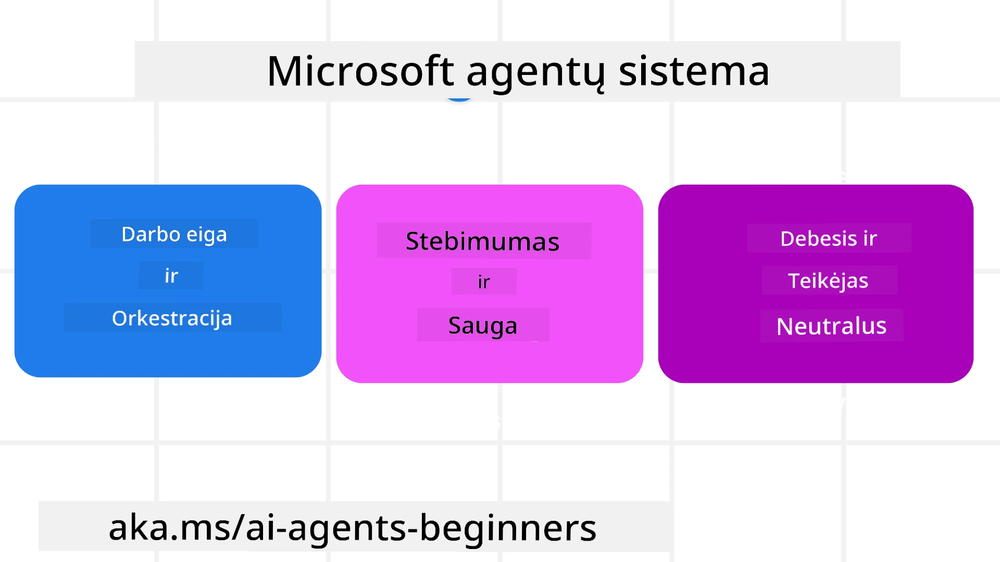
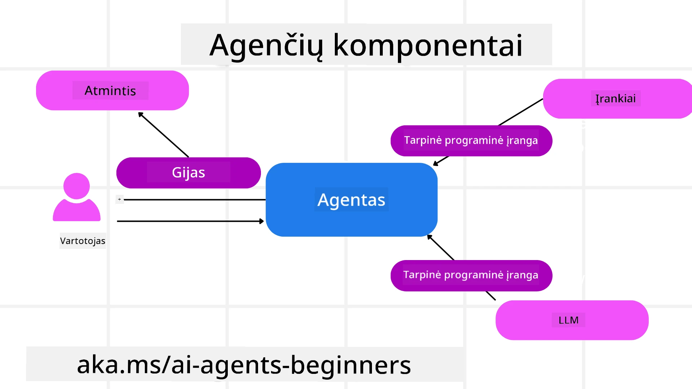

<!--
CO_OP_TRANSLATOR_METADATA:
{
  "original_hash": "19c4dab375acbc733855cc7f2f04edbc",
  "translation_date": "2025-10-01T20:37:56+00:00",
  "source_file": "14-microsoft-agent-framework/README.md",
  "language_code": "lt"
}
-->
# Microsoft Agent Framework tyrinėjimas


### Įvadas

Šioje pamokoje aptarsime:

- Microsoft Agent Framework supratimas: pagrindinės funkcijos ir vertė  
- Microsoft Agent Framework pagrindinių sąvokų tyrinėjimas
- MAF palyginimas su Semantic Kernel ir AutoGen: migracijos vadovas

## Mokymosi tikslai

Baigę šią pamoką, jūs sužinosite, kaip:

- Kurti gamybai paruoštus AI agentus naudojant Microsoft Agent Framework
- Taikyti pagrindines Microsoft Agent Framework funkcijas savo agentų naudojimo atvejams
- Migruoti ir integruoti esamus agentų sistemas bei įrankius  

## Kodo pavyzdžiai 

Kodo pavyzdžius [Microsoft Agent Framework (MAF)](https://aka.ms/ai-agents-beginners/agent-framewrok) galite rasti šiame saugykloje, failuose `xx-python-agent-framework` ir `xx-dotnet-agent-framework`.

## Microsoft Agent Framework supratimas



[Microsoft Agent Framework (MAF)](https://aka.ms/ai-agents-beginners/agent-framewrok) yra sukurtas remiantis patirtimi ir išmokimais iš Semantic Kernel ir AutoGen. Jis siūlo lankstumą, leidžiantį spręsti įvairius agentų naudojimo atvejus tiek gamybos, tiek mokslinių tyrimų aplinkose, įskaitant:

- **Sekvencinę agentų orkestraciją** scenarijams, kur reikalingi žingsnis po žingsnio darbo procesai.
- **Lygiagrečią orkestraciją** scenarijams, kur agentai turi atlikti užduotis vienu metu.
- **Grupinio pokalbio orkestraciją** scenarijams, kur agentai gali bendradarbiauti atlikdami vieną užduotį.
- **Perdavimo orkestraciją** scenarijams, kur agentai perduoda užduotį vienas kitam, kai subtikslai yra įvykdyti.
- **Magnetinę orkestraciją** scenarijams, kur vadovaujantis agentas kuria ir keičia užduočių sąrašą bei koordinuoja subagentus užduotims atlikti.

Norint pristatyti AI agentus gamyboje, MAF taip pat turi įtrauktas funkcijas:

- **Stebimumas** naudojant OpenTelemetry, kur kiekvienas AI agento veiksmas, įskaitant įrankių naudojimą, orkestracijos žingsnius, sprendimų eigą ir našumo stebėjimą per Azure AI Foundry prietaisų skydelius.
- **Saugumas** talpinant agentus natūraliai Azure AI Foundry, kuris apima saugumo kontrolę, pvz., vaidmenų pagrindu sukurtą prieigą, privačių duomenų tvarkymą ir įmontuotą turinio saugumą.
- **Patvarumas** kaip agentų gijos ir darbo procesai gali sustoti, tęsti ir atsigauti po klaidų, leidžiant ilgiau trunkančius procesus.
- **Kontrolė** kaip žmogaus įsikišimo darbo procesai yra palaikomi, kur užduotys pažymimos kaip reikalaujančios žmogaus patvirtinimo.

Microsoft Agent Framework taip pat orientuojasi į tarpusavio suderinamumą:

- **Debesų nepriklausomumas** - agentai gali veikti konteineriuose, vietoje ir skirtinguose debesyse.
- **Paslaugų teikėjų nepriklausomumas** - agentai gali būti sukurti naudojant jūsų pageidaujamą SDK, įskaitant Azure OpenAI ir OpenAI.
- **Atvirų standartų integracija** - agentai gali naudoti protokolus, tokius kaip Agent-to-Agent (A2A) ir Model Context Protocol (MCP), kad atrastų ir naudotų kitus agentus bei įrankius.
- **Priedai ir jungtys** - galima prisijungti prie duomenų ir atminties paslaugų, tokių kaip Microsoft Fabric, SharePoint, Pinecone ir Qdrant.

Pažvelkime, kaip šios funkcijos taikomos kai kurioms pagrindinėms Microsoft Agent Framework sąvokoms.

## Microsoft Agent Framework pagrindinės sąvokos

### Agentai



**Agentų kūrimas**

Agentų kūrimas atliekamas apibrėžiant inferencijos paslaugą (LLM teikėją), AI agentui skirtų instrukcijų rinkinį ir priskirtą `name`:

```python
agent = AzureOpenAIChatClient(credential=AzureCliCredential()).create_agent( instructions="You are good at recommending trips to customers based on their preferences.", name="TripRecommender" )
```

Aukščiau pateiktame pavyzdyje naudojamas `Azure OpenAI`, tačiau agentai gali būti sukurti naudojant įvairias paslaugas, įskaitant `Azure AI Foundry Agent Service`:

```python
AzureAIAgentClient(async_credential=credential).create_agent( name="HelperAgent", instructions="You are a helpful assistant." ) as agent
```

OpenAI `Responses`, `ChatCompletion` API

```python
agent = OpenAIResponsesClient().create_agent( name="WeatherBot", instructions="You are a helpful weather assistant.", )
```

```python
agent = OpenAIChatClient().create_agent( name="HelpfulAssistant", instructions="You are a helpful assistant.", )
```

arba nuotolinius agentus naudojant A2A protokolą:

```python
agent = A2AAgent( name=agent_card.name, description=agent_card.description, agent_card=agent_card, url="https://your-a2a-agent-host" )
```

**Agentų paleidimas**

Agentai paleidžiami naudojant `.run` arba `.run_stream` metodus, skirtus ne srautiniams arba srautiniams atsakymams.

```python
result = await agent.run("What are good places to visit in Amsterdam?")
print(result.text)
```

```python
async for update in agent.run_stream("What are the good places to visit in Amsterdam?"):
    if update.text:
        print(update.text, end="", flush=True)

```

Kiekvienas agento paleidimas taip pat gali turėti parinktis, leidžiančias pritaikyti parametrus, tokius kaip `max_tokens`, kuriuos naudoja agentas, `tools`, kuriuos agentas gali iškviesti, ir netgi patį `model`, kurį naudoja agentas.

Tai naudinga tais atvejais, kai specifiniai modeliai ar įrankiai yra būtini vartotojo užduočiai atlikti.

**Įrankiai**

Įrankiai gali būti apibrėžti tiek agento apibrėžimo metu:

```python
def get_attractions( location: Annotated[str, Field(description="The location to get the top tourist attractions for")], ) -> str: """Get the top tourist attractions for a given location.""" return f"The top attractions for {location} are." 


# When creating a ChatAgent directly 

agent = ChatAgent( chat_client=OpenAIChatClient(), instructions="You are a helpful assistant", tools=[get_attractions]

```

tiek agento paleidimo metu:

```python

result1 = await agent.run( "What's the best place to visit in Seattle?", tools=[get_attractions] # Tool provided for this run only )
```

**Agentų gijos**

Agentų gijos naudojamos daugkartiniams pokalbiams valdyti. Gijos gali būti sukurtos:

- Naudojant `get_new_thread()`, kuris leidžia gijai būti išsaugotai laikui bėgant.
- Automatiškai sukuriant giją agento paleidimo metu, kai gija egzistuoja tik dabartinio paleidimo metu.

Norint sukurti giją, kodas atrodo taip:

```python
# Create a new thread. 
thread = agent.get_new_thread() # Run the agent with the thread. 
response = await agent.run("Hello, I am here to help you book travel. Where would you like to go?", thread=thread)

```

Tada galite serializuoti giją, kad ją būtų galima išsaugoti vėlesniam naudojimui:

```python
# Create a new thread. 
thread = agent.get_new_thread() 

# Run the agent with the thread. 

response = await agent.run("Hello, how are you?", thread=thread) 

# Serialize the thread for storage. 

serialized_thread = await thread.serialize() 

# Deserialize the thread state after loading from storage. 

resumed_thread = await agent.deserialize_thread(serialized_thread)
```

**Agentų tarpinė programinė įranga**

Agentai sąveikauja su įrankiais ir LLM, kad atliktų vartotojo užduotis. Tam tikrais scenarijais norime vykdyti arba stebėti veiksmus tarp šių sąveikų. Agentų tarpinė programinė įranga leidžia tai padaryti:

*Funkcijų tarpinė programinė įranga*

Ši tarpinė programinė įranga leidžia vykdyti veiksmą tarp agento ir funkcijos/įrankio, kurį jis ketina iškviesti. Pavyzdys, kada tai būtų naudojama, yra kai norite registruoti funkcijos iškvietimą.

Žemiau pateiktame kode `next` apibrėžia, ar turėtų būti iškviesta kita tarpinė programinė įranga ar pati funkcija.

```python
async def logging_function_middleware(
    context: FunctionInvocationContext,
    next: Callable[[FunctionInvocationContext], Awaitable[None]],
) -> None:
    """Function middleware that logs function execution."""
    # Pre-processing: Log before function execution
    print(f"[Function] Calling {context.function.name}")

    # Continue to next middleware or function execution
    await next(context)

    # Post-processing: Log after function execution
    print(f"[Function] {context.function.name} completed")
```

*Pokalbių tarpinė programinė įranga*

Ši tarpinė programinė įranga leidžia vykdyti arba registruoti veiksmą tarp agento ir LLM užklausų.

Tai apima svarbią informaciją, pvz., `messages`, kurie siunčiami AI paslaugai.

```python
async def logging_chat_middleware(
    context: ChatContext,
    next: Callable[[ChatContext], Awaitable[None]],
) -> None:
    """Chat middleware that logs AI interactions."""
    # Pre-processing: Log before AI call
    print(f"[Chat] Sending {len(context.messages)} messages to AI")

    # Continue to next middleware or AI service
    await next(context)

    # Post-processing: Log after AI response
    print("[Chat] AI response received")

```

**Agentų atmintis**

Kaip aptarta pamokoje apie `Agentic Memory`, atmintis yra svarbus elementas, leidžiantis agentui veikti skirtinguose kontekstuose. MAF siūlo kelis skirtingus atminties tipus:

*Atmintis programos vykdymo metu*

Tai atmintis, saugoma gijose programos vykdymo metu.

```python
# Create a new thread. 
thread = agent.get_new_thread() # Run the agent with the thread. 
response = await agent.run("Hello, I am here to help you book travel. Where would you like to go?", thread=thread)
```

*Nuolatiniai pranešimai*

Ši atmintis naudojama pokalbių istorijai saugoti skirtingose sesijose. Ji apibrėžiama naudojant `chat_message_store_factory`:

```python
from agent_framework import ChatMessageStore

# Create a custom message store
def create_message_store():
    return ChatMessageStore()

agent = ChatAgent(
    chat_client=OpenAIChatClient(),
    instructions="You are a Travel assistant.",
    chat_message_store_factory=create_message_store
)

```

*Dinaminė atmintis*

Ši atmintis pridedama prie konteksto prieš paleidžiant agentus. Šios atmintys gali būti saugomos išorinėse paslaugose, pvz., mem0:

```python
from agent_framework.mem0 import Mem0Provider

# Using Mem0 for advanced memory capabilities
memory_provider = Mem0Provider(
    api_key="your-mem0-api-key",
    user_id="user_123",
    application_id="my_app"
)

agent = ChatAgent(
    chat_client=OpenAIChatClient(),
    instructions="You are a helpful assistant with memory.",
    context_providers=memory_provider
)

```

**Agentų stebimumas**

Stebimumas yra svarbus kuriant patikimas ir lengvai prižiūrimas agentų sistemas. MAF integruojasi su OpenTelemetry, kad suteiktų sekimo ir matavimo galimybes geresniam stebimumui.

```python
from agent_framework.observability import get_tracer, get_meter

tracer = get_tracer()
meter = get_meter()
with tracer.start_as_current_span("my_custom_span"):
    # do something
    pass
counter = meter.create_counter("my_custom_counter")
counter.add(1, {"key": "value"})
```

### Darbo procesai

MAF siūlo darbo procesus, kurie yra iš anksto apibrėžti žingsniai užduočiai atlikti ir apima AI agentus kaip komponentus šiuose žingsniuose.

Darbo procesai sudaryti iš skirtingų komponentų, leidžiančių geresnę kontrolės eigą. Darbo procesai taip pat leidžia **daugiaagentinę orkestraciją** ir **kontrolinius taškus**, kad būtų galima išsaugoti darbo proceso būsenas.

Pagrindiniai darbo proceso komponentai yra:

**Vykdytojai**

Vykdytojai gauna įvesties pranešimus, atlieka jiems priskirtas užduotis ir tada pateikia išvesties pranešimą. Tai perkelia darbo procesą link didesnės užduoties užbaigimo. Vykdytojai gali būti AI agentai arba individuali logika.

**Kraštai**

Kraštai naudojami apibrėžti pranešimų srautą darbo procese. Jie gali būti:

*Tiesioginiai kraštai* - Paprastos vienas su vienu jungtys tarp vykdytojų:

```python
from agent_framework import WorkflowBuilder

builder = WorkflowBuilder()
builder.add_edge(source_executor, target_executor)
builder.set_start_executor(source_executor)
workflow = builder.build()
```

*Sąlyginiai kraštai* - Aktyvuojami, kai įvykdoma tam tikra sąlyga. Pavyzdžiui, kai viešbučio kambariai yra nepasiekiami, vykdytojas gali pasiūlyti kitas galimybes.

*Switch-case kraštai* - Nukreipia pranešimus į skirtingus vykdytojus pagal apibrėžtas sąlygas. Pavyzdžiui, jei kelionės klientas turi prioritetinę prieigą, jo užduotys bus tvarkomos per kitą darbo procesą.

*Fan-out kraštai* - Siunčia vieną pranešimą keliems tikslams.

*Fan-in kraštai* - Surenka kelis pranešimus iš skirtingų vykdytojų ir siunčia vienam tikslui.

**Įvykiai**

Siekiant geresnio darbo procesų stebimumo, MAF siūlo įmontuotus vykdymo įvykius, įskaitant:

- `WorkflowStartedEvent`  - Darbo proceso vykdymas prasideda
- `WorkflowOutputEvent` - Darbo procesas pateikia išvestį
- `WorkflowErrorEvent` - Darbo procesas susiduria su klaida
- `ExecutorInvokeEvent`  - Vykdytojas pradeda apdorojimą
- `ExecutorCompleteEvent`  - Vykdytojas baigia apdorojimą
- `RequestInfoEvent` - Išduodama užklausa

## Migracija iš kitų sistemų (Semantic Kernel ir AutoGen)

### Skirtumai tarp MAF ir Semantic Kernel

**Supaprastintas agentų kūrimas**

Semantic Kernel reikalauja sukurti Kernel instanciją kiekvienam agentui. MAF naudoja supaprastintą požiūrį, naudodamas plėtinius pagrindiniams teikėjams.

```python
agent = AzureOpenAIChatClient(credential=AzureCliCredential()).create_agent( instructions="You are good at reccomending trips to customers based on their preferences.", name="TripRecommender" )
```

**Agentų gijų kūrimas**

Semantic Kernel reikalauja, kad gijos būtų sukurtos rankiniu būdu. MAF agentui tiesiogiai priskiriama gija.

```python
thread = agent.get_new_thread() # Run the agent with the thread. 
```

**Įrankių registracija**

Semantic Kernel įrankiai registruojami Kernel, o Kernel perduodamas agentui. MAF įrankiai registruojami tiesiogiai agento kūrimo proceso metu.

```python
agent = ChatAgent( chat_client=OpenAIChatClient(), instructions="You are a helpful assistant", tools=[get_attractions]
```

### Skirtumai tarp MAF ir AutoGen

**Komandos vs darbo procesai**

`Komandos` yra įvykių struktūra, skirta įvykių valdomai veiklai su agentais AutoGen. MAF naudoja `Darbo procesus`, kurie nukreipia duomenis vykdytojams per grafų pagrindu sukurtą architektūrą.

**Įrankių kūrimas**

AutoGen naudoja `FunctionTool`, kad apgaubtų funkcijas, kurias agentai gali iškviesti. MAF naudoja @ai_function, kuris veikia panašiai, bet taip pat automatiškai nustato schemas kiekvienai funkcijai.

**Agentų elgsena**

Agentai yra vieno posūkio agentai pagal numatytuosius nustatymus AutoGen, nebent `max_tool_iterations` nustatytas aukštesnis. MAF `ChatAgent` yra daugiaposūkio pagal numatytuosius nustatymus, tai reiškia, kad jis toliau kvies įrankius, kol vartotojo užduotis bus baigta.

## Kodo pavyzdžiai 

Kodo pavyzdžius Microsoft Agent Framework galite rasti šiame saugykloje, failuose `xx-python-agent-framework` ir `xx-dotnet-agent-framework`.

## Turite daugiau klausimų apie Microsoft Agent Framework?

Prisijunkite prie [Azure AI Foundry Discord](https://aka.ms/ai-agents/discord), kad susipažintumėte su kitais besimokančiais, dalyvautumėte konsultacijų valandose ir gautumėte atsakymus į savo AI agentų klausimus.

---

**Atsakomybės atsisakymas**:  
Šis dokumentas buvo išverstas naudojant AI vertimo paslaugą [Co-op Translator](https://github.com/Azure/co-op-translator). Nors stengiamės užtikrinti tikslumą, prašome atkreipti dėmesį, kad automatiniai vertimai gali turėti klaidų ar netikslumų. Originalus dokumentas jo gimtąja kalba turėtų būti laikomas autoritetingu šaltiniu. Kritinei informacijai rekomenduojama naudoti profesionalų žmogaus vertimą. Mes neprisiimame atsakomybės už nesusipratimus ar neteisingus interpretavimus, atsiradusius dėl šio vertimo naudojimo.