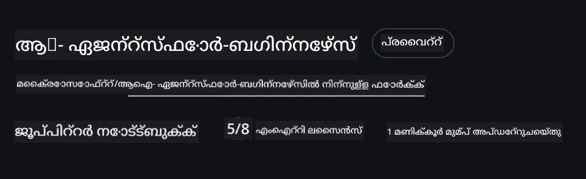
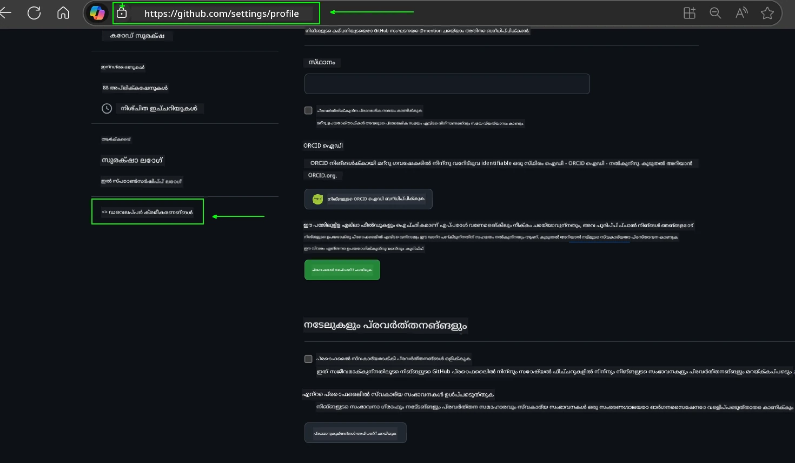
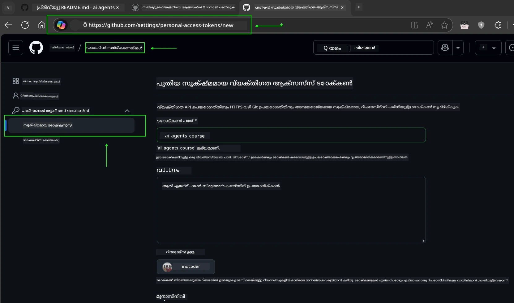
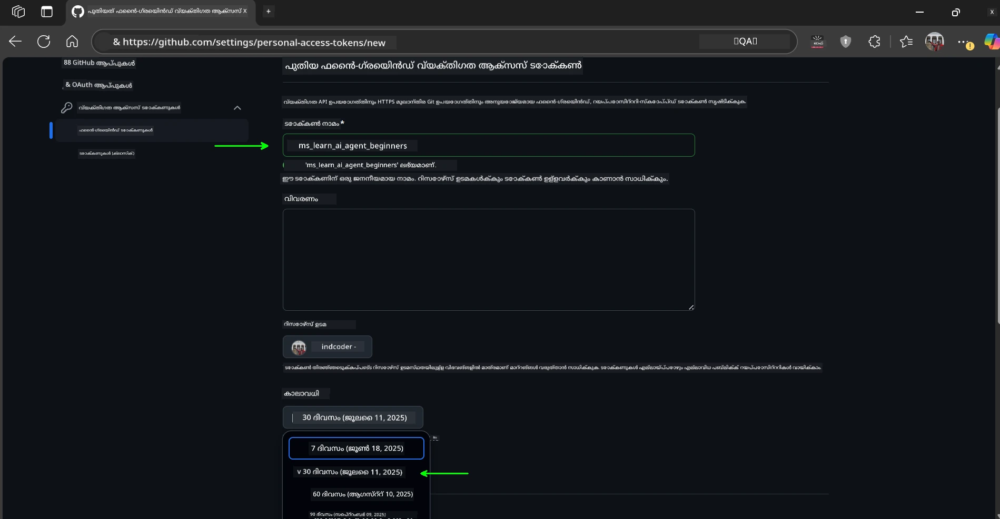
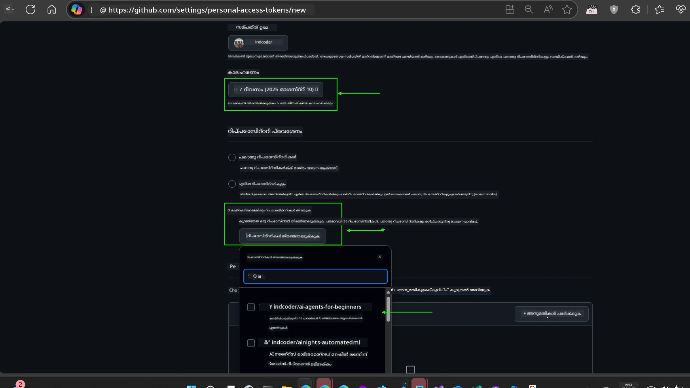
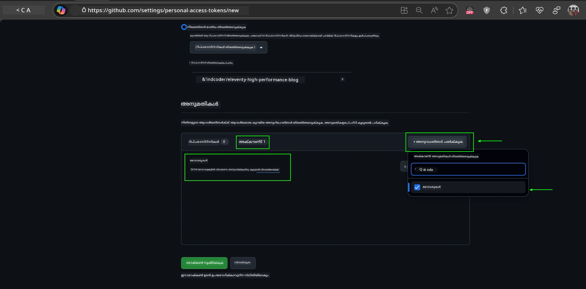
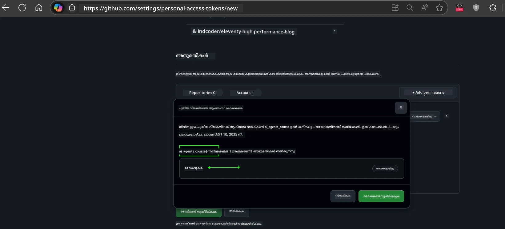
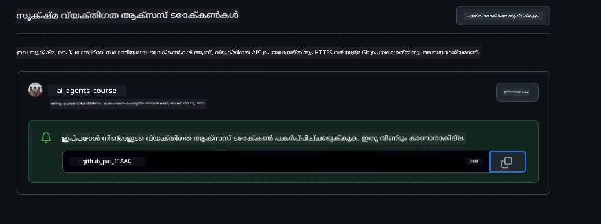
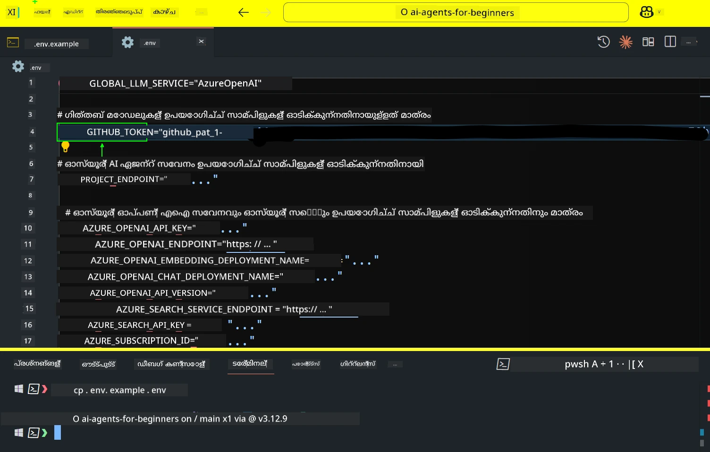
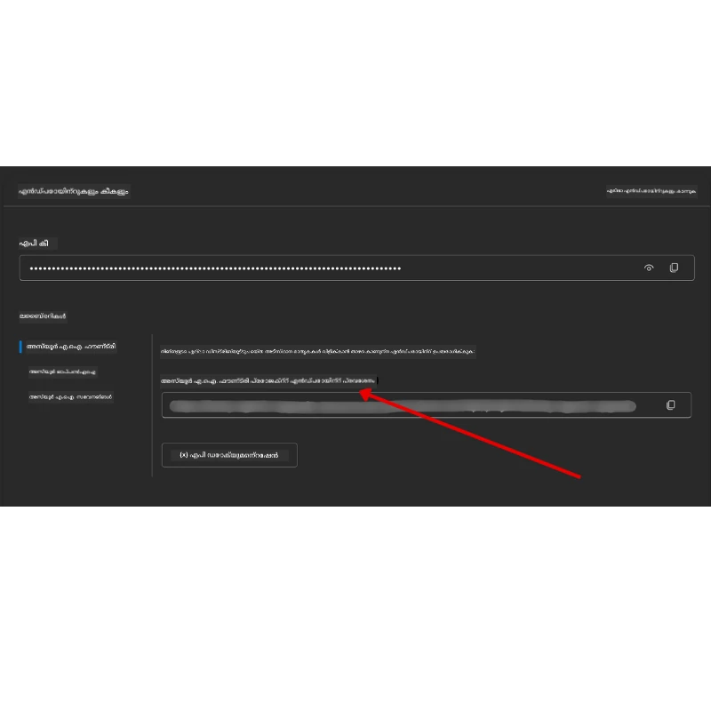

<!--
CO_OP_TRANSLATOR_METADATA:
{
  "original_hash": "63b1a8f6e840df15934935b728e569f0",
  "translation_date": "2025-12-03T17:25:30+00:00",
  "source_file": "00-course-setup/README.md",
  "language_code": "ml"
}
-->
# കോഴ്സ് സജ്ജീകരണം

## പരിചയം

ഈ പാഠത്തിൽ ഈ കോഴ്സിന്റെ കോഡ് സാമ്പിളുകൾ എങ്ങനെ പ്രവർത്തിപ്പിക്കാമെന്ന് വിശദീകരിക്കുന്നു.

## മറ്റ് പഠിതാക്കളുമായി ചേരുക, സഹായം നേടുക

നിങ്ങളുടെ റീപോ ക്ലോൺ ചെയ്യുന്നതിന് മുമ്പ്, [AI Agents For Beginners Discord ചാനലിൽ](https://aka.ms/ai-agents/discord) ചേരുക. ഇവിടെ സജ്ജീകരണവുമായി ബന്ധപ്പെട്ട സഹായം, കോഴ്സിനെക്കുറിച്ചുള്ള ചോദ്യങ്ങൾ, അല്ലെങ്കിൽ മറ്റ് പഠിതാക്കളുമായി ബന്ധപ്പെടാൻ കഴിയും.

## ഈ റീപോ ക്ലോൺ ചെയ്യുക അല്ലെങ്കിൽ ഫോർക്ക് ചെയ്യുക

ആരംഭിക്കാൻ, ദയവായി GitHub റീപോസിറ്ററി ക്ലോൺ ചെയ്യുക അല്ലെങ്കിൽ ഫോർക്ക് ചെയ്യുക. ഇതിലൂടെ നിങ്ങൾക്ക് കോഴ്സ് മെറ്റീരിയലിന്റെ നിങ്ങളുടെ സ്വന്തം പതിപ്പ് ലഭിക്കും, അതിൽ കോഡ് പ്രവർത്തിപ്പിക്കാനും, പരീക്ഷിക്കാനും, മാറ്റങ്ങൾ വരുത്താനും കഴിയും!

ഇത് ചെയ്യാൻ, <a href="https://github.com/microsoft/ai-agents-for-beginners/fork" target="_blank">റീപോ ഫോർക്ക് ചെയ്യാനുള്ള ലിങ്ക്</a> ക്ലിക്കുചെയ്യുക.

ഇപ്പോൾ നിങ്ങൾക്ക് ഈ കോഴ്സിന്റെ നിങ്ങളുടെ സ്വന്തം ഫോർക്ക് ചെയ്ത പതിപ്പ് താഴെ കാണുന്ന ലിങ്കിൽ ലഭ്യമാണ്:



### ഷാലോ ക്ലോൺ (വർക്ക്ഷോപ്പ് / കോഡ്സ്പേസുകൾക്കായി ശുപാർശ ചെയ്യുന്നു)

  >പൂർണ്ണ റീപോസിറ്ററി ഡൗൺലോഡ് ചെയ്യുമ്പോൾ (~3 GB) ഇത് വലിയതായിരിക്കും. നിങ്ങൾക്ക് വെർക്ക്ഷോപ്പ് അല്ലെങ്കിൽ ചില പാഠങ്ങളുടെ ഫോള്ഡറുകൾ മാത്രം ആവശ്യമാണെങ്കിൽ, ഷാലോ ക്ലോൺ (അല്ലെങ്കിൽ സ്പാർസ് ക്ലോൺ) ചരിത്രവും/അല്ലെങ്കിൽ ബ്ലോബുകളും ഒഴിവാക്കുന്നതിലൂടെ ഡൗൺലോഡ് കുറയ്ക്കാം.

#### ദ്രുത ഷാലോ ക്ലോൺ — കുറഞ്ഞ ചരിത്രം, എല്ലാ ഫയലുകളും

താഴെയുള്ള കമാൻഡുകളിൽ `<your-username>` നിങ്ങളുടെ ഫോർക്ക് URL (അല്ലെങ്കിൽ നിങ്ങൾക്ക് ഇഷ്ടമുള്ളതെങ്കിൽ അപ്സ്ട്രീം URL) ഉപയോഗിച്ച് മാറ്റുക.

അടുത്തകാലത്തെ കമ്മിറ്റ് ചരിത്രം മാത്രം ക്ലോൺ ചെയ്യാൻ:

```bash|powershell
git clone --depth 1 https://github.com/<your-username>/ai-agents-for-beginners.git
```

ഒരു പ്രത്യേക ബ്രാഞ്ച് ക്ലോൺ ചെയ്യാൻ:

```bash|powershell
git clone --depth 1 --branch <branch-name> https://github.com/<your-username>/ai-agents-for-beginners.git
```

#### ഭാഗിക (സ്പാർസ്) ക്ലോൺ — കുറഞ്ഞ ബ്ലോബുകൾ + തിരഞ്ഞെടുക്കപ്പെട്ട ഫോള്ഡറുകൾ മാത്രം

ഇത് ഭാഗിക ക്ലോൺ, സ്പാർസ്-ചെക്ക്ഔട്ട് ഉപയോഗിക്കുന്നു (Git 2.25+ ആവശ്യമാണ്, ഭാഗിക ക്ലോൺ പിന്തുണയുള്ള ആധുനിക Git ശുപാർശ ചെയ്യുന്നു):

```bash|powershell
git clone --depth 1 --filter=blob:none --sparse https://github.com/<your-username>/ai-agents-for-beginners.git
```

റീപോ ഫോള്ഡറിലേക്ക് പ്രവേശിക്കുക:

```bash|powershell
cd ai-agents-for-beginners
```

ശേഷം നിങ്ങൾക്ക് ആവശ്യമുള്ള ഫോള്ഡറുകൾ വ്യക്തമാക്കുക (ഉദാഹരണത്തിൽ രണ്ട് ഫോള്ഡറുകൾ കാണിക്കുന്നു):

```bash|powershell
git sparse-checkout set 00-course-setup 01-intro-to-ai-agents
```

ക്ലോൺ ചെയ്ത ശേഷം ഫയലുകൾ പരിശോധിച്ച്, നിങ്ങൾക്ക് ഫയലുകൾ മാത്രം ആവശ്യമാണെങ്കിൽ, സ്ഥലം ഒഴിവാക്കാൻ റീപോസിറ്ററി മെറ്റാഡാറ്റ ഡിലീറ്റ് ചെയ്യുക (💀അപ്രത്യക്ഷമാക്കൽ — നിങ്ങൾക്ക് എല്ലാ Git പ്രവർത്തനങ്ങളും നഷ്ടപ്പെടും: കമ്മിറ്റുകൾ, പുൾസ്, പുഷുകൾ, അല്ലെങ്കിൽ ചരിത്രം).

```bash
# zsh/bash
rm -rf .git
```

```powershell
# പവർഷെൽ
Remove-Item -Recurse -Force .git
```

#### GitHub Codespaces ഉപയോഗിച്ച് (പ്രാദേശിക വലിയ ഡൗൺലോഡുകൾ ഒഴിവാക്കാൻ ശുപാർശ ചെയ്യുന്നു)

- GitHub UI വഴി ഈ റീപോയ്ക്ക് പുതിയ Codespace സൃഷ്ടിക്കുക.  

- പുതുതായി സൃഷ്ടിച്ച കോഡ്സ്പേസിന്റെ ടെർമിനലിൽ, നിങ്ങൾക്ക് ആവശ്യമുള്ള പാഠ ഫോള്ഡറുകൾ മാത്രം Codespace വർക്ക്സ്പേസിലേക്ക് കൊണ്ടുവരാൻ മുകളിൽ നൽകിയ ഷാലോ/സ്പാർസ് ക്ലോൺ കമാൻഡുകളിൽ ഒന്നും പ്രവർത്തിപ്പിക്കുക.
- ഐച്ഛികം: Codespaces-ൽ ക്ലോൺ ചെയ്ത ശേഷം, അധിക സ്ഥലം വീണ്ടെടുക്കാൻ .git നീക്കം ചെയ്യുക (മുകളിൽ നൽകിയ നീക്കംചെയ്യൽ കമാൻഡുകൾ കാണുക).
- കുറിപ്പ്: റീപോ നേരിട്ട് Codespaces-ൽ തുറക്കാൻ നിങ്ങൾക്ക് ഇഷ്ടമാണെങ്കിൽ (അധിക ക്ലോൺ ഇല്ലാതെ), Codespaces ഡെവ്കണ്ടെയിനർ പരിസ്ഥിതി നിർമ്മിക്കുകയും നിങ്ങൾക്ക് ആവശ്യമുള്ളതിലധികം പ്രൊവിഷൻ ചെയ്യുകയും ചെയ്യും. പുതിയ Codespace-ൽ ഷാലോ കോപ്പി ക്ലോൺ ചെയ്യുന്നത് ഡിസ്‌ക് ഉപയോഗത്തിൽ കൂടുതൽ നിയന്ത്രണം നൽകുന്നു.

#### ടിപ്പുകൾ

- എഡിറ്റ്/കമ്മിറ്റ് ചെയ്യാൻ നിങ്ങൾ ആഗ്രഹിക്കുന്നുവെങ്കിൽ, ക്ലോൺ URL നിങ്ങളുടെ ഫോർക്കുമായി മാറ്റുക.
- നിങ്ങൾക്ക് പിന്നീട് കൂടുതൽ ചരിത്രം അല്ലെങ്കിൽ ഫയലുകൾ ആവശ്യമുണ്ടെങ്കിൽ, അവ ഫെച്ച് ചെയ്യുകയോ സ്പാർസ്-ചെക്ക്ഔട്ട് ക്രമീകരിച്ച് അധിക ഫോള്ഡറുകൾ ഉൾപ്പെടുത്തുകയോ ചെയ്യാം.

## കോഡ് പ്രവർത്തിപ്പിക്കൽ

ഈ കോഴ്സ് AI ഏജന്റുകൾ നിർമ്മിക്കാൻ പ്രായോഗിക പരിചയം നേടാൻ Jupyter Notebooks ഉപയോഗിക്കുന്നു.

കോഡ് സാമ്പിളുകൾ താഴെ പറയുന്നവ ഉപയോഗിക്കുന്നു:

**GitHub അക്കൗണ്ട് ആവശ്യമാണ് - സൗജന്യം**:

1) സെമാന്റിക് കർണൽ ഏജന്റ് ഫ്രെയിംവർക്ക് + GitHub മോഡൽ മാർക്കറ്റ്‌പ്ലേസ്. (semantic-kernel.ipynb) എന്ന് ലേബൽ ചെയ്തിരിക്കുന്നു.
2) AutoGen ഫ്രെയിംവർക്ക് + GitHub മോഡൽ മാർക്കറ്റ്‌പ്ലേസ്. (autogen.ipynb) എന്ന് ലേബൽ ചെയ്തിരിക്കുന്നു.

**Azure സബ്സ്ക്രിപ്ഷൻ ആവശ്യമാണ്**:

3) Azure AI Foundry + Azure AI ഏജന്റ് സർവീസ്. (azureaiagent.ipynb) എന്ന് ലേബൽ ചെയ്തിരിക്കുന്നു.

ഈ മൂന്ന് തരത്തിലുള്ള ഉദാഹരണങ്ങളും പരീക്ഷിക്കാൻ ഞങ്ങൾ നിങ്ങളെ പ്രോത്സാഹിപ്പിക്കുന്നു, ഏത് നിങ്ങളുടെ ആവശ്യങ്ങൾക്ക് ഏറ്റവും അനുയോജ്യമാണെന്ന് കണ്ടെത്താൻ.

നിങ്ങൾ തിരഞ്ഞെടുക്കുന്ന ഓപ്ഷൻ, താഴെ പറയുന്ന സജ്ജീകരണ ഘട്ടങ്ങൾ നിർണ്ണയിക്കും:

## ആവശ്യകതകൾ

- Python 3.12+
  - **NOTE**: Python3.12 ഇൻസ്റ്റാൾ ചെയ്തിട്ടില്ലെങ്കിൽ, അത് ഇൻസ്റ്റാൾ ചെയ്യുക. തുടർന്ന് python3.12 ഉപയോഗിച്ച് നിങ്ങളുടെ venv സൃഷ്ടിച്ച് requirements.txt ഫയലിൽ നിന്ന് ശരിയായ പതിപ്പുകൾ ഇൻസ്റ്റാൾ ചെയ്യുക.
  
    >ഉദാഹരണം

    Python venv ഡയറക്ടറി സൃഷ്ടിക്കുക:

    ```bash|powershell
    python -m venv venv
    ```

    തുടർന്ന് venv പരിസ്ഥിതി സജീവമാക്കുക:

    ```bash
    # zsh/bash
    source venv/bin/activate
    ```
  
    ```dos
    # Command Prompt for Windows
    venv\Scripts\activate
    ```

- .NET 10+: .NET ഉപയോഗിക്കുന്ന സാമ്പിൾ കോഡുകൾക്കായി, ദയവായി [.NET 10 SDK](https://dotnet.microsoft.com/download/dotnet/10.0) അല്ലെങ്കിൽ അതിനുശേഷമുള്ള പതിപ്പ് ഇൻസ്റ്റാൾ ചെയ്യുക. തുടർന്ന് ഇൻസ്റ്റാൾ ചെയ്ത .NET SDK പതിപ്പ് പരിശോധിക്കുക:

    ```bash|powershell
    dotnet --list-sdks
    ```

- GitHub അക്കൗണ്ട് - GitHub മോഡൽ മാർക്കറ്റ്‌പ്ലേസ് ആക്സസ് ചെയ്യാൻ
- Azure സബ്സ്ക്രിപ്ഷൻ - Azure AI Foundry ആക്സസ് ചെയ്യാൻ
- Azure AI Foundry അക്കൗണ്ട് - Azure AI ഏജന്റ് സർവീസ് ആക്സസ് ചെയ്യാൻ

ഈ റീപോസിറ്ററിയുടെ റൂട്ട് ഭാഗത്ത് Python പാക്കേജുകളുടെ ആവശ്യമായ പട്ടിക അടങ്ങിയ `requirements.txt` ഫയൽ ഉൾപ്പെടുത്തിയിട്ടുണ്ട്.

റീപോസിറ്ററിയുടെ റൂട്ട് ഭാഗത്ത് നിങ്ങളുടെ ടെർമിനലിൽ താഴെ പറയുന്ന കമാൻഡ് പ്രവർത്തിപ്പിച്ച് അവ ഇൻസ്റ്റാൾ ചെയ്യാം:

```bash|powershell
pip install -r requirements.txt
```

യാതൊരു പ്രശ്നങ്ങളും ഒഴിവാക്കാൻ Python വെർച്വൽ പരിസ്ഥിതി സൃഷ്ടിക്കാൻ ഞങ്ങൾ ശുപാർശ ചെയ്യുന്നു.

## VSCode സജ്ജീകരിക്കുക

VSCode-ൽ Pythonയുടെ ശരിയായ പതിപ്പ് ഉപയോഗിക്കുന്നുണ്ടെന്ന് ഉറപ്പാക്കുക.


## GitHub മോഡലുകൾ ഉപയോഗിക്കുന്ന സാമ്പിളുകൾക്കുള്ള സജ്ജീകരണം 

### ഘട്ടം 1: നിങ്ങളുടെ GitHub Personal Access Token (PAT) പുനഃപ്രാപിക്കുക

ഈ കോഴ്സ് GitHub മോഡൽ മാർക്കറ്റ്‌പ്ലേസ് ഉപയോഗിക്കുന്നു, ഇത് നിങ്ങൾക്ക് AI ഏജന്റുകൾ നിർമ്മിക്കാൻ ഉപയോഗിക്കുന്ന വലിയ ഭാഷാ മോഡലുകൾ (LLMs) സൗജന്യമായി നൽകുന്നു.

GitHub മോഡലുകൾ ഉപയോഗിക്കാൻ, നിങ്ങൾക്ക് ഒരു [GitHub Personal Access Token](https://docs.github.com/en/authentication/keeping-your-account-and-data-secure/managing-your-personal-access-tokens) സൃഷ്ടിക്കേണ്ടതുണ്ട്.

ഇത് നിങ്ങളുടെ GitHub അക്കൗണ്ടിലെ <a href="https://github.com/settings/personal-access-tokens" target="_blank">Personal Access Tokens settings</a> എന്നതിലേക്ക് പോയി ചെയ്യാം.

ടോക്കൺ സൃഷ്ടിക്കുമ്പോൾ [Principle of Least Privilege](https://docs.github.com/en/get-started/learning-to-code/storing-your-secrets-safely) പാലിക്കുക. ഇത് ടോക്കണിന് ഈ കോഴ്സിലെ കോഡ് സാമ്പിളുകൾ പ്രവർത്തിപ്പിക്കാൻ ആവശ്യമായ അനുമതികൾ മാത്രം നൽകണമെന്ന് അർത്ഥമാക്കുന്നു.

1. **Developer settings** എന്നതിലേക്ക് പോയി സ്ക്രീനിന്റെ ഇടത് ഭാഗത്ത് `Fine-grained tokens` ഓപ്ഷൻ തിരഞ്ഞെടുക്കുക.

   

   തുടർന്ന് `Generate new token` തിരഞ്ഞെടുക്കുക.

   

2. ടോക്കണിന്റെ ഉദ്ദേശ്യം പ്രതിഫലിപ്പിക്കുന്ന ഒരു വിവരണാത്മകമായ പേര് നൽകുക, ഇത് പിന്നീട് തിരിച്ചറിയാൻ എളുപ്പമാക്കും.

    🔐 ടോക്കൺ കാലാവധി ശുപാർശ

    ശുപാർശ ചെയ്യുന്ന കാലാവധി: 30 ദിവസം
    കൂടുതൽ സുരക്ഷിതമായ സമീപനത്തിനായി, 7 ദിവസങ്ങൾ പോലുള്ള ചെറിയ കാലയളവ് തിരഞ്ഞെടുക്കാം 🛡️
    ഇത് വ്യക്തിഗത ലക്ഷ്യം നിശ്ചയിച്ച്, പഠന താളം ഉയർന്നിരിക്കുമ്പോൾ കോഴ്സ് പൂർത്തിയാക്കാൻ സഹായിക്കും 🚀.

    

3. ടോക്കണിന്റെ പരിധി ഈ റീപോസിറ്ററിയുടെ നിങ്ങളുടെ ഫോർക്കിലേക്ക് പരിമിതപ്പെടുത്തുക.

    

4. ടോക്കണിന്റെ അനുമതികൾ പരിമിതപ്പെടുത്തുക: **Permissions** എന്നതിൽ **Account** ടാബ് ക്ലിക്കുചെയ്യുക, തുടർന്ന് "+ Add permissions" ബട്ടൺ ക്ലിക്കുചെയ്യുക. ഒരു ഡ്രോപ്പ്ഡൗൺ പ്രത്യക്ഷപ്പെടും. **Models** തിരയുക, ബോക്സ് അടയാളപ്പെടുത്തുക.

    

5. ടോക്കൺ സൃഷ്ടിക്കുന്നതിന് മുമ്പ് ആവശ്യമായ അനുമതികൾ പരിശോധിക്കുക. 

6. ടോക്കൺ സൃഷ്ടിക്കുന്നതിന് മുമ്പ്, ടോക്കൺ ഒരു സുരക്ഷിത സ്ഥലത്ത് (പാസ്‌വേഡ് മാനേജർ വാൾട്ട് പോലുള്ള) സൂക്ഷിക്കാൻ തയ്യാറാണെന്ന് ഉറപ്പാക്കുക, കാരണം ഇത് സൃഷ്ടിച്ചതിന് ശേഷം വീണ്ടും കാണിക്കില്ല. 

നിങ്ങൾ ഇപ്പോൾ സൃഷ്ടിച്ച പുതിയ ടോക്കൺ പകർത്തുക. ഇത് ഈ കോഴ്സിൽ ഉൾപ്പെടുത്തിയ `.env` ഫയലിൽ ചേർക്കുക.

### ഘട്ടം 2: നിങ്ങളുടെ `.env` ഫയൽ സൃഷ്ടിക്കുക

നിങ്ങളുടെ ടെർമിനലിൽ താഴെ പറയുന്ന കമാൻഡ് പ്രവർത്തിപ്പിച്ച് `.env` ഫയൽ സൃഷ്ടിക്കുക.

```bash
# zsh/bash
cp .env.example .env
```

```powershell
# പവർഷെൽ
Copy-Item .env.example .env
```

ഇത് ഉദാഹരണ ഫയൽ പകർത്തുകയും `.env` നിങ്ങളുടെ ഡയറക്ടറിയിൽ സൃഷ്ടിക്കുകയും ചെയ്യും, അവിടെ പരിസ്ഥിതി വേരിയബിളുകൾക്കുള്ള മൂല്യങ്ങൾ പൂരിപ്പിക്കാം.

നിങ്ങളുടെ ടോക്കൺ പകർത്തിയ ശേഷം, നിങ്ങളുടെ ഇഷ്ടപ്പെട്ട ടെക്സ്റ്റ് എഡിറ്ററിൽ `.env` ഫയൽ തുറന്ന്, `GITHUB_TOKEN` ഫീൽഡിൽ നിങ്ങളുടെ ടോക്കൺ പേസ്റ്റ് ചെയ്യുക.



ഇപ്പോൾ നിങ്ങൾക്ക് ഈ കോഴ്സിന്റെ കോഡ് സാമ്പിളുകൾ പ്രവർത്തിപ്പിക്കാൻ കഴിയും.

## Azure AI Foundry, Azure AI ഏജന്റ് സർവീസ് ഉപയോഗിക്കുന്ന സാമ്പിളുകൾക്കുള്ള സജ്ജീകരണം

### ഘട്ടം 1: നിങ്ങളുടെ Azure പ്രോജക്റ്റ് എൻഡ്പോയിന്റ് പുനഃപ്രാപിക്കുക

Azure AI Foundry-ൽ ഹബ്, പ്രോജക്റ്റ് സൃഷ്ടിക്കുന്നതിനുള്ള ഘട്ടങ്ങൾ ഇവിടെ കാണുക: [Hub resources overview](https://learn.microsoft.com/azure/ai-foundry/concepts/ai-resources)

നിങ്ങളുടെ പ്രോജക്റ്റ് സൃഷ്ടിച്ച ശേഷം, നിങ്ങളുടെ പ്രോജക്റ്റിന്റെ കണക്ഷൻ സ്ട്രിംഗ് പുനഃപ്രാപിക്കേണ്ടതുണ്ട്.

ഇത് Azure AI Foundry പോർട്ടലിലെ നിങ്ങളുടെ പ്രോജക്റ്റിന്റെ **Overview** പേജിലേക്ക് പോയി ചെയ്യാം.



### ഘട്ടം 2: നിങ്ങളുടെ `.env` ഫയൽ സൃഷ്ടിക്കുക

നിങ്ങളുടെ ടെർമിനലിൽ താഴെ പറയുന്ന കമാൻഡ് പ്രവർത്തിപ്പിച്ച് `.env` ഫയൽ സൃഷ്ടിക്കുക.

```bash
# zsh/bash
cp .env.example .env
```

```powershell
# പവർഷെൽ
Copy-Item .env.example .env
```

ഇത് ഉദാഹരണ ഫയൽ പകർത്തുകയും `.env` നിങ്ങളുടെ ഡയറക്ടറിയിൽ സൃഷ്ടിക്കുകയും ചെയ്യും, അവിടെ പരിസ്ഥിതി വേരിയബിളുകൾക്കുള്ള മൂല്യങ്ങൾ പൂരിപ്പിക്കാം.

നിങ്ങളുടെ ടോക്കൺ പകർത്തിയ ശേഷം, നിങ്ങളുടെ ഇഷ്ടപ്പെട്ട ടെക്സ്റ്റ് എഡിറ്ററിൽ `.env` ഫയൽ തുറന്ന്, `PROJECT_ENDPOINT` ഫീൽഡിൽ നിങ്ങളുടെ ടോക്കൺ പേസ്റ്റ് ചെയ്യുക.

### ഘട്ടം 3: Azure-ൽ സൈൻ ഇൻ ചെയ്യുക

സുരക്ഷാ മികച്ച രീതിയായി, Microsoft Entra ID ഉപയോഗിച്ച് Azure OpenAI-യിലേക്ക് [കീലെസ് ഓതന്റിക്കേഷൻ](https://learn.microsoft.com/azure/developer/ai/keyless-connections?tabs=csharp%2Cazure-cli?WT.mc_id=academic-105485-koreyst) ഉപയോഗിക്കാം.

അടുത്തതായി, ഒരു ടെർമിനൽ തുറന്ന് `az login --use-device-code` പ്രവർത്തിപ്പിച്ച് നിങ്ങളുടെ Azure അക്കൗണ്ടിൽ സൈൻ ഇൻ ചെയ്യുക.

ലോഗിൻ ചെയ്ത ശേഷം, ടെർമിനലിൽ നിങ്ങളുടെ സബ്സ്ക്രിപ്ഷൻ തിരഞ്ഞെടുക്കുക.

## അധിക പരിസ്ഥിതി വേരിയബിളുകൾ - Azure Search, Azure OpenAI 

Agentic RAG പാഠം - പാഠം 5 - Azure Search, Azure OpenAI ഉപയോഗിക്കുന്ന സാമ്പിളുകൾ ഉൾക്കൊള്ളുന്നു.

ഈ സാമ്പിളുകൾ പ്രവർത്തിപ്പിക്കാൻ, നിങ്ങളുടെ `.env` ഫയലിൽ താഴെ പറയുന്ന പരിസ്ഥിതി വേരിയബിളുകൾ ചേർക്കേണ്ടതുണ്ട്:

### Overview പേജ് (പ്രോജക്റ്റ്)

- `AZURE_SUBSCRIPTION_ID` - നിങ്ങളുടെ പ്രോജക്റ്റിന്റെ **Overview** പേജിലെ **Project details** പരിശോധിക്കുക.

- `AZURE_AI_PROJECT_NAME` - നിങ്ങളുടെ പ്രോജക്റ്റിന്റെ **Overview** പേജിന്റെ മുകളിൽ നോക്കുക.

- `AZURE_OPENAI_SERVICE` - **Overview** പേജിലെ **Included capabilities** ടാബിൽ **Azure OpenAI Service** കണ്ടെത്തുക.

### മാനേജ്മെന്റ് സെന്റർ

- `AZURE_OPENAI_RESOURCE_GROUP` - **Management Center**-ലെ **Overview** പേജിലെ **Project properties**-ൽ പോകുക.

- `GLOBAL_LLM_SERVICE` - **Connected resources**-ൽ **Azure AI Services** കണക്ഷൻ പേര് കണ്ടെത്തുക. പട്ടികയിലില്ലെങ്കിൽ, നിങ്ങളുടെ റിസോഴ്സ് ഗ്രൂപ്പിൽ **Azure പോർട്ടൽ** പരിശോധിക്കുക.

### മോഡലുകൾ + എൻഡ്പോയിന്റുകൾ പേജ്

- `AZURE_OPENAI_EMBEDDING_DEPLOYMENT_NAME` - നിങ്ങളുടെ എംബെഡിംഗ് മോഡൽ (ഉദാ: `text-embedding-ada-002`) തിരഞ്ഞെടുക്കുക, മോഡൽ വിശദാംശങ്ങളിൽ നിന്ന് **Deployment name** ശ്രദ്ധിക്കുക.

- `AZURE_OPENAI_CHAT_DEPLOYMENT_NAME` - നിങ്ങളുടെ ചാറ്റ് മോഡൽ (ഉദാ: `gpt-4o-mini`) തിരഞ്ഞെടുക്കുക, മോഡൽ വിശദാംശങ്ങളിൽ നിന്ന് **Deployment name** ശ്രദ്ധിക്കുക.

### Azure പോർട്ടൽ

- `AZURE_OPENAI_ENDPOINT` - **Azure AI services** കണ്ടെത്തുക, അതിൽ ക്ലിക്കുചെയ്യുക, തുടർന്ന് **Resource Management**, **Keys and Endpoint**-ൽ പോകുക, "Azure OpenAI endpoints" എന്നതിൽ **Language APIs** കോപ്പി ചെയ്യുക.

- `AZURE_OPENAI_API_KEY` - അതേ സ്ക്രീനിൽ നിന്ന് KEY 1 അല്ലെങ്കിൽ KEY 2 കോപ്പി ചെയ്യുക.

- `AZURE_SEARCH_SERVICE_ENDPOINT` - നിങ്ങളുടെ **Azure AI Search** റിസോഴ്സ് കണ്ടെത്തുക, അതിൽ ക്ലിക്കുചെയ്യുക, **Overview** കാണുക.

- `AZURE_SEARCH_API_KEY` - തുടർന്ന് **Settings**-ൽ **Keys**-ൽ പോകുക, പ്രൈമറി അല്ലെങ്കിൽ സെക്കൻഡറി അഡ്മിൻ കീ കോപ്പി ചെയ്യുക.

### പുറം വെബ്പേജ്

- `AZURE_OPENAI_API_VERSION` - [API version lifecycle](https://learn.microsoft.com/azure/ai-services/openai/api-version-deprecation#latest-ga-api-release) പേജിൽ **Latest GA API release** പരിശോധിക്കുക.

### കീലെസ് ഓതന്റിക്കേഷൻ സജ്ജീകരിക്കുക

നിങ്ങളുടെ ക്രെഡൻഷ്യലുകൾ ഹാർഡ്‌കോഡ് ചെയ്യുന്നതിന് പകരം, Azure OpenAI-യുമായി കീലെസ് കണക്ഷൻ ഉപയോഗിക്കാം. അതിനായി, `DefaultAzureCredential` ഇമ്പോർട്ട് ചെയ്യുകയും പിന്നീട് `DefaultAzureCredential` ഫംഗ്ഷൻ വിളിച്ച് ക്രെഡൻഷ്യൽ നേടുകയും ചെയ്യും.

```python
# പൈതൺ
from azure.identity import DefaultAzureCredential, InteractiveBrowserCredential
```

## എവിടെയെങ്കിലും കുടുങ്ങിയോ?
ഈ സെറ്റപ്പ് പ്രവർത്തിപ്പിക്കുന്നതിൽ നിങ്ങൾക്ക് എന്തെങ്കിലും പ്രശ്നങ്ങൾ ഉണ്ടെങ്കിൽ, ഞങ്ങളുടെ <a href="https://discord.gg/kzRShWzttr" target="_blank">Azure AI Community Discord</a> ൽ ചേരുക അല്ലെങ്കിൽ <a href="https://github.com/microsoft/ai-agents-for-beginners/issues?WT.mc_id=academic-105485-koreyst" target="_blank">ഒരു പ്രശ്നം സൃഷ്ടിക്കുക</a>.

## അടുത്ത പാഠം

ഈ കോഴ്‌സിന്റെ കോഡ് പ്രവർത്തിപ്പിക്കാൻ നിങ്ങൾ ഇപ്പോൾ തയ്യാറാണ്. AI ഏജന്റുകളുടെ ലോകത്തെ കുറിച്ച് കൂടുതൽ പഠിക്കാൻ സന്തോഷം!

[AI ഏജന്റുകളും ഏജന്റ് ഉപയോഗ കേസങ്ങളും പരിചയപ്പെടുത്തൽ](../01-intro-to-ai-agents/README.md)

---

<!-- CO-OP TRANSLATOR DISCLAIMER START -->
**അസത്യവാദം**:  
ഈ രേഖ AI വിവർത്തന സേവനമായ [Co-op Translator](https://github.com/Azure/co-op-translator) ഉപയോഗിച്ച് വിവർത്തനം ചെയ്തതാണ്. കൃത്യതയ്ക്കായി ഞങ്ങൾ ശ്രമിക്കുന്നുവെങ്കിലും, ഓട്ടോമേറ്റഡ് വിവർത്തനങ്ങളിൽ പിശകുകൾ അല്ലെങ്കിൽ തെറ്റായ വിവരങ്ങൾ ഉണ്ടാകാൻ സാധ്യതയുണ്ട്. അതിന്റെ മാതൃഭാഷയിലുള്ള മൗലികരേഖയാണ് വിശ്വസനീയമായ ഉറവിടമായി കണക്കാക്കേണ്ടത്. നിർണായകമായ വിവരങ്ങൾക്ക്, പ്രൊഫഷണൽ മനുഷ്യ വിവർത്തനം ശുപാർശ ചെയ്യുന്നു. ഈ വിവർത്തനം ഉപയോഗിക്കുന്നതിൽ നിന്നുണ്ടാകുന്ന തെറ്റിദ്ധാരണകൾക്കോ തെറ്റായ വ്യാഖ്യാനങ്ങൾക്കോ ഞങ്ങൾ ഉത്തരവാദികളല്ല.
<!-- CO-OP TRANSLATOR DISCLAIMER END -->