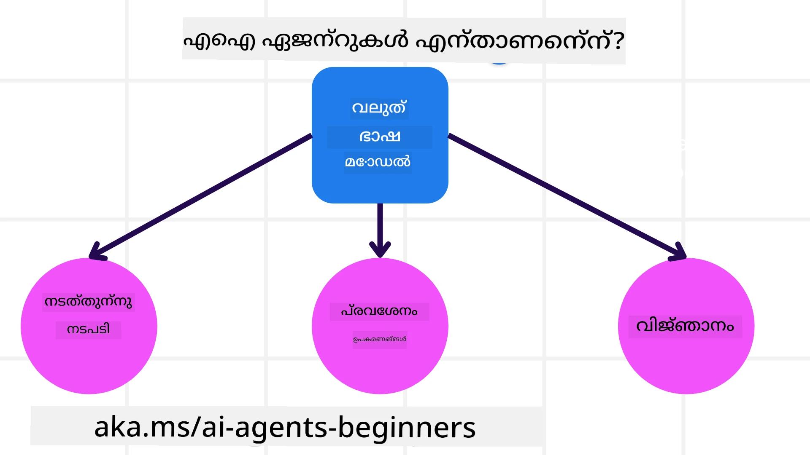
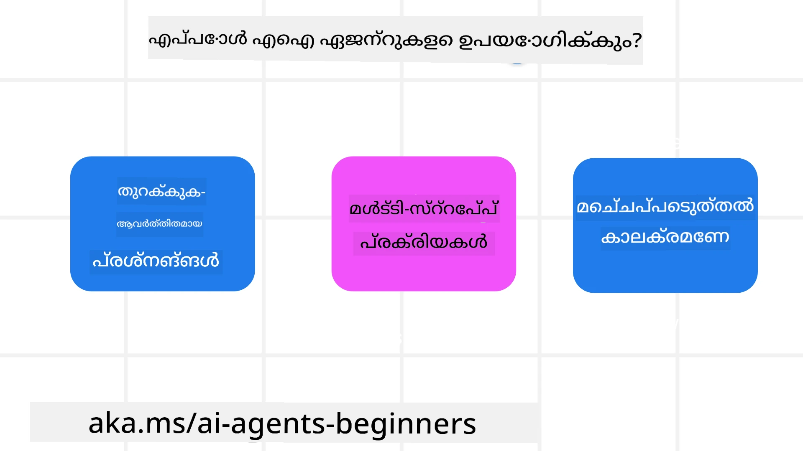

<!--
CO_OP_TRANSLATOR_METADATA:
{
  "original_hash": "cdd28bc00816d2773bb2b5968d782abc",
  "translation_date": "2025-12-03T16:35:42+00:00",
  "source_file": "01-intro-to-ai-agents/README.md",
  "language_code": "ml"
}
-->

> _(ഈ പാഠത്തിന്റെ വീഡിയോ കാണാൻ മുകളിൽ ചിത്രത്തിൽ ക്ലിക്ക് ചെയ്യുക)_

# AI ഏജന്റുകൾക്കും അവയുടെ ഉപയോഗത്തിനും പരിചയം

"AI Agents for Beginners" കോഴ്സിലേക്ക് സ്വാഗതം! AI ഏജന്റുകൾ നിർമ്മിക്കാൻ അടിസ്ഥാനപരമായ അറിവും പ്രായോഗിക ഉദാഹരണങ്ങളും ഈ കോഴ്സ് നൽകുന്നു.

<a href="https://discord.gg/kzRShWzttr" target="_blank">Azure AI Discord Community</a>യിൽ ചേരുക, മറ്റ് പഠിതാക്കളെയും AI ഏജന്റ് നിർമ്മാതാക്കളെയും കാണുക, ഈ കോഴ്സിനെക്കുറിച്ചുള്ള നിങ്ങളുടെ ചോദ്യങ്ങൾ ചോദിക്കുക.

ഈ കോഴ്സ് ആരംഭിക്കാൻ, AI ഏജന്റുകൾ എന്താണെന്ന്, നമുക്ക് നിർമ്മിക്കുന്ന ആപ്ലിക്കേഷനുകളിലും പ്രവാഹങ്ങളിലും അവയെ എങ്ങനെ ഉപയോഗിക്കാമെന്ന് നന്നായി മനസ്സിലാക്കുന്നതിലൂടെ ആരംഭിക്കുന്നു.

## പരിചയം

ഈ പാഠത്തിൽ ഉൾപ്പെടുന്നവ:

- AI ഏജന്റുകൾ എന്താണ്? വ്യത്യസ്ത ഏജന്റ് തരം എന്തൊക്കെയാണ്?
- AI ഏജന്റുകൾക്ക് ഏറ്റവും അനുയോജ്യമായ ഉപയോഗങ്ങൾ എന്തൊക്കെയാണ്? അവ എങ്ങനെ നമ്മെ സഹായിക്കും?
- ഏജന്റിക് സൊല്യൂഷനുകൾ രൂപകൽപ്പന ചെയ്യുമ്പോൾ ചില അടിസ്ഥാന ഘടകങ്ങൾ എന്തൊക്കെയാണ്?

## പഠന ലക്ഷ്യങ്ങൾ
ഈ പാഠം പൂർത്തിയാക്കിയ ശേഷം, നിങ്ങൾക്ക്:

- AI ഏജന്റ് ആശയങ്ങൾ മനസ്സിലാക്കാനും മറ്റ് AI സൊല്യൂഷനുകളിൽ നിന്ന് അവ എങ്ങനെ വ്യത്യസ്തമാണെന്ന് മനസ്സിലാക്കാനും കഴിയും.
- AI ഏജന്റുകൾ ഏറ്റവും ഫലപ്രദമായി പ്രയോഗിക്കാനും കഴിയും.
- ഉപയോക്താക്കൾക്കും ഉപഭോക്താക്കൾക്കും ഉത്പാദകമായി ഏജന്റിക് സൊല്യൂഷനുകൾ രൂപകൽപ്പന ചെയ്യാനും കഴിയും.

## AI ഏജന്റുകൾ നിർവചിക്കുകയും അവയുടെ തരം തിരിച്ചറിയുകയും ചെയ്യുക

### AI ഏജന്റുകൾ എന്താണ്?

AI ഏജന്റുകൾ **വ്യവസ്ഥിതികൾ** ആണ്, **വിപുലമായ ഭാഷാ മോഡലുകൾ (LLMs)** **ഉപകരണങ്ങൾ** ഉപയോഗിച്ച് **പ്രവർത്തനങ്ങൾ** **നടത്താൻ** കഴിവ് നൽകുന്നു, LLMs-ന് **ജ്ഞാനം** നൽകുന്നു.

ഈ നിർവചനം ചെറിയ ഭാഗങ്ങളായി വിഭജിക്കാം:

- **വ്യവസ്ഥിതികൾ** - ഏജന്റുകളെ ഒരു ഘടകമായി മാത്രം കാണാതെ, പല ഘടകങ്ങളുള്ള ഒരു സിസ്റ്റമായി കാണുന്നത് പ്രധാനമാണ്. AI ഏജന്റിന്റെ അടിസ്ഥാന ഘടകങ്ങൾ:
  - **പരിസ്ഥിതി** - AI ഏജന്റ് പ്രവർത്തിക്കുന്ന നിർവചിതമായ സ്ഥലം. ഉദാഹരണത്തിന്, ഒരു യാത്രാ ബുക്കിംഗ് AI ഏജന്റ് ഉണ്ടെങ്കിൽ, AI ഏജന്റ് പ്രവർത്തനങ്ങൾ പൂർത്തിയാക്കാൻ ഉപയോഗിക്കുന്ന യാത്രാ ബുക്കിംഗ് സിസ്റ്റം പരിസ്ഥിതിയായി കാണാം.
  - **സെൻസറുകൾ** - പരിസ്ഥിതിയിൽ വിവരങ്ങൾ ഉണ്ട്, അവ പ്രതികരണങ്ങൾ നൽകുന്നു. AI ഏജന്റുകൾ സെൻസറുകൾ ഉപയോഗിച്ച് പരിസ്ഥിതിയുടെ നിലവിലെ അവസ്ഥയെക്കുറിച്ചുള്ള വിവരങ്ങൾ ശേഖരിക്കുകയും വ്യാഖ്യാനിക്കുകയും ചെയ്യുന്നു. യാത്രാ ബുക്കിംഗ് ഏജന്റിന്റെ ഉദാഹരണത്തിൽ, ഹോട്ടൽ ലഭ്യതയോ ഫ്ലൈറ്റ് വിലയോ പോലുള്ള വിവരങ്ങൾ യാത്രാ ബുക്കിംഗ് സിസ്റ്റം നൽകുന്നു.
  - **ആക്ചുവേറ്ററുകൾ** - AI ഏജന്റ് പരിസ്ഥിതിയുടെ നിലവിലെ അവസ്ഥ സ്വീകരിച്ച ശേഷം, നിലവിലെ പ്രവർത്തനത്തിനായി പരിസ്ഥിതിയെ മാറ്റാൻ എന്ത് പ്രവർത്തനം നടത്തണമെന്ന് തീരുമാനിക്കുന്നു. യാത്രാ ബുക്കിംഗ് ഏജന്റിന്, ഉപയോക്താവിന് ലഭ്യമായ ഒരു മുറി ബുക്ക് ചെയ്യുക.

**വിപുലമായ ഭാഷാ മോഡലുകൾ** - LLMs സൃഷ്ടിക്കുന്നതിന് മുമ്പ് ഏജന്റുകളുടെ ആശയം നിലവിലുണ്ടായിരുന്നു. LLMs ഉപയോഗിച്ച് AI ഏജന്റുകൾ നിർമ്മിക്കുന്നതിന്റെ പ്രയോജനം, മനുഷ്യ ഭാഷയും ഡാറ്റയും വ്യാഖ്യാനിക്കുന്ന അവയുടെ കഴിവാണ്. ഈ കഴിവ് LLMs-ന് പരിസ്ഥിതിവിവരങ്ങൾ വ്യാഖ്യാനിക്കുകയും പരിസ്ഥിതിയെ മാറ്റാൻ ഒരു പദ്ധതി നിർവചിക്കുകയും ചെയ്യാൻ സഹായിക്കുന്നു.

**പ്രവർത്തനങ്ങൾ നടത്തുക** - AI ഏജന്റ് സിസ്റ്റങ്ങൾക്കു പുറത്തുള്ള LLMs, ഉപയോക്താവിന്റെ പ്രോംപ്റ്റ് അടിസ്ഥാനമാക്കി ഉള്ളടക്കമോ വിവരമോ സൃഷ്ടിക്കുന്ന സാഹചര്യങ്ങളിൽ മാത്രം പരിമിതമാണ്. AI ഏജന്റ് സിസ്റ്റങ്ങൾക്കുള്ളിൽ, LLMs ഉപയോക്താവിന്റെ അഭ്യർത്ഥന വ്യാഖ്യാനിച്ച് പരിസ്ഥിതിയിൽ ലഭ്യമായ ഉപകരണങ്ങൾ ഉപയോഗിച്ച് പ്രവർത്തനങ്ങൾ പൂർത്തിയാക്കാൻ കഴിയും.

**ഉപകരണങ്ങളിലേക്ക് പ്രവേശനം** - LLM-ന് ലഭ്യമായ ഉപകരണങ്ങൾ 1) പ്രവർത്തിക്കുന്ന പരിസ്ഥിതിയും 2) AI ഏജന്റിന്റെ ഡെവലപ്പറും നിർവചിക്കുന്നു. നമ്മുടെ യാത്രാ ഏജന്റിന്റെ ഉദാഹരണത്തിൽ, ഏജന്റിന്റെ ഉപകരണങ്ങൾ ബുക്കിംഗ് സിസ്റ്റത്തിൽ ലഭ്യമായ പ്രവർത്തനങ്ങൾക്കു പരിധിയുള്ളതാണ്, അല്ലെങ്കിൽ ഡെവലപ്പർ ഏജന്റിന്റെ ഉപകരണപ്രവേശനം ഫ്ലൈറ്റുകൾക്ക് പരിമിതപ്പെടുത്താം.

**മെമ്മറി+ജ്ഞാനം** - സംഭാഷണത്തിന്റെ ചട്ടക്കൂടിൽ മെമ്മറി താൽക്കാലികമായിരിക്കാം. ദീർഘകാലത്തേക്ക്, പരിസ്ഥിതിയിൽ നിന്ന് ലഭിക്കുന്ന വിവരങ്ങൾക്കു പുറമേ, AI ഏജന്റുകൾ മറ്റ് സിസ്റ്റങ്ങൾ, സേവനങ്ങൾ, ഉപകരണങ്ങൾ, മറ്റേജന്റുകൾ എന്നിവയിൽ നിന്ന് ജ്ഞാനം തിരയാനും കഴിയും. യാത്രാ ഏജന്റിന്റെ ഉദാഹരണത്തിൽ, ഉപഭോക്തൃ ഡാറ്റാബേസിൽ സ്ഥിതിചെയ്യുന്ന ഉപയോക്താവിന്റെ യാത്രാ മുൻഗണനകളെക്കുറിച്ചുള്ള വിവരങ്ങൾ ഈ ജ്ഞാനമായിരിക്കാം.

### വ്യത്യസ്ത ഏജന്റ് തരം

ഇപ്പോൾ AI ഏജന്റുകളുടെ ഒരു പൊതുവായ നിർവചനം നമുക്ക് ലഭ്യമായതിനാൽ, ചില പ്രത്യേക ഏജന്റ് തരം എന്തൊക്കെയാണെന്ന്, അവയെ ഒരു യാത്രാ ബുക്കിംഗ് AI ഏജന്റിൽ എങ്ങനെ പ്രയോഗിക്കാമെന്ന് നോക്കാം.

| **ഏജന്റ് തരം**                | **വിവരണം**                                                                                                                       | **ഉദാഹരണം**                                                                                                                                                                                                                   |
| ----------------------------- | ------------------------------------------------------------------------------------------------------------------------------------- | ----------------------------------------------------------------------------------------------------------------------------------------------------------------------------------------------------------------------------- |
| **സിംപിള്‍ റിഫ്ലക്സ് ഏജന്റുകൾ**      | മുൻകൂട്ടി നിർവചിച്ച നിയമങ്ങൾ അടിസ്ഥാനമാക്കി തൽക്ഷണ പ്രവർത്തനങ്ങൾ നടത്തുക.                                                                                  | യാത്രാ ഏജന്റ് ഇമെയിലിന്റെ ചട്ടക്കൂട് വ്യാഖ്യാനിച്ച് യാത്രാ പരാതികൾ ഉപഭോക്തൃ സേവനത്തിലേക്ക് ഫോർവേഡ് ചെയ്യുന്നു.                                                                                                                          |
| **മോഡൽ-ബേസ്ഡ് റിഫ്ലക്സ് ഏജന്റുകൾ** | ലോകത്തിന്റെ ഒരു മോഡലിന്റെ അടിസ്ഥാനത്തിൽ പ്രവർത്തനങ്ങൾ നടത്തുക, ആ മോഡലിൽ മാറ്റങ്ങൾ വരുത്തുക.                                                              | യാത്രാ ഏജന്റ് ചരിത്ര വില ഡാറ്റയിലേക്ക് പ്രവേശനം ലഭിക്കുന്നതിന് അടിസ്ഥാനമാക്കി വില മാറ്റങ്ങൾ ഉള്ള റൂട്ടുകൾ മുൻഗണന നൽകുന്നു.                                                                                                             |
| **ഗോൾ-ബേസ്ഡ് ഏജന്റുകൾ**         | ലക്ഷ്യങ്ങൾ കൈവരിക്കാൻ ആവശ്യമായ പ്രവർത്തനങ്ങൾ നിർവചിച്ച്, ലക്ഷ്യത്തെ വ്യാഖ്യാനിച്ച്, പ്രത്യേക ലക്ഷ്യങ്ങൾ കൈവരിക്കാൻ പദ്ധതികൾ സൃഷ്ടിക്കുക.                                  | യാത്രാ ഏജന്റ് നിലവിലെ സ്ഥലം മുതൽ ലക്ഷ്യസ്ഥാനം വരെ യാത്രാ ക്രമീകരണങ്ങൾ (കാർ, പൊതു ഗതാഗതം, ഫ്ലൈറ്റുകൾ) നിർവചിച്ച് യാത്ര ബുക്ക് ചെയ്യുന്നു.                                                                                |
| **യൂട്ടിലിറ്റി-ബേസ്ഡ് ഏജന്റുകൾ**      | മുൻഗണനകൾ പരിഗണിച്ച്, ലക്ഷ്യങ്ങൾ കൈവരിക്കാൻ സംഖ്യാത്മകമായി തുലനങ്ങൾ നിർവചിക്കുക.                                               | യാത്രാ ഏജന്റ് യാത്ര ബുക്ക് ചെയ്യുമ്പോൾ സൗകര്യവും ചെലവും തുലനം ചെയ്ത് യൂട്ടിലിറ്റി പരമാവധി ചെയ്യുന്നു.                                                                                                                                          |
| **ലേണിംഗ് ഏജന്റുകൾ**           | പ്രതികരണങ്ങൾക്കു പ്രതികരിച്ച്, പ്രവർത്തനങ്ങൾ ക്രമീകരിച്ച്, സമയത്തിനൊപ്പം മെച്ചപ്പെടുത്തുക.                                                        | യാത്രാ ഏജന്റ് ഉപഭോക്തൃ പ്രതികരണങ്ങൾ ഉപയോഗിച്ച് ഭാവി ബുക്കിംഗുകളിൽ മാറ്റങ്ങൾ വരുത്തി മെച്ചപ്പെടുത്തുന്നു.                                                                                                               |
| **ഹിയറാർക്കിക്കൽ ഏജന്റുകൾ**       | ടിയർ ചെയ്ത സിസ്റ്റത്തിൽ നിരവധി ഏജന്റുകൾ, ഉയർന്ന-തല ഏജന്റുകൾ താഴ്ന്ന-തല ഏജന്റുകൾ പൂർത്തിയാക്കാൻ ഉപ-പ്രവർത്തനങ്ങൾ വിഭജിക്കുന്നു. | യാത്രാ ഏജന്റ് ഒരു യാത്ര റദ്ദാക്കുമ്പോൾ, പ്രവർത്തനം ഉപ-പ്രവർത്തനങ്ങളായി (ഉദാഹരണത്തിന്, പ്രത്യേക ബുക്കിംഗുകൾ റദ്ദാക്കൽ) വിഭജിച്ച്, താഴ്ന്ന-തല ഏജന്റുകൾ അവ പൂർത്തിയാക്കി, ഉയർന്ന-തല ഏജന്റിന് റിപ്പോർട്ട് ചെയ്യുന്നു.                                     |
| **മൾട്ടി-ഏജന്റ് സിസ്റ്റങ്ങൾ (MAS)** | ഏജന്റുകൾ സ്വതന്ത്രമായി പ്രവർത്തനങ്ങൾ പൂർത്തിയാക്കുന്നു, either സഹകരിച്ച് അല്ലെങ്കിൽ മത്സരിച്ച്.                                                           | സഹകരണം: നിരവധി ഏജന്റുകൾ ഹോട്ടലുകൾ, ഫ്ലൈറ്റുകൾ, വിനോദങ്ങൾ പോലുള്ള പ്രത്യേക യാത്രാ സേവനങ്ങൾ ബുക്ക് ചെയ്യുന്നു. മത്സരം: നിരവധി ഏജന്റുകൾ പങ്കിടുന്ന ഹോട്ടൽ ബുക്കിംഗ് കലണ്ടർ കൈകാര്യം ചെയ്ത് ഉപഭോക്താക്കളെ ഹോട്ടലിൽ ബുക്ക് ചെയ്യുന്നു. |

## AI ഏജന്റുകൾ എപ്പോൾ ഉപയോഗിക്കാം

മുൻവശം, യാത്രാ ഏജന്റിന്റെ ഉപയോഗകേസുകൾ വ്യത്യസ്ത യാത്രാ ബുക്കിംഗ് സാഹചര്യങ്ങളിൽ എങ്ങനെ ഉപയോഗിക്കാമെന്ന് വിശദീകരിക്കാൻ ഉപയോഗിച്ചു. ഈ ആപ്ലിക്കേഷൻ കോഴ്സത്തിൽ തുടർന്നും ഉപയോഗിക്കും.

AI ഏജന്റുകൾ ഏറ്റവും അനുയോജ്യമായ ഉപയോഗകേസുകൾ എന്തൊക്കെയാണെന്ന് നോക്കാം:

- **തുറന്ന-അവസാന പ്രശ്നങ്ങൾ** - LLM-ന് ഒരു പ്രവാഹത്തിൽ ഹാർഡ്‌കോഡ് ചെയ്യാൻ കഴിയാത്തതിനാൽ ഒരു പ്രവർത്തനം പൂർത്തിയാക്കാൻ ആവശ്യമായ ഘട്ടങ്ങൾ നിർവചിക്കാൻ അനുവദിക്കുന്നു.
- **മൾട്ടി-സ്റ്റെപ്പ് പ്രോസസുകൾ** - AI ഏജന്റിന് ഉപകരണങ്ങൾ അല്ലെങ്കിൽ വിവരങ്ങൾ പല തവണ ഉപയോഗിച്ച്, സിംഗിൾ ഷോട്ട് റിട്രീവലിന് പകരം, ഒരു പ്രവർത്തനത്തിന്റെ സങ്കീർണ്ണതയുടെ ഒരു തലവശം ആവശ്യമാണ്.  
- **സമയത്തിനൊപ്പം മെച്ചപ്പെടുത്തൽ** - ഏജന്റ് പരിസ്ഥിതിയിൽ നിന്ന് അല്ലെങ്കിൽ ഉപയോക്താക്കളിൽ നിന്ന് പ്രതികരണം സ്വീകരിച്ച്, മെച്ചപ്പെട്ട യൂട്ടിലിറ്റി നൽകാൻ സമയത്തിനൊപ്പം മെച്ചപ്പെടുത്താൻ കഴിയുന്ന പ്രവർത്തനങ്ങൾ.

AI ഏജന്റുകൾ ഉപയോഗിക്കുന്നതിന്റെ കൂടുതൽ പരിഗണനകൾ Building Trustworthy AI Agents പാഠത്തിൽ ഉൾപ്പെടുന്നു.

## ഏജന്റിക് സൊല്യൂഷനുകളുടെ അടിസ്ഥാനങ്ങൾ

### ഏജന്റ് വികസനം

AI ഏജന്റ് സിസ്റ്റം രൂപകൽപ്പന ചെയ്യുന്നതിലെ ആദ്യ ഘട്ടം ഉപകരണങ്ങൾ, പ്രവർത്തനങ്ങൾ, പെരുമാറ്റങ്ങൾ നിർവചിക്കുന്നതാണ്. ഈ കോഴ്സിൽ, **Azure AI Agent Service** ഉപയോഗിച്ച് നമ്മുടെ ഏജന്റുകൾ നിർവചിക്കുന്നതിൽ ശ്രദ്ധ കേന്ദ്രീകരിക്കുന്നു. ഇത് താഴെ പറയുന്ന സവിശേഷതകൾ നൽകുന്നു:

- OpenAI, Mistral, Llama പോലുള്ള ഓപ്പൺ മോഡലുകളുടെ തിരഞ്ഞെടുപ്പ്
- Tripadvisor പോലുള്ള പ്രൊവൈഡർമാർ വഴി ലൈസൻസുചെയ്ത ഡാറ്റയുടെ ഉപയോഗം
- സ്റ്റാൻഡേർഡൈസ്ഡ് OpenAPI 3.0 ഉപകരണങ്ങളുടെ ഉപയോഗം

### ഏജന്റിക് പാറ്റേണുകൾ

LLMs-നൊപ്പം സംവാദം പ്രോംപ്റ്റുകൾ വഴി നടക്കുന്നു. AI ഏജന്റുകളുടെ അർദ്ധ-സ്വയംഭരണ സ്വഭാവം കണക്കിലെടുത്ത്, പരിസ്ഥിതിയിൽ മാറ്റം വന്ന ശേഷം LLM-നെ മാനുവലായി വീണ്ടും പ്രോംപ്റ്റ് ചെയ്യുന്നത് എല്ലായ്പ്പോഴും സാധ്യമല്ല അല്ലെങ്കിൽ ആവശ്യവുമല്ല. **Agentic Patterns** ഉപയോഗിച്ച്, പരിസ്ഥിതിയിൽ പല ഘട്ടങ്ങളിലായി LLM-നെ കൂടുതൽ സ്കെയിലബിള്‍ രീതിയിൽ പ്രോംപ്റ്റ് ചെയ്യാൻ കഴിയും.

ഈ കോഴ്സ് നിലവിലെ ചില ജനപ്രിയ ഏജന്റിക് പാറ്റേണുകളായി വിഭജിച്ചിരിക്കുന്നു.

### ഏജന്റിക് ഫ്രെയിംവർക്കുകൾ

Agentic Frameworks ഡെവലപ്പർമാർക്ക് ഏജന്റിക് പാറ്റേണുകൾ കോഡിലൂടെ നടപ്പിലാക്കാൻ അനുവദിക്കുന്നു. ഈ ഫ്രെയിംവർക്കുകൾ ടെംപ്ലേറ്റുകൾ, പ്ലഗിനുകൾ, ഉപകരണങ്ങൾ എന്നിവ നൽകുന്നു, AI ഏജന്റുകളുടെ മികച്ച സഹകരണത്തിനായി. ഈ പ്രയോജനങ്ങൾ AI ഏജന്റ് സിസ്റ്റങ്ങളുടെ മികച്ച നിരീക്ഷണത്തിനും പ്രശ്നപരിഹാരത്തിനും കഴിവുകൾ നൽകുന്നു.

ഈ കോഴ്സിൽ, ഗവേഷണ-ചാലനമായ AutoGen ഫ്രെയിംവർക്കും പ്രൊഡക്ഷൻ-റെഡി Agent ഫ്രെയിംവർക്കും Semantic Kernel-ൽ നിന്ന് പരിശോധിക്കും.

## സാമ്പിൾ കോഡുകൾ

- Python: [Agent Framework](./code_samples/01-python-agent-framework.ipynb)
- .NET: [Agent Framework](./code_samples/01-dotnet-agent-framework.md)

## AI ഏജന്റുകളെക്കുറിച്ച് കൂടുതൽ ചോദ്യങ്ങളുണ്ടോ?

[Azure AI Foundry Discord](https://aka.ms/ai-agents/discord)യിൽ ചേരുക, മറ്റ് പഠിതാക്കളുമായി കൂടിക്കാഴ്ച നടത്തുക, ഓഫീസ് മണിക്കൂറുകളിൽ പങ്കെടുക്കുക, നിങ്ങളുടെ AI ഏജന്റുകളെക്കുറിച്ചുള്ള ചോദ്യങ്ങൾക്ക് ഉത്തരം ലഭിക്കുക.

## മുൻ പാഠം

[Course Setup](../00-course-setup/README.md)

## അടുത്ത പാഠം

[Exploring Agentic Frameworks](../02-explore-agentic-frameworks/README.md)

---

<!-- CO-OP TRANSLATOR DISCLAIMER START -->
**അസത്യവാദം**:  
ഈ രേഖ AI വിവർത്തന സേവനമായ [Co-op Translator](https://github.com/Azure/co-op-translator) ഉപയോഗിച്ച് വിവർത്തനം ചെയ്തതാണ്. കൃത്യതയ്ക്കായി ഞങ്ങൾ ശ്രമിക്കുന്നുവെങ്കിലും, ഓട്ടോമേറ്റഡ് വിവർത്തനങ്ങളിൽ പിശകുകൾ അല്ലെങ്കിൽ തെറ്റായ വിവരങ്ങൾ ഉണ്ടാകാൻ സാധ്യതയുണ്ട്. അതിന്റെ സ്വാഭാവിക ഭാഷയിലുള്ള മൗലിക രേഖ പ്രാമാണികമായ ഉറവിടമായി പരിഗണിക്കണം. നിർണായകമായ വിവരങ്ങൾക്ക്, പ്രൊഫഷണൽ മനുഷ്യ വിവർത്തനം ശുപാർശ ചെയ്യുന്നു. ഈ വിവർത്തനം ഉപയോഗിക്കുന്നതിൽ നിന്നുണ്ടാകുന്ന തെറ്റിദ്ധാരണകൾക്കോ തെറ്റായ വ്യാഖ്യാനങ്ങൾക്കോ ഞങ്ങൾ ഉത്തരവാദികളല്ല.
<!-- CO-OP TRANSLATOR DISCLAIMER END -->