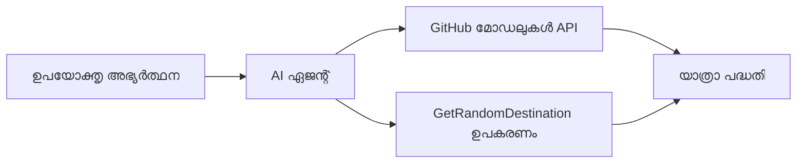

<!--
CO_OP_TRANSLATOR_METADATA:
{
  "original_hash": "5f351412e934f0833c8c821a0a60efaf",
  "translation_date": "2025-12-03T16:37:38+00:00",
  "source_file": "01-intro-to-ai-agents/code_samples/01-dotnet-agent-framework.md",
  "language_code": "ml"
}
-->
# 🌍 Microsoft Agent Framework (.NET) ഉപയോഗിച്ച് AI ട്രാവൽ ഏജന്റ്

## 📋 സീനാരിയോ അവലോകനം

ഈ ഉദാഹരണം Microsoft Agent Framework for .NET ഉപയോഗിച്ച് ബുദ്ധിമാനായ യാത്രാ പദ്ധതിയിടൽ ഏജന്റ് നിർമ്മിക്കുന്നതെങ്ങനെ എന്നത് കാണിക്കുന്നു. ഏജന്റ് ലോകമെമ്പാടുമുള്ള യാദൃച്ഛികമായ ഗമ്യസ്ഥലങ്ങൾക്കായി വ്യക്തിഗത ദിനയാത്രാ പദ്ധതികൾ സ്വയം സൃഷ്ടിക്കാൻ കഴിയും.

### പ്രധാന കഴിവുകൾ:

- 🎲 **യാദൃച്ഛികമായ ഗമ്യസ്ഥല തിരഞ്ഞെടുപ്പ്**: അവധിക്കാല സ്ഥലങ്ങൾ തിരഞ്ഞെടുക്കാൻ കസ്റ്റം ടൂൾ ഉപയോഗിക്കുന്നു
- 🗺️ **ബുദ്ധിമാനായ യാത്രാ പദ്ധതിയിടൽ**: വിശദമായ ദിനംപ്രതി യാത്രാ പദ്ധതികൾ സൃഷ്ടിക്കുന്നു
- 🔄 **തത്സമയ സ്ട്രീമിംഗ്**: തൽക്ഷണവും സ്ട്രീമിംഗ് പ്രതികരണങ്ങളും പിന്തുണയ്ക്കുന്നു
- 🛠️ **കസ്റ്റം ടൂൾ ഇന്റഗ്രേഷൻ**: ഏജന്റിന്റെ കഴിവുകൾ വികസിപ്പിക്കുന്നതെങ്ങനെ എന്നത് കാണിക്കുന്നു

## 🔧 സാങ്കേതിക ആർക്കിടെക്ചർ

### പ്രധാന സാങ്കേതികവിദ്യകൾ

- **Microsoft Agent Framework**: .NET ഉപയോഗിച്ച് AI ഏജന്റ് വികസനത്തിനുള്ള ഏറ്റവും പുതിയ നടപ്പാക്കൽ
- **GitHub Models Integration**: GitHub-ന്റെ AI മോഡൽ ഇൻഫറൻസ് സേവനം ഉപയോഗിക്കുന്നു
- **OpenAI API Compatibility**: കസ്റ്റം എൻഡ്പോയിന്റുകളുള്ള OpenAI ക്ലയന്റ് ലൈബ്രറികൾ ഉപയോഗിക്കുന്നു
- **സുരക്ഷിത കോൺഫിഗറേഷൻ**: പരിസ്ഥിതി അടിസ്ഥാനമാക്കിയുള്ള API കീ മാനേജ്മെന്റ്

### പ്രധാന ഘടകങ്ങൾ

1. **AIAgent**: സംഭാഷണ പ്രവാഹം കൈകാര്യം ചെയ്യുന്ന പ്രധാന ഏജന്റ് ഓർക്കസ്ട്രേറ്റർ
2. **Custom Tools**: ഏജന്റിന് ലഭ്യമായ `GetRandomDestination()` ഫംഗ്ഷൻ
3. **Chat Client**: GitHub Models പിന്തുണയുള്ള സംഭാഷണ ഇന്റർഫേസ്
4. **Streaming Support**: തത്സമയ പ്രതികരണ സൃഷ്ടി കഴിവുകൾ

### ഇന്റഗ്രേഷൻ പാറ്റേൺ


## 🚀 ആരംഭിക്കുക

### ആവശ്യമായവ

- [.NET 10 SDK](https://dotnet.microsoft.com/download/dotnet/10.0) അല്ലെങ്കിൽ അതിനുമുകളിൽ
- [GitHub Models API ആക്സസ് ടോക്കൺ](https://docs.github.com/github-models/github-models-at-scale/using-your-own-api-keys-in-github-models)

### ആവശ്യമായ പരിസ്ഥിതി വേരിയബിളുകൾ

```bash
# zsh/bash
export GH_TOKEN=<your_github_token>
export GH_ENDPOINT=https://models.github.ai/inference
export GH_MODEL_ID=openai/gpt-5-mini
```

```powershell
# പവർഷെൽ
$env:GH_TOKEN = "<your_github_token>"
$env:GH_ENDPOINT = "https://models.github.ai/inference"
$env:GH_MODEL_ID = "openai/gpt-5-mini"
```

### സാമ്പിൾ കോഡ്

കോഡ് ഉദാഹരണം പ്രവർത്തിപ്പിക്കാൻ,

```bash
# zsh/bash
chmod +x ./01-dotnet-agent-framework.cs
./01-dotnet-agent-framework.cs
```

അല്ലെങ്കിൽ dotnet CLI ഉപയോഗിച്ച്:

```bash
dotnet run ./01-dotnet-agent-framework.cs
```

സമ്പൂർണ്ണ കോഡിനായി [`01-dotnet-agent-framework.cs`](../../../../01-intro-to-ai-agents/code_samples/01-dotnet-agent-framework.cs) കാണുക.

```csharp
#!/usr/bin/dotnet run

#:package Microsoft.Extensions.AI@9.*
#:package Microsoft.Agents.AI.OpenAI@1.*-*

using System.ClientModel;
using System.ComponentModel;

using Microsoft.Agents.AI;
using Microsoft.Extensions.AI;

using OpenAI;

// Tool Function: Random Destination Generator
// This static method will be available to the agent as a callable tool
// The [Description] attribute helps the AI understand when to use this function
// This demonstrates how to create custom tools for AI agents
[Description("Provides a random vacation destination.")]
static string GetRandomDestination()
{
    // List of popular vacation destinations around the world
    // The agent will randomly select from these options
    var destinations = new List<string>
    {
        "Paris, France",
        "Tokyo, Japan",
        "New York City, USA",
        "Sydney, Australia",
        "Rome, Italy",
        "Barcelona, Spain",
        "Cape Town, South Africa",
        "Rio de Janeiro, Brazil",
        "Bangkok, Thailand",
        "Vancouver, Canada"
    };

    // Generate random index and return selected destination
    // Uses System.Random for simple random selection
    var random = new Random();
    int index = random.Next(destinations.Count);
    return destinations[index];
}

// Extract configuration from environment variables
// Retrieve the GitHub Models API endpoint, defaults to https://models.github.ai/inference if not specified
// Retrieve the model ID, defaults to openai/gpt-5-mini if not specified
// Retrieve the GitHub token for authentication, throws exception if not specified
var github_endpoint = Environment.GetEnvironmentVariable("GH_ENDPOINT") ?? "https://models.github.ai/inference";
var github_model_id = Environment.GetEnvironmentVariable("GH_MODEL_ID") ?? "openai/gpt-5-mini";
var github_token = Environment.GetEnvironmentVariable("GH_TOKEN") ?? throw new InvalidOperationException("GH_TOKEN is not set.");

// Configure OpenAI Client Options
// Create configuration options to point to GitHub Models endpoint
// This redirects OpenAI client calls to GitHub's model inference service
var openAIOptions = new OpenAIClientOptions()
{
    Endpoint = new Uri(github_endpoint)
};

// Initialize OpenAI Client with GitHub Models Configuration
// Create OpenAI client using GitHub token for authentication
// Configure it to use GitHub Models endpoint instead of OpenAI directly
var openAIClient = new OpenAIClient(new ApiKeyCredential(github_token), openAIOptions);

// Create AI Agent with Travel Planning Capabilities
// Initialize OpenAI client, get chat client for specified model, and create AI agent
// Configure agent with travel planning instructions and random destination tool
// The agent can now plan trips using the GetRandomDestination function
AIAgent agent = openAIClient
    .GetChatClient(github_model_id)
    .CreateAIAgent(
        instructions: "You are a helpful AI Agent that can help plan vacations for customers at random destinations",
        tools: [AIFunctionFactory.Create(GetRandomDestination)]
    );

// Execute Agent: Plan a Day Trip
// Run the agent with streaming enabled for real-time response display
// Shows the agent's thinking and response as it generates the content
// Provides better user experience with immediate feedback
await foreach (var update in agent.RunStreamingAsync("Plan me a day trip"))
{
    await Task.Delay(10);
    Console.Write(update);
}
```

## 🎓 പ്രധാന പഠനങ്ങൾ

1. **ഏജന്റ് ആർക്കിടെക്ചർ**: Microsoft Agent Framework .NET-ൽ AI ഏജന്റുകൾ നിർമ്മിക്കാൻ ശുചിത്വവും ടൈപ്പ്-സേഫ് സമീപനവും നൽകുന്നു
2. **ടൂൾ ഇന്റഗ്രേഷൻ**: `[Description]` ആട്രിബ്യൂട്ട് ഉപയോഗിച്ച് അലങ്കരിച്ച ഫംഗ്ഷനുകൾ ഏജന്റിന് ലഭ്യമായ ടൂളുകളായി മാറുന്നു
3. **കോൺഫിഗറേഷൻ മാനേജ്മെന്റ്**: പരിസ്ഥിതി വേരിയബിളുകളും സുരക്ഷിത ക്രെഡൻഷ്യൽ കൈകാര്യം ചെയ്യലും .NET മികച്ച രീതികൾ പിന്തുടരുന്നു
4. **OpenAI അനുയോജ്യത**: GitHub Models ഇന്റഗ്രേഷൻ OpenAI- അനുയോജ്യമായ APIകളിലൂടെ സുതാര്യമായി പ്രവർത്തിക്കുന്നു

## 🔗 അധിക വിഭവങ്ങൾ

- [Microsoft Agent Framework ഡോക്യുമെന്റേഷൻ](https://learn.microsoft.com/agent-framework)
- [GitHub Models Marketplace](https://github.com/marketplace?type=models)
- [Microsoft.Extensions.AI](https://learn.microsoft.com/dotnet/ai/microsoft-extensions-ai)
- [.NET Single File Apps](https://devblogs.microsoft.com/dotnet/announcing-dotnet-run-app)

---

<!-- CO-OP TRANSLATOR DISCLAIMER START -->
**അസത്യവാദം**:  
ഈ രേഖ AI വിവർത്തന സേവനമായ [Co-op Translator](https://github.com/Azure/co-op-translator) ഉപയോഗിച്ച് വിവർത്തനം ചെയ്തതാണ്. ഞങ്ങൾ കൃത്യതയ്ക്കായി ശ്രമിക്കുന്നുവെങ്കിലും, ഓട്ടോമേറ്റഡ് വിവർത്തനങ്ങളിൽ പിശകുകൾ അല്ലെങ്കിൽ തെറ്റായ വിവരങ്ങൾ ഉണ്ടാകാമെന്ന് ദയവായി ശ്രദ്ധിക്കുക. അതിന്റെ സ്വാഭാവിക ഭാഷയിലുള്ള മൗലിക രേഖ പ്രാമാണികമായ ഉറവിടമായി പരിഗണിക്കണം. നിർണായകമായ വിവരങ്ങൾക്ക്, പ്രൊഫഷണൽ മനുഷ്യ വിവർത്തനം ശുപാർശ ചെയ്യുന്നു. ഈ വിവർത്തനം ഉപയോഗിക്കുന്നതിൽ നിന്നുണ്ടാകുന്ന തെറ്റിദ്ധാരണകൾക്കോ തെറ്റായ വ്യാഖ്യാനങ്ങൾക്കോ ഞങ്ങൾ ഉത്തരവാദികളല്ല.
<!-- CO-OP TRANSLATOR DISCLAIMER END -->