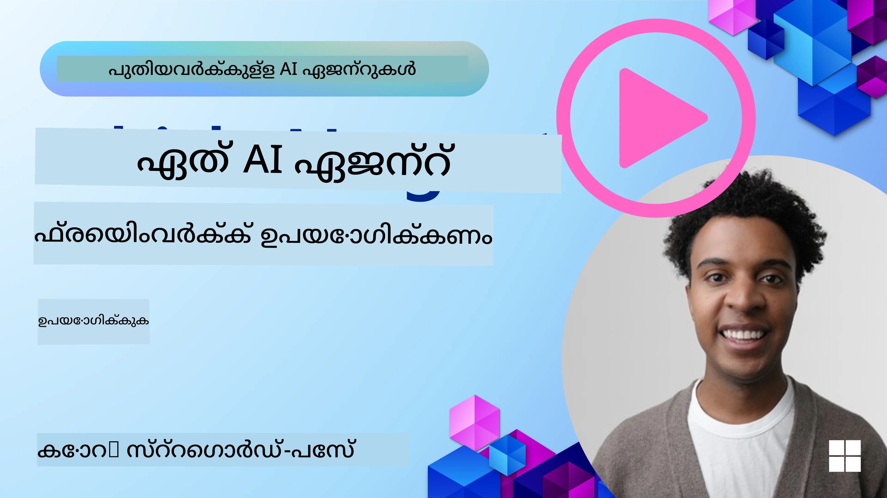

<!--
CO_OP_TRANSLATOR_METADATA:
{
  "original_hash": "7120197753abacc827b64ac2d5d6966f",
  "translation_date": "2025-12-03T17:03:30+00:00",
  "source_file": "02-explore-agentic-frameworks/README.md",
  "language_code": "ml"
}
-->
[](https://youtu.be/ODwF-EZo_O8?si=1xoy_B9RNQfrYdF7)

> _(ഈ പാഠത്തിന്റെ വീഡിയോ കാണാൻ മുകളിൽ ചിത്രത്തിൽ ക്ലിക്ക് ചെയ്യുക)_

# AI ഏജന്റ് ഫ്രെയിംവർക്കുകൾ അന്വേഷിക്കുക

AI ഏജന്റ് ഫ്രെയിംവർക്കുകൾ AI ഏജന്റുകൾ സൃഷ്ടിക്കുന്നതും വിന്യസിക്കുന്നതും നിയന്ത്രിക്കുന്നതും ലളിതമാക്കാൻ രൂപകൽപ്പന ചെയ്ത സോഫ്റ്റ്വെയർ പ്ലാറ്റ്ഫോമുകളാണ്. ഈ ഫ്രെയിംവർക്കുകൾ ഡെവലപ്പർമാർക്ക് പ്രീ-ബിൽറ്റ് ഘടകങ്ങൾ, അബ്സ്ട്രാക്ഷനുകൾ, ഉപകരണങ്ങൾ എന്നിവ നൽകുന്നു, അതിലൂടെ സങ്കീർണ്ണമായ AI സിസ്റ്റങ്ങൾ വികസിപ്പിക്കുന്ന പ്രക്രിയ ലളിതമാക്കുന്നു.

AI ഏജന്റ് വികസനത്തിലെ സാധാരണ വെല്ലുവിളികൾക്ക് സ്റ്റാൻഡേർഡ് സമീപനങ്ങൾ നൽകുന്നതിലൂടെ, ഈ ഫ്രെയിംവർക്കുകൾ ഡെവലപ്പർമാർക്ക് അവരുടെ ആപ്ലിക്കേഷനുകളുടെ പ്രത്യേക ഘടകങ്ങളിൽ ശ്രദ്ധ കേന്ദ്രീകരിക്കാൻ സഹായിക്കുന്നു. AI സിസ്റ്റങ്ങൾ നിർമ്മിക്കുന്നതിൽ സ്കേലബിലിറ്റി, ആക്സസിബിലിറ്റി, കാര്യക്ഷമത എന്നിവ മെച്ചപ്പെടുത്തുന്നു.

## പരിചയം

ഈ പാഠത്തിൽ ഉൾപ്പെടുന്നവ:

- AI ഏജന്റ് ഫ്രെയിംവർക്കുകൾ എന്താണ്, ഡെവലപ്പർമാർക്ക് എന്ത് സാധ്യമാക്കുന്നു?
- ടീമുകൾ എങ്ങനെ ഇവ ഉപയോഗിച്ച് ഏജന്റിന്റെ കഴിവുകൾ വേഗത്തിൽ പ്രോട്ടോടൈപ്പ് ചെയ്യുകയും ആവർത്തിക്കുകയും മെച്ചപ്പെടുത്തുകയും ചെയ്യാം?
- Microsoft <a href="https://aka.ms/ai-agents/autogen" target="_blank">AutoGen</a>, <a href="https://aka.ms/ai-agents-beginners/semantic-kernel" target="_blank">Semantic Kernel</a>, <a href="https://aka.ms/ai-agents-beginners/ai-agent-service" target="_blank">Azure AI Agent Service</a> എന്നിവ സൃഷ്ടിച്ച ഫ്രെയിംവർക്കുകൾക്കും ഉപകരണങ്ങൾക്കും ഉള്ള വ്യത്യാസങ്ങൾ എന്തൊക്കെയാണ്?
- നിലവിലുള്ള Azure ഇക്കോസിസ്റ്റം ഉപകരണങ്ങൾ നേരിട്ട് സംയോജിപ്പിക്കാമോ, അല്ലെങ്കിൽ സ്വതന്ത്രമായ പരിഹാരങ്ങൾ ആവശ്യമാണോ?
- Azure AI Agents സേവനം എന്താണ്, ഇത് എങ്ങനെ സഹായിക്കുന്നു?

## പഠന ലക്ഷ്യങ്ങൾ

ഈ പാഠത്തിന്റെ ലക്ഷ്യങ്ങൾ നിങ്ങൾക്ക് മനസ്സിലാക്കാൻ സഹായിക്കുക:

- AI ഏജന്റ് ഫ്രെയിംവർക്കുകളുടെ AI വികസനത്തിലെ പങ്ക്.
- ബുദ്ധിമാനായ ഏജന്റുകൾ നിർമ്മിക്കാൻ AI ഏജന്റ് ഫ്രെയിംവർക്കുകൾ എങ്ങനെ പ്രയോജനപ്പെടുത്താം.
- AI ഏജന്റ് ഫ്രെയിംവർക്കുകൾ സാധ്യമാക്കുന്ന പ്രധാന കഴിവുകൾ.
- AutoGen, Semantic Kernel, Azure AI Agent Service എന്നിവയുടെ വ്യത്യാസങ്ങൾ.

## AI ഏജന്റ് ഫ്രെയിംവർക്കുകൾ എന്താണ്, ഡെവലപ്പർമാർക്ക് എന്ത് സാധ്യമാക്കുന്നു?

പരമ്പരാഗത AI ഫ്രെയിംവർക്കുകൾ നിങ്ങളുടെ ആപ്പുകളിൽ AI സംയോജിപ്പിക്കാൻ സഹായിക്കുകയും ഈ ആപ്പുകൾ താഴെ പറയുന്ന രീതിയിൽ മെച്ചപ്പെടുത്തുകയും ചെയ്യുന്നു:

- **വ്യക്തിഗതമാക്കൽ**: AI ഉപയോക്തൃ പെരുമാറ്റവും ഇഷ്ടങ്ങളും വിശകലനം ചെയ്ത് വ്യക്തിഗത ശുപാർശകൾ, ഉള്ളടക്കം, അനുഭവങ്ങൾ എന്നിവ നൽകുന്നു.  
ഉദാഹരണം: Netflix പോലുള്ള സ്ട്രീമിംഗ് സേവനങ്ങൾ AI ഉപയോഗിച്ച് കാണുന്ന ചരിത്രത്തിന്റെ അടിസ്ഥാനത്തിൽ സിനിമകളും ഷോകളും ശുപാർശ ചെയ്യുന്നു, ഉപയോക്തൃ ഏർപ്പെടലും സംതൃപ്തിയും വർദ്ധിപ്പിക്കുന്നു.

- **ഓട്ടോമേഷൻയും കാര്യക്ഷമതയും**: AI ആവർത്തിക്കുന്ന പ്രവർത്തനങ്ങൾ ഓട്ടോമേറ്റ് ചെയ്യുകയും, പ്രവാഹങ്ങൾ ലളിതമാക്കുകയും, പ്രവർത്തന കാര്യക്ഷമത മെച്ചപ്പെടുത്തുകയും ചെയ്യുന്നു.  
ഉദാഹരണം: കസ്റ്റമർ സർവീസ് ആപ്പുകൾ സാധാരണ ചോദ്യം ചെയ്യലുകൾ കൈകാര്യം ചെയ്യാൻ AI-പവർ ചെയ്ത ചാറ്റ്ബോട്ടുകൾ ഉപയോഗിക്കുന്നു, പ്രതികരണ സമയങ്ങൾ കുറയ്ക്കുകയും കൂടുതൽ സങ്കീർണ്ണമായ പ്രശ്നങ്ങൾക്ക് മനുഷ്യ ഏജന്റുകൾക്ക് സമയം നൽകുകയും ചെയ്യുന്നു.

- **ഉപയോക്തൃ അനുഭവം മെച്ചപ്പെടുത്തുക**: AI വോയ്സ് റെക്കഗ്നിഷൻ, നാചുറൽ ലാംഗ്വേജ് പ്രോസസ്സിംഗ്, പ്രവചന ടെക്സ്റ്റ് പോലുള്ള ബുദ്ധിമാനായ സവിശേഷതകൾ നൽകുന്നതിലൂടെ മൊത്തത്തിലുള്ള ഉപയോക്തൃ അനുഭവം മെച്ചപ്പെടുത്തുന്നു.  
ഉദാഹരണം: Siri, Google Assistant പോലുള്ള വെർച്വൽ അസിസ്റ്റന്റുകൾ AI ഉപയോഗിച്ച് വോയ്സ് കമാൻഡുകൾ മനസ്സിലാക്കുകയും പ്രതികരിക്കുകയും ചെയ്യുന്നു, ഉപയോക്താക്കൾക്ക് അവരുടെ ഉപകരണങ്ങളുമായി ഇടപഴകാൻ എളുപ്പമാക്കുന്നു.

### എല്ലാം നല്ലതാണെന്ന് തോന്നുന്നില്ലേ, എന്നാൽ AI ഏജന്റ് ഫ്രെയിംവർക്കുകൾ എന്തിനാണ് ആവശ്യം?

AI ഏജന്റ് ഫ്രെയിംവർക്കുകൾ AI ഫ്രെയിംവർക്കുകളേക്കാൾ കൂടുതൽ ഒന്നിനെ പ്രതിനിധീകരിക്കുന്നു. ഉപയോക്താക്കളുമായി, മറ്റ് ഏജന്റുകളുമായി, പരിസ്ഥിതിയുമായി ഇടപഴകുകയും പ്രത്യേക ലക്ഷ്യങ്ങൾ നേടുകയും ചെയ്യാൻ കഴിവുള്ള ബുദ്ധിമാനായ ഏജന്റുകൾ സൃഷ്ടിക്കാൻ ഇവ രൂപകൽപ്പന ചെയ്തതാണ്. ഈ ഏജന്റുകൾ സ്വയംഭാവം പ്രദർശിപ്പിക്കുകയും, തീരുമാനങ്ങൾ എടുക്കുകയും, വ്യത്യസ്ത സാഹചര്യങ്ങളിൽ ഇണങ്ങുകയും ചെയ്യുന്നു. AI ഏജന്റ് ഫ്രെയിംവർക്കുകൾ സാധ്യമാക്കുന്ന ചില പ്രധാന കഴിവുകൾ നോക്കാം:

- **ഏജന്റ് സഹകരണം, ഏകോപനം**: ഒന്നിലധികം AI ഏജന്റുകൾ സൃഷ്ടിക്കുകയും, പരസ്പരം പ്രവർത്തിക്കുകയും, സമുഹപരമായ പ്രവർത്തനങ്ങൾ പരിഹരിക്കാൻ ഏകോപിപ്പിക്കുകയും ചെയ്യുക.
- **പ്രവർത്തന ഓട്ടോമേഷൻ, മാനേജ്മെന്റ്**: മൾട്ടി-സ്റ്റെപ്പ് പ്രവാഹങ്ങൾ ഓട്ടോമേറ്റ് ചെയ്യുന്നതിനുള്ള, പ്രവർത്തനങ്ങൾ deleagate ചെയ്യുന്നതിനുള്ള, ഡൈനാമിക് പ്രവർത്തന മാനേജ്മെന്റ് എന്നിവയ്ക്കുള്ള സംവിധാനങ്ങൾ നൽകുക.
- **സന്ദർഭം മനസ്സിലാക്കൽ, ഇണങ്ങൽ**: ഏജന്റുകൾക്ക് സന്ദർഭം മനസ്സിലാക്കാനും, പരിസ്ഥിതിയിൽ ഇണങ്ങാനും, റിയൽ-ടൈം വിവരങ്ങളുടെ അടിസ്ഥാനത്തിൽ തീരുമാനങ്ങൾ എടുക്കാനും കഴിവ് നൽകുക.

അവസാനമായി, ഏജന്റുകൾ നിങ്ങളെ കൂടുതൽ കാര്യങ്ങൾ ചെയ്യാൻ അനുവദിക്കുന്നു, ഓട്ടോമേഷൻ അടുത്ത തലത്തിലേക്ക് കൊണ്ടുപോകാൻ, പരിസ്ഥിതിയിൽ നിന്ന് പഠിക്കുകയും ഇണങ്ങുകയും ചെയ്യുന്ന കൂടുതൽ ബുദ്ധിമാനായ സിസ്റ്റങ്ങൾ സൃഷ്ടിക്കാൻ.

## ഏജന്റിന്റെ കഴിവുകൾ വേഗത്തിൽ പ്രോട്ടോടൈപ്പ് ചെയ്യാനും ആവർത്തിക്കാനും മെച്ചപ്പെടുത്താനും എങ്ങനെ?

ഇത് വേഗത്തിൽ മാറുന്ന ഒരു രംഗമാണ്, എന്നാൽ മിക്ക AI ഏജന്റ് ഫ്രെയിംവർക്കുകളിൽ സാധാരണമായ ചില കാര്യങ്ങൾ ഉണ്ട്, അവ മോഡുലാർ ഘടകങ്ങൾ, സഹകരണ ഉപകരണങ്ങൾ, റിയൽ-ടൈം പഠനം എന്നിവയാണ്. ഇവയിൽ നമുക്ക് കൂടുതൽ വിശദമായി നോക്കാം:

- **മോഡുലാർ ഘടകങ്ങൾ ഉപയോഗിക്കുക**: AI SDK-കൾ AI, മെമ്മറി കണക്റ്ററുകൾ, നാചുറൽ ലാംഗ്വേജ് അല്ലെങ്കിൽ കോഡ് പ്ലഗിനുകൾ ഉപയോഗിച്ച് ഫംഗ്ഷൻ കോൾ ചെയ്യൽ, പ്രോംപ്റ്റ് ടെംപ്ലേറ്റുകൾ എന്നിവ പോലുള്ള പ്രീ-ബിൽറ്റ് ഘടകങ്ങൾ നൽകുന്നു.
- **സഹകരണ ഉപകരണങ്ങൾ പ്രയോജനപ്പെടുത്തുക**: പ്രത്യേക റോളുകളും പ്രവർത്തനങ്ങളും ഉള്ള ഏജന്റുകൾ രൂപകൽപ്പന ചെയ്യുക, സഹകരണ പ്രവാഹങ്ങൾ പരീക്ഷിക്കുകയും മെച്ചപ്പെടുത്തുകയും ചെയ്യുക.
- **റിയൽ-ടൈം പഠിക്കുക**: ഏജന്റുകൾ ഇടപഴകലുകളിൽ നിന്ന് പഠിക്കുകയും അവരുടെ പെരുമാറ്റം ഡൈനാമിക് ആയി ക്രമീകരിക്കുകയും ചെയ്യുന്ന ഫീഡ്ബാക്ക് ലൂപ്പുകൾ നടപ്പിലാക്കുക.

### മോഡുലാർ ഘടകങ്ങൾ ഉപയോഗിക്കുക

Microsoft Semantic Kernel, LangChain പോലുള്ള SDK-കൾ AI കണക്റ്ററുകൾ, പ്രോംപ്റ്റ് ടെംപ്ലേറ്റുകൾ, മെമ്മറി മാനേജ്മെന്റ് എന്നിവ പോലുള്ള പ്രീ-ബിൽറ്റ് ഘടകങ്ങൾ നൽകുന്നു.

**ടീമുകൾ ഇത് എങ്ങനെ ഉപയോഗിക്കാം**: ടീമുകൾ ഈ ഘടകങ്ങൾ വേഗത്തിൽ ചേർത്ത് ഒരു ഫംഗ്ഷണൽ പ്രോട്ടോടൈപ്പ് സൃഷ്ടിക്കാം, തുടക്കത്തിൽ നിന്ന് തുടങ്ങാതെ, വേഗത്തിൽ പരീക്ഷണങ്ങളും ആവർത്തനങ്ങളും നടത്താൻ.

**പ്രായോഗികമായി ഇത് എങ്ങനെ പ്രവർത്തിക്കുന്നു**: ഉപയോക്തൃ ഇൻപുട്ടിൽ നിന്ന് വിവരങ്ങൾ എടുക്കാൻ പ്രീ-ബിൽറ്റ് പാർസർ ഉപയോഗിക്കാം, ഡാറ്റ സംഭരിക്കാനും തിരികെ എടുക്കാനും മെമ്മറി മോഡ്യൂൾ ഉപയോഗിക്കാം, ഉപയോക്താക്കളുമായി ഇടപഴകാൻ പ്രോംപ്റ്റ് ജനറേറ്റർ ഉപയോഗിക്കാം, എല്ലാം തുടക്കത്തിൽ നിന്ന് നിർമ്മിക്കാതെ.

**ഉദാഹരണ കോഡ്**. Semantic Kernel Python, .Net ഉപയോഗിച്ച് Auto-function calling ഉപയോഗിച്ച് മോഡൽ ഉപയോക്തൃ ഇൻപുട്ടിന് പ്രതികരിക്കാൻ പ്രീ-ബിൽറ്റ് AI കണക്റ്റർ എങ്ങനെ ഉപയോഗിക്കാമെന്ന് കാണാം:

``` python
# സെമാന്റിക് കർണൽ പൈതൺ ഉദാഹരണം

import asyncio
from typing import Annotated

from semantic_kernel.connectors.ai import FunctionChoiceBehavior
from semantic_kernel.connectors.ai.open_ai import AzureChatCompletion, AzureChatPromptExecutionSettings
from semantic_kernel.contents import ChatHistory
from semantic_kernel.functions import kernel_function
from semantic_kernel.kernel import Kernel

# സംഭാഷണത്തിന്റെ സന്ദർഭം സൂക്ഷിക്കാൻ ഒരു ChatHistory ഒബ്ജക്റ്റ് നിർവചിക്കുക
chat_history = ChatHistory()
chat_history.add_user_message("I'd like to go to New York on January 1, 2025")


# യാത്ര ബുക്ക് ചെയ്യാനുള്ള ഫംഗ്ഷൻ അടങ്ങിയ ഒരു സാമ്പിൾ പ്ലഗിൻ നിർവചിക്കുക
class BookTravelPlugin:
    """A Sample Book Travel Plugin"""

    @kernel_function(name="book_flight", description="Book travel given location and date")
    async def book_flight(
        self, date: Annotated[str, "The date of travel"], location: Annotated[str, "The location to travel to"]
    ) -> str:
        return f"Travel was booked to {location} on {date}"

# കർണൽ സൃഷ്ടിക്കുക
kernel = Kernel()

# സാമ്പിൾ പ്ലഗിൻ കർണൽ ഒബ്ജക്റ്റിലേക്ക് ചേർക്കുക
kernel.add_plugin(BookTravelPlugin(), plugin_name="book_travel")

# Azure OpenAI AI കണക്റ്റർ നിർവചിക്കുക
chat_service = AzureChatCompletion(
    deployment_name="YOUR_DEPLOYMENT_NAME", 
    api_key="YOUR_API_KEY", 
    endpoint="https://<your-resource>.azure.openai.com/",
)

# മോഡലിനെ ഓട്ടോ-ഫംഗ്ഷൻ കോൾ ചെയ്യുന്നതിന് കോൺഫിഗർ ചെയ്യാനുള്ള അഭ്യർത്ഥന ക്രമീകരണങ്ങൾ നിർവചിക്കുക
request_settings = AzureChatPromptExecutionSettings(function_choice_behavior=FunctionChoiceBehavior.Auto())


async def main():
    # നൽകിയ ചാറ്റ് ചരിത്രത്തിനും അഭ്യർത്ഥന ക്രമീകരണങ്ങൾക്കും മോഡലിലേക്ക് അഭ്യർത്ഥന അയയ്ക്കുക
    # മോഡൽ അഭ്യർത്ഥിച്ച് പ്രവർത്തിപ്പിക്കുന്ന സാമ്പിൾ കർണലിൽ അടങ്ങിയിരിക്കുന്നു
    response = await chat_service.get_chat_message_content(
        chat_history=chat_history, settings=request_settings, kernel=kernel
    )
    assert response is not None

    """
    Note: In the auto function calling process, the model determines it can invoke the 
    `BookTravelPlugin` using the `book_flight` function, supplying the necessary arguments. 
    
    For example:

    "tool_calls": [
        {
            "id": "call_abc123",
            "type": "function",
            "function": {
                "name": "BookTravelPlugin-book_flight",
                "arguments": "{'location': 'New York', 'date': '2025-01-01'}"
            }
        }
    ]

    Since the location and date arguments are required (as defined by the kernel function), if the 
    model lacks either, it will prompt the user to provide them. For instance:

    User: Book me a flight to New York.
    Model: Sure, I'd love to help you book a flight. Could you please specify the date?
    User: I want to travel on January 1, 2025.
    Model: Your flight to New York on January 1, 2025, has been successfully booked. Safe travels!
    """

    print(f"`{response}`")
    # ഉദാഹരണ AI മോഡൽ പ്രതികരണം: `2025 ജനുവരി 1-ന് ന്യൂയോർക്കിലേക്ക് നിങ്ങളുടെ വിമാന യാത്ര വിജയകരമായി ബുക്ക് ചെയ്തു. സുരക്ഷിതമായ യാത്രകൾ! ✈️🗽`

    # മോഡലിന്റെ പ്രതികരണം നമ്മുടെ ചാറ്റ് ചരിത്ര സന്ദർഭത്തിൽ ചേർക്കുക
    chat_history.add_assistant_message(response.content)


if __name__ == "__main__":
    asyncio.run(main())
```
```csharp
// Semantic Kernel C# example

using Microsoft.SemanticKernel;
using Microsoft.SemanticKernel.ChatCompletion;
using System.ComponentModel;
using Microsoft.SemanticKernel.Connectors.AzureOpenAI;

ChatHistory chatHistory = [];
chatHistory.AddUserMessage("I'd like to go to New York on January 1, 2025");

var kernelBuilder = Kernel.CreateBuilder();
kernelBuilder.AddAzureOpenAIChatCompletion(
    deploymentName: "NAME_OF_YOUR_DEPLOYMENT",
    apiKey: "YOUR_API_KEY",
    endpoint: "YOUR_AZURE_ENDPOINT"
);
kernelBuilder.Plugins.AddFromType<BookTravelPlugin>("BookTravel"); 
var kernel = kernelBuilder.Build();

var settings = new AzureOpenAIPromptExecutionSettings()
{
    FunctionChoiceBehavior = FunctionChoiceBehavior.Auto()
};

var chatCompletion = kernel.GetRequiredService<IChatCompletionService>();

var response = await chatCompletion.GetChatMessageContentAsync(chatHistory, settings, kernel);

/*
Behind the scenes, the model recognizes the tool to call, what arguments it already has (location) and (date)
{

"tool_calls": [
    {
        "id": "call_abc123",
        "type": "function",
        "function": {
            "name": "BookTravelPlugin-book_flight",
            "arguments": "{'location': 'New York', 'date': '2025-01-01'}"
        }
    }
]
*/

Console.WriteLine(response.Content);
chatHistory.AddMessage(response!.Role, response!.Content!);

// Example AI Model Response: Your flight to New York on January 1, 2025, has been successfully booked. Safe travels! ✈️🗽

// Define a plugin that contains the function to book travel
public class BookTravelPlugin
{
    [KernelFunction("book_flight")]
    [Description("Book travel given location and date")]
    public async Task<string> BookFlight(DateTime date, string location)
    {
        return await Task.FromResult( $"Travel was booked to {location} on {date}");
    }
}
```

ഈ ഉദാഹരണത്തിൽ നിങ്ങൾ കാണുന്നത്, ഉപയോക്തൃ ഇൻപുട്ടിൽ നിന്ന് പ്രധാന വിവരങ്ങൾ എടുക്കാൻ പ്രീ-ബിൽറ്റ് പാർസർ എങ്ങനെ പ്രയോജനപ്പെടുത്തുന്നു എന്നതാണ്, ഉദാഹരണത്തിന് ഒരു ഫ്ലൈറ്റ് ബുക്കിംഗ് അഭ്യർത്ഥനയുടെ ഉറവിടം, ലക്ഷ്യം, തീയതി എന്നിവ. ഈ മോഡുലാർ സമീപനം ഉയർന്ന തലത്തിലുള്ള ലജിക്‌ക്ക് ശ്രദ്ധ കേന്ദ്രീകരിക്കാൻ നിങ്ങളെ അനുവദിക്കുന്നു.

### സഹകരണ ഉപകരണങ്ങൾ പ്രയോജനപ്പെടുത്തുക

CrewAI, Microsoft AutoGen, Semantic Kernel പോലുള്ള ഫ്രെയിംവർക്കുകൾ ഒന്നിലധികം ഏജന്റുകൾ സൃഷ്ടിക്കുന്നതിനെ സഹായിക്കുന്നു.

**ടീമുകൾ ഇത് എങ്ങനെ ഉപയോഗിക്കാം**: ടീമുകൾ പ്രത്യേക റോളുകളും പ്രവർത്തനങ്ങളും ഉള്ള ഏജന്റുകൾ രൂപകൽപ്പന ചെയ്യുകയും, സഹകരണ പ്രവാഹങ്ങൾ പരീക്ഷിക്കുകയും മെച്ചപ്പെടുത്തുകയും ചെയ്യുക.

**പ്രായോഗികമായി ഇത് എങ്ങനെ പ്രവർത്തിക്കുന്നു**: ഡാറ്റ റിട്രീവൽ, വിശകലനം, തീരുമാനമെടുക്കൽ പോലുള്ള പ്രത്യേക പ്രവർത്തനങ്ങൾ ഉള്ള ഏജന്റുകളുടെ ഒരു ടീം സൃഷ്ടിക്കാം. ഈ ഏജന്റുകൾ വിവരങ്ങൾ പങ്കുവെക്കുകയും, ഉപയോക്തൃ ചോദ്യം ഉത്തരം നൽകുക പോലുള്ള ഒരു സാധാരണ ലക്ഷ്യം നേടാൻ പ്രവർത്തനങ്ങൾ ഏകോപിപ്പിക്കുകയും ചെയ്യുന്നു.

**ഉദാഹരണ കോഡ് (AutoGen)**:

```python
# ഏജന്റുമാരെ സൃഷ്ടിച്ച്, അവർ ഒരുമിച്ച് പ്രവർത്തിക്കാനാകുന്ന ഒരു റൗണ്ട് റോബിൻ ഷെഡ്യൂൾ സൃഷ്ടിക്കുക, ഈ കേസിൽ ക്രമത്തിൽ

# ഡാറ്റ റിട്രീവൽ ഏജന്റ്
# ഡാറ്റ അനാലിസിസ് ഏജന്റ്
# തീരുമാനമെടുക്കൽ ഏജന്റ്

agent_retrieve = AssistantAgent(
    name="dataretrieval",
    model_client=model_client,
    tools=[retrieve_tool],
    system_message="Use tools to solve tasks."
)

agent_analyze = AssistantAgent(
    name="dataanalysis",
    model_client=model_client,
    tools=[analyze_tool],
    system_message="Use tools to solve tasks."
)

# ഉപയോക്താവ് "APPROVE" എന്ന് പറയുമ്പോൾ സംഭാഷണം അവസാനിക്കുന്നു
termination = TextMentionTermination("APPROVE")

user_proxy = UserProxyAgent("user_proxy", input_func=input)

team = RoundRobinGroupChat([agent_retrieve, agent_analyze, user_proxy], termination_condition=termination)

stream = team.run_stream(task="Analyze data", max_turns=10)
# സ്ക്രിപ്റ്റിൽ പ്രവർത്തിക്കുമ്പോൾ asyncio.run(...) ഉപയോഗിക്കുക.
await Console(stream)
```

മുൻ കോഡിൽ നിങ്ങൾ കാണുന്നത്, ഡാറ്റ വിശകലനം ചെയ്യുന്നതിൽ ഏജന്റുകൾ തമ്മിൽ സഹകരണം ആവശ്യമായ ഒരു പ്രവർത്തനം എങ്ങനെ സൃഷ്ടിക്കാം എന്നതാണ്. ഓരോ ഏജന്റും ഒരു പ്രത്യേക പ്രവർത്തനം നിർവഹിക്കുന്നു, പ്രവർത്തനം ആവശ്യമായ ഫലമുണ്ടാക്കാൻ ഏജന്റുകൾ ഏകോപിപ്പിച്ച് നടപ്പിലാക്കുന്നു. പ്രത്യേക റോളുകൾ ഉള്ള സമർപ്പിത ഏജന്റുകൾ സൃഷ്ടിച്ച് പ്രവർത്തന കാര്യക്ഷമതയും പ്രകടനവും മെച്ചപ്പെടുത്താം.

### റിയൽ-ടൈം പഠിക്കുക

അധുനാതന ഫ്രെയിംവർക്കുകൾ റിയൽ-ടൈം സന്ദർഭം മനസ്സിലാക്കലിനും ഇണങ്ങലിനും കഴിവുകൾ നൽകുന്നു.

**ടീമുകൾ ഇത് എങ്ങനെ ഉപയോഗിക്കാം**: ഏജന്റുകൾ ഇടപഴകലുകളിൽ നിന്ന് പഠിക്കുകയും അവരുടെ പെരുമാറ്റം ഡൈനാമിക് ആയി ക്രമീകരിക്കുകയും ചെയ്യുന്ന ഫീഡ്ബാക്ക് ലൂപ്പുകൾ നടപ്പിലാക്കുക, കഴിവുകളുടെ തുടർച്ചയായ മെച്ചപ്പെടുത്തലും ശുദ്ധീകരണവും.

**പ്രായോഗികമായി ഇത് എങ്ങനെ പ്രവർത്തിക്കുന്നു**: ഉപയോക്തൃ ഫീഡ്ബാക്ക്, പരിസ്ഥിതി ഡാറ്റ, പ്രവർത്തന ഫലങ്ങൾ എന്നിവ വിശകലനം ചെയ്ത് ഏജന്റുകൾ അവരുടെ നോളേജ് ബേസ് അപ്ഡേറ്റ് ചെയ്യുകയും, തീരുമാനമെടുക്കൽ ആൽഗോരിതങ്ങൾ ക്രമീകരിക്കുകയും, സമയത്തിനൊപ്പം പ്രകടനം മെച്ചപ്പെടുത്തുകയും ചെയ്യുന്നു. ഈ ആവർത്തന പഠന പ്രക്രിയ ഏജന്റുകൾ വ്യത്യസ്ത സാഹചര്യങ്ങളിലും ഉപയോക്തൃ ഇഷ്ടങ്ങളിലും ഇണങ്ങാൻ അനുവദിക്കുന്നു, മൊത്തത്തിലുള്ള സിസ്റ്റം കാര്യക്ഷമത മെച്ചപ്പെടുത്തുന്നു.

## AutoGen, Semantic Kernel, Azure AI Agent Service എന്നിവയുടെ വ്യത്യാസങ്ങൾ എന്തൊക്കെയാണ്?

ഈ ഫ്രെയിംവർക്കുകൾ പല രീതികളിൽ താരതമ്യം ചെയ്യാം, എന്നാൽ അവയുടെ രൂപകൽപ്പന, കഴിവുകൾ, ലക്ഷ്യ ഉപയോഗ കേസുകൾ എന്നിവയുടെ ചില പ്രധാന വ്യത്യാസങ്ങൾ നോക്കാം:

## AutoGen

AutoGen Microsoft Research's AI Frontiers Lab വികസിപ്പിച്ച ഒരു ഓപ്പൺ-സോഴ്സ് ഫ്രെയിംവർക്കാണ്. ഇത് ഇവന്റുകൾ-ഡ്രൈവ് ചെയ്ത, ഡിസ്‌ട്രിബ്യൂട്ടഡ് *agentic* ആപ്ലിക്കേഷനുകൾ, ഒന്നിലധികം LLMs, SLMs, ഉപകരണങ്ങൾ, അഡ്വാൻസ്ഡ് മൾട്ടി-ഏജന്റ് ഡിസൈൻ പാറ്റേണുകൾ എന്നിവ സാധ്യമാക്കുന്നു.

AutoGen ഏജന്റുകളുടെ കോർ ആശയത്തിന് ചുറ്റുമാണ് നിർമ്മിച്ചിരിക്കുന്നത്, അവ സ്വയംഭാവമുള്ള ഘടകങ്ങളാണ്, അവ അവരുടെ പരിസ്ഥിതിയെ കാണുകയും, തീരുമാനങ്ങൾ എടുക്കുകയും, പ്രത്യേക ലക്ഷ്യങ്ങൾ നേടാൻ പ്രവർത്തനങ്ങൾ നടത്തുകയും ചെയ്യുന്നു. ഏജന്റുകൾ അസിങ്ക്രോണസ് സന്ദേശങ്ങൾ വഴി ആശയവിനിമയം നടത്തുന്നു, അവ സ്വതന്ത്രമായി, സമാന്തരമായി പ്രവർത്തിക്കാൻ അനുവദിക്കുന്നു, സിസ്റ്റം സ്കേലബിലിറ്റിയും പ്രതികരണക്ഷമതയും വർദ്ധിപ്പിക്കുന്നു.

<a href="https://en.wikipedia.org/wiki/Actor_model" target="_blank">ഏജന്റുകൾ ആക്ടർ മോഡലിനെ അടിസ്ഥാനമാക്കിയുള്ളതാണ്</a>. Wikipedia അനുസരിച്ച്, ഒരു ആക്ടർ _സമകാലിക കണക്കുകൂട്ടലിന്റെ അടിസ്ഥാന ഘടകമാണ്. അത് സ്വീകരിക്കുന്ന ഒരു സന്ദേശത്തിന് പ്രതികരിച്ച്, ഒരു ആക്ടർ: പ്രാദേശിക തീരുമാനങ്ങൾ എടുക്കുക, കൂടുതൽ ആക്ടറുകൾ സൃഷ്ടിക്കുക, കൂടുതൽ സന്ദേശങ്ങൾ അയക്കുക, സ്വീകരിക്കുന്ന അടുത്ത സന്ദേശത്തിന് എങ്ങനെ പ്രതികരിക്കണം എന്ന് നിർണ്ണയിക്കുക_.

**ഉപയോഗ കേസുകൾ**: കോഡ് ജനറേഷൻ, ഡാറ്റ വിശകലനം പ്രവർത്തനങ്ങൾ ഓട്ടോമേറ്റ് ചെയ്യുക, പ്ലാനിംഗ്, റിസർച്ച് ഫംഗ്ഷനുകൾക്കുള്ള കസ്റ്റം ഏജന്റുകൾ നിർമ്മിക്കുക.

AutoGen-ന്റെ ചില പ്രധാന കോർ ആശയങ്ങൾ ഇവിടെ ഉണ്ട്:

- **ഏജന്റുകൾ**. ഒരു ഏജന്റ് ഒരു സോഫ്റ്റ്വെയർ ഘടകമാണ്:
  - **സന്ദേശങ്ങൾ വഴി ആശയവിനിമയം നടത്തുക**, ഈ സന്ദേശങ്ങൾ സിങ്ക്രോണസ് അല്ലെങ്കിൽ അസിങ്ക്രോണസ് ആയിരിക്കും.
  - **സ്വന്തമായ അവസ്ഥ നിലനിർത്തുക**, ഇത് വരുന്ന സന്ദേശങ്ങൾ വഴി മാറ്റം വരുത്താം.
  - **പ്രവർത്തനങ്ങൾ നടത്തുക** സ്വീകരിച്ച സന്ദേശങ്ങൾക്ക് അല്ലെങ്കിൽ അവസ്ഥയിലെ മാറ്റങ്ങൾക്ക് പ്രതികരിച്ച്. ഈ പ്രവർത്തനങ്ങൾ ഏജന്റിന്റെ അവസ്ഥ മാറ്റുകയും, സന്ദേശ ലോഗുകൾ അപ്ഡേറ്റ് ചെയ്യുക, പുതിയ സന്ദേശങ്ങൾ അയക്കുക, കോഡ് എക്സിക്യൂട്ട് ചെയ്യുക, API കോൾ ചെയ്യുക എന്നിവ പോലുള്ള ബാഹ്യ ഫലങ്ങൾ ഉത്പാദിപ്പിക്കുകയും ചെയ്യാം.

  ചാറ്റ് കഴിവുകൾ ഉള്ള നിങ്ങളുടെ സ്വന്തം ഏജന്റ് സൃഷ്ടിക്കുന്ന ഒരു ചെറിയ കോഡ് സ്നിപ്പറ്റ് ഇവിടെ ഉണ്ട്:

    ```python
    from autogen_agentchat.agents import AssistantAgent
    from autogen_agentchat.messages import TextMessage
    from autogen_ext.models.openai import OpenAIChatCompletionClient


    class MyAgent(RoutedAgent):
        def __init__(self, name: str) -> None:
            super().__init__(name)
            model_client = OpenAIChatCompletionClient(model="gpt-4o")
            self._delegate = AssistantAgent(name, model_client=model_client)
    
        @message_handler
        async def handle_my_message_type(self, message: MyMessageType, ctx: MessageContext) -> None:
            print(f"{self.id.type} received message: {message.content}")
            response = await self._delegate.on_messages(
                [TextMessage(content=message.content, source="user")], ctx.cancellation_token
            )
            print(f"{self.id.type} responded: {response.chat_message.content}")
    ```
    
    മുൻ കോഡിൽ, `MyAgent` സൃഷ്ടിക്കുകയും `RoutedAgent`-ൽ നിന്ന് പാരമ്പര്യം സ്വീകരിക്കുകയും ചെയ്തു. ഇത് സന്ദേശത്തിന്റെ ഉള്ളടക്കം പ്രിന്റ് ചെയ്യുന്ന ഒരു സന്ദേശ ഹാൻഡ്ലർ ഉണ്ട്, തുടർന്ന് `AssistantAgent` ഡെലിഗേറ്റ് ഉപയോഗിച്ച് ഒരു പ്രതികരണം അയക്കുന്നു. പ്രത്യേകിച്ച്, `self._delegate`-ൽ `AssistantAgent` എന്ന പ്രീ-ബിൽറ്റ് ഏജന്റിന്റെ ഒരു ഇൻസ്റ്റൻസ് എങ്ങനെ നിയോഗിക്കുന്നു എന്നത് ശ്രദ്ധിക്കുക, ഇത് ചാറ്റ് കംപ്ലീഷനുകൾ കൈകാര്യം ചെയ്യാൻ കഴിവുള്ളതാണ്.

    AutoGen-നെ ഈ ഏജന്റ് തരം അറിയിക്കുകയും പ്രോഗ്രാം ആരംഭിക്കുകയും ചെയ്യാം:

    ```python
    
    # മെയിൻ.py
    runtime = SingleThreadedAgentRuntime()
    await MyAgent.register(runtime, "my_agent", lambda: MyAgent())

    runtime.start()  # സന്ദേശങ്ങൾ പശ്ചാത്തലത്തിൽ പ്രോസസ് ചെയ്യൽ ആരംഭിക്കുക.
    await runtime.send_message(MyMessageType("Hello, World!"), AgentId("my_agent", "default"))
    ```

    മുൻ കോഡിൽ ഏജന്റുകൾ റൺടൈമിൽ രജിസ്റ്റർ ചെയ്യുകയും, ഏജന്റിലേക്ക് ഒരു സന്ദേശം അയക്കുകയും, ഫലമായി താഴെ പറയുന്ന ഔട്ട്പുട്ട് ഉണ്ടാകുകയും ചെയ്യുന്നു:

    ```text
    # Output from the console:
    my_agent received message: Hello, World!
    my_assistant received message: Hello, World!
    my_assistant responded: Hello! How can I assist you today?
    ```

- **മൾട്ടി ഏജന്റുകൾ**. AutoGen ഒന്നിലധികം ഏജന്റുകൾ സൃഷ്ടിക്കുന്നതിനെ പിന്തുണയ്ക്കുന്നു, അവ സങ്കീർണ്ണമായ പ്രവർത്തനങ്ങൾ നേടാൻ ഒരുമിച്ച് പ്രവർത്തിക്കാനും കഴിയും. ഏജന്റുകൾ ആശയവിനിമയം നടത്തുകയും, വിവരങ്ങൾ പങ്കുവെക്കുകയും, പ്രശ്നങ്ങൾ കൂടുതൽ കാര്യക്ഷമമായി പരിഹരിക്കാൻ അവരുടെ പ്രവർത്തനങ്ങൾ ഏകോപിപ്പിക്കുകയും ചെയ്യുന്നു. മൾട്ടി-ഏജന്റ് സിസ്റ്റം സൃഷ്ടിക്കാൻ, ഡാറ്റ റിട്രീവൽ, വിശകലനം, തീരുമാനമെടുക്കൽ, ഉപയോക്തൃ ഇടപഴകൽ പോലുള്ള പ്രത്യേക പ്രവർത്തനങ്ങൾ, റോളുകൾ ഉള്ള വ്യത്യസ്ത തരം ഏജന്റുകൾ നിർവചിക്കാം. അതിന്റെ സൃഷ്ടി എങ്ങനെ കാണപ്പെടുന്നു എന്ന് നമുക്ക് നോക്കാം:

    ```python
    editor_description = "Editor for planning and reviewing the content."

    # ഒരു ഏജന്റ് പ്രഖ്യാപിക്കുന്ന ഉദാഹരണം
    editor_agent_type = await EditorAgent.register(
    runtime,
    editor_topic_type,  # ഏജന്റ് തരം ആയി വിഷയം തരം ഉപയോഗിക്കുന്നു.
    lambda: EditorAgent(
        description=editor_description,
        group_chat_topic_type=group_chat_topic_type,
        model_client=OpenAIChatCompletionClient(
            model="gpt-4o-2024-08-06",
            # api_key="YOUR_API_KEY",
        ),
        ),
    )

    # ചുരുക്കത്തിനായി ശേഷിക്കുന്ന പ്രഖ്യാപനങ്ങൾ ചുരുക്കി

    # ഗ്രൂപ്പ് ചാറ്റ്
    group_chat_manager_type = await GroupChatManager.register(
    runtime,
    "group_chat_manager",
    lambda: GroupChatManager(
        participant_topic_types=[writer_topic_type, illustrator_topic_type, editor_topic_type, user_topic_type],
        model_client=OpenAIChatCompletionClient(
            model="gpt-4o-2024-08-06",
            # api_key="YOUR_API_KEY",
        ),
        participant_descriptions=[
            writer_description, 
            illustrator_description, 
            editor_description, 
            user_description
        ],
        ),
    )
    ```

    മുൻ കോഡിൽ, `GroupChatManager` റൺടൈമിൽ രജിസ്റ്റർ ചെയ്യുന്നു. ഈ മാനേജർ എഴുത്തുകാർ, ചിത്രകാരർ, എഡിറ്റർമാർ, ഉപയോക്താക്കൾ എന്നിവ പോലുള്ള വ്യത്യസ്ത തരം ഏജന്റുകൾ തമ്മിലുള്ള ഇടപഴകലുകൾ ഏകോപിപ്പിക്കുന്നതിന് ഉത്തരവാദിയാണ്.

- **ഏജന്റ് റൺടൈം**. ഫ്രെയിംവർക്കുകൾ ഏജന്റുകൾ തമ്മിലുള്ള ആശയവിനിമയം സാധ്യമാക്കുന്ന ഒരു റൺടൈം പരിസ്ഥിതി നൽകുന്നു, അവരുടെ ഐഡന്റിറ്റികളും ജീവിതചക്രങ്ങളും നിയന്ത്രിക്കുന്നു, സുരക്ഷാ, സ്വകാര്യതാ പരിധികൾ നടപ്പിലാക്കുന്നു. ഇത് നിങ്ങളുടെ ഏജന്റുകൾ ഒരു സുരക്ഷിതവും നിയന്ത്രിത
ഈ വിവരങ്ങൾ പിന്നീട് `SummarizedAzureDocs` എന്ന മെമ്മറി ശേഖരത്തിൽ സൂക്ഷിക്കുന്നു. ഇത് വളരെ ലളിതമായ ഒരു ഉദാഹരണമാണ്, പക്ഷേ നിങ്ങൾക്ക് LLM ഉപയോഗിക്കാൻ മെമ്മറിയിൽ വിവരങ്ങൾ എങ്ങനെ സൂക്ഷിക്കാമെന്ന് കാണാൻ കഴിയും.

ഇതുവരെ നമുക്ക് Semantic Kernel ഫ്രെയിംവർക്ക് അടിസ്ഥാനങ്ങൾ മനസ്സിലായി, ഇനി Agent Framework എന്താണ്?

## Azure AI Agent Service

Azure AI Agent Service എന്നത് Microsoft Ignite 2024-ൽ അവതരിപ്പിച്ച ഒരു പുതിയ സേവനമാണ്. ഇത് Llama 3, Mistral, Cohere പോലുള്ള ഓപ്പൺ-സോഴ്‌സ് LLM-കളെ നേരിട്ട് വിളിക്കുന്നതുപോലുള്ള കൂടുതൽ സൌകര്യപ്രദമായ മോഡലുകളുമായി AI ഏജന്റുകൾ വികസിപ്പിക്കാനും വിന്യസിക്കാനും അനുവദിക്കുന്നു.

Azure AI Agent Service ശക്തമായ എന്റർപ്രൈസ് സുരക്ഷാ സംവിധാനങ്ങളും ഡാറ്റാ സംഭരണ രീതികളും നൽകുന്നു, ഇത് എന്റർപ്രൈസ് ആപ്ലിക്കേഷനുകൾക്ക് അനുയോജ്യമാക്കുന്നു.

ഇത് AutoGen, Semantic Kernel പോലുള്ള മൾട്ടി-ഏജന്റ് ഓർക്കസ്ട്രേഷൻ ഫ്രെയിംവർക്കുകളുമായി നേരിട്ട് പ്രവർത്തിക്കുന്നു.

ഈ സേവനം ഇപ്പോൾ Public Preview ഘട്ടത്തിലാണ്, Python, C# എന്നിവ ഉപയോഗിച്ച് ഏജന്റുകൾ നിർമ്മിക്കാൻ പിന്തുണ നൽകുന്നു.

Semantic Kernel Python ഉപയോഗിച്ച്, നമുക്ക് ഒരു ഉപയോക്താവിന്റെ നിർവചിച്ച പ്ലഗിൻ ഉപയോഗിച്ച് Azure AI ഏജന്റ് സൃഷ്ടിക്കാം:

```python
import asyncio
from typing import Annotated

from azure.identity.aio import DefaultAzureCredential

from semantic_kernel.agents import AzureAIAgent, AzureAIAgentSettings, AzureAIAgentThread
from semantic_kernel.contents import ChatMessageContent
from semantic_kernel.contents import AuthorRole
from semantic_kernel.functions import kernel_function


# സാമ്പിളിനായി ഒരു സാമ്പിൾ പ്ലഗിൻ നിർവചിക്കുക
class MenuPlugin:
    """A sample Menu Plugin used for the concept sample."""

    @kernel_function(description="Provides a list of specials from the menu.")
    def get_specials(self) -> Annotated[str, "Returns the specials from the menu."]:
        return """
        Special Soup: Clam Chowder
        Special Salad: Cobb Salad
        Special Drink: Chai Tea
        """

    @kernel_function(description="Provides the price of the requested menu item.")
    def get_item_price(
        self, menu_item: Annotated[str, "The name of the menu item."]
    ) -> Annotated[str, "Returns the price of the menu item."]:
        return "$9.99"


async def main() -> None:
    ai_agent_settings = AzureAIAgentSettings.create()

    async with (
        DefaultAzureCredential() as creds,
        AzureAIAgent.create_client(
            credential=creds,
            conn_str=ai_agent_settings.project_connection_string.get_secret_value(),
        ) as client,
    ):
        # ഏജന്റ് നിർവചനം സൃഷ്ടിക്കുക
        agent_definition = await client.agents.create_agent(
            model=ai_agent_settings.model_deployment_name,
            name="Host",
            instructions="Answer questions about the menu.",
        )

        # നിർവചിച്ച ക്ലയന്റും ഏജന്റ് നിർവചനവും ഉപയോഗിച്ച് AzureAI ഏജന്റ് സൃഷ്ടിക്കുക
        agent = AzureAIAgent(
            client=client,
            definition=agent_definition,
            plugins=[MenuPlugin()],
        )

        # സംഭാഷണം സൂക്ഷിക്കാൻ ഒരു ത്രെഡ് സൃഷ്ടിക്കുക
        # ത്രെഡ് നൽകാത്ത പക്ഷം, ഒരു പുതിയ ത്രെഡ്
        # സൃഷ്ടിക്കുകയും പ്രാഥമിക പ്രതികരണത്തോടെ മടക്കുകയും ചെയ്യും
        thread: AzureAIAgentThread | None = None

        user_inputs = [
            "Hello",
            "What is the special soup?",
            "How much does that cost?",
            "Thank you",
        ]

        try:
            for user_input in user_inputs:
                print(f"# User: '{user_input}'")
                # നിർവചിച്ച ത്രെഡിനായി ഏജന്റിനെ വിളിക്കുക
                response = await agent.get_response(
                    messages=user_input,
                    thread_id=thread,
                )
                print(f"# {response.name}: {response.content}")
                thread = response.thread
        finally:
            await thread.delete() if thread else None
            await client.agents.delete_agent(agent.id)


if __name__ == "__main__":
    asyncio.run(main())
```

### പ്രധാന ആശയങ്ങൾ

Azure AI Agent Service-ന്റെ പ്രധാന ആശയങ്ങൾ താഴെപ്പറയുന്നവയാണ്:

- **Agent**. Azure AI Agent Service, Azure AI Foundry-യുമായി സംയോജിപ്പിക്കുന്നു. AI Foundry-യിൽ, ഒരു AI ഏജന്റ് ഒരു "സ്മാർട്ട്" മൈക്രോസർവീസ് ആയി പ്രവർത്തിക്കുന്നു, ഇത് ചോദ്യങ്ങൾക്ക് ഉത്തരം നൽകാനും (RAG), പ്രവർത്തനങ്ങൾ നടത്താനും, അല്ലെങ്കിൽ workflows പൂർണ്ണമായും ഓട്ടോമേറ്റ് ചെയ്യാനും ഉപയോഗിക്കാം. ഇത് ജനറേറ്റീവ് AI മോഡലുകളുടെ ശക്തിയും യഥാർത്ഥ ലോക ഡാറ്റാ സ്രോതസ്സുകളുമായി ഇടപെടാനും ആക്സസ് ചെയ്യാനും അനുവദിക്കുന്ന ഉപകരണങ്ങളും സംയോജിപ്പിച്ച് സാധ്യമാക്കുന്നു. ഒരു ഏജന്റിന്റെ ഉദാഹരണം:

    ```python
    agent = project_client.agents.create_agent(
        model="gpt-4o-mini",
        name="my-agent",
        instructions="You are helpful agent",
        tools=code_interpreter.definitions,
        tool_resources=code_interpreter.resources,
    )
    ```

    ഈ ഉദാഹരണത്തിൽ, `gpt-4o-mini` മോഡലും `my-agent` എന്ന പേരും `You are helpful agent` എന്ന നിർദ്ദേശങ്ങളും ഉപയോഗിച്ച് ഒരു ഏജന്റ് സൃഷ്ടിക്കുന്നു. കോഡ് വ്യാഖ്യാന പ്രവർത്തനങ്ങൾ നടത്താൻ ഉപകരണങ്ങളും വിഭവങ്ങളും ഏജന്റിന് ലഭ്യമാണ്.

- **Thread and messages**. ത്രെഡ് മറ്റൊരു പ്രധാന ആശയമാണ്. ഇത് ഒരു ഏജന്റും ഉപയോക്താവും തമ്മിലുള്ള സംഭാഷണത്തെയോ ഇടപെടലിനെയോ പ്രതിനിധീകരിക്കുന്നു. ത്രെഡുകൾ സംഭാഷണത്തിന്റെ പുരോഗതി ട്രാക്ക് ചെയ്യാനും, കോൺടെക്സ്റ്റ് വിവരങ്ങൾ സംഭരിക്കാനും, ഇടപെടലിന്റെ നില കൈകാര്യം ചെയ്യാനും ഉപയോഗിക്കാം. ത്രെഡിന്റെ ഉദാഹരണം:

    ```python
    thread = project_client.agents.create_thread()
    message = project_client.agents.create_message(
        thread_id=thread.id,
        role="user",
        content="Could you please create a bar chart for the operating profit using the following data and provide the file to me? Company A: $1.2 million, Company B: $2.5 million, Company C: $3.0 million, Company D: $1.8 million",
    )
    
    # Ask the agent to perform work on the thread
    run = project_client.agents.create_and_process_run(thread_id=thread.id, agent_id=agent.id)
    
    # Fetch and log all messages to see the agent's response
    messages = project_client.agents.list_messages(thread_id=thread.id)
    print(f"Messages: {messages}")
    ```

    മുൻപത്തെ കോഡിൽ, ഒരു ത്രെഡ് സൃഷ്ടിക്കുന്നു. തുടർന്ന്, ത്രെഡിലേക്ക് ഒരു സന്ദേശം അയക്കുന്നു. `create_and_process_run` വിളിച്ച്, ത്രെഡിൽ പ്രവർത്തനം നടത്താൻ ഏജന്റിനോട് ആവശ്യപ്പെടുന്നു. അവസാനം, സന്ദേശങ്ങൾ ഫെച്ച് ചെയ്ത് ഏജന്റിന്റെ പ്രതികരണം കാണാൻ ലോഗ് ചെയ്യുന്നു. ഉപയോക്താവിനും ഏജന്റിനും ഇടയിലുള്ള സംഭാഷണത്തിന്റെ പുരോഗതി സന്ദേശങ്ങൾ സൂചിപ്പിക്കുന്നു. സന്ദേശങ്ങൾ ടെക്സ്റ്റ്, ഇമേജ്, ഫയൽ തുടങ്ങിയ വ്യത്യസ്ത തരം ആയിരിക്കും, ഉദാഹരണത്തിന് ഒരു ഇമേജ് അല്ലെങ്കിൽ ടെക്സ്റ്റ് പ്രതികരണം. ഡെവലപ്പറായി, നിങ്ങൾക്ക് ഈ വിവരങ്ങൾ പ്രോസസ് ചെയ്യാനും ഉപയോക്താവിന് പ്രദർശിപ്പിക്കാനും കഴിയും.

- **മറ്റു AI ഫ്രെയിംവർക്കുകളുമായി സംയോജിപ്പിക്കുന്നു**. Azure AI Agent Service, AutoGen, Semantic Kernel പോലുള്ള മറ്റ് ഫ്രെയിംവർക്കുകളുമായി ഇടപെടാൻ കഴിയും, അതായത് നിങ്ങളുടെ ആപ്പിന്റെ ഭാഗം ഈ ഫ്രെയിംവർക്കുകളിൽ ഒന്നിൽ നിർമ്മിക്കാനും, ഉദാഹരണത്തിന്, ഏജന്റ് സേവനത്തെ ഓർക്കസ്ട്രേറ്ററായി ഉപയോഗിക്കാനും കഴിയും.

**ഉപയോഗ കേസുകൾ**: Azure AI Agent Service സുരക്ഷിതവും സ്കെയിലബിളും സൌകര്യപ്രദവുമായ AI ഏജന്റ് വിന്യാസത്തിനായി രൂപകൽപ്പന ചെയ്തിരിക്കുന്നു.

## ഈ ഫ്രെയിംവർക്കുകൾ തമ്മിലുള്ള വ്യത്യാസം എന്താണ്?

ഈ ഫ്രെയിംവർക്കുകൾ തമ്മിൽ വളരെ സാമ്യമുണ്ടെന്ന് തോന്നുന്നു, പക്ഷേ അവയുടെ രൂപകൽപ്പന, കഴിവുകൾ, ലക്ഷ്യ ഉപയോഗ കേസുകൾ എന്നിവയിൽ ചില പ്രധാന വ്യത്യാസങ്ങൾ ഉണ്ട്:

- **AutoGen**: മൾട്ടി-ഏജന്റ് സിസ്റ്റങ്ങളിലെ മുൻനിര ഗവേഷണത്തിൽ ശ്രദ്ധ കേന്ദ്രീകരിക്കുന്ന പരീക്ഷണ ഫ്രെയിംവർക്ക്. സങ്കീർണ്ണമായ മൾട്ടി-ഏജന്റ് സിസ്റ്റങ്ങൾ പരീക്ഷിക്കാനും പ്രോട്ടോടൈപ്പ് ചെയ്യാനും ഏറ്റവും അനുയോജ്യമായ സ്ഥലം.
- **Semantic Kernel**: എന്റർപ്രൈസ് ഏജന്റിക് ആപ്ലിക്കേഷനുകൾ നിർമ്മിക്കാൻ പ്രൊഡക്ഷൻ-റെഡി ഏജന്റ് ലൈബ്രറി. ഇവന്റ്-ഡ്രിവൻ, ഡിസ്‌ട്രിബ്യൂട്ടഡ് ഏജന്റിക് ആപ്ലിക്കേഷനുകളിൽ ശ്രദ്ധ കേന്ദ്രീകരിക്കുന്നു, ഒന്നിലധികം LLMs, SLMs, ഉപകരണങ്ങൾ, സിംഗിൾ/മൾട്ടി-ഏജന്റ് ഡിസൈൻ പാറ്റേണുകൾ എന്നിവയെ പ്രാപ്തമാക്കുന്നു.
- **Azure AI Agent Service**: Azure Foundry-യിലെ ഏജന്റുകൾക്കുള്ള പ്ലാറ്റ്ഫോം, വിന്യാസ സേവനം. Azure OpenAI, Azure AI Search, Bing Search, കോഡ് എക്സിക്യൂഷൻ എന്നിവ പോലുള്ള Azure Found-ൽ പിന്തുണയുള്ള സേവനങ്ങളുമായി കണക്ഷൻ നിർമ്മിക്കാൻ സഹായിക്കുന്നു.

ഇനിയും ഏത് തിരഞ്ഞെടുക്കണമെന്ന് ഉറപ്പില്ലേ?

### ഉപയോഗ കേസുകൾ

ചില സാധാരണ ഉപയോഗ കേസുകൾ പരിശോധിച്ച് നിങ്ങൾക്ക് സഹായിക്കാമോ എന്ന് നോക്കാം:

> Q: ഞാൻ പരീക്ഷണങ്ങൾ നടത്തുന്നു, പഠിക്കുന്നു, പ്രൂഫ്-ഓഫ്-കോൺസെപ്റ്റ് ഏജന്റ് ആപ്ലിക്കേഷനുകൾ നിർമ്മിക്കുന്നു, എനിക്ക് വേഗത്തിൽ നിർമ്മിക്കാനും പരീക്ഷിക്കാനും കഴിയും
>

>A: ഈ സാഹചര്യത്തിൽ AutoGen ഒരു നല്ല തിരഞ്ഞെടുപ്പായിരിക്കും, കാരണം ഇത് ഇവന്റ്-ഡ്രിവൻ, ഡിസ്‌ട്രിബ്യൂട്ടഡ് ഏജന്റിക് ആപ്ലിക്കേഷനുകളിൽ ശ്രദ്ധ കേന്ദ്രീകരിക്കുന്നു, കൂടാതെ ഉയർന്ന മൾട്ടി-ഏജന്റ് ഡിസൈൻ പാറ്റേണുകൾ പിന്തുണയ്ക്കുന്നു.

> Q: ഈ ഉപയോഗ കേസിനായി Semantic Kernel, Azure AI Agent Service എന്നിവയെക്കാൾ AutoGen എങ്ങനെ മികച്ചതാണ്?
>
> A: AutoGen പ്രത്യേകിച്ച് ഇവന്റ്-ഡ്രിവൻ, ഡിസ്‌ട്രിബ്യൂട്ടഡ് ഏജന്റിക് ആപ്ലിക്കേഷനുകൾക്കായി രൂപകൽപ്പന ചെയ്തതാണ്, ഇത് കോഡ് ജനറേഷൻ, ഡാറ്റാ അനാലിസിസ് പ്രവർത്തനങ്ങൾ ഓട്ടോമേറ്റ് ചെയ്യാൻ അനുയോജ്യമാണ്. സങ്കീർണ്ണമായ മൾട്ടി-ഏജന്റ് സിസ്റ്റങ്ങൾ കാര്യക്ഷമമായി നിർമ്മിക്കാൻ ആവശ്യമായ ഉപകരണങ്ങളും കഴിവുകളും ഇത് നൽകുന്നു.

>Q: Azure AI Agent Service ഇവിടെ പ്രവർത്തിക്കുമോ? ഇതിന് കോഡ് ജനറേഷൻ, മറ്റ് ഉപകരണങ്ങൾ എന്നിവയ്ക്കുള്ള ഉപകരണങ്ങൾ ഉണ്ട് അല്ലേ?

>
> A: അതെ, Azure AI Agent Service ഏജന്റുകൾക്കുള്ള ഒരു പ്ലാറ്റ്ഫോം സേവനമാണ്, കൂടാതെ ഒന്നിലധികം മോഡലുകൾ, Azure AI Search, Bing Search, Azure Functions എന്നിവയ്ക്കുള്ള ബിൽറ്റ്-ഇൻ കഴിവുകൾ ചേർക്കുന്നു. Foundry Portal-ൽ നിങ്ങളുടെ ഏജന്റുകൾ നിർമ്മിച്ച് സ്കെയിലിൽ വിന്യസിക്കാൻ ഇത് എളുപ്പമാക്കുന്നു.

> Q: എനിക്ക് ഇപ്പോഴും ആശയക്കുഴപ്പമുണ്ട്, ഒരു ഓപ്ഷൻ മാത്രം തരൂ
>
> A: നിങ്ങളുടെ ആപ്ലിക്കേഷൻ ആദ്യം Semantic Kernel-ൽ നിർമ്മിച്ച്, തുടർന്ന് Azure AI Agent Service ഉപയോഗിച്ച് നിങ്ങളുടെ ഏജന്റിനെ വിന്യസിക്കുക എന്നത് ഒരു മികച്ച തിരഞ്ഞെടുപ്പാണ്. ഈ സമീപനം, മൾട്ടി-ഏജന്റ് സിസ്റ്റങ്ങൾ നിർമ്മിക്കാൻ Semantic Kernel-ന്റെ ശക്തി ഉപയോഗിക്കുമ്പോൾ, നിങ്ങളുടെ ഏജന്റുകൾ എളുപ്പത്തിൽ നിലനിർത്താൻ അനുവദിക്കുന്നു. കൂടാതെ, Semantic Kernel-ൽ AutoGen-ൽ ഒരു കണക്ടർ ഉണ്ട്, ഇത് രണ്ട് ഫ്രെയിംവർക്കുകളും ഒരുമിച്ച് ഉപയോഗിക്കാൻ എളുപ്പമാക്കുന്നു.

നമുക്ക് പ്രധാന വ്യത്യാസങ്ങൾ ഒരു പട്ടികയിൽ സംഗ്രഹിക്കാം:

| ഫ്രെയിംവർക്ക് | ശ്രദ്ധ | പ്രധാന ആശയങ്ങൾ | ഉപയോഗ കേസുകൾ |
| --- | --- | --- | --- |
| AutoGen | ഇവന്റ്-ഡ്രിവൻ, ഡിസ്‌ട്രിബ്യൂട്ടഡ് ഏജന്റിക് ആപ്ലിക്കേഷനുകൾ | ഏജന്റുകൾ, പെർസോണാസ്, ഫങ്ഷനുകൾ, ഡാറ്റ | കോഡ് ജനറേഷൻ, ഡാറ്റാ അനാലിസിസ് പ്രവർത്തനങ്ങൾ |
| Semantic Kernel | മനുഷ്യനെപ്പോലെ ഉള്ളടക്കം മനസ്സിലാക്കൽ, സൃഷ്ടിക്കൽ | ഏജന്റുകൾ, മോഡുലാർ ഘടകങ്ങൾ, സഹകരണം | നാചുറൽ ലാംഗ്വേജ് അണ്ടർസ്റ്റാൻഡിംഗ്, ഉള്ളടക്കം സൃഷ്ടിക്കൽ |
| Azure AI Agent Service | സൌകര്യപ്രദമായ മോഡലുകൾ, എന്റർപ്രൈസ് സുരക്ഷ, കോഡ് ജനറേഷൻ, ടൂൾ കോളിംഗ് | മോഡുലാരിറ്റി, സഹകരണം, പ്രോസസ് ഓർക്കസ്ട്രേഷൻ | സുരക്ഷിതവും സ്കെയിലബിളും സൌകര്യപ്രദവുമായ AI ഏജന്റ് വിന്യാസം |

ഈ ഫ്രെയിംവർക്കുകളിൽ ഓരോന്നിനും അനുയോജ്യമായ ഉപയോഗ കേസ് എന്താണ്?

## എന്റെ നിലവിലുള്ള Azure ഇക്കോസിസ്റ്റം ടൂളുകൾ നേരിട്ട് സംയോജിപ്പിക്കാനാകുമോ, അല്ലെങ്കിൽ സ്റ്റാൻഡ്എലോൺ സൊല്യൂഷനുകൾ വേണമോ?

ഉത്തരം അതെ, പ്രത്യേകിച്ച് Azure AI Agent Service ഉപയോഗിച്ച് നിങ്ങളുടെ നിലവിലുള്ള Azure ഇക്കോസിസ്റ്റം ടൂളുകൾ നേരിട്ട് സംയോജിപ്പിക്കാം, കാരണം ഇത് മറ്റ് Azure സേവനങ്ങളുമായി സൌമ്യമായി പ്രവർത്തിക്കാൻ നിർമ്മിച്ചിരിക്കുന്നു. ഉദാഹരണത്തിന്, Bing, Azure AI Search, Azure Functions എന്നിവ സംയോജിപ്പിക്കാം. Azure AI Foundry-യുമായി ആഴത്തിലുള്ള സംയോജനം ഉണ്ട്.

AutoGen, Semantic Kernel എന്നിവയ്ക്കും Azure സേവനങ്ങളുമായി സംയോജിപ്പിക്കാം, പക്ഷേ ഇത് നിങ്ങളുടെ കോഡിൽ നിന്ന് Azure സേവനങ്ങൾ വിളിക്കേണ്ടതുണ്ടാകാം. മറ്റൊരു സംയോജിപ്പിക്കൽ മാർഗം Azure SDK-കൾ ഉപയോഗിച്ച് നിങ്ങളുടെ ഏജന്റുകളിൽ നിന്ന് Azure സേവനങ്ങളുമായി ഇടപെടുക എന്നതാണ്. കൂടാതെ, മുമ്പ് പറഞ്ഞതുപോലെ, AutoGen അല്ലെങ്കിൽ Semantic Kernel-ൽ നിർമ്മിച്ച നിങ്ങളുടെ ഏജന്റുകൾക്കായി ഓർക്കസ്ട്രേറ്ററായി Azure AI Agent Service ഉപയോഗിക്കാം, ഇത് Azure ഇക്കോസിസ്റ്റത്തിലേക്ക് എളുപ്പത്തിൽ ആക്സസ് നൽകും.

## സാമ്പിൾ കോഡുകൾ

- Python: [Agent Framework](./code_samples/02-python-agent-framework.ipynb)
- .NET: [Agent Framework](./code_samples/02-dotnet-agent-framework.md)

## AI ഏജന്റ് ഫ്രെയിംവർക്കുകൾക്കുറിച്ച് കൂടുതൽ ചോദ്യങ്ങളുണ്ടോ?

[Azure AI Foundry Discord](https://aka.ms/ai-agents/discord) ചേരുക, മറ്റ് പഠിതാക്കളുമായി കൂടിക്കാഴ്ച നടത്തുക, ഓഫീസ് മണിക്കൂറുകളിൽ പങ്കെടുക്കുക, നിങ്ങളുടെ AI ഏജന്റുകളുമായി ബന്ധപ്പെട്ട ചോദ്യങ്ങൾക്ക് ഉത്തരം നേടുക.

## റഫറൻസുകൾ

- <a href="https://techcommunity.microsoft.com/blog/azure-ai-services-blog/introducing-azure-ai-agent-service/4298357" target="_blank">Azure Agent Service</a>
- <a href="https://devblogs.microsoft.com/semantic-kernel/microsofts-agentic-ai-frameworks-autogen-and-semantic-kernel/" target="_blank">Semantic Kernel and AutoGen</a>
- <a href="https://learn.microsoft.com/semantic-kernel/frameworks/agent/?pivots=programming-language-python" target="_blank">Semantic Kernel Python Agent Framework</a>
- <a href="https://learn.microsoft.com/semantic-kernel/frameworks/agent/?pivots=programming-language-csharp" target="_blank">Semantic Kernel .Net Agent Framework</a>
- <a href="https://learn.microsoft.com/azure/ai-services/agents/overview" target="_blank">Azure AI Agent service</a>
- <a href="https://techcommunity.microsoft.com/blog/educatordeveloperblog/using-azure-ai-agent-service-with-autogen--semantic-kernel-to-build-a-multi-agen/4363121" target="_blank">Using Azure AI Agent Service with AutoGen / Semantic Kernel to build a multi-agent's solution</a>

## മുൻപത്തെ പാഠം

[Introduction to AI Agents and Agent Use Cases](../01-intro-to-ai-agents/README.md)

## അടുത്ത പാഠം

[Understanding Agentic Design Patterns](../03-agentic-design-patterns/README.md)

---

<!-- CO-OP TRANSLATOR DISCLAIMER START -->
**അസത്യവാദം**:  
ഈ രേഖ AI വിവർത്തന സേവനമായ [Co-op Translator](https://github.com/Azure/co-op-translator) ഉപയോഗിച്ച് വിവർത്തനം ചെയ്തതാണ്. കൃത്യതയ്ക്കായി ഞങ്ങൾ ശ്രമിക്കുന്നുവെങ്കിലും, ഓട്ടോമേറ്റഡ് വിവർത്തനങ്ങളിൽ പിശകുകൾ അല്ലെങ്കിൽ തെറ്റായ വിവരങ്ങൾ ഉണ്ടാകാൻ സാധ്യതയുണ്ട്. അതിന്റെ സ്വാഭാവിക ഭാഷയിലുള്ള മൗലിക രേഖ പ്രാമാണികമായ ഉറവിടമായി കണക്കാക്കണം. നിർണായകമായ വിവരങ്ങൾക്ക്, പ്രൊഫഷണൽ മനുഷ്യ വിവർത്തനം ശുപാർശ ചെയ്യുന്നു. ഈ വിവർത്തനം ഉപയോഗിക്കുന്നതിൽ നിന്നുണ്ടാകുന്ന തെറ്റിദ്ധാരണകൾക്കോ തെറ്റായ വ്യാഖ്യാനങ്ങൾക്കോ ഞങ്ങൾ ഉത്തരവാദികളല്ല.
<!-- CO-OP TRANSLATOR DISCLAIMER END -->