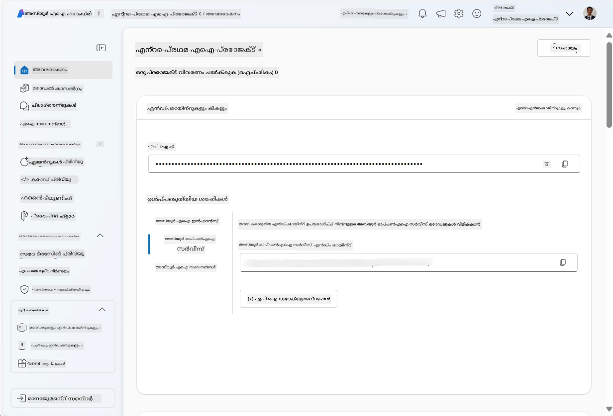
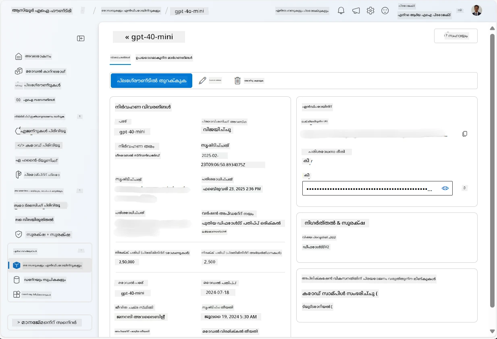
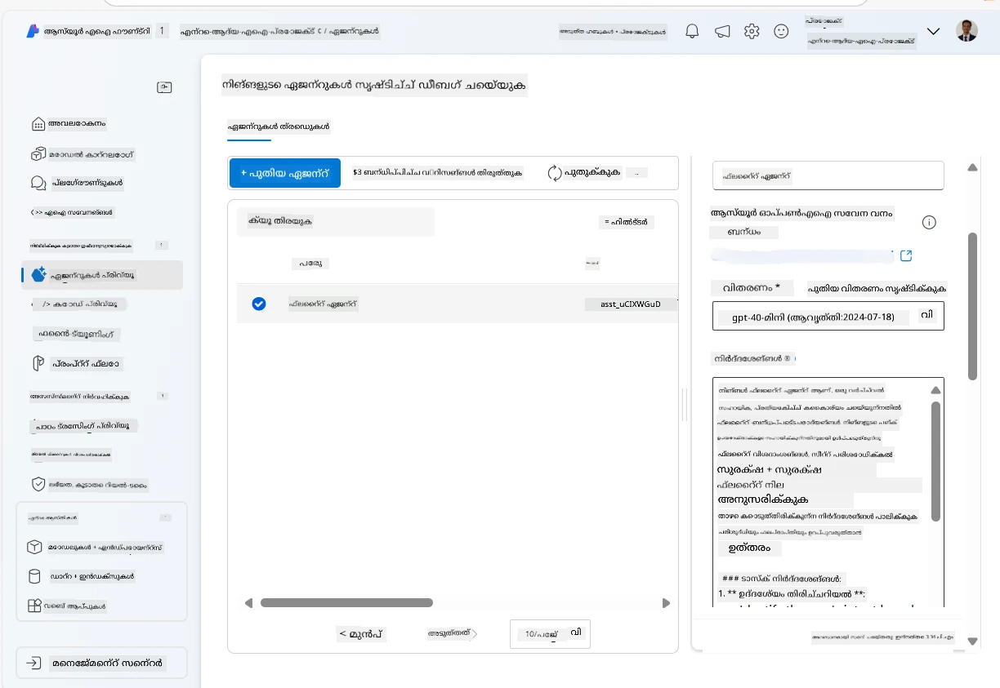
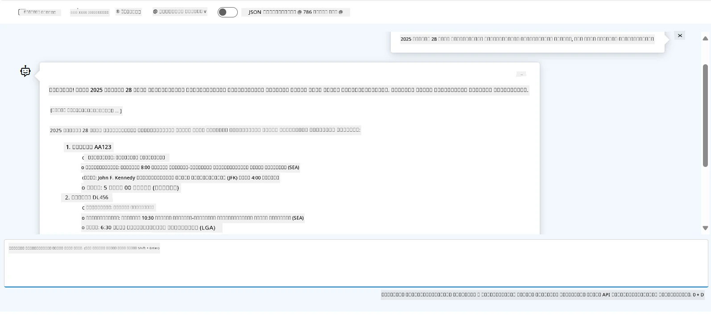

<!--
CO_OP_TRANSLATOR_METADATA:
{
  "original_hash": "7e92870dc0843e13d4dabc620c09d2d9",
  "translation_date": "2025-12-03T16:57:06+00:00",
  "source_file": "02-explore-agentic-frameworks/azure-ai-foundry-agent-creation.md",
  "language_code": "ml"
}
-->
# Azure AI Agent സേവന വികസനം

ഈ അഭ്യാസത്തിൽ, നിങ്ങൾ [Azure AI Foundry portal](https://ai.azure.com/?WT.mc_id=academic-105485-koreyst) ൽ Azure AI Agent സേവന ഉപകരണങ്ങൾ ഉപയോഗിച്ച് Flight Booking വേണ്ടി ഒരു ഏജന്റ് സൃഷ്ടിക്കുന്നു. ഈ ഏജന്റ് ഉപയോക്താക്കളുമായി സംവദിച്ച് വിമാനങ്ങളെക്കുറിച്ചുള്ള വിവരങ്ങൾ നൽകാൻ കഴിയും.

## ആവശ്യമായവ

ഈ അഭ്യാസം പൂർത്തിയാക്കാൻ, നിങ്ങൾക്ക് താഴെ പറയുന്നവ ആവശ്യമാണ്:
1. സജീവ സബ്സ്ക്രിപ്ഷനുള്ള ഒരു Azure അക്കൗണ്ട്. [ഒരു അക്കൗണ്ട് സൗജന്യമായി സൃഷ്ടിക്കുക](https://azure.microsoft.com/free/?WT.mc_id=academic-105485-koreyst).
2. Azure AI Foundry hub സൃഷ്ടിക്കാൻ അനുമതികൾ അല്ലെങ്കിൽ നിങ്ങൾക്കായി ഒരു hub സൃഷ്ടിക്കപ്പെട്ടിരിക്കണം.
    - നിങ്ങളുടെ റോൾ Contributor അല്ലെങ്കിൽ Owner ആണെങ്കിൽ, ഈ ട്യൂട്ടോറിയലിലെ ഘട്ടങ്ങൾ പിന്തുടരാം.

## Azure AI Foundry hub സൃഷ്ടിക്കുക

> **Note:** Azure AI Foundry മുൻപ് Azure AI Studio എന്നറിയപ്പെട്ടിരുന്നു.

1. Azure AI Foundry hub സൃഷ്ടിക്കുന്നതിനുള്ള [Azure AI Foundry](https://learn.microsoft.com/en-us/azure/ai-studio/?WT.mc_id=academic-105485-koreyst) ബ്ലോഗ് പോസ്റ്റിലെ മാർഗനിർദ്ദേശങ്ങൾ പിന്തുടരുക.
2. നിങ്ങളുടെ പ്രോജക്റ്റ് സൃഷ്ടിച്ച ശേഷം, പ്രദർശിപ്പിക്കുന്ന ഏതെങ്കിലും ടിപ്പുകൾ അടച്ച് Azure AI Foundry portal ൽ പ്രോജക്റ്റ് പേജ് അവലോകനം ചെയ്യുക. ഇത് താഴെ കാണുന്ന ചിത്രത്തോട് സമാനമായിരിക്കും:

    

## മോഡൽ ഡിപ്ലോയ് ചെയ്യുക

1. നിങ്ങളുടെ പ്രോജക്റ്റിന്റെ ഇടത് പാനലിൽ **My assets** വിഭാഗത്തിൽ **Models + endpoints** പേജ് തിരഞ്ഞെടുക്കുക.
2. **Models + endpoints** പേജിൽ, **Model deployments** ടാബിൽ, **+ Deploy model** മെനുവിൽ **Deploy base model** തിരഞ്ഞെടുക്കുക.
3. ലിസ്റ്റിൽ `gpt-4o-mini` മോഡൽ തിരയുക, തുടർന്ന് അത് തിരഞ്ഞെടുക്കുകയും സ്ഥിരീകരിക്കുകയും ചെയ്യുക.

    > **Note**: TPM കുറയ്ക്കുന്നത് നിങ്ങൾ ഉപയോഗിക്കുന്ന സബ്സ്ക്രിപ്ഷനിൽ ലഭ്യമായ ക്വോട്ടാ അതിക്രമിക്കുന്നത് ഒഴിവാക്കാൻ സഹായിക്കുന്നു.

    

## ഏജന്റ് സൃഷ്ടിക്കുക

മോഡൽ ഡിപ്ലോയ് ചെയ്ത ശേഷം, നിങ്ങൾക്ക് ഒരു ഏജന്റ് സൃഷ്ടിക്കാം. ഒരു ഏജന്റ് ഉപയോക്താക്കളുമായി സംവദിക്കാൻ ഉപയോഗിക്കാവുന്ന conversational AI മോഡലാണ്.

1. നിങ്ങളുടെ പ്രോജക്റ്റിന്റെ ഇടത് പാനലിൽ **Build & Customize** വിഭാഗത്തിൽ **Agents** പേജ് തിരഞ്ഞെടുക്കുക.
2. **+ Create agent** ക്ലിക്ക് ചെയ്ത് ഒരു പുതിയ ഏജന്റ് സൃഷ്ടിക്കുക. **Agent Setup** ഡയലോഗ് ബോക്സിൽ:
    - ഏജന്റിന് `FlightAgent` പോലുള്ള ഒരു പേര് നൽകുക.
    - നിങ്ങൾ മുമ്പ് സൃഷ്ടിച്ച `gpt-4o-mini` മോഡൽ ഡിപ്ലോയ്‌മെന്റ് തിരഞ്ഞെടുക്കുക.
    - ഏജന്റ് പിന്തുടരേണ്ട പ്രോംപ്റ്റ് അനുസരിച്ച് **Instructions** സജ്ജമാക്കുക. ഉദാഹരണത്തിന്:
    ```
    You are FlightAgent, a virtual assistant specialized in handling flight-related queries. Your role includes assisting users with searching for flights, retrieving flight details, checking seat availability, and providing real-time flight status. Follow the instructions below to ensure clarity and effectiveness in your responses:

    ### Task Instructions:
    1. **Recognizing Intent**:
       - Identify the user's intent based on their request, focusing on one of the following categories:
         - Searching for flights
         - Retrieving flight details using a flight ID
         - Checking seat availability for a specified flight
         - Providing real-time flight status using a flight number
       - If the intent is unclear, politely ask users to clarify or provide more details.
        
    2. **Processing Requests**:
        - Depending on the identified intent, perform the required task:
        - For flight searches: Request details such as origin, destination, departure date, and optionally return date.
        - For flight details: Request a valid flight ID.
        - For seat availability: Request the flight ID and date and validate inputs.
        - For flight status: Request a valid flight number.
        - Perform validations on provided data (e.g., formats of dates, flight numbers, or IDs). If the information is incomplete or invalid, return a friendly request for clarification.

    3. **Generating Responses**:
    - Use a tone that is friendly, concise, and supportive.
    - Provide clear and actionable suggestions based on the output of each task.
    - If no data is found or an error occurs, explain it to the user gently and offer alternative actions (e.g., refine search, try another query).
    
    ```
> [!NOTE]
> വിശദമായ പ്രോംപ്റ്റിനായി, കൂടുതൽ വിവരങ്ങൾക്ക് [ഈ റിപോസിറ്ററി](https://github.com/ShivamGoyal03/RoamMind) പരിശോധിക്കാം.
    
> കൂടാതെ, **Knowledge Base**, **Actions** എന്നിവ ചേർത്ത് ഏജന്റിന്റെ കഴിവുകൾ മെച്ചപ്പെടുത്താനും ഉപയോക്തൃ അഭ്യർത്ഥനകളുടെ അടിസ്ഥാനത്തിൽ സ്വയം പ്രവർത്തനങ്ങൾ നടത്താനും കഴിയും. ഈ അഭ്യാസത്തിൽ, ഈ ഘട്ടങ്ങൾ ഒഴിവാക്കാം.
    


3. പുതിയ multi-AI ഏജന്റ് സൃഷ്ടിക്കാൻ, **New Agent** ക്ലിക്ക് ചെയ്യുക. പുതിയ ഏജന്റ് **Agents** പേജിൽ പ്രദർശിപ്പിക്കും.

## ഏജന്റ് പരീക്ഷിക്കുക

ഏജന്റ് സൃഷ്ടിച്ച ശേഷം, Azure AI Foundry portal playground ൽ ഉപയോക്തൃ ചോദ്യങ്ങൾക്ക് എങ്ങനെ പ്രതികരിക്കുന്നുവെന്ന് പരിശോധിക്കാം.

1. ഏജന്റിന്റെ **Setup** പാനലിന്റെ മുകളിൽ **Try in playground** തിരഞ്ഞെടുക്കുക.
2. **Playground** പാനലിൽ, ചാറ്റ് വിൻഡോയിൽ ചോദ്യങ്ങൾ ടൈപ്പ് ചെയ്ത് ഏജന്റുമായി സംവദിക്കാം. ഉദാഹരണത്തിന്, ഏജന്റിനോട് സെറ്റിൽ നിന്ന് ന്യൂയോർക്കിലേക്ക് 28-ാം തീയതിയിൽ വിമാനങ്ങൾ തിരയാൻ ചോദിക്കാം.

    > **Note**: ഈ അഭ്യാസത്തിൽ യഥാർത്ഥ സമയ ഡാറ്റ ഉപയോഗിക്കുന്നില്ല, അതിനാൽ ഏജന്റ് കൃത്യമായ പ്രതികരണങ്ങൾ നൽകില്ല. ഏജന്റിന്റെ ഉപയോക്തൃ ചോദ്യങ്ങൾ മനസിലാക്കാനും നൽകിയ നിർദ്ദേശങ്ങളുടെ അടിസ്ഥാനത്തിൽ പ്രതികരിക്കാനും ഉള്ള കഴിവ് പരിശോധിക്കുകയാണ് ലക്ഷ്യം.

    

3. ഏജന്റ് പരീക്ഷിച്ചതിന് ശേഷം, കൂടുതൽ intents, training data, actions എന്നിവ ചേർത്ത് അതിന്റെ കഴിവുകൾ മെച്ചപ്പെടുത്താൻ കഴിയും.

## റിസോഴ്സുകൾ ക്ലീൻ ചെയ്യുക

ഏജന്റ് പരീക്ഷിച്ച ശേഷം, അധിക ചെലവുകൾ ഒഴിവാക്കാൻ അത് ഡിലീറ്റ് ചെയ്യാം.
1. [Azure portal](https://portal.azure.com) തുറന്ന് ഈ അഭ്യാസത്തിൽ ഉപയോഗിച്ച hub റിസോഴ്സുകൾ ഡിപ്ലോയ് ചെയ്ത resource group കാണുക.
2. ടൂൾബാറിൽ **Delete resource group** തിരഞ്ഞെടുക്കുക.
3. resource group നാമം നൽകുക, അത് ഡിലീറ്റ് ചെയ്യാൻ നിങ്ങൾക്ക് ഉറപ്പുണ്ടെന്ന് സ്ഥിരീകരിക്കുക.

## റിസോഴ്സുകൾ

- [Azure AI Foundry documentation](https://learn.microsoft.com/en-us/azure/ai-studio/?WT.mc_id=academic-105485-koreyst)
- [Azure AI Foundry portal](https://ai.azure.com/?WT.mc_id=academic-105485-koreyst)
- [Getting Started with Azure AI Studio](https://techcommunity.microsoft.com/blog/educatordeveloperblog/getting-started-with-azure-ai-studio/4095602?WT.mc_id=academic-105485-koreyst)
- [Fundamentals of AI agents on Azure](https://learn.microsoft.com/en-us/training/modules/ai-agent-fundamentals/?WT.mc_id=academic-105485-koreyst)
- [Azure AI Discord](https://aka.ms/AzureAI/Discord)

---

<!-- CO-OP TRANSLATOR DISCLAIMER START -->
**അസത്യവാദം**:  
ഈ രേഖ AI വിവർത്തന സേവനമായ [Co-op Translator](https://github.com/Azure/co-op-translator) ഉപയോഗിച്ച് വിവർത്തനം ചെയ്തതാണ്. കൃത്യതയ്ക്കായി ഞങ്ങൾ ശ്രമിക്കുന്നുവെങ്കിലും, ഓട്ടോമേറ്റഡ് വിവർത്തനങ്ങളിൽ പിശകുകൾ അല്ലെങ്കിൽ തെറ്റായ വിവരങ്ങൾ ഉണ്ടാകാൻ സാധ്യതയുണ്ട്. അതിന്റെ സ്വാഭാവിക ഭാഷയിലുള്ള മൗലിക രേഖ പ്രാമാണികമായ ഉറവിടമായി കണക്കാക്കണം. നിർണായകമായ വിവരങ്ങൾക്ക്, പ്രൊഫഷണൽ മനുഷ്യ വിവർത്തനം ശുപാർശ ചെയ്യുന്നു. ഈ വിവർത്തനം ഉപയോഗിക്കുന്നതിൽ നിന്നുണ്ടാകുന്ന തെറ്റിദ്ധാരണകൾക്കോ തെറ്റായ വ്യാഖ്യാനങ്ങൾക്കോ ഞങ്ങൾ ഉത്തരവാദികളല്ല.
<!-- CO-OP TRANSLATOR DISCLAIMER END -->