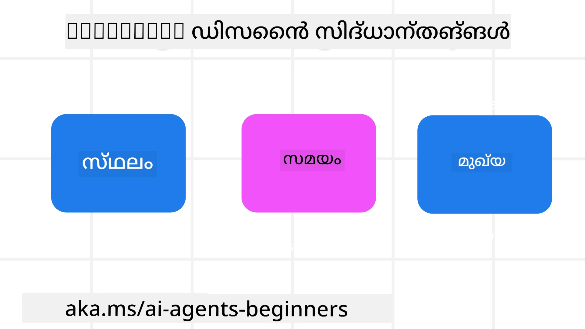

<!--
CO_OP_TRANSLATOR_METADATA:
{
  "original_hash": "d71524fe83a23829ae7a23b4031aaac8",
  "translation_date": "2025-12-03T17:12:45+00:00",
  "source_file": "03-agentic-design-patterns/README.md",
  "language_code": "ml"
}
-->

> _(മുകളിൽ കാണുന്ന ചിത്രം ക്ലിക്ക് ചെയ്ത് ഈ പാഠത്തിന്റെ വീഡിയോ കാണുക)_
# AI ഏജന്റിക് ഡിസൈൻ പ്രിൻസിപ്പിളുകൾ

## പരിചയം

AI ഏജന്റിക് സിസ്റ്റങ്ങൾ നിർമ്മിക്കാൻ പല രീതികളുണ്ട്. ജനറേറ്റീവ് AI ഡിസൈൻയിൽ അസ്പഷ്ടത ഒരു ബഗല്ല, മറിച്ച് ഒരു സവിശേഷതയാണ്, അതിനാൽ എഞ്ചിനീയർമാർക്ക് എവിടെ നിന്ന് തുടങ്ങണമെന്ന് കണ്ടെത്തുന്നത് ചിലപ്പോൾ പ്രയാസകരമാകുന്നു. ഡെവലപ്പർമാർക്ക് അവരുടെ ബിസിനസ് ആവശ്യങ്ങൾ പരിഹരിക്കാൻ ഉപഭോക്തൃകേന്ദ്രമായ ഏജന്റിക് സിസ്റ്റങ്ങൾ നിർമ്മിക്കാൻ സഹായിക്കുന്നതിനായി ഞങ്ങൾ മനുഷ്യകേന്ദ്രമായ UX ഡിസൈൻ പ്രിൻസിപ്പിളുകൾ സൃഷ്ടിച്ചിട്ടുണ്ട്. ഈ ഡിസൈൻ പ്രിൻസിപ്പിളുകൾ നിർദ്ദേശാത്മകമായ ആർക്കിടെക്ചർ അല്ല, മറിച്ച് ഏജന്റ് അനുഭവങ്ങൾ നിർവചിക്കുകയും നിർമ്മിക്കുകയും ചെയ്യുന്ന ടീമുകൾക്കുള്ള ഒരു തുടക്കമാണ്.

സാധാരണയായി, ഏജന്റുകൾ:

- മനുഷ്യ ശേഷികളെ വ്യാപിപ്പിക്കുകയും സ്കെയിൽ ചെയ്യുകയും ചെയ്യുക (ബ്രെയിൻസ്റ്റോം, പ്രശ്നപരിഹാരം, ഓട്ടോമേഷൻ മുതലായവ)
- അറിവിന്റെ കുറവ് നിറയ്ക്കുക (അറിവിന്റെ മേഖലകളിൽ എനിക്ക് വേഗത്തിൽ അറിവ് ലഭ്യമാക്കുക, വിവർത്തനം മുതലായവ)
- വ്യക്തികളായി മറ്റുള്ളവരുമായി പ്രവർത്തിക്കാൻ ഇഷ്ടപ്പെടുന്ന രീതിയിൽ സഹകരണം പ്രോത്സാഹിപ്പിക്കുകയും പിന്തുണയ്ക്കുകയും ചെയ്യുക
- നമ്മെ നന്നായ പതിപ്പുകളാക്കുക (ഉദാ., ലൈഫ് കോച്ച്/ടാസ്‌ക് മാസ്റ്റർ, ഞങ്ങളെ മാനസിക നിയന്ത്രണവും ധ്യാനനൈപുണ്യങ്ങളും പഠിപ്പിക്കുന്നതിൽ സഹായിക്കുക, പ്രതിരോധശേഷി നിർമ്മിക്കുക മുതലായവ)

## ഈ പാഠത്തിൽ ഉൾപ്പെടുന്നവ

- ഏജന്റിക് ഡിസൈൻ പ്രിൻസിപ്പിളുകൾ എന്താണ്
- ഈ ഡിസൈൻ പ്രിൻസിപ്പിളുകൾ നടപ്പിലാക്കുമ്പോൾ പാലിക്കേണ്ട ചില മാർഗനിർദ്ദേശങ്ങൾ എന്തൊക്കെയാണ്
- ഡിസൈൻ പ്രിൻസിപ്പിളുകൾ ഉപയോഗിക്കുന്ന ചില ഉദാഹരണങ്ങൾ എന്തൊക്കെയാണ്

## പഠന ലക്ഷ്യങ്ങൾ

ഈ പാഠം പൂർത്തിയാക്കിയ ശേഷം, നിങ്ങൾക്ക് കഴിയും:

1. ഏജന്റിക് ഡിസൈൻ പ്രിൻസിപ്പിളുകൾ എന്താണെന്ന് വിശദീകരിക്കുക
2. ഏജന്റിക് ഡിസൈൻ പ്രിൻസിപ്പിളുകൾ ഉപയോഗിക്കുന്നതിനുള്ള മാർഗനിർദ്ദേശങ്ങൾ വിശദീകരിക്കുക
3. ഏജന്റിക് ഡിസൈൻ പ്രിൻസിപ്പിളുകൾ ഉപയോഗിച്ച് ഒരു ഏജന്റ് നിർമ്മിക്കുന്നതെങ്ങനെ എന്ന് മനസ്സിലാക്കുക

## ഏജന്റിക് ഡിസൈൻ പ്രിൻസിപ്പിളുകൾ

### ഏജന്റ് (സ്ഥലം)

ഏജന്റ് പ്രവർത്തിക്കുന്ന പരിസ്ഥിതിയാണ് ഇത്. ഭൗതികവും ഡിജിറ്റലുമായ ലോകങ്ങളിൽ ഏജന്റുകൾ എങ്ങനെയാണ് ഡിസൈൻ ചെയ്യേണ്ടതെന്ന് ഈ പ്രിൻസിപ്പിളുകൾ നിർദ്ദേശിക്കുന്നു.

- **കണക്റ്റ് ചെയ്യുക, തകരാൻ അനുവദിക്കരുത്** – ആളുകളെ മറ്റുള്ളവരുമായി, സംഭവങ്ങളുമായി, പ്രവർത്തനക്ഷമമായ അറിവുമായി ബന്ധിപ്പിച്ച് സഹകരണം പ്രോത്സാഹിപ്പിക്കുകയും ബന്ധം സൃഷ്ടിക്കുകയും ചെയ്യുക.
  - ഏജന്റുകൾ സംഭവങ്ങൾ, അറിവ്, ആളുകൾ എന്നിവ ബന്ധിപ്പിക്കുന്നു.
  - ഏജന്റുകൾ ആളുകളെ അടുത്ത് കൊണ്ടുവരുന്നു. അവർ ആളുകളെ മാറ്റിസ്ഥാപിക്കാനോ അവഹേളിക്കാനോ രൂപകൽപ്പന ചെയ്തിട്ടില്ല.
- **സുലഭവും ചിലപ്പോൾ അദൃശ്യവുമാകുക** – ഏജന്റ് പ്രധാനമായും പശ്ചാത്തലത്തിൽ പ്രവർത്തിക്കുന്നു, ഇത് പ്രസക്തവും അനുയോജ്യവുമായപ്പോൾ മാത്രമേ നമ്മെ പ്രോത്സാഹിപ്പിക്കുകയുള്ളു.
  - ഏജന്റ് ഏതെങ്കിലും ഉപകരണത്തിലോ പ്ലാറ്റ്ഫോമിലോ അംഗീകൃത ഉപയോക്താക്കൾക്ക് എളുപ്പത്തിൽ കണ്ടെത്താനും ആക്സസ് ചെയ്യാനും കഴിയും.
  - ഏജന്റ് മൾട്ടിമോഡൽ ഇൻപുട്ടുകളും ഔട്ട്പുട്ടുകളും (ശബ്ദം, വോയ്സ്, ടെക്സ്റ്റ് മുതലായവ) പിന്തുണയ്ക്കുന്നു.
  - ഉപയോക്താവിന്റെ ആവശ്യങ്ങൾ തിരിച്ചറിയുന്നതിന്റെ അടിസ്ഥാനത്തിൽ, ഏജന്റ് മുൻനിരയിലും പശ്ചാത്തലത്തിലും, പ്രോആക്ടീവിലും റിയാക്ടീവിലും മിനുസമുള്ള മാറ്റങ്ങൾ വരുത്താൻ കഴിയും.
  - ഏജന്റ് അദൃശ്യ രൂപത്തിൽ പ്രവർത്തിക്കാം, എന്നാൽ അതിന്റെ പശ്ചാത്തല പ്രോസസ്സ് പാതയും മറ്റ് ഏജന്റുകളുമായുള്ള സഹകരണവും ഉപയോക്താവിന് സുതാര്യവും നിയന്ത്രണയോഗ്യവുമാണ്.

### ഏജന്റ് (സമയം)

ഏജന്റ് സമയത്തിനിടയിൽ എങ്ങനെ പ്രവർത്തിക്കുന്നു എന്നതാണ് ഇത്. കഴിഞ്ഞകാലം, ഇപ്പോൾ, ഭാവി എന്നിവയിൽ ഏജന്റുകൾ എങ്ങനെ ഇടപെടുന്നു എന്ന് ഈ പ്രിൻസിപ്പിളുകൾ നിർദ്ദേശിക്കുന്നു.

- **കഴിഞ്ഞകാലം**: സംസ്ഥാനവും സാഹചര്യവും ഉൾപ്പെടുന്ന ചരിത്രത്തെ പ്രതിഫലിപ്പിക്കുന്നു.
  - ഏജന്റ് കൂടുതൽ സമ്പന്നമായ ചരിത്ര ഡാറ്റയുടെ വിശകലനത്തിന്റെ അടിസ്ഥാനത്തിൽ കൂടുതൽ പ്രസക്തമായ ഫലങ്ങൾ നൽകുന്നു, സംഭവങ്ങൾ, ആളുകൾ, സംസ്ഥാനങ്ങൾ എന്നിവ മാത്രമല്ല.
  - ഏജന്റ് കഴിഞ്ഞ സംഭവങ്ങളിൽ നിന്ന് ബന്ധങ്ങൾ സൃഷ്ടിക്കുകയും നിലവിലെ സാഹചര്യങ്ങളിൽ ഇടപെടാൻ സജീവമായി ഓർമ്മയെ പ്രതിഫലിപ്പിക്കുകയും ചെയ്യുന്നു.
- **ഇപ്പോൾ**: അറിയിപ്പുകൾ നൽകുന്നതിലും കൂടുതൽ പ്രോത്സാഹിപ്പിക്കുന്നു.
  - ഏജന്റ് ആളുകളുമായി ഇടപെടുന്നതിന് സമഗ്രമായ സമീപനം ഉൾക്കൊള്ളുന്നു. ഒരു സംഭവം സംഭവിക്കുമ്പോൾ, ഏജന്റ് സ്റ്റാറ്റിക് അറിയിപ്പ് അല്ലെങ്കിൽ മറ്റ് സ്റ്റാറ്റിക് ഔപചാരികതയെ മറികടക്കുന്നു. ഏജന്റ് പ്രവാഹങ്ങൾ ലളിതമാക്കുകയോ ഉപയോക്താവിന്റെ ശ്രദ്ധ ശരിയായ സമയത്ത് തിരിയാൻ ഡൈനാമിക് ആയി സൂചനകൾ സൃഷ്ടിക്കുകയോ ചെയ്യുന്നു.
  - ഏജന്റ് വിവരങ്ങൾ പ്രാദേശിക പരിസ്ഥിതി, സാമൂഹിക-സാംസ്കാരിക മാറ്റങ്ങൾ, ഉപയോക്താവിന്റെ ഉദ്ദേശ്യത്തിന് അനുയോജ്യമായ രീതിയിൽ നൽകുന്നു.
  - ഏജന്റ് ഇടപെടൽ ക്രമാനുഗതമായും, ദീർഘകാലത്തേക്ക് ഉപയോക്താക്കളെ ശക്തിപ്പെടുത്താൻ സങ്കീർണ്ണതയിൽ വളരുകയും വികസിക്കുകയും ചെയ്യുന്നു.
- **ഭാവി**: അനുയോജ്യവും വികസനശീലമുള്ളതും.
  - ഏജന്റ് വിവിധ ഉപകരണങ്ങൾ, പ്ലാറ്റ്ഫോമുകൾ, മോഡാലിറ്റികൾ എന്നിവയ്ക്ക് അനുയോജ്യമാണ്.
  - ഏജന്റ് ഉപയോക്തൃ പെരുമാറ്റം, ആക്സസിബിലിറ്റി ആവശ്യങ്ങൾ എന്നിവയ്ക്ക് അനുയോജ്യമാണ്, ഇത് സ്വതന്ത്രമായി ഇഷ്ടാനുസൃതമാക്കാവുന്നതാണ്.
  - ഏജന്റ് തുടർച്ചയായ ഉപയോക്തൃ ഇടപെടലിലൂടെ രൂപം കൊള്ളുകയും വികസിക്കുകയും ചെയ്യുന്നു.

### ഏജന്റ് (കോർ)

ഏജന്റിന്റെ ഡിസൈൻ കോറിലെ പ്രധാന ഘടകങ്ങളാണ് ഇവ.

- **അസ്പഷ്ടത സ്വീകരിക്കുക, എന്നാൽ വിശ്വാസം സ്ഥാപിക്കുക**.
  - ഏജന്റിന്റെ ഒരു നിശ്ചിത അളവിലെ അസ്പഷ്ടത പ്രതീക്ഷിക്കാം. അസ്പഷ്ടത ഏജന്റ് ഡിസൈന്റെ ഒരു പ്രധാന ഘടകമാണ്.
  - വിശ്വാസവും സുതാര്യതയും ഏജന്റ് ഡിസൈന്റെ അടിസ്ഥാന പാളികളാണ്.
  - ഏജന്റ് ഓൺ/ഓഫ് ആകുന്ന സമയത്ത് മനുഷ്യർ നിയന്ത്രണത്തിലായിരിക്കണം, ഏജന്റിന്റെ നില എല്ലായ്പ്പോഴും വ്യക്തമായിരിക്കണം.

## ഈ പ്രിൻസിപ്പിളുകൾ നടപ്പിലാക്കാനുള്ള മാർഗനിർദ്ദേശങ്ങൾ

മുകളിൽ പറഞ്ഞ ഡിസൈൻ പ്രിൻസിപ്പിളുകൾ ഉപയോഗിക്കുമ്പോൾ, താഴെ പറയുന്ന മാർഗനിർദ്ദേശങ്ങൾ ഉപയോഗിക്കുക:

1. **സുതാര്യത**: AI ഉൾപ്പെട്ടിരിക്കുന്നതും, അത് എങ്ങനെ പ്രവർത്തിക്കുന്നതും (കഴിഞ്ഞ പ്രവർത്തനങ്ങൾ ഉൾപ്പെടെ), എങ്ങനെ ഫീഡ്ബാക്ക് നൽകാം, സിസ്റ്റം മാറ്റാൻ എങ്ങനെ കഴിയും എന്നിവ ഉപയോക്താവിനെ അറിയിക്കുക.
2. **നിയന്ത്രണം**: ഉപയോക്താവിന് സിസ്റ്റവും അതിന്റെ ഗുണങ്ങളും ഇഷ്ടാനുസൃതമാക്കാനും, മുൻഗണനകൾ വ്യക്തമാക്കാനും, വ്യക്തിപരമാക്കാനും, മറക്കാനും കഴിയും.
3. **സ്ഥിരത**: ഉപകരണങ്ങൾക്കും എൻഡ്പോയിന്റുകൾക്കും ഇടയിൽ സ്ഥിരതയുള്ള, മൾട്ടിമോഡൽ അനുഭവങ്ങൾ ലക്ഷ്യമാക്കുക. സാധ്യമായിടത്ത് പരിചിതമായ UI/UX ഘടകങ്ങൾ ഉപയോഗിക്കുക (ഉദാ., വോയ്സ് ഇൻററാക്ഷനിനായി മൈക്രോഫോൺ ഐക്കൺ) ഉപഭോക്താവിന്റെ ബുദ്ധിമുട്ട് ככלമാത്രം കുറയ്ക്കുക (ഉദാ., സംക്ഷിപ്തമായ പ്രതികരണങ്ങൾ, ദൃശ്യ സഹായങ്ങൾ, ‘കൂടുതൽ പഠിക്കുക’ ഉള്ളടക്കം).

## ഈ പ്രിൻസിപ്പിളുകളും മാർഗനിർദ്ദേശങ്ങളും ഉപയോഗിച്ച് ഒരു ട്രാവൽ ഏജന്റ് എങ്ങനെ ഡിസൈൻ ചെയ്യാം

നിങ്ങൾ ഒരു ട്രാവൽ ഏജന്റ് ഡിസൈൻ ചെയ്യുകയാണെന്ന് കരുതുക, ഡിസൈൻ പ്രിൻസിപ്പിളുകളും മാർഗനിർദ്ദേശങ്ങളും ഉപയോഗിച്ച് ചിന്തിക്കാൻ ഇതാണ് മാർഗം:

1. **സുതാര്യത** – ട്രാവൽ ഏജന്റ് AI-സജ്ജമായ ഏജന്റാണെന്ന് ഉപയോക്താവിനെ അറിയിക്കുക. എങ്ങനെ ആരംഭിക്കാമെന്ന് കുറച്ച് അടിസ്ഥാന നിർദ്ദേശങ്ങൾ നൽകുക (ഉദാ., ഒരു “ഹലോ” സന്ദേശം, സാമ്പിൾ പ്രോംപ്റ്റുകൾ). ഇത് ഉൽപ്പന്ന പേജിൽ വ്യക്തമായി രേഖപ്പെടുത്തുക. ഉപയോക്താവ് മുമ്പ് ചോദിച്ച പ്രോംപ്റ്റുകളുടെ പട്ടിക കാണിക്കുക. ഫീഡ്ബാക്ക് എങ്ങനെ നൽകാമെന്ന് (തമ്പ്‌സ് അപ്പ്, തമ്പ്‌സ് ഡൗൺ, ഫീഡ്ബാക്ക് അയയ്ക്കുക ബട്ടൺ മുതലായവ) വ്യക്തമായി വ്യക്തമാക്കുക. ഏജന്റിന് ഉപയോഗം അല്ലെങ്കിൽ വിഷയം സംബന്ധിച്ച നിയന്ത്രണങ്ങൾ ഉണ്ടെങ്കിൽ വ്യക്തമായി വിശദീകരിക്കുക.
2. **നിയന്ത്രണം** – ഏജന്റ് സൃഷ്ടിച്ചതിന് ശേഷം ഉപയോക്താവിന് അത് എങ്ങനെ മാറ്റാം എന്ന് വ്യക്തമാക്കുക, ഉദാ., സിസ്റ്റം പ്രോംപ്റ്റ് പോലുള്ള കാര്യങ്ങൾ. ഏജന്റിന്റെ വിശദമായ എഴുത്ത് ശൈലി, ഏജന്റ് സംസാരിക്കേണ്ട വിഷയങ്ങൾ എന്നിവ തിരഞ്ഞെടുക്കാൻ ഉപയോക്താവിന് കഴിയും. ബന്ധപ്പെട്ട ഫയലുകൾ അല്ലെങ്കിൽ ഡാറ്റ, പ്രോംപ്റ്റുകൾ, കഴിഞ്ഞ സംഭാഷണങ്ങൾ എന്നിവ കാണാനും ഇല്ലാതാക്കാനും ഉപയോക്താവിന് കഴിയും.
3. **സ്ഥിരത** – പ്രോംപ്റ്റ് ഷെയർ ചെയ്യാനുള്ള ഐക്കണുകൾ, ഒരു ഫയൽ അല്ലെങ്കിൽ ഫോട്ടോ ചേർക്കുക, ഒരാളെ അല്ലെങ്കിൽ ഒരു കാര്യം ടാഗ് ചെയ്യുക എന്നിവ സ്റ്റാൻഡേർഡ് ആകുകയും തിരിച്ചറിയാവുന്നതായിരിക്കണം. ഏജന്റുമായി ഫയൽ അപ്ലോഡ്/ഷെയർ ചെയ്യുന്നതിന് പേപ്പർക്ലിപ്പ് ഐക്കൺ ഉപയോഗിക്കുക, ഗ്രാഫിക്സ് അപ്ലോഡിനായി ഇമേജ് ഐക്കൺ ഉപയോഗിക്കുക.

## സാമ്പിൾ കോഡുകൾ

- Python: [Agent Framework](./code_samples/03-python-agent-framework.ipynb)
- .NET: [Agent Framework](./code_samples/03-dotnet-agent-framework.md)

## AI ഏജന്റിക് ഡിസൈൻ പാറ്റേണുകൾക്കുറിച്ച് കൂടുതൽ ചോദ്യങ്ങളുണ്ടോ?

മറ്റു പഠിതാക്കളുമായി കൂടിക്കാഴ്ച നടത്താനും, ഓഫീസ് മണിക്കൂറുകളിൽ പങ്കെടുക്കാനും, നിങ്ങളുടെ AI ഏജന്റുകൾ സംബന്ധിച്ച ചോദ്യങ്ങൾക്ക് ഉത്തരം ലഭിക്കാനും [Azure AI Foundry Discord](https://aka.ms/ai-agents/discord) ചേരുക.

## അധിക വിഭവങ്ങൾ

- <a href="https://openai.com" target="_blank">Agentic AI സിസ്റ്റങ്ങൾ നിയന്ത്രിക്കുന്നതിനുള്ള പ്രാക്ടീസുകൾ | OpenAI</a>
- <a href="https://microsoft.com" target="_blank">The HAX Toolkit Project - Microsoft Research</a>
- <a href="https://responsibleaitoolbox.ai" target="_blank">Responsible AI Toolbox</a>

## മുൻ പാഠം

[Agentic Frameworks അന്വേഷിക്കുന്നു](../02-explore-agentic-frameworks/README.md)

## അടുത്ത പാഠം

[Tool Use Design Pattern](../04-tool-use/README.md)

---

<!-- CO-OP TRANSLATOR DISCLAIMER START -->
**അസത്യവാദം**:  
ഈ രേഖ AI വിവർത്തന സേവനമായ [Co-op Translator](https://github.com/Azure/co-op-translator) ഉപയോഗിച്ച് വിവർത്തനം ചെയ്തതാണ്. കൃത്യതയ്ക്കായി ഞങ്ങൾ ശ്രമിക്കുന്നുവെങ്കിലും, ഓട്ടോമേറ്റഡ് വിവർത്തനങ്ങളിൽ പിശകുകൾ അല്ലെങ്കിൽ തെറ്റായ വിവരങ്ങൾ ഉണ്ടാകാൻ സാധ്യതയുണ്ട്. അതിന്റെ സ്വാഭാവിക ഭാഷയിലുള്ള മൗലികരേഖ പ്രാമാണികമായ ഉറവിടമായി കണക്കാക്കണം. നിർണായകമായ വിവരങ്ങൾക്ക്, പ്രൊഫഷണൽ മനുഷ്യ വിവർത്തനം ശുപാർശ ചെയ്യുന്നു. ഈ വിവർത്തനം ഉപയോഗിക്കുന്നതിൽ നിന്നുണ്ടാകുന്ന തെറ്റിദ്ധാരണകൾക്കോ തെറ്റായ വ്യാഖ്യാനങ്ങൾക്കോ ഞങ്ങൾ ഉത്തരവാദികളല്ല.
<!-- CO-OP TRANSLATOR DISCLAIMER END -->