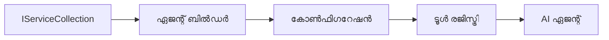

<!--
CO_OP_TRANSLATOR_METADATA:
{
  "original_hash": "bcc874e190347bd6a095aed56dc16de8",
  "translation_date": "2025-12-03T17:14:31+00:00",
  "source_file": "03-agentic-design-patterns/code_samples/03-dotnet-agent-framework.md",
  "language_code": "ml"
}
-->
# 🎨 GitHub മോഡലുകളുമായി (.NET) ഏജന്റിക് ഡിസൈൻ പാറ്റേണുകൾ

## 📋 പഠന ലക്ഷ്യങ്ങൾ

Microsoft Agent Framework ഉപയോഗിച്ച് GitHub മോഡലുകൾ സംയോജിപ്പിച്ച് .NET-ൽ ബുദ്ധിമാനായ ഏജന്റുകൾ നിർമ്മിക്കുന്നതിന് എന്റർപ്രൈസ്-ഗ്രേഡ് ഡിസൈൻ പാറ്റേണുകൾ ഈ ഉദാഹരണം കാണിക്കുന്നു. ഏജന്റുകൾ പ്രൊഡക്ഷൻ-റെഡി, പരിപാലനക്ഷമവും സ്കെയിലബിളുമായതാക്കുന്ന പ്രൊഫഷണൽ പാറ്റേണുകളും ആർക്കിടെക്ചറൽ സമീപനങ്ങളും നിങ്ങൾ പഠിക്കും.

### എന്റർപ്രൈസ് ഡിസൈൻ പാറ്റേണുകൾ

- 🏭 **ഫാക്ടറി പാറ്റേൺ**: ഡിപെൻഡൻസി ഇഞ്ചക്ഷൻ ഉപയോഗിച്ച് സ്റ്റാൻഡേർഡൈസ്ഡ് ഏജന്റ് സൃഷ്ടി
- 🔧 **ബിൽഡർ പാറ്റേൺ**: ഫ്ലൂയന്റ് ഏജന്റ് കോൺഫിഗറേഷൻയും സെറ്റപ്പും
- 🧵 **ത്രീഡ്-സേഫ് പാറ്റേണുകൾ**: സമാന്തര സംഭാഷണ മാനേജ്മെന്റ്
- 📋 **റിപ്പോസിറ്ററി പാറ്റേൺ**: ടൂൾ, ശേഷി മാനേജ്മെന്റിന്റെ ക്രമീകരണം

## 🎯 .NET-നു പ്രത്യേകമായ ആർക്കിടെക്ചറൽ ഗുണങ്ങൾ

### എന്റർപ്രൈസ് സവിശേഷതകൾ

- **സ്ട്രോങ് ടൈപ്പിംഗ്**: കമ്പൈൽ-ടൈം വാലിഡേഷൻ, IntelliSense പിന്തുണ
- **ഡിപെൻഡൻസി ഇഞ്ചക്ഷൻ**: ബിൽറ്റ്-ഇൻ DI കണ്ടെയ്‌നർ സംയോജനം
- **കോൺഫിഗറേഷൻ മാനേജ്മെന്റ്**: IConfiguration, Options പാറ്റേണുകൾ
- **Async/Await**: പ്രഥമ-ക്ലാസ് അസിങ്ക്രോണസ് പ്രോഗ്രാമിംഗ് പിന്തുണ

### പ്രൊഡക്ഷൻ-റെഡി പാറ്റേണുകൾ

- **ലോഗിംഗ് ഇന്റഗ്രേഷൻ**: ILogger, സ്ട്രക്ചർഡ് ലോഗിംഗ് പിന്തുണ
- **ഹെൽത്ത് ചെക്കുകൾ**: ബിൽറ്റ്-ഇൻ മോണിറ്ററിംഗ്, ഡയഗ്നോസ്റ്റിക്സ്
- **കോൺഫിഗറേഷൻ വാലിഡേഷൻ**: ഡാറ്റ അനോട്ടേഷനുകളുള്ള സ്ട്രോങ് ടൈപ്പിംഗ്
- **എറർ ഹാൻഡ്ലിംഗ്**: സ്ട്രക്ചർഡ് എക്സെപ്ഷൻ മാനേജ്മെന്റ്

## 🔧 ടെക്നിക്കൽ ആർക്കിടെക്ചർ

### കോർ .NET ഘടകങ്ങൾ

- **Microsoft.Extensions.AI**: ഏകീകൃത AI സേവന അഭിസംബന്ധന
- **Microsoft.Agents.AI**: എന്റർപ്രൈസ് ഏജന്റ് ഓർക്കസ്ട്രേഷൻ ഫ്രെയിംവർക്കുകൾ
- **GitHub മോഡലുകൾ സംയോജനം**: ഉയർന്ന പ്രകടനമുള്ള API ക്ലയന്റ് പാറ്റേണുകൾ
- **കോൺഫിഗറേഷൻ സിസ്റ്റം**: appsettings.json, പരിസ്ഥിതി സംയോജനം

### ഡിസൈൻ പാറ്റേൺ നടപ്പാക്കൽ


## 🏗️ എന്റർപ്രൈസ് പാറ്റേണുകൾ പ്രദർശിപ്പിക്കുന്നു

### 1. **സൃഷ്ടിപരമായ പാറ്റേണുകൾ**

- **Agent Factory**: സ്ഥിരതയുള്ള കോൺഫിഗറേഷനോടുകൂടിയ കേന്ദ്രീകൃത ഏജന്റ് സൃഷ്ടി
- **Builder Pattern**: സങ്കീർണ്ണമായ ഏജന്റ് കോൺഫിഗറേഷനുള്ള ഫ്ലൂയന്റ് API
- **Singleton Pattern**: പങ്കിടുന്ന വിഭവങ്ങളും കോൺഫിഗറേഷൻ മാനേജ്മെന്റും
- **Dependency Injection**: ലൂസ് കപ്പ്ലിംഗ്, ടെസ്റ്റബിലിറ്റി

### 2. **പ്രവർത്തന പാറ്റേണുകൾ**

- **Strategy Pattern**: മാറ്റാവുന്ന ടൂൾ എക്സിക്യൂഷൻ തന്ത്രങ്ങൾ
- **Command Pattern**: Undo/Redo സവിശേഷതയുള്ള ഏജന്റ് പ്രവർത്തനങ്ങൾ
- **Observer Pattern**: ഇവന്റ്-ഡ്രിവൻ ഏജന്റ് ലൈഫ്സൈക്കിൾ മാനേജ്മെന്റ്
- **Template Method**: സ്റ്റാൻഡേർഡൈസ്ഡ് ഏജന്റ് എക്സിക്യൂഷൻ വർക്ക്‌ഫ്ലോകൾ

### 3. **സ്ട്രക്ചറൽ പാറ്റേണുകൾ**

- **Adapter Pattern**: GitHub മോഡലുകൾ API സംയോജനം
- **Decorator Pattern**: ഏജന്റ് ശേഷി വർദ്ധന
- **Facade Pattern**: ലളിതമായ ഏജന്റ് ഇന്ററാക്ഷൻ ഇന്റർഫേസുകൾ
- **Proxy Pattern**: പ്രകടനത്തിനായി ലേസി ലോഡിംഗ്, കാഷിംഗ്

## 📚 .NET ഡിസൈൻ പ്രിൻസിപ്പിളുകൾ

### SOLID പ്രിൻസിപ്പിളുകൾ

- **Single Responsibility**: ഓരോ ഘടകത്തിനും ഒരു വ്യക്തമായ ഉദ്ദേശ്യം
- **Open/Closed**: മാറ്റമില്ലാതെ വിപുലീകരിക്കാവുന്ന ഘടന
- **Liskov Substitution**: ഇന്റർഫേസ്-അടിസ്ഥാനമാക്കിയുള്ള ടൂൾ നടപ്പാക്കലുകൾ
- **Interface Segregation**: കേന്ദ്രീകൃത, ഏകീകൃത ഇന്റർഫേസുകൾ
- **Dependency Inversion**: കൺക്രീഷനുകൾക്ക് പകരം അഭിസംബന്ധനകളിൽ ആശ്രയിക്കുക

### ക്ലീൻ ആർക്കിടെക്ചർ

- **Domain Layer**: കോർ ഏജന്റ്, ടൂൾ അഭിസംബന്ധനകൾ
- **Application Layer**: ഏജന്റ് ഓർക്കസ്ട്രേഷൻ, വർക്ക്‌ഫ്ലോകൾ
- **Infrastructure Layer**: GitHub മോഡലുകൾ സംയോജനം, ബാഹ്യ സേവനങ്ങൾ
- **Presentation Layer**: ഉപയോക്തൃ ഇന്ററാക്ഷൻ, പ്രതികരണ ഫോർമാറ്റിംഗ്

## 🔒 എന്റർപ്രൈസ് പരിഗണനകൾ

### സുരക്ഷ

- **Credential Management**: IConfiguration ഉപയോഗിച്ച് API കീ സുരക്ഷിതമായി കൈകാര്യം ചെയ്യുക
- **Input Validation**: സ്ട്രോങ് ടൈപ്പിംഗ്, ഡാറ്റ അനോട്ടേഷൻ വാലിഡേഷൻ
- **Output Sanitization**: സുരക്ഷിത പ്രതികരണ പ്രോസസ്സിംഗ്, ഫിൽറ്ററിംഗ്
- **Audit Logging**: സമഗ്രമായ പ്രവർത്തന ട്രാക്കിംഗ്

### പ്രകടനം

- **Async Patterns**: ബ്ലോക്കിംഗ് ഇല്ലാത്ത I/O പ്രവർത്തനങ്ങൾ
- **Connection Pooling**: കാര്യക്ഷമമായ HTTP ക്ലയന്റ് മാനേജ്മെന്റ്
- **Caching**: പ്രകടനം മെച്ചപ്പെടുത്തുന്നതിനുള്ള പ്രതികരണ കാഷിംഗ്
- **Resource Management**: ശരിയായ ഡിസ്പോസൽ, ക്ലീൻഅപ്പ് പാറ്റേണുകൾ

### സ്കെയിലബിലിറ്റി

- **Thread Safety**: സമാന്തര ഏജന്റ് എക്സിക്യൂഷൻ പിന്തുണ
- **Resource Pooling**: കാര്യക്ഷമമായ വിഭവ ഉപയോഗം
- **Load Management**: റേറ്റ് ലിമിറ്റിംഗ്, ബാക്ക്‌പ്രഷർ കൈകാര്യം ചെയ്യൽ
- **Monitoring**: പ്രകടന മെട്രിക്സ്, ഹെൽത്ത് ചെക്കുകൾ

## 🚀 പ്രൊഡക്ഷൻ ഡിപ്ലോയ്‌മെന്റ്

- **Configuration Management**: പരിസ്ഥിതി-നിർദ്ദിഷ്ട ക്രമീകരണങ്ങൾ
- **Logging Strategy**: കോറലേഷൻ ID-കളുള്ള സ്ട്രക്ചർഡ് ലോഗിംഗ്
- **Error Handling**: ഗ്ലോബൽ എക്സെപ്ഷൻ ഹാൻഡ്ലിംഗ്, ശരിയായ വീണ്ടെടുപ്പ്
- **Monitoring**: ആപ്ലിക്കേഷൻ ഇൻസൈറ്റുകൾ, പ്രകടന കൗണ്ടറുകൾ
- **Testing**: യൂണിറ്റ് ടെസ്റ്റുകൾ, ഇന്റഗ്രേഷൻ ടെസ്റ്റുകൾ, ലോഡ് ടെസ്റ്റിംഗ് പാറ്റേണുകൾ

.NET ഉപയോഗിച്ച് എന്റർപ്രൈസ്-ഗ്രേഡ് ബുദ്ധിമാനായ ഏജന്റുകൾ നിർമ്മിക്കാൻ തയ്യാറാണോ? ശക്തമായതും വിശ്വസനീയവുമായതും ഒന്നും ആർക്കിടെക്റ്റ് ചെയ്യാം! 🏢✨

## 🚀 ആരംഭിക്കുക

### ആവശ്യമായവ

- [.NET 10 SDK](https://dotnet.microsoft.com/download/dotnet/10.0) അല്ലെങ്കിൽ അതിനുമുകളിൽ
- [GitHub മോഡലുകൾ API ആക്സസ് ടോക്കൺ](https://docs.github.com/github-models/github-models-at-scale/using-your-own-api-keys-in-github-models)

### ആവശ്യമായ പരിസ്ഥിതി വേരിയബിളുകൾ

```bash
# zsh/bash
export GH_TOKEN=<your_github_token>
export GH_ENDPOINT=https://models.github.ai/inference
export GH_MODEL_ID=openai/gpt-5-mini
```

```powershell
# പവർഷെൽ
$env:GH_TOKEN = "<your_github_token>"
$env:GH_ENDPOINT = "https://models.github.ai/inference"
$env:GH_MODEL_ID = "openai/gpt-5-mini"
```

### സാമ്പിൾ കോഡ്

കോഡ് ഉദാഹരണം പ്രവർത്തിപ്പിക്കാൻ,

```bash
# zsh/bash
chmod +x ./03-dotnet-agent-framework.cs
./03-dotnet-agent-framework.cs
```

അല്ലെങ്കിൽ dotnet CLI ഉപയോഗിച്ച്:

```bash
dotnet run ./03-dotnet-agent-framework.cs
```

സമ്പൂർണ്ണ കോഡിനായി [`03-dotnet-agent-framework.cs`](../../../../03-agentic-design-patterns/code_samples/03-dotnet-agent-framework.cs) കാണുക.

```csharp
#!/usr/bin/dotnet run

#:package Microsoft.Extensions.AI@10.*
#:package Microsoft.Agents.AI.OpenAI@1.*-*

using System.ClientModel;
using System.ComponentModel;

using Microsoft.Agents.AI;
using Microsoft.Extensions.AI;

using OpenAI;

// Tool Function: Random Destination Generator
// This static method will be available to the agent as a callable tool
// The [Description] attribute helps the AI understand when to use this function
// This demonstrates how to create custom tools for AI agents
[Description("Provides a random vacation destination.")]
static string GetRandomDestination()
{
    // List of popular vacation destinations around the world
    // The agent will randomly select from these options
    var destinations = new List<string>
    {
        "Paris, France",
        "Tokyo, Japan",
        "New York City, USA",
        "Sydney, Australia",
        "Rome, Italy",
        "Barcelona, Spain",
        "Cape Town, South Africa",
        "Rio de Janeiro, Brazil",
        "Bangkok, Thailand",
        "Vancouver, Canada"
    };

    // Generate random index and return selected destination
    // Uses System.Random for simple random selection
    var random = new Random();
    int index = random.Next(destinations.Count);
    return destinations[index];
}

// Extract configuration from environment variables
// Retrieve the GitHub Models API endpoint, defaults to https://models.github.ai/inference if not specified
// Retrieve the model ID, defaults to openai/gpt-5-mini if not specified
// Retrieve the GitHub token for authentication, throws exception if not specified
var github_endpoint = Environment.GetEnvironmentVariable("GH_ENDPOINT") ?? "https://models.github.ai/inference";
var github_model_id = Environment.GetEnvironmentVariable("GH_MODEL_ID") ?? "openai/gpt-5-mini";
var github_token = Environment.GetEnvironmentVariable("GH_TOKEN") ?? throw new InvalidOperationException("GH_TOKEN is not set.");

// Configure OpenAI Client Options
// Create configuration options to point to GitHub Models endpoint
// This redirects OpenAI client calls to GitHub's model inference service
var openAIOptions = new OpenAIClientOptions()
{
    Endpoint = new Uri(github_endpoint)
};

// Initialize OpenAI Client with GitHub Models Configuration
// Create OpenAI client using GitHub token for authentication
// Configure it to use GitHub Models endpoint instead of OpenAI directly
var openAIClient = new OpenAIClient(new ApiKeyCredential(github_token), openAIOptions);

// Define Agent Identity and Comprehensive Instructions
// Agent name for identification and logging purposes
var AGENT_NAME = "TravelAgent";

// Detailed instructions that define the agent's personality, capabilities, and behavior
// This system prompt shapes how the agent responds and interacts with users
var AGENT_INSTRUCTIONS = """
You are a helpful AI Agent that can help plan vacations for customers.

Important: When users specify a destination, always plan for that location. Only suggest random destinations when the user hasn't specified a preference.

When the conversation begins, introduce yourself with this message:
"Hello! I'm your TravelAgent assistant. I can help plan vacations and suggest interesting destinations for you. Here are some things you can ask me:
1. Plan a day trip to a specific location
2. Suggest a random vacation destination
3. Find destinations with specific features (beaches, mountains, historical sites, etc.)
4. Plan an alternative trip if you don't like my first suggestion

What kind of trip would you like me to help you plan today?"

Always prioritize user preferences. If they mention a specific destination like "Bali" or "Paris," focus your planning on that location rather than suggesting alternatives.
""";

// Create AI Agent with Advanced Travel Planning Capabilities
// Initialize complete agent pipeline: OpenAI client → Chat client → AI agent
// Configure agent with name, detailed instructions, and available tools
// This demonstrates the .NET agent creation pattern with full configuration
AIAgent agent = openAIClient
    .GetChatClient(github_model_id)
    .CreateAIAgent(
        name: AGENT_NAME,
        instructions: AGENT_INSTRUCTIONS,
        tools: [AIFunctionFactory.Create(GetRandomDestination)]
    );

// Create New Conversation Thread for Context Management
// Initialize a new conversation thread to maintain context across multiple interactions
// Threads enable the agent to remember previous exchanges and maintain conversational state
// This is essential for multi-turn conversations and contextual understanding
AgentThread thread = agent.GetNewThread();

// Execute Agent: First Travel Planning Request
// Run the agent with an initial request that will likely trigger the random destination tool
// The agent will analyze the request, use the GetRandomDestination tool, and create an itinerary
// Using the thread parameter maintains conversation context for subsequent interactions
await foreach (var update in agent.RunStreamingAsync("Plan me a day trip", thread))
{
    await Task.Delay(10);
    Console.Write(update);
}

Console.WriteLine();

// Execute Agent: Follow-up Request with Context Awareness
// Demonstrate contextual conversation by referencing the previous response
// The agent remembers the previous destination suggestion and will provide an alternative
// This showcases the power of conversation threads and contextual understanding in .NET agents
await foreach (var update in agent.RunStreamingAsync("I don't like that destination. Plan me another vacation.", thread))
{
    await Task.Delay(10);
    Console.Write(update);
}
```

---

<!-- CO-OP TRANSLATOR DISCLAIMER START -->
**അസത്യവാദം**:  
ഈ രേഖ AI വിവർത്തന സേവനമായ [Co-op Translator](https://github.com/Azure/co-op-translator) ഉപയോഗിച്ച് വിവർത്തനം ചെയ്തതാണ്. കൃത്യതയ്ക്കായി ഞങ്ങൾ ശ്രമിക്കുന്നുവെങ്കിലും, ഓട്ടോമേറ്റഡ് വിവർത്തനങ്ങളിൽ പിശകുകൾ അല്ലെങ്കിൽ തെറ്റായ വിവരങ്ങൾ ഉണ്ടാകാൻ സാധ്യതയുണ്ട്. അതിന്റെ സ്വാഭാവിക ഭാഷയിലുള്ള മൗലിക രേഖയാണ് വിശ്വസനീയമായ ഉറവിടമായി കണക്കാക്കേണ്ടത്. നിർണായകമായ വിവരങ്ങൾക്ക്, പ്രൊഫഷണൽ മനുഷ്യ വിവർത്തനം ശുപാർശ ചെയ്യുന്നു. ഈ വിവർത്തനം ഉപയോഗിക്കുന്നതിൽ നിന്നുണ്ടാകുന്ന തെറ്റിദ്ധാരണകൾക്കോ തെറ്റായ വ്യാഖ്യാനങ്ങൾക്കോ ഞങ്ങൾ ഉത്തരവാദികളല്ല.
<!-- CO-OP TRANSLATOR DISCLAIMER END -->