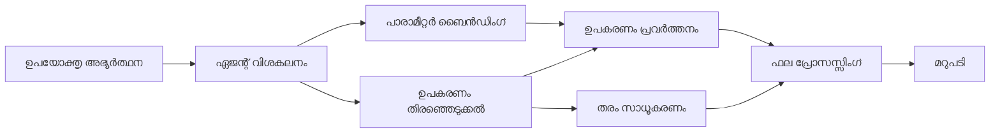

<!--
CO_OP_TRANSLATOR_METADATA:
{
  "original_hash": "91d6061e402489603f2ec8b528cae59b",
  "translation_date": "2025-12-03T16:55:32+00:00",
  "source_file": "04-tool-use/code_samples/04-dotnet-agent-framework.md",
  "language_code": "ml"
}
-->
# 🛠️ GitHub മോഡലുകൾ (.NET) ഉപയോഗിച്ച് ഉയർന്ന നിലവാരത്തിലുള്ള ഉപകരണങ്ങൾ ഉപയോഗിക്കുക

## 📋 പഠന ലക്ഷ്യങ്ങൾ

ഈ നോട്ട്ബുക്ക് Microsoft Agent Framework .NET-ൽ GitHub മോഡലുകൾ ഉപയോഗിച്ച് എന്റർപ്രൈസ്-ഗ്രേഡ് ഉപകരണ സംയോജന മാതൃകകൾ പ്രദർശിപ്പിക്കുന്നു. C#-ന്റെ ശക്തമായ ടൈപ്പിംഗ്, .NET-ന്റെ എന്റർപ്രൈസ് സവിശേഷതകൾ എന്നിവ ഉപയോഗിച്ച് നിരവധി പ്രത്യേക ഉപകരണങ്ങളുള്ള സങ്കീർണ്ണമായ ഏജന്റുമാരെ നിർമ്മിക്കാൻ നിങ്ങൾ പഠിക്കും.

### നിങ്ങൾ കൈവരിക്കേണ്ട ഉയർന്ന നിലവാരത്തിലുള്ള ഉപകരണ കഴിവുകൾ

- 🔧 **മൾട്ടി-ടൂൾ ആർക്കിടെക്ചർ**: നിരവധി പ്രത്യേക കഴിവുകളുള്ള ഏജന്റുമാരെ നിർമ്മിക്കുക  
- 🎯 **ടൈപ്പ്-സേഫ് ടൂൾ എക്സിക്യൂഷൻ**: C#-ന്റെ കമ്പൈൽ-ടൈം വാലിഡേഷൻ ഉപയോഗിക്കുക  
- 📊 **എന്റർപ്രൈസ് ടൂൾ മാതൃകകൾ**: ഉത്പാദന-തലത്തിലുള്ള ഉപകരണ രൂപകൽപ്പനയും പിശക് കൈകാര്യം ചെയ്യലും  
- 🔗 **ടൂൾ കോംപോസിഷൻ**: സങ്കീർണ്ണമായ ബിസിനസ് പ്രവൃത്തി പ്രവാഹങ്ങൾക്കായി ഉപകരണങ്ങൾ സംയോജിപ്പിക്കുക  

## 🎯 .NET ടൂൾ ആർക്കിടെക്ചർ ഗുണങ്ങൾ

### എന്റർപ്രൈസ് ടൂൾ സവിശേഷതകൾ

- **കമ്പൈൽ-ടൈം വാലിഡേഷൻ**: ശക്തമായ ടൈപ്പിംഗ് ഉപകരണ പാരാമീറ്റർ ശരിവരുത്തൽ ഉറപ്പാക്കുന്നു  
- **ഡിപെൻഡൻസി ഇഞ്ചക്ഷൻ**: IoC കണ്ടെയ്‌നർ സംയോജനം ഉപകരണ മാനേജ്മെന്റിനായി  
- **Async/Await മാതൃകകൾ**: ശരിയായ റിസോഴ്സ് മാനേജ്മെന്റോടെ ബ്ലോക്കിംഗ് ഇല്ലാത്ത ഉപകരണ പ്രവർത്തനം  
- **സ്ട്രക്ചർഡ് ലോഗിംഗ്**: ഉപകരണ പ്രവർത്തന നിരീക്ഷണത്തിനായി ബിൽറ്റ്-ഇൻ ലോഗിംഗ് സംയോജനം  

### ഉത്പാദന-തലത്തിലുള്ള മാതൃകകൾ

- **എക്സെപ്ഷൻ ഹാൻഡ്ലിംഗ്**: ടൈപ്പുചെയ്ത എക്സെപ്ഷനുകളുള്ള സമഗ്രമായ പിശക് മാനേജ്മെന്റ്  
- **റിസോഴ്സ് മാനേജ്മെന്റ്**: ശരിയായ ഡിസ്പോസൽ മാതൃകകളും മെമ്മറി മാനേജ്മെന്റും  
- **പ്രകടന നിരീക്ഷണം**: ബിൽറ്റ്-ഇൻ മെട്രിക്സ്, പ്രകടന കൗണ്ടറുകൾ  
- **കോണ്ഫിഗറേഷൻ മാനേജ്മെന്റ്**: വാലിഡേഷനോടുകൂടിയ ടൈപ്പ്-സേഫ് കോൺഫിഗറേഷൻ  

## 🔧 സാങ്കേതിക ആർക്കിടെക്ചർ

### കോർ .NET ടൂൾ ഘടകങ്ങൾ

- **Microsoft.Extensions.AI**: ഏകീകൃത ഉപകരണ അബ്സ്ട്രാക്ഷൻ ലെയർ  
- **Microsoft.Agents.AI**: എന്റർപ്രൈസ്-ഗ്രേഡ് ടൂൾ ഓർക്കസ്ട്രേഷൻ  
- **GitHub മോഡലുകൾ സംയോജനം**: ഹൈ-പെർഫോമൻസ് API ക്ലയന്റ് കണക്ഷൻ പൂളിംഗ് ഉപയോഗിച്ച്  

### ടൂൾ എക്സിക്യൂഷൻ പൈപ്പ്‌ലൈൻ


## 🛠️ ടൂൾ വിഭാഗങ്ങളും മാതൃകകളും

### 1. **ഡാറ്റ പ്രോസസ്സിംഗ് ടൂളുകൾ**

- **ഇൻപുട്ട് വാലിഡേഷൻ**: ഡാറ്റ അനോട്ടേഷനുകളുള്ള ശക്തമായ ടൈപ്പിംഗ്  
- **ട്രാൻസ്ഫോം ഓപ്പറേഷനുകൾ**: ടൈപ്പ്-സേഫ് ഡാറ്റ പരിവർത്തനവും ഫോർമാറ്റിംഗും  
- **ബിസിനസ് ലജിക്**: ഡൊമെയ്ൻ-സ്പെസിഫിക് കണക്കുകൂട്ടലും വിശകലന ഉപകരണങ്ങളും  
- **ഔട്ട്പുട്ട് ഫോർമാറ്റിംഗ്**: സ്ട്രക്ചർഡ് റെസ്പോൺസ് ജനറേഷൻ  

### 2. **ഇന്റഗ്രേഷൻ ടൂളുകൾ** 

- **API കണക്ടറുകൾ**: HttpClient ഉപയോഗിച്ച് RESTful സർവീസ് സംയോജനം  
- **ഡാറ്റാബേസ് ടൂളുകൾ**: ഡാറ്റ ആക്സസിനായി Entity Framework സംയോജനം  
- **ഫയൽ ഓപ്പറേഷനുകൾ**: വാലിഡേഷനോടുകൂടിയ സുരക്ഷിതമായ ഫയൽ സിസ്റ്റം പ്രവർത്തനങ്ങൾ  
- **ബാഹ്യ സേവനങ്ങൾ**: മൂന്നാം കക്ഷി സേവന സംയോജന മാതൃകകൾ  

### 3. **ഉപയോഗ ഉപകരണങ്ങൾ**

- **ടെക്സ്റ്റ് പ്രോസസ്സിംഗ്**: സ്ട്രിംഗ് മാനിപ്പുലേഷൻ, ഫോർമാറ്റിംഗ് ഉപകരണങ്ങൾ  
- **ഡേറ്റ്/ടൈം ഓപ്പറേഷനുകൾ**: സംസ്കാര-അറിയുന്ന ഡേറ്റ്/ടൈം കണക്കുകൂട്ടലുകൾ  
- **ഗണിത ഉപകരണങ്ങൾ**: കൃത്യതയുള്ള കണക്കുകൂട്ടലുകളും സ്ഥിതിവിവര കണക്കുകളും  
- **വാലിഡേഷൻ ടൂളുകൾ**: ബിസിനസ് റൂൾ വാലിഡേഷനും ഡാറ്റ ശരിവരുത്തലും  

എന്റർപ്രൈസ്-ഗ്രേഡ് ഏജന്റുമാരെ ശക്തമായ, ടൈപ്പ്-സേഫ് ടൂൾ കഴിവുകളോടെ .NET-ൽ നിർമ്മിക്കാൻ തയ്യാറാണോ? പ്രൊഫഷണൽ-ഗ്രേഡ് പരിഹാരങ്ങൾ ആർക്കിടെക്റ്റ് ചെയ്യാം! 🏢⚡  

## 🚀 ആരംഭിക്കുക

### ആവശ്യമായവ

- [.NET 10 SDK](https://dotnet.microsoft.com/download/dotnet/10.0) അല്ലെങ്കിൽ അതിനുമുകളിൽ  
- [GitHub മോഡലുകൾ API ആക്സസ് ടോക്കൺ](https://docs.github.com/github-models/github-models-at-scale/using-your-own-api-keys-in-github-models)  

### ആവശ്യമായ പരിസ്ഥിതി വേരിയബിളുകൾ

```bash
# zsh/bash
export GH_TOKEN=<your_github_token>
export GH_ENDPOINT=https://models.github.ai/inference
export GH_MODEL_ID=openai/gpt-5-mini
```
  
```powershell
# പവർഷെൽ
$env:GH_TOKEN = "<your_github_token>"
$env:GH_ENDPOINT = "https://models.github.ai/inference"
$env:GH_MODEL_ID = "openai/gpt-5-mini"
```
  
### സാമ്പിൾ കോഡ്

കോഡ് ഉദാഹരണം പ്രവർത്തിപ്പിക്കാൻ,

```bash
# zsh/bash
chmod +x ./04-dotnet-agent-framework.cs
./04-dotnet-agent-framework.cs
```
  
അല്ലെങ്കിൽ dotnet CLI ഉപയോഗിച്ച്:

```bash
dotnet run ./04-dotnet-agent-framework.cs
```
  
സമ്പൂർണ്ണ കോഡിനായി [`04-dotnet-agent-framework.cs`](../../../../04-tool-use/code_samples/04-dotnet-agent-framework.cs) കാണുക.

```csharp
#!/usr/bin/dotnet run

#:package Microsoft.Extensions.AI@10.*
#:package Microsoft.Agents.AI.OpenAI@1.*-*

using System.ClientModel;
using System.ComponentModel;

using Microsoft.Agents.AI;
using Microsoft.Extensions.AI;

using OpenAI;

// Tool Function: Random Destination Generator
// This static method will be available to the agent as a callable tool
// The [Description] attribute helps the AI understand when to use this function
// This demonstrates how to create custom tools for AI agents
[Description("Provides a random vacation destination.")]
static string GetRandomDestination()
{
    // List of popular vacation destinations around the world
    // The agent will randomly select from these options
    var destinations = new List<string>
    {
        "Paris, France",
        "Tokyo, Japan",
        "New York City, USA",
        "Sydney, Australia",
        "Rome, Italy",
        "Barcelona, Spain",
        "Cape Town, South Africa",
        "Rio de Janeiro, Brazil",
        "Bangkok, Thailand",
        "Vancouver, Canada"
    };

    // Generate random index and return selected destination
    // Uses System.Random for simple random selection
    var random = new Random();
    int index = random.Next(destinations.Count);
    return destinations[index];
}

// Extract configuration from environment variables
// Retrieve the GitHub Models API endpoint, defaults to https://models.github.ai/inference if not specified
// Retrieve the model ID, defaults to openai/gpt-5-mini if not specified
// Retrieve the GitHub token for authentication, throws exception if not specified
var github_endpoint = Environment.GetEnvironmentVariable("GH_ENDPOINT") ?? "https://models.github.ai/inference";
var github_model_id = Environment.GetEnvironmentVariable("GH_MODEL_ID") ?? "openai/gpt-5-mini";
var github_token = Environment.GetEnvironmentVariable("GH_TOKEN") ?? throw new InvalidOperationException("GH_TOKEN is not set.");

// Configure OpenAI Client Options
// Create configuration options to point to GitHub Models endpoint
// This redirects OpenAI client calls to GitHub's model inference service
var openAIOptions = new OpenAIClientOptions()
{
    Endpoint = new Uri(github_endpoint)
};

// Initialize OpenAI Client with GitHub Models Configuration
// Create OpenAI client using GitHub token for authentication
// Configure it to use GitHub Models endpoint instead of OpenAI directly
var openAIClient = new OpenAIClient(new ApiKeyCredential(github_token), openAIOptions);

// Define Agent Identity and Comprehensive Instructions
// Agent name for identification and logging purposes
var AGENT_NAME = "TravelAgent";

// Detailed instructions that define the agent's personality, capabilities, and behavior
// This system prompt shapes how the agent responds and interacts with users
var AGENT_INSTRUCTIONS = """
You are a helpful AI Agent that can help plan vacations for customers.

Important: When users specify a destination, always plan for that location. Only suggest random destinations when the user hasn't specified a preference.

When the conversation begins, introduce yourself with this message:
"Hello! I'm your TravelAgent assistant. I can help plan vacations and suggest interesting destinations for you. Here are some things you can ask me:
1. Plan a day trip to a specific location
2. Suggest a random vacation destination
3. Find destinations with specific features (beaches, mountains, historical sites, etc.)
4. Plan an alternative trip if you don't like my first suggestion

What kind of trip would you like me to help you plan today?"

Always prioritize user preferences. If they mention a specific destination like "Bali" or "Paris," focus your planning on that location rather than suggesting alternatives.
""";

// Create AI Agent with Advanced Travel Planning Capabilities
// Initialize complete agent pipeline: OpenAI client → Chat client → AI agent
// Configure agent with name, detailed instructions, and available tools
// This demonstrates the .NET agent creation pattern with full configuration
AIAgent agent = openAIClient
    .GetChatClient(github_model_id)
    .CreateAIAgent(
        name: AGENT_NAME,
        instructions: AGENT_INSTRUCTIONS,
        tools: [AIFunctionFactory.Create(GetRandomDestination)]
    );

// Create New Conversation Thread for Context Management
// Initialize a new conversation thread to maintain context across multiple interactions
// Threads enable the agent to remember previous exchanges and maintain conversational state
// This is essential for multi-turn conversations and contextual understanding
AgentThread thread = agent.GetNewThread();

// Execute Agent: First Travel Planning Request
// Run the agent with an initial request that will likely trigger the random destination tool
// The agent will analyze the request, use the GetRandomDestination tool, and create an itinerary
// Using the thread parameter maintains conversation context for subsequent interactions
await foreach (var update in agent.RunStreamingAsync("Plan me a day trip", thread))
{
    await Task.Delay(10);
    Console.Write(update);
}

Console.WriteLine();

// Execute Agent: Follow-up Request with Context Awareness
// Demonstrate contextual conversation by referencing the previous response
// The agent remembers the previous destination suggestion and will provide an alternative
// This showcases the power of conversation threads and contextual understanding in .NET agents
await foreach (var update in agent.RunStreamingAsync("I don't like that destination. Plan me another vacation.", thread))
{
    await Task.Delay(10);
    Console.Write(update);
}
```  

---

<!-- CO-OP TRANSLATOR DISCLAIMER START -->
**അറിയിപ്പ്**:  
ഈ പ്രമാണം AI വിവർത്തന സേവനം [Co-op Translator](https://github.com/Azure/co-op-translator) ഉപയോഗിച്ച് വിവർത്തനം ചെയ്തതാണ്. ഞങ്ങൾ കൃത്യതയ്ക്കായി ശ്രമിക്കുന്നുവെങ്കിലും, ഓട്ടോമേറ്റഡ് വിവർത്തനങ്ങളിൽ പിഴവുകൾ അല്ലെങ്കിൽ തെറ്റായ വിവരങ്ങൾ ഉണ്ടാകാൻ സാധ്യതയുണ്ട്. പ്രമാണത്തിന്റെ മാതൃഭാഷയിലുള്ള യഥാർത്ഥ പതിപ്പ് പ്രാമാണികമായ ഉറവിടമായി പരിഗണിക്കണം. നിർണായകമായ വിവരങ്ങൾക്ക്, പ്രൊഫഷണൽ മനുഷ്യ വിവർത്തനം ശുപാർശ ചെയ്യുന്നു. ഈ വിവർത്തനം ഉപയോഗിച്ച് ഉണ്ടാകുന്ന തെറ്റിദ്ധാരണകൾക്കോ തെറ്റായ വ്യാഖ്യാനങ്ങൾക്കോ ഞങ്ങൾ ഉത്തരവാദികളല്ല.
<!-- CO-OP TRANSLATOR DISCLAIMER END -->