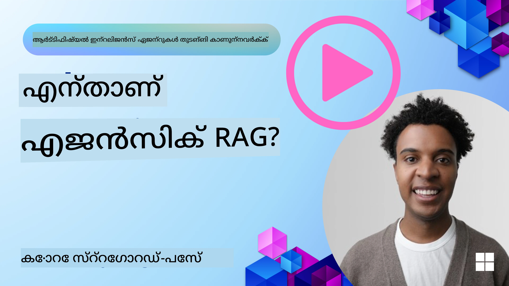

<!--
CO_OP_TRANSLATOR_METADATA:
{
  "original_hash": "0ebf6b2290db55dbf2d10cc49655523b",
  "translation_date": "2025-12-03T15:51:37+00:00",
  "source_file": "05-agentic-rag/README.md",
  "language_code": "ml"
}
-->

> _(മുകളിൽ കാണുന്ന ചിത്രം ക്ലിക്കുചെയ്ത് ഈ പാഠത്തിന്റെ വീഡിയോ കാണുക)_

# ഏജന്റിക് RAG

ഈ പാഠം Agentic Retrieval-Augmented Generation (Agentic RAG) എന്ന പുതിയ AI മാതൃകയെക്കുറിച്ചുള്ള സമഗ്രമായ അവലോകനം നൽകുന്നു. ഇതിൽ വലിയ ഭാഷാ മോഡലുകൾ (LLMs) സ്വയം അവരുടെ അടുത്ത ചുവടുകൾ ആസൂത്രണം ചെയ്യുകയും ബാഹ്യ സ്രോതസ്സുകളിൽ നിന്ന് വിവരങ്ങൾ ശേഖരിക്കുകയും ചെയ്യുന്നു. സ്ഥിരമായ retrieval-then-read മാതൃകകളിൽ നിന്ന് വ്യത്യസ്തമായി, Agentic RAG LLM-ലേക്ക് ആവർത്തനമായുള്ള കോൾസും, ടൂൾ അല്ലെങ്കിൽ ഫംഗ്ഷൻ കോൾസും ഘടനാപരമായ ഔട്ട്പുട്ടുകളും ഉൾക്കൊള്ളുന്നു. സിസ്റ്റം ഫലങ്ങൾ വിലയിരുത്തുകയും, ക്വെറിയുകൾ മെച്ചപ്പെടുത്തുകയും, ആവശ്യമെങ്കിൽ അധിക ടൂളുകൾ ഉപയോഗപ്പെടുത്തുകയും, തൃപ്തികരമായ പരിഹാരം ലഭിക്കുന്നതുവരെ ഈ ചക്രം തുടരുകയും ചെയ്യുന്നു.

## പരിചയം

ഈ പാഠത്തിൽ നിങ്ങൾ പഠിക്കാനിരിക്കുന്നവ:

- **Agentic RAG മനസ്സിലാക്കുക:** വലിയ ഭാഷാ മോഡലുകൾ (LLMs) സ്വയം അവരുടെ അടുത്ത ചുവടുകൾ ആസൂത്രണം ചെയ്യുകയും ബാഹ്യ ഡാറ്റാ സ്രോതസ്സുകളിൽ നിന്ന് വിവരങ്ങൾ ശേഖരിക്കുകയും ചെയ്യുന്ന പുതിയ AI മാതൃകയെക്കുറിച്ച് പഠിക്കുക.
- **Iterative Maker-Checker ശൈലി:** LLM-ലേക്ക് ആവർത്തന കോൾസും, ടൂൾ അല്ലെങ്കിൽ ഫംഗ്ഷൻ കോൾസും ഘടനാപരമായ ഔട്ട്പുട്ടുകളും ഉൾക്കൊള്ളുന്ന ലൂപ്പ്, ശരിയാക്കലിനും തെറ്റായ ക്വെറിയുകൾ കൈകാര്യം ചെയ്യുന്നതിനും രൂപകൽപ്പന ചെയ്തിരിക്കുന്നതിനെക്കുറിച്ച് മനസ്സിലാക്കുക.
- **പ്രായോഗിക പ്രയോഗങ്ങൾ:** ശരിയാക്കൽ പ്രാധാന്യമുള്ള അന്തരീക്ഷങ്ങൾ, സങ്കീർണ്ണമായ ഡാറ്റാബേസ് ഇടപെടലുകൾ, ദീർഘകാല പ്രവർത്തനങ്ങൾ എന്നിവയിൽ Agentic RAG എങ്ങനെ മികച്ചതാണെന്ന് തിരിച്ചറിയുക.

## പഠന ലക്ഷ്യങ്ങൾ

ഈ പാഠം പൂർത്തിയാക്കിയ ശേഷം, നിങ്ങൾക്ക് അറിയാൻ കഴിയുക/മനസ്സിലാക്കുക:

- **Agentic RAG മനസ്സിലാക്കുക:** വലിയ ഭാഷാ മോഡലുകൾ (LLMs) സ്വയം അവരുടെ അടുത്ത ചുവടുകൾ ആസൂത്രണം ചെയ്യുകയും ബാഹ്യ ഡാറ്റാ സ്രോതസ്സുകളിൽ നിന്ന് വിവരങ്ങൾ ശേഖരിക്കുകയും ചെയ്യുന്ന പുതിയ AI മാതൃകയെക്കുറിച്ച് പഠിക്കുക.
- **Iterative Maker-Checker ശൈലി:** ശരിയാക്കലിനും തെറ്റായ ക്വെറിയുകൾ കൈകാര്യം ചെയ്യുന്നതിനും രൂപകൽപ്പന ചെയ്തിരിക്കുന്ന LLM-ലേക്ക് ആവർത്തന കോൾസും, ടൂൾ അല്ലെങ്കിൽ ഫംഗ്ഷൻ കോൾസും ഘടനാപരമായ ഔട്ട്പുട്ടുകളും ഉൾക്കൊള്ളുന്ന ലൂപ്പ് മനസ്സിലാക്കുക.
- **തർക്ക പരിഹാര പ്രക്രിയ കൈകാര്യം ചെയ്യുക:** സിസ്റ്റത്തിന്റെ തർക്ക പരിഹാര പ്രക്രിയ കൈകാര്യം ചെയ്യാനുള്ള കഴിവ് മനസ്സിലാക്കുക, മുൻകൂട്ടി നിർവചിച്ച പാതകളിൽ ആശ്രയിക്കാതെ പ്രശ്നങ്ങൾ എങ്ങനെ സമീപിക്കണമെന്ന് തീരുമാനിക്കുക.
- **Workflow:** ഒരു ഏജന്റിക് മോഡൽ സ്വതന്ത്രമായി മാർക്കറ്റ് ട്രെൻഡ് റിപ്പോർട്ടുകൾ ശേഖരിക്കുകയും, മത്സരക്കാരുടെ ഡാറ്റ തിരിച്ചറിയുകയും, ആന്തരിക വിൽപ്പനാ മെട്രിക്‌സ് ബന്ധിപ്പിക്കുകയും, കണ്ടെത്തലുകൾ സംയോജിപ്പിക്കുകയും, തന്ത്രം വിലയിരുത്തുകയും ചെയ്യുന്നത് എങ്ങനെ മനസ്സിലാക്കുക.
- **Iterative Loops, Tool Integration, and Memory:** ആവർത്തന ലൂപ്പ് ഇടപെടൽ മാതൃകയിൽ സിസ്റ്റം എങ്ങനെ ആശ്രയിക്കുന്നു, ആവർത്തന ലൂപ്പുകൾ ഒഴിവാക്കാൻ സ്റ്റേറ്റ്, മെമ്മറി എന്നിവ എങ്ങനെ നിലനിർത്തുന്നു, വിവരപ്രദമായ തീരുമാനങ്ങൾ എടുക്കുന്നു എന്നിവ പഠിക്കുക.
- **തെറ്റുകൾ കൈകാര്യം ചെയ്യൽ:** സിസ്റ്റത്തിന്റെ ശക്തമായ സ്വയം-ശരിയാക്കൽ സംവിധാനങ്ങൾ, ആവർത്തിച്ച് ക്വെറിയുകൾ ചെയ്യൽ, ഡയഗ്നോസ്റ്റിക് ടൂളുകൾ ഉപയോഗിക്കൽ, മനുഷ്യ മേൽനോട്ടത്തിൽ ആശ്രയിക്കൽ എന്നിവയെക്കുറിച്ച് പഠിക്കുക.
- **Agentic RAG-ന്റെ പരിധികൾ:** ഡൊമെയ്ൻ-സ്പെസിഫിക് സ്വാതന്ത്ര്യം, ഇൻഫ്രാസ്ട്രക്ചർ ആശ്രയം, ഗാർഡ്രെയിലുകൾ എന്നിവയെക്കുറിച്ച് മനസ്സിലാക്കുക.
- **പ്രായോഗിക ഉപയോഗങ്ങൾ:** ശരിയാക്കൽ പ്രാധാന്യമുള്ള അന്തരീക്ഷങ്ങൾ, സങ്കീർണ്ണമായ ഡാറ്റാബേസ് ഇടപെടലുകൾ, ദീർഘകാല പ്രവർത്തനങ്ങൾ എന്നിവയിൽ Agentic RAG എങ്ങനെ മികച്ചതാണെന്ന് തിരിച്ചറിയുക.
- **ഗവേണൻസ്, ട്രാൻസ്പാരൻസി, ട്രസ്റ്റ്:** വിശദീകരണാത്മകമായ തർക്ക പരിഹാരം, ബയാസ് നിയന്ത്രണം, മനുഷ്യ മേൽനോട്ടം എന്നിവയുടെ പ്രാധാന്യം മനസ്സിലാക്കുക.

## Agentic RAG എന്താണ്?

Agentic Retrieval-Augmented Generation (Agentic RAG) എന്നത് ഒരു പുതിയ AI മാതൃകയാണ്, ഇതിൽ വലിയ ഭാഷാ മോഡലുകൾ (LLMs) സ്വയം അവരുടെ അടുത്ത ചുവടുകൾ ആസൂത്രണം ചെയ്യുകയും ബാഹ്യ സ്രോതസ്സുകളിൽ നിന്ന് വിവരങ്ങൾ ശേഖരിക്കുകയും ചെയ്യുന്നു. സ്ഥിരമായ retrieval-then-read മാതൃകകളിൽ നിന്ന് വ്യത്യസ്തമായി, Agentic RAG LLM-ലേക്ക് ആവർത്തന കോൾസും, ടൂൾ അല്ലെങ്കിൽ ഫംഗ്ഷൻ കോൾസും ഘടനാപരമായ ഔട്ട്പുട്ടുകളും ഉൾക്കൊള്ളുന്നു. സിസ്റ്റം ഫലങ്ങൾ വിലയിരുത്തുകയും, ക്വെറിയുകൾ മെച്ചപ്പെടുത്തുകയും, ആവശ്യമെങ്കിൽ അധിക ടൂളുകൾ ഉപയോഗപ്പെടുത്തുകയും, തൃപ്തികരമായ പരിഹാരം ലഭിക്കുന്നതുവരെ ഈ ചക്രം തുടരുകയും ചെയ്യുന്നു. 

ഈ ആവർത്തന "മേക്കർ-ചെക്കർ" ശൈലി ശരിയാക്കലിനും തെറ്റായ ക്വെറിയുകൾ കൈകാര്യം ചെയ്യുന്നതിനും ഉയർന്ന നിലവാരമുള്ള ഫലങ്ങൾ ഉറപ്പാക്കുന്നതിനും രൂപകൽപ്പന ചെയ്തിരിക്കുന്നു. 

## തർക്ക പരിഹാര പ്രക്രിയ കൈകാര്യം ചെയ്യൽ

ഒരു സിസ്റ്റം "ഏജന്റിക്" ആകുന്നതിന്റെ പ്രത്യേക ഗുണം അതിന്റെ തർക്ക പരിഹാര പ്രക്രിയ കൈകാര്യം ചെയ്യാനുള്ള കഴിവാണ്. 

ഉദാഹരണത്തിന്, ഒരു പ്രോഡക്റ്റ് ലോഞ്ച് തന്ത്രം സൃഷ്ടിക്കാൻ ആവശ്യപ്പെട്ടാൽ, അത്:

1. നിലവിലെ മാർക്കറ്റ് ട്രെൻഡ് റിപ്പോർട്ടുകൾ ശേഖരിക്കുക.
2. മത്സരക്കാരുടെ ഡാറ്റ തിരിച്ചറിയുക.
3. ആന്തരിക വിൽപ്പനാ മെട്രിക്‌സ് ബന്ധിപ്പിക്കുക.
4. കണ്ടെത്തലുകൾ സംയോജിപ്പിക്കുക.
5. തന്ത്രം വിലയിരുത്തുക.

ഈ എല്ലാ ചുവടുകളും മോഡലാണ് സ്വയം തീരുമാനിക്കുന്നത്, മനുഷ്യൻ മുൻകൂട്ടി നിർവചിച്ച പാതകളിൽ ആശ്രയിക്കാതെ.

## Iterative Loops, Tool Integration, and Memory

Agentic RAG ഒരു ലൂപ്പ് ചെയ്ത ഇടപെടൽ മാതൃകയിൽ പ്രവർത്തിക്കുന്നു:

- **ആദ്യ കോൾ:** ഉപയോക്താവിന്റെ ലക്ഷ്യം LLM-ലേക്ക് നൽകുന്നു.
- **ടൂൾ ഉപയോഗം:** ആവശ്യമായ വിവരങ്ങൾ കണ്ടെത്താൻ ടൂളുകൾ തിരഞ്ഞെടുക്കുന്നു.
- **വിലയിരുത്തൽ & മെച്ചപ്പെടുത്തൽ:** ലഭിച്ച ഡാറ്റ വിലയിരുത്തി, ആവശ്യമെങ്കിൽ ക്വെറിയുകൾ മെച്ചപ്പെടുത്തുന്നു.
- **തൃപ്തി വരെ ആവർത്തിക്കുക:** സിസ്റ്റം തൃപ്തികരമായ ഫലം ലഭിക്കുന്നതുവരെ ഈ പ്രക്രിയ തുടരുന്നു.
- **മെമ്മറി & സ്റ്റേറ്റ്:** സിസ്റ്റം സ്റ്റേറ്റ്, മെമ്മറി എന്നിവ നിലനിർത്തുന്നു.

ഈ പ്രക്രിയ സങ്കീർണ്ണമായ, മൾട്ടി-സ്റ്റെപ്പ് ടാസ്കുകൾ കൈകാര്യം ചെയ്യാൻ സഹായിക്കുന്നു.

## പരാജയങ്ങൾ കൈകാര്യം ചെയ്യൽ

Agentic RAG-ന്റെ സ്വാതന്ത്ര്യം ശക്തമായ സ്വയം-ശരിയാക്കൽ സംവിധാനങ്ങൾ ഉൾക്കൊള്ളുന്നു. 

- **Iterate and Re-Query:** മോഡൽ പുതിയ തിരച്ചിൽ തന്ത്രങ്ങൾ പരീക്ഷിക്കുന്നു.
- **Diagnostic Tools ഉപയോഗിക്കുക:** ഡയഗ്നോസ്റ്റിക് ടൂളുകൾ ഉപയോഗിച്ച് ഡാറ്റ ശരിയാണെന്ന് ഉറപ്പാക്കുന്നു.
- **മനുഷ്യ മേൽനോട്ടം:** ആവശ്യമെങ്കിൽ മനുഷ്യ സഹായം അഭ്യർത്ഥിക്കുന്നു.

ഈ പ്രക്രിയ മോഡലിനെ തുടർച്ചയായി മെച്ചപ്പെടുത്താൻ സഹായിക്കുന്നു.

## ഏജൻസിയുടെ പരിധികൾ

Agentic RAG-ന്റെ "ഏജന്റിക്" കഴിവുകൾ മനുഷ്യൻ നിർവചിച്ച ഉപകരണങ്ങൾ, ഡാറ്റാ സ്രോതസ്സുകൾ, നയങ്ങൾ എന്നിവയിൽ മാത്രം പരിമിതമാണ്. 

1. **ഡൊമെയ്ൻ-സ്പെസിഫിക് സ്വാതന്ത്ര്യം:** ഉപയോക്താവിന്റെ ലക്ഷ്യങ്ങൾ നേടാൻ ശ്രദ്ധ കേന്ദ്രീകരിക്കുന്നു.
2. **ഇൻഫ്രാസ്ട്രക്ചർ ആശ്രയം:** സിസ്റ്റത്തിന്റെ കഴിവുകൾ വികസിപ്പിച്ചെടുത്ത ഉപകരണങ്ങൾ, ഡാറ്റ എന്നിവയിൽ ആശ്രയിക്കുന്നു.
3. **ഗാർഡ്രെയിലുകൾ:** എതിക്കൽ മാർഗ്ഗനിർദ്ദേശങ്ങൾ, നിയമാനുസൃത ചട്ടങ്ങൾ എന്നിവ പാലിക്കുന്നു.

## പ്രായോഗിക ഉപയോഗങ്ങൾ

Agentic RAG താഴെപ്പറയുന്ന സാഹചര്യങ്ങളിൽ മികച്ചതാണ്:

1. **ശരിയാക്കൽ പ്രാധാന്യമുള്ള അന്തരീക്ഷങ്ങൾ:** നിയമ ഗവേഷണം, റെഗുലേറ്ററി അനാലിസിസ് എന്നിവയിൽ.
2. **സങ്കീർണ്ണ ഡാറ്റാബേസ് ഇടപെടലുകൾ:** ക്വെറിയുകൾ സ്വതന്ത്രമായി മെച്ചപ്പെടുത്തുന്നു.
3. **ദീർഘകാല പ്രവർത്തനങ്ങൾ:** പുതിയ വിവരങ്ങൾ ഉൾക്കൊള്ളുന്നു.

## ഗവേണൻസ്, ട്രാൻസ്പാരൻസി, ട്രസ്റ്റ്

ഈ സിസ്റ്റങ്ങൾ കൂടുതൽ സ്വതന്ത്രമാകുന്നതിനാൽ ഗവേണൻസ്, ട്രാൻസ്പാരൻസി എന്നിവ നിർണായകമാണ്:

- **വിവരണാത്മകമായ തർക്ക പരിഹാരം:** സിസ്റ്റം എടുത്ത നടപടികളുടെ രേഖ നൽകുന്നു.
- **ബയാസ് നിയന്ത്രണം:** ഡാറ്റാ സ്രോതസ്സുകൾ ശരിയായി പ്രതിനിധീകരിക്കുന്നുവെന്ന് ഉറപ്പാക്കുന്നു.
- **മനുഷ്യ മേൽനോട്ടം:** സംവേദനാത്മകമായ തീരുമാനങ്ങളിൽ മനുഷ്യ മേൽനോട്ടം നിർണായകമാണ്.

## സമാപനം

Agentic RAG സങ്കീർണ്ണമായ, ഡാറ്റാ-ഇന്റൻസീവ് ടാസ്കുകൾ കൈകാര്യം ചെയ്യുന്നതിൽ AI സിസ്റ്റങ്ങൾ എങ്ങനെ വികസിക്കുന്നു എന്നതിന്റെ സ്വാഭാവിക പരിണാമമാണ്. 

### Agentic RAG-നെക്കുറിച്ച് കൂടുതൽ ചോദ്യങ്ങളുണ്ടോ?

മറ്റു പഠിതാക്കളുമായി ചർച്ച ചെയ്യാനും, ഓഫീസ് മണിക്കൂറുകളിൽ പങ്കെടുക്കാനും, നിങ്ങളുടെ AI ഏജന്റുകളുമായി ബന്ധപ്പെട്ട ചോദ്യങ്ങൾക്ക് ഉത്തരം ലഭിക്കാനും [Azure AI Foundry Discord](https://aka.ms/ai-agents/discord) ചേരുക.

## അധിക റിസോഴ്സുകൾ

- <a href="https://learn.microsoft.com/training/modules/use-own-data-azure-openai" target="_blank">Azure OpenAI Service ഉപയോഗിച്ച് Retrieval Augmented Generation (RAG) നടപ്പിലാക്കുക: നിങ്ങളുടെ സ്വന്തം ഡാറ്റ Azure OpenAI Service ഉപയോഗിച്ച് എങ്ങനെ ഉപയോഗിക്കാമെന്ന് പഠിക്കുക. ഈ Microsoft Learn മോഡ്യൂൾ RAG നടപ്പിലാക്കുന്നതിനെക്കുറിച്ചുള്ള സമഗ്രമായ മാർഗ്ഗനിർദ്ദേശം നൽകുന്നു</a>
- <a href="https://learn.microsoft.com/azure/ai-studio/concepts/evaluation-approach-gen-ai" target="_blank">Azure AI Foundry ഉപയോഗിച്ച് ജനറേറ്റീവ് AI അപ്ലിക്കേഷനുകളുടെ മൂല്യനിർണ്ണയം: പൊതുവായി ലഭ്യമായ ഡാറ്റാസെറ്റുകളിൽ മോഡലുകളുടെ മൂല്യനിർണ്ണയവും താരതമ്യവും ഉൾക്കൊള്ളുന്നു</a>
- <a href="https://weaviate.io/blog/what-is-agentic-rag" target="_blank">What is Agentic RAG | Weaviate</a>
- <a href="https://ragaboutit.com/agentic-rag-a-complete-guide-to-agent-based-retrieval-augmented-generation/" target="_blank">Agentic RAG: ഏജന്റ് അടിസ്ഥാനമാക്കിയുള്ള Retrieval Augmented Generation-ന്റെ സമഗ്രമായ മാർഗ്ഗനിർദ്ദേശം – Generation RAG-ൽ നിന്നുള്ള വാർത്ത</a>
- <a href="https://huggingface.co/learn/cookbook/agent_rag" target="_blank">Agentic RAG: നിങ്ങളുടെ RAG-നെ query reformulation, self-query എന്നിവയിലൂടെ വേഗത്തിലാക്കുക! Hugging Face Open-Source AI Cookbook</a>
- <a href="https://youtu.be/aQ4yQXeB1Ss?si=2HUqBzHoeB5tR04U" target="_blank">RAG-ൽ Agentic Layers ചേർക്കൽ</a>
- <a href="https://www.youtube.com/watch?v=zeAyuLc_f3Q&t=244s" target="_blank">ജ്ഞാന സഹായികളുടെ ഭാവി: Jerry Liu</a>
- <a href="https://www.youtube.com/watch?v=AOSjiXP1jmQ" target="_blank">Agentic RAG സിസ്റ്റങ്ങൾ എങ്ങനെ നിർമ്മിക്കാം</a>
- <a href="https://ignite.microsoft.com/sessions/BRK102?source=sessions" target="_blank">Azure AI Foundry Agent Service ഉപയോഗിച്ച് നിങ്ങളുടെ AI ഏജന്റുമാരെ സ്കെയിൽ ചെയ്യുക</a>

### അക്കാദമിക് പേപ്പറുകൾ

- <a href="https://arxiv.org/abs/2303.17651" target="_blank">2303.17651 Self-Refine: Self-Feedback ഉപയോഗിച്ച് Iterative Refinement</a>
- <a href="https://arxiv.org/abs/2303.11366" target="_blank">2303.11366 Reflexion: Verbal Reinforcement Learning ഉള്ള Language Agents</a>
- <a href="https://arxiv.org/abs/2305.11738" target="_blank">2305.11738 CRITIC: Tool-Interactive Critiquing ഉപയോഗിച്ച് Large Language Models സ്വയം തിരുത്താൻ കഴിയും</a>
- <a href="https://arxiv.org/abs/2501.09136" target="_blank">2501.09136 Agentic Retrieval-Augmented Generation: Agentic RAG-ൽ ഒരു സർവേ</a>

## മുൻപത്തെ പാഠം

[Tool Use Design Pattern](../04-tool-use/README.md)

## അടുത്ത പാഠം

[Building Trustworthy AI Agents](../06-building-trustworthy-agents/README.md)

---

<!-- CO-OP TRANSLATOR DISCLAIMER START -->
**അസത്യവാദം**:  
ഈ രേഖ AI വിവർത്തന സേവനമായ [Co-op Translator](https://github.com/Azure/co-op-translator) ഉപയോഗിച്ച് വിവർത്തനം ചെയ്തതാണ്. കൃത്യതയ്ക്കായി ഞങ്ങൾ ശ്രമിക്കുന്നുവെങ്കിലും, ഓട്ടോമേറ്റഡ് വിവർത്തനങ്ങളിൽ പിശകുകൾ അല്ലെങ്കിൽ തെറ്റായ വിവരങ്ങൾ ഉണ്ടാകാൻ സാധ്യതയുണ്ട്. അതിന്റെ സ്വാഭാവിക ഭാഷയിലുള്ള മൂല രേഖ പ്രാമാണികമായ ഉറവിടമായി കണക്കാക്കണം. നിർണായകമായ വിവരങ്ങൾക്ക്, പ്രൊഫഷണൽ മനുഷ്യ വിവർത്തനം ശുപാർശ ചെയ്യുന്നു. ഈ വിവർത്തനം ഉപയോഗിക്കുന്നതിൽ നിന്നുണ്ടാകുന്ന തെറ്റിദ്ധാരണകൾക്കോ തെറ്റായ വ്യാഖ്യാനങ്ങൾക്കോ ഞങ്ങൾ ഉത്തരവാദികളല്ല.
<!-- CO-OP TRANSLATOR DISCLAIMER END -->