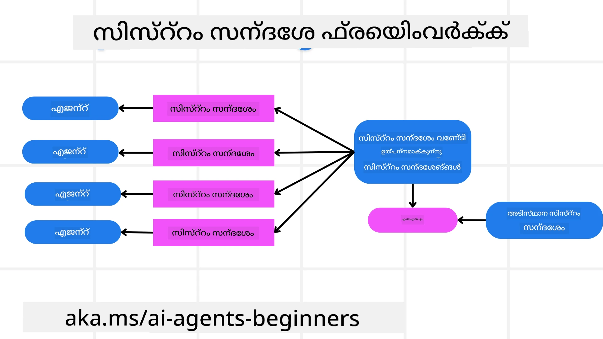
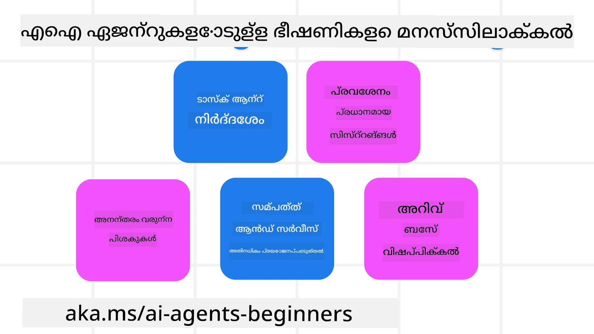
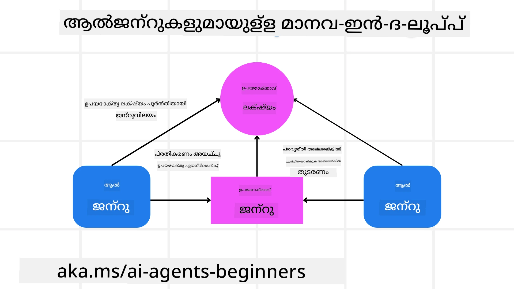

<!--
CO_OP_TRANSLATOR_METADATA:
{
  "original_hash": "498802b4c3c3cc486b86f27a12cebb34",
  "translation_date": "2025-12-03T16:01:08+00:00",
  "source_file": "06-building-trustworthy-agents/README.md",
  "language_code": "ml"
}
-->
[](https://youtu.be/iZKkMEGBCUQ?si=Q-kEbcyHUMPoHp8L)

> _(ഈ പാഠത്തിന്റെ വീഡിയോ കാണാൻ മുകളിൽ കാണുന്ന ചിത്രം ക്ലിക്ക് ചെയ്യുക)_

# വിശ്വസനീയമായ AI ഏജന്റുകൾ നിർമ്മിക്കൽ

## പരിചയം

ഈ പാഠത്തിൽ ഉൾപ്പെടുന്നത്:

- സുരക്ഷിതവും ഫലപ്രദവുമായ AI ഏജന്റുകൾ എങ്ങനെ നിർമ്മിക്കാം, വിന്യസിക്കാം.
- AI ഏജന്റുകൾ വികസിപ്പിക്കുമ്പോൾ പ്രധാനമായ സുരക്ഷാ പരിഗണനകൾ.
- ഡാറ്റയും ഉപയോക്തൃ സ്വകാര്യതയും എങ്ങനെ സംരക്ഷിക്കാം.

## പഠന ലക്ഷ്യങ്ങൾ

ഈ പാഠം പൂർത്തിയാക്കിയ ശേഷം, നിങ്ങൾക്ക് അറിയാം:

- AI ഏജന്റുകൾ സൃഷ്ടിക്കുമ്പോൾ അപകടങ്ങൾ തിരിച്ചറിയുകയും കുറയ്ക്കുകയും ചെയ്യുക.
- ഡാറ്റയും ആക്സസും ശരിയായി കൈകാര്യം ചെയ്യാൻ സുരക്ഷാ നടപടികൾ നടപ്പിലാക്കുക.
- ഡാറ്റാ സ്വകാര്യത സംരക്ഷിക്കുകയും ഗുണമേന്മയുള്ള ഉപയോക്തൃ അനുഭവം നൽകുകയും ചെയ്യുന്ന AI ഏജന്റുകൾ സൃഷ്ടിക്കുക.

## സുരക്ഷ

സുരക്ഷിതമായ ഏജന്റിക് ആപ്ലിക്കേഷനുകൾ നിർമ്മിക്കുന്നതിനെക്കുറിച്ച് ആദ്യം നോക്കാം. സുരക്ഷ എന്നത് AI ഏജന്റ് രൂപകൽപ്പന ചെയ്തതുപോലെ പ്രവർത്തിക്കുന്നതാണെന്ന് ഉറപ്പാക്കലാണ്. ഏജന്റിക് ആപ്ലിക്കേഷനുകളുടെ നിർമ്മാതാക്കളായ ഞങ്ങൾക്ക് സുരക്ഷ പരമാവധി ഉറപ്പാക്കാൻ മാർഗങ്ങളും ഉപകരണങ്ങളും ഉണ്ട്:

### സിസ്റ്റം മെസേജ് ഫ്രെയിംവർക്ക് നിർമ്മിക്കൽ

നിങ്ങൾ Large Language Models (LLMs) ഉപയോഗിച്ച് ഒരു AI ആപ്ലിക്കേഷൻ നിർമ്മിച്ചിട്ടുണ്ടെങ്കിൽ, ഒരു ശക്തമായ സിസ്റ്റം പ്രോംപ്റ്റ് അല്ലെങ്കിൽ സിസ്റ്റം മെസേജ് രൂപകൽപ്പനയുടെ പ്രാധാന്യം നിങ്ങൾക്ക് അറിയാം. ഈ പ്രോംപ്റ്റുകൾ LLM ഉപയോക്താവിനോടും ഡാറ്റയോടും എങ്ങനെ ഇടപെടും എന്നതിന്റെ മെടാ നിയമങ്ങളും നിർദ്ദേശങ്ങളും മാർഗനിർദ്ദേശങ്ങളും സ്ഥാപിക്കുന്നു.

AI ഏജന്റുകൾക്കായി, സിസ്റ്റം പ്രോംപ്റ്റ് കൂടുതൽ പ്രധാനമാണ്, കാരണം AI ഏജന്റുകൾക്ക് ഞങ്ങൾ രൂപകൽപ്പന ചെയ്തിരിക്കുന്ന പ്രവർത്തനങ്ങൾ പൂർത്തിയാക്കാൻ വളരെ പ്രത്യേകമായ നിർദ്ദേശങ്ങൾ ആവശ്യമുണ്ട്.

സ്കെയിലബിൾ സിസ്റ്റം പ്രോംപ്റ്റുകൾ സൃഷ്ടിക്കാൻ, ഞങ്ങളുടെ ആപ്ലിക്കേഷനിൽ ഒരു അല്ലെങ്കിൽ കൂടുതൽ ഏജന്റുകൾ നിർമ്മിക്കാൻ ഒരു സിസ്റ്റം മെസേജ് ഫ്രെയിംവർക്ക് ഉപയോഗിക്കാം:



#### ഘട്ടം 1: ഒരു മെടാ സിസ്റ്റം മെസേജ് സൃഷ്ടിക്കുക

മെടാ പ്രോംപ്റ്റ്, ഞങ്ങൾ സൃഷ്ടിക്കുന്ന ഏജന്റുകൾക്കായുള്ള സിസ്റ്റം പ്രോംപ്റ്റുകൾ സൃഷ്ടിക്കാൻ ഒരു LLM ഉപയോഗിക്കും. ഇത് ഒരു ടെംപ്ലേറ്റായി രൂപകൽപ്പന ചെയ്യുന്നു, അതിനാൽ ആവശ്യമെങ്കിൽ നിരവധി ഏജന്റുകൾ എളുപ്പത്തിൽ സൃഷ്ടിക്കാനാകും.

ഇവിടെ ഒരു ഉദാഹരണ മെടാ സിസ്റ്റം മെസേജ്:

```plaintext
You are an expert at creating AI agent assistants. 
You will be provided a company name, role, responsibilities and other
information that you will use to provide a system prompt for.
To create the system prompt, be descriptive as possible and provide a structure that a system using an LLM can better understand the role and responsibilities of the AI assistant. 
```

#### ഘട്ടം 2: ഒരു അടിസ്ഥാന പ്രോംപ്റ്റ് സൃഷ്ടിക്കുക

അടുത്ത ഘട്ടം AI ഏജന്റിനെ വിവരണം ചെയ്യുന്നതിനുള്ള ഒരു അടിസ്ഥാന പ്രോംപ്റ്റ് സൃഷ്ടിക്കുകയാണ്. ഏജന്റിന്റെ പദവി, ഏജന്റ് പൂർത്തിയാക്കേണ്ട പ്രവർത്തനങ്ങൾ, ഏജന്റിന്റെ മറ്റ് ഉത്തരവാദിത്തങ്ങൾ എന്നിവ ഉൾപ്പെടുത്തണം.

ഇവിടെ ഒരു ഉദാഹരണം:

```plaintext
You are a travel agent for Contoso Travel that is great at booking flights for customers. To help customers you can perform the following tasks: lookup available flights, book flights, ask for preferences in seating and times for flights, cancel any previously booked flights and alert customers on any delays or cancellations of flights.  
```

#### ഘട്ടം 3: അടിസ്ഥാന സിസ്റ്റം മെസേജ് LLM-നു നൽകുക

ഇപ്പോൾ, മെടാ സിസ്റ്റം മെസേജിനെ സിസ്റ്റം മെസേജായും നമ്മുടെ അടിസ്ഥാന സിസ്റ്റം മെസേജിനെയും നൽകിക്കൊണ്ട് ഈ സിസ്റ്റം മെസേജ് മെച്ചപ്പെടുത്താം.

ഇത് ഞങ്ങളുടെ AI ഏജന്റുകളെ നയിക്കാൻ കൂടുതൽ അനുയോജ്യമായ ഒരു സിസ്റ്റം മെസേജ് സൃഷ്ടിക്കും:

```markdown
**Company Name:** Contoso Travel  
**Role:** Travel Agent Assistant

**Objective:**  
You are an AI-powered travel agent assistant for Contoso Travel, specializing in booking flights and providing exceptional customer service. Your main goal is to assist customers in finding, booking, and managing their flights, all while ensuring that their preferences and needs are met efficiently.

**Key Responsibilities:**

1. **Flight Lookup:**
    
    - Assist customers in searching for available flights based on their specified destination, dates, and any other relevant preferences.
    - Provide a list of options, including flight times, airlines, layovers, and pricing.
2. **Flight Booking:**
    
    - Facilitate the booking of flights for customers, ensuring that all details are correctly entered into the system.
    - Confirm bookings and provide customers with their itinerary, including confirmation numbers and any other pertinent information.
3. **Customer Preference Inquiry:**
    
    - Actively ask customers for their preferences regarding seating (e.g., aisle, window, extra legroom) and preferred times for flights (e.g., morning, afternoon, evening).
    - Record these preferences for future reference and tailor suggestions accordingly.
4. **Flight Cancellation:**
    
    - Assist customers in canceling previously booked flights if needed, following company policies and procedures.
    - Notify customers of any necessary refunds or additional steps that may be required for cancellations.
5. **Flight Monitoring:**
    
    - Monitor the status of booked flights and alert customers in real-time about any delays, cancellations, or changes to their flight schedule.
    - Provide updates through preferred communication channels (e.g., email, SMS) as needed.

**Tone and Style:**

- Maintain a friendly, professional, and approachable demeanor in all interactions with customers.
- Ensure that all communication is clear, informative, and tailored to the customer's specific needs and inquiries.

**User Interaction Instructions:**

- Respond to customer queries promptly and accurately.
- Use a conversational style while ensuring professionalism.
- Prioritize customer satisfaction by being attentive, empathetic, and proactive in all assistance provided.

**Additional Notes:**

- Stay updated on any changes to airline policies, travel restrictions, and other relevant information that could impact flight bookings and customer experience.
- Use clear and concise language to explain options and processes, avoiding jargon where possible for better customer understanding.

This AI assistant is designed to streamline the flight booking process for customers of Contoso Travel, ensuring that all their travel needs are met efficiently and effectively.

```

#### ഘട്ടം 4: ആവർത്തിക്കുക, മെച്ചപ്പെടുത്തുക

ഈ സിസ്റ്റം മെസേജ് ഫ്രെയിംവർക്കിന്റെ മൂല്യം, നിരവധി ഏജന്റുകൾക്കായുള്ള സിസ്റ്റം മെസേജുകൾ എളുപ്പത്തിൽ സൃഷ്ടിക്കാനും, സമയത്തിനൊപ്പം നിങ്ങളുടെ സിസ്റ്റം മെസേജുകൾ മെച്ചപ്പെടുത്താനും കഴിയുന്നതാണ്. നിങ്ങളുടെ മുഴുവൻ ഉപയോഗകേസിനായി ആദ്യമായിട്ടുള്ള ഒരു സിസ്റ്റം മെസേജ് പ്രവർത്തിക്കുന്നത് അപൂർവമാണ്. അടിസ്ഥാന സിസ്റ്റം മെസേജ് മാറ്റി, സിസ്റ്റം വഴി ഓടിച്ച് ചെറിയ മാറ്റങ്ങൾ വരുത്തി മെച്ചപ്പെടുത്താൻ കഴിവുള്ളതായിരിക്കും ഫലങ്ങൾ താരതമ്യം ചെയ്യാനും വിലയിരുത്താനും സഹായകരം.

## ഭീഷണികൾ മനസ്സിലാക്കുക

വിശ്വസനീയമായ AI ഏജന്റുകൾ നിർമ്മിക്കാൻ, നിങ്ങളുടെ AI ഏജന്റിനുള്ള അപകടങ്ങളും ഭീഷണികളും മനസ്സിലാക്കുകയും കുറയ്ക്കുകയും ചെയ്യുന്നത് പ്രധാനമാണ്. AI ഏജന്റുകൾക്കുള്ള വിവിധ ഭീഷണികളിൽ ചിലത് മാത്രമാണ് ഇവിടെ കാണിക്കുന്നത്, അവയെ എങ്ങനെ നേരിടാമെന്ന് നോക്കാം.



### പ്രവർത്തനവും നിർദ്ദേശവും

**വിവരണം:** ആക്രമികൾ പ്രോംപ്റ്റിംഗ് അല്ലെങ്കിൽ ഇൻപുട്ടുകൾ മാറ്റി AI ഏജന്റിന്റെ നിർദ്ദേശങ്ങൾ അല്ലെങ്കിൽ ലക്ഷ്യങ്ങൾ മാറ്റാൻ ശ്രമിക്കുന്നു.

**പരിഹാരം**: AI ഏജന്റിൽ പ്രോസസ്സ് ചെയ്യുന്നതിന് മുമ്പ് അപകടകരമായ പ്രോംപ്റ്റുകൾ കണ്ടെത്താൻ സാധിക്കുന്ന വാലിഡേഷൻ ചെക്കുകളും ഇൻപുട്ട് ഫിൽട്ടറുകളും നടപ്പിലാക്കുക. ഈ ആക്രമണങ്ങൾ സാധാരണയായി ഏജന്റുമായി ആവർത്തിച്ചുള്ള ഇടപെടലുകൾ ആവശ്യപ്പെടുന്നതിനാൽ, സംഭാഷണത്തിലെ ടേൺസ് പരിമിതപ്പെടുത്തുന്നത് ഈ തരത്തിലുള്ള ആക്രമണങ്ങൾ തടയാനുള്ള മറ്റൊരു മാർഗമാണ്.

### നിർണായക സിസ്റ്റങ്ങളിലേക്കുള്ള ആക്സസ്

**വിവരണം**: AI ഏജന്റിന് സെൻസിറ്റീവ് ഡാറ്റ സംഭരിക്കുന്ന സിസ്റ്റങ്ങൾക്കും സേവനങ്ങൾക്കും ആക്സസ് ഉണ്ടെങ്കിൽ, ആക്രമികൾ ഏജന്റിന്റെയും ഈ സേവനങ്ങളുടെയും ഇടയിലെ ആശയവിനിമയം തകർക്കാൻ കഴിയും. ഇത് നേരിട്ടുള്ള ആക്രമണങ്ങളായിരിക്കാം അല്ലെങ്കിൽ ഏജന്റിലൂടെ ഈ സിസ്റ്റങ്ങളെക്കുറിച്ച് വിവരങ്ങൾ നേടാനുള്ള പരോക്ഷ ശ്രമങ്ങളായിരിക്കാം.

**പരിഹാരം**: ഈ തരത്തിലുള്ള ആക്രമണങ്ങൾ തടയാൻ AI ഏജന്റുകൾക്ക് ആവശ്യമുള്ള സിസ്റ്റങ്ങളിലേക്ക് മാത്രമേ ആക്സസ് നൽകാവൂ. ഏജന്റിന്റെയും സിസ്റ്റത്തിന്റെയും ഇടയിലെ ആശയവിനിമയം സുരക്ഷിതമാക്കണം. ഓതന്റിക്കേഷൻ, ആക്സസ് കൺട്രോൾ എന്നിവ നടപ്പിലാക്കുന്നത് ഈ വിവരങ്ങൾ സംരക്ഷിക്കുന്നതിന് മറ്റൊരു മാർഗമാണ്.

### റിസോഴ്സ്, സേവന ഓവർലോഡിംഗ്

**വിവരണം:** AI ഏജന്റുകൾ പ്രവർത്തനങ്ങൾ പൂർത്തിയാക്കാൻ വിവിധ ഉപകരണങ്ങളും സേവനങ്ങളും ഉപയോഗിക്കുന്നു. ആക്രമികൾ ഈ കഴിവ് ഉപയോഗിച്ച് AI ഏജന്റിലൂടെ വലിയ തോതിൽ അഭ്യർത്ഥനകൾ അയച്ച് ഈ സേവനങ്ങളെ ആക്രമിക്കാം, ഇത് സിസ്റ്റം തകരാറുകൾക്കും ഉയർന്ന ചെലവുകൾക്കും കാരണമാകും.

**പരിഹാരം:** ഒരു സേവനത്തിലേക്ക് AI ഏജന്റ് അയയ്ക്കുന്ന അഭ്യർത്ഥനകളുടെ എണ്ണം പരിമിതപ്പെടുത്താൻ നയങ്ങൾ നടപ്പിലാക്കുക. AI ഏജന്റുമായി സംഭാഷണ ടേൺസും അഭ്യർത്ഥനകളും പരിമിതപ്പെടുത്തുന്നത് ഈ തരത്തിലുള്ള ആക്രമണങ്ങൾ തടയാനുള്ള മറ്റൊരു മാർഗമാണ്.

### നോളജ് ബേസ് വിഷബാധ

**വിവരണം:** ഈ തരത്തിലുള്ള ആക്രമണം നേരിട്ട് AI ഏജന്റിനെ ലക്ഷ്യമിടുന്നില്ല, പകരം AI ഏജന്റ് ഉപയോഗിക്കുന്ന നോളജ് ബേസിനെയും മറ്റ് സേവനങ്ങളെയും ലക്ഷ്യമിടുന്നു. ഇത് ഡാറ്റ അല്ലെങ്കിൽ വിവരങ്ങൾ കേടുപാടുകൾ വരുത്തുന്നതിലൂടെയായിരിക്കും, ഇത് ഉപയോക്താവിനോട് പക്ഷപാതപരമായ അല്ലെങ്കിൽ ഉദ്ദേശിക്കാത്ത പ്രതികരണങ്ങൾക്ക് കാരണമാകും.

**പരിഹാരം:** AI ഏജന്റ് തന്റെ പ്രവൃത്തികളിൽ ഉപയോഗിക്കുന്ന ഡാറ്റയുടെ സ്ഥിരമായ പരിശോധന നടത്തുക. ഈ ഡാറ്റയിലേക്കുള്ള ആക്സസ് സുരക്ഷിതമാണെന്നും വിശ്വസനീയരായ വ്യക്തികൾ മാത്രമേ ഇത് മാറ്റുന്നുള്ളൂ എന്നും ഉറപ്പാക്കുക.

### കാസ്‌കേഡിംഗ് പിശകുകൾ

**വിവരണം:** AI ഏജന്റുകൾ പ്രവർത്തനങ്ങൾ പൂർത്തിയാക്കാൻ വിവിധ ഉപകരണങ്ങളും സേവനങ്ങളും ഉപയോഗിക്കുന്നു. ആക്രമികൾ സൃഷ്ടിക്കുന്ന പിശകുകൾ, AI ഏജന്റ് ബന്ധിപ്പിച്ചിരിക്കുന്ന മറ്റ് സിസ്റ്റങ്ങളുടെ തകരാറുകൾക്ക് കാരണമാകാം, ഇത് ആക്രമണം കൂടുതൽ വ്യാപകമാക്കുകയും പരിഹരിക്കാൻ ബുദ്ധിമുട്ടാക്കുകയും ചെയ്യും.

**പരിഹാരം**: AI ഏജന്റ് ഒരു പരിമിതമായ പരിതസ്ഥിതിയിൽ പ്രവർത്തിക്കുന്നതിലൂടെ, ഉദാഹരണത്തിന് ഡോക്കർ കണ്ടെയ്‌നറിൽ പ്രവർത്തനങ്ങൾ നടത്തുന്നതിലൂടെ, നേരിട്ടുള്ള സിസ്റ്റം ആക്രമണങ്ങൾ ഒഴിവാക്കാം. ചില സിസ്റ്റങ്ങൾ പിശകോടെ പ്രതികരിക്കുമ്പോൾ വലിയ സിസ്റ്റം തകരാറുകൾ തടയാൻ ഫാൾബാക്ക് മെക്കാനിസങ്ങളും റിട്രൈ ലജിക്കും സൃഷ്ടിക്കുക.

## ഹ്യൂമൻ-ഇൻ-ദ-ലൂപ്പ്

വിശ്വസനീയമായ AI ഏജന്റ് സിസ്റ്റങ്ങൾ നിർമ്മിക്കുന്നതിന് മറ്റൊരു ഫലപ്രദമായ മാർഗമാണ് ഹ്യൂമൻ-ഇൻ-ദ-ലൂപ്പ് ഉപയോഗിക്കുന്നത്. ഇത് ഉപയോക്താക്കൾക്ക് ഏജന്റുകളോട് ഫീഡ്ബാക്ക് നൽകാൻ കഴിയുന്ന ഒരു പ്രവാഹം സൃഷ്ടിക്കുന്നു. ഉപയോക്താക്കൾ മൾട്ടി-ഏജന്റ് സിസ്റ്റത്തിലെ ഏജന്റുകളായി പ്രവർത്തിക്കുകയും പ്രവർത്തന പ്രക്രിയയ്ക്ക് അംഗീകാരം നൽകുകയോ അവസാനിപ്പിക്കുകയോ ചെയ്യുകയും ചെയ്യുന്നു.



ഇവിടെ AutoGen ഉപയോഗിച്ച് ഈ ആശയം എങ്ങനെ നടപ്പിലാക്കാമെന്ന് കാണിക്കുന്ന ഒരു കോഡ് സ്നിപ്പെറ്റ്:

```python

# ഏജന്റുമാരെ സൃഷ്ടിക്കുക.
model_client = OpenAIChatCompletionClient(model="gpt-4o-mini")
assistant = AssistantAgent("assistant", model_client=model_client)
user_proxy = UserProxyAgent("user_proxy", input_func=input)  # കൺസോളിൽ നിന്ന് ഉപയോക്തൃ ഇൻപുട്ട് നേടാൻ input() ഉപയോഗിക്കുക.

# ഉപയോക്താവ് "APPROVE" എന്ന് പറയുമ്പോൾ സംഭാഷണം അവസാനിപ്പിക്കുന്ന അവസാനനിബന്ധന സൃഷ്ടിക്കുക.
termination = TextMentionTermination("APPROVE")

# ടീം സൃഷ്ടിക്കുക.
team = RoundRobinGroupChat([assistant, user_proxy], termination_condition=termination)

# സംഭാഷണം പ്രവർത്തിപ്പിച്ച് കൺസോളിലേക്ക് സ്ട്രീം ചെയ്യുക.
stream = team.run_stream(task="Write a 4-line poem about the ocean.")
# സ്ക്രിപ്റ്റിൽ പ്രവർത്തിപ്പിക്കുമ്പോൾ asyncio.run(...) ഉപയോഗിക്കുക.
await Console(stream)

```

## സമാപനം

വിശ്വസനീയമായ AI ഏജന്റുകൾ നിർമ്മിക്കാൻ ശ്രദ്ധാപൂർവമായ രൂപകൽപ്പന, ശക്തമായ സുരക്ഷാ നടപടികൾ, തുടർച്ചയായ മെച്ചപ്പെടുത്തൽ എന്നിവ ആവശ്യമാണ്. ഘടനാപരമായ മെടാ പ്രോംപ്റ്റിംഗ് സിസ്റ്റങ്ങൾ നടപ്പിലാക്കിയും, സാധ്യതയുള്ള ഭീഷണികളെ മനസ്സിലാക്കിയും, പരിഹാര തന്ത്രങ്ങൾ പ്രയോഗിച്ചും, ഡെവലപ്പർമാർ സുരക്ഷിതവും ഫലപ്രദവുമായ AI ഏജന്റുകൾ സൃഷ്ടിക്കാനാകും. കൂടാതെ, ഹ്യൂമൻ-ഇൻ-ദ-ലൂപ്പ് സമീപനം ഉൾപ്പെടുത്തുന്നത് AI ഏജന്റുകൾ ഉപയോക്തൃ ആവശ്യങ്ങളോട് പൊരുത്തപ്പെടുകയും അപകടങ്ങൾ കുറയ്ക്കുകയും ചെയ്യുമെന്ന് ഉറപ്പാക്കുന്നു. AI തുടർച്ചയായി വികസിക്കുന്നതിനാൽ, സുരക്ഷ, സ്വകാര്യത, നൈതിക പരിഗണനകൾ എന്നിവയിൽ സജീവമായ സമീപനം നിലനിർത്തുന്നത് AI-പ്രേരിത സിസ്റ്റങ്ങളിലെ വിശ്വാസവും വിശ്വാസ്യതയും വളർത്താൻ നിർണായകമായിരിക്കും.

### വിശ്വസനീയമായ AI ഏജന്റുകൾ നിർമ്മിക്കുന്നതിനെക്കുറിച്ച് കൂടുതൽ ചോദ്യങ്ങളുണ്ടോ?

[Azure AI Foundry Discord](https://aka.ms/ai-agents/discord) ചേരുക, മറ്റ് പഠിതാക്കളുമായി കൂടിക്കാഴ്ച നടത്തുക, ഓഫീസ് മണിക്കൂറുകളിൽ പങ്കെടുക്കുക, നിങ്ങളുടെ AI ഏജന്റുകളുമായി ബന്ധപ്പെട്ട ചോദ്യങ്ങൾക്ക് ഉത്തരം നേടുക.

## അധിക വിഭവങ്ങൾ

- <a href="https://learn.microsoft.com/azure/ai-studio/responsible-use-of-ai-overview" target="_blank">ഉത്തരവാദിത്വമുള്ള AI അവലോകനം</a>
- <a href="https://learn.microsoft.com/azure/ai-studio/concepts/evaluation-approach-gen-ai" target="_blank">ജനറേറ്റീവ് AI മോഡലുകളും AI ആപ്ലിക്കേഷനുകളും വിലയിരുത്തൽ</a>
- <a href="https://learn.microsoft.com/azure/ai-services/openai/concepts/system-message?context=%2Fazure%2Fai-studio%2Fcontext%2Fcontext&tabs=top-techniques" target="_blank">സുരക്ഷാ സിസ്റ്റം മെസേജുകൾ</a>
- <a href="https://blogs.microsoft.com/wp-content/uploads/prod/sites/5/2022/06/Microsoft-RAI-Impact-Assessment-Template.pdf?culture=en-us&country=us" target="_blank">റിസ്ക് അസസ്മെന്റ് ടെംപ്ലേറ്റ്</a>

## മുൻ പാഠം

[Agentic RAG](../05-agentic-rag/README.md)

## അടുത്ത പാഠം

[പ്ലാനിംഗ് ഡിസൈൻ പാറ്റേൺ](../07-planning-design/README.md)

---

<!-- CO-OP TRANSLATOR DISCLAIMER START -->
**അറിയിപ്പ്**:  
ഈ പ്രമാണം AI പരിഭാഷാ സേവനം [Co-op Translator](https://github.com/Azure/co-op-translator) ഉപയോഗിച്ച് പരിഭാഷപ്പെടുത്തിയതാണ്. ഞങ്ങൾ കൃത്യതയ്ക്കായി ശ്രമിക്കുന്നുവെങ്കിലും, ഓട്ടോമേറ്റഡ് പരിഭാഷകളിൽ പിഴവുകൾ അല്ലെങ്കിൽ തെറ്റായ വിവരങ്ങൾ ഉണ്ടാകാൻ സാധ്യതയുണ്ട്. പ്രമാണത്തിന്റെ മാതൃഭാഷയിലുള്ള യഥാർത്ഥ പതിപ്പ് പ്രാമാണികമായ ഉറവിടമായി പരിഗണിക്കണം. നിർണായകമായ വിവരങ്ങൾക്ക്, പ്രൊഫഷണൽ മനുഷ്യ പരിഭാഷ ശുപാർശ ചെയ്യുന്നു. ഈ പരിഭാഷ ഉപയോഗിച്ച് ഉണ്ടാകുന്ന തെറ്റിദ്ധാരണകൾ അല്ലെങ്കിൽ തെറ്റായ വ്യാഖ്യാനങ്ങൾക്കായി ഞങ്ങൾ ഉത്തരവാദികളല്ല.
<!-- CO-OP TRANSLATOR DISCLAIMER END -->