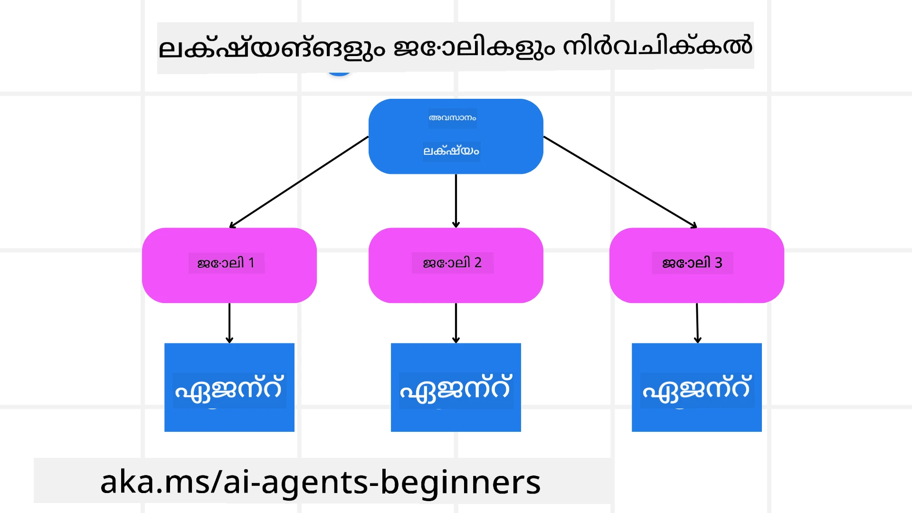

<!--
CO_OP_TRANSLATOR_METADATA:
{
  "original_hash": "43069833a0412210ad5c3cc93d9c2146",
  "translation_date": "2025-12-03T17:21:17+00:00",
  "source_file": "07-planning-design/README.md",
  "language_code": "ml"
}
-->
[](https://youtu.be/kPfJ2BrBCMY?si=9pYpPXp0sSbK91Dr)

> _(മുകളിൽ കാണുന്ന ചിത്രം ക്ലിക്ക് ചെയ്ത് ഈ പാഠത്തിന്റെ വീഡിയോ കാണുക)_

# പ്ലാനിംഗ് ഡിസൈൻ

## പരിചയം

ഈ പാഠത്തിൽ ഉൾപ്പെടുന്നത്:

* ഒരു വ്യക്തമായ ആകെ ലക്ഷ്യം നിർവചിക്കുകയും ഒരു സങ്കീർണ്ണമായ പ്രവർത്തി കൈകാര്യം ചെയ്യാൻ കഴിയുന്ന ചെറിയ പ്രവർത്തികളായി വിഭജിക്കുകയും ചെയ്യുക.
* കൂടുതൽ വിശ്വസനീയവും മെഷീൻ വായിക്കാൻ കഴിയുന്ന പ്രതികരണങ്ങൾക്കായി ഘടനാപരമായ ഔട്ട്പുട്ട് ഉപയോഗിക്കുക.
* ഡൈനാമിക് ടാസ്കുകളും പ്രതീക്ഷിക്കാത്ത ഇൻപുട്ടുകളും കൈകാര്യം ചെയ്യാൻ ഇവന്റ്-ഡ്രിവൻ സമീപനം പ്രയോഗിക്കുക.

## പഠന ലക്ഷ്യങ്ങൾ

ഈ പാഠം പൂർത്തിയാക്കിയ ശേഷം, നിങ്ങൾക്ക് മനസ്സിലാക്കാൻ കഴിയും:

* ഒരു AI ഏജന്റിനായി ആകെ ലക്ഷ്യം തിരിച്ചറിയുകയും അത് വ്യക്തമായി നിർവചിക്കുകയും ചെയ്യുക, എന്ത് നേടേണ്ടതാണെന്ന് ഉറപ്പാക്കുക.
* ഒരു സങ്കീർണ്ണമായ പ്രവർത്തി കൈകാര്യം ചെയ്യാൻ കഴിയുന്ന ചെറിയ ഉപപ്രവർത്തികളായി വിഭജിക്കുകയും അവയെ ലജിക്കൽ ക്രമത്തിൽ ക്രമീകരിക്കുകയും ചെയ്യുക.
* ഏജന്റുകൾക്ക് ശരിയായ ഉപകരണങ്ങൾ (ഉദാ: സെർച്ച് ടൂളുകൾ അല്ലെങ്കിൽ ഡാറ്റ അനലിറ്റിക്സ് ടൂളുകൾ) നൽകുക, അവ എപ്പോൾ, എങ്ങനെ ഉപയോഗിക്കണമെന്ന് തീരുമാനിക്കുക, പ്രതീക്ഷിക്കാത്ത സാഹചര്യങ്ങൾ കൈകാര്യം ചെയ്യുക.
* ഉപപ്രവർത്തികളുടെ ഫലങ്ങൾ വിലയിരുത്തുക, പ്രകടനം അളക്കുക, അന്തിമ ഔട്ട്പുട്ട് മെച്ചപ്പെടുത്താൻ പ്രവർത്തനങ്ങൾ ആവർത്തിക്കുക.

## ആകെ ലക്ഷ്യം നിർവചിക്കുകയും ഒരു പ്രവർത്തി വിഭജിക്കുകയും ചെയ്യുക



മിക്ക യഥാർത്ഥ ലോക പ്രവർത്തികളും ഒരു ഘട്ടത്തിൽ കൈകാര്യം ചെയ്യാൻ വളരെ സങ്കീർണ്ണമാണ്. ഒരു AI ഏജന്റിന് തന്റെ പ്ലാനിംഗ്, പ്രവർത്തനങ്ങൾ എന്നിവയ്ക്ക് മാർഗ്ഗനിർദ്ദേശം നൽകാൻ ഒരു ചുരുക്കമായ ലക്ഷ്യം ആവശ്യമുണ്ട്. ഉദാഹരണത്തിന്, ഈ ലക്ഷ്യം പരിഗണിക്കുക:

    "3 ദിവസത്തെ യാത്രാ പദ്ധതിയൊരുക്കുക."

ഇത് പറയാൻ എളുപ്പമാണ്, പക്ഷേ ഇത് കൂടുതൽ വ്യക്തത ആവശ്യമുണ്ട്. ലക്ഷ്യം കൂടുതൽ വ്യക്തമായാൽ, ഏജന്റിനും (മനുഷ്യ സഹപ്രവർത്തകരും) ശരിയായ ഫലത്തെ ലക്ഷ്യമാക്കാൻ കൂടുതൽ ശ്രദ്ധ കേന്ദ്രീകരിക്കാൻ കഴിയും, ഉദാഹരണത്തിന്, വിമാന ഓപ്ഷനുകൾ, ഹോട്ടൽ ശുപാർശകൾ, പ്രവർത്തന നിർദ്ദേശങ്ങൾ എന്നിവയുള്ള സമഗ്രമായ ഒരു യാത്രാ പദ്ധതി സൃഷ്ടിക്കുക.

### പ്രവർത്തി വിഭജനം

വലിയ അല്ലെങ്കിൽ സങ്കീർണ്ണമായ പ്രവർത്തികൾ ചെറിയ, ലക്ഷ്യോന്മുഖമായ ഉപപ്രവർത്തികളായി വിഭജിക്കുമ്പോൾ കൂടുതൽ കൈകാര്യം ചെയ്യാൻ കഴിയുന്നവയാകും.  
യാത്രാ പദ്ധതി ഉദാഹരണത്തിന്, നിങ്ങൾ ലക്ഷ്യം ഇങ്ങനെ വിഭജിക്കാം:

* ഫ്ലൈറ്റ് ബുക്കിംഗ്  
* ഹോട്ടൽ ബുക്കിംഗ്  
* കാർ വാടക  
* വ്യക്തിഗതമാക്കൽ  

ഓരോ ഉപപ്രവർത്തിയും സമർപ്പിത ഏജന്റുകൾ അല്ലെങ്കിൽ പ്രക്രിയകൾ കൈകാര്യം ചെയ്യാം. ഒരു ഏജന്റ് മികച്ച ഫ്ലൈറ്റ് ഡീലുകൾ കണ്ടെത്തുന്നതിൽ പ്രത്യേകതയുള്ളവനാകാം, മറ്റൊരാൾ ഹോട്ടൽ ബുക്കിംഗിൽ ശ്രദ്ധ കേന്ദ്രീകരിക്കാം, തുടങ്ങിയവ. ഒരു കോർഡിനേറ്റിംഗ് അല്ലെങ്കിൽ “ഡൗൺസ്ട്രീം” ഏജന്റ് ഈ ഫലങ്ങൾ എല്ലാം ഒരുമിച്ച് ചേർത്ത് ഉപയോക്താവിന് സമർപ്പിക്കും.

ഈ മോഡുലാർ സമീപനം ക്രമാനുഗത മെച്ചപ്പെടുത്തലുകൾക്കും അവസരം നൽകുന്നു. ഉദാഹരണത്തിന്, ഭക്ഷണ ശുപാർശകൾ അല്ലെങ്കിൽ പ്രാദേശിക പ്രവർത്തന നിർദ്ദേശങ്ങൾക്കായി പ്രത്യേക ഏജന്റുകൾ ചേർക്കുകയും, യാത്രാ പദ്ധതിയെ സമയം കഴിഞ്ഞ് കൂടുതൽ മെച്ചപ്പെടുത്തുകയും ചെയ്യാം.

### ഘടനാപരമായ ഔട്ട്പുട്ട്

വലിയ ഭാഷാ മോഡലുകൾ (LLMs) ഘടനാപരമായ ഔട്ട്പുട്ട് (ഉദാ: JSON) സൃഷ്ടിക്കാൻ കഴിയും, ഇത് ഡൗൺസ്ട്രീം ഏജന്റുകൾ അല്ലെങ്കിൽ സേവനങ്ങൾ പാഴ്സ് ചെയ്യാനും പ്രോസസ്സ് ചെയ്യാനും എളുപ്പമാക്കുന്നു. ഇത് മൾട്ടി-ഏജന്റ് സാഹചര്യത്തിൽ വളരെ പ്രയോജനകരമാണ്, പ്ലാനിംഗ് ഔട്ട്പുട്ട് ലഭിച്ച ശേഷം ഈ പ്രവർത്തനങ്ങൾ നടപ്പിലാക്കാൻ കഴിയും. ഒരു ചുരുക്കം അവലോകനത്തിനായി ഈ <a href="https://microsoft.github.io/autogen/stable/user-guide/core-user-guide/cookbook/structured-output-agent.html" target="_blank">ബ്ലോഗ്പോസ്റ്റ്</a> കാണുക.

താഴെ കാണുന്ന Python കോഡ് ഉദാഹരണം ഒരു ലളിതമായ പ്ലാനിംഗ് ഏജന്റ് ഒരു ലക്ഷ്യത്തെ ഉപപ്രവർത്തികളായി വിഭജിക്കുകയും ഘടനാപരമായ ഒരു പദ്ധതി സൃഷ്ടിക്കുകയും ചെയ്യുന്നത് കാണിക്കുന്നു:

```python
from pydantic import BaseModel
from enum import Enum
from typing import List, Optional, Union
import json
import os
from typing import Optional
from pprint import pprint
from autogen_core.models import UserMessage, SystemMessage, AssistantMessage
from autogen_ext.models.azure import AzureAIChatCompletionClient
from azure.core.credentials import AzureKeyCredential

class AgentEnum(str, Enum):
    FlightBooking = "flight_booking"
    HotelBooking = "hotel_booking"
    CarRental = "car_rental"
    ActivitiesBooking = "activities_booking"
    DestinationInfo = "destination_info"
    DefaultAgent = "default_agent"
    GroupChatManager = "group_chat_manager"

# യാത്ര ഉപടാസ്ക് മോഡൽ
class TravelSubTask(BaseModel):
    task_details: str
    assigned_agent: AgentEnum  # ടാസ്ക് ഏജന്റിന് നിയോഗിക്കാനാണ് ഞങ്ങൾ ആഗ്രഹിക്കുന്നത്

class TravelPlan(BaseModel):
    main_task: str
    subtasks: List[TravelSubTask]
    is_greeting: bool

client = AzureAIChatCompletionClient(
    model="gpt-4o-mini",
    endpoint="https://models.inference.ai.azure.com",
    # മോഡലുമായി പ്രാമാണീകരണം നടത്താൻ, നിങ്ങളുടെ GitHub ക്രമീകരണങ്ങളിൽ വ്യക്തിഗത ആക്സസ് ടോക്കൺ (PAT) സൃഷ്ടിക്കേണ്ടതുണ്ട്.
    # നിങ്ങളുടെ PAT ടോക്കൺ സൃഷ്ടിക്കാൻ ഇവിടെ നൽകിയിരിക്കുന്ന നിർദ്ദേശങ്ങൾ പിന്തുടരുക: https://docs.github.com/en/authentication/keeping-your-account-and-data-secure/managing-your-personal-access-tokens
    credential=AzureKeyCredential(os.environ["GITHUB_TOKEN"]),
    model_info={
        "json_output": False,
        "function_calling": True,
        "vision": True,
        "family": "unknown",
    },
)

# ഉപയോക്തൃ സന്ദേശം നിർവചിക്കുക
messages = [
    SystemMessage(content="""You are an planner agent.
    Your job is to decide which agents to run based on the user's request.
                      Provide your response in JSON format with the following structure:
{'main_task': 'Plan a family trip from Singapore to Melbourne.',
 'subtasks': [{'assigned_agent': 'flight_booking',
               'task_details': 'Book round-trip flights from Singapore to '
                               'Melbourne.'}
    Below are the available agents specialised in different tasks:
    - FlightBooking: For booking flights and providing flight information
    - HotelBooking: For booking hotels and providing hotel information
    - CarRental: For booking cars and providing car rental information
    - ActivitiesBooking: For booking activities and providing activity information
    - DestinationInfo: For providing information about destinations
    - DefaultAgent: For handling general requests""", source="system"),
    UserMessage(
        content="Create a travel plan for a family of 2 kids from Singapore to Melboune", source="user"),
]

response = await client.create(messages=messages, extra_create_args={"response_format": 'json_object'})

response_content: Optional[str] = response.content if isinstance(
    response.content, str) else None
if response_content is None:
    raise ValueError("Response content is not a valid JSON string" )

pprint(json.loads(response_content))

# # ലോഡ് ചെയ്യുന്നതിന് മുമ്പ് പ്രതികരണ ഉള്ളടക്കം സാധുവായ JSON സ്ട്രിംഗ് ആണെന്ന് ഉറപ്പാക്കുക
# response_content: Optional[str] = response.content if isinstance(
#     response.content, str) else None
# response_content ഇല്ലെങ്കിൽ:
#     ValueError("പ്രതികരണ ഉള്ളടക്കം സാധുവായ JSON സ്ട്രിംഗ് അല്ല") ഉയർത്തുക

# # JSON ആയി ലോഡ് ചെയ്ത ശേഷം പ്രതികരണ ഉള്ളടക്കം പ്രിന്റ് ചെയ്യുക
# pprint(json.loads(response_content))

# MathReasoning മോഡലുമായി പ്രതികരണ ഉള്ളടക്കം സാധൂകരിക്കുക
# TravelPlan.model_validate(json.loads(response_content))
```

### മൾട്ടി-ഏജന്റ് ഓർക്കസ്ട്രേഷൻ ഉപയോഗിച്ച് പ്ലാനിംഗ് ഏജന്റ്

ഈ ഉദാഹരണത്തിൽ, ഒരു സെമാന്റിക് റൂട്ടർ ഏജന്റ് ഒരു ഉപയോക്തൃ അഭ്യർത്ഥന സ്വീകരിക്കുന്നു (ഉദാ: "എന്റെ യാത്രയ്ക്ക് ഒരു ഹോട്ടൽ പദ്ധതി വേണം.").

പ്ലാനർ തുടർന്ന്:

* ഹോട്ടൽ പദ്ധതി സ്വീകരിക്കുന്നു: പ്ലാനർ ഉപയോക്താവിന്റെ സന്ദേശം സ്വീകരിക്കുകയും, ഒരു സിസ്റ്റം പ്രോംപ്റ്റ് (ലഭ്യമായ ഏജന്റുകളുടെ വിശദാംശങ്ങൾ ഉൾപ്പെടെ) അടിസ്ഥാനമാക്കി ഘടനാപരമായ ഒരു യാത്രാ പദ്ധതി സൃഷ്ടിക്കുകയും ചെയ്യുന്നു.  
* ഏജന്റുകളും അവരുടെ ഉപകരണങ്ങളും ലിസ്റ്റ് ചെയ്യുന്നു: ഏജന്റ് രജിസ്ട്രിയിൽ ഏജന്റുകളുടെ ഒരു ലിസ്റ്റ് (ഉദാ: ഫ്ലൈറ്റ്, ഹോട്ടൽ, കാർ വാടക, പ്രവർത്തനങ്ങൾ) അവയുടെ ഫംഗ്ഷനുകൾ അല്ലെങ്കിൽ ഉപകരണങ്ങൾ ഉൾപ്പെടെ സൂക്ഷിക്കുന്നു.  
* പദ്ധതി അനുയോജ്യമായ ഏജന്റുകൾക്ക് റൂട്ടുചെയ്യുന്നു: ഉപപ്രവർത്തികളുടെ എണ്ണത്തെ ആശ്രയിച്ച്, പ്ലാനർ സന്ദേശം നേരിട്ട് ഒരു സമർപ്പിത ഏജന്റിലേക്ക് അയയ്ക്കുകയോ (സിംഗിൾ-ടാസ്ക് സാഹചര്യങ്ങൾക്കായി) അല്ലെങ്കിൽ മൾട്ടി-ഏജന്റ് സഹകരണത്തിനായി ഒരു ഗ്രൂപ്പ് ചാറ്റ് മാനേജർ വഴി കോർഡിനേറ്റ് ചെയ്യുകയോ ചെയ്യുന്നു.  
* ഫലത്തെ ചുരുക്കുന്നു: അവസാനം, പ്ലാനർ സൃഷ്ടിച്ച പദ്ധതിയെ വ്യക്തതയ്ക്കായി ചുരുക്കുന്നു.  
താഴെ കാണുന്ന Python കോഡ് സാമ്പിൾ ഈ ഘട്ടങ്ങൾ വിശദീകരിക്കുന്നു:

```python

from pydantic import BaseModel

from enum import Enum
from typing import List, Optional, Union

class AgentEnum(str, Enum):
    FlightBooking = "flight_booking"
    HotelBooking = "hotel_booking"
    CarRental = "car_rental"
    ActivitiesBooking = "activities_booking"
    DestinationInfo = "destination_info"
    DefaultAgent = "default_agent"
    GroupChatManager = "group_chat_manager"

# യാത്ര ഉപടാസ്ക് മോഡൽ

class TravelSubTask(BaseModel):
    task_details: str
    assigned_agent: AgentEnum # ടാസ്ക് ഏജന്റിന് നിയോഗിക്കണം

class TravelPlan(BaseModel):
    main_task: str
    subtasks: List[TravelSubTask]
    is_greeting: bool
import json
import os
from typing import Optional

from autogen_core.models import UserMessage, SystemMessage, AssistantMessage
from autogen_ext.models.openai import AzureOpenAIChatCompletionClient

# ടൈപ്പ്-ചെക്ക് ചെയ്ത പരിസ്ഥിതി ചാരങ്ങൾ ഉപയോഗിച്ച് ക്ലയന്റ് സൃഷ്ടിക്കുക

client = AzureOpenAIChatCompletionClient(
    azure_deployment=os.getenv("AZURE_OPENAI_DEPLOYMENT_NAME"),
    model=os.getenv("AZURE_OPENAI_DEPLOYMENT_NAME"),
    api_version=os.getenv("AZURE_OPENAI_API_VERSION"),
    azure_endpoint=os.getenv("AZURE_OPENAI_ENDPOINT"),
    api_key=os.getenv("AZURE_OPENAI_API_KEY"),
)

from pprint import pprint

# ഉപയോക്തൃ സന്ദേശം നിർവചിക്കുക

messages = [
    SystemMessage(content="""You are an planner agent.
    Your job is to decide which agents to run based on the user's request.
    Below are the available agents specialized in different tasks:
    - FlightBooking: For booking flights and providing flight information
    - HotelBooking: For booking hotels and providing hotel information
    - CarRental: For booking cars and providing car rental information
    - ActivitiesBooking: For booking activities and providing activity information
    - DestinationInfo: For providing information about destinations
    - DefaultAgent: For handling general requests""", source="system"),
    UserMessage(content="Create a travel plan for a family of 2 kids from Singapore to Melbourne", source="user"),
]

response = await client.create(messages=messages, extra_create_args={"response_format": TravelPlan})

# ലോഡ് ചെയ്യുന്നതിന് മുമ്പ് പ്രതികരണ ഉള്ളടക്കം സാധുവായ JSON സ്ട്രിംഗ് ആണെന്ന് ഉറപ്പാക്കുക

response_content: Optional[str] = response.content if isinstance(response.content, str) else None
if response_content is None:
    raise ValueError("Response content is not a valid JSON string")

# JSON ആയി ലോഡ് ചെയ്ത ശേഷം പ്രതികരണ ഉള്ളടക്കം പ്രിന്റ് ചെയ്യുക

pprint(json.loads(response_content))
```

മുൻ കോഡിന്റെ ഔട്ട്പുട്ട് താഴെ കാണിച്ചിരിക്കുന്നു, ഇത് `assigned_agent`-ലേക്ക് റൂട്ടുചെയ്യാനും യാത്രാ പദ്ധതിയെ ഉപയോക്താവിന് ചുരുക്കി സമർപ്പിക്കാനും ഉപയോഗിക്കാം.

```json
{
    "is_greeting": "False",
    "main_task": "Plan a family trip from Singapore to Melbourne.",
    "subtasks": [
        {
            "assigned_agent": "flight_booking",
            "task_details": "Book round-trip flights from Singapore to Melbourne."
        },
        {
            "assigned_agent": "hotel_booking",
            "task_details": "Find family-friendly hotels in Melbourne."
        },
        {
            "assigned_agent": "car_rental",
            "task_details": "Arrange a car rental suitable for a family of four in Melbourne."
        },
        {
            "assigned_agent": "activities_booking",
            "task_details": "List family-friendly activities in Melbourne."
        },
        {
            "assigned_agent": "destination_info",
            "task_details": "Provide information about Melbourne as a travel destination."
        }
    ]
}
```

മുൻ കോഡ് സാമ്പിള്‍ അടങ്ങിയ ഒരു ഉദാഹരണ നോട്ട്ബുക്ക് [ഇവിടെ](07-autogen.ipynb) ലഭ്യമാണ്.

### ആവർത്തന പ്ലാനിംഗ്

ചില പ്രവർത്തികൾക്ക് മുന്നോട്ടും പിന്നോട്ടും അല്ലെങ്കിൽ വീണ്ടും പ്ലാനിംഗ് ആവശ്യമുണ്ട്, ഒരു ഉപപ്രവർത്തിയുടെ ഫലം അടുത്തതിനെ സ്വാധീനിക്കുന്നിടത്ത്. ഉദാഹരണത്തിന്, ഏജന്റ് ഫ്ലൈറ്റുകൾ ബുക്ക് ചെയ്യുമ്പോൾ പ്രതീക്ഷിക്കാത്ത ഒരു ഡാറ്റ ഫോർമാറ്റ് കണ്ടെത്തിയാൽ, ഹോട്ടൽ ബുക്കിംഗിലേക്ക് നീങ്ങുന്നതിന് മുമ്പ് തന്ത്രം മാറ്റേണ്ടി വരാം.

കൂടാതെ, ഉപയോക്തൃ ഫീഡ്ബാക്ക് (ഉദാ: ഒരു മനുഷ്യൻ ഒരു നേരത്തെ ഫ്ലൈറ്റ് ഇഷ്ടപ്പെടുന്നു എന്ന് തീരുമാനിക്കുന്നത്) ഭാഗികമായി വീണ്ടും പ്ലാൻ ചെയ്യാൻ കാരണമാകാം. ഈ ഡൈനാമിക്, ആവർത്തന സമീപനം അന്തിമ പരിഹാരം യഥാർത്ഥ ലോക നിയന്ത്രണങ്ങൾക്കും ഉപയോക്തൃ മുൻഗണനകളുടെ മാറ്റങ്ങൾക്കും അനുയോജ്യമാക്കുന്നു.

ഉദാ: കോഡ് സാമ്പിൾ

```python
from autogen_core.models import UserMessage, SystemMessage, AssistantMessage
#.. മുമ്പത്തെ കോഡിനൊപ്പം ഉപയോക്തൃ ചരിത്രം, നിലവിലെ പദ്ധതി പാസ്സ് ചെയ്യുക
messages = [
    SystemMessage(content="""You are a planner agent to optimize the
    Your job is to decide which agents to run based on the user's request.
    Below are the available agents specialized in different tasks:
    - FlightBooking: For booking flights and providing flight information
    - HotelBooking: For booking hotels and providing hotel information
    - CarRental: For booking cars and providing car rental information
    - ActivitiesBooking: For booking activities and providing activity information
    - DestinationInfo: For providing information about destinations
    - DefaultAgent: For handling general requests""", source="system"),
    UserMessage(content="Create a travel plan for a family of 2 kids from Singapore to Melbourne", source="user"),
    AssistantMessage(content=f"Previous travel plan - {TravelPlan}", source="assistant")
]
# .. പുനഃപദ്ധതി തയ്യാറാക്കി ചുമതലപ്പെട്ട ഏജന്റുമാർക്ക് ടാസ്കുകൾ അയയ്ക്കുക
```

കൂടുതൽ സമഗ്രമായ പ്ലാനിംഗിനായി, സങ്കീർണ്ണമായ പ്രവർത്തനങ്ങൾ പരിഹരിക്കുന്നതിന് Magnetic One <a href="https://www.microsoft.com/research/articles/magentic-one-a-generalist-multi-agent-system-for-solving-complex-tasks" target="_blank">ബ്ലോഗ്പോസ്റ്റ്</a> പരിശോധിക്കുക.

## സംഗ്രഹം

ഈ ലേഖനത്തിൽ, ലഭ്യമായ ഏജന്റുകൾ ഡൈനാമിക് ആയി തിരഞ്ഞെടുക്കാൻ കഴിയുന്ന ഒരു പ്ലാനർ എങ്ങനെ സൃഷ്ടിക്കാമെന്ന് ഒരു ഉദാഹരണം നോക്കി. പ്ലാനറിന്റെ ഔട്ട്പുട്ട് പ്രവർത്തനങ്ങളെ വിഭജിക്കുകയും ഏജന്റുകൾക്ക് അവയെ നിയോഗിക്കുകയും ചെയ്യുന്നു, അതിനാൽ അവ നടപ്പിലാക്കാൻ കഴിയും. ഏജന്റുകൾക്ക് പ്രവർത്തനം നടത്താൻ ആവശ്യമായ ഫംഗ്ഷനുകൾ/ഉപകരണങ്ങൾ ലഭ്യമാണെന്ന് കരുതുന്നു. ഏജന്റുകൾക്ക് പുറമേ, റിഫ്ലക്ഷൻ, സമരൈസർ, റൗണ്ട് റോബിൻ ചാറ്റ് പോലുള്ള മറ്റ് പാറ്റേണുകളും ഉൾപ്പെടുത്താം.

## അധിക വിഭവങ്ങൾ

AutoGen Magnetic One - സങ്കീർണ്ണമായ പ്രവർത്തനങ്ങൾ പരിഹരിക്കുന്നതിനുള്ള ഒരു ജനറലിസ്റ്റ് മൾട്ടി-ഏജന്റ് സിസ്റ്റമാണ്, ഇത് നിരവധി വെല്ലുവിളിയേറിയ ഏജന്റിക് ബെഞ്ച്മാർക്കുകളിൽ ശ്രദ്ധേയമായ ഫലങ്ങൾ കൈവരിച്ചിട്ടുണ്ട്. റഫറൻസ്: <a href="https://github.com/microsoft/autogen/tree/main/python/packages/autogen-magentic-one" target="_blank">autogen-magentic-one</a>. ഈ നടപ്പിലാക്കലിൽ, ഓർക്കസ്ട്രേറ്റർ പ്രവർത്തന-വിശിഷ്ടമായ പദ്ധതി സൃഷ്ടിക്കുകയും ഈ പ്രവർത്തനങ്ങൾ ലഭ്യമായ ഏജന്റുകൾക്ക് നിയോഗിക്കുകയും ചെയ്യുന്നു. പ്ലാനിംഗിന് പുറമേ, ഓർക്കസ്ട്രേറ്റർ പ്രവർത്തനത്തിന്റെ പുരോഗതി നിരീക്ഷിക്കാൻ ഒരു ട്രാക്കിംഗ് മെക്കാനിസവും ആവശ്യമായപ്പോൾ വീണ്ടും പ്ലാൻ ചെയ്യാനും ഉപയോഗിക്കുന്നു.

### പ്ലാനിംഗ് ഡിസൈൻ പാറ്റേണിനെക്കുറിച്ച് കൂടുതൽ ചോദ്യങ്ങളുണ്ടോ?

മറ്റു പഠിതാക്കളുമായി ചേരാനും, ഓഫീസ് മണിക്കൂറുകളിൽ പങ്കെടുക്കാനും, നിങ്ങളുടെ AI ഏജന്റുകളുമായി ബന്ധപ്പെട്ട ചോദ്യങ്ങൾക്ക് ഉത്തരം ലഭിക്കാനും [Azure AI Foundry Discord](https://aka.ms/ai-agents/discord) ചേരുക.

## മുൻ പാഠം

[വിശ്വസനീയമായ AI ഏജന്റുകൾ നിർമ്മിക്കൽ](../06-building-trustworthy-agents/README.md)

## അടുത്ത പാഠം

[മൾട്ടി-ഏജന്റ് ഡിസൈൻ പാറ്റേൺ](../08-multi-agent/README.md)

---

<!-- CO-OP TRANSLATOR DISCLAIMER START -->
**അസത്യവാദം**:  
ഈ രേഖ AI വിവർത്തന സേവനമായ [Co-op Translator](https://github.com/Azure/co-op-translator) ഉപയോഗിച്ച് വിവർത്തനം ചെയ്തതാണ്. കൃത്യതയ്ക്കായി ഞങ്ങൾ ശ്രമിക്കുന്നുവെങ്കിലും, ഓട്ടോമേറ്റഡ് വിവർത്തനങ്ങളിൽ പിശകുകൾ അല്ലെങ്കിൽ തെറ്റായ വിവരങ്ങൾ ഉണ്ടാകാൻ സാധ്യതയുണ്ട്. അതിന്റെ സ്വാഭാവിക ഭാഷയിലുള്ള മൗലിക രേഖ പ്രാമാണികമായ ഉറവിടമായി പരിഗണിക്കണം. നിർണായകമായ വിവരങ്ങൾക്ക്, പ്രൊഫഷണൽ മനുഷ്യ വിവർത്തനം ശുപാർശ ചെയ്യുന്നു. ഈ വിവർത്തനം ഉപയോഗിച്ച് ഉണ്ടാകുന്ന തെറ്റിദ്ധാരണകൾക്കോ തെറ്റായ വ്യാഖ്യാനങ്ങൾക്കോ ഞങ്ങൾ ഉത്തരവാദികളല്ല.
<!-- CO-OP TRANSLATOR DISCLAIMER END -->