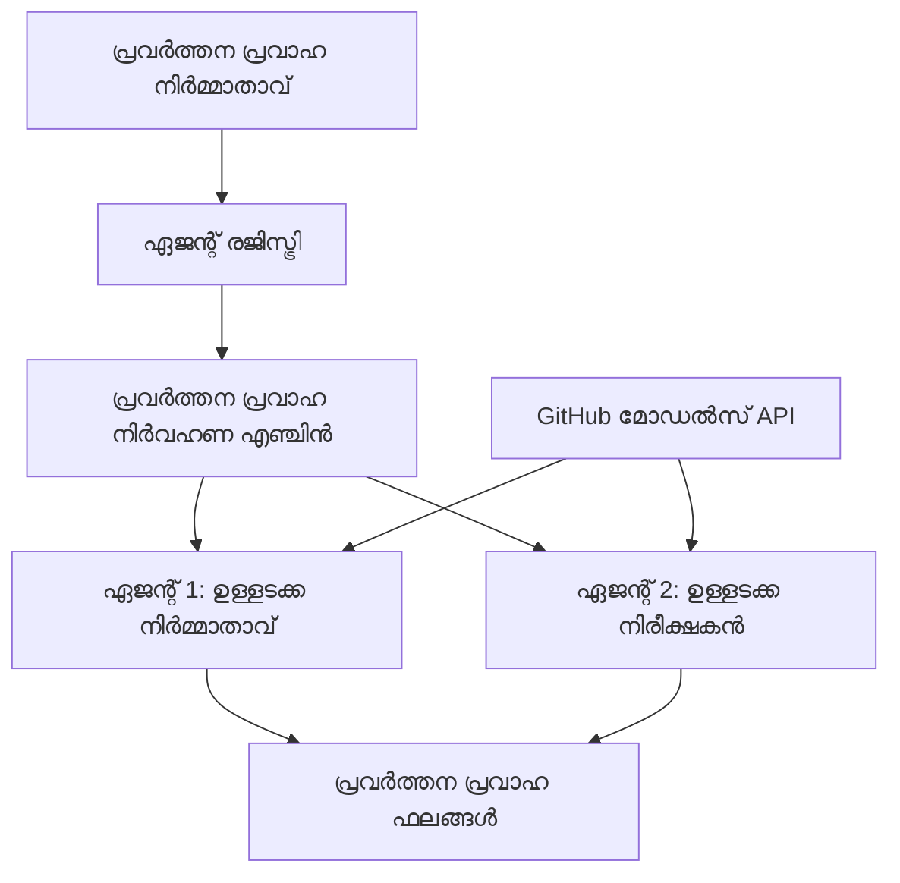

<!--
CO_OP_TRANSLATOR_METADATA:
{
  "original_hash": "034158688d0a45aae06dcbb21b0da5ae",
  "translation_date": "2025-12-03T16:23:38+00:00",
  "source_file": "08-multi-agent/code_samples/workflows-agent-framework/dotNET/01.dotnet-agent-framework-workflow-ghmodel-basic.md",
  "language_code": "ml"
}
-->
# 🔄 GitHub മോഡലുകളുമായി അടിസ്ഥാന ഏജന്റ് പ്രവൃത്തിപദ്ധതികൾ (.NET)

## 📋 പ്രവൃത്തിപദ്ധതി ഓർക്കസ്ട്രേഷൻ ട്യൂട്ടോറിയൽ

ഈ നോട്ട്ബുക്ക് Microsoft Agent Framework for .NET, GitHub മോഡലുകൾ എന്നിവ ഉപയോഗിച്ച് എങ്ങനെ സങ്കീർണ്ണമായ **ഏജന്റ് പ്രവൃത്തിപദ്ധതികൾ** നിർമ്മിക്കാമെന്ന് കാണിക്കുന്നു. AI ഏജന്റുമാർ സഹകരിച്ച് ഘടനാപരമായ ഓർക്കസ്ട്രേഷൻ മാതൃകകളിലൂടെ സങ്കീർണ്ണമായ പ്രവർത്തനങ്ങൾ പൂർത്തിയാക്കുന്ന മൾട്ടി-സ്റ്റെപ്പ് ബിസിനസ് പ്രോസസുകൾ സൃഷ്ടിക്കാൻ നിങ്ങൾക്ക് പഠിക്കാം.

## 🎯 പഠന ലക്ഷ്യങ്ങൾ

### 🏗️ **പ്രവൃത്തിപദ്ധതി ആർക്കിടെക്ചർ അടിസ്ഥാനങ്ങൾ**
- **Workflow Builder**: സങ്കീർണ്ണമായ മൾട്ടി-സ്റ്റെപ്പ് AI പ്രക്രിയകൾ രൂപകൽപ്പന ചെയ്യുക, ഓർക്കസ്ട്രേറ്റ് ചെയ്യുക
- **Agent Coordination**: workflows-ൽ നിരവധി പ്രത്യേകിച്ചുള്ള ഏജന്റുമാരെ ഏകോപിപ്പിക്കുക
- **GitHub Models Integration**: workflows-ൽ GitHub-ന്റെ AI മോഡൽ ഇൻഫറൻസ് സേവനം ഉപയോഗിക്കുക
- **Visual Workflow Design**: workflow ഘടനകൾ രൂപകൽപ്പന ചെയ്യുക, മനസ്സിലാക്കാൻ എളുപ്പമാക്കുക

### 🔄 **പ്രക്രിയ ഓർക്കസ്ട്രേഷൻ മാതൃകകൾ**
- **Sequential Processing**: നിരവധി ഏജന്റ് പ്രവർത്തനങ്ങൾ തർക്കമില്ലാതെ ക്രമീകരിക്കുക
- **State Management**: workflow ഘട്ടങ്ങളിൽ കോൺടെക്സ്റ്റും ഡാറ്റാ ഫ്ലോയും നിലനിർത്തുക
- **Error Handling**: പിഴവുകൾ പുനരുദ്ധരിക്കുകയും workflow പ്രതിരോധശേഷി ഉറപ്പാക്കുകയും ചെയ്യുക
- **Performance Optimization**: എന്റർപ്രൈസ്-സ്കെയിൽ പ്രവർത്തനങ്ങൾക്കായി കാര്യക്ഷമമായ workflows രൂപകൽപ്പന ചെയ്യുക

### 🏢 **എന്റർപ്രൈസ് workflow അപ്ലിക്കേഷനുകൾ**
- **ബിസിനസ് പ്രോസസ് ഓട്ടോമേഷൻ**: സങ്കീർണ്ണമായ ഓർഗനൈസേഷണൽ workflows ഓട്ടോമേറ്റ് ചെയ്യുക
- **Content Production Pipeline**: അവലോകനവും അംഗീകാര ഘട്ടങ്ങളുമുള്ള എഡിറ്റോറിയൽ workflows
- **Customer Service Automation**: മൾട്ടി-സ്റ്റെപ്പ് ഉപഭോക്തൃ ചോദ്യം പരിഹാരങ്ങൾ
- **Data Processing Workflows**: AI-പവർഡ് ട്രാൻസ്ഫർമേഷൻ ഉപയോഗിച്ച് ETL workflows

## ⚙️ മുൻ‌വശങ്ങൾ & സജ്ജീകരണം

### 📦 **ആവശ്യമായ NuGet പാക്കേജുകൾ**

ഈ workflow ഡെമോയിൽ ചില പ്രധാന .NET പാക്കേജുകൾ ഉപയോഗിക്കുന്നു:

```xml
<!-- Core AI Framework -->
<PackageReference Include="Microsoft.Extensions.AI" Version="9.9.0" />

<!-- Agent Framework (Local Development) -->
<!-- Microsoft.Agents.AI.dll - Core agent abstractions -->
<!-- Microsoft.Agents.AI.OpenAI.dll - OpenAI/GitHub Models integration -->

<!-- Configuration and Environment -->
<PackageReference Include="DotNetEnv" Version="3.1.1" />
```

### 🔑 **GitHub മോഡലുകളുടെ കോൺഫിഗറേഷൻ**

**പരിസ്ഥിതി സജ്ജീകരണം (.env ഫയൽ):**
```env
GITHUB_TOKEN=your_github_personal_access_token
GITHUB_ENDPOINT=https://models.inference.ai.azure.com
GITHUB_MODEL_ID=gpt-4o-mini
```

**GitHub മോഡലുകളുടെ ആക്സസ്:**
1. GitHub മോഡലുകൾക്കായി സൈൻ അപ്പ് ചെയ്യുക (ഇപ്പോൾ പ്രിവ്യൂയിൽ)
2. മോഡൽ ആക്സസ് അനുമതികളോടുകൂടിയ ഒരു പേഴ്സണൽ ആക്സസ് ടോക്കൺ ജനറേറ്റ് ചെയ്യുക
3. മുകളിൽ കാണിച്ചിരിക്കുന്നതുപോലെ പരിസ്ഥിതി വേരിയബിളുകൾ കോൺഫിഗർ ചെയ്യുക

### 🏗️ **Workflow ആർക്കിടെക്ചർ അവലോകനം**


**പ്രധാന ഘടകങ്ങൾ:**
- **WorkflowBuilder**: workflows രൂപകൽപ്പന ചെയ്യുന്നതിനുള്ള പ്രധാന ഓർക്കസ്ട്രേഷൻ എഞ്ചിൻ
- **AIAgent**: പ്രത്യേക കഴിവുകളുള്ള വ്യക്തിഗത ഏജന്റുമാർ
- **GitHub Models Client**: AI മോഡൽ ഇൻഫറൻസ് സേവന സംയോജനം
- **Execution Context**: workflow ഘട്ടങ്ങൾക്കിടയിൽ സ്റ്റേറ്റ്, ഡാറ്റാ ഫ്ലോ എന്നിവ കൈകാര്യം ചെയ്യുന്നു

## 🎨 **എന്റർപ്രൈസ് workflow ഡിസൈൻ മാതൃകകൾ**

### 📝 **Content Production Workflow**
```
User Request → Content Generation → Quality Review → Final Output
```

### 🔍 **Document Processing Pipeline**
```
Document Input → Analysis → Extraction → Validation → Structured Output
```

### 💼 **Business Intelligence Workflow**
```
Data Collection → Processing → Analysis → Report Generation → Distribution
```

### 🤝 **Customer Service Automation**
```
Customer Inquiry → Classification → Processing → Response Generation → Follow-up
```

## 🏢 **എന്റർപ്രൈസ് ഗുണങ്ങൾ**

### 🎯 **വിശ്വാസ്യതയും സ്കെയിലബിലിറ്റിയും**
- **Deterministic Execution**: സ്ഥിരതയുള്ള, ആവർത്തനയോഗ്യമായ workflow ഫലങ്ങൾ
- **Error Recovery**: workflow ഘട്ടങ്ങളിൽ ഏതെങ്കിലും പിഴവുകൾ നന്നാക്കൽ
- **Performance Monitoring**: പ്രവർത്തന മെട്രിക്‌സുകളും മെച്ചപ്പെടുത്തൽ അവസരങ്ങളും ട്രാക്ക് ചെയ്യുക
- **Resource Management**: AI മോഡൽ റിസോഴ്സുകളുടെ കാര്യക്ഷമമായ വിനിയോഗം

### 🔒 **സുരക്ഷയും അനുസരണയും**
- **Secure Authentication**: API ആക്സസിനായി GitHub ടോക്കൺ അടിസ്ഥാനമാക്കിയുള്ള ഓതന്റിക്കേഷൻ
- **Audit Trails**: workflow എക്സിക്യൂഷനും തീരുമാന ബിന്ദുക്കളും പൂർണ്ണമായി ലോഗ് ചെയ്യുക
- **Access Control**: workflow എക്സിക്യൂഷനും മോണിറ്ററിംഗിനും ഗ്രാനുലർ അനുമതികൾ
- **Data Privacy**: workflows-ൽ സങ്കീർണ്ണമായ വിവരങ്ങൾ സുരക്ഷിതമായി കൈകാര്യം ചെയ്യുക

### 📊 **ഓബ്സർവബിലിറ്റിയും മാനേജ്മെന്റും**
- **Visual Workflow Design**: പ്രക്രിയ ഫ്ലോകളുടെയും ആശ്രിതത്വങ്ങളുടെയും വ്യക്തമായ പ്രതിനിധാനം
- **Execution Monitoring**: workflow പുരോഗതിയും പ്രകടനവും റിയൽ-ടൈം ട്രാക്കിംഗ്
- **Error Reporting**: വിശദമായ പിഴവ് വിശകലനവും ഡീബഗിംഗ് കഴിവുകളും
- **Performance Analytics**: മെച്ചപ്പെടുത്തലിനും ശേഷി പ്ലാനിംഗിനും മെട്രിക്‌സ്

നിങ്ങളുടെ ആദ്യ എന്റർപ്രൈസ്-റെഡി AI workflow നിർമ്മിക്കാം! 🚀

## 💻 കോഡ് പ്രവർത്തിപ്പിക്കൽ

പൂർണ്ണമായ നടപ്പാക്കൽ `01.dotnet-agent-framework-workflow-ghmodel-basic.cs`-ൽ ലഭ്യമാണ്. ഈ ഫയൽ കാണിക്കുന്നു:

1. **പരിസ്ഥിതി കോൺഫിഗറേഷൻ** - `.env` ഫയലിൽ നിന്ന് GitHub മോഡൽ ക്രെഡൻഷ്യലുകൾ ലോഡ് ചെയ്യുന്നു
2. **OpenAI Client Setup** - GitHub മോഡൽ എന്റർപ്രൈസ് ഉപയോഗിച്ച് ക്ലയന്റ് കോൺഫിഗർ ചെയ്യുന്നു
3. **Agent Creation** - പ്രത്യേകിച്ചുള്ള ഏജന്റുമാരെ നിർവചിക്കുന്നു (Front Desk, Concierge)
4. **Workflow Builder** - ക്രമാനുസൃത പ്രോസസ്സിംഗുമായി മൾട്ടി-ഏജന്റ് workflow സൃഷ്ടിക്കുന്നു
5. **Workflow Execution** - സ്റ്റ്രീമിംഗ് ഫലങ്ങളോടെ workflow പ്രവർത്തിപ്പിക്കുന്നു

### 🚀 ഉദാഹരണം പ്രവർത്തിപ്പിക്കൽ

```bash
# സ്ക്രിപ്റ്റ് പ്രവർത്തനക്ഷമമാക്കുക (യൂണിക്സ്/ലിനക്സ്/മാക്ക്‌ഒഎസ്)
chmod +x 01.dotnet-agent-framework-workflow-ghmodel-basic.cs

# പ്രവൃത്തി പ്രവഹനം പ്രവർത്തിപ്പിക്കുക
./01.dotnet-agent-framework-workflow-ghmodel-basic.cs
```

അല്ലെങ്കിൽ Windows-ൽ:
```powershell
dotnet run 01.dotnet-agent-framework-workflow-ghmodel-basic.cs
```

### 📝 പ്രതീക്ഷിക്കുന്ന ഫലം

workflow ചെയ്യുന്നത്:
1. നിങ്ങളുടെ യാത്രാ ലക്ഷ്യ അഭ്യർത്ഥന ("എനിക്ക് പാരിസിലേക്ക് പോകണം") സ്വീകരിക്കുന്നു
2. Front Desk ഏജന്റ് പ്രാഥമിക ശുപാർശ നൽകുന്നു
3. Concierge ഏജന്റ് ശുപാർശ അവലോകനം ചെയ്യുകയും മെച്ചപ്പെടുത്തുകയും ചെയ്യുന്നു
4. അന്തിമ ഫലം പൂർണ്ണമായ സംഭാഷണ സ്ട്രീം പ്രദർശിപ്പിക്കുന്നു

### 🔧 കസ്റ്റമൈസേഷൻ

നിങ്ങൾ workflow ഇങ്ങനെ കസ്റ്റമൈസ് ചെയ്യാം:
- ഏജന്റുകളുടെ നിർദ്ദേശങ്ങൾ മാറ്റി അവരുടെ പെരുമാറ്റം മാറ്റുക
- കൂടുതൽ ഏജന്റുമാരെ ചേർത്ത് സങ്കീർണ്ണമായ മൾട്ടി-സ്റ്റെപ്പ് workflows സൃഷ്ടിക്കുക
- വ്യത്യസ്ത സാഹചര്യങ്ങൾ പരീക്ഷിക്കാൻ ഉപയോക്തൃ സന്ദേശം മാറ്റുക
- workflow എഡ്ജുകൾ ക്രമീകരിച്ച് വ്യത്യസ്ത എക്സിക്യൂഷൻ മാതൃകകൾ സൃഷ്ടിക്കുക

---

<!-- CO-OP TRANSLATOR DISCLAIMER START -->
**അസത്യവാദം**:  
ഈ രേഖ AI വിവർത്തന സേവനമായ [Co-op Translator](https://github.com/Azure/co-op-translator) ഉപയോഗിച്ച് വിവർത്തനം ചെയ്തതാണ്. കൃത്യതയ്ക്കായി ഞങ്ങൾ ശ്രമിക്കുന്നുവെങ്കിലും, ഓട്ടോമേറ്റഡ് വിവർത്തനങ്ങളിൽ പിശകുകൾ അല്ലെങ്കിൽ തെറ്റായ വിവരങ്ങൾ ഉണ്ടാകാൻ സാധ്യതയുണ്ട്. അതിന്റെ സ്വാഭാവിക ഭാഷയിലുള്ള മൗലിക രേഖ പ്രാമാണികമായ ഉറവിടമായി കണക്കാക്കണം. നിർണായകമായ വിവരങ്ങൾക്ക്, പ്രൊഫഷണൽ മനുഷ്യ വിവർത്തനം ശുപാർശ ചെയ്യുന്നു. ഈ വിവർത്തനം ഉപയോഗിക്കുന്നതിൽ നിന്നുണ്ടാകുന്ന തെറ്റിദ്ധാരണകൾക്കോ തെറ്റായ വ്യാഖ്യാനങ്ങൾക്കോ ഞങ്ങൾ ഉത്തരവാദികളല്ല.
<!-- CO-OP TRANSLATOR DISCLAIMER END -->