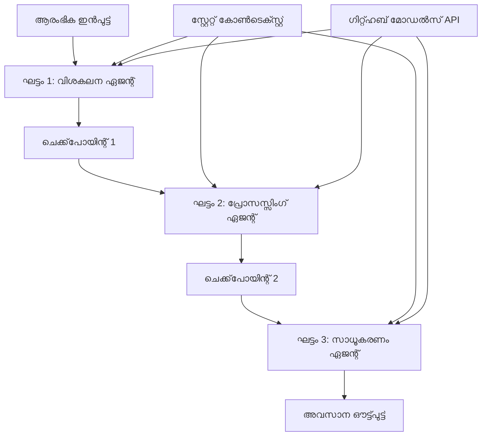

<!--
CO_OP_TRANSLATOR_METADATA:
{
  "original_hash": "1be9c8dcbd79a02d33d2c138684c1394",
  "translation_date": "2025-12-03T16:28:34+00:00",
  "source_file": "08-multi-agent/code_samples/workflows-agent-framework/dotNET/02.dotnet-agent-framework-workflow-ghmodel-sequential.md",
  "language_code": "ml"
}
-->
# ⏩ GitHub മോഡലുകളുമായി അനുക്രമ ഏജന്റ് പ്രവൃത്തി പ്രവാഹങ്ങൾ (.NET)

## 📋 ഉയർന്ന തലത്തിലുള്ള അനുക്രമ പ്രോസസ്സിംഗ് ട്യൂട്ടോറിയൽ

ഈ നോട്ട്ബുക്ക് Microsoft Agent Framework for .NET ഉപയോഗിച്ച് GitHub മോഡലുകൾ ഉപയോഗിച്ച് **അനുക്രമ പ്രവൃത്തി പ്രവാഹ പാറ്റേണുകൾ** പ്രദർശിപ്പിക്കുന്നു. ഏജന്റുകൾ ഒരു പ്രത്യേക ക്രമത്തിൽ പ്രവർത്തിക്കുന്ന, ഓരോ ഘട്ടവും മുൻ ഘട്ടത്തിന്റെ ഫലങ്ങൾ ഉപയോഗിച്ച് നിർമ്മിക്കുന്ന, വിശദമായ, ഘട്ടം ഘട്ടമായ പ്രോസസ്സിംഗ് പൈപ്പ്ലൈനുകൾ എങ്ങനെ നിർമ്മിക്കാമെന്ന് നിങ്ങൾ പഠിക്കും.

## 🎯 പഠന ലക്ഷ്യങ്ങൾ

### 🔄 **അനുക്രമ പ്രോസസ്സിംഗ് ആർക്കിടെക്ചർ**
- **ലീനിയർ പ്രവൃത്തി പ്രവാഹ രൂപകൽപ്പന**: വ്യക്തമായ ആശ്രിതത്വങ്ങളുള്ള ഘട്ടം ഘട്ടമായ പ്രോസസ്സിംഗ് പൈപ്പ്ലൈനുകൾ സൃഷ്ടിക്കുക
- **സ്റ്റേറ്റ് മാനേജ്മെന്റ്**: അനുക്രമ പ്രവൃത്തി പ്രവാഹ ഘട്ടങ്ങളിൽ പ്ര_CONTEXT_വും ഡാറ്റാ പ്രവാഹവും നിലനിർത്തുക
- **GitHub മോഡലുകളുടെ സംയോജനം**: GitHub-ന്റെ AI മോഡലുകൾ മൾട്ടി-സ്റ്റേജ് .NET പ്രവൃത്തി പ്രവാഹങ്ങളിൽ ഉപയോഗിക്കുക
- **എന്റർപ്രൈസ് പൈപ്പ്ലൈൻ പാറ്റേണുകൾ**: ഉത്പാദനത്തിന് അനുയോജ്യമായ അനുക്രമ പ്രോസസ്സിംഗ് സിസ്റ്റങ്ങൾ നിർമ്മിക്കുക

### 🏗️ **ഉയർന്ന തലത്തിലുള്ള അനുക്രമ പാറ്റേണുകൾ**
- **സ്റ്റേജ്-ഗേറ്റ് പ്രോസസ്സിംഗ്**: പ്രവൃത്തി പ്രവാഹ ഘട്ടങ്ങൾക്കിടയിൽ സാധൂകരണം ചെക്ക്പോയിന്റുകൾ നടപ്പിലാക്കുക
- **കോണ്റ്റെക്സ്റ്റ് സംരക്ഷണം**: എല്ലാ ഘട്ടങ്ങളിലും സ്റ്റേറ്റ്, സമാഹരിച്ച അറിവുകൾ നിലനിർത്തുക
- **പിശക് പ്രചരണം**: അനുക്രമ പ്രോസസ്സിംഗ് ചെയിനുകളിൽ പിശകുകൾ സുതാര്യമായി കൈകാര്യം ചെയ്യുക
- **പ്രകടന മെച്ചപ്പെടുത്തൽ**: കുറഞ്ഞ ഓവർഹെഡിൽ കാര്യക്ഷമമായ അനുക്രമ പ്രവർത്തനം

### 🏢 **എന്റർപ്രൈസ് അനുക്രമ ആപ്ലിക്കേഷനുകൾ**
- **ഡോക്യുമെന്റ് പ്രോസസ്സിംഗ് പൈപ്പ്ലൈൻ**: മൾട്ടി-സ്റ്റേജ് ഡോക്യുമെന്റ് വിശകലനം, മാറ്റം, സാധൂകരണം
- **ഗുണനിലവാര ഉറപ്പിന്റെ പ്രവൃത്തി പ്രവാഹങ്ങൾ**: അനുക്രമ അവലോകനം, സാധൂകരണം, അംഗീകാരം
- **ഉള്ളടക്ക നിർമ്മാണ പൈപ്പ്ലൈൻ**: ഗവേഷണം → എഴുത്ത് → എഡിറ്റിംഗ് → അവലോകനം → പ്രസിദ്ധീകരണം
- **ബിസിനസ് പ്രോസസ്സുകൾ ഓട്ടോമേഷൻ**: വ്യക്തമായ ഘട്ട ആശ്രിതത്വങ്ങളുള്ള മൾട്ടി-സ്റ്റെപ്പ് ബിസിനസ് പ്രവൃത്തി പ്രവാഹങ്ങൾ

## ⚙️ മുൻകൂർ ആവശ്യങ്ങൾ & സജ്ജീകരണം

### 📦 **ആവശ്യമായ NuGet പാക്കേജുകൾ**

.NET അനുക്രമ പ്രവൃത്തി പ്രവാഹങ്ങൾക്ക് ആവശ്യമായ പാക്കേജുകൾ:

```xml
<!-- Core AI Framework -->
<PackageReference Include="Microsoft.Extensions.AI" Version="9.9.0" />

<!-- Client Model Abstractions -->
<PackageReference Include="System.ClientModel" Version="1.6.1.0" />

<!-- Azure Identity and Async LINQ Support -->
<PackageReference Include="Azure.Identity" Version="1.15.0" />
<PackageReference Include="System.Linq.Async" Version="6.0.3" />

<!-- Local Agent Framework References -->
<!-- Microsoft.Agents.AI.dll - Core agent abstractions -->
<!-- Microsoft.Agents.AI.OpenAI.dll - GitHub Models integration -->
```

### 🔑 **GitHub മോഡലുകളുടെ കോൺഫിഗറേഷൻ**

**പരിസ്ഥിതി സജ്ജീകരണം (.env ഫയൽ):**
```env
GITHUB_TOKEN=your_github_personal_access_token
GITHUB_ENDPOINT=https://models.inference.ai.azure.com
GITHUB_MODEL_ID=gpt-4o-mini
```

**കോൺഫിഗറേഷൻ മാനേജ്മെന്റ്:**
```csharp
// Load environment variables securely
Env.Load("../../../.env");
var githubToken = Environment.GetEnvironmentVariable("GITHUB_TOKEN");
var githubEndpoint = Environment.GetEnvironmentVariable("GITHUB_ENDPOINT");
var modelId = Environment.GetEnvironmentVariable("GITHUB_MODEL_ID");
```

### 🏗️ **അനുക്രമ പ്രവൃത്തി പ്രവാഹ ആർക്കിടെക്ചർ**


**പ്രധാന ഘടകങ്ങൾ:**
- **അനുക്രമ ഏജന്റുകൾ**: ഓരോ പ്രോസസ്സിംഗ് ഘട്ടത്തിനും പ്രത്യേക ഏജന്റുകൾ
- **സ്റ്റേറ്റ് കോൺടെക്സ്റ്റ്**: ഘട്ടങ്ങളിൽ സമാഹരിച്ച ഡാറ്റയും തീരുമാനങ്ങളും നിലനിർത്തുന്നു
- **ചെക്ക്പോയിന്റുകൾ**: ഓരോ ഘട്ടത്തിലും ഗുണനിലവാരം ഉറപ്പാക്കാൻ സാധൂകരണം പോയിന്റുകൾ
- **GitHub മോഡലുകളുടെ ക്ലയന്റ്**: എല്ലാ പ്രവൃത്തി ഘട്ടങ്ങളിലും AI മോഡലുകളിലേക്ക് സ്ഥിരമായ ആക്സസ്

## 🎨 **അനുക്രമ പ്രവൃത്തി പ്രവാഹ രൂപകൽപ്പന പാറ്റേണുകൾ**

### 📝 **ഡോക്യുമെന്റ് പ്രോസസ്സിംഗ് പൈപ്പ്ലൈൻ**
```
Raw Document → Content Extraction → Analysis → Validation → Structured Output
```

### 🎯 **ഉള്ളടക്ക നിർമ്മാണ പ്രവൃത്തി പ്രവാഹം**
```
Brief/Requirements → Research → Content Creation → Review → Final Polish
```

### 🔍 **ഗുണനിലവാര ഉറപ്പിന്റെ പൈപ്പ്ലൈൻ**
```
Initial Review → Technical Validation → Compliance Check → Final Approval
```

### 💼 **ബിസിനസ് ഇന്റലിജൻസ് പ്രവൃത്തി പ്രവാഹം**
```
Data Collection → Processing → Analysis → Report Generation → Distribution
```

## 🏢 **എന്റർപ്രൈസ് അനുക്രമ ഗുണങ്ങൾ**

### 🎯 **വിശ്വാസ്യത & ഗുണനിലവാരം**
- **ഡിറ്റർമിനിസ്റ്റിക് പ്രോസസ്സിംഗ്**: ഘടനാപരമായ ഘട്ടങ്ങളിലൂടെ സ്ഥിരതയുള്ള, ആവർത്തനയോഗ്യമായ ഫലങ്ങൾ
- **ഗുണനിലവാര ഗേറ്റുകൾ**: ഓരോ ഘട്ടത്തിലും ഗുണനിലവാരം ഉറപ്പാക്കാൻ സാധൂകരണം പോയിന്റുകൾ
- **പിശക് ഐസലേഷൻ**: ഒരു ഘട്ടത്തിലെ പ്രശ്നങ്ങൾ തുടർന്നുള്ള ഘട്ടങ്ങളിലേക്ക് പ്രചരിക്കില്ല
- **ഓഡിറ്റ് ട്രെയിൽസ്**: ഓരോ ഘട്ടത്തിലും തീരുമാനങ്ങളും മാറ്റങ്ങളും പൂർണ്ണമായ ട്രാക്കിംഗ്

### 📈 **സ്കെയിലബിലിറ്റി & പ്രകടനം**
- **മോഡുലാർ ഡിസൈൻ**: ഓരോ ഘട്ടവും സ്വതന്ത്രമായി മെച്ചപ്പെടുത്താൻ കഴിയും
- **റിസോഴ്സ് മാനേജ്മെന്റ്**: AI മോഡൽ റിസോഴ്സുകളുടെ കാര്യക്ഷമമായ വിന്യാസം
- **സ്റ്റേറ്റ് ഓപ്റ്റിമൈസേഷൻ**: മികച്ച പ്രകടനത്തിനായി ഘട്ടങ്ങൾക്കിടയിൽ കുറഞ്ഞ സ്റ്റേറ്റ് ട്രാൻസ്ഫർ
- **പാരലൽ സ്റ്റേജ് ഗ്രൂപ്പുകൾ**: അനുക്രമ പ്രവൃത്തി പ്രവാഹങ്ങൾ ഒന്നിച്ച് പ്രവർത്തിക്കാൻ കഴിയും

### 🔒 **സുരക്ഷ & അനുസരണം**
- **ഘട്ട-തല സുരക്ഷ**: വ്യത്യസ്ത പ്രോസസ്സിംഗ് ഘട്ടങ്ങൾക്ക് വ്യത്യസ്ത സുരക്ഷാ നയങ്ങൾ
- **ഡാറ്റാ സാധൂകരണം**: ഓരോ ചെക്ക്പോയിന്റിലും ഡാറ്റാ അഖണ്ഡതയും അനുസരണവും ഉറപ്പാക്കുക
- **ആക്സസ് നിയന്ത്രണം**: വ്യത്യസ്ത പ്രവൃത്തി ഘട്ടങ്ങൾക്ക് ഗ്രാനുലാർ അനുമതികൾ
- **നിയമാനുസരണം**: ഘടനാപരമായ പ്രോസസ്സിംഗ് വഴി നിയമാനുസൃത ആവശ്യങ്ങൾ നിറവേറ്റുക

### 📊 **മോണിറ്ററിംഗ് & അനലിറ്റിക്സ്**
- **ഘട്ട-തല മെട്രിക്സ്**: ഓരോ പ്രവൃത്തി ഘട്ടത്തിനും പ്രകടന നിരീക്ഷണം
- **ബോട്ടിൽനെക്ക് തിരിച്ചറിയൽ**: മന്ദഗതിയുള്ള ഘട്ടങ്ങൾ തിരിച്ചറിയുകയും മെച്ചപ്പെടുത്തുകയും ചെയ്യുക
- **ഗുണനിലവാര മെട്രിക്സ്**: ഓരോ ഘട്ടത്തിലും ഗുണനിലവാരവും വിജയ നിരക്കുകളും ട്രാക്ക് ചെയ്യുക
- **പ്രോസസ്സുകൾ മെച്ചപ്പെടുത്തൽ**: ഘട്ട-തല അനലിറ്റിക്സിന്റെ അടിസ്ഥാനത്തിൽ തുടർച്ചയായ മെച്ചപ്പെടുത്തൽ

ശക്തമായ അനുക്രമ AI പ്രോസസ്സിംഗ് പൈപ്പ്ലൈനുകൾ നിർമ്മിക്കാം! 🚀

## 💻 കോഡ് പ്രവർത്തിപ്പിക്കൽ

`02.dotnet-agent-framework-workflow-ghmodel-sequential.cs` എന്ന ഫയലിൽ പൂർണ്ണമായ നടപ്പാക്കൽ ലഭ്യമാണ്. ഈ ഫയൽ **മൂന്ന് ഘട്ടങ്ങളുള്ള ഫർണിച്ചർ വിശകലന പ്രവൃത്തി പ്രവാഹം** പ്രദർശിപ്പിക്കുന്നു:

1. **ഘട്ടം 1 - സെയിൽസ് ഏജന്റ്**: ഫർണിച്ചർ ചിത്രങ്ങൾ വിശകലനം ചെയ്യുകയും വാങ്ങൽ നിർദേശങ്ങൾ നൽകുകയും ചെയ്യുന്നു
2. **ഘട്ടം 2 - പ്രൈസ് ഏജന്റ്**: വിശദമായ വില വിഭജനം, ബജറ്റ് ഓപ്ഷനുകൾ നൽകുന്നു
3. **ഘട്ടം 3 - ക്വോട്ട് ഏജന്റ്**: Markdown ഫോർമാറ്റിൽ പ്രൊഫഷണൽ ക്വോട്ട് ഡോക്യുമെന്റ് സൃഷ്ടിക്കുന്നു

### 🏗️ **പ്രവൃത്തി പ്രവാഹ ആർക്കിടെക്ചർ**

```
Image Input → Sales Analysis → Price Estimation → Quote Generation → Final Output
```

ഓരോ ഏജന്റും:
- മുൻ ഘട്ടത്തിൽ നിന്നുള്ള ഔട്ട്പുട്ട് കോൺടെക്സ്റ്റായി സ്വീകരിക്കുന്നു
- മുൻ വിശകലനത്തെ അടിസ്ഥാനമാക്കി പ്രത്യേക വിദഗ്ധത ഉപയോഗിച്ച് നിർമ്മിക്കുന്നു
- സ്റ്റേറ്റ് മാനേജ്മെന്റിലൂടെ പ്രവൃത്തി പ്രവാഹ തുടർച്ച നിലനിർത്തുന്നു

### 🚀 ഉദാഹരണം പ്രവർത്തിപ്പിക്കൽ

**മുൻകൂർ ആവശ്യങ്ങൾ:**
- `../imgs/home.png` (അല്ലെങ്കിൽ `imgPath` വേരിയബിൾ അപ്ഡേറ്റ് ചെയ്യുക) എന്ന സ്ഥലത്ത് ഫർണിച്ചർ ചിത്രം വയ്ക്കുക
- GitHub മോഡലുകളുടെ ക്രെഡൻഷ്യലുകൾ ഉപയോഗിച്ച് നിങ്ങളുടെ `.env` ഫയൽ കോൺഫിഗർ ചെയ്യുക

```bash
# സ്ക്രിപ്റ്റ് പ്രവർത്തനക്ഷമമാക്കുക (യൂണിക്സ്/ലിനക്സ്/മാക്ക്‌ഒഎസ്)
chmod +x 02.dotnet-agent-framework-workflow-ghmodel-sequential.cs

# അനുക്രമ പ്രവൃത്തി പ്രവഹനം പ്രവർത്തിപ്പിക്കുക
./02.dotnet-agent-framework-workflow-ghmodel-sequential.cs
```

Windows-ൽ:
```powershell
dotnet run 02.dotnet-agent-framework-workflow-ghmodel-sequential.cs
```

### 📝 പ്രതീക്ഷിക്കുന്ന ഔട്ട്പുട്ട്

പ്രവൃത്തി പ്രവാഹം:
1. **സെയിൽസ് ഏജന്റ്**: ചിത്രത്തിൽ നിന്ന് ഫർണിച്ചർ ഇനങ്ങൾ തിരിച്ചറിയുകയും നിർദേശങ്ങൾ നൽകുകയും ചെയ്യും
2. **പ്രൈസ് ഏജന്റ്**: വിശദമായ വില വിശകലനം ബജറ്റ് ടിയറുകളും ഷോപ്പിംഗ് നിർദേശങ്ങളും ചേർക്കും
3. **ക്വോട്ട് ഏജന്റ്**: എല്ലാ വിവരങ്ങളും സംയോജിപ്പിച്ച് ഫോർമാറ്റ് ചെയ്ത ക്വോട്ട് ഡോക്യുമെന്റ് സൃഷ്ടിക്കും

അവസാന ഔട്ട്പുട്ട് ചിത്ര വിശകലനത്തെ അടിസ്ഥാനമാക്കി സമഗ്രമായ, പ്രൊഫഷണൽ ഫർണിച്ചർ ക്വോട്ട് ആയിരിക്കും.

### 🔧 കസ്റ്റമൈസേഷൻ ഓപ്ഷനുകൾ

**ഏജന്റ് പെരുമാറ്റം മാറ്റുക:**
```csharp
// Adjust agent instructions to change their focus
const string SalesAgentInstructions = "Your custom instructions...";
```

**അനുക്രമ പ്രവാഹം മാറ്റുക:**
```csharp
// Add or reorder workflow stages
var workflow = new WorkflowBuilder(salesagent)
    .AddEdge(salesagent, priceagent)
    .AddEdge(priceagent, quoteagent)
    .AddEdge(quoteagent, newAgent)  // Add another stage
    .Build();
```

**വ്യത്യസ്ത ഇൻപുട്ട് ഉപയോഗിക്കുക:**
```csharp
// Process text instead of images
ChatMessage userMessage = new ChatMessage(ChatRole.User, [
    new TextContent("Analyze pricing for a modern living room set")
]);
```

### 🎯 യഥാർത്ഥ ലോക ആപ്ലിക്കേഷനുകൾ

ഈ അനുക്രമ പാറ്റേൺ അനുയോജ്യമാണ്:
- **ഇ-കൊമേഴ്‌സ്**: ഉൽപ്പന്ന വിശകലനം → വില → ക്വോട്ട് സൃഷ്ടിക്കൽ
- **റിയൽ എസ്റ്റേറ്റ്**: പ്രോപ്പർട്ടി വിശകലനം → മൂല്യനിർണ്ണയം → ലിസ്റ്റിംഗ് സൃഷ്ടിക്കൽ
- **ഇൻഷുറൻസ്**: ക്ലെയിം വിശകലനം → വിലയിരുത്തൽ → ക്വോട്ട് സൃഷ്ടിക്കൽ
- **ഉള്ളടക്ക നിർമ്മാണം**: ഗവേഷണം → എഴുത്ത് → എഡിറ്റിംഗ് → പ്രസിദ്ധീകരണം

### 🔍 സ്റ്റേറ്റ് പ്രവാഹം മനസ്സിലാക്കുക

അനുക്രമത്തിൽ ഓരോ ഏജന്റും സ്വീകരിക്കുന്നു:
- **അസൽ ഇൻപുട്ട്**: പ്രാരംഭ ഉപയോക്തൃ സന്ദേശം (ചിത്രം + ടെക്സ്റ്റ്)
- **മുൻ ഏജന്റുകളുടെ ഔട്ട്പുട്ടുകൾ**: സംഭാഷണ ചരിത്രത്തിലെ എല്ലാ മുൻ ഏജന്റ് പ്രതികരണങ്ങൾ
- **സമാഹരിച്ച കോൺടെക്സ്റ്റ്**: പ്രവൃത്തി പ്രവാഹത്തിൽ മുഴുവൻ നിലനിർത്തുന്ന പൂർണ്ണ സ്റ്റേറ്റ്

ഇത് ഓരോ ഏജന്റും മുൻ ഘട്ടങ്ങളിൽ നിന്നുള്ള സമഗ്രമായ കോൺടെക്സ്റ്റ് ഉപയോഗിച്ച് നിർമ്മിക്കുന്ന സങ്കീർണ്ണമായ മൾട്ടി-സ്റ്റേജ് പ്രോസസ്സിംഗ് സാധ്യമാക്കുന്നു.

---

<!-- CO-OP TRANSLATOR DISCLAIMER START -->
**അസത്യവാദം**:  
ഈ രേഖ AI വിവർത്തന സേവനമായ [Co-op Translator](https://github.com/Azure/co-op-translator) ഉപയോഗിച്ച് വിവർത്തനം ചെയ്തതാണ്. കൃത്യതയ്ക്കായി ഞങ്ങൾ ശ്രമിക്കുന്നുവെങ്കിലും, ഓട്ടോമേറ്റഡ് വിവർത്തനങ്ങളിൽ പിശകുകൾ അല്ലെങ്കിൽ തെറ്റായ വിവരങ്ങൾ ഉണ്ടാകാൻ സാധ്യതയുണ്ട്. അതിന്റെ സ്വാഭാവിക ഭാഷയിലുള്ള മൗലിക രേഖ പ്രാമാണികമായ ഉറവിടമായി കണക്കാക്കണം. നിർണായകമായ വിവരങ്ങൾക്ക്, പ്രൊഫഷണൽ മനുഷ്യ വിവർത്തനം ശുപാർശ ചെയ്യുന്നു. ഈ വിവർത്തനം ഉപയോഗിക്കുന്നതിൽ നിന്നുണ്ടാകുന്ന തെറ്റിദ്ധാരണകൾക്കോ തെറ്റായ വ്യാഖ്യാനങ്ങൾക്കോ ഞങ്ങൾ ഉത്തരവാദികളല്ല.
<!-- CO-OP TRANSLATOR DISCLAIMER END -->