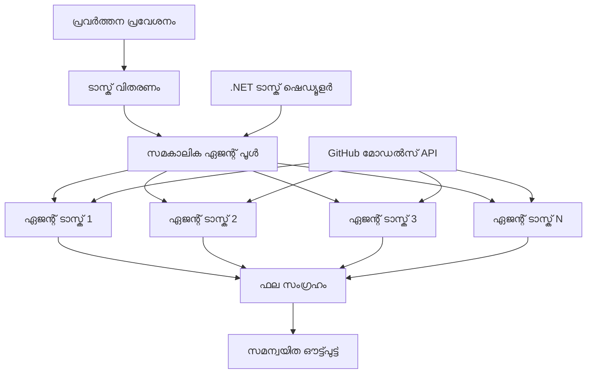

<!--
CO_OP_TRANSLATOR_METADATA:
{
  "original_hash": "b9c6e32c9b5f2fed20b6916984440d88",
  "translation_date": "2025-12-03T16:25:33+00:00",
  "source_file": "08-multi-agent/code_samples/workflows-agent-framework/dotNET/03.dotnet-agent-framework-workflow-ghmodel-concurrent.md",
  "language_code": "ml"
}
-->
# ⚡ GitHub മോഡലുകളുമായി സമകാലിക ഏജന്റ് വർക്ക്‌ഫ്ലോകൾ (.NET)

## 📋 ഉയർന്ന പ്രകടനമുള്ള സമാന്തര പ്രോസസ്സിംഗ് ട്യൂട്ടോറിയൽ

ഈ നോട്ട്ബുക്ക് Microsoft Agent Framework for .NET, GitHub മോഡലുകൾ എന്നിവ ഉപയോഗിച്ച് **സമകാലിക വർക്ക്‌ഫ്ലോ പാറ്റേണുകൾ** പ്രദർശിപ്പിക്കുന്നു. നിരവധി AI ഏജന്റുമാരെ ഒരേസമയം പ്രവർത്തിപ്പിച്ച് പരമാവധി ഫലപ്രാപ്തി നേടുകയും ഏകോപനവും ഡാറ്റാ സ്ഥിരതയും നിലനിർത്തുകയും ചെയ്യുന്ന ഉയർന്ന പ്രകടനമുള്ള സമാന്തര പ്രോസസ്സിംഗ് വർക്ക്‌ഫ്ലോകൾ നിർമ്മിക്കാൻ നിങ്ങൾക്ക് പഠിക്കാം.

## 🎯 പഠന ലക്ഷ്യങ്ങൾ

### 🚀 **സമകാലിക പ്രോസസ്സിംഗ് അടിസ്ഥാനങ്ങൾ**
- **സമാന്തര ഏജന്റ് എക്സിക്യൂഷൻ**: പരമാവധി പ്രകടനത്തിനായി നിരവധി AI ഏജന്റുമാരെ ഒരേസമയം പ്രവർത്തിപ്പിക്കുക
- **Async/Await പാറ്റേണുകൾ**: ഫലപ്രദമായ സമകാലികതയ്ക്കായി .NET ന്റെ async പ്രോഗ്രാമിംഗ് മോഡൽ ഉപയോഗിക്കുക
- **GitHub മോഡൽ ഇന്റഗ്രേഷൻ**: GitHub ന്റെ AI മോഡൽ ഇൻഫറൻസ് സേവനത്തിലേക്കുള്ള നിരവധി സമകാലിക കോൾകൾ ഏകോപിപ്പിക്കുക
- **റിസോഴ്‌സ് മാനേജ്മെന്റ്**: സമകാലിക പ്രവർത്തനങ്ങളിൽ AI മോഡൽ റിസോഴ്‌സുകൾ ഫലപ്രദമായി കൈകാര്യം ചെയ്യുക

### 🏗️ **ഉന്നത സമകാലിക ആർക്കിടെക്ചർ**
- **ടാസ്‌ക്-ബേസ്‌ഡ് പാരലലിസം**: സമകാലിക എക്സിക്യൂഷനായി .NET Task Parallel Library ഉപയോഗിക്കുക
- **സമന്വയ പാറ്റേണുകൾ**: റേസ് കണ്ടീഷനുകൾ ഒഴിവാക്കിക്കൊണ്ട് സമകാലിക ഏജന്റുമാരെ ഏകോപിപ്പിക്കുക
- **ലോഡ് ബാലൻസിംഗ്**: ലഭ്യമായ സമകാലിക പ്രോസസ്സിംഗ് ശേഷി ഫലപ്രദമായി വിതരണം ചെയ്യുക
- **ഫോൾട്ട് ടോളറൻസ്**: മുഴുവൻ വർക്ക്‌ഫ്ലോ നിർത്താതെ വ്യക്തിഗത ഏജന്റ് പരാജയങ്ങൾ കൈകാര്യം ചെയ്യുക

### 🏢 **എന്റർപ്രൈസ് സമകാലിക ആപ്ലിക്കേഷനുകൾ**
- **ഉയർന്ന വോളിയം ഡോക്യുമെന്റ് പ്രോസസ്സിംഗ്**: നിരവധി ഡോക്യുമെന്റുകൾ ഒരേസമയം പ്രോസസ് ചെയ്യുക
- **റിയൽ-ടൈം കണ്ടന്റ് അനാലിസിസ്**: വരുന്ന ഡാറ്റാ സ്ട്രീമുകളുടെ സമകാലിക വിശകലനം
- **ബാച്ച് പ്രോസസ്സിംഗ് ഓപ്റ്റിമൈസേഷൻ**: വലിയ തോതിലുള്ള ഡാറ്റാ പ്രോസസ്സിംഗ് പ്രവർത്തനങ്ങൾക്ക് പരമാവധി ഫലപ്രാപ്തി നേടുക
- **മൾട്ടി-മോഡൽ അനാലിസിസ്**: വ്യത്യസ്ത ഉള്ളടക്ക തരം, ഫോർമാറ്റുകൾ എന്നിവയുടെ സമാന്തര പ്രോസസ്സിംഗ്

## ⚙️ മുൻ‌വശങ്ങൾ & സജ്ജീകരണം

### 📦 **ആവശ്യമായ NuGet പാക്കേജുകൾ**

ഉയർന്ന പ്രകടനമുള്ള സമകാലിക വർക്ക്‌ഫ്ലോകൾക്കായി ആവശ്യമായ പാക്കേജുകൾ:

```xml
<!-- Core AI Framework with Async Support -->
<PackageReference Include="Microsoft.Extensions.AI" Version="9.9.0" />

<!-- Client Model Abstractions for API Communication -->
<PackageReference Include="System.ClientModel" Version="1.6.1.0" />

<!-- Azure Identity and Async LINQ for Advanced Operations -->
<PackageReference Include="Azure.Identity" Version="1.15.0" />
<PackageReference Include="System.Linq.Async" Version="6.0.3" />

<!-- Local Agent Framework References -->
<!-- Microsoft.Agents.AI.dll - Core agent abstractions with async support -->
<!-- Microsoft.Agents.AI.OpenAI.dll - GitHub Models integration with concurrency -->
```

### 🔑 **GitHub മോഡൽ കോൺഫിഗറേഷൻ**

**പരിസ്ഥിതി സജ്ജീകരണം (.env ഫയൽ):**
```env
GITHUB_TOKEN=your_github_personal_access_token
GITHUB_ENDPOINT=https://models.inference.ai.azure.com
GITHUB_MODEL_ID=gpt-4o-mini
```

**സമകാലിക പ്രോസസ്സിംഗ് പരിഗണനകൾ:**
```csharp
// Configure for concurrent operations
var clientOptions = new OpenAIClientOptions()
{
    Endpoint = new Uri(githubEndpoint),
    // Configure connection pooling for concurrent requests
    NetworkTimeout = TimeSpan.FromMinutes(5)
};
```

### 🏗️ **സമകാലിക വർക്ക്‌ഫ്ലോ ആർക്കിടെക്ചർ**


**പ്രധാന ഘടകങ്ങൾ:**
- **ടാസ്‌ക് പാരലൽ ലൈബ്രറി**: സമകാലിക പ്രവർത്തനങ്ങൾക്ക് .NET ന്റെ ഇൻ-ബിൽറ്റ് പിന്തുണ
- **ഏജന്റ് പൂൾ**: സമാന്തര പ്രോസസ്സിംഗിനായി നിരവധി ഏജന്റ് ഇൻസ്റ്റൻസുകൾ
- **ഫല സമാഹരണം**: സമകാലിക ഏജന്റ് ഫലങ്ങളുടെ ഏകോപനവും ലയനവും
- **സമന്വയ പോയിന്റുകൾ**: സമകാലിക പ്രവർത്തനങ്ങളിൽ ഡാറ്റാ സ്ഥിരത ഉറപ്പാക്കുക

## 🎨 **സമകാലിക വർക്ക്‌ഫ്ലോ ഡിസൈൻ പാറ്റേണുകൾ**

### 🔍 **സമാന്തര ഗവേഷണവും വിശകലനവും**
```
Research Topic → Concurrent Research Agents → Result Synthesis → Final Report
```

### 📊 **മൾട്ടി-സോഴ്‌സ് ഡാറ്റാ പ്രോസസ്സിംഗ്**
```
Data Sources → Parallel Processing Agents → Data Integration → Unified Output
```

### 🎭 **കണ്ടന്റ് ജനറേഷൻ പൈപ്പ്‌ലൈൻ**
```
Content Requirements → Concurrent Content Generators → Quality Review → Final Content
```

### 🔄 **Fan-Out/Fan-In പ്രോസസ്സിംഗ്**
```
Single Input → Multiple Concurrent Processors → Result Aggregation → Single Output
```

## 🏢 **എന്റർപ്രൈസ് പ്രകടന ഗുണങ്ങൾ**

### ⚡ **തുറന്നുപോകലും സ്കെയിലബിലിറ്റിയും**
- **ലീനിയർ പ്രകടന സ്കെയിലിംഗ്**: കൂടുതൽ സമകാലിക ഏജന്റുമാരെ ചേർത്ത് തുറന്നുപോകൽ വർദ്ധിപ്പിക്കുക
- **റിസോഴ്‌സ് ഉപയോഗം**: ലഭ്യമായ AI മോഡൽ ശേഷിയുടെ പരമാവധി ഫലപ്രാപ്തി
- **പ്രോസസ്സിംഗ് സമയം കുറവ്**: സമാന്തര എക്സിക്യൂഷനിലൂടെ സമയ ലാഭം
- **ഇലാസ്റ്റിക് സ്കെയിലിംഗ്**: വർക്ക്‌ലോഡിന്റെ അടിസ്ഥാനത്തിൽ സമകാലിക ഏജന്റ് എണ്ണം ഡൈനാമിക്കായി ക്രമീകരിക്കുക

### 🛡️ **വിശ്വാസ്യതയും പ്രതിരോധ ശേഷിയും**
- **ഫോൾട്ട് ഐസലേഷൻ**: വ്യക്തിഗത ഏജന്റ് പരാജയങ്ങൾ മറ്റ് സമകാലിക പ്രവർത്തനങ്ങളെ ബാധിക്കില്ല
- **ഗ്രേസ്‌ഫുൾ ഡിഗ്രഡേഷൻ**: ഏജന്റ് ശേഷി കുറവോടെ സിസ്റ്റം പ്രവർത്തനം തുടരുന്നു
- **എറർ റിക്കവറി**: പരാജയപ്പെട്ട സമകാലിക പ്രവർത്തനങ്ങൾക്ക് ഓട്ടോമാറ്റിക് റിട്രൈ മെക്കാനിസങ്ങൾ
- **ലോഡ് ഡിസ്‌ട്രിബ്യൂഷൻ**: ലഭ്യമായ ഏജന്റുകളിലേക്കുള്ള ജോലിയുടെ തുല്യമായ വിതരണം

### 📊 **പ്രകടന നിരീക്ഷണം**
- **സമകാലിക എക്സിക്യൂഷൻ മെട്രിക്‌സ്**: എല്ലാ സമാന്തര പ്രവർത്തനങ്ങളുടെയും പ്രകടനം ട്രാക്ക് ചെയ്യുക
- **റിസോഴ്‌സ് ഉപയോഗ അനാലിറ്റിക്സ്**: CPU, മെമ്മറി, നെറ്റ്‌വർക്ക് ഉപയോഗം നിരീക്ഷിക്കുക
- **തുറന്നുപോകൽ വിശകലനം**: സമകാലിക പ്രോസസ്സിംഗിൽ നിന്നുള്ള ഫലപ്രാപ്തി നേട്ടങ്ങൾ അളക്കുക
- **ബോട്ടിൽനെക്ക് ഡിറ്റക്ഷൻ**: പ്രകടന തടസ്സങ്ങൾ കണ്ടെത്തുകയും പരിഹരിക്കുകയും ചെയ്യുക

### 🔧 **ഡെവലപ്മെന്റും ഓപ്പറേഷനുകളും**
- **Async പ്രോഗ്രാമിംഗ് മോഡൽ**: .NET ന്റെ പക്വമായ async/await പാറ്റേണുകൾ ഉപയോഗിക്കുക
- **ടാസ്‌ക് കോർഡിനേഷൻ**: ഇൻ-ബിൽറ്റ് ടാസ്‌ക് മാനേജ്മെന്റും കോർഡിനേഷൻ ശേഷികളും
- **എക്സപ്ഷൻ ഹാൻഡ്ലിംഗ്**: സമകാലിക പ്രവർത്തനങ്ങൾക്ക് സമഗ്രമായ പിശക് കൈകാര്യം ചെയ്യൽ
- **ഡിബഗിംഗ് പിന്തുണ**: സമകാലിക വർക്ക്‌ഫ്ലോകൾക്കായി Visual Studio ഡിബഗിംഗ് ടൂളുകൾ

.NET ഉപയോഗിച്ച് ഉയർന്ന പ്രകടനമുള്ള സമകാലിക AI വർക്ക്‌ഫ്ലോകൾ നിർമ്മിക്കാം! 🚀

## 💻 കോഡ് പ്രവർത്തിപ്പിക്കൽ

പൂർണ്ണമായ നടപ്പാക്കൽ `03.dotnet-agent-framework-workflow-ghmodel-concurrent.cs` എന്ന ഫയലിൽ ലഭ്യമാണ്. ഈ ഫയൽ ഒരു **Fan-Out/Fan-In സമകാലിക വർക്ക്‌ഫ്ലോ** ട്രാവൽ പ്ലാനിംഗിനായി പ്രദർശിപ്പിക്കുന്നു:

### 🏗️ **വർക്ക്‌ഫ്ലോ ആർക്കിടെക്ചർ**

```
User Request → ConcurrentStartExecutor → [Researcher Agent || Planner Agent] → ConcurrentAggregationExecutor → Final Output
```

**പ്രധാന ഘടകങ്ങൾ:**

1. **ConcurrentStartExecutor**: ഉപയോക്തൃ അഭ്യർത്ഥനയെ എല്ലാ ഏജന്റുകളിലേക്കും ഒരേസമയം പ്രക്ഷേപണം ചെയ്യുന്നു
2. **Researcher Agent**: ഗമ്യസ്ഥലങ്ങളും ആകർഷണങ്ങളും സമകാലികമായി വിശകലനം ചെയ്യുന്നു
3. **Planner Agent**: സമകാലികമായി വിശദമായ യാത്രാ പദ്ധതികൾ സൃഷ്ടിക്കുന്നു
4. **ConcurrentAggregationExecutor**: രണ്ട് ഏജന്റുകളിൽ നിന്നുള്ള ഫലങ്ങൾ ശേഖരിക്കുകയും ലയിപ്പിക്കുകയും ചെയ്യുന്നു

### 🎯 **Fan-Out/Fan-In പാറ്റേൺ**

ഈ വർക്ക്‌ഫ്ലോ ക്ലാസിക് **Fan-Out/Fan-In** പാറ്റേൺ പ്രദർശിപ്പിക്കുന്നു:
- **Fan-Out**: ഒരു ഇൻപുട്ട് സന്ദേശം ഒരേസമയം നിരവധി ഏജന്റുകളിലേക്ക് പ്രക്ഷേപണം ചെയ്യുന്നു
- **സമകാലിക പ്രോസസ്സിംഗ്**: ഒരേ ജോലിയിൽ നിരവധി ഏജന്റുകൾ സമാന്തരമായി പ്രവർത്തിക്കുന്നു
- **Fan-In**: എല്ലാ ഏജന്റുകളുടെയും ഫലങ്ങൾ ശേഖരിക്കുകയും ഏകീകരിക്കുകയും ചെയ്യുന്നു

### 🚀 ഉദാഹരണം പ്രവർത്തിപ്പിക്കൽ

```bash
# സ്ക്രിപ്റ്റ് പ്രവർത്തനക്ഷമമാക്കുക (യൂണിക്സ്/ലിനക്സ്/മാക്ക്‌ഒഎസ്)
chmod +x 03.dotnet-agent-framework-workflow-ghmodel-concurrent.cs

# സമകാലിക പ്രവൃത്തി പ്രവഹനം പ്രവർത്തിപ്പിക്കുക
./03.dotnet-agent-framework-workflow-ghmodel-concurrent.cs
```

അല്ലെങ്കിൽ Windows-ൽ:
```powershell
dotnet run 03.dotnet-agent-framework-workflow-ghmodel-concurrent.cs
```

### 📝 പ്രതീക്ഷിക്കുന്ന ഔട്ട്പുട്ട്

വർക്ക്‌ഫ്ലോ ചെയ്യുന്നത്:
1. **അഭ്യർത്ഥന പ്രക്ഷേപണം**: "ഡിസംബറിൽ സിയാറ്റിലിലേക്ക് ഒരു യാത്രാ പദ്ധതി തയ്യാറാക്കുക" എന്നത് രണ്ട് ഏജന്റുകളിലേക്കും അയയ്ക്കുക
2. **സമകാലിക പ്രോസസ്സിംഗ്**: രണ്ട് ഏജന്റുകളും ഒരേസമയം പ്രവർത്തിക്കുന്നു:
   - റിസർചർ ആകർഷണങ്ങളും വിശദാംശങ്ങളും തിരിച്ചറിയുന്നു
   - പ്ലാനർ യാത്രാ ക്രമീകരണങ്ങളും ലജിസ്റ്റിക്സും സൃഷ്ടിക്കുന്നു
3. **ഏകീകരണം**: രണ്ട് പ്രതികരണങ്ങളും സമഗ്രമായ ഔട്ട്പുട്ടിലേക്ക് ലയിപ്പിക്കുക
4. **ഫലങ്ങൾ പ്രദർശിപ്പിക്കുക**: എല്ലാ വിവരങ്ങളോടും കൂടിയ സംയോജിത യാത്രാ പദ്ധതി പ്രദർശിപ്പിക്കുക

### 🔧 ഇഷ്ടാനുസൃതമാക്കൽ ഓപ്ഷനുകൾ

**കൂടുതൽ സമകാലിക ഏജന്റുകളെ ചേർക്കുക:**
```csharp
// Create additional specialized agents
AIAgent budgetAgent = openAIClient.GetChatClient(github_model_id).CreateAIAgent(
    name: "Budget-Agent", instructions: "Calculate travel costs...");

// Add to fan-out
var workflow = new WorkflowBuilder(startExecutor)
    .AddFanOutEdge(startExecutor, targets: [researcherAgent, plannerAgent, budgetAgent])
    .AddFanInEdge(aggregationExecutor, sources: [researcherAgent, plannerAgent, budgetAgent])
    .WithOutputFrom(aggregationExecutor)
    .Build();

// Update aggregation count
if (this._messages.Count == 3) { ... }
```

**ഏജന്റ് നിർദ്ദേശങ്ങൾ മാറ്റുക:**
```csharp
const string ResearcherAgentInstructions = "Your custom instructions for research...";
const string PlanAgentInstructions = "Your custom instructions for planning...";
```

**ടാസ്‌ക് മാറ്റുക:**
```csharp
StreamingRun run = await InProcessExecution.StreamAsync(
    workflow, 
    "Plan a European vacation for 2 weeks in summer"
);
```

### 🎯 യഥാർത്ഥ ലോക ആപ്ലിക്കേഷനുകൾ

ഈ സമകാലിക പാറ്റേൺ അനുയോജ്യമാണ്:
- **ഉള്ളടക്ക സൃഷ്ടി**: വിവിധ വിഭാഗങ്ങൾ ഒരേസമയം സൃഷ്ടിക്കുന്ന നിരവധി എഴുത്തുകാർ
- **കോഡ് റിവ്യൂ**: വിവിധ കാഴ്ചപ്പാടുകളിൽ നിന്ന് കോഡ് വിശകലനം ചെയ്യുന്ന നിരവധി റിവ്യൂവർമാർ
- **മാർക്കറ്റ് റിസർച്**: വ്യത്യസ്ത മാർക്കറ്റ് സെഗ്മെന്റുകളുടെ സമാന്തര വിശകലനം
- **ഡോക്യുമെന്റ് പ്രോസസ്സിംഗ്**: സമകാലികമായി എക്സ്ട്രാക്ഷൻ, വിശകലനം, സാധൂകരണം
- **മൾട്ടി-പേഴ്സ്പെക്റ്റീവ് അനാലിസിസ്**: ഒരേ ഇൻപുട്ടിൽ വ്യത്യസ്ത കാഴ്ചപ്പാടുകൾ നേടുക

### 🔍 കസ്റ്റം എക്സിക്യൂട്ടറുകൾ മനസ്സിലാക്കുക

**ConcurrentStartExecutor:**
- `IMessageHandler<string>` നടപ്പാക്കുന്നു, സ്ട്രിംഗ് ഇൻപുട്ട് സ്വീകരിക്കുന്നു
- സന്ദേശങ്ങൾ എല്ലാ കണക്റ്റ് ചെയ്ത ഏജന്റുകളിലേക്കും പ്രക്ഷേപണം ചെയ്യുന്നു
- സമകാലിക പ്രോസസ്സിംഗ് ആരംഭിക്കാൻ `TurnToken` അയയ്ക്കുന്നു

**ConcurrentAggregationExecutor:**
- `IMessageHandler<ChatMessage>` നടപ്പാക്കുന്നു, ഏജന്റ് പ്രതികരണങ്ങൾ സ്വീകരിക്കുന്നു
- ത്രെഡ്-സേഫ് രീതിയിൽ സന്ദേശങ്ങൾ ശേഖരിക്കുന്നു
- പ്രതീക്ഷിക്കുന്ന എല്ലാ പ്രതികരണങ്ങളും എത്തുമ്പോൾ ഏകീകരിക്കുന്നു
- `context.YieldOutputAsync()` ഉപയോഗിച്ച് അന്തിമ ഔട്ട്പുട്ട് നൽകുന്നു

### ⚡ പ്രകടന ഗുണങ്ങൾ

**സമകാലികവും അനുക്രമവുമുള്ള താരതമ്യം:**
- അനുക്രമം: Agent1 (30s) → Agent2 (30s) = **60 സെക്കൻഡ് മൊത്തം**
- സമകാലികം: Agent1 (30s) || Agent2 (30s) = **30 സെക്കൻഡ് മൊത്തം**

**തുറന്നുപോകൽ മെച്ചപ്പെടുത്തൽ**: N സമകാലിക ഏജന്റുകൾക്കായി N× വേഗത്തിൽ (വർക്ക്‌ലോഡും റിസോഴ്‌സുകളും ആശ്രയിച്ച്)

### 🛡️ പിശക് കൈകാര്യം ചെയ്യൽ

വർക്ക്‌ഫ്ലോ വ്യക്തിഗത ഏജന്റ് പരാജയങ്ങളെ സുതാര്യമായി കൈകാര്യം ചെയ്യുന്നു:
- ഒരു ഏജന്റ് പരാജയപ്പെട്ടാൽ, മറ്റ് ഏജന്റുകൾ പ്രവർത്തനം തുടരുന്നു
- അഗ്രിഗേറ്റർ ടൈംഔട്ട് ലജിക് നടപ്പിലാക്കാൻ കഴിയും
- ആവശ്യമെങ്കിൽ ഭാഗിക ഫലങ്ങൾ മടക്കിക്കൊടുക്കാം

### 📊 ഉന്നത സവിശേഷതകൾ

**ഡൈനാമിക് ഏജന്റ് എണ്ണം:**
ഏകീകരണ ലജിക് മാറ്റി വ്യത്യസ്ത ഏജന്റ് എണ്ണങ്ങൾക്ക് പിന്തുണ നൽകുക:

```csharp
private int _expectedAgentCount;
private readonly List<ChatMessage> _messages = [];

public async ValueTask HandleAsync(ChatMessage message, IWorkflowContext context)
{
    this._messages.Add(message);
    if (this._messages.Count == _expectedAgentCount)
    {
        // Process aggregation
    }
}
```

ഈ സമകാലിക വർക്ക്‌ഫ്ലോ പാറ്റേൺ ഉയർന്ന പ്രകടനമുള്ള, സ്കെയിലബിൾ AI ഏജന്റ് സിസ്റ്റങ്ങൾ നിർമ്മിക്കാൻ അനിവാര്യമാണ്!

---

<!-- CO-OP TRANSLATOR DISCLAIMER START -->
**അസത്യവാദം**:  
ഈ രേഖ AI വിവർത്തന സേവനമായ [Co-op Translator](https://github.com/Azure/co-op-translator) ഉപയോഗിച്ച് വിവർത്തനം ചെയ്തതാണ്. ഞങ്ങൾ കൃത്യതയ്ക്കായി ശ്രമിക്കുന്നുവെങ്കിലും, ഓട്ടോമേറ്റഡ് വിവർത്തനങ്ങളിൽ പിശകുകൾ അല്ലെങ്കിൽ തെറ്റായ വിവരങ്ങൾ ഉണ്ടാകാമെന്ന് ദയവായി ശ്രദ്ധിക്കുക. അതിന്റെ സ്വാഭാവിക ഭാഷയിലുള്ള മൗലിക രേഖ പ്രാമാണികമായ ഉറവിടമായി കണക്കാക്കണം. നിർണായകമായ വിവരങ്ങൾക്ക്, പ്രൊഫഷണൽ മനുഷ്യ വിവർത്തനം ശുപാർശ ചെയ്യുന്നു. ഈ വിവർത്തനം ഉപയോഗിക്കുന്നതിൽ നിന്നുണ്ടാകുന്ന തെറ്റിദ്ധാരണകൾക്കോ തെറ്റായ വ്യാഖ്യാനങ്ങൾക്കോ ഞങ്ങൾ ഉത്തരവാദികളല്ല.
<!-- CO-OP TRANSLATOR DISCLAIMER END -->