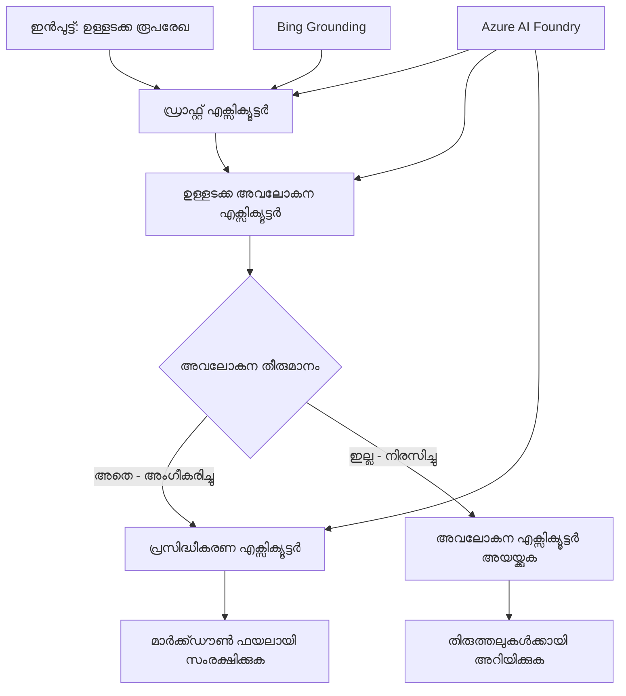

<!--
CO_OP_TRANSLATOR_METADATA:
{
  "original_hash": "8abd335151cee553293b637ee3d80d10",
  "translation_date": "2025-12-03T16:21:38+00:00",
  "source_file": "08-multi-agent/code_samples/workflows-agent-framework/dotNET/04.dotnet-agent-framework-workflow-aifoundry-condition.md",
  "language_code": "ml"
}
-->
# 🔀 Azure AI Foundry (.NET) ഉപയോഗിച്ച് നിബന്ധനാപരമായ ഏജന്റ് വർക്ക്‌ഫ്ലോകൾ

## 📋 ബുദ്ധിമാനായ തീരുമാന അടിസ്ഥാനത്തിലുള്ള വർക്ക്‌ഫ്ലോ ട്യൂട്ടോറിയൽ

ഈ നോട്ട്ബുക്ക് Azure AI Foundryയും Microsoft Agent Framework for .NET-ഉം ഉപയോഗിച്ച് **നിബന്ധനാപരമായ വർക്ക്‌ഫ്ലോ പാറ്റേണുകൾ** പ്രദർശിപ്പിക്കുന്നു. AI വിശകലനം, ബിസിനസ് നിയമങ്ങൾ, ഡൈനാമിക് നിബന്ധനകൾ എന്നിവയുടെ അടിസ്ഥാനത്തിൽ പ്രോസസ്സിംഗ് ബുദ്ധിമാനായി റൂട്ടുചെയ്യുന്ന സങ്കീർണ്ണമായ, തീരുമാനചാലകമായ വർക്ക്‌ഫ്ലോകൾ നിർമ്മിക്കാൻ നിങ്ങൾ പഠിക്കും.

## 🎯 പഠന ലക്ഷ്യങ്ങൾ

### 🧠 **ബുദ്ധിമാനായ തീരുമാന ആർക്കിടെക്ചർ**
- **നിബന്ധനാപരമായ ലജിക് നടപ്പാക്കൽ**: ഒന്നിലധികം ബ്രാഞ്ചിംഗ് പോയിന്റുകളുള്ള സങ്കീർണ്ണമായ തീരുമാന വൃക്ഷങ്ങൾ നിർമ്മിക്കുക
- **AI-ചാലകമായ റൂട്ടിംഗ്**: Azure AI Foundry മോഡലുകൾ ഉപയോഗിച്ച് ബുദ്ധിമാനായ റൂട്ടിംഗ് തീരുമാനങ്ങൾ എടുക്കുക
- **ഡൈനാമിക് വർക്ക്‌ഫ്ലോ അഡാപ്റ്റേഷൻ**: റൺടൈം വിശകലനവും നിബന്ധനകളും അടിസ്ഥാനമാക്കി വർക്ക്‌ഫ്ലോ പെരുമാറ്റം മാറ്റുക
- **എന്റർപ്രൈസ് റൂൾ ഇന്റഗ്രേഷൻ**: ബിസിനസ് ലജിക്, അനുസരണ ആവശ്യങ്ങൾ എന്നിവ വർക്ക്‌ഫ്ലോകളിൽ ഉൾപ്പെടുത്തുക

### 🔀 **ഉന്നത നിബന്ധനാപരമായ പാറ്റേണുകൾ**
- **മൾട്ടി-ക്രൈറ്റീരിയ തീരുമാനമെടുക്കൽ**: റൂട്ടിംഗ് തീരുമാനങ്ങൾക്ക് നിരവധി ഘടകങ്ങൾ വിലയിരുത്തുക
- **സന്ദർഭ-അറിയുന്ന പ്രോസസ്സിംഗ്**: വർക്ക്‌ഫ്ലോയുടെ സമാഹരിച്ച സന്ദർഭവും ചരിത്രവും അടിസ്ഥാനമാക്കി തീരുമാനങ്ങൾ എടുക്കുക
- **അഡാപ്റ്റീവ് വർക്ക്‌ഫ്ലോ മാറ്റങ്ങൾ**: റിയൽ-ടൈം നിബന്ധനകളുടെ അടിസ്ഥാനത്തിൽ പ്രോസസ്സിംഗ് പാതകൾ ഡൈനാമിക് ആയി ക്രമീകരിക്കുക
- **റൂൾ എഞ്ചിൻ ഇന്റഗ്രേഷൻ**: വർക്ക്‌ഫ്ലോകളിൽ സങ്കീർണ്ണമായ ബിസിനസ് റൂൾ എഞ്ചിനുകൾ നടപ്പാക്കുക

### 🏢 **എന്റർപ്രൈസ് നിബന്ധനാപരമായ ആപ്ലിക്കേഷനുകൾ**
- **ഡോക്യുമെന്റ് ക്ലാസിഫിക്കേഷൻ & റൂട്ടിംഗ്**: ഡോക്യുമെന്റുകൾ സ്വയം ക്ലാസിഫൈ ചെയ്ത് അനുയോജ്യമായ വർക്ക്‌ഫ്ലോകളിലേക്ക് റൂട്ടുചെയ്യുക
- **കസ്റ്റമർ സർവീസ് ട്രിയേജ്**: ഉപഭോക്തൃ ചോദ്യംകൾ പ്രത്യേക കൈകാര്യം ടീമുകളിലേക്ക് ബുദ്ധിമാനായി റൂട്ടുചെയ്യുക
- **അനുസരണവും റിസ്ക് പ്രോസസ്സിംഗും**: റിസ്ക് അസസ്മെന്റിന്റെ അടിസ്ഥാനത്തിൽ വ്യത്യസ്തമായ സാധൂകരണവും റിവ്യൂ പ്രോസസ്സുകളും പ്രയോഗിക്കുക
- **ക്വാളിറ്റി അഷുറൻസ് വർക്ക്‌ഫ്ലോകൾ**: ക്വാളിറ്റി മെട്രിക്‌സിന്റെ അടിസ്ഥാനത്തിൽ ഉള്ളടക്കം അനുയോജ്യമായ റിവ്യൂ പ്രോസസ്സുകളിലൂടെ റൂട്ടുചെയ്യുക

## ⚙️ മുൻ‌വശതകളും ക്രമീകരണവും

### 📦 **ആവശ്യമായ NuGet പാക്കേജുകൾ**

നിബന്ധനാപരമായ വർക്ക്‌ഫ്ലോ പ്രോസസ്സിംഗിനുള്ള ഉന്നത പാക്കേജുകൾ:

```xml
<!-- Core AI Framework -->
<PackageReference Include="Microsoft.Extensions.AI" Version="9.9.0" />

<!-- Azure AI Agents with Persistent State -->
<PackageReference Include="Azure.AI.Agents.Persistent" Version="1.2.0-beta.5" />

<!-- Azure Identity and Utilities -->
<PackageReference Include="Azure.Identity" Version="1.15.0" />
<PackageReference Include="System.Linq.Async" Version="6.0.3" />
<PackageReference Include="DotNetEnv" Version="3.1.1" />

<!-- Local Workflow Framework References -->
<!-- Microsoft.Agents.Workflows.dll - Advanced workflow orchestration -->
<!-- Microsoft.Agents.AI.AzureAI.dll - Azure AI Foundry integration -->
<!-- Microsoft.Agents.AI.dll - Core agent abstractions -->
```

### 🔑 **Azure AI Foundry ക്രമീകരണം**

**ആവശ്യമായ Azure റിസോഴ്‌സുകൾ:**
- നിബന്ധനാപരമായ പ്രോസസ്സിംഗ് മോഡലുകളുള്ള Azure AI Foundry വർക്ക്സ്പേസ്
- അനുയോജ്യമായ കംപ്യൂട്ട് ക്വോട്ടകളും അനുമതികളും ഉള്ള Azure സബ്സ്ക്രിപ്ഷൻ
- തീരുമാനമെടുക്കലിനും ഉള്ളടക്ക വിശകലനത്തിനും AI മോഡലുകൾ ഡെപ്ലോ ചെയ്തിരിക്കുന്നത്
- (ഓപ്ഷണൽ) Bing Search API കണക്ഷൻ ഗ്രൗണ്ടിംഗ് ശേഷികൾക്കായി

**പരിസ്ഥിതി ക്രമീകരണം (.env ഫയൽ):**
```env
# Azure AI Foundry Configuration
AZURE_AI_PROJECT_ENDPOINT=https://your-project.cognitiveservices.azure.com/
BING_CONNECTION_ID=your-bing-connection-id
```

**അനുമതി ക്രമീകരണം:**
```csharp
// Azure CLI or Managed Identity authentication
using Azure.Identity;
var credential = new AzureCliCredential();

// Load environment configuration
DotNetEnv.Env.Load("../../../.env");
```

### 🏗️ **നിബന്ധനാപരമായ വർക്ക്‌ഫ്ലോ ആർക്കിടെക്ചർ**


**പ്രധാന ഘടകങ്ങൾ:**
- **Draft Executor**: ഔട്ട്‌ലൈൻസിൽ നിന്ന് പ്രാരംഭ ഉള്ളടക്കം ഡ്രാഫ്റ്റുകൾ സൃഷ്ടിക്കുന്ന AI ഏജന്റ്
- **Content Review Executor**: ഡ്രാഫ്റ്റിന്റെ ഗുണനിലവാരവും അനുസരണവും വിലയിരുത്തുന്ന AI ഏജന്റ്
- **Conditional Routing**: റിവ്യൂ ഫലങ്ങളുടെ അടിസ്ഥാനത്തിൽ റൂട്ടിംഗ് തീരുമാന ലജിക്
- **Publish/Review Paths**: അംഗീകരിച്ച ഉള്ളടക്കത്തിനും നിരസിച്ച ഉള്ളടക്കത്തിനും വ്യത്യസ്തമായ പ്രോസസ്സിംഗ് പാതകൾ
- **State Management**: വർക്ക്‌ഫ്ലോയുടെ മുഴുവൻ സമയവും ഉള്ളടക്കവും റിവ്യൂ സന്ദർഭവും നിലനിർത്തുന്നു

## 🎨 **നിബന്ധനാപരമായ വർക്ക്‌ഫ്ലോ ഡിസൈൻ പാറ്റേണുകൾ**

### 📋 **ക്വാളിറ്റി ഗേറ്റുകളുള്ള ഉള്ളടക്കം നിർമ്മാണം**
```
Outline → Draft Creation → Quality Review → {Approve: Publish | Reject: Revise}
```

### 🎯 **റിസ്ക് അടിസ്ഥാനമാക്കിയുള്ള ഡോക്യുമെന്റ് പ്രോസസ്സിംഗ്**
```
Document → Risk Assessment → {Low: Standard | High: Enhanced Review}
```

### 🔍 **ബുദ്ധിമാനായ കസ്റ്റമർ സർവീസ് റൂട്ടിംഗ്**
```
Customer Query → Analysis → {Simple: FAQ Bot | Complex: Human Agent}
```

### 💼 **അനുസരണ-ചാലകമായ വർക്ക്‌ഫ്ലോകൾ**
```
Content → Compliance Check → {Pass: Publish | Fail: Legal Review}
```

## 🏢 **എന്റർപ്രൈസ് നിബന്ധനാപരമായ ഗുണങ്ങൾ**

### 🎯 **ബുദ്ധിമാനായ ഓട്ടോമേഷൻ**
- **സ്മാർട്ട് തീരുമാനമെടുക്കൽ**: ഉള്ളടക്ക വിശകലനവും സന്ദർഭവും അടിസ്ഥാനമാക്കി AI-ചാലകമായ റൂട്ടിംഗ് തീരുമാനങ്ങൾ
- **അഡാപ്റ്റീവ് പ്രോസസ്സിംഗ്**: മാറ്റുന്ന നിബന്ധനകളുടെ അടിസ്ഥാനത്തിൽ സ്വയം ക്രമീകരിക്കുന്ന വർക്ക്‌ഫ്ലോകൾ
- **ബിസിനസ് റൂൾ പ്രയോഗം**: സങ്കീർണ്ണമായ ബിസിനസ് ലജിക്, നയങ്ങൾ എന്നിവയുടെ സ്വയം പ്രയോഗം
- **സന്ദർഭ-അറിയുന്ന റൂട്ടിംഗ്**: സമ്പൂർണ്ണ വർക്ക്‌ഫ്ലോ ചരിത്രവും സമാഹരിച്ച സന്ദർഭവും അടിസ്ഥാനമാക്കിയുള്ള തീരുമാനങ്ങൾ

### 📈 **ഓപ്പറേഷണൽ മികവ്**
- **ഓപ്റ്റിമൈസ്ഡ് റിസോഴ്‌സ് അലോക്കേഷൻ**: ഏറ്റവും അനുയോജ്യമായ വിദഗ്ധരും പ്രോസസ്സുകളും റൂട്ടുചെയ്യുക
- **കുറഞ്ഞ മാനുവൽ ഇടപെടൽ**: ഓട്ടോമേറ്റഡ് തീരുമാനമെടുക്കൽ മനുഷ്യ റൂട്ടിംഗ് ആവശ്യം കുറയ്ക്കുന്നു
- **വേഗത്തിലുള്ള പരിഹാര സമയം**: അനുയോജ്യമായ വിദഗ്ധതയിലേക്ക് നേരിട്ട് റൂട്ടിംഗ്
- **സമാനമായ പ്രയോഗം**: ബിസിനസ് റൂളുകളും തീരുമാന മാനദണ്ഡങ്ങളും ഏകീകൃതമായി പ്രയോഗിക്കുക

### 🛡️ **റിസ്ക് മാനേജ്മെന്റും അനുസരണവും**
- **ഓട്ടോമേറ്റഡ് റിസ്ക് അസസ്മെന്റ്**: ഉള്ളടക്കവും സ്ഥിതിയും റിസ്ക് ലെവലുകൾ AI-ചാലകമായി വിലയിരുത്തുക
- **അനുസരണ പ്രയോഗം**: ആവശ്യമായ റെഗുലേറ്ററി പ്രോസസ്സുകളിലൂടെ സ്വയം റൂട്ടിംഗ്
- **സുരക്ഷാ പ്രോട്ടോക്കോൾ പ്രയോഗം**: റിസ്ക് അസസ്മെന്റിന്റെ അടിസ്ഥാനത്തിൽ മെച്ചപ്പെട്ട സുരക്ഷാ നടപടികൾ
- **ഓഡിറ്റ് ട്രെയിൽ പരിപാലനം**: റൂട്ടിംഗ് തീരുമാനങ്ങളും കാരണംവുമുള്ള സമ്പൂർണ്ണ ഡോക്യുമെന്റേഷൻ

### 📊 **വിശകലനവും തുടർച്ചയായ മെച്ചപ്പെടുത്തലും**
- **തീരുമാന വിശകലനം**: റൂട്ടിംഗ് തീരുമാനങ്ങളുടെ ഫലപ്രാപ്തിയും കൃത്യതയും ട്രാക്ക് ചെയ്യുക
- **പാറ്റേൺ തിരിച്ചറിയൽ**: സമയത്തിനിടയിൽ റൂട്ടിംഗ് തീരുമാനങ്ങളിൽ ട്രെൻഡുകളും പാറ്റേണുകളും തിരിച്ചറിയുക
- **പ്രകടന ഓപ്റ്റിമൈസേഷൻ**: തീരുമാന മാനദണ്ഡങ്ങളും റൂട്ടിംഗ് ഫലപ്രാപ്തിയും തുടർച്ചയായി മെച്ചപ്പെടുത്തുക
- **ബിസിനസ് ഇന്റലിജൻസ്**: ഉള്ളടക്കത്തിന്റെ സവിശേഷതകളിലും പ്രോസസ്സിംഗ് ആവശ്യകതകളിലും洞洞洞洞洞洞洞洞洞洞洞洞洞洞洞洞洞洞洞洞洞洞洞洞洞洞洞洞洞洞洞洞洞洞洞洞洞洞洞洞洞洞洞洞洞洞洞洞洞洞洞洞洞洞洞洞洞洞洞洞洞洞洞洞洞洞洞洞洞洞洞洞洞洞洞洞洞洞洞洞洞洞洞洞洞洞洞洞洞洞洞洞洞洞洞洞洞洞洞洞洞洞洞洞洞洞洞洞洞洞洞洞洞洞洞洞洞洞洞洞洞洞洞洞洞洞洞洞洞洞洞洞洞洞洞洞洞洞洞洞洞洞洞洞洞洞洞洞洞洞洞洞洞洞洞洞洞洞洞洞洞洞洞洞洞洞洞洞洞洞洞洞洞洞洞洞洞洞洞洞洞洞洞洞洞洞洞洞洞洞洞洞洞洞洞洞洞洞洞洞洞洞洞洞洞洞洞洞洞洞洞洞洞洞洞洞洞洞洞洞洞洞洞洞洞洞洞洞洞洞洞洞洞洞洞洞洞洞洞洞洞洞洞洞洞洞洞洞洞洞洞洞洞洞洞洞洞洞洞洞洞洞洞洞洞洞洞洞洞洞洞洞洞洞洞洞洞洞洞洞洞洞洞洞洞洞洞洞洞洞洞洞洞洞洞洞洞洞洞洞洞洞洞洞洞洞洞洞洞洞洞洞洞洞洞洞洞洞洞洞洞洞洞洞洞洞洞洞洞洞洞洞洞洞洞洞洞洞洞洞洞洞洞洞洞洞洞洞洞洞洞洞洞洞洞洞洞洞洞洞洞洞洞洞洞洞洞洞洞洞洞洞洞洞洞洞洞洞洞洞洞洞洞洞洞洞洞洞洞洞洞洞洞洞洞洞洞洞洞洞洞洞洞洞洞洞洞洞洞洞洞洞洞洞洞洞洞洞洞洞洞洞洞洞洞洞洞洞洞洞洞洞洞洞洞洞洞洞洞洞洞洞洞洞洞洞洞洞洞洞洞洞洞洞洞洞洞洞洞洞洞洞洞洞洞洞洞洞洞洞洞洞洞洞洞洞洞洞洞洞洞洞洞洞洞洞洞洞洞洞洞洞洞洞洞洞洞洞洞洞洞洞洞洞洞洞洞洞洞洞洞洞洞洞洞洞洞洞洞洞洞洞洞洞洞洞洞洞洞洞洞洞洞洞洞洞洞洞洞洞洞洞洞洞洞洞洞洞洞洞洞洞洞洞洞洞洞洞洞洞洞洞洞洞洞洞洞洞洞洞洞洞洞洞洞洞洞洞洞洞洞洞洞洞洞洞洞洞洞洞洞洞洞洞洞洞洞洞洞洞洞洞洞洞洞洞洞洞洞洞洞洞洞洞洞洞洞洞洞洞洞洞洞洞洞洞洞洞洞洞洞洞洞洞洞洞洞洞洞洞洞洞洞洞洞洞洞洞洞洞洞洞洞洞洞洞洞洞洞洞洞洞洞洞洞洞洞洞洞洞洞洞洞洞洞洞洞洞洞洞洞洞洞洞洞洞洞洞洞洞洞洞洞洞洞洞洞洞洞洞洞洞洞洞洞洞洞洞洞洞洞洞洞洞洞洞洞洞洞洞洞洞洞洞洞洞洞洞洞洞洞洞洞洞洞洞洞洞洞洞洞洞洞洞洞洞洞洞洞洞洞洞洞洞洞洞洞洞洞洞洞洞洞洞洞洞洞洞洞洞洞洞洞洞洞洞洞洞洞洞洞洞洞洞洞洞洞洞洞洞洞洞洞洞洞洞洞洞洞洞洞洞洞洞洞洞洞洞洞洞洞洞洞洞洞洞洞洞洞洞洞洞洞洞洞洞洞洞洞洞洞洞洞洞洞洞洞洞洞洞洞洞洞洞洞洞洞洞洞洞洞洞洞洞洞洞洞洞洞洞洞洞洞洞洞洞洞洞洞洞洞洞洞洞洞洞洞洞洞洞洞洞洞洞洞洞洞洞洞洞洞洞洞洞洞洞洞洞洞洞洞洞洞洞洞洞洞洞洞洞洞洞洞洞洞洞洞洞洞洞洞洞洞洞洞洞洞洞洞洞洞洞洞洞洞洞洞洞洞洞洞洞洞洞洞洞洞洞洞洞洞洞洞洞洞洞洞洞洞洞洞洞洞洞洞洞洞洞洞洞洞洞洞洞洞洞洞洞洞洞洞洞洞洞洞洞洞洞洞洞洞洞洞洞洞洞洞洞洞洞洞洞洞洞洞洞洞洞洞洞洞洞洞洞洞洞洞洞洞洞洞洞洞洞洞洞洞洞洞洞洞洞洞洞洞洞洞洞洞洞洞洞洞洞洞洞洞洞洞洞洞洞洞洞洞洞洞洞洞洞洞洞洞洞洞洞洞洞洞洞洞洞洞洞洞洞洞洞洞洞洞洞洞洞洞洞洞洞洞洞洞洞洞洞洞洞洞洞洞洞洞洞洞洞洞洞洞洞洞洞洞洞洞洞洞洞洞洞洞洞洞洞洞洞洞洞洞洞洞洞洞洞洞洞洞洞洞洞洞洞洞洞洞洞洞洞洞洞洞洞洞洞洞洞洞洞洞洞洞洞洞洞洞洞洞洞洞洞洞洞洞洞洞洞洞洞洞洞洞洞洞洞洞洞洞洞洞洞洞洞洞洞洞洞洞洞洞洞洞洞洞洞洞洞洞洞洞洞洞洞洞洞洞洞洞洞洞洞洞洞洞洞洞洞洞洞洞洞洞洞洞洞洞洞洞洞洞洞洞洞洞洞洞洞洞洞洞洞洞洞洞洞洞洞洞洞洞洞洞洞洞洞洞洞洞洞洞洞洞洞洞洞洞洞洞洞洞洞洞洞洞洞洞洞洞洞洞洞洞洞洞洞洞洞洞洞洞洞洞洞洞洞洞洞洞洞洞洞洞洞洞洞洞洞洞洞洞洞洞洞洞洞洞洞洞洞洞洞洞洞洞洞洞洞洞洞洞洞洞洞洞洞洞洞洞洞洞洞洞洞洞洞洞洞洞洞洞洞洞洞洞洞洞洞洞洞洞洞洞洞洞洞洞洞洞洞洞洞洞洞洞洞洞洞洞洞洞洞洞洞洞洞洞洞洞洞洞洞洞洞洞洞洞洞洞洞洞洞洞洞洞洞洞洞洞洞洞洞洞洞洞洞洞洞洞洞洞洞洞洞洞洞洞洞洞洞洞洞洞洞洞洞洞洞洞洞洞洞洞洞洞洞洞洞洞洞洞洞洞洞洞洞洞洞洞洞洞洞洞洞洞洞洞洞洞洞洞洞洞洞洞洞洞洞洞洞洞洞洞洞洞洞洞洞洞洞洞洞洞洞洞洞洞洞洞洞洞洞洞洞洞洞洞洞洞洞洞洞洞洞洞洞洞洞洞洞洞洞洞洞洞洞洞洞洞洞洞洞洞洞洞洞洞洞洞洞洞洞洞洞洞洞洞洞洞洞洞洞洞洞洞洞洞洞洞洞洞洞洞洞洞洞洞洞洞洞洞洞洞洞洞洞洞洞洞洞洞洞洞洞洞洞洞洞洞洞洞洞洞洞洞洞洞洞洞洞洞洞洞洞洞洞洞洞洞洞洞洞洞洞洞洞洞洞洞洞洞洞洞洞洞洞洞洞洞洞洞洞洞洞洞洞洞洞洞洞洞洞洞洞洞洞洞洞洞洞洞洞洞洞洞洞洞洞洞洞洞洞洞洞洞洞洞洞洞洞洞洞洞洞洞洞洞洞洞洞洞洞洞洞洞洞洞洞洞洞洞洞洞洞洞洞洞洞洞洞洞洞洞洞洞洞洞洞洞洞洞洞洞洞洞洞洞洞洞洞洞洞洞洞洞洞洞洞洞洞洞洞洞洞洞洞洞洞洞洞洞洞洞洞洞洞洞洞洞洞洞洞洞洞洞洞洞洞洞洞洞洞洞洞洞洞洞洞洞洞洞洞洞洞洞洞洞洞洞洞洞洞洞洞洞洞洞洞洞洞洞洞洞洞洞洞洞洞洞洞洞洞洞洞洞洞洞洞洞洞洞洞洞洞洞洞洞洞洞洞洞洞洞洞洞洞洞洞洞洞洞洞洞洞洞洞洞洞洞洞洞洞洞洞洞洞洞洞洞洞洞洞洞洞洞洞洞洞洞洞洞洞洞洞洞洞洞洞洞洞洞洞洞洞洞洞洞洞洞洞洞洞洞洞洞洞洞洞洞洞洞洞洞洞洞洞洞洞洞洞洞洞洞洞洞洞洞洞洞洞洞洞洞洞洞洞洞洞洞洞洞洞洞洞洞洞洞洞洞洞洞洞洞洞洞洞洞洞洞洞洞洞洞洞洞洞洞洞洞洞洞洞洞洞洞洞洞洞洞洞洞洞洞洞洞洞洞洞洞洞洞洞洞洞洞洞洞洞洞洞洞洞洞洞洞洞洞洞洞洞洞洞洞洞洞洞洞洞洞洞洞洞洞洞洞洞洞洞洞洞洞洞洞洞洞洞洞洞洞洞洞洞洞洞洞洞洞洞洞洞洞洞洞洞洞洞洞洞洞洞洞洞洞洞洞洞洞洞洞洞洞洞洞洞洞洞洞洞洞洞洞洞洞洞洞洞

---

<!-- CO-OP TRANSLATOR DISCLAIMER START -->
**അസത്യവാദം**:  
ഈ രേഖ AI വിവർത്തന സേവനമായ [Co-op Translator](https://github.com/Azure/co-op-translator) ഉപയോഗിച്ച് വിവർത്തനം ചെയ്തതാണ്. കൃത്യതയ്ക്കായി ഞങ്ങൾ ശ്രമിക്കുന്നുവെങ്കിലും, ഓട്ടോമേറ്റഡ് വിവർത്തനങ്ങളിൽ പിശകുകൾ അല്ലെങ്കിൽ തെറ്റായ വിവരങ്ങൾ ഉണ്ടാകാൻ സാധ്യതയുണ്ട്. അതിന്റെ സ്വാഭാവിക ഭാഷയിലുള്ള മൗലിക രേഖ പ്രാമാണികമായ ഉറവിടമായി പരിഗണിക്കണം. നിർണായകമായ വിവരങ്ങൾക്ക്, പ്രൊഫഷണൽ മനുഷ്യ വിവർത്തനം ശുപാർശ ചെയ്യുന്നു. ഈ വിവർത്തനം ഉപയോഗിക്കുന്നതിൽ നിന്നുണ്ടാകുന്ന തെറ്റിദ്ധാരണകൾക്കോ തെറ്റായ വ്യാഖ്യാനങ്ങൾക്കോ ഞങ്ങൾ ഉത്തരവാദികളല്ല.
<!-- CO-OP TRANSLATOR DISCLAIMER END -->