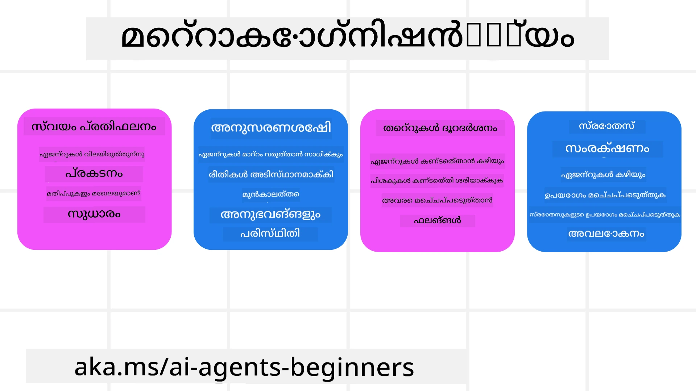
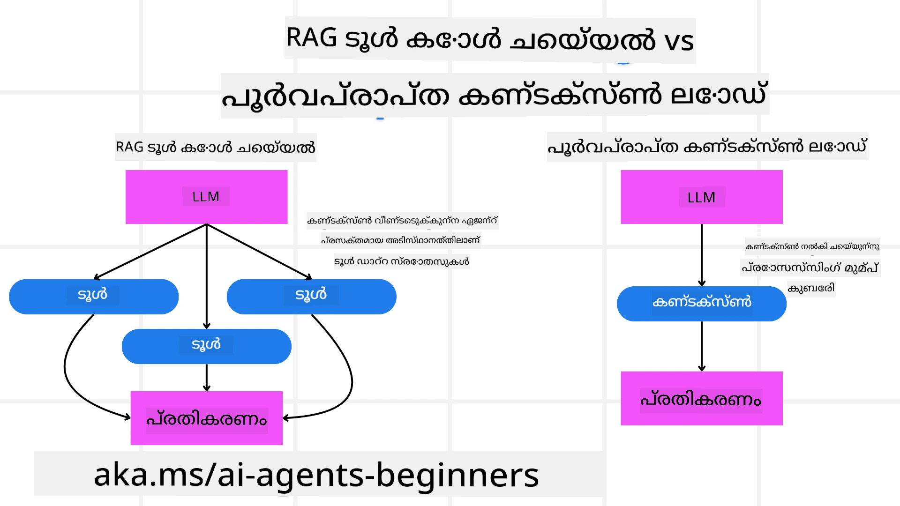

<!--
CO_OP_TRANSLATOR_METADATA:
{
  "original_hash": "5f0deef171fc3a68d5d3d770a8bfb03d",
  "translation_date": "2025-12-03T15:39:29+00:00",
  "source_file": "09-metacognition/README.md",
  "language_code": "ml"
}
-->
[](https://youtu.be/His9R6gw6Ec?si=3_RMb8VprNvdLRhX)

> _(മുകളിൽ കാണുന്ന ചിത്രം ക്ലിക്കുചെയ്ത് ഈ പാഠത്തിന്റെ വീഡിയോ കാണുക)_
# AI ഏജന്റുകളിൽ മെറ്റാകോഗ്നിഷൻ

## പരിചയം

AI ഏജന്റുകളിൽ മെറ്റാകോഗ്നിഷൻ എന്ന പാഠത്തിലേക്ക് സ്വാഗതം! AI ഏജന്റുകൾ അവരുടെ സ്വന്തം ചിന്താ പ്രക്രിയകളെ കുറിച്ച് എങ്ങനെ ചിന്തിക്കുന്നു എന്ന് അറിയാൻ ആഗ്രഹിക്കുന്ന തുടക്കക്കാർക്കായി ഈ അധ്യായം രൂപകൽപ്പന ചെയ്തിരിക്കുന്നു. ഈ പാഠം അവസാനിപ്പിക്കുമ്പോഴേക്കും, നിങ്ങൾക്ക് പ്രധാന ആശയങ്ങൾ മനസ്സിലാക്കാനും മെറ്റാകോഗ്നിഷൻ AI ഏജന്റ് ഡിസൈനിൽ പ്രായോഗിക ഉദാഹരണങ്ങൾ ഉപയോഗിക്കാനും കഴിയും.

## പഠന ലക്ഷ്യങ്ങൾ

ഈ പാഠം പൂർത്തിയാക്കിയ ശേഷം, നിങ്ങൾക്ക്:

1. ഏജന്റ് നിർവചനങ്ങളിൽ റീസണിംഗ് ലൂപ്പുകളുടെ പ്രാധാന്യം മനസ്സിലാക്കുക.
2. സ്വയം തിരുത്തുന്ന ഏജന്റുകൾക്ക് സഹായകരമായ പ്ലാനിംഗ്, മൂല്യനിർണയ സാങ്കേതികതകൾ ഉപയോഗിക്കുക.
3. ടാസ്കുകൾ പൂർത്തിയാക്കാൻ കോഡ് കൈകാര്യം ചെയ്യാൻ കഴിവുള്ള നിങ്ങളുടെ സ്വന്തം ഏജന്റുകൾ സൃഷ്ടിക്കുക.

## മെറ്റാകോഗ്നിഷനിലേക്ക് ഒരു പരിചയം

മെറ്റാകോഗ്നിഷൻ എന്നത് ഒരാളുടെ സ്വന്തം ചിന്തയെ കുറിച്ച് ചിന്തിക്കുന്ന ഉയർന്ന തലത്തിലുള്ള ബൗദ്ധിക പ്രക്രിയകളെ സൂചിപ്പിക്കുന്നു. AI ഏജന്റുകൾക്കായി, ഇത് സ്വയം ബോധവും മുൻ അനുഭവങ്ങളും അടിസ്ഥാനമാക്കി അവരുടെ പ്രവർത്തനങ്ങളെ വിലയിരുത്താനും ക്രമീകരിക്കാനും കഴിവുള്ളതായിരിക്കണം. മെറ്റാകോഗ്നിഷൻ, അല്ലെങ്കിൽ "ചിന്തയെ കുറിച്ച് ചിന്തിക്കുക," ഏജന്റിക് AI സിസ്റ്റങ്ങളുടെ വികസനത്തിൽ ഒരു പ്രധാന ആശയമാണ്. ഇത് AI സിസ്റ്റങ്ങൾ അവരുടെ സ്വന്തം ആന്തരിക പ്രക്രിയകളെക്കുറിച്ച് ബോധവാന്മാരാകാനും അവരുടെ പെരുമാറ്റം നിരീക്ഷിക്കാനും നിയന്ത്രിക്കാനും ക്രമീകരിക്കാനും കഴിവുള്ളതാക്കുന്നു. നമ്മൾ ഒരു പ്രശ്നത്തെ വിലയിരുത്തുമ്പോഴോ ഒരു സാഹചര്യത്തെ മനസ്സിലാക്കുമ്പോഴോ ചെയ്യുന്നതുപോലെ. ഈ സ്വയം ബോധം AI സിസ്റ്റങ്ങൾക്ക് മികച്ച തീരുമാനങ്ങൾ എടുക്കാനും പിഴവുകൾ തിരിച്ചറിയാനും അവരുടെ പ്രകടനം മെച്ചപ്പെടുത്താനും സഹായകമാകും- വീണ്ടും ട്യൂറിംഗ് ടെസ്റ്റിനോടും AI നിയന്ത്രണം ഏറ്റെടുക്കുമോ എന്ന ചർച്ചയോടും ബന്ധിപ്പിക്കുന്നു.

ഏജന്റിക് AI സിസ്റ്റങ്ങളുടെ പശ്ചാത്തലത്തിൽ, മെറ്റാകോഗ്നിഷൻ ചില വെല്ലുവിളികൾക്ക് പരിഹാരം കാണാൻ സഹായിക്കുന്നു, ഉദാഹരണത്തിന്:
- സുതാര്യത: AI സിസ്റ്റങ്ങൾ അവരുടെ ചിന്തകളും തീരുമാനങ്ങളും വിശദീകരിക്കാൻ കഴിയുന്നുവെന്ന് ഉറപ്പാക്കുന്നു.
- റീസണിംഗ്: AI സിസ്റ്റങ്ങൾക്ക് വിവരങ്ങൾ സംശ്ലേഷണം ചെയ്യാനും ശബ്ദപരമായ തീരുമാനങ്ങൾ എടുക്കാനും കഴിവ് വർദ്ധിപ്പിക്കുന്നു.
- അനുകൂലനം: പുതിയ പരിസ്ഥിതികളിലും മാറുന്ന സാഹചര്യങ്ങളിലും AI സിസ്റ്റങ്ങൾക്ക് ക്രമീകരണം നടത്താൻ അനുവദിക്കുന്നു.
- ധാരണ: പരിസ്ഥിതിയിൽ നിന്ന് ഡാറ്റ തിരിച്ചറിയുന്നതിലും വ്യാഖ്യാനിക്കുന്നതിലും AI സിസ്റ്റങ്ങളുടെ കൃത്യത മെച്ചപ്പെടുത്തുന്നു.

### മെറ്റാകോഗ്നിഷൻ എന്താണ്?

മെറ്റാകോഗ്നിഷൻ, അല്ലെങ്കിൽ "ചിന്തയെ കുറിച്ച് ചിന്തിക്കുക," സ്വയം ബോധവും ബൗദ്ധിക പ്രക്രിയകളുടെ സ്വയം നിയന്ത്രണവും ഉൾക്കൊള്ളുന്ന ഒരു ഉയർന്ന തലത്തിലുള്ള ബൗദ്ധിക പ്രക്രിയയാണ്. AI ന്റെ ലോകത്ത്, മെറ്റാകോഗ്നിഷൻ ഏജന്റുകൾക്ക് അവരുടെ തന്ത്രങ്ങളും പ്രവർത്തനങ്ങളും വിലയിരുത്താനും ക്രമീകരിക്കാനും കഴിവ് നൽകുന്നു, ഇത് മെച്ചപ്പെട്ട പ്രശ്നപരിഹാരവും തീരുമാനമെടുക്കലും സാധ്യമാക്കുന്നു. മെറ്റാകോഗ്നിഷനെ മനസ്സിലാക്കുന്നതിലൂടെ, നിങ്ങൾ കൂടുതൽ ബുദ്ധിമാനായതും അനുകൂലനക്ഷമവുമായ AI ഏജന്റുകൾ രൂപകൽപ്പന ചെയ്യാൻ കഴിയും. യഥാർത്ഥ മെറ്റാകോഗ്നിഷനിൽ, AI അതിന്റെ സ്വന്തം ചിന്തയെ വ്യക്തമായി വിലയിരുത്തുന്നത് നിങ്ങൾ കാണും.

ഉദാഹരണം: “ഞാൻ ചെലവുകുറഞ്ഞ ഫ്ലൈറ്റുകൾ മുൻഗണന നൽകി... നേരിട്ടുള്ള ഫ്ലൈറ്റുകൾ നഷ്ടപ്പെടാൻ സാധ്യതയുണ്ട്, അതിനാൽ വീണ്ടും പരിശോധിക്കാം.”  
ഒരു പ്രത്യേക മാർഗം എങ്ങനെ/എന്തുകൊണ്ട് തിരഞ്ഞെടുക്കുകയാണെന്ന് ട്രാക്ക് ചെയ്യുക.  
- കഴിഞ്ഞ തവണ ഉപയോക്തൃ മുൻഗണനകളിൽ അതിവിശ്വാസം കാണിച്ചതിനാൽ പിഴവുകൾ സംഭവിച്ചതായി ശ്രദ്ധിച്ച്, അതിന്റെ തീരുമാനമെടുക്കൽ തന്ത്രം മാറ്റുന്നു, അന്തിമ ശുപാർശ മാത്രം മാറ്റുന്നില്ല.  
- "ഉപയോക്താവ് 'കൂടിയ തിരക്ക്' എന്ന് പരാമർശിക്കുന്നതിനെപ്പോഴെല്ലാം, ഞാൻ ചില ആകർഷണങ്ങൾ നീക്കം ചെയ്യുക മാത്രമല്ല, 'മികച്ച ആകർഷണങ്ങൾ' തിരഞ്ഞെടുക്കുന്ന എന്റെ രീതി ജനപ്രിയതയെ അടിസ്ഥാനമാക്കി എപ്പോഴും റാങ്ക് ചെയ്യുന്നത് തെറ്റായിരിക്കുന്നു" എന്ന പാറ്റേണുകൾ തിരിച്ചറിയുന്നു.

### AI ഏജന്റുകളിൽ മെറ്റാകോഗ്നിഷന്റെ പ്രാധാന്യം

മെറ്റാകോഗ്നിഷൻ AI ഏജന്റ് ഡിസൈനിൽ നിരവധി കാരണങ്ങളാൽ നിർണായകമാണ്:



- സ്വയംപരിശോധന: ഏജന്റുകൾ അവരുടെ പ്രകടനം വിലയിരുത്തുകയും മെച്ചപ്പെടുത്തേണ്ട മേഖലകൾ തിരിച്ചറിയുകയും ചെയ്യുന്നു.
- അനുകൂലനക്ഷമത: ഏജന്റുകൾ മുൻ അനുഭവങ്ങളും മാറുന്ന സാഹചര്യങ്ങളും അടിസ്ഥാനമാക്കി അവരുടെ തന്ത്രങ്ങൾ മാറ്റുന്നു.
- പിഴവുതിരുത്തൽ: ഏജന്റുകൾ സ്വയം പിഴവുകൾ കണ്ടെത്തുകയും തിരുത്തുകയും ചെയ്യുന്നു, ഇത് കൂടുതൽ കൃത്യമായ ഫലങ്ങൾ നൽകുന്നു.
- വിഭവങ്ങളുടെ കാര്യക്ഷമ ഉപയോഗം: ഏജന്റുകൾ അവരുടെ പ്രവർത്തനങ്ങൾ പ്ലാൻ ചെയ്യുകയും വിലയിരുത്തുകയും ചെയ്യുന്നതിലൂടെ സമയം, കംപ്യൂട്ടേഷണൽ പവർ എന്നിവയുടെ ഉപയോഗം മെച്ചപ്പെടുത്തുന്നു.

## AI ഏജന്റിന്റെ ഘടകങ്ങൾ

മെറ്റാകോഗ്നിറ്റീവ് പ്രക്രിയകളിലേക്ക് കടക്കുന്നതിന് മുമ്പ്, ഒരു AI ഏജന്റിന്റെ അടിസ്ഥാന ഘടകങ്ങൾ മനസ്സിലാക്കുന്നത് അനിവാര്യമാണ്. ഒരു AI ഏജന്റ് സാധാരണയായി ഉൾക്കൊള്ളുന്നു:

- വ്യക്തിത്വം: ഉപയോക്താക്കളുമായി എങ്ങനെ ഇടപെടുന്നു എന്ന് നിർവചിക്കുന്ന ഏജന്റിന്റെ വ്യക്തിത്വവും സ്വഭാവവും.
- ഉപകരണങ്ങൾ: ഏജന്റിന് നിർവഹിക്കാൻ കഴിയുന്ന കഴിവുകളും പ്രവർത്തനങ്ങളും.
- കഴിവുകൾ: ഏജന്റിന് ഉള്ള അറിവും വിദഗ്ധതയും.

ഈ ഘടകങ്ങൾ ചേർന്ന് പ്രത്യേക ടാസ്കുകൾ നിർവഹിക്കാൻ കഴിയുന്ന ഒരു "വിദഗ്ധത യൂണിറ്റ്" സൃഷ്ടിക്കുന്നു.

**ഉദാഹരണം**:  
ഒരു യാത്രാ ഏജന്റിനെ പരിഗണിക്കുക, ഉപയോക്താവിന്റെ മുൻ യാത്രാനുഭവങ്ങൾക്കും റിയൽ-ടൈം ഡാറ്റയ്ക്കും അടിസ്ഥാനമാക്കി അവന്റെ പാത ക്രമീകരിക്കുന്ന സേവനങ്ങൾ നൽകുന്നു.

### ഉദാഹരണം: ഒരു യാത്രാ ഏജന്റ് സേവനത്തിലെ മെറ്റാകോഗ്നിഷൻ

നിങ്ങൾ ഒരു AI ഉപയോഗിച്ച് പ്രവർത്തിക്കുന്ന യാത്രാ ഏജന്റ് സേവനം രൂപകൽപ്പന ചെയ്യുകയാണെന്ന് കരുതുക. ഈ ഏജന്റ്, "യാത്രാ ഏജന്റ്," ഉപയോക്താക്കളെ അവരുടെ അവധിക്കാലം പ്ലാൻ ചെയ്യുന്നതിൽ സഹായിക്കുന്നു. മെറ്റാകോഗ്നിഷൻ ഉൾപ്പെടുത്താൻ, യാത്രാ ഏജന്റിന് സ്വയം ബോധവും മുൻ അനുഭവങ്ങളും അടിസ്ഥാനമാക്കി തന്റെ പ്രവർത്തനങ്ങളെ വിലയിരുത്താനും ക്രമീകരിക്കാനും കഴിവുണ്ടാകണം. മെറ്റാകോഗ്നിഷൻ എങ്ങനെ ഒരു പങ്ക് വഹിക്കുമെന്ന് ഇവിടെ കാണാം:

#### നിലവിലെ ടാസ്ക്

ഒരു ഉപയോക്താവിനെ പാരിസിലേക്ക് ഒരു യാത്ര പ്ലാൻ ചെയ്യുന്നതിൽ സഹായിക്കുക.

#### ടാസ്ക് പൂർത്തിയാക്കാനുള്ള ഘട്ടങ്ങൾ

1. **ഉപയോക്തൃ മുൻഗണനകൾ ശേഖരിക്കുക**: യാത്രാ തീയതികൾ, ബജറ്റ്, താൽപ്പര്യങ്ങൾ (ഉദാ: മ്യൂസിയങ്ങൾ, ഭക്ഷണം, ഷോപ്പിംഗ്), പ്രത്യേക ആവശ്യങ്ങൾ എന്നിവയെക്കുറിച്ച് ഉപയോക്താവിനോട് ചോദിക്കുക.  
2. **വിവരങ്ങൾ ശേഖരിക്കുക**: ഉപയോക്തൃ മുൻഗണനകൾക്ക് അനുയോജ്യമായ ഫ്ലൈറ്റ് ഓപ്ഷനുകൾ, താമസ സൗകര്യങ്ങൾ, ആകർഷണങ്ങൾ, റെസ്റ്റോറന്റുകൾ എന്നിവ തിരയുക.  
3. **ശുപാർശകൾ സൃഷ്ടിക്കുക**: ഫ്ലൈറ്റ് വിശദാംശങ്ങൾ, ഹോട്ടൽ ബുക്കിംഗുകൾ, ശുപാർശ ചെയ്ത പ്രവർത്തനങ്ങൾ എന്നിവയുള്ള വ്യക്തിഗത ഇട്ടിനററി നൽകുക.  
4. **ഫീഡ്ബാക്ക് അടിസ്ഥാനമാക്കി ക്രമീകരിക്കുക**: ശുപാർശകളെക്കുറിച്ച് ഉപയോക്താവിന്റെ ഫീഡ്ബാക്ക് ചോദിച്ച് ആവശ്യമായ മാറ്റങ്ങൾ വരുത്തുക.

#### ആവശ്യമായ വിഭവങ്ങൾ

- ഫ്ലൈറ്റ്, ഹോട്ടൽ ബുക്കിംഗ് ഡാറ്റാബേസുകളിലേക്ക് ആക്സസ്.  
- പാരിസിലെ ആകർഷണങ്ങളും റെസ്റ്റോറന്റുകളും സംബന്ധിച്ച വിവരങ്ങൾ.  
- മുൻ ഇടപാടുകളിൽ നിന്നുള്ള ഉപയോക്തൃ ഫീഡ്ബാക്ക് ഡാറ്റ.  

#### അനുഭവവും സ്വയംപരിശോധനയും

യാത്രാ ഏജന്റ് തന്റെ പ്രകടനം വിലയിരുത്താനും മുൻ അനുഭവങ്ങളിൽ നിന്ന് പഠിക്കാനും മെറ്റാകോഗ്നിഷൻ ഉപയോഗിക്കുന്നു. ഉദാഹരണത്തിന്:

1. **ഉപയോക്തൃ ഫീഡ്ബാക്ക് വിശകലനം**: ഏത് ശുപാർശകൾ ഉപയോക്താക്കൾക്ക് ഇഷ്ടമായിരുന്നു, ഏത് ഇഷ്ടമായിരുന്നില്ല എന്ന് യാത്രാ ഏജന്റ് അവലോകനം ചെയ്യുന്നു. ഭാവിയിലെ ശുപാർശകൾ അതനുസരിച്ച് ക്രമീകരിക്കുന്നു.  
2. **അനുകൂലനക്ഷമത**: ഒരു ഉപയോക്താവ് തിരക്കേറിയ സ്ഥലങ്ങൾ ഇഷ്ടപ്പെടുന്നില്ലെന്ന് മുമ്പ് പരാമർശിച്ചിട്ടുണ്ടെങ്കിൽ, യാത്രാ ഏജന്റ് ഭാവിയിൽ തിരക്കേറിയ ടൂറിസ്റ്റ് സ്ഥലങ്ങൾ പീക്ക് മണിക്കൂറുകളിൽ ശുപാർശ ചെയ്യുന്നത് ഒഴിവാക്കും.  
3. **പിഴവുതിരുത്തൽ**: ഒരു ഹോട്ടൽ ഫുള്ളായിരുന്നിട്ടും ശുപാർശ ചെയ്തതുപോലുള്ള പിഴവുകൾ മുമ്പ് സംഭവിച്ചിട്ടുണ്ടെങ്കിൽ, ശുപാർശകൾ നൽകുന്നതിന് മുമ്പ് ലഭ്യത കൂടുതൽ കൃത്യമായി പരിശോധിക്കാൻ അത് പഠിക്കുന്നു.  

#### പ്രായോഗിക ഡെവലപ്പർ ഉദാഹരണം

```python
class Travel_Agent:
    def __init__(self):
        self.user_preferences = {}
        self.experience_data = []

    def gather_preferences(self, preferences):
        self.user_preferences = preferences

    def retrieve_information(self):
        # മുൻഗണനകളുടെ അടിസ്ഥാനത്തിൽ വിമാനങ്ങൾ, ഹോട്ടലുകൾ, ആകർഷണങ്ങൾ എന്നിവ തിരയുക
        flights = search_flights(self.user_preferences)
        hotels = search_hotels(self.user_preferences)
        attractions = search_attractions(self.user_preferences)
        return flights, hotels, attractions

    def generate_recommendations(self):
        flights, hotels, attractions = self.retrieve_information()
        itinerary = create_itinerary(flights, hotels, attractions)
        return itinerary

    def adjust_based_on_feedback(self, feedback):
        self.experience_data.append(feedback)
        # പ്രതികരണങ്ങൾ വിശകലനം ചെയ്ത് ഭാവിയിലെ ശുപാർശകൾ ക്രമീകരിക്കുക
        self.user_preferences = adjust_preferences(self.user_preferences, feedback)

# ഉദാഹരണ ഉപയോഗം
travel_agent = Travel_Agent()
preferences = {
    "destination": "Paris",
    "dates": "2025-04-01 to 2025-04-10",
    "budget": "moderate",
    "interests": ["museums", "cuisine"]
}
travel_agent.gather_preferences(preferences)
itinerary = travel_agent.generate_recommendations()
print("Suggested Itinerary:", itinerary)
feedback = {"liked": ["Louvre Museum"], "disliked": ["Eiffel Tower (too crowded)"]}
travel_agent.adjust_based_on_feedback(feedback)
```
  
#### മെറ്റാകോഗ്നിഷൻ എന്തുകൊണ്ട് പ്രധാനമാണ്

- **സ്വയംപരിശോധന**: ഏജന്റുകൾ അവരുടെ പ്രകടനം വിശകലനം ചെയ്യുകയും മെച്ചപ്പെടുത്തേണ്ട മേഖലകൾ തിരിച്ചറിയുകയും ചെയ്യുന്നു.  
- **അനുകൂലനക്ഷമത**: ഫീഡ്ബാക്ക്, മാറുന്ന സാഹചര്യങ്ങൾ എന്നിവയെ അടിസ്ഥാനമാക്കി ഏജന്റുകൾ തന്ത്രങ്ങൾ മാറ്റുന്നു.  
- **പിഴവുതിരുത്തൽ**: ഏജന്റുകൾ സ്വയം പിഴവുകൾ കണ്ടെത്തുകയും തിരുത്തുകയും ചെയ്യുന്നു.  
- **വിഭവങ്ങളുടെ കാര്യക്ഷമ ഉപയോഗം**: ഏജന്റുകൾ സമയം, കംപ്യൂട്ടേഷണൽ പവർ എന്നിവയുടെ ഉപയോഗം മെച്ചപ്പെടുത്തുന്നു.  

മെറ്റാകോഗ്നിഷൻ ഉൾപ്പെടുത്തുന്നതിലൂടെ, യാത്രാ ഏജന്റ് കൂടുതൽ വ്യക്തിഗതവും കൃത്യവുമായ യാത്രാ ശുപാർശകൾ നൽകാൻ കഴിയും, ഉപയോക്തൃ അനുഭവം മെച്ചപ്പെടുത്തുന്നു.

---

## 2. ഏജന്റുകളിൽ പ്ലാനിംഗ്

പ്ലാനിംഗ് AI ഏജന്റിന്റെ പെരുമാറ്റത്തിന്റെ ഒരു നിർണായക ഘടകമാണ്. നിലവിലെ അവസ്ഥ, വിഭവങ്ങൾ, സാധ്യതയുള്ള തടസ്സങ്ങൾ എന്നിവ പരിഗണിച്ച് ഒരു ലക്ഷ്യം നേടുന്നതിനുള്ള ഘട്ടങ്ങൾ രൂപകൽപ്പന ചെയ്യുന്നതാണ് ഇതിന്റെ ലക്ഷ്യം.

### പ്ലാനിംഗിന്റെ ഘടകങ്ങൾ

- **നിലവിലെ ടാസ്ക്**: ടാസ്ക് വ്യക്തമായി നിർവചിക്കുക.  
- **ടാസ്ക് പൂർത്തിയാക്കാനുള്ള ഘട്ടങ്ങൾ**: ടാസ്ക് കൈകാര്യം ചെയ്യാവുന്ന ഘട്ടങ്ങളായി വിഭജിക്കുക.  
- **ആവശ്യമായ വിഭവങ്ങൾ**: ആവശ്യമായ വിഭവങ്ങൾ തിരിച്ചറിയുക.  
- **അനുഭവം**: പ്ലാനിംഗ് അറിയിക്കാൻ മുൻ അനുഭവങ്ങൾ ഉപയോഗിക്കുക.  

**ഉദാഹരണം**:  
യാത്രാ ഏജന്റ് ഒരു ഉപയോക്താവിനെ അവരുടെ യാത്ര ഫലപ്രദമായി പ്ലാൻ ചെയ്യുന്നതിൽ സഹായിക്കാൻ സ്വീകരിക്കേണ്ട ഘട്ടങ്ങൾ:  

### യാത്രാ ഏജന്റിനുള്ള ഘട്ടങ്ങൾ

1. **ഉപയോക്തൃ മുൻഗണനകൾ ശേഖരിക്കുക**  
   - യാത്രാ തീയതികൾ, ബജറ്റ്, താൽപ്പര്യങ്ങൾ, പ്രത്യേക ആവശ്യങ്ങൾ എന്നിവയെക്കുറിച്ച് ഉപയോക്താവിനോട് ചോദിക്കുക.  
   - ഉദാഹരണങ്ങൾ: "നിങ്ങൾ യാത്ര ചെയ്യാൻ ആഗ്രഹിക്കുന്ന തീയതികൾ എന്തൊക്കെയാണ്?" "നിങ്ങളുടെ ബജറ്റ് പരിധി എന്താണ്?" "അവധിക്കാലത്ത് നിങ്ങൾക്ക് ഇഷ്ടമുള്ള പ്രവർത്തനങ്ങൾ എന്തൊക്കെയാണ്?"  

2. **വിവരങ്ങൾ ശേഖരിക്കുക**  
   - ഉപയോക്തൃ മുൻഗണനകൾ അടിസ്ഥാനമാക്കി അനുയോജ്യമായ യാത്രാ ഓപ്ഷനുകൾ തിരയുക.  
   - **ഫ്ലൈറ്റുകൾ**: ഉപയോക്താവിന്റെ ബജറ്റിനും യാത്രാ തീയതികൾക്കും അനുയോജ്യമായ ഫ്ലൈറ്റുകൾ കണ്ടെത്തുക.  
   - **താമസ സൗകര്യങ്ങൾ**: ഉപയോക്താവിന്റെ മുൻഗണനകൾക്ക് അനുയോജ്യമായ ഹോട്ടലുകൾ അല്ലെങ്കിൽ വാടക പ്രോപ്പർട്ടികൾ കണ്ടെത്തുക.  
   - **ആകർഷണങ്ങളും റെസ്റ്റോറന്റുകളും**: ഉപയോക്താവിന്റെ താൽപ്പര്യങ്ങൾക്ക് അനുയോജ്യമായ ജനപ്രിയ ആകർഷണങ്ങൾ, പ്രവർത്തനങ്ങൾ, ഭക്ഷണ ഓപ്ഷനുകൾ തിരിച്ചറിയുക.  

3. **ശുപാർശകൾ സൃഷ്ടിക്കുക**  
   - ശേഖരിച്ച വിവരങ്ങൾ വ്യക്തിഗത ഇട്ടിനററിയായി സംയോജിപ്പിക്കുക.  
   - ഉപയോക്തൃ മുൻഗണനകൾക്ക് അനുയോജ്യമായ ശുപാർശകൾ നൽകുക.  

4. **ഇട്ടിനററി ഉപയോക്താവിനോട് പങ്കിടുക**  
   - ശുപാർശ ചെയ്ത ഇട്ടിനററി ഉപയോക്താവിനോട് അവലോകനത്തിനായി പങ്കിടുക.  
   - ഉദാഹരണം: "നിങ്ങളുടെ പാരിസ് യാത്രയ്ക്ക് ഒരു ശുപാർശ ചെയ്ത ഇട്ടിനററിയാണ് ഇവിടെ. ഇതിൽ ഫ്ലൈറ്റ് വിശദാംശങ്ങൾ, ഹോട്ടൽ ബുക്കിംഗുകൾ, ശുപാർശ ചെയ്ത പ്രവർത്തനങ്ങൾ, റെസ്റ്റോറന്റുകൾ എന്നിവ ഉൾപ്പെടുന്നു. നിങ്ങളുടെ അഭിപ്രായം അറിയിക്കുക!"  

5. **ഫീഡ്ബാക്ക് ശേഖരിക്കുക**  
   - ശുപാർശ ചെയ്ത ഇട്ടിനററിയെക്കുറിച്ച് ഉപയോക്താവിന്റെ ഫീഡ്ബാക്ക് ചോദിക്കുക.  
   - ഉദാഹരണങ്ങൾ: "ഫ്ലൈറ്റ് ഓപ്ഷനുകൾ നിങ്ങൾക്ക് ഇഷ്ടമാണോ?" "ഹോട്ടൽ നിങ്ങളുടെ ആവശ്യങ്ങൾക്ക് അനുയോജ്യമാണോ?" "നിങ്ങൾക്ക് ചേർക്കാനോ നീക്കാനോ ആഗ്രഹിക്കുന്ന പ്രവർത്തനങ്ങൾ ഉണ്ടോ?"  

6. **ഫീഡ്ബാക്ക് അടിസ്ഥാനമാക്കി ക്രമീകരിക്കുക**  
   - ഉപയോക്താവിന്റെ ഫീഡ്ബാക്ക് അടിസ്ഥാനമാക്കി ഇട്ടിനററി മാറ്റുക.  
   - ഉപയോക്തൃ മുൻഗണനകൾക്ക് കൂടുതൽ അനുയോജ്യമായ ഫ്ലൈറ്റ്, താമസ സൗകര്യങ്ങൾ, പ്രവർത്തന ശുപാർശകൾ എന്നിവയിൽ ആവശ്യമായ മാറ്റങ്ങൾ വരുത്തുക.  

7. **അവസാന സ്ഥിരീകരണം**  
   - അപ്ഡേറ്റ് ചെയ്ത ഇട്ടിനററി ഉപയോക്താവിനോട് അന്തിമ സ്ഥിരീകരണത്തിനായി അവതരിപ്പിക്കുക.  
   - ഉദാഹരണം: "നിങ്ങളുടെ ഫീഡ്ബാക്ക് അടിസ്ഥാനമാക്കി ഞാൻ മാറ്റങ്ങൾ വരുത്തി. അപ്ഡേറ്റ് ചെയ്ത ഇട്ടിനററിയാണ് ഇവിടെ. എല്ലാം നിങ്ങൾക്ക് ശരിയാണെന്ന് തോന്നുന്നുണ്ടോ?"  

8. **ബുക്കിംഗുകളും സ്ഥിരീകരണങ്ങളും പൂർത്തിയാക്കുക**  
   - ഉപയോക്താവ് ഇട്ടിനററി അംഗീകരിച്ച ശേഷം, ഫ്ലൈറ്റുകൾ, താമസ സൗകര്യങ്ങൾ, മുൻകൂട്ടി പ്ലാൻ ചെയ്ത പ്രവർത്തനങ്ങൾ എന്നിവ ബുക്ക് ചെയ്യുക.  
   - സ്ഥിരീകരണ വിശദാംശങ്ങൾ ഉപയോക്താവിന് അയയ്ക്കുക.  

9. **തുടർച്ചയായ പിന്തുണ നൽകുക**  
   - യാത്രയ്ക്കുമുമ്പും യാത്രയ്ക്കിടയിലും ഉപയോക്താവിന് മാറ്റങ്ങൾ അല്ലെങ്കിൽ അധിക അഭ്യർത്ഥനകൾ കൈകാര്യം ചെയ്യാൻ സഹായിക്കുക.  
   - ഉദാഹരണം: "നിങ്ങളുടെ യാത്രയ്ക്കിടയിൽ നിങ്ങൾക്ക് കൂടുതൽ സഹായം ആവശ്യമുണ്ടെങ്കിൽ, എപ്പോഴും എന്നെ സമീപിക്കാം!"  

### ഉദാഹരണ ഇടപെടൽ

```python
class Travel_Agent:
    def __init__(self):
        self.user_preferences = {}
        self.experience_data = []

    def gather_preferences(self, preferences):
        self.user_preferences = preferences

    def retrieve_information(self):
        flights = search_flights(self.user_preferences)
        hotels = search_hotels(self.user_preferences)
        attractions = search_attractions(self.user_preferences)
        return flights, hotels, attractions

    def generate_recommendations(self):
        flights, hotels, attractions = self.retrieve_information()
        itinerary = create_itinerary(flights, hotels, attractions)
        return itinerary

    def adjust_based_on_feedback(self, feedback):
        self.experience_data.append(feedback)
        self.user_preferences = adjust_preferences(self.user_preferences, feedback)

# ബുക്കിംഗ് അഭ്യർത്ഥനയ്ക്കുള്ള ഉദാഹരണ ഉപയോഗം
travel_agent = Travel_Agent()
preferences = {
    "destination": "Paris",
    "dates": "2025-04-01 to 2025-04-10",
    "budget": "moderate",
    "interests": ["museums", "cuisine"]
}
travel_agent.gather_preferences(preferences)
itinerary = travel_agent.generate_recommendations()
print("Suggested Itinerary:", itinerary)
feedback = {"liked": ["Louvre Museum"], "disliked": ["Eiffel Tower (too crowded)"]}
travel_agent.adjust_based_on_feedback(feedback)
```
  
## 3. തിരുത്തൽ RAG സിസ്റ്റം

ആദ്യം RAG ടൂൾ, പ്രീ-എംപ്റ്റീവ് കോൺടെക്സ്റ്റ് ലോഡ് എന്നിവ തമ്മിലുള്ള വ്യത്യാസം മനസ്സിലാക്കാം.



### റിട്രീവൽ-ഓഗ്മെന്റഡ് ജനറേഷൻ (RAG)

RAG ഒരു റിട്രീവൽ സിസ്റ്റത്തെയും ഒരു ജനറേറ്റീവ് മോഡലിനെയും സംയോജിപ്പിക്കുന്നു. ഒരു ക്വറി നൽകിയാൽ, റിട്രീവൽ സിസ്റ്റം ഒരു ബാഹ്യ സ്രോതസ്സിൽ നിന്ന് അനുയോജ്യമായ ഡോക്യുമെന്റുകൾ അല്ലെങ്കിൽ ഡാറ്റ തിരയുകയും ഈ റിട്രീവ്ചെയ്ത വിവരങ്ങൾ ജനറേറ്റീവ് മോഡലിലേക്ക് ഇൻപുട്ട് ആയി ഉപയോഗിക്കുകയും ചെയ്യുന്നു. ഇത് മോഡ
പ്രാരംഭ സാഹചര്യ ലോഡ് എന്നത് ഒരു ക്വറി പ്രോസസ്സ് ചെയ്യുന്നതിന് മുമ്പ് അനുയോജ്യമായ പശ്ചാത്തലമോ വിവരങ്ങളോ മോഡലിൽ ലോഡ് ചെയ്യുന്നതാണ്. ഇത് മോഡലിന് തുടക്കത്തിൽ തന്നെ ഈ വിവരങ്ങൾ ലഭ്യമാക്കുന്നു, ഇത് പ്രക്രിയയ്ക്കിടെ അധിക ഡാറ്റ തിരയേണ്ടതില്ലാതെ കൂടുതൽ വിവരമുള്ള പ്രതികരണങ്ങൾ സൃഷ്ടിക്കാൻ സഹായിക്കും.

ഇതിന്റെ ഒരു ലളിതമായ ഉദാഹരണം Python-ൽ ഒരു ട്രാവൽ ഏജന്റ് ആപ്ലിക്കേഷൻക്കായി പ്രാരംഭ സാഹചര്യ ലോഡ് എങ്ങനെ കാണപ്പെടും എന്നതാണ്:

```python
class TravelAgent:
    def __init__(self):
        # ജനപ്രിയമായ ഗമ്യസ്ഥലങ്ങളും അവയുടെ വിവരങ്ങളും മുൻകൂട്ടി ലോഡ് ചെയ്യുക
        self.context = {
            "Paris": {"country": "France", "currency": "Euro", "language": "French", "attractions": ["Eiffel Tower", "Louvre Museum"]},
            "Tokyo": {"country": "Japan", "currency": "Yen", "language": "Japanese", "attractions": ["Tokyo Tower", "Shibuya Crossing"]},
            "New York": {"country": "USA", "currency": "Dollar", "language": "English", "attractions": ["Statue of Liberty", "Times Square"]},
            "Sydney": {"country": "Australia", "currency": "Dollar", "language": "English", "attractions": ["Sydney Opera House", "Bondi Beach"]}
        }

    def get_destination_info(self, destination):
        # മുൻകൂട്ടി ലോഡ് ചെയ്ത കോൺടെക്സ്റ്റിൽ നിന്ന് ഗമ്യസ്ഥല വിവരങ്ങൾ കൊണ്ടുവരുക
        info = self.context.get(destination)
        if info:
            return f"{destination}:\nCountry: {info['country']}\nCurrency: {info['currency']}\nLanguage: {info['language']}\nAttractions: {', '.join(info['attractions'])}"
        else:
            return f"Sorry, we don't have information on {destination}."

# ഉദാഹരണ ഉപയോഗം
travel_agent = TravelAgent()
print(travel_agent.get_destination_info("Paris"))
print(travel_agent.get_destination_info("Tokyo"))
```

#### വിശദീകരണം

1. **ആരംഭം (`__init__` മെത്തഡ്)**: `TravelAgent` ക്ലാസ് പാരിസ്, ടോക്കിയോ, ന്യൂയോർക്ക്, സിഡ്നി തുടങ്ങിയ പ്രശസ്തമായ സ്ഥലങ്ങളെക്കുറിച്ചുള്ള വിവരങ്ങൾ അടങ്ങിയ ഒരു ഡിക്ഷണറി പ്രീ-ലോഡ് ചെയ്യുന്നു. ഈ ഡിക്ഷണറിയിൽ ഓരോ സ്ഥലത്തിന്റെയും രാജ്യം, കറൻസി, ഭാഷ, പ്രധാന ആകർഷണങ്ങൾ എന്നിവ ഉൾപ്പെടുന്നു.

2. **വിവരങ്ങൾ തിരയൽ (`get_destination_info` മെത്തഡ്)**: ഒരു ഉപയോക്താവ് ഒരു പ്രത്യേക സ്ഥലത്തെക്കുറിച്ച് ചോദിക്കുമ്പോൾ, `get_destination_info` മെത്തഡ് പ്രീ-ലോഡ് ചെയ്ത സാഹചര്യ ഡിക്ഷണറിയിൽ നിന്ന് അനുയോജ്യമായ വിവരങ്ങൾ തിരയുന്നു.

സാഹചര്യം പ്രീ-ലോഡ് ചെയ്യുന്നതിലൂടെ, ട്രാവൽ ഏജന്റ് ആപ്ലിക്കേഷൻ ഉപയോക്തൃ ക്വറികൾക്ക് വേഗത്തിൽ പ്രതികരിക്കാൻ കഴിയും, റിയൽ-ടൈമിൽ ഈ വിവരങ്ങൾ ഒരു ബാഹ്യ സ്രോതസ്സിൽ നിന്ന് തിരയേണ്ടതില്ല. ഇത് ആപ്ലിക്കേഷൻ കൂടുതൽ കാര്യക്ഷമവും പ്രതികരണശീലവുമാക്കുന്നു.

### ആവർത്തനത്തിന് മുമ്പ് ലക്ഷ്യത്തോടെ പ്ലാൻ ബൂട്ട്‌സ്ട്രാപ്പ് ചെയ്യുക

ലക്ഷ്യത്തോടെ പ്ലാൻ ബൂട്ട്‌സ്ട്രാപ്പ് ചെയ്യുക എന്നത് ഒരു വ്യക്തമായ ലക്ഷ്യവും അല്ലെങ്കിൽ ലക്ഷ്യഫലവും മനസ്സിലാക്കി ആരംഭിക്കുന്നതിനെ സൂചിപ്പിക്കുന്നു. ഈ ലക്ഷ്യം മുൻകൂട്ടി നിർവചിക്കുന്നതിലൂടെ, മോഡൽ ആവർത്തന പ്രക്രിയയിൽ മുഴുവൻ ഇതിനെ ഒരു മാർഗ്ഗനിർദ്ദേശമായി ഉപയോഗിക്കാം. ഇത് ഓരോ ആവർത്തനവും ആവശ്യമായ ഫലത്തെ നേടുന്നതിന് അടുത്ത് നീങ്ങുന്നതിന് സഹായിക്കുന്നു, പ്രക്രിയ കൂടുതൽ കാര്യക്ഷമവും കേന്ദ്രീകൃതവുമാക്കുന്നു.

Python-ൽ ഒരു ട്രാവൽ ഏജന്റിനായി ആവർത്തനത്തിന് മുമ്പ് ഒരു ലക്ഷ്യത്തോടെ ഒരു യാത്രാ പ്ലാൻ എങ്ങനെ ബൂട്ട്‌സ്ട്രാപ്പ് ചെയ്യാമെന്ന് കാണുന്ന ഉദാഹരണം ഇതാ:

### സന്നിവേശം

ഒരു ട്രാവൽ ഏജന്റ് ഒരു ക്ലയന്റിനായി ഇഷ്ടാനുസൃത അവധിയാത്രാ പദ്ധതി തയ്യാറാക്കാൻ ആഗ്രഹിക്കുന്നു. ലക്ഷ്യം ക്ലയന്റിന്റെ ഇഷ്ടങ്ങളും ബജറ്റും അടിസ്ഥാനമാക്കി ഒരു യാത്രാ ഷെഡ്യൂൾ സൃഷ്ടിച്ച് അവരുടെ സംതൃപ്തി പരമാവധി ആക്കുക.

### ഘട്ടങ്ങൾ

1. ക്ലയന്റിന്റെ ഇഷ്ടങ്ങളും ബജറ്റും നിർവചിക്കുക.
2. ഈ ഇഷ്ടങ്ങൾ അടിസ്ഥാനമാക്കി പ്രാരംഭ പദ്ധതി ബൂട്ട്‌സ്ട്രാപ്പ് ചെയ്യുക.
3. ക്ലയന്റിന്റെ സംതൃപ്തി പരമാവധി ആക്കുന്നതിന് പദ്ധതി ആവർത്തിച്ച് മെച്ചപ്പെടുത്തുക.

#### Python കോഡ്

```python
class TravelAgent:
    def __init__(self, destinations):
        self.destinations = destinations

    def bootstrap_plan(self, preferences, budget):
        plan = []
        total_cost = 0

        for destination in self.destinations:
            if total_cost + destination['cost'] <= budget and self.match_preferences(destination, preferences):
                plan.append(destination)
                total_cost += destination['cost']

        return plan

    def match_preferences(self, destination, preferences):
        for key, value in preferences.items():
            if destination.get(key) != value:
                return False
        return True

    def iterate_plan(self, plan, preferences, budget):
        for i in range(len(plan)):
            for destination in self.destinations:
                if destination not in plan and self.match_preferences(destination, preferences) and self.calculate_cost(plan, destination) <= budget:
                    plan[i] = destination
                    break
        return plan

    def calculate_cost(self, plan, new_destination):
        return sum(destination['cost'] for destination in plan) + new_destination['cost']

# ഉദാഹരണ ഉപയോഗം
destinations = [
    {"name": "Paris", "cost": 1000, "activity": "sightseeing"},
    {"name": "Tokyo", "cost": 1200, "activity": "shopping"},
    {"name": "New York", "cost": 900, "activity": "sightseeing"},
    {"name": "Sydney", "cost": 1100, "activity": "beach"},
]

preferences = {"activity": "sightseeing"}
budget = 2000

travel_agent = TravelAgent(destinations)
initial_plan = travel_agent.bootstrap_plan(preferences, budget)
print("Initial Plan:", initial_plan)

refined_plan = travel_agent.iterate_plan(initial_plan, preferences, budget)
print("Refined Plan:", refined_plan)
```

#### കോഡ് വിശദീകരണം

1. **ആരംഭം (`__init__` മെത്തഡ്)**: `TravelAgent` ക്ലാസ്, ഓരോ സ്ഥലത്തിന്റെയും പേര്, ചെലവ്, പ്രവർത്തന തരം പോലുള്ള ഗുണങ്ങളുള്ള സാധ്യതയുള്ള സ്ഥലങ്ങളുടെ പട്ടികയോടെ ആരംഭിക്കുന്നു.

2. **പ്ലാൻ ബൂട്ട്‌സ്ട്രാപ്പ് ചെയ്യുക (`bootstrap_plan` മെത്തഡ്)**: ഈ മെത്തഡ് ക്ലയന്റിന്റെ ഇഷ്ടങ്ങളും ബജറ്റും അടിസ്ഥാനമാക്കി ഒരു പ്രാരംഭ യാത്രാ പദ്ധതി സൃഷ്ടിക്കുന്നു. ഇത് സ്ഥലങ്ങളുടെ പട്ടികയിലൂടെ ആവർത്തിച്ച്, ക്ലയന്റിന്റെ ഇഷ്ടങ്ങൾക്കും ബജറ്റിനും അനുയോജ്യമായവയെ പ്ലാനിൽ ചേർക്കുന്നു.

3. **ഇഷ്ടങ്ങൾ പൊരുത്തപ്പെടുത്തുക (`match_preferences` മെത്തഡ്)**: ഒരു സ്ഥലം ക്ലയന്റിന്റെ ഇഷ്ടങ്ങൾക്കൊപ്പം പൊരുത്തപ്പെടുന്നുണ്ടോ എന്ന് പരിശോധിക്കുന്ന മെത്തഡ്.

4. **പ്ലാൻ ആവർത്തിക്കുക (`iterate_plan` മെത്തഡ്)**: ഈ മെത്തഡ് പ്രാരംഭ പദ്ധതിയെ മെച്ചപ്പെടുത്തുന്നു, ക്ലയന്റിന്റെ ഇഷ്ടങ്ങളും ബജറ്റ് നിയന്ത്രണങ്ങളും പരിഗണിച്ച് ഓരോ സ്ഥലത്തെയും മികച്ച പൊരുത്തത്തോടെ മാറ്റാൻ ശ്രമിക്കുന്നു.

5. **ചെലവ് കണക്കാക്കുക (`calculate_cost` മെത്തഡ്)**: നിലവിലെ പദ്ധതിയുടെ മൊത്തം ചെലവ്, ഒരു പുതിയ സ്ഥലം ഉൾപ്പെടെ, കണക്കാക്കുന്ന മെത്തഡ്.

#### ഉദാഹരണ ഉപയോഗം

- **പ്രാരംഭ പദ്ധതി**: ട്രാവൽ ഏജന്റ് ക്ലയന്റിന്റെ സൈറ്റ്‌സീയിംഗ് ഇഷ്ടങ്ങൾക്കും $2000 ബജറ്റിനും അടിസ്ഥാനമാക്കി ഒരു പ്രാരംഭ പദ്ധതി സൃഷ്ടിക്കുന്നു.
- **മെച്ചപ്പെടുത്തിയ പദ്ധതി**: ട്രാവൽ ഏജന്റ് പദ്ധതി ആവർത്തിച്ച്, ക്ലയന്റിന്റെ ഇഷ്ടങ്ങളും ബജറ്റും പരിഗണിച്ച് മെച്ചപ്പെടുത്തുന്നു.

ലക്ഷ്യവുമായി പദ്ധതി ബൂട്ട്‌സ്ട്രാപ്പ് ചെയ്ത് (ഉദാ: ക്ലയന്റിന്റെ സംതൃപ്തി പരമാവധി ആക്കുക) പദ്ധതി ആവർത്തിച്ച് മെച്ചപ്പെടുത്തുന്നതിലൂടെ, ട്രാവൽ ഏജന്റ് ക്ലയന്റിനായി ഇഷ്ടാനുസൃതവും മെച്ചപ്പെട്ടതുമായ യാത്രാ ഷെഡ്യൂൾ സൃഷ്ടിക്കാൻ കഴിയും. ഈ സമീപനം യാത്രാ പദ്ധതി തുടക്കത്തിൽ തന്നെ ക്ലയന്റിന്റെ ഇഷ്ടങ്ങളും ബജറ്റും അനുസരിച്ച് പൊരുത്തപ്പെടുന്നതും ഓരോ ആവർത്തനത്തോടും മെച്ചപ്പെടുന്നതും ഉറപ്പാക്കുന്നു.

### LLM ഉപയോഗിച്ച് റീ-റാങ്ക് ചെയ്യലും സ്കോറിംഗും പ്രയോജനപ്പെടുത്തുക

വലിയ ഭാഷാ മോഡലുകൾ (LLMs) തിരഞ്ഞെടുത്ത ഡോക്യുമെന്റുകളോ സൃഷ്ടിച്ച പ്രതികരണങ്ങളോ വിലയിരുത്തി റീ-റാങ്ക് ചെയ്യാനും സ്കോർ ചെയ്യാനും ഉപയോഗിക്കാം. ഇത് എങ്ങനെ പ്രവർത്തിക്കുന്നു:

**റിട്രീവൽ:** പ്രാരംഭ റിട്രീവൽ ഘട്ടം ക്വറിയുടെ അടിസ്ഥാനത്തിൽ ഒരു സെറ്റ് ഡോക്യുമെന്റുകളോ പ്രതികരണങ്ങളോ തിരയുന്നു.

**റീ-റാങ്ക് ചെയ്യൽ:** LLM ഈ സ്ഥാനാർത്ഥികളെ വിലയിരുത്തി അവയുടെ പ്രസക്തിയും ഗുണനിലവാരവും അടിസ്ഥാനമാക്കി റീ-റാങ്ക് ചെയ്യുന്നു. ഈ ഘട്ടം ഏറ്റവും പ്രസക്തവും ഉയർന്ന ഗുണനിലവാരമുള്ള വിവരങ്ങൾ ആദ്യം അവതരിപ്പിക്കുന്നതിനെ ഉറപ്പാക്കുന്നു.

**സ്കോറിംഗും:** LLM ഓരോ സ്ഥാനാർത്ഥിക്കും അവരുടെ പ്രസക്തിയും ഗുണനിലവാരവും പ്രതിഫലിപ്പിക്കുന്ന സ്കോറുകൾ നൽകുന്നു. ഇത് ഉപയോക്താവിനായി മികച്ച പ്രതികരണമോ ഡോക്യുമെന്റോ തിരഞ്ഞെടുക്കുന്നതിന് സഹായിക്കുന്നു.

LLMs-നെ റീ-റാങ്ക് ചെയ്യാനും സ്കോർ ചെയ്യാനും പ്രയോജനപ്പെടുത്തുന്നതിലൂടെ, സിസ്റ്റം കൂടുതൽ കൃത്യവും പശ്ചാത്തലപരമായി പ്രസക്തമായ വിവരങ്ങൾ നൽകാൻ കഴിയും, ഉപയോക്തൃ അനുഭവം മെച്ചപ്പെടുത്തുന്നു.

Python-ൽ ഉപയോക്തൃ ഇഷ്ടങ്ങൾ അടിസ്ഥാനമാക്കി യാത്രാ സ്ഥലങ്ങളെ റീ-റാങ്ക് ചെയ്യാനും സ്കോർ ചെയ്യാനും ഒരു ട്രാവൽ ഏജന്റ് LLM ഉപയോഗിക്കുന്നതിന്റെ ഉദാഹരണം ഇതാ:

#### സന്നിവേശം - ഇഷ്ടങ്ങൾ അടിസ്ഥാനമാക്കിയുള്ള യാത്ര

ഒരു ട്രാവൽ ഏജന്റ് ഉപയോക്താവിന് അവരുടെ ഇഷ്ടങ്ങൾ അടിസ്ഥാനമാക്കി മികച്ച യാത്രാ സ്ഥലങ്ങൾ ശുപാർശ ചെയ്യാൻ ആഗ്രഹിക്കുന്നു. LLM യാത്രാ സ്ഥലങ്ങളെ റീ-റാങ്ക് ചെയ്യാനും സ്കോർ ചെയ്യാനും സഹായിക്കും, ഏറ്റവും പ്രസക്തമായ ഓപ്ഷനുകൾ അവതരിപ്പിക്കുന്നതിനെ ഉറപ്പാക്കുന്നു.

#### ഘട്ടങ്ങൾ:

1. ഉപയോക്തൃ ഇഷ്ടങ്ങൾ ശേഖരിക്കുക.
2. സാധ്യതയുള്ള യാത്രാ സ്ഥലങ്ങളുടെ പട്ടിക തിരയുക.
3. ഉപയോക്തൃ ഇഷ്ടങ്ങൾ അടിസ്ഥാനമാക്കി LLM ഉപയോഗിച്ച് സ്ഥലങ്ങളെ റീ-റാങ്ക് ചെയ്യാനും സ്കോർ ചെയ്യാനും.

Azure OpenAI Services ഉപയോഗിച്ച് മുൻകാല ഉദാഹരണം എങ്ങനെ അപ്ഡേറ്റ് ചെയ്യാമെന്ന് കാണുക:

#### ആവശ്യകതകൾ

1. നിങ്ങൾക്ക് ഒരു Azure സബ്സ്ക്രിപ്ഷൻ വേണം.
2. Azure OpenAI റിസോഴ്സ് സൃഷ്ടിച്ച് നിങ്ങളുടെ API കീ നേടുക.

#### Python കോഡ് ഉദാഹരണം

```python
import requests
import json

class TravelAgent:
    def __init__(self, destinations):
        self.destinations = destinations

    def get_recommendations(self, preferences, api_key, endpoint):
        # Azure OpenAI-നായി ഒരു പ്രോംപ്്റ്റ് സൃഷ്ടിക്കുക
        prompt = self.generate_prompt(preferences)
        
        # അഭ്യർത്ഥനയ്ക്കുള്ള ഹെഡറുകളും പേലോഡും നിർവചിക്കുക
        headers = {
            'Content-Type': 'application/json',
            'Authorization': f'Bearer {api_key}'
        }
        payload = {
            "prompt": prompt,
            "max_tokens": 150,
            "temperature": 0.7
        }
        
        # പുനഃക്രമീകരിച്ചും സ്കോർ ചെയ്തതുമായ ഗമ്യസ്ഥലങ്ങൾ ലഭിക്കാൻ Azure OpenAI API വിളിക്കുക
        response = requests.post(endpoint, headers=headers, json=payload)
        response_data = response.json()
        
        # ശുപാർശകൾ എടുക്കുകയും മടക്കുകയും ചെയ്യുക
        recommendations = response_data['choices'][0]['text'].strip().split('\n')
        return recommendations

    def generate_prompt(self, preferences):
        prompt = "Here are the travel destinations ranked and scored based on the following user preferences:\n"
        for key, value in preferences.items():
            prompt += f"{key}: {value}\n"
        prompt += "\nDestinations:\n"
        for destination in self.destinations:
            prompt += f"- {destination['name']}: {destination['description']}\n"
        return prompt

# ഉദാഹരണ ഉപയോഗം
destinations = [
    {"name": "Paris", "description": "City of lights, known for its art, fashion, and culture."},
    {"name": "Tokyo", "description": "Vibrant city, famous for its modernity and traditional temples."},
    {"name": "New York", "description": "The city that never sleeps, with iconic landmarks and diverse culture."},
    {"name": "Sydney", "description": "Beautiful harbour city, known for its opera house and stunning beaches."},
]

preferences = {"activity": "sightseeing", "culture": "diverse"}
api_key = 'your_azure_openai_api_key'
endpoint = 'https://your-endpoint.com/openai/deployments/your-deployment-name/completions?api-version=2022-12-01'

travel_agent = TravelAgent(destinations)
recommendations = travel_agent.get_recommendations(preferences, api_key, endpoint)
print("Recommended Destinations:")
for rec in recommendations:
    print(rec)
```

#### കോഡ് വിശദീകരണം - Preference Booker

1. **ആരംഭം**: `TravelAgent` ക്ലാസ്, ഓരോ സ്ഥലത്തിന്റെയും പേര്, വിവരണം പോലുള്ള ഗുണങ്ങളുള്ള സാധ്യതയുള്ള യാത്രാ സ്ഥലങ്ങളുടെ പട്ടികയോടെ ആരംഭിക്കുന്നു.

2. **ശുപാർശകൾ നേടുക (`get_recommendations` മെത്തഡ്)**: ഈ മെത്തഡ് ഉപയോക്തൃ ഇഷ്ടങ്ങൾ അടിസ്ഥാനമാക്കി Azure OpenAI സേവനത്തിനായി ഒരു പ്രോംപ്റ്റ് സൃഷ്ടിച്ച് Azure OpenAI API-യിലേക്ക് HTTP POST അഭ്യർത്ഥന നടത്തുന്നു, റീ-റാങ്ക് ചെയ്തതും സ്കോർ ചെയ്തതുമായ സ്ഥലങ്ങൾ ലഭിക്കാൻ.

3. **പ്രോംപ്റ്റ് സൃഷ്ടിക്കൽ (`generate_prompt` മെത്തഡ്)**: ഉപയോക്തൃ ഇഷ്ടങ്ങളും സ്ഥലങ്ങളുടെ പട്ടികയും ഉൾപ്പെടുന്ന Azure OpenAI-ക്കായി ഒരു പ്രോംപ്റ്റ് നിർമ്മിക്കുന്നു. ഈ പ്രോംപ്റ്റ് മോഡലിനെ റീ-റാങ്ക് ചെയ്യാനും സ്കോർ ചെയ്യാനും മാർഗ്ഗനിർദ്ദേശം നൽകുന്നു.

4. **API കോൾ**: Azure OpenAI API എന്റ്പോയിന്റിലേക്ക് HTTP POST അഭ്യർത്ഥന നടത്താൻ `requests` ലൈബ്രറി ഉപയോഗിക്കുന്നു. പ്രതികരണത്തിൽ റീ-റാങ്ക് ചെയ്തതും സ്കോർ ചെയ്തതുമായ സ്ഥലങ്ങൾ ഉൾപ്പെടുന്നു.

5. **ഉദാഹരണ ഉപയോഗം**: ട്രാവൽ ഏജന്റ് ഉപയോക്തൃ ഇഷ്ടങ്ങൾ (ഉദാ: സൈറ്റ്‌സീയിംഗ്, വൈവിധ്യമാർന്ന സംസ്കാരം) ശേഖരിച്ച് Azure OpenAI സേവനം ഉപയോഗിച്ച് റീ-റാങ്ക് ചെയ്തതും സ്കോർ ചെയ്തതുമായ ശുപാർശകൾ നേടുന്നു.

`your_azure_openai_api_key` നിങ്ങളുടെ യഥാർത്ഥ Azure OpenAI API കീയുമായി മാറ്റുക, `https://your-endpoint.com/...` നിങ്ങളുടെ Azure OpenAI ഡിപ്ലോയ്‌മെന്റിന്റെ യഥാർത്ഥ എന്റ്പോയിന്റ് URL-യുമായി മാറ്റുക.

LLM-നെ റീ-റാങ്ക് ചെയ്യാനും സ്കോർ ചെയ്യാനും പ്രയോജനപ്പെടുത്തുന്നതിലൂടെ, ട്രാവൽ ഏജന്റ് ഉപഭോക്താക്കൾക്ക് കൂടുതൽ വ്യക്തിഗതവും പ്രസക്തവുമായ യാത്രാ ശുപാർശകൾ നൽകാൻ കഴിയും, അവരുടെ മൊത്തത്തിലുള്ള അനുഭവം മെച്ചപ്പെടുത്തുന്നു.

### RAG: പ്രോംപ്റ്റിംഗ് ടെക്നിക് vs ടൂൾ

Retrieval-Augmented Generation (RAG) പ്രോംപ്റ്റിംഗ് ടെക്നിക് ആകാം, ടൂൾ ആകാം, AI ഏജന്റുകളുടെ വികസനത്തിൽ. രണ്ടിനും ഉള്ള വ്യത്യാസം മനസ്സിലാക്കുന്നത് നിങ്ങളുടെ പ്രോജക്റ്റുകളിൽ RAG കൂടുതൽ ഫലപ്രദമായി ഉപയോഗിക്കാൻ സഹായിക്കും.

#### RAG ഒരു പ്രോംപ്റ്റിംഗ് ടെക്നിക് ആയി

**എന്താണ് ഇത്?**

- ഒരു പ്രോംപ്റ്റിംഗ് ടെക്നിക് ആയി, RAG വലിയ കോർപ്പസിൽ നിന്ന് അല്ലെങ്കിൽ ഡാറ്റാബേസിൽ നിന്ന് അനുയോജ്യമായ വിവരങ്ങൾ തിരയാൻ പ്രത്യേക ക്വറികളോ പ്രോംപ്റ്റുകളോ രൂപീകരിക്കുന്നതിൽ ഉൾപ്പെടുന്നു. ഈ വിവരങ്ങൾ പ്രതികരണങ്ങൾ അല്ലെങ്കിൽ പ്രവർത്തനങ്ങൾ സൃഷ്ടിക്കാൻ ഉപയോഗിക്കുന്നു.

**എങ്ങനെ പ്രവർത്തിക്കുന്നു:**

1. **പ്രോംപ്റ്റുകൾ രൂപീകരിക്കുക**: ഉപയോക്താവിന്റെ ഇൻപുട്ട് അല്ലെങ്കിൽ പ്രവർത്തനത്തിന്റെ അടിസ്ഥാനത്തിൽ നന്നായി ഘടനയുള്ള പ്രോംപ്റ്റുകൾ അല്ലെങ്കിൽ ക്വറികൾ സൃഷ്ടിക്കുക.
2. **വിവരങ്ങൾ തിരയുക**: പ്രോംപ്റ്റുകൾ ഉപയോഗിച്ച് മുൻകൂട്ടി ഉള്ള നോളേജ് ബേസിൽ അല്ലെങ്കിൽ ഡാറ്റാസെറ്റിൽ നിന്ന് അനുയോജ്യമായ ഡാറ്റ തിരയുക.
3. **പ്രതികരണം സൃഷ്ടിക്കുക**: തിരഞ്ഞെടുത്ത വിവരങ്ങൾ ജനറേറ്റീവ് AI മോഡലുകളുമായി സംയോജിപ്പിച്ച് സമഗ്രവും സുസ്ഥിരവുമായ പ്രതികരണം സൃഷ്ടിക്കുക.

**ട്രാവൽ ഏജന്റിൽ ഉദാഹരണം**:

- ഉപയോക്തൃ ഇൻപുട്ട്: "പാരിസിലെ മ്യൂസിയങ്ങൾ സന്ദർശിക്കാൻ ഞാൻ ആഗ്രഹിക്കുന്നു."
- പ്രോംപ്റ്റ്: "പാരിസിലെ മികച്ച മ്യൂസിയങ്ങൾ കണ്ടെത്തുക."
- തിരഞ്ഞെടുത്ത വിവരങ്ങൾ: ലൂവ്ര് മ്യൂസിയം, മ്യൂസെ ഡി'ഓർസെ എന്നിവയുടെ വിശദാംശങ്ങൾ.
- സൃഷ്ടിച്ച പ്രതികരണം: "ഇവയാണ് പാരിസിലെ ചില മികച്ച മ്യൂസിയങ്ങൾ: ലൂവ്ര് മ്യൂസിയം, മ്യൂസെ ഡി'ഓർസെ, സെൻട്രെ പോംപിഡോ."

#### RAG ഒരു ടൂൾ ആയി

**എന്താണ് ഇത്?**

- ഒരു ടൂൾ ആയി, RAG ഒരു സംയോജിത സിസ്റ്റമാണ്, ഇത് ഓരോ ക്വറിയ്ക്കും പ്രോംപ്റ്റുകൾ കൈമാറാതെ, ഡെവലപ്പർമാർക്ക് സങ്കീർണ്ണമായ AI ഫംഗ്ഷനാലിറ്റികൾ നടപ്പിലാക്കാൻ എളുപ്പമാക്കുന്നു.

**എങ്ങനെ പ്രവർത്തിക്കുന്നു:**

1. **ഇന്റഗ്രേഷൻ**: RAG-നെ AI ഏജന്റിന്റെ ആർക്കിടെക്ചറിനുള്ളിൽ ഉൾപ്പെടുത്തുക, ഇത് സ്വയമേവ റിട്രീവൽ, ജനറേഷൻ പ്രവർത്തനങ്ങൾ കൈകാര്യം ചെയ്യാൻ അനുവദിക്കുന്നു.
2. **ഓട്ടോമേഷൻ**: ഉപയോക്തൃ ഇൻപുട്ട് സ്വീകരിച്ച്, അവസാന പ്രതികരണം സൃഷ്ടിക്കുന്നതുവരെ ടൂൾ മുഴുവൻ പ്രക്രിയ കൈകാര്യം ചെയ്യുന്നു.
3. **കാർയക്ഷമത**: റിട്രീവൽ, ജനറേഷൻ പ്രക്രിയ സുതാര്യമാക്കുന്നതിലൂടെ ഏജന്റിന്റെ പ്രകടനം മെച്ചപ്പെടുത്തുന്നു, വേഗത്തിലും കൂടുതൽ കൃത്യമായ പ്രതികരണങ്ങൾ നൽകുന്നു.

**ട്രാവൽ ഏജന്റിൽ ഉദാഹരണം**:

- ഉപയോക്തൃ ഇൻപുട്ട്: "പാരിസിലെ മ്യൂസിയങ്ങൾ സന്ദർശിക്കാൻ ഞാൻ ആഗ്രഹിക്കുന്നു."
- RAG ടൂൾ: സ്വയമേവ മ്യൂസിയങ്ങളെക്കുറിച്ചുള്ള വിവരങ്ങൾ തിരയുകയും ഒരു പ്രതികരണം സൃഷ്ടിക്കുകയും ചെയ്യുന്നു.
- സൃഷ്ടിച്ച പ്രതികരണം: "ഇവയാണ് പാരിസിലെ ചില മികച്ച മ്യൂസിയങ്ങൾ: ലൂവ്ര് മ്യൂസിയം, മ്യൂസെ ഡി'ഓർസെ, സെൻട്രെ പോംപിഡോ."

### താരതമ്യം

| ഘടകം                 | പ്രോംപ്റ്റിംഗ് ടെക്നിക്                                        | ടൂൾ                                                  |
|------------------------|-------------------------------------------------------------|-------------------------------------------------------|
| **മാനുവൽ vs ഓട്ടോമാറ്റിക്**| ഓരോ ക്വറിയ്ക്കും പ്രോംപ്റ്റുകൾ മാനുവൽ രൂപീകരണം.               | റിട്രീവൽ, ജനറേഷൻ പ്രക്രിയ ഓട്ടോമാറ്റിക്.       |
| **നിയന്ത്രണം**            | റിട്രീവൽ പ്രക്രിയയിൽ കൂടുതൽ നിയന്ത്രണം നൽകുന്നു.             | റിട്രീവൽ, ജനറേഷൻ സുതാര്യമാക്കുന്നു.|
| **പ്രവർത്തനക്ഷമത**        | പ്രത്യേക ആവശ്യങ്ങൾക്കായി ഇഷ്ടാനുസൃത പ്രോംപ്റ്റുകൾ അനുവദിക്കുന്നു.      | വലിയ-തോതിലുള്ള നടപ്പിലാക്കലുകൾക്ക് കൂടുതൽ കാര്യക്ഷമമാണ്.       |
| **സങ്കീർണ്ണത**         | പ്രോംപ്റ്റുകൾ രൂപീകരിക്കുകയും മാറ്റുകയും ചെയ്യേണ്ടതുണ്ട്.                  | AI ഏജന്റിന്റെ ആർക്കിടെക്ചറിനുള്ളിൽ എളുപ്പത്തിൽ ഉൾപ്പെടുത്താം. |

### പ്രായോഗിക ഉദാഹരണങ്ങൾ

**പ്രോംപ്റ്റിംഗ് ടെക്നിക് ഉദാഹരണം:**

```python
def search_museums_in_paris():
    prompt = "Find top museums in Paris"
    search_results = search_web(prompt)
    return search_results

museums = search_museums_in_paris()
print("Top Museums in Paris:", museums)
```

**ടൂൾ ഉദാഹരണം:**

```python
class Travel_Agent:
    def __init__(self):
        self.rag_tool = RAGTool()

    def get_museums_in_paris(self):
        user_input = "I want to visit museums in Paris."
        response = self.rag_tool.retrieve_and_generate(user_input)
        return response

travel_agent = Travel_Agent()
museums = travel_agent.get_museums_in_paris()
print("Top Museums in Paris:", museums)
```

### പ്രസക്തി വിലയിരുത്തൽ

പ്രസക്തി വിലയിരുത്തൽ AI ഏജന്റിന്റെ പ്രകടനത്തിന്റെ ഒരു നിർണായക ഘടകമാണ്. ഏജന്റ് തിരയുന്ന, സൃഷ്ടിക്കുന്ന വിവരങ്ങൾ ഉപയോക്താവിന് അനുയോജ്യമായതും കൃത്യമായതും ഉപകാരപ്രദവുമാണെന്ന് ഉറപ്പാക്കുന്നു. AI ഏജന്റുകളിൽ പ്രസക്തി എങ്ങനെ വിലയിരുത്താം, പ്രായോഗിക ഉദാഹരണങ്ങളും സാങ്കേതികതകളും ഉൾപ്പെടെ പരിശോധിക്കാം.

#### പ്രസക്തി വിലയിരുത്തലിലെ പ്രധാന ആശയങ്ങൾ

1. **സാഹചര്യ ബോധം**:
   - ഉപയോക്താവിന്റെ ക്വറിയുടെ പശ്ചാത്തലം ഏജന്റ് മനസ്സിലാക്കണം, പ്രസക്തമായ വിവരങ്ങൾ തിരയാനും സൃഷ്ടിക്കാനും.
   - ഉദാഹരണം: ഒരു ഉപയോക്താവ് "പാരിസിലെ മികച്ച റെസ്റ്റോറന്റുകൾ" ചോദിച്ചാൽ, ഭക്ഷണ തരം, ബജറ്റ് എന്നിവ പോലുള്ള ഉപയോക്തൃ ഇഷ്ടങ്ങൾ പരിഗണിക്കണം.

2. **കൃത്യത**:
   - ഏജന്റ് നൽകുന്ന വിവരങ്ങൾ വസ്തുതാപരമായി ശരിയായതും പുതുക്കിയതും ആയിരിക്കണം.
   - ഉദാഹരണം: പഴയതോ അടച്ചതോ ആയ ഓപ്ഷനുകൾക്ക് പകരം നല്ല റിവ്യൂകളുള്ള നിലവിൽ തുറന്ന റെസ്റ്റോറന്റുകൾ ശുപാർശ ചെയ്യുക.

3. **ഉപയോക്തൃ ഉദ്ദേശ്യം**:
   - ഉപയോക്താവിന്റെ ക്വറിയുടെ പിന്നിലെ ഉദ്ദേശ്യം ഏജന്റ് മനസ്സിലാക്കണം, ഏറ്റവും പ്രസക്തമായ വിവരങ്ങൾ നൽകാൻ.
   - ഉദാഹരണം: ഒരു ഉപയോക്താവ് "ബജറ്റ്-ഫ്രണ്ട്ലി ഹോട്ടലുകൾ" ചോദിച്ചാൽ, കൃത്യമായ ഓപ്ഷനുകൾ മുൻഗണന നൽകണം.

4. **ഫീഡ്ബാക്ക് ലൂപ്പ്**:
   - ഉപയോക്തൃ ഫീഡ്ബാക്ക് നിരന്തരം ശേഖരിക്കുകയും വിശകലനം ചെയ്യുകയും ചെയ്യുന്നത് ഏജന്റിന്
1. **ഉപയോക്തൃ മുൻഗണനകൾ ശേഖരിക്കൽ**

   ```python
   class Travel_Agent:
       def __init__(self):
           self.user_preferences = {}

       def gather_preferences(self, preferences):
           self.user_preferences = preferences
   ```

2. **ഉപയോക്തൃ ഉദ്ദേശം മനസ്സിലാക്കൽ**

   ```python
   def identify_intent(query):
       if "book" in query or "purchase" in query:
           return "transactional"
       elif "website" in query or "official" in query:
           return "navigational"
       else:
           return "informational"
   ```

3. **സന്ദർഭ ബോധം**

   ```python
   def analyze_context(query, user_history):
       # നിലവിലെ ക്വറിയെ ഉപയോക്തൃ ചരിത്രവുമായി സംയോജിപ്പിച്ച് സാഹചര്യത്തെ മനസിലാക്കുക
       context = {
           "current_query": query,
           "user_history": user_history
       }
       return context
   ```

4. **തിരയൽ ഫലങ്ങൾ വ്യക്തിഗതമാക്കൽ**

   ```python
   def search_with_intent(query, preferences, user_history):
       intent = identify_intent(query)
       context = analyze_context(query, user_history)
       if intent == "informational":
           search_results = search_information(query, preferences)
       elif intent == "navigational":
           search_results = search_navigation(query)
       elif intent == "transactional":
           search_results = search_transaction(query, preferences)
       personalized_results = personalize_results(search_results, user_history)
       return personalized_results

   def search_information(query, preferences):
       # വിവരപരമായ ഉദ്ദേശ്യത്തിനുള്ള ഉദാഹരണ തിരയൽ ലജിക്
       results = search_web(f"best {preferences['interests']} in {preferences['destination']}")
       return results

   def search_navigation(query):
       # നാവിഗേഷണൽ ഉദ്ദേശ്യത്തിനുള്ള ഉദാഹരണ തിരയൽ ലജിക്
       results = search_web(query)
       return results

   def search_transaction(query, preferences):
       # ഇടപാടു സംബന്ധമായ ഉദ്ദേശ്യത്തിനുള്ള ഉദാഹരണ തിരയൽ ലജിക്
       results = search_web(f"book {query} to {preferences['destination']}")
       return results

   def personalize_results(results, user_history):
       # ഉദാഹരണ വ്യക്തിഗതമാക്കൽ ലജിക്
       personalized = [result for result in results if result not in user_history]
       return personalized[:10]  # മുകളിൽ 10 വ്യക്തിഗത ഫലങ്ങൾ തിരികെ നൽകുക
   ```

5. **ഉദാഹരണ ഉപയോഗം**

   ```python
   travel_agent = Travel_Agent()
   preferences = {
       "destination": "Paris",
       "interests": ["museums", "cuisine"]
   }
   travel_agent.gather_preferences(preferences)
   user_history = ["Louvre Museum website", "Book flight to Paris"]
   query = "best museums in Paris"
   results = search_with_intent(query, preferences, user_history)
   print("Search Results:", results)
   ```

---

## 4. ഉപകരണമെന്ന നിലയിൽ കോഡ് സൃഷ്ടിക്കൽ

കോഡ് സൃഷ്ടിക്കുന്ന ഏജന്റുകൾ AI മോഡലുകൾ ഉപയോഗിച്ച് കോഡ് എഴുതുകയും പ്രവർത്തിപ്പിക്കുകയും ചെയ്യുന്നു, അതിലൂടെ സങ്കീർണ്ണമായ പ്രശ്നങ്ങൾ പരിഹരിക്കുകയും പ്രവർത്തനങ്ങൾ സ്വയം നടത്തുകയും ചെയ്യുന്നു.

### കോഡ് സൃഷ്ടിക്കുന്ന ഏജന്റുകൾ

കോഡ് സൃഷ്ടിക്കുന്ന ഏജന്റുകൾ ജനനാത്മക AI മോഡലുകൾ ഉപയോഗിച്ച് കോഡ് എഴുതുകയും പ്രവർത്തിപ്പിക്കുകയും ചെയ്യുന്നു. ഈ ഏജന്റുകൾ സങ്കീർണ്ണമായ പ്രശ്നങ്ങൾ പരിഹരിക്കാനും പ്രവർത്തനങ്ങൾ സ്വയം നടത്താനും വിവിധ പ്രോഗ്രാമിംഗ് ഭാഷകളിൽ കോഡ് സൃഷ്ടിച്ച് പ്രവർത്തിപ്പിക്കാനും കഴിവുള്ളവരാണ്.

#### പ്രായോഗിക ഉപയോഗങ്ങൾ

1. **സ്വയം പ്രവർത്തിക്കുന്ന കോഡ് സൃഷ്ടിക്കൽ**: ഡാറ്റാ വിശകലനം, വെബ് സ്ക്രാപ്പിംഗ്, അല്ലെങ്കിൽ മെഷീൻ ലേണിംഗ് പോലുള്ള പ്രത്യേക പ്രവർത്തനങ്ങൾക്കായി കോഡ് സ്നിപ്പറ്റുകൾ സൃഷ്ടിക്കുക.
2. **SQL ഒരു RAG ആയി**: ഡാറ്റാബേസുകളിൽ നിന്ന് ഡാറ്റ തിരയാനും കൈകാര്യം ചെയ്യാനും SQL ക്വറികൾ ഉപയോഗിക്കുക.
3. **പ്രശ്ന പരിഹാരം**: അലഗോരിതങ്ങൾ മെച്ചപ്പെടുത്തൽ അല്ലെങ്കിൽ ഡാറ്റ വിശകലനം പോലുള്ള പ്രത്യേക പ്രശ്നങ്ങൾ പരിഹരിക്കാൻ കോഡ് സൃഷ്ടിക്കുകയും പ്രവർത്തിപ്പിക്കുകയും ചെയ്യുക.

#### ഉദാഹരണം: ഡാറ്റാ വിശകലനത്തിനുള്ള കോഡ് സൃഷ്ടിക്കുന്ന ഏജന്റ്

നിങ്ങൾ ഒരു കോഡ് സൃഷ്ടിക്കുന്ന ഏജന്റ് രൂപകൽപ്പന ചെയ്യുകയാണെന്ന് ചിന്തിക്കുക. ഇത് എങ്ങനെ പ്രവർത്തിക്കുമെന്ന് കാണാം:

1. **പ്രവർത്തനം**: ഡാറ്റാസെറ്റ് വിശകലനം ചെയ്ത് പ്രവണതകളും മാതൃകകളും കണ്ടെത്തുക.
2. **ചുവടുകൾ**:
   - ഡാറ്റാസെറ്റ് ഒരു ഡാറ്റാ വിശകലന ഉപകരണത്തിൽ ലോഡ് ചെയ്യുക.
   - ഡാറ്റ ഫിൽട്ടർ ചെയ്യാനും സമാഹരിക്കാനും SQL ക്വറികൾ സൃഷ്ടിക്കുക.
   - ക്വറികൾ പ്രവർത്തിപ്പിച്ച് ഫലങ്ങൾ തിരയുക.
   - ഫലങ്ങൾ ഉപയോഗിച്ച് ദൃശ്യവൽക്കരണങ്ങളും洞洞洞洞洞洞洞洞洞洞洞洞洞洞洞洞洞洞洞洞洞洞洞洞洞洞洞洞洞洞洞洞洞洞洞洞洞洞洞洞洞洞洞洞洞洞洞洞洞洞洞洞洞洞洞洞洞洞洞洞洞洞洞洞洞洞洞洞洞洞洞洞洞洞洞洞洞洞洞洞洞洞洞洞洞洞洞洞洞洞洞洞洞洞洞洞洞洞洞洞洞洞洞洞洞洞洞洞洞洞洞洞洞洞洞洞洞洞洞洞洞洞洞洞洞洞洞洞洞洞洞洞洞洞洞洞洞洞洞洞洞洞洞洞洞洞洞洞洞洞洞洞洞洞洞洞洞洞洞洞洞洞洞洞洞洞洞洞洞洞洞洞洞洞洞洞洞洞洞洞洞洞洞洞洞洞洞洞洞洞洞洞洞洞洞洞洞洞洞洞洞洞洞洞洞洞洞洞洞洞洞洞洞洞洞洞洞洞洞洞洞洞洞洞洞洞洞洞洞洞洞洞洞洞洞洞洞洞洞洞洞洞洞洞洞洞洞洞洞洞洞洞洞洞洞洞洞洞洞洞洞洞洞洞洞洞洞洞洞洞洞洞洞洞洞洞洞洞洞洞洞洞洞洞洞洞洞洞洞洞洞洞洞洞洞洞洞洞洞洞洞洞洞洞洞洞洞洞洞洞洞洞洞洞洞洞洞洞洞洞洞洞洞洞洞洞洞洞洞洞洞洞洞洞洞洞洞洞洞洞洞洞洞洞洞洞洞洞洞洞洞洞洞洞洞洞洞洞洞洞洞洞洞洞洞洞洞洞洞洞洞洞洞洞洞洞洞洞洞洞洞洞洞洞洞洞洞洞洞洞洞洞洞洞洞洞洞洞洞洞洞洞洞洞洞洞洞洞洞洞洞洞洞洞洞洞洞洞洞洞洞洞洞洞洞洞洞洞洞洞洞洞洞洞洞洞洞洞洞洞洞洞洞洞洞洞洞洞洞洞洞洞洞洞洞洞洞洞洞洞洞洞洞洞洞洞洞洞洞洞洞洞洞洞洞洞洞洞洞洞洞洞洞洞洞洞洞洞洞洞洞洞洞洞洞洞洞洞洞洞洞洞洞洞洞洞洞洞洞洞洞洞洞洞洞洞洞洞洞洞洞洞洞洞洞洞洞洞洞洞洞洞洞洞洞洞洞洞洞洞洞洞洞洞洞洞洞洞洞洞洞洞洞洞洞洞洞洞洞洞洞洞洞洞洞洞洞洞洞洞洞洞洞洞洞洞洞洞洞洞洞洞洞洞洞洞洞洞洞洞洞洞洞洞洞洞洞洞洞洞洞洞洞洞洞洞洞洞洞洞洞洞洞洞洞洞洞洞洞洞洞洞洞洞洞洞洞洞洞洞洞洞洞洞洞洞洞洞洞洞洞洞洞洞洞洞洞洞洞洞洞洞洞洞洞洞洞洞洞洞洞洞洞洞洞洞洞洞洞洞洞洞洞洞洞洞洞洞洞洞洞洞洞洞洞洞洞洞洞洞洞洞洞洞洞洞洞洞洞洞洞洞洞洞洞洞洞洞洞洞洞洞洞洞洞洞洞洞洞洞洞洞洞洞洞洞洞洞洞洞洞洞洞洞洞洞洞洞洞洞洞洞洞洞洞洞洞洞洞洞洞洞洞洞洞洞洞洞洞洞洞洞洞洞洞洞洞洞洞洞洞洞洞洞洞洞洞洞洞洞洞洞洞洞洞洞洞洞洞洞洞洞洞洞洞洞洞洞洞洞洞洞洞洞洞洞洞洞洞洞洞洞洞洞洞洞洞洞洞洞洞洞洞洞洞洞洞洞洞洞洞洞洞洞洞洞洞洞洞洞洞洞洞洞洞洞洞洞洞洞洞洞洞洞洞洞洞洞洞洞洞洞洞洞洞洞洞洞洞洞洞洞洞洞洞洞洞洞洞洞洞洞洞洞洞洞洞洞洞洞洞洞洞洞洞洞洞洞洞洞洞洞洞洞洞洞洞洞洞洞洞洞洞洞洞洞洞洞洞洞洞洞洞洞洞洞洞洞洞洞洞洞洞洞洞洞洞洞洞洞洞洞洞洞洞洞洞洞洞洞洞洞洞洞洞洞洞洞洞洞洞洞洞洞洞洞洞洞洞洞洞洞洞洞洞洞洞洞洞洞洞洞洞洞洞洞洞洞洞洞洞洞洞洞洞洞洞洞洞洞洞洞洞洞洞洞洞洞洞洞洞洞洞洞洞洞洞洞洞洞洞洞洞洞洞洞洞洞洞洞洞洞洞洞洞洞洞洞洞洞洞洞洞洞洞洞洞洞洞洞洞洞洞洞洞洞洞洞洞洞洞洞洞洞洞洞洞洞洞洞洞洞洞洞洞洞洞洞洞洞洞洞洞洞洞洞洞洞洞洞洞洞洞洞洞洞洞洞洞洞洞洞洞洞洞洞洞洞洞洞洞洞洞洞洞洞洞洞洞洞洞洞洞洞洞洞洞洞洞洞洞洞洞洞洞洞洞洞洞洞洞洞洞洞洞洞洞洞洞洞洞洞洞洞洞洞洞洞洞洞洞洞洞洞洞洞洞洞洞洞洞洞洞洞洞洞洞洞洞洞洞洞洞洞洞洞洞洞洞洞洞洞洞洞洞洞洞洞洞洞洞洞洞洞洞洞洞洞洞洞洞洞洞洞洞洞洞洞洞洞洞洞洞洞洞洞洞洞洞洞洞洞洞洞洞洞洞洞洞洞洞洞洞洞洞洞洞洞洞洞洞洞洞洞洞洞洞洞洞洞洞洞洞洞洞洞洞洞洞洞洞洞洞洞洞洞洞洞洞洞洞洞洞洞洞洞洞洞洞洞洞洞洞洞洞洞洞洞洞洞洞洞洞洞洞洞洞洞洞洞洞洞洞洞洞洞洞洞洞洞洞洞洞洞洞洞洞洞洞洞洞洞洞洞洞洞洞洞洞洞洞洞洞洞洞洞洞洞洞洞洞洞洞洞洞洞洞洞洞洞洞洞洞洞洞洞洞洞洞洞洞洞洞洞洞洞洞洞洞洞洞洞洞洞洞洞洞洞洞洞洞洞洞洞洞洞洞洞洞洞洞洞洞洞洞洞洞洞洞洞洞洞洞洞洞洞洞洞洞洞洞洞洞洞洞洞洞洞洞洞洞洞洞洞洞洞洞洞洞洞洞洞洞洞洞洞洞洞洞洞洞洞洞洞洞洞洞洞洞洞洞洞洞洞洞洞洞洞洞洞洞洞洞洞洞洞洞洞洞洞洞洞洞洞洞洞洞洞洞洞洞洞洞洞洞洞洞洞洞洞洞洞洞洞洞洞洞洞洞洞洞洞洞洞洞洞洞洞洞洞洞洞洞洞洞洞洞洞洞洞洞洞洞洞洞洞洞洞洞洞洞洞洞洞洞洞洞洞洞洞洞洞洞洞洞洞洞洞洞洞洞洞洞洞洞洞洞洞洞洞洞洞洞洞洞洞洞洞洞洞洞洞洞洞洞洞洞洞洞洞洞洞洞洞洞洞洞洞洞洞洞洞洞洞洞洞洞洞洞洞洞洞洞洞洞洞洞洞洞洞洞洞洞洞洞洞洞洞洞洞洞洞洞洞洞洞洞洞洞洞洞洞洞洞洞洞洞洞洞洞洞洞洞洞洞洞洞洞洞洞洞洞洞洞洞洞洞洞洞洞洞洞洞洞洞洞洞洞洞洞洞洞洞洞洞洞洞洞洞洞洞洞洞洞洞洞洞洞洞洞洞洞洞洞洞洞洞洞洞洞洞洞洞洞洞洞洞洞洞洞洞洞洞洞洞洞洞洞洞洞洞洞洞洞洞洞洞洞洞洞洞洞洞洞洞洞洞洞洞洞洞洞洞洞洞洞洞洞洞洞洞洞洞洞洞洞洞洞洞洞洞洞洞洞洞洞洞洞洞洞洞洞洞洞洞洞洞洞洞洞洞洞洞洞洞洞洞洞洞洞洞洞洞洞洞洞洞洞洞洞洞洞洞洞洞洞洞洞洞洞洞洞洞洞洞洞洞洞洞洞洞洞洞洞洞洞洞洞洞洞洞洞洞洞洞洞洞洞洞洞洞洞洞洞洞洞洞洞洞洞洞洞洞洞洞洞洞洞洞洞洞洞洞洞洞洞洞洞洞洞洞洞洞洞洞洞洞洞洞洞洞洞洞洞洞洞洞洞洞洞洞洞洞洞洞洞洞洞洞洞洞洞洞洞洞洞洞洞洞洞洞洞洞洞洞洞洞洞洞洞洞洞洞洞洞洞洞洞洞洞洞洞洞洞洞洞洞洞洞洞洞洞洞洞洞洞洞洞洞洞洞洞洞洞洞洞洞洞洞洞洞洞洞洞洞洞洞洞洞洞洞洞洞洞洞洞洞洞洞洞洞洞洞洞洞洞洞洞洞洞洞洞洞洞洞洞洞洞洞洞洞洞洞洞洞洞洞洞洞洞洞洞洞洞洞洞洞洞洞洞洞洞洞洞洞洞洞洞洞洞洞洞洞洞洞洞洞洞洞洞洞洞洞洞洞洞洞洞洞洞洞洞洞洞洞洞洞洞洞洞洞洞洞洞洞洞洞洞洞洞洞洞洞洞洞洞洞洞洞洞洞洞洞洞洞洞洞洞洞洞洞洞洞洞洞洞洞洞洞洞洞洞洞洞洞洞洞洞洞洞洞洞洞洞洞洞洞洞洞洞洞洞洞洞洞洞洞洞洞洞洞洞洞洞洞洞洞洞洞洞洞洞洞洞洞洞洞洞洞洞洞洞洞洞洞洞洞洞洞洞洞洞洞洞洞洞洞洞洞洞洞洞洞洞洞洞洞洞洞洞洞洞洞洞洞洞洞洞洞洞洞洞洞洞洞洞洞洞洞洞洞洞洞洞洞洞洞洞洞洞洞洞洞洞洞洞洞洞洞洞洞洞洞洞洞洞洞洞洞洞洞洞洞洞洞洞洞洞洞洞洞洞洞洞洞洞洞洞洞洞洞洞洞洞洞洞洞洞洞洞洞洞洞洞洞洞洞洞洞洞洞洞洞洞洞洞洞洞洞洞洞洞洞洞洞洞洞洞洞洞洞洞洞洞洞洞洞洞洞洞洞洞洞洞洞洞洞洞洞洞洞洞洞洞洞洞洞洞洞洞洞洞洞洞洞洞洞洞洞洞洞洞洞洞洞洞洞洞洞洞洞洞洞洞洞洞洞洞洞洞洞洞洞洞洞洞洞洞洞洞洞洞洞洞洞洞洞洞洞洞洞洞洞洞洞洞洞洞洞洞洞洞洞洞洞洞洞洞洞洞洞洞洞洞洞洞洞洞洞洞洞洞洞洞洞洞洞洞洞洞洞洞洞洞洞洞洞洞洞洞洞洞洞洞洞洞洞洞洞洞洞洞洞洞洞洞洞洞洞洞洞洞洞洞洞洞洞洞洞洞洞洞洞洞洞洞洞洞洞洞洞洞洞洞洞洞洞洞洞洞洞洞洞洞洞洞洞洞洞洞洞洞洞洞洞洞洞洞洞洞洞洞洞洞洞洞洞洞洞洞洞洞洞洞洞洞洞洞洞洞洞洞洞洞洞洞洞洞洞洞洞洞洞洞洞洞洞洞洞洞洞洞洞洞洞洞洞洞洞洞洞洞洞洞洞洞洞洞洞洞洞洞洞洞洞洞洞洞洞洞洞洞洞洞洞洞洞洞洞洞洞洞洞洞洞洞洞洞洞洞洞洞洞洞洞洞洞洞洞洞洞洞洞洞洞洞洞洞洞洞洞洞洞洞洞洞洞洞洞洞洞洞洞洞洞洞洞洞洞洞洞洞洞洞洞洞洞洞洞洞洞洞洞洞洞洞洞洞洞洞洞洞洞洞洞洞洞洞洞洞洞洞洞洞洞洞洞洞洞洞洞洞洞洞洞洞洞洞洞洞洞洞洞洞洞洞洞洞洞洞洞洞洞洞洞洞洞洞洞洞洞洞洞洞洞洞洞洞洞洞洞洞洞洞洞洞洞洞洞洞洞洞洞洞洞洞洞洞洞洞洞洞洞洞洞洞洞洞洞洞洞洞洞洞洞洞洞洞洞洞洞洞洞洞洞洞洞洞洞洞洞洞洞洞洞洞洞洞洞洞洞洞洞洞洞洞洞洞洞洞洞洞洞洞洞洞洞洞洞洞洞洞洞洞洞洞洞洞洞洞洞洞洞洞洞洞洞洞洞洞洞洞洞洞洞洞洞洞洞洞洞洞洞洞洞洞洞洞洞洞洞洞洞洞洞洞洞洞洞洞洞洞洞洞洞洞洞洞洞洞洞洞洞洞洞洞洞洞洞洞洞洞洞洞洞洞洞洞洞洞洞洞洞洞洞洞洞洞洞洞洞洞洞洞洞洞洞洞洞洞洞洞洞洞洞洞洞洞洞洞洞洞洞洞洞洞洞洞洞洞洞洞洞洞洞洞洞洞洞洞洞洞洞洞洞洞洞洞洞洞洞洞洞洞洞洞洞洞洞洞洞洞洞洞洞洞洞洞洞洞洞洞洞洞洞洞洞洞洞洞洞洞洞洞洞洞洞洞洞洞洞洞洞洞洞洞洞洞洞洞洞洞洞洞洞洞洞洞洞洞洞洞洞洞洞洞洞洞洞洞洞洞洞洞洞洞洞洞洞洞洞洞洞洞洞洞洞洞洞洞洞洞洞洞洞洞洞洞洞洞洞洞洞洞洞洞洞洞洞洞洞洞洞洞洞洞洞洞洞洞洞洞洞洞洞洞洞洞洞洞洞洞洞洞洞洞洞洞洞洞洞洞洞洞洞洞洞洞洞洞洞洞洞洞洞洞洞洞洞洞洞洞洞洞洞洞洞洞洞洞洞洞洞洞洞洞洞洞洞洞洞洞洞洞洞洞洞洞洞洞洞洞洞洞洞洞洞洞洞洞洞洞洞洞洞洞洞洞洞洞洞洞洞洞洞洞洞洞洞洞洞洞洞洞洞洞洞洞洞洞洞洞洞洞洞洞洞洞洞洞洞洞洞洞洞洞洞洞洞洞洞洞洞洞洞洞洞洞洞洞洞洞洞洞洞洞洞洞洞洞洞洞洞洞洞洞洞洞洞洞洞洞洞洞洞洞洞洞洞洞洞洞洞洞洞洞洞洞洞洞洞洞洞洞洞洞洞洞洞洞洞洞洞洞洞洞洞洞洞洞洞洞洞洞洞洞洞洞洞洞洞洞洞洞洞洞洞洞洞洞洞洞洞洞洞洞洞洞洞洞洞洞洞洞洞洞洞洞洞洞洞洞洞洞洞洞洞洞洞洞洞洞洞洞洞洞洞洞洞洞洞洞洞洞洞洞洞洞洞洞洞洞洞洞洞洞洞洞洞洞洞洞洞洞洞洞洞洞洞洞洞洞洞洞洞洞洞洞洞洞洞洞洞洞洞洞洞洞洞洞洞洞洞洞洞洞洞洞洞洞洞洞洞洞洞洞洞洞洞洞洞洞洞洞洞洞洞洞洞洞洞洞洞洞洞洞洞洞洞洞洞洞洞洞洞洞洞洞洞洞洞洞洞洞洞洞洞洞洞洞洞洞洞洞洞洞洞洞洞洞洞洞洞洞洞洞洞洞洞洞洞洞洞洞洞洞洞洞洞洞洞洞洞洞洞洞洞洞洞洞洞洞洞洞洞洞洞洞洞洞洞洞洞洞洞洞洞洞洞洞洞洞洞洞洞洞洞洞洞洞洞洞洞洞洞洞洞

---

<!-- CO-OP TRANSLATOR DISCLAIMER START -->
**അസത്യവാദം**:  
ഈ രേഖ AI വിവർത്തന സേവനമായ [Co-op Translator](https://github.com/Azure/co-op-translator) ഉപയോഗിച്ച് വിവർത്തനം ചെയ്തതാണ്. ഞങ്ങൾ കൃത്യതയ്ക്കായി ശ്രമിക്കുന്നുവെങ്കിലും, ഓട്ടോമേറ്റഡ് വിവർത്തനങ്ങളിൽ പിശകുകൾ അല്ലെങ്കിൽ തെറ്റായ വിവരങ്ങൾ ഉണ്ടാകാൻ സാധ്യതയുണ്ട്. അതിന്റെ സ്വാഭാവിക ഭാഷയിലുള്ള മൗലിക രേഖ പ്രാമാണികമായ ഉറവിടമായി കണക്കാക്കണം. നിർണായകമായ വിവരങ്ങൾക്ക്, പ്രൊഫഷണൽ മനുഷ്യ വിവർത്തനം ശുപാർശ ചെയ്യുന്നു. ഈ വിവർത്തനം ഉപയോഗിക്കുന്നതിൽ നിന്നുണ്ടാകുന്ന തെറ്റിദ്ധാരണകൾക്കോ തെറ്റായ വ്യാഖ്യാനങ്ങൾക്കോ ഞങ്ങൾ ഉത്തരവാദികളല്ല.
<!-- CO-OP TRANSLATOR DISCLAIMER END -->