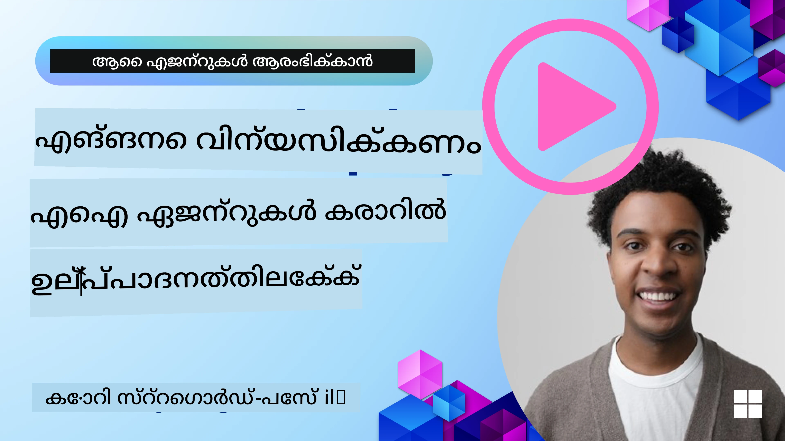

<!--
CO_OP_TRANSLATOR_METADATA:
{
  "original_hash": "cdfd0acc8592c1af14f8637833450375",
  "translation_date": "2025-12-03T16:45:36+00:00",
  "source_file": "10-ai-agents-production/README.md",
  "language_code": "ml"
}
-->
# ഉൽപാദനത്തിൽ AI ഏജന്റുകൾ: നിരീക്ഷണശേഷി & മൂല്യനിർണയം

AI ഏജന്റുകൾ പരീക്ഷണാത്മക പ്രോട്ടോടൈപ്പുകളിൽ നിന്ന് യഥാർത്ഥ ലോക ആപ്ലിക്കേഷനുകളിലേക്ക് മാറുമ്പോൾ, അവയുടെ പെരുമാറ്റം മനസ്സിലാക്കാനുള്ള കഴിവ്, പ്രകടനം നിരീക്ഷിക്കുക, സിസ്റ്റമാറ്റിക് ആയി ഔട്ട്പുട്ടുകൾ വിലയിരുത്തുക എന്നിവ പ്രധാനമാകുന്നു.

## പഠന ലക്ഷ്യങ്ങൾ

ഈ പാഠം പൂർത്തിയാക്കിയ ശേഷം, നിങ്ങൾക്ക് താഴെ പറയുന്നവ മനസ്സിലാക്കാം/അറിയാം:
- ഏജന്റിന്റെ നിരീക്ഷണശേഷി, മൂല്യനിർണയത്തിന്റെ അടിസ്ഥാന ആശയങ്ങൾ
- ഏജന്റുകളുടെ പ്രകടനം, ചെലവ്, ഫലപ്രാപ്തി മെച്ചപ്പെടുത്താനുള്ള സാങ്കേതിക വിദ്യകൾ
- നിങ്ങളുടെ AI ഏജന്റുകൾ സിസ്റ്റമാറ്റിക് ആയി എന്ത് വിലയിരുത്തണം, എങ്ങനെ വിലയിരുത്തണം
- AI ഏജന്റുകൾ ഉൽപാദനത്തിലേക്ക് വിന്യസിക്കുമ്പോൾ ചെലവുകൾ നിയന്ത്രിക്കുന്നതെങ്ങനെ
- AutoGen ഉപയോഗിച്ച് നിർമ്മിച്ച ഏജന്റുകൾ എങ്ങനെ ഇൻസ്ട്രുമെന്റ് ചെയ്യാം

നിങ്ങളുടെ "ബ്ലാക്ക് ബോക്സ്" ഏജന്റുകൾ സുതാര്യമായ, നിയന്ത്രിക്കാവുന്ന, വിശ്വസനീയമായ സിസ്റ്റങ്ങളായി മാറ്റാൻ ആവശ്യമായ അറിവ് നൽകുക എന്നതാണ് ലക്ഷ്യം.

_**ശ്രദ്ധിക്കുക:** സുരക്ഷിതവും വിശ്വസനീയവുമായ AI ഏജന്റുകൾ വിന്യസിക്കുന്നത് പ്രധാനമാണ്. [വിശ്വസനീയമായ AI ഏജന്റുകൾ നിർമ്മിക്കൽ](./06-building-trustworthy-agents/README.md) പാഠം പരിശോധിക്കുക._

## ട്രേസുകളും സ്പാനുകളും

[Langfuse](https://langfuse.com/) അല്ലെങ്കിൽ [Azure AI Foundry](https://learn.microsoft.com/en-us/azure/ai-foundry/what-is-azure-ai-foundry) പോലുള്ള നിരീക്ഷണ ഉപകരണങ്ങൾ സാധാരണയായി ഏജന്റ് റൺസ് ട്രേസുകളും സ്പാനുകളും ആയി പ്രതിനിധീകരിക്കുന്നു.

- **ട്രേസ്** ഒരു പൂർണ്ണ ഏജന്റ് ടാസ്ക് ആരംഭത്തിൽ നിന്ന് അവസാനത്തേയ്ക്ക് പ്രതിനിധീകരിക്കുന്നു (ഉദാ: ഉപയോക്തൃ ചോദ്യം കൈകാര്യം ചെയ്യൽ).
- **സ്പാനുകൾ** ട്രേസിനുള്ളിലെ വ്യക്തിഗത ഘട്ടങ്ങളാണ് (ഉദാ: ഭാഷാ മോഡൽ വിളിക്കൽ അല്ലെങ്കിൽ ഡാറ്റ തിരികെ കൊണ്ടുവരൽ).

നിരീക്ഷണശേഷിയില്ലാതെ, AI ഏജന്റ് ഒരു "ബ്ലാക്ക് ബോക്സ്" പോലെ തോന്നാം - അതിന്റെ ആന്തരിക അവസ്ഥയും ചിന്താവിവേചനവും അജ്ഞാതമാണ്, പ്രശ്നങ്ങൾ നിർണയിക്കാനും പ്രകടനം മെച്ചപ്പെടുത്താനും ഇത് പ്രയാസകരമാക്കുന്നു. നിരീക്ഷണശേഷിയോടെ, ഏജന്റുകൾ "ഗ്ലാസ് ബോക്സ്" ആയി മാറുന്നു, വിശ്വാസം നിർമ്മിക്കാൻ അത്യന്താപേക്ഷിതമായ സുതാര്യത നൽകുന്നു, അവ ഉദ്ദേശിച്ച പ്രകാരം പ്രവർത്തിക്കുന്നുണ്ടെന്ന് ഉറപ്പാക്കുന്നു.

## ഉൽപാദന പരിസ്ഥിതികളിൽ നിരീക്ഷണശേഷി എന്തുകൊണ്ട് പ്രധാനമാണ്

AI ഏജന്റുകൾ ഉൽപാദന പരിസ്ഥിതികളിലേക്ക് മാറ്റുന്നത് പുതിയ വെല്ലുവിളികളും ആവശ്യകതകളും അവതരിപ്പിക്കുന്നു. നിരീക്ഷണശേഷി ഇനി "നല്ലത്" മാത്രമല്ല, മറിച്ച് ഒരു നിർണായക കഴിവാണ്:

*   **ഡീബഗിംഗ് & മൂലകാരണ വിശകലനം**: ഒരു ഏജന്റ് പരാജയപ്പെടുമ്പോൾ അല്ലെങ്കിൽ പ്രതീക്ഷിക്കാത്ത ഔട്ട്പുട്ട് ഉത്പാദിപ്പിക്കുമ്പോൾ, നിരീക്ഷണ ഉപകരണങ്ങൾ പിഴവിന്റെ ഉറവിടം കണ്ടെത്താൻ ആവശ്യമായ ട്രേസുകൾ നൽകുന്നു. ഇത് പല LLM കോൾ, ടൂൾ ഇടപെടലുകൾ, കണ്ടീഷണൽ ലജിക് എന്നിവ ഉൾക്കൊള്ളുന്ന സങ്കീർണ്ണ ഏജന്റുകളിൽ പ്രത്യേകിച്ച് പ്രധാനമാണ്.
*   **ലാറ്റൻസി & ചെലവ് മാനേജ്മെന്റ്**: AI ഏജന്റുകൾ സാധാരണയായി ടോക്കൺ അല്ലെങ്കിൽ കോൾ അടിസ്ഥാനത്തിൽ ബില്ല് ചെയ്യുന്ന LLMs, മറ്റ് ബാഹ്യ APIs എന്നിവയിൽ ആശ്രയിക്കുന്നു. ഈ കോൾസുകൾ കൃത്യമായി ട്രാക്ക് ചെയ്യാൻ നിരീക്ഷണശേഷി അനുവദിക്കുന്നു, അതിവേഗം മന്ദഗതിയുള്ള അല്ലെങ്കിൽ ചെലവേറിയ പ്രവർത്തനങ്ങൾ തിരിച്ചറിയാൻ സഹായിക്കുന്നു. ഇത് പ്രോംപ്റ്റുകൾ ഓപ്റ്റിമൈസ് ചെയ്യാനും, കൂടുതൽ കാര്യക്ഷമമായ മോഡലുകൾ തിരഞ്ഞെടുക്കാനും, പ്രവർത്തന ചെലവുകൾ നിയന്ത്രിക്കാൻ പ്രവർത്തനപ്രവാഹങ്ങൾ പുനർരൂപകൽപ്പന ചെയ്യാനും, നല്ല ഉപയോക്തൃ അനുഭവം ഉറപ്പാക്കാനും ടീമുകളെ പ്രാപ്തമാക്കുന്നു.
*   **വിശ്വാസം, സുരക്ഷ, & അനുസരണം**: പല ആപ്ലിക്കേഷനുകളിലും, ഏജന്റുകൾ സുരക്ഷിതവും നൈതികവുമായ രീതിയിൽ പ്രവർത്തിക്കുന്നുണ്ടെന്ന് ഉറപ്പാക്കുന്നത് പ്രധാനമാണ്. ഏജന്റിന്റെ പ്രവർത്തനങ്ങൾക്കും തീരുമാനങ്ങൾക്കും ഒരു ഓഡിറ്റ് ട്രെയിൽ നൽകുന്നു. ഇത് പ്രോംപ്റ്റ് ഇഞ്ചക്ഷൻ, ഹാനികരമായ ഉള്ളടക്കം ഉത്പാദനം, അല്ലെങ്കിൽ വ്യക്തിപരമായ തിരിച്ചറിയാവുന്ന വിവരങ്ങൾ (PII) തെറ്റായി കൈകാര്യം ചെയ്യൽ പോലുള്ള പ്രശ്നങ്ങൾ കണ്ടെത്താനും പരിഹരിക്കാനും ഉപയോഗിക്കാം. ഉദാ: ഒരു ഏജന്റ് ഒരു പ്രത്യേക പ്രതികരണം നൽകാൻ എന്തുകൊണ്ട് തീരുമാനിച്ചു, അല്ലെങ്കിൽ ഒരു പ്രത്യേക ടൂൾ ഉപയോഗിച്ചു എന്ന് മനസ്സിലാക്കാൻ ട്രേസുകൾ അവലോകനം ചെയ്യാം.
*   **തുടർച്ചയായ മെച്ചപ്പെടുത്തൽ ചക്രങ്ങൾ**: നിരീക്ഷണ ഡാറ്റ ഒരു ആവർത്തന വികസന പ്രക്രിയയുടെ അടിസ്ഥാനമാണ്. ഏജന്റുകൾ യഥാർത്ഥ ലോകത്തിൽ എങ്ങനെ പ്രവർത്തിക്കുന്നു എന്ന് നിരീക്ഷിച്ച്, മെച്ചപ്പെടുത്തലിനുള്ള മേഖലകൾ തിരിച്ചറിയാനും, മോഡലുകൾ ഫൈൻ-ട്യൂൺ ചെയ്യുന്നതിനുള്ള ഡാറ്റ ശേഖരിക്കാനും, മാറ്റങ്ങളുടെ സ്വാധീനം സ്ഥിരീകരിക്കാനും ടീമുകൾക്ക് കഴിയും. ഇത് ഓൺലൈൻ മൂല്യനിർണയത്തിൽ നിന്ന് ഉൽപാദന洞洞洞洞洞洞洞洞洞洞洞洞洞洞洞洞洞洞洞洞洞洞洞洞洞洞洞洞洞洞洞洞洞洞洞洞洞洞洞洞洞洞洞洞洞洞洞洞洞洞洞洞洞洞洞洞洞洞洞洞洞洞洞洞洞洞洞洞洞洞洞洞洞洞洞洞洞洞洞洞洞洞洞洞洞洞洞洞洞洞洞洞洞洞洞洞洞洞洞洞洞洞洞洞洞洞洞洞洞洞洞洞洞洞洞洞洞洞洞洞洞洞洞洞洞洞洞洞洞洞洞洞洞洞洞洞洞洞洞洞洞洞洞洞洞洞洞洞洞洞洞洞洞洞洞洞洞洞洞洞洞洞洞洞洞洞洞洞洞洞洞洞洞洞洞洞洞洞洞洞洞洞洞洞洞洞洞洞洞洞洞洞洞洞洞洞洞洞洞洞洞洞洞洞洞洞洞洞洞洞洞洞洞洞洞洞洞洞洞洞洞洞洞洞洞洞洞洞洞洞洞洞洞洞洞洞洞洞洞洞洞洞洞洞洞洞洞洞洞洞洞洞洞洞洞洞洞洞洞洞洞洞洞洞洞洞洞洞洞洞洞洞洞洞洞洞洞洞洞洞洞洞洞洞洞洞洞洞洞洞洞洞洞洞洞洞洞洞洞洞洞洞洞洞洞洞洞洞洞洞洞洞洞洞洞洞洞洞洞洞洞洞洞洞洞洞洞洞洞洞洞洞洞洞洞洞洞洞洞洞洞洞洞洞洞洞洞洞洞洞洞洞洞洞洞洞洞洞洞洞洞洞洞洞洞洞洞洞洞洞洞洞洞洞洞洞洞洞洞洞洞洞洞洞洞洞洞洞洞洞洞洞洞洞洞洞洞洞洞洞洞洞洞洞洞洞洞洞洞洞洞洞洞洞洞洞洞洞洞洞洞洞洞洞洞洞洞洞洞洞洞洞洞洞洞洞洞洞洞洞洞洞洞洞洞洞洞洞洞洞洞洞洞洞洞洞洞洞洞洞洞洞洞洞洞洞洞洞洞洞洞洞洞洞洞洞洞洞洞洞洞洞洞洞洞洞洞洞洞洞洞洞洞洞洞洞洞洞洞洞洞洞洞洞洞洞洞洞洞洞洞洞洞洞洞洞洞洞洞洞洞洞洞洞洞洞洞洞洞洞洞洞洞洞洞洞洞洞洞洞洞洞洞洞洞洞洞洞洞洞洞洞洞洞洞洞洞洞洞洞洞洞洞洞洞洞洞洞洞洞洞洞洞洞洞洞洞洞洞洞洞洞洞洞洞洞洞洞洞洞洞洞洞洞洞洞洞洞洞洞洞洞洞洞洞洞洞洞洞洞洞洞洞洞洞洞洞洞洞洞洞洞洞洞洞洞洞洞洞洞洞洞洞洞洞洞洞洞洞洞洞洞洞洞洞洞洞洞洞洞洞洞洞洞洞洞洞洞洞洞洞洞洞洞洞洞洞洞洞洞洞洞洞洞洞洞洞洞洞洞洞洞洞洞洞洞洞洞洞洞洞洞洞洞洞洞洞洞洞洞洞洞洞洞洞洞洞洞洞洞洞洞洞洞洞洞洞洞洞洞洞洞洞洞洞洞洞洞洞洞洞洞洞洞洞洞洞洞洞洞洞洞洞洞洞洞洞洞洞洞洞洞洞洞洞洞洞洞洞洞洞洞洞洞洞洞洞洞洞洞洞洞洞洞洞洞洞洞洞洞洞洞洞洞洞洞洞洞洞洞洞洞洞洞洞洞洞洞洞洞洞洞洞洞洞洞洞洞洞洞洞洞洞洞洞洞洞洞洞洞洞洞洞洞洞洞洞洞洞洞洞洞洞洞洞洞洞洞洞洞洞洞洞洞洞洞洞洞洞洞洞洞洞洞洞洞洞洞洞洞洞洞洞洞洞洞洞洞洞洞洞洞洞洞洞洞洞洞洞洞洞洞洞洞洞洞洞洞洞洞洞洞洞洞洞洞洞洞洞洞洞洞洞洞洞洞洞洞洞洞洞洞洞洞洞洞洞洞洞洞洞洞洞洞洞洞洞洞洞洞洞洞洞洞洞洞洞洞洞洞洞洞洞洞洞洞洞洞洞洞洞洞洞洞洞洞洞洞洞洞洞洞洞洞洞洞洞洞洞洞洞洞洞洞洞洞洞洞洞洞洞洞洞洞洞洞洞洞洞洞洞洞洞洞洞洞洞洞洞洞洞洞洞洞洞洞洞洞洞洞洞洞洞洞洞洞洞洞洞洞洞洞洞洞洞洞洞洞洞洞洞洞洞洞洞洞洞洞洞洞洞洞洞洞洞洞洞洞洞洞洞洞洞洞洞洞洞洞洞洞洞洞洞洞洞洞洞洞洞洞洞洞洞洞洞洞洞洞洞洞洞洞洞洞洞洞洞洞洞洞洞洞洞洞洞洞洞洞洞洞洞洞洞洞洞洞洞洞洞洞洞洞洞洞洞洞洞洞洞洞洞洞洞洞洞洞洞洞洞洞洞洞洞洞洞洞洞洞洞洞洞洞洞洞洞洞洞洞洞洞洞洞洞洞洞洞洞洞洞洞洞洞洞洞洞洞洞洞洞洞洞洞洞洞洞洞洞洞洞洞洞洞洞洞洞洞洞洞洞洞洞洞洞洞洞洞洞洞洞洞洞洞洞洞洞洞洞洞洞洞洞洞洞洞洞洞洞洞洞洞洞洞洞洞洞洞洞洞洞洞洞洞洞洞洞洞洞洞洞洞洞洞洞洞洞洞洞洞洞洞洞洞洞洞洞洞洞洞洞洞洞洞洞洞洞洞洞洞洞洞洞洞洞洞洞洞洞洞洞洞洞洞洞洞洞洞洞洞洞洞洞洞洞洞洞洞洞洞洞洞洞洞洞洞洞洞洞洞洞洞洞洞洞洞洞洞洞洞洞洞洞洞洞洞洞洞洞洞洞洞洞洞洞洞洞洞洞洞洞洞洞洞洞洞洞洞洞洞洞洞洞洞洞洞洞洞洞洞洞洞洞洞洞洞洞洞洞洞洞洞洞洞洞洞洞洞洞洞洞洞洞洞洞洞洞洞洞洞洞洞洞洞洞洞洞洞洞洞洞洞洞洞洞洞洞洞洞洞洞洞洞洞洞洞洞洞洞洞洞洞洞洞洞洞洞洞洞洞洞洞洞洞洞洞洞洞洞洞洞洞洞洞洞洞洞洞洞洞洞洞洞洞洞洞洞洞洞洞洞洞洞洞洞洞洞洞洞洞洞洞洞洞洞洞洞洞洞洞洞洞洞洞洞洞洞洞洞洞洞洞洞洞洞洞洞洞洞洞洞洞洞洞洞洞洞洞洞洞洞洞洞洞洞洞洞洞洞洞洞洞洞洞洞洞洞洞洞洞洞洞洞洞洞洞洞洞洞洞洞洞洞洞洞洞洞洞洞洞洞洞洞洞洞洞洞洞洞洞洞洞洞洞洞洞洞洞洞洞洞洞洞洞洞洞洞洞洞洞洞洞洞洞洞洞洞洞洞洞洞洞洞洞洞洞洞洞洞洞洞洞洞洞洞洞洞洞洞洞洞洞洞洞洞洞洞洞洞洞洞洞洞洞洞洞洞洞洞洞洞洞洞洞洞洞洞洞洞洞洞洞洞洞洞洞洞洞洞洞洞洞洞洞洞洞洞洞洞洞洞洞洞洞洞洞洞洞洞洞洞洞洞洞洞洞洞洞洞洞洞洞洞洞洞洞洞洞洞洞洞洞洞洞洞洞洞洞洞洞洞洞洞洞洞洞洞洞洞洞洞洞洞洞洞洞洞洞洞洞洞洞洞洞洞洞洞洞洞洞洞洞洞洞洞洞洞洞洞洞洞洞洞洞洞洞洞洞洞洞洞洞洞洞洞洞洞洞洞洞洞洞洞洞洞洞洞洞洞洞洞洞洞洞洞洞洞洞洞洞洞洞洞洞洞洞洞洞洞洞洞洞洞洞洞洞洞洞洞洞洞洞洞洞洞洞洞洞洞洞洞洞洞洞洞洞洞洞洞洞洞洞洞洞洞洞洞洞洞洞洞洞洞洞洞洞洞洞洞洞洞洞洞洞洞洞洞洞洞洞洞洞洞洞洞洞洞洞洞洞洞洞洞洞洞洞洞洞洞洞洞洞洞洞洞洞洞洞洞洞洞洞洞洞洞洞洞洞洞洞洞洞洞洞洞洞洞洞洞洞洞洞洞洞洞洞洞洞洞洞洞洞洞洞洞洞洞洞洞洞洞洞洞洞洞洞洞洞洞洞洞洞洞洞洞洞洞洞洞洞洞洞洞洞洞洞洞洞洞洞洞洞洞洞洞洞洞洞洞洞洞洞洞洞洞洞洞洞洞洞洞洞洞洞洞洞洞洞洞洞洞洞洞洞洞洞洞洞洞洞洞洞洞洞洞洞洞洞洞洞洞洞洞洞洞洞洞洞洞洞洞洞洞洞洞洞洞洞洞洞洞洞洞洞洞洞洞洞洞洞洞洞洞洞洞洞洞洞洞洞洞洞洞洞洞洞洞洞洞洞洞洞洞洞洞洞洞洞洞洞洞洞洞洞洞洞洞洞洞洞洞洞洞洞洞洞洞洞洞洞洞洞洞洞洞洞洞洞洞洞洞洞洞洞洞洞洞洞洞洞洞洞洞洞洞洞洞洞洞洞洞洞洞洞洞洞洞洞洞洞洞洞洞洞洞洞洞洞洞洞洞洞洞洞洞洞洞洞洞洞洞洞洞洞洞洞洞洞洞洞洞洞洞洞洞洞洞洞洞洞洞洞洞洞洞洞洞洞洞洞洞洞洞洞洞洞洞洞洞洞洞洞洞洞洞洞洞洞洞洞洞洞洞洞洞洞洞洞洞洞洞洞洞洞洞洞洞洞洞洞洞洞洞洞洞洞洞洞洞洞洞洞洞洞洞洞洞洞洞洞洞洞洞洞洞洞洞洞洞洞洞洞洞洞洞洞洞洞洞洞洞洞洞洞洞洞洞洞洞洞洞洞洞洞洞洞洞洞洞洞洞洞洞洞洞洞洞洞洞洞洞洞洞洞洞洞洞洞洞洞洞洞洞洞洞洞洞洞洞洞洞洞洞洞洞洞洞洞洞洞洞洞洞洞洞洞洞洞洞洞洞洞洞洞洞洞洞洞洞洞洞洞洞洞洞洞洞洞洞洞洞洞洞洞洞洞洞洞洞洞洞洞洞洞洞洞洞洞洞洞洞洞洞洞洞洞洞洞洞洞洞洞洞洞洞洞洞洞洞洞洞洞洞洞洞洞洞洞洞洞洞洞洞洞洞洞洞洞洞洞洞洞洞洞洞洞洞洞洞洞洞洞洞洞洞洞洞洞洞洞洞洞洞洞洞洞洞洞洞洞洞洞洞洞洞洞洞洞洞洞洞洞洞洞洞洞洞洞洞洞洞洞洞洞洞洞洞洞洞洞洞洞洞洞洞洞洞洞洞洞洞洞洞洞洞洞洞洞洞洞洞洞洞洞洞洞洞洞洞洞洞洞洞洞洞洞洞洞洞洞洞洞洞洞洞洞洞洞洞洞洞洞洞洞洞洞洞洞洞洞洞洞洞洞洞洞洞洞洞洞洞洞洞洞洞洞洞洞洞洞洞洞洞洞洞洞洞洞洞洞洞洞洞洞洞洞洞洞洞洞洞洞洞洞洞洞洞洞洞洞洞洞洞洞洞洞洞洞洞洞洞洞洞洞洞洞洞洞洞洞洞洞洞洞洞洞洞洞洞洞洞洞洞洞洞洞洞洞洞洞洞洞洞洞洞洞洞洞洞洞洞洞洞洞洞洞洞洞洞洞洞洞洞洞洞洞洞洞洞洞洞洞洞洞洞洞洞洞
AI ഏജന്റുമാരെ പ്രൊഡക്ഷനിലേക്ക് വിന്യസിക്കുന്നതിന്റെ ചെലവ് നിയന്ത്രിക്കാൻ ചില തന്ത്രങ്ങൾ:

**ചെറുതായ മോഡലുകൾ ഉപയോഗിക്കുക:** ചെറിയ ഭാഷാ മോഡലുകൾ (SLMs) ചില ഏജന്റിക് ഉപയോഗകേസുകളിൽ നല്ല പ്രകടനം കാഴ്ചവയ്ക്കുകയും ചെലവുകൾ ഗണ്യമായി കുറയ്ക്കുകയും ചെയ്യും. മുൻപ് പറഞ്ഞതുപോലെ, പ്രകടനവും വലിയ മോഡലുകളുമായുള്ള താരതമനവും വിലയിരുത്താൻ ഒരു വിലയിരുത്തൽ സംവിധാനം നിർമ്മിക്കുന്നത് നിങ്ങളുടെ ഉപയോഗകേസിൽ SLM എത്രത്തോളം ഫലപ്രദമാകുമെന്ന് മനസിലാക്കാനുള്ള ഏറ്റവും നല്ല മാർഗമാണ്. ഉദ്ദേശം തിരിച്ചറിയൽ അല്ലെങ്കിൽ പാരാമീറ്റർ എക്സ്ട്രാക്ഷൻ പോലുള്ള ലളിതമായ പ്രവർത്തനങ്ങൾക്ക് SLM ഉപയോഗിക്കുന്നതും, സങ്കീർണ്ണമായ ചിന്തനത്തിന് വലിയ മോഡലുകൾ സംവരണം ചെയ്യുന്നതും പരിഗണിക്കുക.

**റൗട്ടർ മോഡൽ ഉപയോഗിക്കുക:** ഇതിന് സമാനമായ ഒരു തന്ത്രം മോഡലുകളുടെ വൈവിധ്യവും വലിപ്പവും ഉപയോഗിക്കുന്നതാണ്. LLM/SLM അല്ലെങ്കിൽ സെർവർലെസ് ഫംഗ്ഷൻ ഉപയോഗിച്ച് അഭ്യർത്ഥനകളെ സങ്കീർണ്ണതയുടെ അടിസ്ഥാനത്തിൽ ഏറ്റവും അനുയോജ്യമായ മോഡലുകളിലേക്ക് റൂട്ടുചെയ്യാം. ഇത് ചെലവുകൾ കുറയ്ക്കുന്നതിനൊപ്പം ശരിയായ പ്രവർത്തനങ്ങളിൽ പ്രകടനവും ഉറപ്പാക്കും. ഉദാഹരണത്തിന്, ലളിതമായ ചോദ്യങ്ങൾ ചെറിയ, വേഗത്തിലുള്ള മോഡലുകളിലേക്ക് റൂട്ടുചെയ്യുക, സങ്കീർണ്ണമായ ചിന്തനപ്രവർത്തനങ്ങൾക്ക് മാത്രം ചെലവേറിയ വലിയ മോഡലുകൾ ഉപയോഗിക്കുക.

**പ്രതിസന്ധികൾ കാഷ് ചെയ്യുക:** സാധാരണ അഭ്യർത്ഥനകളും പ്രവർത്തനങ്ങളും തിരിച്ചറിയുകയും അവ നിങ്ങളുടെ ഏജന്റിക് സിസ്റ്റത്തിലൂടെ പോകുന്നതിന് മുമ്പ് പ്രതികരണങ്ങൾ നൽകുകയും ചെയ്യുന്നത് സമാനമായ അഭ്യർത്ഥനകളുടെ വോള്യം കുറയ്ക്കാനുള്ള നല്ല മാർഗമാണ്. നിങ്ങളുടെ കാഷ് ചെയ്ത അഭ്യർത്ഥനകളുമായി ഒരു അഭ്യർത്ഥന എത്രത്തോളം സമാനമാണെന്ന് തിരിച്ചറിയാൻ ലളിതമായ AI മോഡലുകൾ ഉപയോഗിച്ച് ഒരു പ്രവാഹം നടപ്പിലാക്കാം. ഈ തന്ത്രം പലതവണ ചോദിക്കപ്പെടുന്ന ചോദ്യങ്ങൾക്കോ സാധാരണ പ്രവാഹങ്ങൾക്കോ ചെലവുകൾ ഗണ്യമായി കുറയ്ക്കാൻ സഹായിക്കും.

## ഇത് പ്രായോഗികമായി എങ്ങനെ പ്രവർത്തിക്കുന്നു എന്ന് നോക്കാം

ഈ വിഭാഗത്തിന്റെ [ഉദാഹരണ നോട്ട്‌ബുക്കിൽ](./code_samples/10_autogen_evaluation.ipynb), ഏജന്റിനെ നിരീക്ഷിക്കുകയും വിലയിരുത്തുകയും ചെയ്യാൻ ഉപയോഗിക്കുന്ന ഓബ്സർവബിലിറ്റി ടൂളുകൾ എങ്ങനെ ഉപയോഗിക്കാമെന്ന് കാണാം.

### പ്രൊഡക്ഷനിൽ AI ഏജന്റുമാരെക്കുറിച്ച് കൂടുതൽ ചോദ്യങ്ങളുണ്ടോ?

മറ്റുള്ള പഠിതാക്കളുമായി കൂടിക്കാഴ്ച നടത്താനും, ഓഫീസ് മണിക്കൂറുകളിൽ പങ്കെടുക്കാനും, നിങ്ങളുടെ AI ഏജന്റുമാരുടെ ചോദ്യങ്ങൾക്ക് ഉത്തരം ലഭിക്കാനും [Azure AI Foundry Discord](https://aka.ms/ai-agents/discord) ചേരുക.

## മുൻപത്തെ പാഠം

[Metacognition Design Pattern](../09-metacognition/README.md)

## അടുത്ത പാഠം

[Agentic Protocols](../11-agentic-protocols/README.md)

---

<!-- CO-OP TRANSLATOR DISCLAIMER START -->
**അസത്യവാദം**:  
ഈ രേഖ AI വിവർത്തന സേവനമായ [Co-op Translator](https://github.com/Azure/co-op-translator) ഉപയോഗിച്ച് വിവർത്തനം ചെയ്തതാണ്. കൃത്യതയ്ക്കായി ഞങ്ങൾ ശ്രമിക്കുന്നുവെങ്കിലും, ഓട്ടോമേറ്റഡ് വിവർത്തനങ്ങളിൽ പിശകുകൾ അല്ലെങ്കിൽ തെറ്റായ വിവരങ്ങൾ ഉണ്ടാകാൻ സാധ്യതയുണ്ട്. അതിന്റെ സ്വാഭാവിക ഭാഷയിലുള്ള മൗലിക രേഖയാണ് വിശ്വസനീയമായ ഉറവിടമായി കണക്കാക്കേണ്ടത്. നിർണായകമായ വിവരങ്ങൾക്ക്, പ്രൊഫഷണൽ മനുഷ്യ വിവർത്തനം ശുപാർശ ചെയ്യുന്നു. ഈ വിവർത്തനം ഉപയോഗിച്ച് ഉണ്ടാകുന്ന തെറ്റിദ്ധാരണകൾക്കോ തെറ്റായ വ്യാഖ്യാനങ്ങൾക്കോ ഞങ്ങൾ ഉത്തരവാദികളല്ല.
<!-- CO-OP TRANSLATOR DISCLAIMER END -->