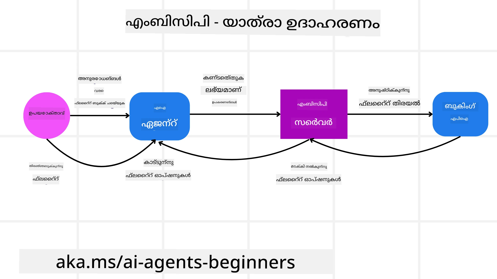
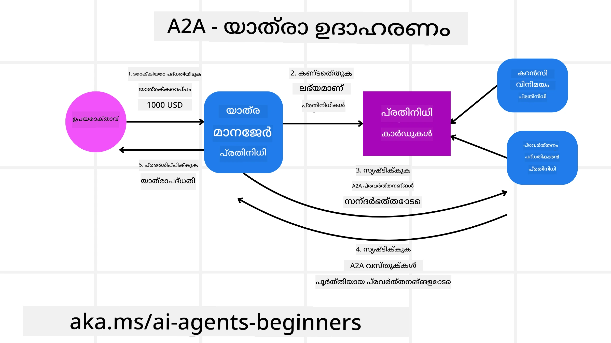
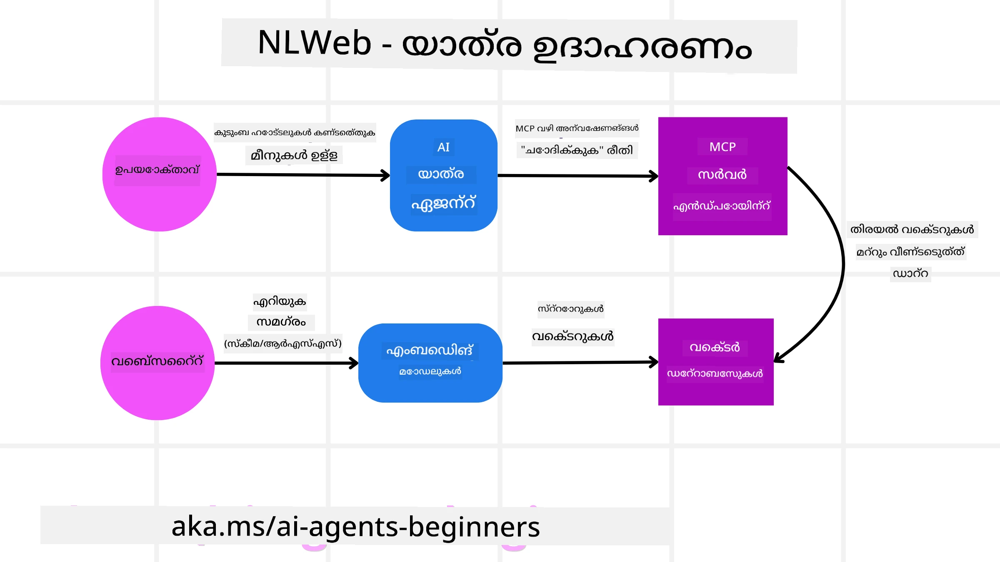

<!--
CO_OP_TRANSLATOR_METADATA:
{
  "original_hash": "aff92c6f019b4627ca9399c6e3882e17",
  "translation_date": "2025-12-03T17:31:42+00:00",
  "source_file": "11-agentic-protocols/README.md",
  "language_code": "ml"
}
-->
# ഏജന്റിക് പ്രോട്ടോകോളുകൾ (MCP, A2A, NLWeb) ഉപയോഗിക്കുന്നത്

> _(മുകളിൽ കാണുന്ന ചിത്രം ക്ലിക്ക് ചെയ്ത് ഈ പാഠത്തിന്റെ വീഡിയോ കാണുക)_

AI ഏജന്റുകളുടെ ഉപയോഗം വർദ്ധിക്കുന്നതോടെ, സ്റ്റാൻഡേർഡൈസേഷൻ, സുരക്ഷ, തുറന്ന നവീകരണത്തിന് പിന്തുണ എന്നിവ ഉറപ്പാക്കുന്ന പ്രോട്ടോകോളുകളുടെ ആവശ്യം കൂടി വർദ്ധിക്കുന്നു. ഈ പാഠത്തിൽ, ഈ ആവശ്യങ്ങൾ നിറവേറ്റാൻ ശ്രമിക്കുന്ന മൂന്ന് പ്രോട്ടോകോളുകൾ - മോഡൽ കോൺടെക്സ്റ്റ് പ്രോട്ടോകോൾ (MCP), ഏജന്റ് ടു ഏജന്റ് (A2A), നാചുറൽ ലാംഗ്വേജ് വെബ് (NLWeb) എന്നിവയെക്കുറിച്ച് പഠിക്കാം.

## പരിചയം

ഈ പാഠത്തിൽ, നമുക്ക് പഠിക്കാം:

• **MCP** എങ്ങനെ AI ഏജന്റുകൾക്ക് ഉപയോക്തൃ പ്രവർത്തനങ്ങൾ പൂർത്തിയാക്കാൻ ബാഹ്യ ഉപകരണങ്ങളും ഡാറ്റയും ആക്സസ് ചെയ്യാൻ അനുവദിക്കുന്നു.

• **A2A** എങ്ങനെ വ്യത്യസ്ത AI ഏജന്റുകൾ തമ്മിൽ ആശയവിനിമയവും സഹകരണവും സാധ്യമാക്കുന്നു.

• **NLWeb** എങ്ങനെ ഏതൊരു വെബ്സൈറ്റിനും നാചുറൽ ലാംഗ്വേജ് ഇന്റർഫേസുകൾ നൽകുന്നു, AI ഏജന്റുകൾക്ക് ഉള്ളടക്കത്തെ കണ്ടെത്താനും ഇടപെടാനും സഹായിക്കുന്നു.

## പഠന ലക്ഷ്യങ്ങൾ

• AI ഏജന്റുകളുടെ പശ്ചാത്തലത്തിൽ MCP, A2A, NLWeb എന്നിവയുടെ പ്രധാന ഉദ്ദേശ്യവും ഗുണങ്ങളും **തിരിച്ചറിയുക**.

• ഓരോ പ്രോട്ടോകോളും LLMs, ഉപകരണങ്ങൾ, മറ്റ് ഏജന്റുകൾ എന്നിവ തമ്മിലുള്ള ആശയവിനിമയവും ഇടപെടലും എങ്ങനെ എളുപ്പമാക്കുന്നു എന്ന് **വ്യക്തമാക്കുക**.

• സങ്കീർണ്ണമായ ഏജന്റിക് സിസ്റ്റങ്ങൾ നിർമ്മിക്കുന്നതിൽ ഓരോ പ്രോട്ടോകോളും വഹിക്കുന്ന വ്യത്യസ്ത പങ്കുകൾ **അറിയുക**.

## മോഡൽ കോൺടെക്സ്റ്റ് പ്രോട്ടോകോൾ

**മോഡൽ കോൺടെക്സ്റ്റ് പ്രോട്ടോകോൾ (MCP)** ഒരു ഓപ്പൺ സ്റ്റാൻഡേർഡാണ്, ഇത് LLMs-നു കോൺടെക്സ്റ്റും ഉപകരണങ്ങളും നൽകാൻ ആപ്ലിക്കേഷനുകൾക്ക് ഒരു സ്റ്റാൻഡേർഡൈസ്ഡ് മാർഗം നൽകുന്നു. ഇത് AI ഏജന്റുകൾക്ക് വിവിധ ഡാറ്റാ സ്രോതസ്സുകളുമായി സ്ഥിരതയുള്ള രീതിയിൽ ബന്ധപ്പെടാൻ ഒരു "യൂണിവേഴ്സൽ അഡാപ്റ്റർ" നൽകുന്നു.

MCPയുടെ ഘടകങ്ങൾ, നേരിട്ടുള്ള API ഉപയോഗവുമായി താരതമ്യം ചെയ്തുള്ള ഗുണങ്ങൾ, MCP സെർവർ എങ്ങനെ AI ഏജന്റുകൾ ഉപയോഗിക്കുമെന്ന് കാണിക്കുന്ന ഒരു ഉദാഹരണം എന്നിവ നോക്കാം.

### MCPയുടെ പ്രധാന ഘടകങ്ങൾ

MCP **ക്ലയന്റ്-സെർവർ ആർക്കിടെക്ചർ** അടിസ്ഥാനമാക്കിയുള്ളതാണ്, പ്രധാന ഘടകങ്ങൾ:

• **ഹോസ്റ്റുകൾ**: LLM ആപ്ലിക്കേഷനുകൾ (ഉദാഹരണത്തിന്, VSCode പോലുള്ള ഒരു കോഡ് എഡിറ്റർ) MCP സെർവറുമായി ബന്ധം ആരംഭിക്കുന്നു.

• **ക്ലയന്റുകൾ**: ഹോസ്റ്റ് ആപ്ലിക്കേഷനിൽ ഉള്ള ഘടകങ്ങൾ, സെർവറുകളുമായി ഏകദേശം ഒരു-ടു-ഒൺ ബന്ധം നിലനിർത്തുന്നു.

• **സെർവറുകൾ**: പ്രത്യേക ശേഷികൾ പ്രദർശിപ്പിക്കുന്ന ലഘു പ്രോഗ്രാമുകൾ.

MCP സെർവറിന്റെ ശേഷികളിൽ ഉൾപ്പെടുന്ന മൂന്ന് പ്രധാന പ്രിമിറ്റീവുകൾ:

• **ടൂളുകൾ**: AI ഏജന്റുകൾക്ക് ഒരു പ്രവർത്തനം നടത്താൻ വിളിക്കാവുന്ന വ്യക്തമായ പ്രവർത്തനങ്ങൾ അല്ലെങ്കിൽ ഫംഗ്ഷനുകൾ. ഉദാഹരണത്തിന്, ഒരു കാലാവസ്ഥാ സേവനം "കാലാവസ്ഥ നേടുക" എന്ന ടൂൾ പ്രദർശിപ്പിക്കാം, അല്ലെങ്കിൽ ഒരു ഇ-കൊമേഴ്സ് സെർവർ "ഉൽപ്പന്നം വാങ്ങുക" എന്ന ടൂൾ പ്രദർശിപ്പിക്കാം. MCP സെർവറുകൾ ഓരോ ടൂളിന്റെ പേര്, വിവരണം, ഇൻപുട്ട്/ഔട്ട്പുട്ട് സ്കീമ എന്നിവ അവരുടെ ശേഷി ലിസ്റ്റിംഗിൽ പരസ്യപ്പെടുത്തുന്നു.

• **റിസോഴ്സുകൾ**: MCP സെർവർ നൽകുന്ന, ക്ലയന്റുകൾ ആവശ്യാനുസരണം പുനർപ്രാപനം ചെയ്യാവുന്ന റീഡ്-ഓൺലി ഡാറ്റാ ഇനങ്ങൾ അല്ലെങ്കിൽ ഡോക്യുമെന്റുകൾ. ഉദാഹരണങ്ങൾ: ഫയൽ ഉള്ളടക്കം, ഡാറ്റാബേസ് റെക്കോർഡുകൾ, അല്ലെങ്കിൽ ലോഗ് ഫയലുകൾ. റിസോഴ്സുകൾ ടെക്സ്റ്റ് (കോഡ് അല്ലെങ്കിൽ JSON പോലുള്ള) അല്ലെങ്കിൽ ബൈനറി (ഇമേജുകൾ അല്ലെങ്കിൽ PDF പോലുള്ള) ആകാം.

• **പ്രോംപ്റ്റുകൾ**: നിർദ്ദിഷ്ട പ്രോംപ്റ്റുകൾ നൽകുന്ന പ്രീഡിഫൈൻഡ് ടെംപ്ലേറ്റുകൾ, കൂടുതൽ സങ്കീർണ്ണമായ വർക്ക്‌ഫ്ലോകൾക്ക് അനുവദിക്കുന്നു.

### MCPയുടെ ഗുണങ്ങൾ

MCP AI ഏജന്റുകൾക്ക് പ്രധാന ഗുണങ്ങൾ നൽകുന്നു:

• **ഡൈനാമിക് ടൂൾ ഡിസ്കവറി**: ഏജന്റുകൾക്ക് ഒരു സെർവറിൽ നിന്ന് ലഭ്യമായ ടൂളുകളുടെ ലിസ്റ്റ്, അവ എന്താണ് ചെയ്യുന്നത് എന്ന വിവരണങ്ങൾക്കൊപ്പം ഡൈനാമിക്കായി ലഭ്യമാക്കാം. പരമ്പരാഗത APIകളുമായി താരതമ്യം ചെയ്യുമ്പോൾ, ഇത് കൂടുതൽ അനുയോജ്യമായ "ഒരിക്കൽ സംയോജിപ്പിക്കുക" സമീപനം നൽകുന്നു.

• **LLMs-കളുടെ ഇടയിൽ ഇന്ററോപ്പറബിലിറ്റി**: MCP വ്യത്യസ്ത LLMs-കളിൽ പ്രവർത്തിക്കുന്നു, മികച്ച പ്രകടനത്തിനായി കോർ മോഡലുകൾ മാറ്റാൻ സൗകര്യം നൽകുന്നു.

• **സ്റ്റാൻഡേർഡൈസ്ഡ് സുരക്ഷ**: MCP ഒരു സ്റ്റാൻഡേർഡ് ഓതന്റിക്കേഷൻ രീതി ഉൾക്കൊള്ളുന്നു, ഇത് കൂടുതൽ MCP സെർവറുകൾക്ക് ആക്സസ് ചേർക്കുമ്പോൾ സ്കെയിലബിലിറ്റി മെച്ചപ്പെടുത്തുന്നു.

### MCP ഉദാഹരണം

ഒരു ഉപയോക്താവ് MCP ഉപയോഗിച്ച് പ്രവർത്തിക്കുന്ന ഒരു AI അസിസ്റ്റന്റ് ഉപയോഗിച്ച് ഒരു ഫ്ലൈറ്റ് ബുക്ക് ചെയ്യാൻ ആഗ്രഹിക്കുന്നു എന്ന് കരുതുക.

1. **കണക്ഷൻ**: AI അസിസ്റ്റന്റ് (MCP ക്ലയന്റ്) ഒരു എയർലൈൻ നൽകുന്ന MCP സെർവറുമായി ബന്ധപ്പെടുന്നു.

2. **ടൂൾ ഡിസ്കവറി**: ക്ലയന്റ് എയർലൈൻ MCP സെർവറിനോട് ചോദിക്കുന്നു, "നിങ്ങൾക്ക് ലഭ്യമായ ടൂളുകൾ എന്തൊക്കെയുണ്ട്?" സെർവർ "ഫ്ലൈറ്റുകൾ തിരയുക" "ഫ്ലൈറ്റുകൾ ബുക്ക് ചെയ്യുക" പോലുള്ള ടൂളുകൾ നൽകുന്നു.

3. **ടൂൾ ഇൻവൊക്കേഷൻ**: നിങ്ങൾ AI അസിസ്റ്റന്റിനോട് "പോർട്ട്ലാൻഡിൽ നിന്ന് ഹൊണൊലുലുവിലേക്ക് ഒരു ഫ്ലൈറ്റ് തിരയുക" എന്ന് ചോദിക്കുന്നു. AI അസിസ്റ്റന്റ്, അതിന്റെ LLM ഉപയോഗിച്ച്, "ഫ്ലൈറ്റുകൾ തിരയുക" എന്ന ടൂൾ വിളിക്കേണ്ടതുണ്ടെന്ന് തിരിച്ചറിയുന്നു, അനുയോജ്യമായ പാരാമീറ്ററുകൾ (ഓറിജിൻ, ഡെസ്റ്റിനേഷൻ) MCP സെർവറിലേക്ക് അയയ്ക്കുന്നു.

4. **എക്സിക്യൂഷനും പ്രതികരണവും**: MCP സെർവർ, ഒരു റാപ്പർ ആയി പ്രവർത്തിച്ച്, എയർലൈൻയുടെ ഇന്റേർണൽ ബുക്കിംഗ് API-യിലേക്ക് യഥാർത്ഥ കോൾ നടത്തുന്നു. തുടർന്ന്, ഫ്ലൈറ്റ് വിവരങ്ങൾ (ഉദാഹരണത്തിന്, JSON ഡാറ്റ) സ്വീകരിച്ച് AI അസിസ്റ്റന്റിലേക്ക് മടക്കുന്നു.

5. **കൂടുതൽ ഇടപെടൽ**: AI അസിസ്റ്റന്റ് ഫ്ലൈറ്റ് ഓപ്ഷനുകൾ അവതരിപ്പിക്കുന്നു. നിങ്ങൾ ഒരു ഫ്ലൈറ്റ് തിരഞ്ഞെടുക്കുമ്പോൾ, അസിസ്റ്റന്റ് അതേ MCP സെർവറിലെ "ഫ്ലൈറ്റ് ബുക്ക് ചെയ്യുക" ടൂൾ വിളിച്ച് ബുക്കിംഗ് പൂർത്തിയാക്കുന്നു.

## ഏജന്റ്-ടു-ഏജന്റ് പ്രോട്ടോകോൾ (A2A)

MCP LLMs-നെ ഉപകരണങ്ങളുമായി ബന്ധിപ്പിക്കുന്നതിൽ ശ്രദ്ധ കേന്ദ്രീകരിക്കുന്നപ്പോൾ, **ഏജന്റ്-ടു-ഏജന്റ് (A2A) പ്രോട്ടോകോൾ** വ്യത്യസ്ത AI ഏജന്റുകൾ തമ്മിൽ ആശയവിനിമയവും സഹകരണവും സാധ്യമാക്കുന്നു. A2A വ്യത്യസ്ത സംഘടനകൾ, പരിസ്ഥിതികൾ, ടെക് സ്റ്റാക്കുകൾ എന്നിവയിൽ ഏജന്റുകൾ ബന്ധിപ്പിച്ച് ഒരു പങ്കിട്ട പ്രവർത്തനം പൂർത്തിയാക്കുന്നു.

A2Aയുടെ ഘടകങ്ങളും ഗുണങ്ങളും, കൂടാതെ നമ്മുടെ ട്രാവൽ ആപ്ലിക്കേഷനിൽ ഇത് എങ്ങനെ പ്രയോഗിക്കാമെന്ന് ഒരു ഉദാഹരണവും പരിശോധിക്കാം.

### A2Aയുടെ പ്രധാന ഘടകങ്ങൾ

A2A ഏജന്റുകൾ തമ്മിൽ ആശയവിനിമയം സാധ്യമാക്കുന്നതിലും ഉപയോക്താവിന്റെ ഉപപ്രവർത്തനം പൂർത്തിയാക്കുന്നതിലും ശ്രദ്ധ കേന്ദ്രീകരിക്കുന്നു. പ്രോട്ടോകോളിന്റെ ഓരോ ഘടകവും ഇതിലേക്ക് സംഭാവന ചെയ്യുന്നു:

#### ഏജന്റ് കാർഡ്

MCP സെർവർ ടൂളുകളുടെ ലിസ്റ്റ് പങ്കിടുന്നതുപോലെ, ഒരു ഏജന്റ് കാർഡിനും ഉണ്ട്:
- ഏജന്റിന്റെ പേര്.
- **പൊതുവായ പ്രവർത്തനങ്ങളുടെ വിവരണം**.
- **നിർദ്ദിഷ്ട കഴിവുകളുടെ ലിസ്റ്റ്** വിവരണങ്ങളോടെ, മറ്റ് ഏജന്റുകൾ (അല്ലെങ്കിൽ മനുഷ്യ ഉപയോക്താക്കൾ പോലും) ആ ഏജന്റിനെ വിളിക്കേണ്ടത് എപ്പോൾ, എന്തിനാണ് എന്ന് മനസ്സിലാക്കാൻ സഹായിക്കുന്നു.
- ഏജന്റിന്റെ **നിലവിലെ എൻഡ്പോയിന്റ് URL**.
- **വർഷൻ**യും **ശേഷികളും** (ഉദാഹരണത്തിന്, സ്ട്രീമിംഗ് പ്രതികരണങ്ങൾ, പുഷ് നോട്ടിഫിക്കേഷനുകൾ).

#### ഏജന്റ് എക്സിക്യൂട്ടർ

ഏജന്റ് എക്സിക്യൂട്ടർ **ഉപയോക്തൃ ചാറ്റിന്റെ കോൺടെക്സ്റ്റ് ദൂരസ്ഥ ഏജന്റിലേക്ക് പാസ്സ് ചെയ്യുന്നതിനും** ഉത്തരവാദിയാണ്. A2A സെർവറിൽ, ഒരു ഏജന്റ് അതിന്റെ സ്വന്തം LLM ഉപയോഗിച്ച് വരുന്ന അഭ്യർത്ഥനകൾ പാഴ്സ് ചെയ്ത്, അതിന്റെ സ്വന്തം ഇന്റേർണൽ ടൂളുകൾ ഉപയോഗിച്ച് പ്രവർത്തനങ്ങൾ നിർവഹിക്കുന്നു.

#### ആർട്ടിഫാക്റ്റ്

ദൂരസ്ഥ ഏജന്റ് അഭ്യർത്ഥിച്ച പ്രവർത്തനം പൂർത്തിയാക്കിയ ശേഷം, അതിന്റെ പ്രവർത്തനഫലം ആർട്ടിഫാക്റ്റ് ആയി സൃഷ്ടിക്കുന്നു. آرട്ടിഫാക്റ്റ് **ഏജന്റിന്റെ പ്രവർത്തനഫലവും**, **പൂർത്തിയാക്കിയതിന്റെ വിവരണവും**, **പ്രോട്ടോകോളിലൂടെ അയച്ച ടെക്സ്റ്റ് കോൺടെക്സ്റ്റും** ഉൾക്കൊള്ളുന്നു. آرട്ടിഫാക്റ്റ് അയച്ച ശേഷം, ദൂരസ്ഥ ഏജന്റുമായുള്ള ബന്ധം വീണ്ടും ആവശ്യമുള്ളതുവരെ അടയ്ക്കുന്നു.

#### ഇവന്റ് ക്യൂ

ഈ ഘടകം **അപ്ഡേറ്റുകൾ കൈകാര്യം ചെയ്യാനും സന്ദേശങ്ങൾ പാസ്സ് ചെയ്യാനും** ഉപയോഗിക്കുന്നു. പ്രത്യേകിച്ച്, ഏജന്റിക് സിസ്റ്റങ്ങൾ പ്രൊഡക്ഷനിൽ ഉപയോഗിക്കുമ്പോൾ, ദൈർഘ്യമേറിയ പ്രവർത്തനങ്ങൾ പൂർത്തിയാകുന്നതിന് മുമ്പ് ഏജന്റുകൾ തമ്മിലുള്ള ബന്ധം അടയ്ക്കുന്നത് തടയാൻ ഇത് പ്രധാനമാണ്.

### A2Aയുടെ ഗുണങ്ങൾ

• **മികച്ച സഹകരണം**: വ്യത്യസ്ത വിൽപ്പനക്കാരിൽ നിന്നുള്ള ഏജന്റുകൾ തമ്മിൽ ആശയവിനിമയവും കോൺടെക്സ്റ്റ് പങ്കിടലും സാധ്യമാക്കുന്നു, പരമ്പരാഗതമായി ബന്ധമില്ലാത്ത സിസ്റ്റങ്ങൾക്കിടയിൽ സുതാര്യമായ ഓട്ടോമേഷൻ പ്രോത്സാഹിപ്പിക്കുന്നു.

• **മോഡൽ തിരഞ്ഞെടുക്കാനുള്ള സൗകര്യം**: ഓരോ A2A ഏജന്റും അതിന്റെ അഭ്യർത്ഥനകൾ സേവനമനുഷ്ഠിക്കാൻ ഏത് LLM ഉപയോഗിക്കണമെന്ന് തീരുമാനിക്കാം, ഓരോ ഏജന്റിനും മികച്ച പ്രകടനത്തിനായി ഓപ്റ്റിമൈസ്ഡ് അല്ലെങ്കിൽ ഫൈൻ-ട്യൂൺ ചെയ്ത മോഡലുകൾ അനുവദിക്കുന്നു.

• **ഇൻബിൽറ്റ് ഓതന്റിക്കേഷൻ**: ഓതന്റിക്കേഷൻ നേരിട്ട് A2A പ്രോട്ടോകോളിൽ ഉൾക്കൊള്ളുന്നു, ഏജന്റുകളുടെ ഇടപെടലുകൾക്കായി ഒരു ശക്തമായ സുരക്ഷാ ഫ്രെയിംവർക്ക് നൽകുന്നു.

### A2A ഉദാഹരണം

നമ്മുടെ ട്രാവൽ ബുക്കിംഗ് സീനാരിയോ, എന്നാൽ ഈ തവണ A2A ഉപയോഗിച്ച്.

1. **ഉപയോക്തൃ അഭ്യർത്ഥന മൾട്ടി-ഏജന്റിലേക്ക്**: ഒരു ഉപയോക്താവ് "ട്രാവൽ ഏജന്റ്" A2A ക്ലയന്റ്/ഏജന്റുമായി ഇടപെടുന്നു, "ദയവായി അടുത്ത ആഴ്ച ഹൊണൊലുലുവിലേക്ക് ഒരു യാത്ര മുഴുവൻ ബുക്ക് ചെയ്യുക, ഫ്ലൈറ്റുകൾ, ഒരു ഹോട്ടൽ, ഒരു വാടക കാറും ഉൾപ്പെടെ" എന്ന് പറയുന്നു.

2. **ട്രാവൽ ഏജന്റിന്റെ ഓർക്കസ്ട്രേഷൻ**: ട്രാവൽ ഏജന്റ് ഈ സങ്കീർണ്ണ അഭ്യർത്ഥന സ്വീകരിക്കുന്നു. പ്രവർത്തനത്തെക്കുറിച്ച് ചിന്തിക്കാൻ അതിന്റെ LLM ഉപയോഗിക്കുന്നു, മറ്റ് പ്രത്യേക ഏജന്റുകളുമായി ഇടപെടേണ്ടതുണ്ടെന്ന് തീരുമാനിക്കുന്നു.

3. **ഇന്റർ-ഏജന്റ് കമ്മ്യൂണിക്കേഷൻ**: ട്രാവൽ ഏജന്റ് A2A പ്രോട്ടോകോൾ ഉപയോഗിച്ച് ഡൗൺസ്ട്രീം ഏജന്റുകളുമായി ബന്ധപ്പെടുന്നു, ഉദാഹരണത്തിന്, "എയർലൈൻ ഏജന്റ്," "ഹോട്ടൽ ഏജന്റ്," "കാർ റന്റൽ ഏജന്റ്," ഇവയെല്ലാം വ്യത്യസ്ത കമ്പനികൾ സൃഷ്ടിച്ചവയാണ്.

4. **പ്രവർത്തന നിർവഹണം**: ട്രാവൽ ഏജന്റ് ഈ പ്രത്യേക ഏജന്റുകൾക്ക് പ്രത്യേക പ്രവർത്തനങ്ങൾ അയയ്ക്കുന്നു (ഉദാഹരണത്തിന്, "ഹൊണൊലുലുവിലേക്ക് ഫ്ലൈറ്റുകൾ കണ്ടെത്തുക," "ഒരു ഹോട്ടൽ ബുക്ക് ചെയ്യുക," "ഒരു കാർ വാടകയ്ക്ക് എടുക്കുക"). ഓരോ പ്രത്യേക ഏജന്റും, അവരുടെ സ്വന്തം LLMs പ്രവർത്തിപ്പിച്ച്, അവരുടെ ഭാഗം പൂർത്തിയാക്കുന്നു.

5. **കൺസോളിഡേറ്റഡ് പ്രതികരണം**: എല്ലാ ഡൗൺസ്ട്രീം ഏജന്റുകളും അവരുടെ പ്രവർത്തനങ്ങൾ പൂർത്തിയാക്കിയ ശേഷം, ട്രാവൽ ഏജന്റ് ഫലങ്ങൾ (ഫ്ലൈറ്റ് വിശദാംശങ്ങൾ, ഹോട്ടൽ സ്ഥിരീകരണം, കാർ വാടക ബുക്കിംഗ്) സംയോജിപ്പിച്ച് ഉപയോക്താവിന് ഒരു സമഗ്രമായ ചാറ്റ്-സ്റ്റൈൽ പ്രതികരണം അയയ്ക്കുന്നു.

## നാചുറൽ ലാംഗ്വേജ് വെബ് (NLWeb)

വെബ്സൈറ്റുകൾ ഇന്റർനെറ്റിൽ വിവരങ്ങളും ഡാറ്റയും ആക്സസ് ചെയ്യാനുള്ള പ്രധാന മാർഗമായി ദീർഘകാലമായി നിലനിൽക്കുന്നു.

NLWebയുടെ വിവിധ ഘടകങ്ങൾ, NLWebയുടെ ഗുണങ്ങൾ, നമ്മുടെ ട്രാവൽ ആപ്ലിക്കേഷനിൽ NLWeb എങ്ങനെ പ്രവർത്തിക്കുന്നു എന്ന ഉദാഹരണം എന്നിവ നോക്കാം.

### NLWebയുടെ ഘടകങ്ങൾ

- **NLWeb ആപ്ലിക്കേഷൻ (കോർ സർവീസ് കോഡ്)**: നാചുറൽ ലാംഗ്വേജ് ചോദ്യങ്ങൾ പ്രോസസ്സ് ചെയ്യുന്ന സിസ്റ്റം. പ്ലാറ്റ്ഫോമിന്റെ വിവിധ ഭാഗങ്ങളെ ബന്ധിപ്പിച്ച് പ്രതികരണങ്ങൾ സൃഷ്ടിക്കുന്നു. ഇത് ഒരു വെബ്സൈറ്റിന്റെ നാചുറൽ ലാംഗ്വേജ് ഫീച്ചറുകൾക്ക് ശക്തി നൽകുന്ന **എഞ്ചിൻ** ആയി കരുതാം.

- **NLWeb പ്രോട്ടോകോൾ**: ഒരു വെബ്സൈറ്റുമായി നാചുറൽ ലാംഗ്വേജ് ഇടപെടലിനുള്ള **അടിസ്ഥാന നിയമങ്ങളുടെ ഒരു സെറ്റ്**. ഇത് JSON ഫോർമാറ്റിൽ പ്രതികരണങ്ങൾ അയയ്ക്കുന്നു (സാധാരണ Schema.org ഉപയോഗിച്ച്). HTML ഡോക്യുമെന്റുകൾ ഓൺലൈനിൽ പങ്കിടാൻ സാധ്യമാക്കിയതുപോലെ, "AI വെബ്" സൃഷ്ടിക്കാൻ ഒരു ലളിതമായ അടിസ്ഥാനം സൃഷ്ടിക്കുക എന്നതാണ് ഇതിന്റെ ഉദ്ദേശ്യം.

- **MCP സെർവർ (മോഡൽ കോൺടെക്സ്റ്റ് പ്രോട്ടോകോൾ എൻഡ്പോയിന്റ്)**: ഓരോ NLWeb സജ്ജീകരണവും ഒരു **MCP സെർവർ** ആയി പ്രവർത്തിക്കുന്നു. ഇത് **ടൂളുകളും (ഉദാഹരണത്തിന്, "ചോദിക്കുക" എന്ന രീതിയിൽ) ഡാറ്റയും** മറ്റ് AI സിസ്റ്റങ്ങളുമായി പങ്കിടുന്നു. പ്രായോഗികമായി, ഇത് വെബ്സൈറ്റിന്റെ ഉള്ളടക്കവും കഴിവുകളും AI ഏജന്റുകൾക്ക് ഉപയോഗപ്രദമാക്കുന്നു.

- **എംബെഡ്ഡിംഗ് മോഡലുകൾ**: വെബ്സൈറ്റിന്റെ ഉള്ളടക്കം **വെക്ടറുകളായി (എംബെഡ്ഡിംഗുകൾ) മാറ്റാൻ** ഉപയോഗിക്കുന്നു. ഈ വെക്ടറുകൾ അർത്ഥം പിടികൂടുന്നു, കമ്പ്യൂട്ടറുകൾക്ക് താരതമ്യം ചെയ്യാനും തിരയാനും സഹായിക്കുന്നു. അവ ഒരു പ്രത്യേക ഡാറ്റാബേസിൽ സൂക്ഷിക്കുന്നു, ഉപയോക്താക്കൾക്ക് ഏത് എംബെഡ്ഡിംഗ് മോഡൽ ഉപയോഗിക്കണമെന്ന് തിരഞ്ഞെടുക്കാം.

- **വെക്ടർ ഡാറ്റാബേസ് (റിട്രീവൽ മെക്കാനിസം)**: ഈ ഡാറ്റാബേസ് **വെബ്സൈറ്റിന്റെ ഉള്ളടക്കത്തിന്റെ എംബെഡ്ഡിംഗുകൾ സൂക്ഷിക്കുന്നു**. ആരെങ്കിലും ഒരു ചോദ്യമുയർത്തുമ്പോൾ, NLWeb വെക്ടർ ഡാറ്റാബേസിൽ പരിശോധിച്ച് ഏറ്റവും അനുയോജ്യമായ വിവരങ്ങൾ കണ്ടെത്തുന്നു. ഇത് സമാനതയുടെ അടിസ്ഥാനത്തിൽ വേഗത്തിൽ ഉത്തരം നൽകുന്നു.

### NLWeb ഉദാഹരണം

നമ്മുടെ ട്രാവൽ ബുക്കിംഗ് വെബ്സൈറ്റ് വീണ്ടും പരിഗണിക്കുക, എന്നാൽ ഈ തവണ NLWeb ഉപയോഗിച്ച്.

1. **ഡാറ്റ ഇൻജെക്ഷൻ**: ട്രാവൽ വെബ്സൈറ്റ

---

<!-- CO-OP TRANSLATOR DISCLAIMER START -->
**അസത്യവാദം**:  
ഈ രേഖ AI വിവർത്തന സേവനമായ [Co-op Translator](https://github.com/Azure/co-op-translator) ഉപയോഗിച്ച് വിവർത്തനം ചെയ്തതാണ്. കൃത്യതയ്ക്കായി ഞങ്ങൾ ശ്രമിക്കുന്നുവെങ്കിലും, ഓട്ടോമേറ്റഡ് വിവർത്തനങ്ങളിൽ പിശകുകൾ അല്ലെങ്കിൽ തെറ്റായ വിവരങ്ങൾ ഉണ്ടാകാൻ സാധ്യതയുണ്ട്. അതിന്റെ മാതൃഭാഷയിലുള്ള മൗലികരേഖയാണ് വിശ്വസനീയമായ ഉറവിടമായി കണക്കാക്കേണ്ടത്. നിർണായകമായ വിവരങ്ങൾക്ക്, പ്രൊഫഷണൽ മനുഷ്യ വിവർത്തനം ശുപാർശ ചെയ്യുന്നു. ഈ വിവർത്തനം ഉപയോഗിക്കുന്നതിൽ നിന്നുണ്ടാകുന്ന തെറ്റിദ്ധാരണകൾക്കോ തെറ്റായ വ്യാഖ്യാനങ്ങൾക്കോ ഞങ്ങൾ ഉത്തരവാദികളല്ല.
<!-- CO-OP TRANSLATOR DISCLAIMER END -->