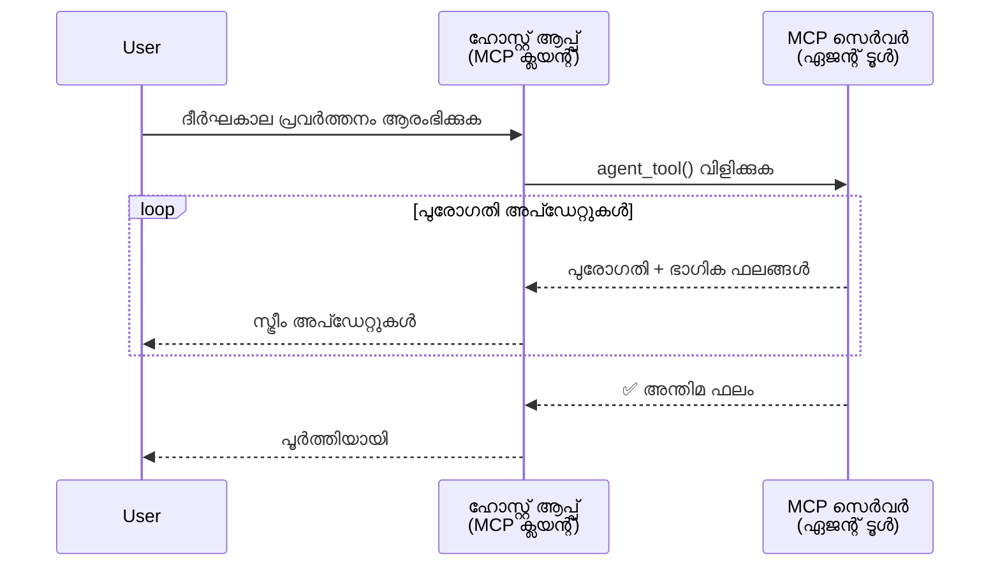
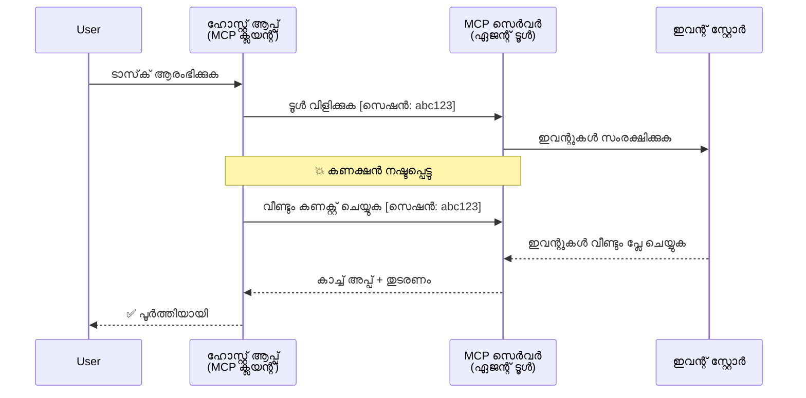
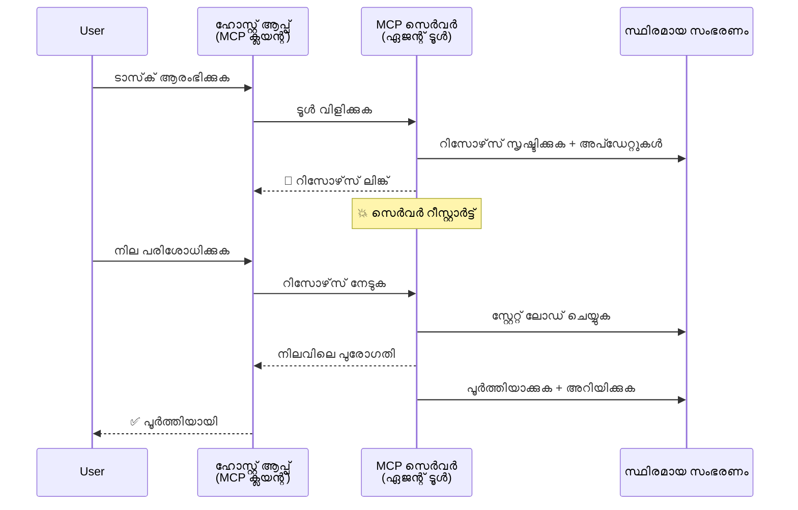
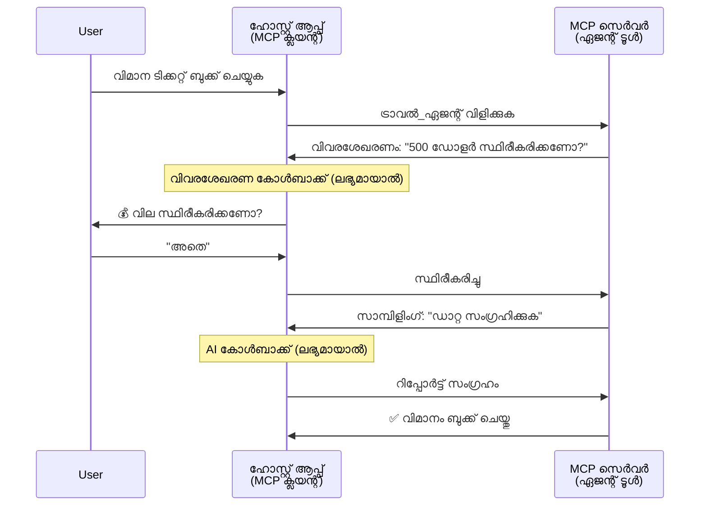

<!--
CO_OP_TRANSLATOR_METADATA:
{
  "original_hash": "5cc6836626047aa055e8960c8484a7d0",
  "translation_date": "2025-12-03T17:44:57+00:00",
  "source_file": "11-agentic-protocols/code_samples/mcp-agents/README.md",
  "language_code": "ml"
}
-->
# MCP ഉപയോഗിച്ച് ഏജന്റ്-ടു-ഏജന്റ് ആശയവിനിമയ സംവിധാനങ്ങൾ നിർമ്മിക്കൽ

> TL;DR - MCP ഉപയോഗിച്ച് Agent2Agent Communication നിർമ്മിക്കാമോ? അതെ!

MCP അതിന്റെ ആദ്യ ലക്ഷ്യമായ "LLM-കൾക്ക് സാന്ദർഭ്യം നൽകൽ" എന്നതിനെക്കാൾ വളരെ മുന്നോട്ട് വികസിച്ചിട്ടുണ്ട്. [Resumable streams](https://modelcontextprotocol.io/docs/concepts/transports#resumability-and-redelivery), [elicitation](https://modelcontextprotocol.io/specification/2025-06-18/client/elicitation), [sampling](https://modelcontextprotocol.io/specification/2025-06-18/client/sampling), [notifications](https://modelcontextprotocol.io/specification/2025-06-18/basic/utilities/progress) എന്നിവ ഉൾപ്പെടെ പുതിയ മെച്ചപ്പെടുത്തലുകൾ MCP-യെ സങ്കീർണ്ണമായ ഏജന്റ്-ടു-ഏജന്റ് ആശയവിനിമയ സംവിധാനങ്ങൾ നിർമ്മിക്കാൻ ശക്തമായ അടിസ്ഥാനമായി മാറ്റിയിരിക്കുന്നു.

## ഏജന്റ്/ടൂൾ എന്ന തെറ്റിദ്ധാരണ

ഏജന്റിക് സ്വഭാവമുള്ള ടൂളുകൾ (ദീർഘകാലം പ്രവർത്തിക്കുക, നടപ്പിലാക്കലിനിടയിൽ അധിക ഇൻപുട്ടുകൾ ആവശ്യമാകാം, മുതലായവ) പരിശോധിക്കുന്ന കൂടുതൽ ഡെവലപ്പർമാർ MCP അനുയോജ്യമല്ല എന്ന തെറ്റിദ്ധാരണയിലാണ്. കാരണം MCP-യുടെ ആദ്യകാല ടൂൾ പ്രിമിറ്റീവ് ഉദാഹരണങ്ങൾ ലളിതമായ അഭ്യർത്ഥന-മറുപടി മാതൃകകളിൽ കേന്ദ്രീകരിച്ചിരുന്നതാണ്.

ഈ ധാരണ പഴയതാണ്. ദീർഘകാല ഏജന്റിക് സ്വഭാവങ്ങൾ നിർമ്മിക്കുന്നതിനുള്ള ശേഷികൾക്കുള്ള അന്തരം അടയ്ക്കുന്ന രീതിയിൽ MCP സ്പെസിഫിക്കേഷൻ കഴിഞ്ഞ കുറച്ച് മാസങ്ങളിൽ വളരെ മെച്ചപ്പെടുത്തിയിട്ടുണ്ട്:

- **Streaming & Partial Results**: നടപ്പിലാക്കലിനിടയിൽ റിയൽ-ടൈം പുരോഗതി അപ്ഡേറ്റുകൾ
- **Resumability**: ക്ലയന്റുകൾ ഡിസ്‌കണക്ഷനുശേഷം വീണ്ടും കണക്റ്റ് ചെയ്ത് തുടരണം
- **Durability**: ഫലങ്ങൾ സെർവർ റീസ്റ്റാർട്ടുകൾക്കുശേഷവും നിലനിൽക്കും (ഉദാ: റിസോഴ്‌സ് ലിങ്കുകൾ വഴി)
- **Multi-turn**: നടപ്പിലാക്കലിനിടയിൽ ഇന്ററാക്ടീവ് ഇൻപുട്ടുകൾ (elicitation, sampling വഴി)

ഈ സവിശേഷതകൾ സംയോജിപ്പിച്ച് സങ്കീർണ്ണമായ ഏജന്റിക്, മൾട്ടി-ഏജന്റ് ആപ്ലിക്കേഷനുകൾ MCP പ്രോട്ടോക്കോളിൽ വിന്യസിക്കാം.

ഉദാഹരണത്തിന്, MCP സെർവറിൽ ലഭ്യമായ "ടൂൾ" എന്ന നിലയിൽ ഒരു ഏജന്റിനെ പരിഗണിക്കാം. ഇത് MCP ക്ലയന്റ് നടപ്പിലാക്കുന്ന ഒരു ഹോസ്റ്റ് ആപ്ലിക്കേഷൻ നിലനിൽക്കുന്നതിനെ സൂചിപ്പിക്കുന്നു, ഇത് MCP സെർവറുമായി ഒരു സെഷൻ സ്ഥാപിക്കുകയും ഏജന്റിനെ വിളിക്കുകയും ചെയ്യുന്നു.

## ഒരു MCP ടൂൾ "ഏജന്റിക്" ആകുന്നത് എന്തുകൊണ്ട്?

നടപ്പിലാക്കലിലേക്ക് കടക്കുന്നതിന് മുമ്പ്, ദീർഘകാല ഏജന്റുകളെ പിന്തുണയ്ക്കാൻ ആവശ്യമായ അടിസ്ഥാന സൗകര്യ ശേഷികൾ എന്താണെന്ന് നിശ്ചയിക്കാം.

> ദീർഘകാലം സ്വയം പ്രവർത്തിക്കാൻ കഴിവുള്ള, റിയൽ-ടൈം ഫീഡ്ബാക്ക് അടിസ്ഥാനമാക്കി നിരവധി ഇടപെടലുകൾ അല്ലെങ്കിൽ ക്രമീകരണങ്ങൾ ആവശ്യമായ സങ്കീർണ്ണമായ പ്രവർത്തനങ്ങൾ കൈകാര്യം ചെയ്യാൻ കഴിവുള്ള ഒരു ഘടകമായാണ് ഏജന്റിനെ നമുക്ക് നിർവചിക്കാം.

### 1. Streaming & Partial Results

ദീർഘകാല പ്രവർത്തനങ്ങൾക്ക് പരമ്പരാഗത അഭ്യർത്ഥന-മറുപടി മാതൃകകൾ പ്രവർത്തിക്കില്ല. ഏജന്റുകൾ നൽകേണ്ടത്:

- റിയൽ-ടൈം പുരോഗതി അപ്ഡേറ്റുകൾ
- ഇടക്കാല ഫലങ്ങൾ

**MCP പിന്തുണ**: റിസോഴ്‌സ് അപ്ഡേറ്റ് നോട്ടിഫിക്കേഷനുകൾ സ്റ്റ്രീമിംഗ് പാർഷ്യൽ ഫലങ്ങൾ അനുവദിക്കുന്നു, എന്നാൽ ഇത് JSON-RPC-ന്റെ 1:1 അഭ്യർത്ഥന/മറുപടി മാതൃകയുമായി സംഘർഷങ്ങൾ ഒഴിവാക്കാൻ ശ്രദ്ധാപൂർവ്വം രൂപകൽപ്പന ചെയ്യേണ്ടതുണ്ട്.

| സവിശേഷത                    | ഉപയോഗകേസ്                                                                                                                                                                       | MCP പിന്തുണ                                                                                |
| -------------------------- | ------------------------------------------------------------------------------------------------------------------------------------------------------------------------------ | ------------------------------------------------------------------------------------------ |
| റിയൽ-ടൈം പുരോഗതി അപ്ഡേറ്റുകൾ | ഉപയോക്താവ് ഒരു കോഡ്ബേസ് മൈഗ്രേഷൻ ടാസ്ക് അഭ്യർത്ഥിക്കുന്നു. ഏജന്റ് പുരോഗതി സ്റ്റ്രീം ചെയ്യുന്നു: "10% - ഡിപെൻഡൻസികൾ വിശകലനം ചെയ്യുന്നു... 25% - ടൈപ്പ്‌സ്‌ക്രിപ്റ്റ് ഫയലുകൾ മാറ്റുന്നു... 50% - ഇമ്പോർട്ടുകൾ അപ്ഡേറ്റ് ചെയ്യുന്നു..."          | ✅ പുരോഗതി നോട്ടിഫിക്കേഷനുകൾ                                                                  |
| പാർഷ്യൽ ഫലങ്ങൾ            | "ഒരു പുസ്തകം സൃഷ്ടിക്കുക" ടാസ്ക് പാർഷ്യൽ ഫലങ്ങൾ സ്റ്റ്രീം ചെയ്യുന്നു, ഉദാ., 1) കഥാ ഘടനയുടെ ഔട്ട്‌ലൈൻ, 2) ചാപ്റ്റർ ലിസ്റ്റ്, 3) ഓരോ ചാപ്റ്ററും പൂർത്തിയാകുമ്പോൾ. ഹോസ്റ്റ് പരിശോധിക്കാം, റദ്ദാക്കാം, അല്ലെങ്കിൽ ഏതെങ്കിലും ഘട്ടത്തിൽ തിരിച്ചുവിടാം. | ✅ നോട്ടിഫിക്കേഷനുകൾ "വിപുലീകരിക്കാം" പാർഷ്യൽ ഫലങ്ങൾ ഉൾപ്പെടുത്താൻ (PR 383, 776) |

<div align="center" style="font-style: italic; font-size: 0.95em; margin-bottom: 0.5em;">
<strong>ചിത്രം 1:</strong> ദീർഘകാല ടാസ്കിനിടെ MCP ഏജന്റ് റിയൽ-ടൈം പുരോഗതി അപ്ഡേറ്റുകളും പാർഷ്യൽ ഫലങ്ങളും ഹോസ്റ്റ് ആപ്ലിക്കേഷനിലേക്ക് എങ്ങനെ സ്റ്റ്രീം ചെയ്യുന്നു എന്ന് ഈ ഡയഗ്രാം കാണിക്കുന്നു, ഉപയോക്താവിന് നടപ്പിലാക്കൽ റിയൽ ടൈമിൽ നിരീക്ഷിക്കാൻ കഴിയുന്നു.
</div>


### 2. Resumability

ഏജന്റുകൾ നെറ്റ്‌വർക്ക് തടസ്സങ്ങളെ സുഖപ്രദമായി കൈകാര്യം ചെയ്യണം:

- (ക്ലയന്റ്) ഡിസ്‌കണക്ഷനുശേഷം വീണ്ടും കണക്റ്റ് ചെയ്യുക
- അവർ അവസാനിച്ചിടത്ത് നിന്ന് തുടരണം (സന്ദേശം വീണ്ടും നൽകുക)

**MCP പിന്തുണ**: MCP StreamableHTTP ട്രാൻസ്പോർട്ട് ഇന്ന് സെഷൻ പുനരാരംഭനവും സന്ദേശം വീണ്ടും നൽകലും സെഷൻ ഐഡികളും അവസാന ഇവന്റ് ഐഡികളും ഉപയോഗിച്ച് പിന്തുണയ്ക്കുന്നു. ഇവിടെ പ്രധാനമായുള്ളത് സെർവർ ഒരു EventStore നടപ്പിലാക്കണം, ഇത് ക്ലയന്റ് വീണ്ടും കണക്റ്റ് ചെയ്യുമ്പോൾ ഇവന്റ് റീപ്ലേകൾ അനുവദിക്കുന്നു.  
ട്രാൻസ്പോർട്ട്-അഗ്നോസ്റ്റിക് റിസ്യൂമബിൾ സ്റ്റ്രീമുകൾ പരിശോധിക്കുന്ന ഒരു കമ്മ്യൂണിറ്റി പ്രൊപ്പോസൽ (PR #975) ഉണ്ട്.

| സവിശേഷത      | ഉപയോഗകേസ്                                                                                                                                                   | MCP പിന്തുണ                                                                |
| ------------ | ---------------------------------------------------------------------------------------------------------------------------------------------------------- | -------------------------------------------------------------------------- |
| Resumability | ദീർഘകാല ടാസ്കിനിടെ ക്ലയന്റ് ഡിസ്‌കണക്റ്റ് ചെയ്യുന്നു. വീണ്ടും കണക്റ്റ് ചെയ്യുമ്പോൾ, സെഷൻ നഷ്ടപ്പെട്ട ഇവന്റുകൾ വീണ്ടും പ്ലേ ചെയ്ത്, seamless ആയി തുടരും. | ✅ StreamableHTTP ട്രാൻസ്പോർട്ട് സെഷൻ ഐഡികൾ, ഇവന്റ് റീപ്ലേ, EventStore |

<div align="center" style="font-style: italic; font-size: 0.95em; margin-bottom: 0.5em;">
<strong>ചിത്രം 2:</strong> MCP-യുടെ StreamableHTTP ട്രാൻസ്പോർട്ട്, ഇവന്റ് സ്റ്റോർ എന്നിവ എങ്ങനെ seamless സെഷൻ പുനരാരംഭനം സാധ്യമാക്കുന്നു എന്ന് ഈ ഡയഗ്രാം കാണിക്കുന്നു: ക്ലയന്റ് ഡിസ്‌കണക്റ്റ് ചെയ്താൽ, അത് വീണ്ടും കണക്റ്റ് ചെയ്ത് നഷ്ടപ്പെട്ട ഇവന്റുകൾ വീണ്ടും പ്ലേ ചെയ്യുകയും ടാസ്ക് പുരോഗതി നഷ്ടപ്പെടാതെ തുടരുമെന്നും.
</div>


### 3. Durability

ദീർഘകാല ഏജന്റുകൾക്ക് സ്ഥിരമായ സ്റ്റേറ്റ് ആവശ്യമുണ്ട്:

- ഫലങ്ങൾ സെർവർ റീസ്റ്റാർട്ടുകൾക്കുശേഷവും നിലനിൽക്കും
- സ്റ്റാറ്റസ് ഔട്ട്-ഓഫ്-ബാൻഡ് ആയി റിട്രീവ് ചെയ്യാം
- സെഷനുകൾക്കിടയിൽ പുരോഗതി ട്രാക്കിംഗ്

**MCP പിന്തുണ**: MCP ഇപ്പോൾ ടൂൾ കോൾസിനായി ഒരു റിസോഴ്‌സ് ലിങ്ക് റിട്ടേൺ ടൈപ്പ് പിന്തുണയ്ക്കുന്നു. ഇന്ന്, ഒരു സാധ്യമായ മാതൃക ഒരു റിസോഴ്‌സ് സൃഷ്ടിക്കുകയും ഉടൻ ഒരു റിസോഴ്‌സ് ലിങ്ക് റിട്ടേൺ ചെയ്യുകയും ചെയ്യുന്ന ഒരു ടൂൾ രൂപകൽപ്പന ചെയ്യുക എന്നതാണ്. ടൂൾ പശ്ചാത്തലത്തിൽ ടാസ്ക് കൈകാര്യം ചെയ്യുകയും റിസോഴ്‌സ് അപ്ഡേറ്റ് ചെയ്യുകയും ചെയ്യാം. മറുവശത്ത്, ക്ലയന്റ് ഈ റിസോഴ്‌സിന്റെ സ്റ്റേറ്റ് പോൾ ചെയ്യാൻ തിരഞ്ഞെടുക്കാം, ഭാഗിക അല്ലെങ്കിൽ പൂർണ്ണ ഫലങ്ങൾ ലഭിക്കാൻ (സെർവർ നൽകുന്ന റിസോഴ്‌സ് അപ്ഡേറ്റുകൾ അടിസ്ഥാനമാക്കി) അല്ലെങ്കിൽ അപ്ഡേറ്റുകൾക്കായി റിസോഴ്‌സിൽ സബ്സ്ക്രൈബ് ചെയ്യാം.

ഇവിടെ ഒരു പരിമിതി എന്തെന്നാൽ, റിസോഴ്‌സുകൾ പോൾ ചെയ്യുകയോ അപ്ഡേറ്റുകൾക്കായി സബ്സ്ക്രൈബ് ചെയ്യുകയോ ചെയ്യുന്നത് സ്കെയിലിൽ പ്രത്യാഘാതങ്ങളോടെ റിസോഴ്‌സുകൾ ഉപഭോഗിക്കാം. സെർവർ ക്ലയന്റ്/ഹോസ്റ്റ് ആപ്ലിക്കേഷനിലേക്ക് അപ്ഡേറ്റുകൾ അറിയിക്കാൻ വിളിക്കാവുന്ന വെബ്‌ഹുക്കുകൾ അല്ലെങ്കിൽ ട്രിഗറുകൾ ഉൾപ്പെടുത്താനുള്ള സാധ്യത പരിശോധിക്കുന്ന ഒരു തുറന്ന കമ്മ്യൂണിറ്റി പ്രൊപ്പോസൽ (#992 ഉൾപ്പെടെ) ഉണ്ട്.

| സവിശേഷത    | ഉപയോഗകേസ്                                                                                                                                        | MCP പിന്തുണ                                                        |
| ---------- | ----------------------------------------------------------------------------------------------------------------------------------------------- | ------------------------------------------------------------------ |
| Durability | ഡാറ്റ മൈഗ്രേഷൻ ടാസ്കിനിടെ സെർവർ ക്രാഷ് ചെയ്യുന്നു. ഫലങ്ങളും പുരോഗതിയും റീസ്റ്റാർട്ടിനുശേഷം നിലനിൽക്കും, ക്ലയന്റ് സ്റ്റാറ്റസ് പരിശോധിച്ച് സ്ഥിരമായ റിസോഴ്‌സിൽ നിന്ന് തുടരും. | ✅ റിസോഴ്‌സ് ലിങ്കുകൾ സ്ഥിരമായ സ്റ്റോറേജും സ്റ്റാറ്റസ് നോട്ടിഫിക്കേഷനുകളും |

ഇന്ന്, ഒരു സാധാരണ മാതൃക ഒരു റിസോഴ്‌സ് സൃഷ്ടിക്കുകയും ഉടൻ ഒരു റിസോഴ്‌സ് ലിങ്ക് റിട്ടേൺ ചെയ്യുകയും ചെയ്യുന്ന ഒരു ടൂൾ രൂപകൽപ്പന ചെയ്യുക എന്നതാണ്. ടൂൾ പശ്ചാത്തലത്തിൽ ടാസ്ക് കൈകാര്യം ചെയ്യുകയും, പുരോഗതി അപ്ഡേറ്റുകൾ അല്ലെങ്കിൽ പാർഷ്യൽ ഫലങ്ങൾ ആയി പ്രവർത്തിക്കുന്ന റിസോഴ്‌സ് നോട്ടിഫിക്കേഷനുകൾ നൽകുകയും, ആവശ്യമായപ്പോൾ റിസോഴ്‌സിലെ ഉള്ളടക്കം അപ്ഡേറ്റ് ചെയ്യുകയും ചെയ്യുന്നു.

<div align="center" style="font-style: italic; font-size: 0.95em; margin-bottom: 0.5em;">
<strong>ചിത്രം 3:</strong> ദീർഘകാല ടാസ്കുകൾ സെർവർ റീസ്റ്റാർട്ടുകൾക്ക് ശേഷവും നിലനിൽക്കാൻ MCP ഏജന്റുകൾ സ്ഥിരമായ റിസോഴ്‌സുകളും സ്റ്റാറ്റസ് നോട്ടിഫിക്കേഷനുകളും എങ്ങനെ ഉപയോഗിക്കുന്നു എന്ന് ഈ ഡയഗ്രാം കാണിക്കുന്നു, ക്ലയന്റുകൾക്ക് പുരോഗതി പരിശോധിക്കാനും പരാജയങ്ങൾക്കുശേഷം ഫലങ്ങൾ റിട്രീവ് ചെയ്യാനും അനുവദിക്കുന്നു.
</div>


### 4. മൾട്ടി-ടേൺ ഇന്ററാക്ഷനുകൾ

ഏജന്റുകൾ നടപ്പിലാക്കലിനിടയിൽ അധിക ഇൻപുട്ടുകൾ ആവശ്യമാകാം:

- മനുഷ്യ വ്യക്തീകരണവും അംഗീകാരവും
- സങ്കീർണ്ണമായ തീരുമാനങ്ങൾക്ക് AI സഹായം
- ഡൈനാമിക് പാരാമീറ്റർ ക്രമീകരണം

**MCP പിന്തുണ**: സാംപ്ലിംഗ് (AI ഇൻപുട്ടിനായി) എലിസിറ്റേഷൻ (മനുഷ്യ ഇൻപുട്ടിനായി) വഴി പൂർണ്ണമായും പിന്തുണയ്ക്കുന്നു.

| സവിശേഷത                 | ഉപയോഗകേസ്                                                                                                                                     | MCP പിന്തുണ                                           |
| ----------------------- | -------------------------------------------------------------------------------------------------------------------------------------------- | ----------------------------------------------------- |
| മൾട്ടി-ടേൺ ഇന്ററാക്ഷനുകൾ | ട്രാവൽ ബുക്കിംഗ് ഏജന്റ് ഉപയോക്താവിൽ നിന്ന് വില സ്ഥിരീകരണം അഭ്യർത്ഥിക്കുന്നു, തുടർന്ന് AI-നെ യാത്രാ ഡാറ്റ സംഗ്രഹിക്കാൻ അഭ്യർത്ഥിക്കുന്നു, ബുക്കിംഗ് ട്രാൻസാക്ഷൻ പൂർത്തിയാക്കുന്നതിന് മുമ്പ്. | ✅ എലിസിറ്റേഷൻ മനുഷ്യ ഇൻപുട്ടിനായി, സാംപ്ലിംഗ് AI ഇൻപുട്ടിനായി |

<div align="center" style="font-style: italic; font-size: 0.95em; margin-bottom: 0.5em;">
<strong>ചിത്രം 4:</strong> MCP ഏജന്റുകൾ എങ്ങനെ നടപ്പിലാക്കലിനിടെ മനുഷ്യ ഇൻപുട്ട് ഇലിസിറ്റ് ചെയ്യുകയോ AI സഹായം അഭ്യർത്ഥിക്കുകയോ ചെയ്യുന്നു എന്ന് ഈ ഡയഗ്രാം കാണിക്കുന്നു, സ്ഥിരീകരണങ്ങളും ഡൈനാമിക് തീരുമാനമെടുക്കലുകളും പോലുള്ള സങ്കീർണ്ണമായ, മൾട്ടി-ടേൺ വർക്ക്‌ഫ്ലോകളെ പിന്തുണയ്ക്കുന്നു.
</div>


## MCP-യിൽ ദീർഘകാല ഏജന്റുകൾ നടപ്പിലാക്കൽ - കോഡ് അവലോകനം

ഈ ലേഖനത്തിന്റെ ഭാഗമായ്, [കോഡ് റിപോസിറ്ററി](https://github.com/victordibia/ai-tutorials/tree/main/MCP%20Agents) MCP Python SDK ഉപയോഗിച്ച് StreamableHTTP ട്രാൻസ്പോർട്ട് ഉപയോഗിച്ച് സെഷൻ പുനരാരംഭനവും സന്ദേശം വീണ്ടും നൽകലും ഉപയോഗിച്ച് ദീർഘകാല ഏജന്റുകൾ എങ്ങനെ നടപ്പിലാക്കാമെന്ന് കാണിക്കുന്ന പൂർണ്ണമായ നടപ്പിലാക്കൽ അടങ്ങിയിരിക്കുന്നു. MCP ശേഷികൾ എങ്ങനെ സംയോജിപ്പിച്ച് സങ്കീർണ്ണമായ ഏജന്റുകൾ പോലുള്ള സ്വഭാവങ്ങൾ സാധ്യമാക്കാമെന്ന് നടപ്പിലാക്കൽ കാണിക്കുന്നു.

പ്രത്യേകിച്ച്, രണ്ട് പ്രധാന ഏജന്റ് ടൂളുകളുള്ള ഒരു സെർവർ ഞങ്ങൾ നടപ്പിലാക്കുന്നു:

- **ട്രാവൽ ഏജന്റ്** - എലിസിറ്റേഷൻ വഴി വില സ്ഥിരീകരണവുമായി ഒരു യാത്രാ ബുക്കിംഗ് സേവനം സിമുലേറ്റ് ചെയ്യുന്നു
- **റിസർച്ച് ഏജന്റ്** - സാംപ്ലിംഗ് വഴി AI സഹായത്തോടെ സംഗ്രഹങ്ങൾ ഉപയോഗിച്ച് ഗവേഷണ പ്രവർത്തനങ്ങൾ നടത്തുന്നു

രണ്ടു ഏജന്റുകളും റിയൽ-ടൈം പുരോഗതി അപ്ഡേറ്റുകൾ, ഇന്ററാക്ടീവ് സ്ഥിരീകരണങ്ങൾ, പൂർണ്ണ സെഷൻ പുനരാരംഭന ശേഷികൾ എന്നിവ പ്രദർശിപ്പിക്കുന്നു.

### പ്രധാന നടപ്പിലാക്കൽ ആശയങ്ങൾ

ഓരോ ശേഷിക്കും വേണ്ടി സെർവർ-സൈഡ് ഏജന്റ് നടപ്പിലാക്കലും ക്ലയന്റ്-സൈഡ് ഹോസ്റ്റ് കൈകാര്യം ചെയ്യലും താഴെ കാണിക്കുന്നു:

#### Streaming & Progress Updates - റിയൽ-ടൈം ടാസ്ക് സ്റ്റാറ്റസ്

ദീർഘകാല ടാസ്കിനിടെ ഏജന്റുകൾ റിയൽ-ടൈം പുരോഗതി അപ്ഡേറ്റുകൾ നൽകാൻ സ്റ്റ്രീമിംഗ് അനുവദിക്കുന്നു, ഉപയോക്താക്കളെ ടാസ്ക് സ്റ്റാറ്റസിനെയും ഇടക്കാല ഫലങ്ങളെയും കുറിച്ച് അറിയിക്കുന്നു.

**സെർവർ നടപ്പിലാക്കൽ (ഏജന്റ് പുരോഗതി നോട്ടിഫിക്കേഷനുകൾ അയയ്ക്കുന്നു):**

```python
# സെർവർ/സെർവർ.py - യാത്രാ ഏജന്റ് പുരോഗതി അപ്ഡേറ്റുകൾ അയയ്ക്കുന്നു
for i, step in enumerate(steps):
    await ctx.session.send_progress_notification(
        progress_token=ctx.request_id,
        progress=i * 25,
        total=100,
        message=step,
        related_request_id=str(ctx.request_id)
    )
    await anyio.sleep(2)  # പ്രവർത്തനം അനുകരിക്കുക

# മറ്റൊരു മാർഗം: വിശദമായ ഘട്ടംഘട്ട അപ്ഡേറ്റുകൾക്കായുള്ള ലോഗ് സന്ദേശങ്ങൾ
await ctx.session.send_log_message(
    level="info",
    data=f"Processing step {current_step}/{steps} ({progress_percent}%)",
    logger="long_running_agent",
    related_request_id=ctx.request_id,
)
```

**ക്ലയന്റ് നടപ്പിലാക്കൽ (ഹോസ്റ്റ് പുരോഗതി അപ്ഡേറ്റുകൾ സ്വീകരിക്കുന്നു):**

```python
# ക്ലയന്റ്/ക്ലയന്റ്.py - റിയൽ-ടൈം അറിയിപ്പുകൾ കൈകാര്യം ചെയ്യുന്ന ക്ലയന്റ്
async def message_handler(message) -> None:
    if isinstance(message, types.ServerNotification):
        if isinstance(message.root, types.LoggingMessageNotification):
            console.print(f"📡 [dim]{message.root.params.data}[/dim]")
        elif isinstance(message.root, types.ProgressNotification):
            progress = message.root.params
            console.print(f"🔄 [yellow]{progress.message} ({progress.progress}/{progress.total})[/yellow]")

# സെഷൻ സൃഷ്ടിക്കുമ്പോൾ സന്ദേശ ഹാൻഡ്ലർ രജിസ്റ്റർ ചെയ്യുക
async with ClientSession(
    read_stream, write_stream,
    message_handler=message_handler
) as session:
```

#### Elicitation - ഉപയോക്തൃ ഇൻപുട്ട് അഭ്യർത്ഥിക്കൽ

ദീർഘകാല ടാസ്കിനിടെ സ്ഥിരീകരണങ്ങൾ, വ്യക്തീകരണങ്ങൾ, അല്ലെങ്കിൽ അംഗീകാരങ്ങൾ ആവശ്യമായപ്പോൾ ഏജന്റുകൾ ഉപയോക്തൃ ഇൻപുട്ട് അഭ്യർത്ഥിക്കാൻ എലിസിറ്റേഷൻ അനുവദിക്കുന്നു.

**സെർവർ നടപ്പിലാക്കൽ (ഏജന്റ് സ്ഥിരീകരണം അഭ്യർത്ഥിക്കുന്നു):**

```python
# സെർവർ/server.py - യാത്രാ ഏജന്റ് വില സ്ഥിരീകരണം അഭ്യർത്ഥിക്കുന്നു
elicit_result = await ctx.session.elicit(
    message=f"Please confirm the estimated price of $1200 for your trip to {destination}",
    requestedSchema=PriceConfirmationSchema.model_json_schema(),
    related_request_id=ctx.request_id,
)

if elicit_result and elicit_result.action == "accept":
    # ബുക്കിംഗ് തുടരുക
    logger.info(f"User confirmed price: {elicit_result.content}")
elif elicit_result and elicit_result.action == "decline":
    # ബുക്കിംഗ് റദ്ദാക്കുക
    booking_cancelled = True
```

**ക്ലയന്റ് നടപ്പിലാക്കൽ (ഹോസ്റ്റ് എലിസിറ്റേഷൻ കോൾബാക്ക് നൽകുന്നു):**

```python
# ക്ലയന്റ്/ക്ലയന്റ്.py - ക്ലയന്റ് അഭ്യർത്ഥനകൾ കൈകാര്യം ചെയ്യുന്നു
async def elicitation_callback(context, params):
    console.print(f"💬 Server is asking for confirmation:")
    console.print(f"   {params.message}")

    response = console.input("Do you accept? (y/n): ").strip().lower()

    if response in ['y', 'yes']:
        return types.ElicitResult(
            action="accept",
            content={"confirm": True, "notes": "Confirmed by user"}
        )
    else:
        return types.ElicitResult(
            action="decline",
            content={"confirm": False, "notes": "Declined by user"}
        )

# സെഷൻ സൃഷ്ടിക്കുമ്പോൾ കോൾബാക്ക് രജിസ്റ്റർ ചെയ്യുക
async with ClientSession(
    read_stream, write_stream,
    elicitation_callback=elicitation_callback
) as session:
```

#### Sampling - AI സഹായം അഭ്യർത്ഥിക്കൽ

സാംപ്ലിംഗ് ഏജന്റുകൾക്ക് നടപ്പിലാക്കലിനിടെ സങ്കീർണ്ണമായ തീരുമാനങ്ങൾക്കോ ഉള്ളടക്കം സൃഷ്ടിക്കാനോ LLM സഹായം അഭ്യർത്ഥിക്കാൻ അനുവദിക്കുന്നു. ഇത് മനുഷ്യ-AI സംയുക്ത വർക്ക്‌ഫ്ലോകളെ സാധ്യമാക്കുന്നു.

**സെർവർ നടപ്പിലാക്കൽ (ഏജന്റ് AI സഹായം അഭ്യർത്ഥിക്കുന്നു):**

```python
# സെർവർ/സെർവർ.py - ഗവേഷണ ഏജന്റ് AI സംഗ്രഹം അഭ്യർത്ഥിക്കുന്നു
sampling_result = await ctx.session.create_message(
    messages=[
        SamplingMessage(
            role="user",
            content=TextContent(type="text", text=f"Please summarize the key findings for research on: {topic}")
        )
    ],
    max_tokens=100,
    related_request_id=ctx.request_id,
)

if sampling_result and sampling_result.content:
    if sampling_result.content.type == "text":
        sampling_summary = sampling_result.content.text
        logger.info(f"Received sampling summary: {sampling_summary}")
```

**ക്ലയന്റ് നടപ്പിലാക്കൽ (ഹോസ്റ്റ് സാംപ്ലിംഗ് കോൾബാക്ക് നൽകുന്നു):**

```python
# ക്ലയന്റ്/ക്ലയന്റ്.py - ക്ലയന്റ് സാമ്പിളിംഗ് അഭ്യർത്ഥനകൾ കൈകാര്യം ചെയ്യുന്നു
async def sampling_callback(context, params):
    message_text = params.messages[0].content.text if params.messages else 'No message'
    console.print(f"🧠 Server requested sampling: {message_text}")

    # ഒരു യഥാർത്ഥ ആപ്ലിക്കേഷനിൽ, ഇത് ഒരു LLM API വിളിക്കാം
    # ഡെമോ ആവശ്യങ്ങൾക്കായി, ഞങ്ങൾ ഒരു മോക്ക് പ്രതികരണം നൽകുന്നു
    mock_response = "Based on current research, MCP has evolved significantly..."

    return types.CreateMessageResult(
        role="assistant",
        content=types.TextContent(type="text", text=mock_response),
        model="interactive-client",
        stopReason="endTurn"
    )

# സെഷൻ സൃഷ്ടിക്കുമ്പോൾ കോൾബാക്ക് രജിസ്റ്റർ ചെയ്യുക
async with ClientSession(
    read_stream, write_stream,
    sampling_callback=sampling_callback,
    elicitation_callback=elicitation_callback
) as session:
```

#### Resumability - ഡിസ്‌കണക്ഷനുകൾക്കിടയിലുള്ള സെഷൻ തുടർച്ച

Resumability ദീർഘകാല ഏജന്റ് ടാസ്കുകൾ ക്ലയന്റ് ഡിസ്‌കണക്ഷനുകൾക്ക് ശേഷവും തുടർച്ചയായി തുടരാൻ അനുവദിക്കുന്നു. ഇത് ഇവന്റ് സ്റ്റോറുകളും പുനരാരംഭ ടോക്കണുകളും വഴി നടപ്പിലാക്കുന്നു.

**ഇവന്റ് സ്റ്റോർ നടപ്പിലാക്കൽ (സെർവർ സെഷൻ സ്റ്റേറ്റ് നിലനിർത്തുന്നു):**

```python
# സർവർ/ഇവന്റ്_സ്റ്റോർ.py - ലളിതമായ ഇൻ-മെമ്മറി ഇവന്റ് സ്റ്റോർ
class SimpleEventStore(EventStore):
    def __init__(self):
        self._events: list[tuple[StreamId, EventId, JSONRPCMessage]] = []
        self._event_id_counter = 0

    async def store_event(self, stream_id: StreamId, message: JSONRPCMessage) -> EventId:
        """Store an event and return its ID."""
        self._event_id_counter += 1
        event_id = str(self._event_id_counter)
        self._events.append((stream_id, event_id, message))
        return event_id

    async def replay_events_after(self, last_event_id: EventId, send_callback: EventCallback) -> StreamId | None:
        """Replay events after the specified ID for resumption."""
        # അവസാനമായി അറിയപ്പെടുന്ന ഇവന്റിന് ശേഷം ഇവന്റുകൾ കണ്ടെത്തി അവ പുനരാവർത്തിക്കുക
        for _, event_id, message in self._events[start_index:]:
            await send_callback(EventMessage(message, event_id))

# സർവർ/സർവർ.py - ഇവന്റ് സ്റ്റോർ സെഷൻ മാനേജറിലേക്ക് പാസ്സ് ചെയ്യുന്നു
def create_server_app(event_store: Optional[EventStore] = None) -> Starlette:
    server = ResumableServer()

    # പുനരാരംഭത്തിനായി ഇവന്റ് സ്റ്റോറുമായി സെഷൻ മാനേജർ സൃഷ്ടിക്കുക
    session_manager = StreamableHTTPSessionManager(
        app=server,
        event_store=event_store,  # ഇവന്റ് സ്റ്റോർ സെഷൻ പുനരാരംഭം സാധ്യമാക്കുന്നു
        json_response=False,
        security_settings=security_settings,
    )

    return Starlette(routes=[Mount("/mcp", app=session_manager.handle_request)])

# ഉപയോഗം: ഇവന്റ് സ്റ്റോറുമായി ഇൻഷിയലൈസ് ചെയ്യുക
event_store = SimpleEventStore()
app = create_server_app(event_store)
```

**ക്ലയന്റ് മെറ്റാഡാറ്റാ റിസംപ്ഷൻ ടോക്കണുമായി (ക്ലയന്റ് സ്റ്റോർ ചെയ്ത സ്റ്റേറ്റ് ഉപയോഗിച്ച് വീണ്ടും കണക്റ്റ് ചെയ്യുന്നു):**

```python
# ക്ലയന്റ്/ക്ലയന്റ്.py - മെറ്റാഡാറ്റയുമായി ക്ലയന്റ് പുനരാരംഭിക്കൽ
if existing_tokens and existing_tokens.get("resumption_token"):
    # നാം അവസാനിപ്പിച്ചിടത്ത് നിന്ന് തുടരാൻ നിലവിലുള്ള പുനരാരംഭ ടോക്കൺ ഉപയോഗിക്കുക
    metadata = ClientMessageMetadata(
        resumption_token=existing_tokens["resumption_token"],
    )
else:
    # പുനരാരംഭ ടോക്കൺ ലഭിക്കുമ്പോൾ സംരക്ഷിക്കാൻ കോൾബാക്ക് സൃഷ്ടിക്കുക
    def enhanced_callback(token: str):
        protocol_version = getattr(session, 'protocol_version', None)
        token_manager.save_tokens(session_id, token, protocol_version, command, args)

    metadata = ClientMessageMetadata(
        on_resumption_token_update=enhanced_callback,
    )

# പുനരാരംഭ മെറ്റാഡാറ്റയുമായി അഭ്യർത്ഥന അയയ്ക്കുക
result = await session.send_request(
    types.ClientRequest(
        types.CallToolRequest(
            method="tools/call",
            params=types.CallToolRequestParams(name=command, arguments=args)
        )
    ),
    types.CallToolResult,
    metadata=metadata,
)
```

ഹോസ്റ്റ് ആപ്ലിക്കേഷൻ സെഷൻ ഐഡികളും റിസംപ്ഷൻ ടോക്കണുകളും പ്രാദേശികമായി നിലനിർത്തുന്നു, പ്രോഗ്രസോ സ്റ്റ
മൊത്തത്തിൽ, MCP പ്രോട്ടോക്കോൾ സ്പെസിഫിക്കേഷൻ വേഗത്തിൽ വികസിച്ചുകൊണ്ടിരിക്കുകയാണ്; ഏറ്റവും പുതിയ അപ്ഡേറ്റുകൾക്കായി വായനക്കാരനെ ഔദ്യോഗിക ഡോക്യുമെന്റേഷൻ വെബ്സൈറ്റ് പരിശോധിക്കാൻ പ്രോത്സാഹിപ്പിക്കുന്നു - https://modelcontextprotocol.io/introduction

---

<!-- CO-OP TRANSLATOR DISCLAIMER START -->
**അസത്യവാദം**:  
ഈ രേഖ AI വിവർത്തന സേവനമായ [Co-op Translator](https://github.com/Azure/co-op-translator) ഉപയോഗിച്ച് വിവർത്തനം ചെയ്തതാണ്. കൃത്യതയ്ക്കായി ഞങ്ങൾ ശ്രമിക്കുന്നുവെങ്കിലും, ഓട്ടോമേറ്റഡ് വിവർത്തനങ്ങളിൽ പിശകുകൾ അല്ലെങ്കിൽ തെറ്റായ വിവരങ്ങൾ ഉണ്ടാകാൻ സാധ്യതയുണ്ട്. അതിന്റെ സ്വാഭാവിക ഭാഷയിലുള്ള മൗലിക രേഖയാണ് വിശ്വസനീയമായ ഉറവിടമായി കണക്കാക്കേണ്ടത്. നിർണായകമായ വിവരങ്ങൾക്ക്, പ്രൊഫഷണൽ മനുഷ്യ വിവർത്തനം ശുപാർശ ചെയ്യുന്നു. ഈ വിവർത്തനം ഉപയോഗിക്കുന്നതിൽ നിന്നുണ്ടാകുന്ന തെറ്റിദ്ധാരണകൾക്കോ തെറ്റായ വ്യാഖ്യാനങ്ങൾക്കോ ഞങ്ങൾ ഉത്തരവാദികളല്ല.
<!-- CO-OP TRANSLATOR DISCLAIMER END -->