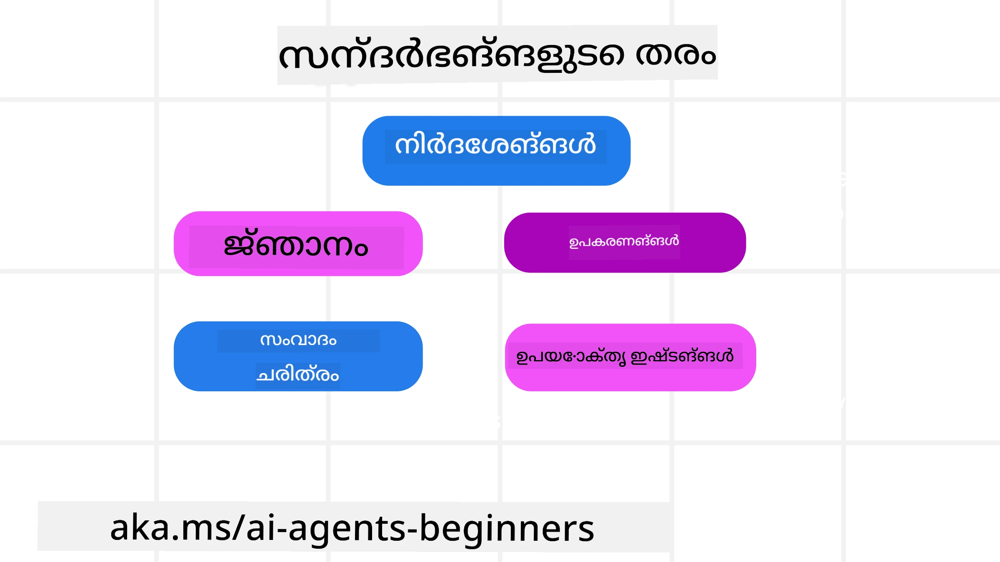
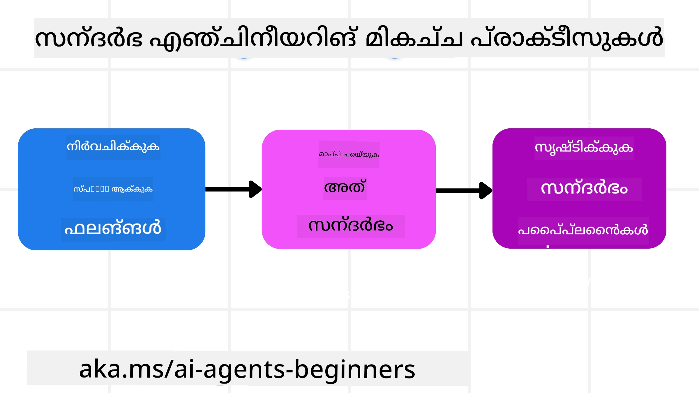

<!--
CO_OP_TRANSLATOR_METADATA:
{
  "original_hash": "cb7e50f471905ce6fdb92a30269a7a98",
  "translation_date": "2025-12-03T17:16:32+00:00",
  "source_file": "12-context-engineering/README.md",
  "language_code": "ml"
}
-->
# AI ഏജന്റുകൾക്കുള്ള കോൺടെക്സ്റ്റ് എഞ്ചിനീയറിംഗ്

> _(മുകളിൽ കാണുന്ന ചിത്രം ക്ലിക്ക് ചെയ്ത് ഈ പാഠത്തിന്റെ വീഡിയോ കാണുക)_

നിങ്ങൾ നിർമ്മിക്കുന്ന AI ഏജന്റിന്റെ പ്രയോഗത്തിന്റെ സങ്കീർണ്ണത മനസ്സിലാക്കുന്നത് ഒരു വിശ്വസനീയമായ ഏജന്റ് നിർമ്മിക്കാൻ നിർണായകമാണ്. പ്രോംപ്റ്റ് എഞ്ചിനീയറിംഗിന് അപ്പുറം സങ്കീർണ്ണമായ ആവശ്യങ്ങൾ പരിഹരിക്കാൻ വിവരങ്ങൾ ഫലപ്രദമായി കൈകാര്യം ചെയ്യുന്ന AI ഏജന്റുകൾ നിർമ്മിക്കേണ്ടതുണ്ട്.

ഈ പാഠത്തിൽ, കോൺടെക്സ്റ്റ് എഞ്ചിനീയറിംഗ് എന്താണെന്ന് അതിന്റെ AI ഏജന്റുകൾ നിർമ്മിക്കുന്നതിലെ പങ്ക് എന്താണെന്ന് നോക്കാം.

## പരിചയം

ഈ പാഠത്തിൽ ഉൾപ്പെടുന്നവ:

• **കോൺടെക്സ്റ്റ് എഞ്ചിനീയറിംഗ് എന്താണ്** എന്നതും ഇത് പ്രോംപ്റ്റ് എഞ്ചിനീയറിംഗിൽ നിന്ന് എങ്ങനെ വ്യത്യസ്തമാണ് എന്നതും.

• **ഫലപ്രദമായ കോൺടെക്സ്റ്റ് എഞ്ചിനീയറിംഗിനുള്ള തന്ത്രങ്ങൾ**, വിവരങ്ങൾ എഴുതുന്നത്, തിരഞ്ഞെടുക്കുന്നത്, ചുരുക്കുന്നത്, വേർതിരിക്കുന്നത് എന്നിവ ഉൾപ്പെടെ.

• **സാധാരണ കോൺടെക്സ്റ്റ് പരാജയങ്ങൾ** നിങ്ങളുടെ AI ഏജന്റിനെ തകർക്കാൻ കാരണമാകാം, അവ എങ്ങനെ പരിഹരിക്കാം.

## പഠന ലക്ഷ്യങ്ങൾ

ഈ പാഠം പൂർത്തിയാക്കിയ ശേഷം, നിങ്ങൾക്ക് മനസ്സിലാക്കാൻ കഴിയും:

• **കോൺടെക്സ്റ്റ് എഞ്ചിനീയറിംഗ് നിർവചിക്കുക** കൂടാതെ ഇത് പ്രോംപ്റ്റ് എഞ്ചിനീയറിംഗിൽ നിന്ന് എങ്ങനെ വ്യത്യസ്തമാണ് എന്ന് വ്യത്യാസപ്പെടുത്തുക.

• **കോൺടെക്സ്റ്റിന്റെ പ്രധാന ഘടകങ്ങൾ തിരിച്ചറിയുക** LLM പ്രയോഗങ്ങളിൽ.

• **കോൺടെക്സ്റ്റ് എഴുതുക, തിരഞ്ഞെടുക്കുക, ചുരുക്കുക, വേർതിരിക്കുക എന്നതിന്റെ തന്ത്രങ്ങൾ പ്രയോഗിക്കുക** ഏജന്റിന്റെ പ്രകടനം മെച്ചപ്പെടുത്താൻ.

• **സാധാരണ കോൺടെക്സ്റ്റ് പരാജയങ്ങൾ തിരിച്ചറിയുക** പോലുള്ള വിഷബാധ, ശ്രദ്ധചലനം, ആശയക്കുഴപ്പം, സംഘർഷം എന്നിവയും അവ പരിഹരിക്കാൻ മാർഗങ്ങൾ നടപ്പിലാക്കുക.

## കോൺടെക്സ്റ്റ് എഞ്ചിനീയറിംഗ് എന്താണ്?

AI ഏജന്റുകൾക്കായി, കോൺടെക്സ്റ്റ് AI ഏജന്റിന്റെ പ്രവർത്തനങ്ങൾ നിർവഹിക്കാൻ നിർണായകമാണ്. AI ഏജന്റിന് അടുത്ത ഘട്ടം പൂർത്തിയാക്കാൻ ആവശ്യമായ ശരിയായ വിവരങ്ങൾ ലഭ്യമാക്കുന്ന പ്രക്രിയയാണ് കോൺടെക്സ്റ്റ് എഞ്ചിനീയറിംഗ്. കോൺടെക്സ്റ്റ് വിൻഡോയുടെ വലുപ്പം പരിമിതമാണ്, അതിനാൽ ഏജന്റ് നിർമ്മാതാക്കളായ ഞങ്ങൾ ഈ കോൺടെക്സ്റ്റ് വിൻഡോയിൽ വിവരങ്ങൾ ചേർക്കുക, നീക്കംചെയ്യുക, ചുരുക്കുക എന്നിവ കൈകാര്യം ചെയ്യുന്നതിനുള്ള സിസ്റ്റങ്ങളും പ്രക്രിയകളും നിർമ്മിക്കേണ്ടതുണ്ട്.

### പ്രോംപ്റ്റ് എഞ്ചിനീയറിംഗ് vs കോൺടെക്സ്റ്റ് എഞ്ചിനീയറിംഗ്

പ്രോംപ്റ്റ് എഞ്ചിനീയറിംഗ് AI ഏജന്റുകളെ ഒരു നിശ്ചിത നിയമങ്ങളുടെ സെറ്റിൽ ഫലപ്രദമായി നയിക്കുന്നതിന് ഒരു സ്റ്റാറ്റിക് നിർദ്ദേശങ്ങളുടെ സെറ്റിൽ കേന്ദ്രീകരിക്കുന്നു. കോൺടെക്സ്റ്റ് എഞ്ചിനീയറിംഗ് ഒരു ഡൈനാമിക് വിവരങ്ങളുടെ സെറ്റ് എങ്ങനെ കൈകാര്യം ചെയ്യാം എന്നതിനെക്കുറിച്ചാണ്, പ്രാരംഭ പ്രോംപ്റ്റ് ഉൾപ്പെടെ, AI ഏജന്റിന് ആവശ്യമായ വിവരങ്ങൾ സമയത്തിനൊപ്പം ലഭ്യമാക്കാൻ. ഈ പ്രക്രിയ ആവർത്തനയോഗ്യവും വിശ്വസനീയവുമാക്കുക എന്നതാണ് കോൺടെക്സ്റ്റ് എഞ്ചിനീയറിംഗിന്റെ പ്രധാന ആശയം.

### കോൺടെക്സ്റ്റിന്റെ തരം

കോൺടെക്സ്റ്റ് ഒരു കാര്യമായി മാത്രം കാണരുത്. AI ഏജന്റിന് ആവശ്യമായ വിവരങ്ങൾ വിവിധ സ്രോതസ്സുകളിൽ നിന്ന് വരാം, ഈ സ്രോതസ്സുകൾ ഏജന്റിന് ലഭ്യമാക്കുന്നത് നമ്മുടെ ഉത്തരവാദിത്തമാണ്:

AI ഏജന്റിന് കൈകാര്യം ചെയ്യേണ്ട കോൺടെക്സ്റ്റിന്റെ തരം:

• **നിർദ്ദേശങ്ങൾ:** ഇവ ഏജന്റിന്റെ "നിയമങ്ങൾ" പോലെയാണ് – പ്രോംപ്റ്റുകൾ, സിസ്റ്റം സന്ദേശങ്ങൾ, ഫ്യൂ ഷോട്ട് ഉദാഹരണങ്ങൾ (AI എന്തെങ്കിലും ചെയ്യുന്നത് കാണിക്കുന്നത്), ഉപയോഗിക്കാവുന്ന ഉപകരണങ്ങളുടെ വിവരണങ്ങൾ. ഇത് പ്രോംപ്റ്റ് എഞ്ചിനീയറിംഗിന്റെ ശ്രദ്ധ കോൺടെക്സ്റ്റ് എഞ്ചിനീയറിംഗുമായി സംയോജിപ്പിക്കുന്നിടമാണ്.

• **ജ്ഞാനം:** ഇത് വസ്തുതകൾ, ഡാറ്റാബേസുകളിൽ നിന്ന് തിരികെ ലഭിച്ച വിവരങ്ങൾ, അല്ലെങ്കിൽ ഏജന്റിന് സമാഹരിച്ച ദീർഘകാല ഓർമ്മകൾ എന്നിവ ഉൾക്കൊള്ളുന്നു. വ്യത്യസ്ത ജ്ഞാനശേഖരങ്ങളിലേക്കും ഡാറ്റാബേസുകളിലേക്കും ഏജന്റിന് ആക്സസ് ആവശ്യമുണ്ടെങ്കിൽ Retrieval Augmented Generation (RAG) സിസ്റ്റം സംയോജിപ്പിക്കുന്നതും ഇതിൽ ഉൾപ്പെടുന്നു.

• **ഉപകരണങ്ങൾ:** ഏജന്റിന് വിളിക്കാവുന്ന ബാഹ്യ ഫംഗ്ഷനുകളുടെ, APIകളുടെ, MCP സെർവറുകളുടെ നിർവചനങ്ങൾ, അവ ഉപയോഗിച്ച് ലഭിക്കുന്ന ഫീഡ്ബാക്ക് (ഫലങ്ങൾ) എന്നിവ.

• **സംഭാഷണ ചരിത്രം:** ഉപയോക്താവുമായി നടക്കുന്ന സംഭാഷണം. സമയം കടന്നുപോകുമ്പോൾ, ഈ സംഭാഷണങ്ങൾ ദൈർഘ്യമേറിയതും കൂടുതൽ സങ്കീർണ്ണവുമാകുന്നു, ഇത് കോൺടെക്സ്റ്റ് വിൻഡോയിൽ സ്ഥലം പിടിക്കുന്നു.

• **ഉപയോക്തൃ ഇഷ്ടങ്ങൾ:** ഉപയോക്താവിന്റെ ഇഷ്ടങ്ങൾ അല്ലെങ്കിൽ അവഗണനകൾക്കുറിച്ചുള്ള വിവരങ്ങൾ സമയത്തിനൊപ്പം പഠിക്കുന്നു. ഉപയോക്താവിനെ സഹായിക്കുന്നതിന് പ്രധാന തീരുമാനങ്ങൾ എടുക്കുമ്പോൾ ഇവ സംഭരിച്ച് വിളിക്കാവുന്നതാണ്.

## ഫലപ്രദമായ കോൺടെക്സ്റ്റ് എഞ്ചിനീയറിംഗിനുള്ള തന്ത്രങ്ങൾ

### പദ്ധതിയിടൽ തന്ത്രങ്ങൾ

നല്ല കോൺടെക്സ്റ്റ് എഞ്ചിനീയറിംഗ് നല്ല പദ്ധതിയിടലിൽ നിന്ന് ആരംഭിക്കുന്നു. കോൺടെക്സ്റ്റ് എഞ്ചിനീയറിംഗിന്റെ ആശയം എങ്ങനെ പ്രയോഗിക്കാമെന്ന് ചിന്തിക്കാൻ സഹായിക്കുന്ന സമീപനം ഇതാ:

1. **തെളിവായ ഫലങ്ങൾ നിർവചിക്കുക** - AI ഏജന്റുകൾക്ക് നൽകുന്ന പ്രവർത്തനങ്ങളുടെ ഫലങ്ങൾ വ്യക്തമായി നിർവചിക്കണം. "AI ഏജന്റ് തന്റെ പ്രവർത്തനം പൂർത്തിയാക്കിയ ശേഷം ലോകം എങ്ങനെയുണ്ടാകും?" എന്ന ചോദ്യത്തിന് ഉത്തരം നൽകുക. മറ്റൊരു വാക്കുകളിൽ, ഉപയോക്താവിന് AI ഏജന്റുമായി ഇടപഴകിയ ശേഷം എന്ത് മാറ്റം, വിവരം, അല്ലെങ്കിൽ പ്രതികരണം ഉണ്ടായിരിക്കണം.

2. **കോൺടെക്സ്റ്റ് മാപ്പ് ചെയ്യുക** - AI ഏജന്റിന്റെ ഫലങ്ങൾ നിങ്ങൾ നിർവചിച്ച ശേഷം, "ഈ പ്രവർത്തനം പൂർത്തിയാക്കാൻ AI ഏജന്റിന് എന്ത് വിവരങ്ങൾ ആവശ്യമുണ്ട്?" എന്ന ചോദ്യത്തിന് ഉത്തരം നൽകണം. ഈ രീതിയിൽ, ആ വിവരങ്ങൾ എവിടെ സ്ഥിതിചെയ്യുന്നുവെന്ന് മാപ്പ് ചെയ്യാൻ തുടങ്ങാം.

3. **കോൺടെക്സ്റ്റ് പൈപ്പ്‌ലൈൻ നിർമ്മിക്കുക** - ഇപ്പോൾ നിങ്ങൾക്ക് വിവരങ്ങൾ എവിടെയാണെന്ന് അറിയാം, "ഏജന്റിന് ഈ വിവരങ്ങൾ എങ്ങനെ ലഭിക്കും?" എന്ന ചോദ്യത്തിന് ഉത്തരം നൽകണം. ഇത് RAG, MCP സെർവറുകൾ ഉപയോഗം, മറ്റ് ഉപകരണങ്ങൾ എന്നിവ ഉൾപ്പെടെ വിവിധ രീതികളിൽ ചെയ്യാം.

### പ്രായോഗിക തന്ത്രങ്ങൾ

പദ്ധതിയിടൽ പ്രധാനമാണ്, പക്ഷേ വിവരങ്ങൾ ഞങ്ങളുടെ ഏജന്റിന്റെ കോൺടെക്സ്റ്റ് വിൻഡോയിൽ ഒഴുകാൻ തുടങ്ങുമ്പോൾ, അതിനെ കൈകാര്യം ചെയ്യാൻ പ്രായോഗിക തന്ത്രങ്ങൾ വേണം:

#### കോൺടെക്സ്റ്റ് കൈകാര്യം ചെയ്യൽ

ചില വിവരങ്ങൾ കോൺടെക്സ്റ്റ് വിൻഡോയിൽ സ്വയം ചേർക്കപ്പെടും, കോൺടെക്സ്റ്റ് എഞ്ചിനീയറിംഗ് ഈ വിവരങ്ങൾ കൂടുതൽ സജീവമായി കൈകാര്യം ചെയ്യുന്നതിനെക്കുറിച്ചാണ്, ഇത് ചില തന്ത്രങ്ങൾ ഉപയോഗിച്ച് ചെയ്യാം:

 1. **ഏജന്റ് സ്ക്രാച്ച്പാഡ്**
  ഈ സംവിധാനം AI ഏജന്റിന് ഒരു സെഷനിൽ നിലവിലെ പ്രവർത്തനങ്ങൾക്കും ഉപയോക്തൃ ഇടപെടലുകൾക്കും ബന്ധപ്പെട്ട വിവരങ്ങൾ കുറിപ്പുകൾ എടുക്കാൻ അനുവദിക്കുന്നു. ഇത് കോൺടെക്സ്റ്റ് വിൻഡോയ്ക്ക് പുറത്തുള്ള ഒരു ഫയലിൽ അല്ലെങ്കിൽ റൺടൈം ഒബ്ജക്റ്റിൽ നിലനിൽക്കണം, ഏജന്റിന് ഈ സെഷനിൽ ആവശ്യമെങ്കിൽ പിന്നീട് തിരികെ ലഭിക്കാൻ കഴിയുന്ന വിധത്തിൽ.

 2. **ഓർമ്മകൾ**
  സ്ക്രാച്ച്പാഡുകൾ ഒരു സെഷന്റെ കോൺടെക്സ്റ്റ് വിൻഡോയ്ക്ക് പുറത്തുള്ള വിവരങ്ങൾ കൈകാര്യം ചെയ്യുന്നതിന് നല്ലതാണ്. ഓർമ്മകൾ ഏജന്റുകൾക്ക് നിരവധി സെഷനുകളിൽ ബന്ധപ്പെട്ട വിവരങ്ങൾ സംഭരിക്കുകയും തിരികെ ലഭിക്കുകയും ചെയ്യാൻ അനുവദിക്കുന്നു. ഇതിൽ സംഗ്രഹങ്ങൾ, ഉപയോക്തൃ ഇഷ്ടങ്ങൾ, ഭാവിയിൽ മെച്ചപ്പെടുത്തലുകൾക്കുള്ള ഫീഡ്ബാക്ക് എന്നിവ ഉൾപ്പെടാം.

 3. **കോൺടെക്സ്റ്റ് ചുരുക്കൽ**
  കോൺടെക്സ്റ്റ് വിൻഡോ വളർന്ന് അതിന്റെ പരിധിയിലേക്ക് എത്തുമ്പോൾ, സംഗ്രഹനം, ട്രിമ്മിംഗ് തുടങ്ങിയ സാങ്കേതികതകൾ ഉപയോഗിക്കാം. ഇതിൽ ഏറ്റവും ബന്ധപ്പെട്ട വിവരങ്ങൾ മാത്രം സൂക്ഷിക്കുക അല്ലെങ്കിൽ പഴയ സന്ദേശങ്ങൾ നീക്കംചെയ്യുക ഉൾപ്പെടുന്നു.

 4. **മൾട്ടി-ഏജന്റ് സിസ്റ്റങ്ങൾ**
  മൾട്ടി-ഏജന്റ് സിസ്റ്റം വികസിപ്പിക്കുന്നത് കോൺടെക്സ്റ്റ് എഞ്ചിനീയറിംഗിന്റെ ഒരു രൂപമാണ്, കാരണം ഓരോ ഏജന്റിനും സ്വന്തം കോൺടെക്സ്റ്റ് വിൻഡോ ഉണ്ട്. ഈ കോൺടെക്സ്റ്റ് എങ്ങനെ പങ്കിടപ്പെടുന്നു, വ്യത്യസ്ത ഏജന്റുകൾക്ക് എങ്ങനെ കൈമാറുന്നു എന്നത് ഈ സിസ്റ്റങ്ങൾ നിർമ്മിക്കുമ്പോൾ മറ്റൊരു കാര്യമാണ്.

 5. **സാൻഡ്ബോക്സ് പരിസ്ഥിതികൾ**
  ഒരു ഏജന്റിന് ചില കോഡ് പ്രവർത്തിപ്പിക്കേണ്ടതുണ്ടെങ്കിൽ അല്ലെങ്കിൽ ഒരു ഡോക്യുമെന്റിൽ വലിയ തോതിലുള്ള വിവരങ്ങൾ പ്രോസസ്സ് ചെയ്യേണ്ടതുണ്ടെങ്കിൽ, ഫലങ്ങൾ പ്രോസസ്സ് ചെയ്യാൻ വലിയ തോതിലുള്ള ടോക്കണുകൾ ആവശ്യമാകും. ഇത് കോൺടെക്സ്റ്റ് വിൻഡോയിൽ മുഴുവൻ സംഭരിക്കുന്നതിന് പകരം, ഏജന്റിന് ഈ കോഡ് പ്രവർത്തിപ്പിക്കാൻ കഴിയുന്ന ഒരു സാൻഡ്ബോക്സ് പരിസ്ഥിതി ഉപയോഗിക്കാം, ഫലങ്ങളും മറ്റ് ബന്ധപ്പെട്ട വിവരങ്ങളും മാത്രം വായിക്കാൻ കഴിയും.

 6. **റൺടൈം സ്റ്റേറ്റ് ഒബ്ജക്റ്റുകൾ**
   ഏജന്റിന് ചില വിവരങ്ങൾ ലഭ്യമാക്കേണ്ട സാഹചര്യം കൈകാര്യം ചെയ്യാൻ വിവരങ്ങളുടെ കണ്ടെയ്‌നറുകൾ സൃഷ്ടിക്കുന്നതിലൂടെ ഇത് ചെയ്യുന്നു. ഒരു സങ്കീർണ്ണമായ പ്രവർത്തനത്തിന്, ഇത് ഏജന്റിന് ഓരോ ഉപപ്രവർത്തന ഘട്ടത്തിന്റെ ഫലങ്ങൾ ഘട്ടം ഘട്ടമായി സംഭരിക്കാൻ അനുവദിക്കും, കോൺടെക്സ്റ്റ് ആ ഉപപ്രവർത്തനവുമായി മാത്രം ബന്ധിപ്പിക്കപ്പെടാൻ അനുവദിക്കുന്നു.

### കോൺടെക്സ്റ്റ് എഞ്ചിനീയറിംഗിന്റെ ഉദാഹരണം

നമുക്ക് ഒരു AI ഏജന്റിനെ **"എനിക്ക് പാരീസിലേക്ക് ഒരു യാത്ര ബുക്ക് ചെയ്യുക."** എന്ന് പറയാം.

• പ്രോംപ്റ്റ് എഞ്ചിനീയറിംഗ് മാത്രം ഉപയോഗിക്കുന്ന ഒരു ലളിതമായ ഏജന്റ് **"ശരി, നിങ്ങൾക്ക് പാരീസിലേക്ക് പോകാൻ എപ്പോൾ ആഗ്രഹമുണ്ട്?"** എന്ന് പ്രതികരിക്കും. ഉപയോക്താവ് ചോദിച്ച സമയത്ത് നിങ്ങളുടെ നേരിട്ടുള്ള ചോദ്യമാത്രം പ്രോസസ്സ് ചെയ്തു.

• ഈ പാഠത്തിൽ ഉൾപ്പെടുത്തിയ കോൺടെക്സ്റ്റ് എഞ്ചിനീയറിംഗ് തന്ത്രങ്ങൾ ഉപയോഗിക്കുന്ന ഒരു ഏജന്റ് കൂടുതൽ കാര്യങ്ങൾ ചെയ്യും. പ്രതികരിക്കുന്നതിന് മുമ്പ്, അതിന്റെ സിസ്റ്റം:

  ◦ **നിങ്ങളുടെ കലണ്ടർ പരിശോധിക്കുക** ലഭ്യമായ തീയതികൾക്കായി (റിയൽ-ടൈം ഡാറ്റ തിരികെ ലഭിക്കുന്നു).

 ◦ **മുൻ യാത്രാ ഇഷ്ടങ്ങൾ ഓർമ്മിക്കുക** (ദീർഘകാല ഓർമ്മയിൽ നിന്ന്) നിങ്ങളുടെ ഇഷ്ടപ്പെട്ട എയർലൈൻ, ബജറ്റ്, അല്ലെങ്കിൽ നിങ്ങൾ നേരിട്ടുള്ള ഫ്ലൈറ്റുകൾ ഇഷ്ടപ്പെടുന്നോ എന്നതുപോലുള്ളവ.

 ◦ **ലഭ്യമായ ഉപകരണങ്ങൾ തിരിച്ചറിയുക** ഫ്ലൈറ്റ്, ഹോട്ടൽ ബുക്കിംഗിനായി.

- തുടർന്ന്, ഒരു ഉദാഹരണ പ്രതികരണം ഇങ്ങനെ ആയിരിക്കും: "ഹേ [നിങ്ങളുടെ പേര്]! ഞാൻ കാണുന്നു നിങ്ങൾ ഒക്ടോബറിന്റെ ആദ്യ ആഴ്ചയിൽ സ്വതന്ത്രരാണ്. [Preferred Airline] ഉപയോഗിച്ച് നിങ്ങളുടെ സാധാരണ ബജറ്റിൽ പാരീസിലേക്ക് നേരിട്ടുള്ള ഫ്ലൈറ്റുകൾ നോക്കണോ?". ഈ സമ്പന്നമായ, കോൺടെക്സ്റ്റ്-അവബോധമുള്ള പ്രതികരണം കോൺടെക്സ്റ്റ് എഞ്ചിനീയറിംഗിന്റെ ശക്തി കാണിക്കുന്നു.

## സാധാരണ കോൺടെക്സ്റ്റ് പരാജയങ്ങൾ

### കോൺടെക്സ്റ്റ് വിഷബാധ

**എന്താണ്:** LLM സൃഷ്ടിക്കുന്ന തെറ്റായ വിവരങ്ങൾ (ഹാലൂസിനേഷൻ) അല്ലെങ്കിൽ ഒരു പിഴവ് കോൺടെക്സ്റ്റിൽ പ്രവേശിച്ച് ആവർത്തിച്ച് പരാമർശിക്കപ്പെടുമ്പോൾ, ഏജന്റിന് അസാധ്യമായ ലക്ഷ്യങ്ങൾ പിന്തുടരാൻ അല്ലെങ്കിൽ അർത്ഥമില്ലാത്ത തന്ത്രങ്ങൾ വികസിപ്പിക്കാൻ കാരണമാകുന്നു.

**എന്ത് ചെയ്യണം:** **കോൺടെക്സ്റ്റ് സാധൂകരണം** കൂടാതെ **ക്വാറന്റൈൻ** നടപ്പിലാക്കുക. ദീർഘകാല ഓർമ്മയിൽ ചേർക്കുന്നതിന് മുമ്പ് വിവരങ്ങൾ സാധൂകരിക്കുക. സാധ്യതയുള്ള വിഷബാധ കണ്ടെത്തിയാൽ, മോശം വിവരങ്ങൾ വ്യാപിക്കാതിരിക്കാൻ പുതിയ കോൺടെക്സ്റ്റ് ത്രെഡുകൾ ആരംഭിക്കുക.

**യാത്രാ ബുക്കിംഗ് ഉദാഹരണം:** നിങ്ങളുടെ ഏജന്റ് **ഒരു ചെറിയ പ്രാദേശിക വിമാനത്താവളത്തിൽ നിന്ന് ഒരു ദൂര അന്താരാഷ്ട്ര നഗരത്തിലേക്ക് നേരിട്ടുള്ള ഫ്ലൈറ്റ്** സൃഷ്ടിക്കുന്നു, എന്നാൽ ആ വിമാനത്താവളം അന്താരാഷ്ട്ര ഫ്ലൈറ്റുകൾ വാഗ്ദാനം ചെയ്യുന്നില്ല. ഈ അസാധ്യമായ ഫ്ലൈറ്റ് വിശദാംശം കോൺടെക്സ്റ്റിൽ സംരക്ഷിക്കപ്പെടുന്നു. പിന്നീട്, നിങ്ങൾ ഏജന്റിനോട് ബുക്ക് ചെയ്യാൻ ആവശ്യപ്പെടുമ്പോൾ, ഈ അസാധ്യമായ റൂട്ടിനായി ടിക്കറ്റുകൾ കണ്ടെത്താൻ ശ്രമിച്ച് ആവർത്തിച്ച പിഴവുകൾക്ക് കാരണമാകുന്നു.

**പരിഹാരം:** **ഫ്ലൈറ്റ് നിലനിൽപ്പും റൂട്ടുകളും റിയൽ-ടൈം API ഉപയോഗിച്ച് സാധൂകരിക്കുന്ന** ഒരു ഘട്ടം നടപ്പിലാക്കുക, _കോൺടെക്സ്റ്റിൽ_ ഫ്ലൈറ്റ് വിശദാംശം ചേർക്കുന്നതിന് മുമ്പ്. സാധൂകരണം പരാജയപ്പെടുകയാണെങ്കിൽ, തെറ്റായ വിവരങ്ങൾ "ക്വാറന്റൈൻ" ചെയ്യപ്പെടുകയും കൂടുതൽ ഉപയോഗിക്കപ്പെടാതിരിക്കുകയും ചെയ്യും.

### കോൺടെക്സ്റ്റ് ശ്രദ്ധചലനം

**എന്താണ്:** കോൺടെക്സ്റ്റ് വളരെ വലുതാകുമ്പോൾ, മോഡൽ പരിശീലനത്തിനിടെ പഠിച്ചതിന് പകരം സമാഹരിച്ച ചരിത്രത്തിൽ കൂടുതൽ ശ്രദ്ധ കേന്ദ്രീകരിക്കുന്നു, ആവർത്തനാത്മകമായ അല്ലെങ്കിൽ ഉപകാരപ്രദമല്ലാത്ത പ്രവർത്തനങ്ങൾക്ക് കാരണമാകുന്നു. കോൺടെക്സ്റ്റ് വിൻഡോ നിറയുന്നതിന് മുമ്പ് മോഡലുകൾ പിഴവുകൾ ചെയ്യാൻ തുടങ്ങാം.

**എന്ത് ചെയ്യണം:** **കോൺടെക്സ്റ്റ് സംഗ്രഹനം** ഉപയോഗിക്കുക. സമാഹരിച്ച വിവരങ്ങൾ ആവർത്തനാത്മകമായ ചരിത്രം നീക്കംചെയ്ത് പ്രധാന വിശദാംശങ്ങൾ സൂക്ഷിച്ച് ചുരുക്കം സംഗ്രഹങ്ങളിലേക്ക് ഇടയ്ക്കിടെ ചുരുക്കുക. ഇത് "ഫോക്കസ്" "റീസെറ്റ്" ചെയ്യാൻ സഹായിക്കുന്നു.

**യാത്രാ ബുക്കിംഗ് ഉദാഹരണം:** നിങ്ങൾ നിരവധി സ്വപ്ന യാത്രാ ലക്ഷ്യസ്ഥാനങ്ങളെക്കുറിച്ച് ദീർഘകാലം ചർച്ച ചെയ്തിട്ടുണ്ട്, രണ്ട് വർഷം മുമ്പ് നിങ്ങളുടെ ബാക്ക്പാക്കിംഗ് യാത്രയുടെ വിശദമായ വിവരണം ഉൾപ്പെടെ. നിങ്ങൾ ഒടുവിൽ **"എനിക്ക് അടുത്ത മാസം ഒരു വിലകുറഞ്ഞ ഫ്ലൈറ്റ് കണ്ടെത്തുക"** എന്ന് ചോദിക്കുമ്പോൾ, ഏജന്റ് പഴയ, പ്രസക്തമല്ലാത്ത വിശദാംശങ്ങളിൽ കുടുങ്ങുകയും നിങ്ങളുടെ ബാക്ക്പാക്കിംഗ് ഉപകരണങ്ങൾ അല്ലെങ്കിൽ പഴയ യാത്രാ പദ്ധതികളെക്കുറിച്ച് വീണ്ടും ചോദിക്കുകയും ചെയ്യുന്നു, നിങ്ങളുടെ നിലവിലെ അഭ്യർത്ഥന അവഗണിക്കുന്നു.

**പരിഹാരം:** ഒരു നിശ്ചിത സംവാദങ്ങളുടെ എണ്ണം കഴിഞ്ഞാൽ അല്ലെങ്കിൽ കോൺടെക്സ്റ്റ് വളരെ വലുതാകുമ്പോൾ, ഏജന്റ് **സംഭാഷണത്തിന്റെ ഏറ്റവും പുതിയതും പ്രസക്തവുമായ ഭാഗങ്ങൾ സംഗ്രഹിക്കണം** – നിങ്ങളുടെ നിലവിലെ യാത്രാ തീയതികളിലും ലക്ഷ്യസ്ഥാനത്തിലും ശ്രദ്ധ കേന്ദ്രീകരിച്ച് – അടുത്ത LLM കോൾക്കായി ആ ചുരുക്കം സംഗ്രഹം ഉപയോഗിച്ച്, കുറവായ ചരിത്ര സംഭാഷണം ഒഴിവാക്കുക.

### കോൺടെക്സ്റ്റ് ആശയക്കുഴപ്പം

**എന്താണ്:** അനാവശ്യ കോൺടെക്സ്റ്റ്, പലപ്പോഴും വളരെ കൂടുതൽ ലഭ്യമായ ഉപകരണങ്ങളുടെ രൂപത്തിൽ, മോഡലിന് മോശം പ്രതികരണങ്ങൾ സൃഷ്ടിക്കാൻ അല്ലെങ്കിൽ പ്രസക്തമല്ലാത്ത ഉപകരണങ്ങൾ വിളിക്കാൻ കാരണമാകുന്നു. ചെറിയ മോഡലുകൾക്ക് ഇത് പ്രത്യേകിച്ച് സാധ്യതയുണ്ട്.

**എന്ത് ചെയ്യണം:** RAG സാങ്കേത

---

<!-- CO-OP TRANSLATOR DISCLAIMER START -->
**അസത്യവാദം**:  
ഈ രേഖ AI വിവർത്തന സേവനമായ [Co-op Translator](https://github.com/Azure/co-op-translator) ഉപയോഗിച്ച് വിവർത്തനം ചെയ്തതാണ്. കൃത്യതയ്ക്കായി ഞങ്ങൾ ശ്രമിക്കുന്നുവെങ്കിലും, ഓട്ടോമേറ്റഡ് വിവർത്തനങ്ങളിൽ പിശകുകൾ അല്ലെങ്കിൽ തെറ്റായ വിവരങ്ങൾ ഉണ്ടാകാൻ സാധ്യതയുണ്ട്. അതിന്റെ സ്വാഭാവിക ഭാഷയിലുള്ള മൗലിക രേഖ പ്രാമാണികമായ ഉറവിടമായി കണക്കാക്കണം. നിർണായകമായ വിവരങ്ങൾക്ക്, പ്രൊഫഷണൽ മനുഷ്യ വിവർത്തനം ശുപാർശ ചെയ്യുന്നു. ഈ വിവർത്തനം ഉപയോഗിക്കുന്നതിൽ നിന്നുണ്ടാകുന്ന തെറ്റിദ്ധാരണകൾക്കോ തെറ്റായ വ്യാഖ്യാനങ്ങൾക്കോ ഞങ്ങൾ ഉത്തരവാദികളല്ല.
<!-- CO-OP TRANSLATOR DISCLAIMER END -->