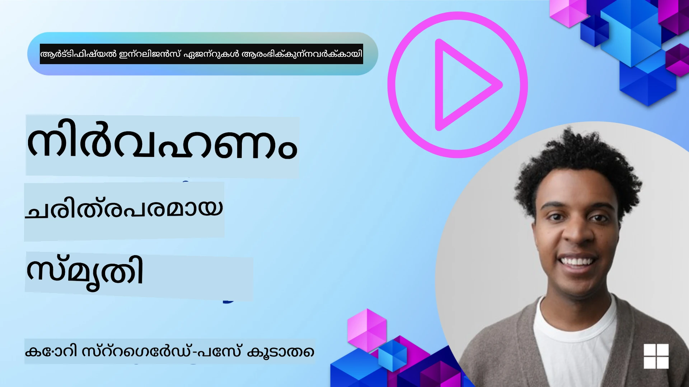

<!--
CO_OP_TRANSLATOR_METADATA:
{
  "original_hash": "a1d90991499ad697c4ad24decaf36968",
  "translation_date": "2025-12-09T13:08:47+00:00",
  "source_file": "13-agent-memory/README.md",
  "language_code": "ml"
}
-->
# AI ഏജന്റുമാർക്കുള്ള മെമ്മറി

AI ഏജന്റുമാർ സൃഷ്ടിക്കുന്നതിന്റെ പ്രത്യേക ഗുണങ്ങൾ ചർച്ച ചെയ്യുമ്പോൾ, പ്രധാനമായും രണ്ട് കാര്യങ്ങളാണ് ചർച്ച ചെയ്യപ്പെടുന്നത്: ടൂളുകൾ ഉപയോഗിച്ച് ടാസ്കുകൾ പൂർത്തിയാക്കാനുള്ള കഴിവും, സമയത്തിനൊപ്പം മെച്ചപ്പെടാനുള്ള കഴിവും. മെമ്മറിയാണ് സ്വയം മെച്ചപ്പെടുന്ന ഏജന്റുമാരെ സൃഷ്ടിക്കുന്നതിന്റെ അടിസ്ഥാനം, ഇത് നമ്മുടെ ഉപയോക്താക്കൾക്ക് മികച്ച അനുഭവങ്ങൾ സൃഷ്ടിക്കാൻ സഹായിക്കുന്നു.

ഈ പാഠത്തിൽ, AI ഏജന്റുമാർക്കുള്ള മെമ്മറി എന്താണെന്ന്, അതിനെ എങ്ങനെ നിയന്ത്രിക്കാമെന്നും, അത് നമ്മുടെ ആപ്ലിക്കേഷനുകൾക്ക് എങ്ങനെ പ്രയോജനകരമാക്കാമെന്നും നോക്കാം.

## പരിചയം

ഈ പാഠത്തിൽ ഉൾപ്പെടുന്നത്:

• **AI ഏജന്റ് മെമ്മറിയെ മനസ്സിലാക്കുക**: മെമ്മറി എന്താണെന്ന്, ഏജന്റുമാർക്ക് അത് എത്രത്തോളം പ്രധാനമാണെന്ന്.

• **മെമ്മറി നടപ്പിലാക്കൽ, സംഭരണം**: ഷോർട്ട്-ടേം, ലോങ്-ടേം മെമ്മറിയിൽ ശ്രദ്ധ കേന്ദ്രീകരിച്ച്, നിങ്ങളുടെ AI ഏജന്റുമാർക്ക് മെമ്മറി കഴിവുകൾ ചേർക്കാനുള്ള പ്രായോഗിക മാർഗങ്ങൾ.

• **AI ഏജന്റുമാരെ സ്വയം മെച്ചപ്പെടുത്തുക**: മെമ്മറി എങ്ങനെ പൂർവ്വ സംവാദങ്ങളിൽ നിന്ന് പഠിച്ച് ഏജന്റുമാരെ മെച്ചപ്പെടുത്തുന്നു.

## ലഭ്യമായ നടപ്പിലാക്കലുകൾ

ഈ പാഠത്തിൽ രണ്ട് സമഗ്രമായ നോട്ട്‌ബുക്ക് ട്യൂട്ടോറിയലുകൾ ഉൾപ്പെടുന്നു:

• **[13-agent-memory.ipynb](./13-agent-memory.ipynb)**: മെമ്മറി Mem0, Azure AI Search എന്നിവ ഉപയോഗിച്ച് Semantic Kernel ഫ്രെയിംവർക്കിൽ നടപ്പിലാക്കുന്നു.

• **[13-agent-memory-cognee.ipynb](./13-agent-memory-cognee.ipynb)**: Cognee ഉപയോഗിച്ച് ഘടനാപരമായ മെമ്മറി നടപ്പിലാക്കുന്നു, എംബെഡിംഗുകൾ പിന്തുണയ്ക്കുന്ന നോളജ് ഗ്രാഫ് സ്വയമേവ നിർമ്മിക്കുന്നു, ഗ്രാഫ് ദൃശ്യമാക്കുന്നു, ബുദ്ധിമാനായ റിട്രീവൽ.

## പഠന ലക്ഷ്യങ്ങൾ

ഈ പാഠം പൂർത്തിയാക്കിയ ശേഷം, നിങ്ങൾക്ക് അറിയാം:

• **AI ഏജന്റ് മെമ്മറിയുടെ വിവിധ തരം തിരിച്ചറിയുക**: വർക്കിംഗ്, ഷോർട്ട്-ടേം, ലോങ്-ടേം മെമ്മറി, പേഴ്സോണ, എപ്പിസോഡിക് മെമ്മറി പോലുള്ള പ്രത്യേക രൂപങ്ങൾ.

• **AI ഏജന്റുമാർക്കായി ഷോർട്ട്-ടേം, ലോങ്-ടേം മെമ്മറി നടപ്പിലാക്കുക, നിയന്ത്രിക്കുക**: Semantic Kernel ഫ്രെയിംവർക്കും, Mem0, Cognee, Whiteboard മെമ്മറി പോലുള്ള ടൂളുകളും Azure AI Search എന്നിവ ഉപയോഗിച്ച്.

• **സ്വയം മെച്ചപ്പെടുന്ന AI ഏജന്റുമാരുടെ അടിസ്ഥാന തത്വങ്ങൾ മനസ്സിലാക്കുക**: മെമ്മറി മാനേജ്മെന്റ് സിസ്റ്റങ്ങൾ തുടർച്ചയായ പഠനത്തിനും അനുയോജ്യമായ മാറ്റങ്ങൾക്കുമുള്ള സംഭാവന.

## AI ഏജന്റ് മെമ്മറിയെ മനസ്സിലാക്കുക

അടിസ്ഥാനത്തിൽ, **AI ഏജന്റുമാർക്കുള്ള മെമ്മറി എന്നത് അവയ്ക്ക് വിവരങ്ങൾ സൂക്ഷിക്കാനും ഓർമ്മിക്കാനും സഹായിക്കുന്ന സംവിധാനങ്ങളെയാണ് സൂചിപ്പിക്കുന്നത്**. ഇത് ഒരു സംവാദത്തിലെ പ്രത്യേക വിവരങ്ങൾ, ഉപയോക്തൃ മുൻഗണനകൾ, പൂർവ്വ പ്രവർത്തനങ്ങൾ, അല്ലെങ്കിൽ പഠിച്ച പാറ്റേണുകൾ എന്നിവയാകാം.

മെമ്മറിയില്ലാതെ, AI ആപ്ലിക്കേഷനുകൾക്ക് സ്റ്റേറ്റ്‌ലെസ് സ്വഭാവമുണ്ടാകും, അതായത് ഓരോ സംവാദവും പുനരാരംഭിക്കുമ്പോൾ പുതിയതായി തുടങ്ങും. ഇത് ഏജന്റ് മുൻഗണനകൾ അല്ലെങ്കിൽ മുൻവിവരങ്ങൾ "മറക്കുന്നത്" മൂലം ആവർത്തനപരവും നിരാശാജനകവുമായ ഉപയോക്തൃ അനുഭവത്തിലേക്ക് നയിക്കുന്നു.

### മെമ്മറി എന്തുകൊണ്ട് പ്രധാനമാണ്?

ഏജന്റിന്റെ ബുദ്ധിമുട്ട് അതിന്റെ പൂർവ്വവിവരങ്ങൾ ഓർമ്മിക്കുകയും ഉപയോഗിക്കുകയും ചെയ്യുന്ന കഴിവുമായി ബന്ധപ്പെട്ടിരിക്കുന്നു. മെമ്മറി ഏജന്റുമാരെ താഴെ പറയുന്നവയാക്കുന്നു:

• **ചിന്താശേഷിയുള്ളവ**: പൂർവ്വ പ്രവർത്തനങ്ങളിൽ നിന്ന് പഠിക്കുന്നു.

• **ഇന്ററാക്ടീവ്**: തുടർച്ചയായ സംവാദത്തിൽ കോൺടെക്സ്റ്റ് നിലനിർത്തുന്നു.

• **പ്രോആക്റ്റീവ്, റിയാക്ടീവ്**: ചരിത്ര ഡാറ്റയുടെ അടിസ്ഥാനത്തിൽ ആവശ്യങ്ങൾ മുൻകൂട്ടി കാണുന്നു അല്ലെങ്കിൽ അനുയോജ്യമായി പ്രതികരിക്കുന്നു.

• **സ്വതന്ത്രമായ പ്രവർത്തനം**: സംഭരിച്ച അറിവ് ഉപയോഗിച്ച് കൂടുതൽ സ്വതന്ത്രമായി പ്രവർത്തിക്കുന്നു.

മെമ്മറി നടപ്പിലാക്കുന്നതിന്റെ ലക്ഷ്യം ഏജന്റുമാരെ കൂടുതൽ **വിശ്വസനീയവും കഴിവുള്ളവരുമാക്കുക**.

### മെമ്മറിയുടെ തരം

#### വർക്കിംഗ് മെമ്മറി

ഇത് ഒരു ഏജന്റ് ഒരു ടാസ്ക് അല്ലെങ്കിൽ ചിന്താ പ്രക്രിയ നടത്തുമ്പോൾ ഉപയോഗിക്കുന്ന താൽക്കാലിക വിവരങ്ങൾ സൂക്ഷിക്കുന്നതിനെപ്പോലെയാണ്. 

**വർക്കിംഗ് മെമ്മറി ഉദാഹരണം**

ഒരു ട്രാവൽ ബുക്കിംഗ് ഏജന്റിൽ, "എനിക്ക് പാരിസിലേക്ക് ഒരു യാത്ര ബുക്ക് ചെയ്യണം" എന്ന ഉപയോക്തൃ അഭ്യർത്ഥന വർക്കിംഗ് മെമ്മറിയിൽ സൂക്ഷിക്കപ്പെടും.

#### ഷോർട്ട്-ടേം മെമ്മറി

ഒരു സംവാദത്തിന്റെ ദൈർഘ്യം മുഴുവൻ വിവരങ്ങൾ സൂക്ഷിക്കുന്നതാണ് ഇത്. 

**ഷോർട്ട്-ടേം മെമ്മറി ഉദാഹരണം**

"പാരിസിലേക്ക് ഒരു ഫ്ലൈറ്റ് എത്ര ചെലവാകും?" എന്ന ചോദ്യം ചോദിച്ച ശേഷം, "അവിടെ താമസസൗകര്യങ്ങൾ എന്തൊക്കെയുണ്ട്?" എന്ന് ചോദിക്കുമ്പോൾ, "അവിടെ" പാരിസിനെയാണ് സൂചിപ്പിക്കുന്നത് എന്ന് ഏജന്റ് മനസ്സിലാക്കും.

#### ലോങ്-ടേം മെമ്മറി

ഇത് നിരവധി സംവാദങ്ങൾക്കോ സെഷനുകൾക്കോ മുകളിൽ നിലനിൽക്കുന്ന വിവരങ്ങളാണ്. 

**ലോങ്-ടേം മെമ്മറി ഉദാഹരണം**

"ബെൻ സ്കീയിംഗും ഔട്ട്ഡോർ ആക്റ്റിവിറ്റികളും ഇഷ്ടപ്പെടുന്നു" എന്ന വിവരങ്ങൾ ഭാവി ട്രാവൽ പ്ലാനിംഗ് സെഷനുകളിൽ ഉപയോഗിക്കും.

#### പേഴ്സോണ മെമ്മറി

ഏജന്റിന് ഒരു സ്ഥിരമായ "പേഴ്സണാലിറ്റി" വികസിപ്പിക്കാൻ സഹായിക്കുന്നതാണ് ഇത്.

**പേഴ്സോണ മെമ്മറി ഉദാഹരണം**

ഒരു "എക്സ്പർട്ട് സ്കീ പ്ലാനർ" ആയി രൂപകൽപ്പന ചെയ്ത ഏജന്റ്, അതിന്റെ പേഴ്സോണ മെമ്മറിയിലൂടെ ഈ റോളിൽ തുടർച്ചയായി പ്രവർത്തിക്കും.

#### എപ്പിസോഡിക് മെമ്മറി

കമ്പളമായ ടാസ്കുകൾക്കിടയിൽ ഏജന്റ് സ്വീകരിക്കുന്ന ചുവടുവയ്പ്പുകളുടെ ക്രമം സൂക്ഷിക്കുന്നു.

**എപ്പിസോഡിക് മെമ്മറി ഉദാഹരണം**

ഒരു ഫ്ലൈറ്റ് ബുക്ക് ചെയ്യാൻ ശ്രമിച്ചപ്പോൾ അത് ലഭ്യമല്ലാത്തതിനാൽ പരാജയപ്പെട്ടാൽ, ഏജന്റ് ഈ പരാജയം ഓർമ്മിച്ച് ഭാവി ശ്രമങ്ങളിൽ കൂടുതൽ വിവരങ്ങൾ നൽകും.

#### എൻറ്റിറ്റി മെമ്മറി

സംവാദങ്ങളിൽ നിന്ന് വ്യക്തികൾ, സ്ഥലങ്ങൾ, ഇവന്റുകൾ എന്നിവയെ ഓർമ്മിക്കുന്നു.

**എൻറ്റിറ്റി മെമ്മറി ഉദാഹരണം**

"പാരിസ്," "ഐഫൽ ടവർ," "Le Chat Noir റെസ്റ്റോറന്റിൽ ഡിന്നർ" എന്നിവയെ ഒരു സംവാദത്തിൽ നിന്ന് എക്സ്ട്രാക്റ്റ് ചെയ്യുക.

#### സ്ട്രക്ചർഡ് RAG (റിട്രീവൽ ഓഗ്മെന്റഡ് ജനറേഷൻ)

സ്ട്രക്ചർഡ് RAG വിവരങ്ങളുടെ ഘടന ഉപയോഗിച്ച് കൂടുതൽ കൃത്യതയുള്ള ഉത്തരങ്ങൾ നൽകുന്നു.

**സ്ട്രക്ചർഡ് RAG ഉദാഹരണം**

"ഞാൻ ചൊവ്വാഴ്ച പാരിസിലേക്ക് ബുക്ക് ചെയ്ത ഫ്ലൈറ്റ് എന്താണ്?" എന്ന ചോദ്യത്തിന് കൃത്യമായ ഉത്തരങ്ങൾ നൽകുന്നു.

## മെമ്മറി നടപ്പിലാക്കൽ, സംഭരണം

AI ഏജന്റുമാർക്കുള്ള മെമ്മറി നടപ്പിലാക്കൽ ഒരു സിസ്റ്റമാറ്റിക് പ്രക്രിയയാണ്.

### പ്രത്യേക മെമ്മറി ടൂളുകൾ

#### Mem0

Mem0 ഒരു സ്ഥിരമായ മെമ്മറി ലെയർ ആയി പ്രവർത്തിക്കുന്നു.

#### Cognee

Cognee ഒരു ഓപ്പൺ-സോഴ്‌സ് സെമാന്റിക് മെമ്മറിയാണ്, ഇത് നോളജ് ഗ്രാഫുകളായി ഡാറ്റ മാറ്റുന്നു.

### RAG ഉപയോഗിച്ച് മെമ്മറി സംഭരണം

Azure AI Search പോലുള്ള സേവനങ്ങൾ മെമ്മറി സംഭരിക്കാനും റിട്രീവ് ചെയ്യാനും ഉപയോഗിക്കാം.

## AI ഏജന്റുമാരെ സ്വയം മെച്ചപ്പെടുത്തുക

ഒരു "നോളജ് ഏജന്റ്" ഉപയോഗിച്ച് സ്വയം മെച്ചപ്പെടുന്ന ഏജന്റുമാരെ സൃഷ്ടിക്കാം.

### മെമ്മറിയുടെ ഓപ്റ്റിമൈസേഷനുകൾ

• **ലേറ്റൻസി മാനേജ്മെന്റ്**: വേഗതയും ചെലവും നിയന്ത്രിക്കുക.

• **നോളജ് ബേസ് മെയിന്റനൻസ്**: കുറച്ച് ഉപയോഗിക്കുന്ന വിവരങ്ങൾ "തണുത്ത സംഭരണത്തിൽ" മാറ്റുക.

## ഏജന്റ് മെമ്മറിയെ കുറിച്ച് കൂടുതൽ ചോദ്യങ്ങളുണ്ടോ?

[Azure AI Foundry Discord](https://aka.ms/ai-agents/discord) ചേരുക, മറ്റ് പഠിതാക്കളുമായി ചർച്ച ചെയ്യുക, ഓഫീസ് മണിക്കൂറുകളിൽ പങ്കെടുക്കുക, നിങ്ങളുടെ AI ഏജന്റുമാരുടെ ചോദ്യങ്ങൾക്ക് ഉത്തരം നേടുക.

---

<!-- CO-OP TRANSLATOR DISCLAIMER START -->
**അസത്യവാദം**:  
ഈ രേഖ AI വിവർത്തന സേവനമായ [Co-op Translator](https://github.com/Azure/co-op-translator) ഉപയോഗിച്ച് വിവർത്തനം ചെയ്തതാണ്. ഞങ്ങൾ കൃത്യതയ്ക്കായി ശ്രമിക്കുന്നുവെങ്കിലും, ഓട്ടോമേറ്റഡ് വിവർത്തനങ്ങളിൽ പിശകുകൾ അല്ലെങ്കിൽ തെറ്റായ വിവരങ്ങൾ ഉണ്ടാകാൻ സാധ്യതയുണ്ട്. അതിന്റെ സ്വാഭാവിക ഭാഷയിലുള്ള മൗലിക രേഖയാണ് വിശ്വസനീയമായ ഉറവിടമായി കണക്കാക്കേണ്ടത്. നിർണായകമായ വിവരങ്ങൾക്ക്, പ്രൊഫഷണൽ മനുഷ്യ വിവർത്തനം ശുപാർശ ചെയ്യുന്നു. ഈ വിവർത്തനം ഉപയോഗിക്കുന്നതിൽ നിന്നുണ്ടാകുന്ന തെറ്റിദ്ധാരണകൾക്കോ തെറ്റായ വ്യാഖ്യാനങ്ങൾക്കോ ഞങ്ങൾ ഉത്തരവാദികളല്ല.
<!-- CO-OP TRANSLATOR DISCLAIMER END -->