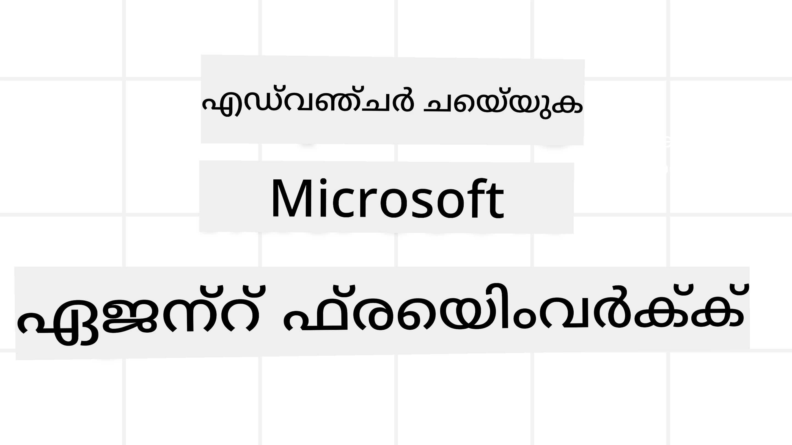
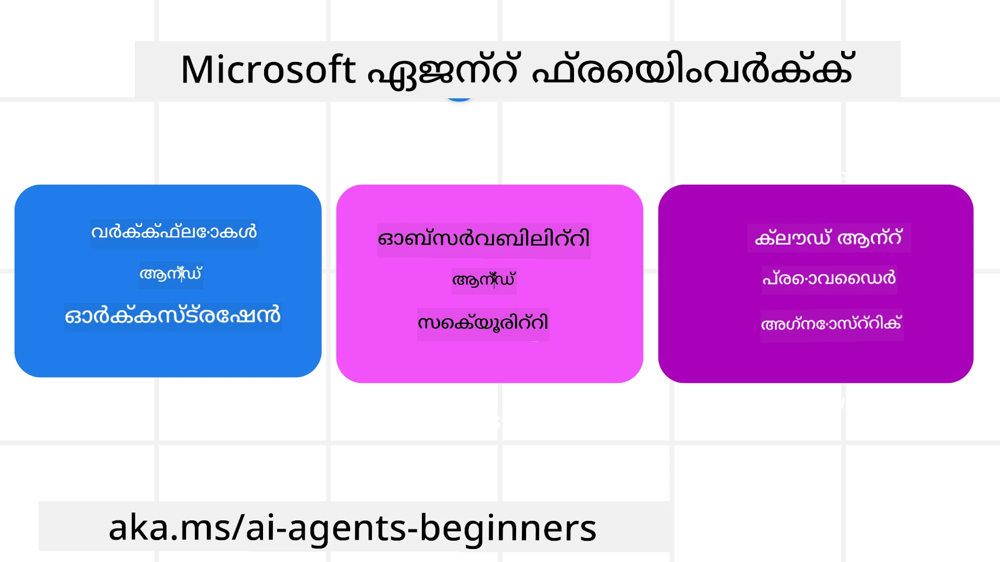
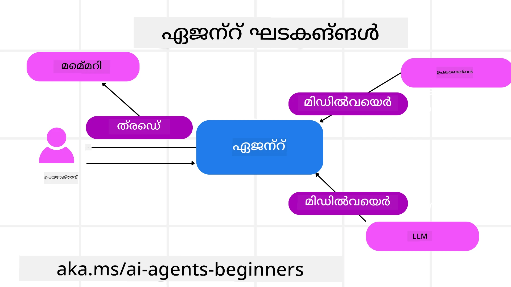

<!--
CO_OP_TRANSLATOR_METADATA:
{
  "original_hash": "19c4dab375acbc733855cc7f2f04edbc",
  "translation_date": "2025-12-03T16:31:58+00:00",
  "source_file": "14-microsoft-agent-framework/README.md",
  "language_code": "ml"
}
-->
# Microsoft Agent Framework പഠനം



### പരിചയം

ഈ പാഠത്തിൽ ഉൾപ്പെടുന്നവ:

- Microsoft Agent Framework മനസ്സിലാക്കുക: പ്രധാന സവിശേഷതകളും മൂല്യവും  
- Microsoft Agent Framework-ന്റെ പ്രധാന ആശയങ്ങൾ പരിശോധിക്കുക
- MAF-നെ Semantic Kernel, AutoGen എന്നിവയുമായി താരതമ്യം ചെയ്യുക: മൈഗ്രേഷൻ ഗൈഡ്

## പഠന ലക്ഷ്യങ്ങൾ

ഈ പാഠം പൂർത്തിയാക്കിയ ശേഷം, നിങ്ങൾക്ക്:

- Microsoft Agent Framework ഉപയോഗിച്ച് പ്രൊഡക്ഷൻ റെഡി AI ഏജന്റുകൾ നിർമ്മിക്കാൻ കഴിയും
- Microsoft Agent Framework-ന്റെ പ്രധാന സവിശേഷതകൾ നിങ്ങളുടെ Agentic Use Cases-ലേക്ക് പ്രയോഗിക്കാൻ കഴിയും
- നിലവിലുള്ള Agentic ഫ്രെയിംവർക്കുകളും ടൂളുകളും മൈഗ്രേറ്റ് ചെയ്യാനും സംയോജിപ്പിക്കാനും കഴിയും  

## കോഡ് സാമ്പിളുകൾ 

[Microsoft Agent Framework (MAF)](https://aka.ms/ai-agents-beginners/agent-framewrok) കോഡ് സാമ്പിളുകൾ `xx-python-agent-framework` ഫയലുകളിലും `xx-dotnet-agent-framework` ഫയലുകളിലും ഈ റിപോസിറ്ററിയിൽ ലഭ്യമാണ്.

## Microsoft Agent Framework മനസ്സിലാക്കുക



[Microsoft Agent Framework (MAF)](https://aka.ms/ai-agents-beginners/agent-framewrok) Semantic Kernel, AutoGen എന്നിവയിൽ നിന്നുള്ള അനുഭവങ്ങളും പഠനങ്ങളും അടിസ്ഥാനമാക്കി നിർമ്മിച്ചിരിക്കുന്നു. ഇത് പ്രൊഡക്ഷൻ, ഗവേഷണ പരിസ്ഥിതികളിൽ കാണുന്ന വിവിധ ഏജന്റിക് ഉപയോഗ കേസുകൾ കൈകാര്യം ചെയ്യാൻ ആവശ്യമായ സൗകര്യങ്ങൾ നൽകുന്നു:

- **Sequential Agent orchestration** - ഘട്ടം ഘട്ടമായി പ്രവർത്തനങ്ങൾ ആവശ്യമുള്ള സാഹചര്യങ്ങളിൽ.
- **Concurrent orchestration** - ഏജന്റുകൾ ഒരേ സമയം പ്രവർത്തനങ്ങൾ പൂർത്തിയാക്കേണ്ട സാഹചര്യങ്ങളിൽ.
- **Group chat orchestration** - ഏജന്റുകൾ ഒരേ പ്രവർത്തനത്തിൽ സഹകരിക്കേണ്ട സാഹചര്യങ്ങളിൽ.
- **Handoff Orchestration** - ഉപപ്രവർത്തനങ്ങൾ പൂർത്തിയാക്കിയ ശേഷം ഏജന്റുകൾ പ്രവർത്തനം കൈമാറുന്ന സാഹചര്യങ്ങളിൽ.
- **Magnetic Orchestration** - മാനേജർ ഏജന്റ് പ്രവർത്തന പട്ടിക സൃഷ്ടിക്കുകയും മാറ്റുകയും ഉപഏജന്റുകളെ കോർഡിനേറ്റ് ചെയ്യുകയും ചെയ്യുന്ന സാഹചര്യങ്ങളിൽ.

AI ഏജന്റുകൾ പ്രൊഡക്ഷനിൽ എത്തിക്കാൻ, MAF ഉൾപ്പെടുത്തിയ സവിശേഷതകൾ:

- **Observability** - OpenTelemetry ഉപയോഗിച്ച് ഏജന്റിന്റെ എല്ലാ പ്രവർത്തനങ്ങളും Azure AI Foundry ഡാഷ്ബോർഡുകൾ വഴി നിരീക്ഷിക്കാൻ.
- **Security** - Azure AI Foundry-ൽ ഏജന്റുകൾ ഹോസ്റ്റ് ചെയ്യുന്നത്, റോളുകൾ അടിസ്ഥാനമാക്കിയുള്ള ആക്സസ്, സ്വകാര്യ ഡാറ്റ കൈകാര്യം, ബിൽറ്റ്-ഇൻ ഉള്ളടക്ക സുരക്ഷ എന്നിവ ഉൾപ്പെടുന്നു.
- **Durability** - ഏജന്റ് ത്രെഡുകളും വർക്ക്‌ഫ്ലോകളും പാസ്സ് ചെയ്യാനും, പുനരാരംഭിക്കാനും, പിഴവുകളിൽ നിന്ന് വീണ്ടെടുക്കാനും കഴിയും.
- **Control** - മനുഷ്യന്റെ ഇടപെടൽ ആവശ്യമായ പ്രവർത്തനങ്ങൾ മാനുവൽ അംഗീകാരം ആവശ്യപ്പെടുന്ന രീതിയിൽ.

Microsoft Agent Framework-ന്റെ മറ്റൊരു പ്രധാന ലക്ഷ്യം ഇന്ററോപ്പറബിലിറ്റിയാണ്:

- **Cloud-agnostic** - ഏജന്റുകൾ കണ്ടെയ്‌നറുകളിൽ, ഓൺ-പ്രെമിസിൽ, വിവിധ ക്ലൗഡുകളിൽ പ്രവർത്തിക്കാൻ കഴിയും.
- **Provider-agnostic** - Azure OpenAI, OpenAI എന്നിവ ഉൾപ്പെടെ നിങ്ങളുടെ ഇഷ്ടപ്പെട്ട SDK ഉപയോഗിച്ച് ഏജന്റുകൾ സൃഷ്ടിക്കാം.
- **Open Standards Integration** - Agent-to-Agent (A2A), Model Context Protocol (MCP) എന്നിവ ഉപയോഗിച്ച് മറ്റ് ഏജന്റുകളെയും ടൂളുകളെയും കണ്ടെത്താനും ഉപയോഗിക്കാനും കഴിയും.
- **Plugins and Connectors** - Microsoft Fabric, SharePoint, Pinecone, Qdrant എന്നിവ പോലുള്ള ഡാറ്റയും മെമ്മറി സേവനങ്ങളുമായി ബന്ധങ്ങൾ സ്ഥാപിക്കാം.

ഇപ്പോൾ Microsoft Agent Framework-ന്റെ പ്രധാന ആശയങ്ങൾ എങ്ങനെ പ്രയോഗിക്കാമെന്ന് നോക്കാം.

## Microsoft Agent Framework-ന്റെ പ്രധാന ആശയങ്ങൾ

### ഏജന്റുകൾ



**ഏജന്റുകൾ സൃഷ്ടിക്കൽ**

ഏജന്റുകൾ സൃഷ്ടിക്കുന്നത് inference service (LLM Provider), AI ഏജന്റിന് പിന്തുടരാനുള്ള നിർദ്ദേശങ്ങൾ, `name` എന്നിവ നിർവചിച്ച് നടത്തുന്നു:

```python
agent = AzureOpenAIChatClient(credential=AzureCliCredential()).create_agent( instructions="You are good at recommending trips to customers based on their preferences.", name="TripRecommender" )
```

മുകളിൽ `Azure OpenAI` ഉപയോഗിച്ചിരിക്കുന്നു, എന്നാൽ `Azure AI Foundry Agent Service` ഉൾപ്പെടെ വിവിധ സേവനങ്ങൾ ഉപയോഗിച്ച് ഏജന്റുകൾ സൃഷ്ടിക്കാം:

```python
AzureAIAgentClient(async_credential=credential).create_agent( name="HelperAgent", instructions="You are a helpful assistant." ) as agent
```

OpenAI `Responses`, `ChatCompletion` APIs

```python
agent = OpenAIResponsesClient().create_agent( name="WeatherBot", instructions="You are a helpful weather assistant.", )
```

```python
agent = OpenAIChatClient().create_agent( name="HelpfulAssistant", instructions="You are a helpful assistant.", )
```

അല്ലെങ്കിൽ A2A പ്രോട്ടോക്കോൾ ഉപയോഗിച്ച് ദൂര ഏജന്റുകൾ:

```python
agent = A2AAgent( name=agent_card.name, description=agent_card.description, agent_card=agent_card, url="https://your-a2a-agent-host" )
```

**ഏജന്റുകൾ പ്രവർത്തിപ്പിക്കൽ**

ഏജന്റുകൾ `.run` അല്ലെങ്കിൽ `.run_stream` രീതികൾ ഉപയോഗിച്ച് പ്രവർത്തിപ്പിക്കുന്നു, non-streaming അല്ലെങ്കിൽ streaming responses ലഭിക്കാൻ.

```python
result = await agent.run("What are good places to visit in Amsterdam?")
print(result.text)
```

```python
async for update in agent.run_stream("What are the good places to visit in Amsterdam?"):
    if update.text:
        print(update.text, end="", flush=True)

```

ഏജന്റ് പ്രവർത്തനത്തിന് `max_tokens`, ഏജന്റിന് വിളിക്കാൻ കഴിയുന്ന `tools`, ഉപയോഗിക്കുന്ന `model` എന്നിവ പോലുള്ള പാരാമീറ്ററുകൾ ഇഷ്ടാനുസൃതമാക്കാൻ ഓപ്ഷനുകൾ ഉണ്ട്.

ഇത് ഉപയോക്താവിന്റെ പ്രവർത്തനം പൂർത്തിയാക്കാൻ പ്രത്യേക മോഡലുകൾ അല്ലെങ്കിൽ ടൂളുകൾ ആവശ്യമായ സാഹചര്യങ്ങളിൽ ഉപകാരപ്രദമാണ്.

**Tools**

ടൂളുകൾ ഏജന്റ് നിർവചിക്കുന്ന സമയത്ത് നിർവചിക്കാം:

```python
def get_attractions( location: Annotated[str, Field(description="The location to get the top tourist attractions for")], ) -> str: """Get the top tourist attractions for a given location.""" return f"The top attractions for {location} are." 


# നേരിട്ട് ഒരു ചാറ്റ് ഏജന്റ് സൃഷ്ടിക്കുമ്പോൾ

agent = ChatAgent( chat_client=OpenAIChatClient(), instructions="You are a helpful assistant", tools=[get_attractions]

```

അല്ലെങ്കിൽ ഏജന്റ് പ്രവർത്തിപ്പിക്കുന്ന സമയത്ത്:

```python

result1 = await agent.run( "What's the best place to visit in Seattle?", tools=[get_attractions] # ഈ റൺക്കായി മാത്രം ഉപകരണം നൽകുന്നു )
```

**Agent Threads**

Agent Threads മൾട്ടി-ടേൺ സംഭാഷണങ്ങൾ കൈകാര്യം ചെയ്യാൻ ഉപയോഗിക്കുന്നു. Threads സൃഷ്ടിക്കുന്നത്:

- `get_new_thread()` ഉപയോഗിച്ച്, ത്രെഡ് സമയത്തിനിടെ സംരക്ഷിക്കാനാകും.
- ഏജന്റ് പ്രവർത്തിപ്പിക്കുന്ന സമയത്ത് ത്രെഡ് സ്വയം സൃഷ്ടിച്ച്, നിലവിലെ പ്രവർത്തനത്തിനിടെ മാത്രം നിലനിൽക്കുന്നു.

ത്രെഡ് സൃഷ്ടിക്കാൻ കോഡ് ഇങ്ങനെ കാണും:

```python
# ഒരു പുതിയ ത്രെഡ് സൃഷ്ടിക്കുക.
thread = agent.get_new_thread() # ത്രെഡുമായി ഏജന്റ് പ്രവർത്തിപ്പിക്കുക.
response = await agent.run("Hello, I am here to help you book travel. Where would you like to go?", thread=thread)

```

തുടർന്ന് ത്രെഡ് സീരിയലൈസ് ചെയ്ത് പിന്നീട് ഉപയോഗിക്കാൻ സംഭരിക്കാം:

```python
# ഒരു പുതിയ ത്രെഡ് സൃഷ്ടിക്കുക.
thread = agent.get_new_thread() 

# ത്രെഡുമായി ഏജന്റ് പ്രവർത്തിപ്പിക്കുക.

response = await agent.run("Hello, how are you?", thread=thread) 

# സംഭരണത്തിനായി ത്രെഡ് സീരിയലൈസ് ചെയ്യുക.

serialized_thread = await thread.serialize() 

# സംഭരണത്തിൽ നിന്ന് ലോഡ് ചെയ്തതിന് ശേഷം ത്രെഡ് നില ഡീസീരിയലൈസ് ചെയ്യുക.

resumed_thread = await agent.deserialize_thread(serialized_thread)
```

**Agent Middleware**

Agents ഉപയോക്താവിന്റെ പ്രവർത്തനങ്ങൾ പൂർത്തിയാക്കാൻ ടൂളുകളുമായി LLMs-ലുമായി ഇടപെടുന്നു. ചില സാഹചര്യങ്ങളിൽ, ഈ ഇടപെടലുകൾക്കിടയിൽ പ്രവർത്തനങ്ങൾ നടത്താനോ ട്രാക്ക് ചെയ്യാനോ ആഗ്രഹിക്കാം. Agent middleware ഇത് സാധ്യമാക്കുന്നു:

*Function Middleware*

ഈ മിഡിൽവെയർ ഏജന്റും അത് വിളിക്കുന്ന function/tool-നും ഇടയിൽ പ്രവർത്തനം നടത്താൻ അനുവദിക്കുന്നു. ഉദാഹരണത്തിന്, function call-ൽ ചില ലോഗിംഗ് ചെയ്യാൻ ഇത് ഉപയോഗിക്കാം.

```python
async def logging_function_middleware(
    context: FunctionInvocationContext,
    next: Callable[[FunctionInvocationContext], Awaitable[None]],
) -> None:
    """Function middleware that logs function execution."""
    # പ്രീ-പ്രോസസ്സിംഗ്: ഫംഗ്ഷൻ പ്രവർത്തനത്തിന് മുമ്പ് ലോഗ് ചെയ്യുക
    print(f"[Function] Calling {context.function.name}")

    # അടുത്ത മിഡിൽവെയർ അല്ലെങ്കിൽ ഫംഗ്ഷൻ പ്രവർത്തനത്തിലേക്ക് തുടരുക
    await next(context)

    # പോസ്റ്റ്-പ്രോസസ്സിംഗ്: ഫംഗ്ഷൻ പ്രവർത്തനത്തിന് ശേഷം ലോഗ് ചെയ്യുക
    print(f"[Function] {context.function.name} completed")
```

*Chat Middleware*

ഈ മിഡിൽവെയർ ഏജന്റും LLM-ലും ഇടയിൽ ആവശ്യങ്ങൾക്കിടയിൽ പ്രവർത്തനം നടത്താനോ ലോഗ് ചെയ്യാനോ അനുവദിക്കുന്നു.

```python
async def logging_chat_middleware(
    context: ChatContext,
    next: Callable[[ChatContext], Awaitable[None]],
) -> None:
    """Chat middleware that logs AI interactions."""
    # പ്രീ-പ്രോസസ്സിംഗ്: AI കോൾ മുമ്പ് ലോഗ് ചെയ്യുക
    print(f"[Chat] Sending {len(context.messages)} messages to AI")

    # അടുത്ത മിഡിൽവെയർ അല്ലെങ്കിൽ AI സേവനത്തിലേക്ക് തുടരുക
    await next(context)

    # പോസ്റ്റ്-പ്രോസസ്സിംഗ്: AI പ്രതികരണത്തിന് ശേഷം ലോഗ് ചെയ്യുക
    print("[Chat] AI response received")

```

**Agent Memory**

`Agentic Memory` പാഠത്തിൽ ഉൾപ്പെടുത്തിയതുപോലെ, മെമ്മറി വ്യത്യസ്ത സാഹചര്യങ്ങളിൽ ഏജന്റിനെ പ്രവർത്തിപ്പിക്കാൻ സഹായിക്കുന്ന ഒരു പ്രധാന ഘടകമാണ്. MAF വിവിധ തരം മെമ്മറികൾ നൽകുന്നു:

*In-Memory Storage*

അപ്ലിക്കേഷൻ റൺടൈമിൽ ത്രെഡുകളിൽ സംഭരിക്കുന്ന മെമ്മറി.

```python
# ഒരു പുതിയ ത്രെഡ് സൃഷ്ടിക്കുക.
thread = agent.get_new_thread() # ത്രെഡുമായി ഏജന്റ് പ്രവർത്തിപ്പിക്കുക.
response = await agent.run("Hello, I am here to help you book travel. Where would you like to go?", thread=thread)
```

*Persistent Messages*

വിവിധ സെഷനുകളിൽ സംഭാഷണ ചരിത്രം സംഭരിക്കാൻ ഉപയോഗിക്കുന്ന മെമ്മറി. ഇത് `chat_message_store_factory` ഉപയോഗിച്ച് നിർവചിക്കുന്നു:

```python
from agent_framework import ChatMessageStore

# ഒരു കസ്റ്റം സന്ദേശ സ്റ്റോർ സൃഷ്ടിക്കുക
def create_message_store():
    return ChatMessageStore()

agent = ChatAgent(
    chat_client=OpenAIChatClient(),
    instructions="You are a Travel assistant.",
    chat_message_store_factory=create_message_store
)

```

*Dynamic Memory*

ഏജന്റുകൾ പ്രവർത്തിപ്പിക്കുന്നതിന് മുമ്പ് കോൺടെക്സ്റ്റിലേക്ക് ചേർക്കുന്ന മെമ്മറി. ഈ മെമ്മറികൾ mem0 പോലുള്ള ബാഹ്യ സേവനങ്ങളിൽ സംഭരിക്കാം:

```python
from agent_framework.mem0 import Mem0Provider

# മെമ്മറി ശേഷികളുടെ പുരോഗതിക്ക് Mem0 ഉപയോഗിക്കുന്നു
memory_provider = Mem0Provider(
    api_key="your-mem0-api-key",
    user_id="user_123",
    application_id="my_app"
)

agent = ChatAgent(
    chat_client=OpenAIChatClient(),
    instructions="You are a helpful assistant with memory.",
    context_providers=memory_provider
)

```

**Agent Observability**

Observability വിശ്വസനീയവും പരിപാലനക്ഷമവുമായ ഏജന്റിക് സിസ്റ്റങ്ങൾ നിർമ്മിക്കാൻ പ്രധാനമാണ്. MAF OpenTelemetry-യുമായി സംയോജിപ്പിച്ച് ട്രേസിംഗ്, മീറ്ററുകൾ എന്നിവ നൽകുന്നു.

```python
from agent_framework.observability import get_tracer, get_meter

tracer = get_tracer()
meter = get_meter()
with tracer.start_as_current_span("my_custom_span"):
    # എന്തെങ്കിലും ചെയ്യുക
    pass
counter = meter.create_counter("my_custom_counter")
counter.add(1, {"key": "value"})
```

### വർക്ക്‌ഫ്ലോകൾ

MAF മുൻകൂട്ടി നിർവചിച്ച ഘട്ടങ്ങൾ ഉൾക്കൊള്ളുന്ന വർക്ക്‌ഫ്ലോകൾ നൽകുന്നു, ഒരു പ്രവർത്തനം പൂർത്തിയാക്കാൻ AI ഏജന്റുകളെ ഘടകങ്ങളായി ഉൾക്കൊള്ളുന്നു.

വർക്ക്‌ഫ്ലോകൾ വിവിധ ഘടകങ്ങൾ ഉൾക്കൊള്ളുന്നു, ഇത് മികച്ച നിയന്ത്രണ പ്രവാഹം അനുവദിക്കുന്നു. വർക്ക്‌ഫ്ലോകൾ **മൾട്ടി-ഏജന്റ് orchestration**-നും **checkpointing**-നും workflow states സംരക്ഷിക്കാൻ സഹായിക്കുന്നു.

വർക്ക്‌ഫ്ലോയുടെ പ്രധാന ഘടകങ്ങൾ:

**Executors**

Executors ഇൻപുട്ട് സന്ദേശങ്ങൾ സ്വീകരിച്ച്, അവയ്ക്ക് നിയോഗിച്ച പ്രവർത്തനങ്ങൾ നിർവഹിച്ച്, ഔട്ട്പുട്ട് സന്ദേശങ്ങൾ ഉത്പാദിപ്പിക്കുന്നു. ഇത് workflow-നെ വലിയ പ്രവർത്തനം പൂർത്തിയാക്കാൻ മുന്നോട്ട് നയിക്കുന്നു. Executors AI ഏജന്റോ കസ്റ്റം ലജിക്കോ ആയിരിക്കും.

**Edges**

Edges workflow-യിലെ സന്ദേശങ്ങളുടെ പ്രവാഹം നിർവചിക്കാൻ ഉപയോഗിക്കുന്നു. ഇവ:

*Direct Edges* - Executors-കിടയിൽ ലളിതമായ one-to-one ബന്ധങ്ങൾ:

```python
from agent_framework import WorkflowBuilder

builder = WorkflowBuilder()
builder.add_edge(source_executor, target_executor)
builder.set_start_executor(source_executor)
workflow = builder.build()
```

*Conditional Edges* - നിർവചിച്ച സാഹചര്യങ്ങൾ നിറവേറ്റിയ ശേഷം സജീവമാകും. ഉദാഹരണത്തിന്, ഹോട്ടൽ റൂമുകൾ ലഭ്യമല്ലെങ്കിൽ, മറ്റൊരു ഓപ്ഷൻ നിർദ്ദേശിക്കാൻ.

*Switch-case Edges* - നിർവചിച്ച സാഹചര്യങ്ങൾ അടിസ്ഥാനമാക്കി സന്ദേശങ്ങൾ വ്യത്യസ്ത Executors-ലേക്ക് റൂട്ടുചെയ്യുന്നു.

*Fan-out Edges* - ഒരു സന്ദേശം പല ലക്ഷ്യങ്ങളിലേക്ക് അയയ്ക്കുന്നു.

*Fan-in Edges* - വ്യത്യസ്ത Executors-ൽ നിന്ന് പല സന്ദേശങ്ങളും ശേഖരിച്ച് ഒരു ലക്ഷ്യത്തിലേക്ക് അയയ്ക്കുന്നു.

**Events**

Workflow-കളിൽ observability മെച്ചപ്പെടുത്താൻ, MAF നിർവഹണത്തിനായി ബിൽറ്റ്-ഇൻ ഇവന്റുകൾ നൽകുന്നു:

- `WorkflowStartedEvent` - Workflow നിർവഹണം ആരംഭിക്കുന്നു
- `WorkflowOutputEvent` - Workflow ഔട്ട്പുട്ട് ഉത്പാദിപ്പിക്കുന്നു
- `WorkflowErrorEvent` - Workflow പിഴവ് നേരിടുന്നു
- `ExecutorInvokeEvent` - Executor പ്രോസസ്സിംഗ് ആരംഭിക്കുന്നു
- `ExecutorCompleteEvent` - Executor പ്രോസസ്സിംഗ് പൂർത്തിയാക്കുന്നു
- `RequestInfoEvent` - ഒരു അഭ്യർത്ഥന നൽകുന്നു

## Semantic Kernel, AutoGen എന്നിവയിൽ നിന്ന് മൈഗ്രേറ്റ് ചെയ്യുക

### MAF-നും Semantic Kernel-നും ഉള്ള വ്യത്യാസങ്ങൾ

**ഏജന്റ് സൃഷ്ടിക്കൽ ലളിതമാക്കുക**

Semantic Kernel ഓരോ ഏജന്റിനും Kernel instance സൃഷ്ടിക്കേണ്ടതുണ്ട്. MAF പ്രധാന പ്രൊവൈഡറുകൾക്കുള്ള extensions ഉപയോഗിച്ച് ലളിതമായ സമീപനം ഉപയോഗിക്കുന്നു.

```python
agent = AzureOpenAIChatClient(credential=AzureCliCredential()).create_agent( instructions="You are good at reccomending trips to customers based on their preferences.", name="TripRecommender" )
```

**Agent Thread Creation**

Semantic Kernel-ൽ Threads മാനുവലായി സൃഷ്ടിക്കണം. MAF-ൽ ഏജന്റിന് നേരിട്ട് Thread നിയോഗിക്കുന്നു.

```python
thread = agent.get_new_thread() # ത്രെഡുമായി ഏജന്റ് പ്രവർത്തിപ്പിക്കുക.
```

**Tool Registration**

Semantic Kernel-ൽ ടൂളുകൾ Kernel-ലേക്ക് രജിസ്റ്റർ ചെയ്യുകയും Kernel ഏജന്റിലേക്ക് പാസ്സ് ചെയ്യുകയും ചെയ്യുന്നു. MAF-ൽ ടൂളുകൾ നേരിട്ട് ഏജന്റ് സൃഷ്ടിക്കുന്ന സമയത്ത് രജിസ്റ്റർ ചെയ്യുന്നു.

```python
agent = ChatAgent( chat_client=OpenAIChatClient(), instructions="You are a helpful assistant", tools=[get_attractions]
```

### MAF-നും AutoGen-നും ഉള്ള വ്യത്യാസങ്ങൾ

**Teams vs Workflows**

AutoGen-ൽ `Teams` ഏജന്റുകളുമായി ഇവന്റ് ഡ്രിവൻ പ്രവർത്തനത്തിനുള്ള ഇവന്റ് ഘടനയാണ്. MAF `Workflows` ഉപയോഗിക്കുന്നു, ഇത് ഡാറ്റയെ Executors-ലേക്ക് ഗ്രാഫ് അടിസ്ഥാനമാക്കിയുള്ള ആർക്കിടെക്ചർ വഴി റൂട്ടുചെയ്യുന്നു.

**Tool Creation**

AutoGen `FunctionTool` ഉപയോഗിച്ച് ഏജന്റുകൾ വിളിക്കാൻ ഫംഗ്ഷനുകൾ റാപ്പ് ചെയ്യുന്നു. MAF @ai_function ഉപയോഗിക്കുന്നു, ഇത് സമാനമായി പ്രവർത്തിക്കുന്നു, എന്നാൽ ഓരോ ഫംഗ്ഷനിനും schemas സ്വയം നിർവചിക്കുന്നു.

**Agent Behaviour**

AutoGen-ൽ ഏജന്റുകൾ ഡിഫോൾട്ടായി single-turn agents ആണ്, `max_tool_iterations` ഉയർത്തിയാൽ മാത്രമേ multi-turn ആയിരിക്കൂ. MAF-ൽ `ChatAgent` ഡിഫോൾട്ടായി multi-turn ആണ്, അതായത് ഉപയോക്താവിന്റെ പ്രവർത്തനം പൂർത്തിയാകുന്നത് വരെ ടൂളുകൾ വിളിക്കുകയാണ്.

## കോഡ് സാമ്പിളുകൾ 

Microsoft Agent Framework-ന്റെ കോഡ് സാമ്പിളുകൾ `xx-python-agent-framework` ഫയലുകളിലും `xx-dotnet-agent-framework` ഫയലുകളിലും ഈ റിപോസിറ്ററിയിൽ ലഭ്യമാണ്.

## Microsoft Agent Framework-നെ കുറിച്ച് കൂടുതൽ ചോദ്യങ്ങളുണ്ടോ?

മറ്റുള്ള പഠിതാക്കളുമായി ചേരാനും, ഓഫീസ് മണിക്കൂറുകളിൽ പങ്കെടുക്കാനും, നിങ്ങളുടെ AI Agents ചോദ്യങ്ങൾക്ക് ഉത്തരം ലഭിക്കാനും [Azure AI Foundry Discord](https://aka.ms/ai-agents/discord) ചേരുക.

---

<!-- CO-OP TRANSLATOR DISCLAIMER START -->
**അറിയിപ്പ്**:  
ഈ രേഖ AI വിവർത്തന സേവനം [Co-op Translator](https://github.com/Azure/co-op-translator) ഉപയോഗിച്ച് വിവർത്തനം ചെയ്തതാണ്. ഞങ്ങൾ കൃത്യതയ്ക്കായി ശ്രമിക്കുന്നുവെങ്കിലും, ഓട്ടോമേറ്റഡ് വിവർത്തനങ്ങളിൽ പിഴവുകൾ അല്ലെങ്കിൽ തെറ്റായ വിവരങ്ങൾ ഉണ്ടാകാൻ സാധ്യതയുണ്ട്. അതിന്റെ സ്വഭാവ ഭാഷയിലുള്ള അസൽ രേഖയാണ് വിശ്വസനീയമായ ഉറവിടം എന്ന് പരിഗണിക്കേണ്ടത്. നിർണായകമായ വിവരങ്ങൾക്ക്, പ്രൊഫഷണൽ മനുഷ്യ വിവർത്തനം ശുപാർശ ചെയ്യുന്നു. ഈ വിവർത്തനം ഉപയോഗിച്ച് ഉണ്ടാകുന്ന തെറ്റിദ്ധാരണകൾ അല്ലെങ്കിൽ തെറ്റായ വ്യാഖ്യാനങ്ങൾക്കായി ഞങ്ങൾ ഉത്തരവാദികളല്ല.
<!-- CO-OP TRANSLATOR DISCLAIMER END -->