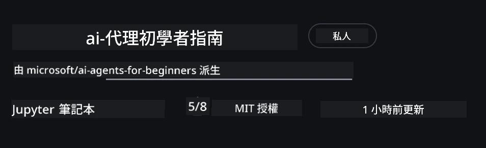
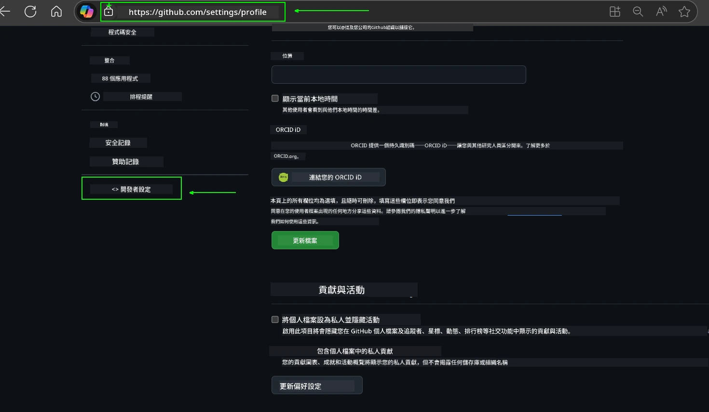
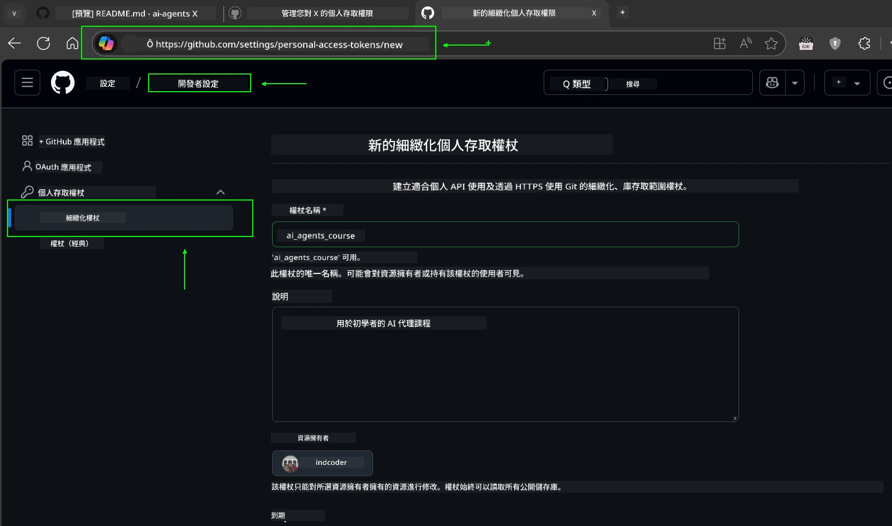
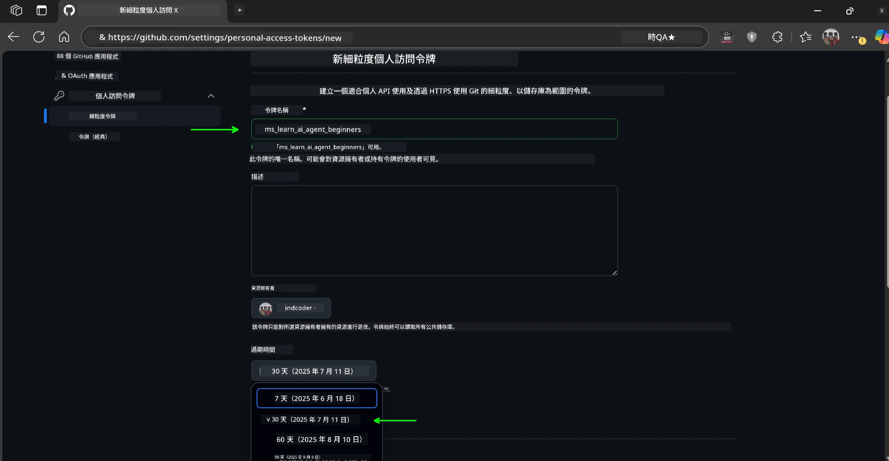
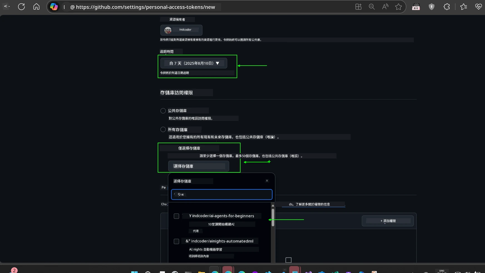
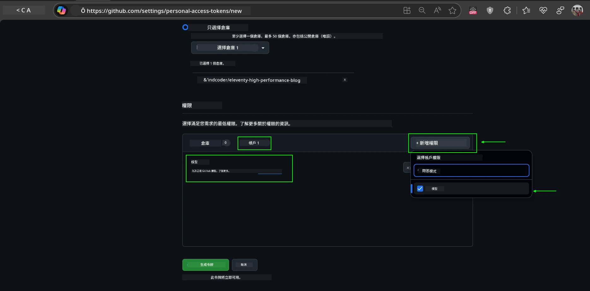
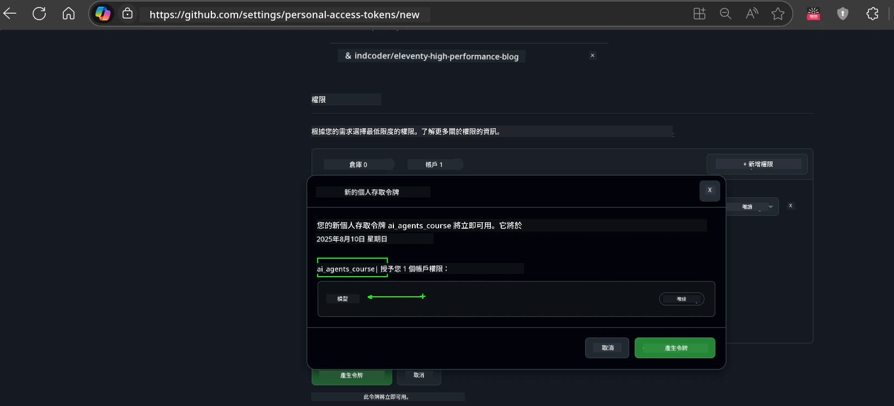
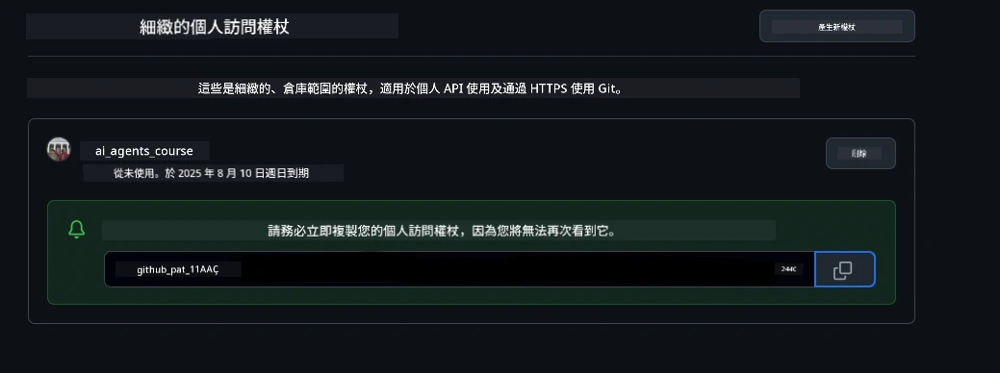
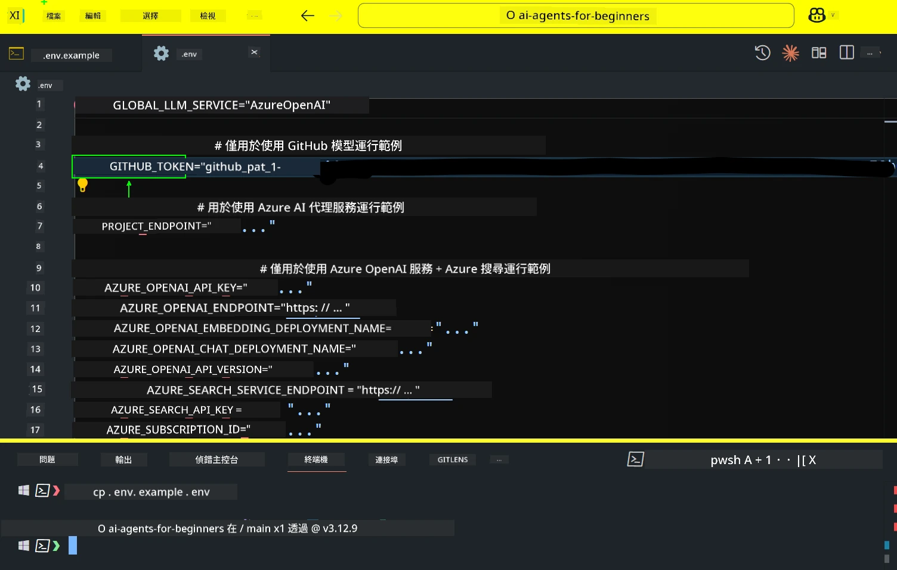
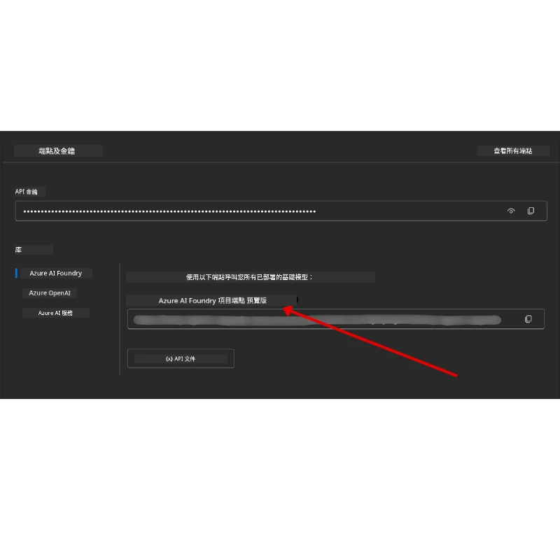

<!--
CO_OP_TRANSLATOR_METADATA:
{
  "original_hash": "63b1a8f6e840df15934935b728e569f0",
  "translation_date": "2025-12-03T13:55:49+00:00",
  "source_file": "00-course-setup/README.md",
  "language_code": "mo"
}
-->
# 課程設置

## 簡介

這節課將介紹如何運行本課程的代碼範例。

## 加入其他學員並獲得幫助

在開始複製您的倉庫之前，請加入 [AI Agents For Beginners Discord 頻道](https://aka.ms/ai-agents/discord)，以獲得設置幫助、課程相關問題的解答，或與其他學員交流。

## 複製或分叉此倉庫

首先，請複製或分叉 GitHub 倉庫。這將創建您自己的課程材料版本，方便您運行、測試和調整代碼！

您可以通過點擊以下鏈接來 <a href="https://github.com/microsoft/ai-agents-for-beginners/fork" target="_blank">分叉倉庫</a>

現在，您應該擁有以下鏈接中的課程分叉版本：



### 淺複製（建議用於工作坊 / Codespaces）

  >完整倉庫可能很大（約 3 GB），當您下載完整歷史記錄和所有文件時。如果您僅參加工作坊或僅需要部分課程文件夾，淺複製（或稀疏複製）可以通過截斷歷史記錄和/或跳過文件來避免大部分下載。

#### 快速淺複製 — 最小歷史記錄，所有文件

在以下命令中將 `<your-username>` 替換為您的分叉 URL（或如果您更喜歡，使用上游 URL）。

僅複製最新提交歷史記錄（小下載量）：

```bash|powershell
git clone --depth 1 https://github.com/<your-username>/ai-agents-for-beginners.git
```

複製特定分支：

```bash|powershell
git clone --depth 1 --branch <branch-name> https://github.com/<your-username>/ai-agents-for-beginners.git
```

#### 部分（稀疏）複製 — 最小文件 + 僅選定文件夾

此方法使用部分複製和稀疏檢出（需要 Git 2.25+，並建議使用支持部分複製的現代 Git）：

```bash|powershell
git clone --depth 1 --filter=blob:none --sparse https://github.com/<your-username>/ai-agents-for-beginners.git
```

進入倉庫文件夾：

```bash|powershell
cd ai-agents-for-beginners
```

然後指定您需要的文件夾（以下示例顯示兩個文件夾）：

```bash|powershell
git sparse-checkout set 00-course-setup 01-intro-to-ai-agents
```

複製並驗證文件後，如果您僅需要文件並希望釋放空間（無 git 歷史記錄），請刪除倉庫元數據（💀不可逆 — 您將失去所有 Git 功能：無提交、拉取、推送或歷史訪問）。

```bash
# zsh/bash
rm -rf .git
```

```powershell
# PowerShell
Remove-Item -Recurse -Force .git
```

#### 使用 GitHub Codespaces（建議避免本地大下載）

- 通過 [GitHub UI](https://github.com/codespaces) 為此倉庫創建新的 Codespace。

- 在新創建的 Codespace 的終端中，運行上述淺複製/稀疏複製命令，僅將您需要的課程文件夾帶入 Codespace 工作區。
- 可選：在 Codespaces 中複製後，移除 .git 以回收額外空間（請參考上述移除命令）。
- 注意：如果您更喜歡直接在 Codespaces 中打開倉庫（無需額外複製），請注意 Codespaces 將構建開發容器環境，可能仍會配置超出您需要的內容。在新 Codespace 中複製淺副本可讓您更好地控制磁盤使用。

#### 提示

- 如果您想編輯/提交，請始終替換分叉的克隆 URL。
- 如果您稍後需要更多歷史記錄或文件，可以提取它們或調整稀疏檢出以包含其他文件夾。

## 運行代碼

本課程提供一系列 Jupyter Notebooks，您可以通過它們獲得構建 AI Agents 的實踐經驗。

代碼範例使用以下方式：

**需要 GitHub 帳戶 - 免費**：

1) Semantic Kernel Agent Framework + GitHub Models Marketplace。標記為 (semantic-kernel.ipynb)
2) AutoGen Framework + GitHub Models Marketplace。標記為 (autogen.ipynb)

**需要 Azure 訂閱**：

3) Azure AI Foundry + Azure AI Agent Service。標記為 (azureaiagent.ipynb)

我們鼓勵您嘗試所有三種類型的範例，以了解哪一種最適合您。

無論您選擇哪種選項，都將決定您需要遵循的設置步驟：

## 要求

- Python 3.12+
  - **注意**：如果您尚未安裝 Python3.12，請確保安裝它。然後使用 python3.12 創建您的 venv，以確保從 requirements.txt 文件中安裝正確版本。
  
    >示例

    創建 Python venv 目錄：

    ```bash|powershell
    python -m venv venv
    ```

    然後激活 venv 環境：

    ```bash
    # zsh/bash
    source venv/bin/activate
    ```
  
    ```dos
    # Command Prompt for Windows
    venv\Scripts\activate
    ```

- .NET 10+: 對於使用 .NET 的代碼範例，請確保安裝 [.NET 10 SDK](https://dotnet.microsoft.com/download/dotnet/10.0) 或更高版本。然後檢查您安裝的 .NET SDK 版本：

    ```bash|powershell
    dotnet --list-sdks
    ```

- GitHub 帳戶 - 用於訪問 GitHub Models Marketplace
- Azure 訂閱 - 用於訪問 Azure AI Foundry
- Azure AI Foundry 帳戶 - 用於訪問 Azure AI Agent Service

我們在此倉庫的根目錄中包含了一個 `requirements.txt` 文件，其中包含運行代碼範例所需的所有 Python 包。

您可以在倉庫根目錄的終端中運行以下命令來安裝它們：

```bash|powershell
pip install -r requirements.txt
```

我們建議創建 Python 虛擬環境以避免任何衝突和問題。

## 設置 VSCode

確保您在 VSCode 中使用正確版本的 Python。


## 使用 GitHub Models 的範例設置 

### 步驟 1：獲取您的 GitHub 個人訪問令牌 (PAT)

本課程利用 GitHub Models Marketplace，提供免費訪問大型語言模型 (LLMs)，您將使用它們來構建 AI Agents。

要使用 GitHub Models，您需要創建 [GitHub 個人訪問令牌](https://docs.github.com/en/authentication/keeping-your-account-and-data-secure/managing-your-personal-access-tokens)。

您可以通過訪問您的 GitHub 帳戶中的 <a href="https://github.com/settings/personal-access-tokens" target="_blank">個人訪問令牌設置</a> 來完成此操作。

請遵循 [最小特權原則](https://docs.github.com/en/get-started/learning-to-code/storing-your-secrets-safely) 創建令牌。這意味著您應僅授予令牌運行本課程代碼範例所需的權限。

1. 在屏幕左側的 **開發者設置** 中選擇 `細粒度令牌` 選項。

   

   然後選擇 `生成新令牌`。

   

2. 為您的令牌輸入一個描述性名稱，反映其用途，方便以後識別。

    🔐 令牌有效期建議

    建議有效期：30 天
    為了更安全，您可以選擇更短的期限，例如 7 天 🛡️
    這是一個很好的方式來設置個人目標並完成課程，同時保持學習動力 🚀。

    

3. 將令牌的範圍限制為此倉庫的分叉。

    

4. 限制令牌的權限：在 **權限** 下，點擊 **帳戶** 標籤，然後點擊 "+ 添加權限" 按鈕。將出現下拉菜單。請搜索 **Models** 並勾選它。

    

5. 在生成令牌之前，請驗證所需的權限。 

6. 在生成令牌之前，請確保您準備好將令牌存儲在安全的地方，例如密碼管理器保險庫，因為生成後將無法再次查看。 

複製您剛剛創建的新令牌。現在，您需要將其添加到本課程包含的 `.env` 文件中。

### 步驟 2：創建您的 `.env` 文件

在終端中運行以下命令以創建 `.env` 文件。

```bash
# zsh/bash
cp .env.example .env
```

```powershell
# PowerShell
Copy-Item .env.example .env
```

這將複製示例文件並在您的目錄中創建 `.env`，您需要在其中填寫環境變量的值。

複製令牌後，使用您喜歡的文本編輯器打開 `.env` 文件，並將令牌粘貼到 `GITHUB_TOKEN` 字段中。



現在，您應該能夠運行本課程的代碼範例。

## 使用 Azure AI Foundry 和 Azure AI Agent Service 的範例設置

### 步驟 1：獲取您的 Azure 項目端點

請按照此處的步驟創建 Azure AI Foundry 中的 hub 和項目：[Hub 資源概述](https://learn.microsoft.com/azure/ai-foundry/concepts/ai-resources)

創建項目後，您需要獲取項目的連接字符串。

您可以通過訪問 Azure AI Foundry 入口網站中項目的 **概述** 頁面來完成此操作。



### 步驟 2：創建您的 `.env` 文件

在終端中運行以下命令以創建 `.env` 文件。

```bash
# zsh/bash
cp .env.example .env
```

```powershell
# PowerShell
Copy-Item .env.example .env
```

這將複製示例文件並在您的目錄中創建 `.env`，您需要在其中填寫環境變量的值。

複製令牌後，使用您喜歡的文本編輯器打開 `.env` 文件，並將令牌粘貼到 `PROJECT_ENDPOINT` 字段中。

### 步驟 3：登錄 Azure

作為安全最佳實踐，我們將使用 [無密鑰身份驗證](https://learn.microsoft.com/azure/developer/ai/keyless-connections?tabs=csharp%2Cazure-cli?WT.mc_id=academic-105485-koreyst) 登錄 Azure OpenAI，使用 Microsoft Entra ID。

接下來，打開終端並運行 `az login --use-device-code` 登錄您的 Azure 帳戶。

登錄後，在終端中選擇您的訂閱。

## 額外環境變量 - Azure Search 和 Azure OpenAI 

對於 Agentic RAG 課程 - 第 5 課 - 有使用 Azure Search 和 Azure OpenAI 的範例。

如果您想運行這些範例，您需要在 `.env` 文件中添加以下環境變量：

### 概述頁面（項目）

- `AZURE_SUBSCRIPTION_ID` - 在項目 **概述** 頁面的 **項目詳情** 中檢查。

- `AZURE_AI_PROJECT_NAME` - 查看項目 **概述** 頁面頂部。

- `AZURE_OPENAI_SERVICE` - 在 **概述** 頁面的 **包含的功能** 標籤中找到 **Azure OpenAI Service**。

### 管理中心

- `AZURE_OPENAI_RESOURCE_GROUP` - 在 **管理中心** 的 **概述** 頁面中，轉到 **項目屬性**。

- `GLOBAL_LLM_SERVICE` - 在 **連接的資源** 下，找到 **Azure AI Services** 連接名稱。如果未列出，請檢查 **Azure 入口網站** 中資源組下的 AI Services 資源名稱。

### 模型 + 端點頁面

- `AZURE_OPENAI_EMBEDDING_DEPLOYMENT_NAME` - 選擇您的嵌入模型（例如 `text-embedding-ada-002`），並記下模型詳情中的 **部署名稱**。

- `AZURE_OPENAI_CHAT_DEPLOYMENT_NAME` - 選擇您的聊天模型（例如 `gpt-4o-mini`），並記下模型詳情中的 **部署名稱**。

### Azure 入口網站

- `AZURE_OPENAI_ENDPOINT` - 查找 **Azure AI services**，點擊它，然後轉到 **資源管理**，**密鑰和端點**，向下滾動到 "Azure OpenAI endpoints"，並複製標記為 "Language APIs" 的端點。

- `AZURE_OPENAI_API_KEY` - 在同一屏幕中，複製密鑰 1 或密鑰 2。

- `AZURE_SEARCH_SERVICE_ENDPOINT` - 找到您的 **Azure AI Search** 資源，點擊它，然後查看 **概述**。

- `AZURE_SEARCH_API_KEY` - 然後轉到 **設置**，然後 **密鑰**，複製主密鑰或次密鑰。

### 外部網頁

- `AZURE_OPENAI_API_VERSION` - 訪問 [API 版本生命周期](https://learn.microsoft.com/azure/ai-services/openai/api-version-deprecation#latest-ga-api-release) 頁面，查看 **最新 GA API 發布**。

### 設置無密鑰身份驗證

我們將使用 Azure OpenAI 的無密鑰連接，而不是硬編碼您的憑據。為此，我們將導入 `DefaultAzureCredential`，稍後調用 `DefaultAzureCredential` 函數以獲取憑據。

```python
# Python
from azure.identity import DefaultAzureCredential, InteractiveBrowserCredential
```

## 卡住了嗎？
如果您在執行此設置時遇到任何問題，可以加入我們的 <a href="https://discord.gg/kzRShWzttr" target="_blank">Azure AI 社群 Discord</a> 或 <a href="https://github.com/microsoft/ai-agents-for-beginners/issues?WT.mc_id=academic-105485-koreyst" target="_blank">建立問題</a>。

## 下一課程

您現在已準備好運行本課程的代碼。祝您愉快地學習更多有關 AI Agents 的知識！

[AI Agents 及其使用案例介紹](../01-intro-to-ai-agents/README.md)

---

<!-- CO-OP TRANSLATOR DISCLAIMER START -->
**免責聲明**：  
此文件使用 AI 翻譯服務 [Co-op Translator](https://github.com/Azure/co-op-translator) 進行翻譯。我們致力於提供準確的翻譯，但請注意，自動翻譯可能包含錯誤或不準確之處。應以原文文件作為權威來源。對於關鍵資訊，建議尋求專業人工翻譯。我們對因使用此翻譯而引起的任何誤解或誤釋不承擔責任。
<!-- CO-OP TRANSLATOR DISCLAIMER END -->