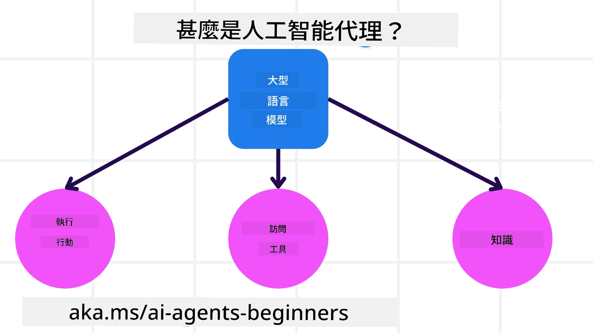
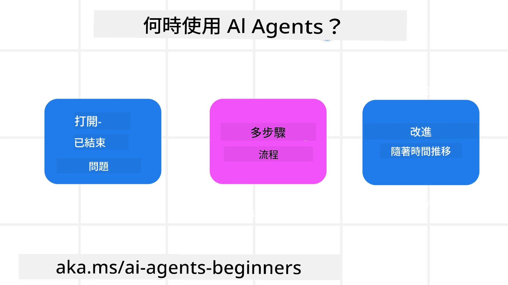

<!--
CO_OP_TRANSLATOR_METADATA:
{
  "original_hash": "cdd28bc00816d2773bb2b5968d782abc",
  "translation_date": "2025-11-11T10:56:29+00:00",
  "source_file": "01-intro-to-ai-agents/README.md",
  "language_code": "mo"
}
-->

> _(點擊上方圖片觀看本課程影片)_

# AI代理及其應用案例簡介

歡迎來到「AI代理入門」課程！本課程提供建立AI代理的基礎知識和應用範例。

加入 <a href="https://discord.gg/kzRShWzttr" target="_blank">Azure AI Discord社群</a>，與其他學員和AI代理開發者交流，並提出您對本課程的任何問題。

開始本課程之前，我們先來更深入了解什麼是AI代理，以及如何在我們構建的應用程式和工作流程中使用它們。

## 課程簡介

本課程涵蓋以下內容：

- 什麼是AI代理？有哪些不同類型的代理？
- 哪些應用案例最適合使用AI代理？它們如何幫助我們？
- 設計代理解決方案時的一些基本構建模塊。

## 學習目標
完成本課程後，您應能夠：

- 理解AI代理的概念及其與其他AI解決方案的不同之處。
- 高效應用AI代理。
- 為使用者和客戶設計高效的代理解決方案。

## 定義AI代理及其類型

### 什麼是AI代理？

AI代理是**系統**，它通過為**大型語言模型(LLMs)**提供**工具**和**知識**的訪問，來擴展其能力並使其能夠**執行操作**。

讓我們將這個定義拆解成幾個部分：

- **系統** - 重要的是要將代理視為由多個組件組成的系統，而不是單一組件。AI代理的基本組件包括：
  - **環境** - AI代理運行的定義空間。例如，如果我們有一個旅行預訂AI代理，環境可能是代理用來完成任務的旅行預訂系統。
  - **感測器** - 環境提供信息和反饋。AI代理使用感測器收集並解釋有關環境當前狀態的信息。在旅行預訂代理的例子中，旅行預訂系統可以提供酒店可用性或航班價格等信息。
  - **執行器** - 一旦AI代理接收到環境的當前狀態，代理會根據當前任務決定執行哪些操作來改變環境。對於旅行預訂代理，可能是為使用者預訂可用的房間。

**大型語言模型** - 代理的概念在LLMs出現之前就已存在。使用LLMs構建AI代理的優勢在於它們能夠解釋人類語言和數據。這種能力使LLMs能夠解釋環境信息並制定改變環境的計劃。

**執行操作** - 在AI代理系統之外，LLMs的操作通常僅限於根據使用者的提示生成內容或信息。在AI代理系統內，LLMs可以通過解釋使用者的請求並使用其環境中的工具來完成任務。

**工具訪問** - LLM可以訪問的工具由1)其運行的環境和2)AI代理的開發者定義。以旅行代理為例，代理的工具受限於預訂系統的操作，或者開發者可以限制代理的工具訪問範圍，例如僅限於航班。

**記憶+知識** - 記憶可以是短期的，存在於使用者與代理的對話上下文中。長期來看，除了環境提供的信息外，AI代理還可以從其他系統、服務、工具甚至其他代理中檢索知識。在旅行代理的例子中，這些知識可能是客戶數據庫中有關使用者旅行偏好的信息。

### 不同類型的代理

現在我們已經對AI代理有了一般定義，接下來我們來看看一些具體的代理類型，以及它們如何應用於旅行預訂AI代理。

| **代理類型**                | **描述**                                                                                                                       | **範例**                                                                                                                                                                                                                   |
| ----------------------------- | ------------------------------------------------------------------------------------------------------------------------------------- | ----------------------------------------------------------------------------------------------------------------------------------------------------------------------------------------------------------------------------- |
| **簡單反射代理**      | 根據預定義規則執行即時操作。                                                                                  | 旅行代理解釋電子郵件的上下文並將旅行投訴轉發給客戶服務部門。                                                                                                                          |
| **基於模型的反射代理** | 根據世界模型及其變化執行操作。                                                              | 旅行代理根據歷史價格數據的訪問權限，優先考慮價格顯著變化的路線。                                                                                                             |
| **基於目標的代理**         | 通過解釋目標並確定達成目標的行動來制定計劃。                                  | 旅行代理通過確定必要的旅行安排（汽車、公共交通、航班）從當前位置到目的地來預訂行程。                                                                                |
| **基於效用的代理**      | 考慮偏好並以數字方式權衡取捨以確定如何達成目標。                                               | 旅行代理在預訂旅行時通過權衡便利性與成本來最大化效用。                                                                                                                                          |
| **學習型代理**           | 通過回應反饋並相應地調整行動來隨時間改進。                                                        | 旅行代理通過使用客戶在旅行後調查中的反饋來改進未來的預訂。                                                                                                               |
| **分層代理**       | 包含多個代理的分層系統，高層代理將任務分解為子任務，由低層代理完成。 | 旅行代理通過將取消行程的任務分解為子任務（例如，取消特定預訂），並由低層代理完成，然後向高層代理報告。                                     |
| **多代理系統(MAS)** | 代理獨立完成任務，可以是合作的或競爭的。                                                           | 合作：多個代理預訂特定的旅行服務，例如酒店、航班和娛樂活動。競爭：多個代理管理並競爭共享的酒店預訂日曆，以將客戶預訂到酒店。 |

## 何時使用AI代理

在前面的部分中，我們使用旅行代理的案例來解釋不同類型的代理如何在旅行預訂的不同場景中使用。我們將在整個課程中繼續使用這個應用案例。

讓我們來看看AI代理最適合使用的應用案例類型：

- **開放式問題** - 允許LLM確定完成任務所需的步驟，因為這些步驟無法總是硬編碼到工作流程中。
- **多步驟流程** - 需要一定複雜度的任務，AI代理需要在多次交互中使用工具或信息，而不是一次性檢索。
- **隨時間改進** - 代理可以通過接收來自環境或使用者的反饋來改進，從而提供更好的效用。

我們在「構建可信的AI代理」課程中會更深入探討使用AI代理的考量。

## 代理解決方案的基礎

### 代理開發

設計AI代理系統的第一步是定義工具、操作和行為。在本課程中，我們專注於使用 **Azure AI Agent Service** 來定義代理。它提供以下功能：

- 選擇開放模型，例如OpenAI、Mistral和Llama
- 通過Tripadvisor等提供商使用授權數據
- 使用標準化的OpenAPI 3.0工具

### 代理模式

與LLM的通信是通過提示進行的。由於AI代理具有半自主性，並非總是可能或需要在環境變化後手動重新提示LLM。我們使用 **代理模式**，允許我們在多個步驟中以更具可擴展性的方式提示LLM。

本課程分為一些當前流行的代理模式。

### 代理框架

代理框架允許開發者通過代碼實現代理模式。這些框架提供模板、插件和工具，以促進更好的AI代理協作。這些優勢提供了更好的可觀察性和AI代理系統的故障排除能力。

在本課程中，我們將探索以研究為導向的AutoGen框架以及Semantic Kernel的生產就緒代理框架。

## 範例代碼

- Python: [代理框架](./code_samples/01-python-agent-framework.ipynb)
- .NET: [代理框架](./code_samples/01-dotnet-agent-framework.md)

## 有更多關於AI代理的問題？

加入 [Azure AI Foundry Discord](https://aka.ms/ai-agents/discord)，與其他學員交流，參加辦公時間並解答您的AI代理問題。

## 上一課程

[課程設置](../00-course-setup/README.md)

## 下一課程

[探索代理框架](../02-explore-agentic-frameworks/README.md)

---

<!-- CO-OP TRANSLATOR DISCLAIMER START -->
**免責聲明**：  
本文件已使用 AI 翻譯服務 [Co-op Translator](https://github.com/Azure/co-op-translator) 進行翻譯。儘管我們努力確保翻譯的準確性，但請注意，自動翻譯可能包含錯誤或不準確之處。原始文件的母語版本應被視為權威來源。對於關鍵信息，建議使用專業人工翻譯。我們對因使用此翻譯而產生的任何誤解或誤釋不承擔責任。
<!-- CO-OP TRANSLATOR DISCLAIMER END -->