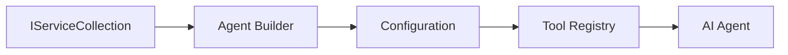

<!--
CO_OP_TRANSLATOR_METADATA:
{
  "original_hash": "bcc874e190347bd6a095aed56dc16de8",
  "translation_date": "2025-11-13T11:21:48+00:00",
  "source_file": "03-agentic-design-patterns/code_samples/03-dotnet-agent-framework.md",
  "language_code": "mo"
}
-->
# 🎨 使用 GitHub 模型的 Agentic 設計模式 (.NET)

## 📋 學習目標

此範例展示了使用 Microsoft Agent Framework 與 GitHub 模型整合在 .NET 中構建智能代理的企業級設計模式。您將學習專業的設計模式和架構方法，使代理具備生產就緒性、可維護性和可擴展性。

### 企業設計模式

- 🏭 **工廠模式**：使用依賴注入標準化代理創建
- 🔧 **建造者模式**：流暢的代理配置和設置
- 🧵 **線程安全模式**：並發對話管理
- 📋 **儲存庫模式**：有組織的工具和能力管理

## 🎯 .NET 特定架構優勢

### 企業功能

- **強類型**：編譯時驗證和 IntelliSense 支援
- **依賴注入**：內建 DI 容器整合
- **配置管理**：IConfiguration 和 Options 模式
- **Async/Await**：一流的異步編程支援

### 生產就緒模式

- **日誌整合**：ILogger 和結構化日誌支援
- **健康檢查**：內建監控和診斷
- **配置驗證**：使用數據註解的強類型
- **錯誤處理**：結構化異常管理

## 🔧 技術架構

### 核心 .NET 元件

- **Microsoft.Extensions.AI**：統一的 AI 服務抽象
- **Microsoft.Agents.AI**：企業代理編排框架
- **GitHub 模型整合**：高效能 API 客戶端模式
- **配置系統**：appsettings.json 和環境整合

### 設計模式實現



## 🏗️ 展示的企業模式

### 1. **創建型模式**

- **代理工廠**：集中化代理創建，配置一致
- **建造者模式**：流暢的 API 用於複雜代理配置
- **單例模式**：共享資源和配置管理
- **依賴注入**：鬆耦合和可測試性

### 2. **行為型模式**

- **策略模式**：可互換的工具執行策略
- **命令模式**：封裝的代理操作，支持撤銷/重做
- **觀察者模式**：事件驅動的代理生命週期管理
- **模板方法**：標準化的代理執行工作流程

### 3. **結構型模式**

- **適配器模式**：GitHub 模型 API 整合層
- **裝飾者模式**：代理能力增強
- **外觀模式**：簡化的代理交互介面
- **代理模式**：延遲加載和緩存以提升效能

## 📚 .NET 設計原則

### SOLID 原則

- **單一職責**：每個元件有一個明確的目的
- **開放/封閉**：可擴展而無需修改
- **里氏替換**：基於介面的工具實現
- **介面隔離**：專注且內聚的介面
- **依賴反轉**：依賴抽象而非具體實現

### 清晰架構

- **領域層**：核心代理和工具抽象
- **應用層**：代理編排和工作流程
- **基礎設施層**：GitHub 模型整合和外部服務
- **展示層**：用戶交互和響應格式化

## 🔒 企業考量

### 安全性

- **憑證管理**：使用 IConfiguration 安全處理 API 金鑰
- **輸入驗證**：強類型和數據註解驗證
- **輸出清理**：安全的響應處理和過濾
- **審計日誌**：全面的操作追蹤

### 效能

- **異步模式**：非阻塞 I/O 操作
- **連接池**：高效的 HTTP 客戶端管理
- **緩存**：響應緩存以提升效能
- **資源管理**：正確的資源釋放和清理模式

### 可擴展性

- **線程安全**：支持並發代理執行
- **資源池化**：高效的資源利用
- **負載管理**：速率限制和反壓處理
- **監控**：效能指標和健康檢查

## 🚀 生產部署

- **配置管理**：特定環境的設置
- **日誌策略**：結構化日誌，支持關聯 ID
- **錯誤處理**：全局異常處理，支持正確恢復
- **監控**：應用洞察和效能計數器
- **測試**：單元測試、整合測試和負載測試模式

準備好使用 .NET 構建企業級智能代理了嗎？讓我們設計一些穩健的架構吧！ 🏢✨

## 🚀 開始使用

### 先決條件

- [.NET 10 SDK](https://dotnet.microsoft.com/download/dotnet/10.0) 或更高版本
- [GitHub 模型 API 訪問令牌](https://docs.github.com/github-models/github-models-at-scale/using-your-own-api-keys-in-github-models)

### 必需的環境變數

```bash
# zsh/bash
export GH_TOKEN=<your_github_token>
export GH_ENDPOINT=https://models.github.ai/inference
export GH_MODEL_ID=openai/gpt-5-mini
```

```powershell
# PowerShell
$env:GH_TOKEN = "<your_github_token>"
$env:GH_ENDPOINT = "https://models.github.ai/inference"
$env:GH_MODEL_ID = "openai/gpt-5-mini"
```

### 範例代碼

要運行代碼範例，

```bash
# zsh/bash
chmod +x ./03-dotnet-agent-framework.cs
./03-dotnet-agent-framework.cs
```

或者使用 dotnet CLI：

```bash
dotnet run ./03-dotnet-agent-framework.cs
```

請參閱 [`03-dotnet-agent-framework.cs`](../../../../03-agentic-design-patterns/code_samples/03-dotnet-agent-framework.cs) 以獲取完整代碼。

```csharp
#!/usr/bin/dotnet run

#:package Microsoft.Extensions.AI@10.*
#:package Microsoft.Agents.AI.OpenAI@1.*-*

using System.ClientModel;
using System.ComponentModel;

using Microsoft.Agents.AI;
using Microsoft.Extensions.AI;

using OpenAI;

// Tool Function: Random Destination Generator
// This static method will be available to the agent as a callable tool
// The [Description] attribute helps the AI understand when to use this function
// This demonstrates how to create custom tools for AI agents
[Description("Provides a random vacation destination.")]
static string GetRandomDestination()
{
    // List of popular vacation destinations around the world
    // The agent will randomly select from these options
    var destinations = new List<string>
    {
        "Paris, France",
        "Tokyo, Japan",
        "New York City, USA",
        "Sydney, Australia",
        "Rome, Italy",
        "Barcelona, Spain",
        "Cape Town, South Africa",
        "Rio de Janeiro, Brazil",
        "Bangkok, Thailand",
        "Vancouver, Canada"
    };

    // Generate random index and return selected destination
    // Uses System.Random for simple random selection
    var random = new Random();
    int index = random.Next(destinations.Count);
    return destinations[index];
}

// Extract configuration from environment variables
// Retrieve the GitHub Models API endpoint, defaults to https://models.github.ai/inference if not specified
// Retrieve the model ID, defaults to openai/gpt-5-mini if not specified
// Retrieve the GitHub token for authentication, throws exception if not specified
var github_endpoint = Environment.GetEnvironmentVariable("GH_ENDPOINT") ?? "https://models.github.ai/inference";
var github_model_id = Environment.GetEnvironmentVariable("GH_MODEL_ID") ?? "openai/gpt-5-mini";
var github_token = Environment.GetEnvironmentVariable("GH_TOKEN") ?? throw new InvalidOperationException("GH_TOKEN is not set.");

// Configure OpenAI Client Options
// Create configuration options to point to GitHub Models endpoint
// This redirects OpenAI client calls to GitHub's model inference service
var openAIOptions = new OpenAIClientOptions()
{
    Endpoint = new Uri(github_endpoint)
};

// Initialize OpenAI Client with GitHub Models Configuration
// Create OpenAI client using GitHub token for authentication
// Configure it to use GitHub Models endpoint instead of OpenAI directly
var openAIClient = new OpenAIClient(new ApiKeyCredential(github_token), openAIOptions);

// Define Agent Identity and Comprehensive Instructions
// Agent name for identification and logging purposes
var AGENT_NAME = "TravelAgent";

// Detailed instructions that define the agent's personality, capabilities, and behavior
// This system prompt shapes how the agent responds and interacts with users
var AGENT_INSTRUCTIONS = """
You are a helpful AI Agent that can help plan vacations for customers.

Important: When users specify a destination, always plan for that location. Only suggest random destinations when the user hasn't specified a preference.

When the conversation begins, introduce yourself with this message:
"Hello! I'm your TravelAgent assistant. I can help plan vacations and suggest interesting destinations for you. Here are some things you can ask me:
1. Plan a day trip to a specific location
2. Suggest a random vacation destination
3. Find destinations with specific features (beaches, mountains, historical sites, etc.)
4. Plan an alternative trip if you don't like my first suggestion

What kind of trip would you like me to help you plan today?"

Always prioritize user preferences. If they mention a specific destination like "Bali" or "Paris," focus your planning on that location rather than suggesting alternatives.
""";

// Create AI Agent with Advanced Travel Planning Capabilities
// Initialize complete agent pipeline: OpenAI client → Chat client → AI agent
// Configure agent with name, detailed instructions, and available tools
// This demonstrates the .NET agent creation pattern with full configuration
AIAgent agent = openAIClient
    .GetChatClient(github_model_id)
    .CreateAIAgent(
        name: AGENT_NAME,
        instructions: AGENT_INSTRUCTIONS,
        tools: [AIFunctionFactory.Create(GetRandomDestination)]
    );

// Create New Conversation Thread for Context Management
// Initialize a new conversation thread to maintain context across multiple interactions
// Threads enable the agent to remember previous exchanges and maintain conversational state
// This is essential for multi-turn conversations and contextual understanding
AgentThread thread = agent.GetNewThread();

// Execute Agent: First Travel Planning Request
// Run the agent with an initial request that will likely trigger the random destination tool
// The agent will analyze the request, use the GetRandomDestination tool, and create an itinerary
// Using the thread parameter maintains conversation context for subsequent interactions
await foreach (var update in agent.RunStreamingAsync("Plan me a day trip", thread))
{
    await Task.Delay(10);
    Console.Write(update);
}

Console.WriteLine();

// Execute Agent: Follow-up Request with Context Awareness
// Demonstrate contextual conversation by referencing the previous response
// The agent remembers the previous destination suggestion and will provide an alternative
// This showcases the power of conversation threads and contextual understanding in .NET agents
await foreach (var update in agent.RunStreamingAsync("I don't like that destination. Plan me another vacation.", thread))
{
    await Task.Delay(10);
    Console.Write(update);
}
```

---

<!-- CO-OP TRANSLATOR DISCLAIMER START -->
**免責聲明**：  
本文件使用 AI 翻譯服務 [Co-op Translator](https://github.com/Azure/co-op-translator) 進行翻譯。我們致力於提供準確的翻譯，但請注意，自動翻譯可能包含錯誤或不準確之處。應以原文文件作為權威來源。對於關鍵資訊，建議尋求專業人工翻譯。我們對因使用本翻譯而引起的任何誤解或誤讀概不負責。
<!-- CO-OP TRANSLATOR DISCLAIMER END -->