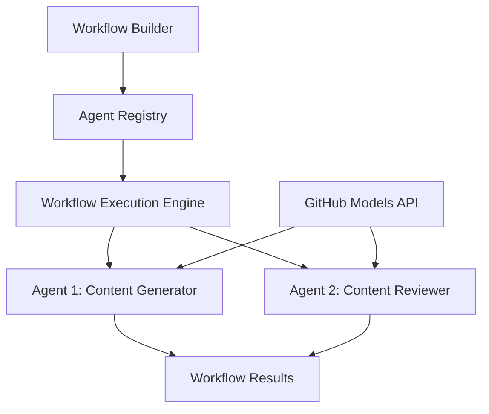

<!--
CO_OP_TRANSLATOR_METADATA:
{
  "original_hash": "034158688d0a45aae06dcbb21b0da5ae",
  "translation_date": "2025-11-11T12:42:13+00:00",
  "source_file": "08-multi-agent/code_samples/workflows-agent-framework/dotNET/01.dotnet-agent-framework-workflow-ghmodel-basic.md",
  "language_code": "mo"
}
-->
# 🔄 使用 GitHub 模型 (.NET) 的基本代理工作流程

## 📋 工作流程編排教學

此筆記本展示如何使用 Microsoft Agent Framework for .NET 和 GitHub 模型建立複雜的 **代理工作流程**。您將學習如何創建多步驟的業務流程，讓 AI 代理通過結構化的編排模式協作完成複雜任務。

## 🎯 學習目標

### 🏗️ **工作流程架構基礎**
- **工作流程建構器**：設計並編排複雜的多步驟 AI 流程
- **代理協作**：在工作流程中協調多個專業代理
- **GitHub 模型整合**：在工作流程中利用 GitHub 的 AI 模型推理服務
- **可視化工作流程設計**：創建並可視化工作流程結構以便更好理解

### 🔄 **流程編排模式**
- **順序處理**：按邏輯順序鏈接多個代理任務
- **狀態管理**：在工作流程階段間保持上下文和數據流
- **錯誤處理**：實現穩健的錯誤恢復和工作流程韌性
- **性能優化**：設計高效的工作流程以支持企業級運營

### 🏢 **企業工作流程應用**
- **業務流程自動化**：自動化複雜的組織工作流程
- **內容生產管道**：包含審核和批准階段的編輯工作流程
- **客戶服務自動化**：多步驟的客戶詢問解決方案
- **數據處理工作流程**：具有 AI 驅動轉換的 ETL 工作流程

## ⚙️ 先決條件與設置

### 📦 **所需 NuGet 套件**

此工作流程演示使用了幾個關鍵的 .NET 套件：

```xml
<!-- Core AI Framework -->
<PackageReference Include="Microsoft.Extensions.AI" Version="9.9.0" />

<!-- Agent Framework (Local Development) -->
<!-- Microsoft.Agents.AI.dll - Core agent abstractions -->
<!-- Microsoft.Agents.AI.OpenAI.dll - OpenAI/GitHub Models integration -->

<!-- Configuration and Environment -->
<PackageReference Include="DotNetEnv" Version="3.1.1" />
```

### 🔑 **GitHub 模型配置**

**環境設置 (.env 文件)：**
```env
GITHUB_TOKEN=your_github_personal_access_token
GITHUB_ENDPOINT=https://models.inference.ai.azure.com
GITHUB_MODEL_ID=gpt-4o-mini
```

**GitHub 模型訪問：**
1. 註冊 GitHub 模型（目前處於預覽階段）
2. 生成具有模型訪問權限的個人訪問令牌
3. 按上述方式配置環境變量

### 🏗️ **工作流程架構概述**



**主要組件：**
- **WorkflowBuilder**：設計工作流程的主要編排引擎
- **AIAgent**：具有特定能力的個別專業代理
- **GitHub Models Client**：AI 模型推理服務整合
- **Execution Context**：管理工作流程階段間的狀態和數據流

## 🎨 **企業工作流程設計模式**

### 📝 **內容生產工作流程**
```
User Request → Content Generation → Quality Review → Final Output
```

### 🔍 **文檔處理管道**
```
Document Input → Analysis → Extraction → Validation → Structured Output
```

### 💼 **商業智能工作流程**
```
Data Collection → Processing → Analysis → Report Generation → Distribution
```

### 🤝 **客戶服務自動化**
```
Customer Inquiry → Classification → Processing → Response Generation → Follow-up
```

## 🏢 **企業效益**

### 🎯 **可靠性與可擴展性**
- **確定性執行**：一致且可重複的工作流程結果
- **錯誤恢復**：在任何工作流程階段都能優雅地處理故障
- **性能監控**：跟蹤執行指標和優化機會
- **資源管理**：高效分配和利用 AI 模型資源

### 🔒 **安全性與合規性**
- **安全身份驗證**：基於 GitHub 令牌的 API 訪問身份驗證
- **審計追蹤**：完整記錄工作流程執行和決策點
- **訪問控制**：對工作流程執行和監控的細粒度權限
- **數據隱私**：在整個工作流程中安全處理敏感信息

### 📊 **可觀測性與管理**
- **可視化工作流程設計**：清晰表示流程流和依賴關係
- **執行監控**：實時跟蹤工作流程進度和性能
- **錯誤報告**：詳細的錯誤分析和調試能力
- **性能分析**：用於優化和容量規劃的指標

讓我們開始構建您的首個企業級 AI 工作流程吧！🚀

## 💻 運行代碼

完整實現可在 `01.dotnet-agent-framework-workflow-ghmodel-basic.cs` 文件中找到。此文件展示了：

1. **環境配置** - 從 `.env` 文件加載 GitHub 模型憑據
2. **OpenAI 客戶端設置** - 配置客戶端以使用 GitHub 模型端點
3. **代理創建** - 定義專業代理（前台和禮賓）
4. **工作流程建構器** - 創建具有順序處理的多代理工作流程
5. **工作流程執行** - 運行工作流程並流式傳輸結果

### 🚀 運行示例

```bash
# Make the script executable (Unix/Linux/macOS)
chmod +x 01.dotnet-agent-framework-workflow-ghmodel-basic.cs

# Run the workflow
./01.dotnet-agent-framework-workflow-ghmodel-basic.cs
```

或在 Windows 上：
```powershell
dotnet run 01.dotnet-agent-framework-workflow-ghmodel-basic.cs
```

### 📝 預期輸出

工作流程將：
1. 接受您的旅行目的地請求（例如 "我想去巴黎"）
2. 前台代理提供初步建議
3. 禮賓代理審查並完善建議
4. 最終輸出顯示完整的對話流

### 🔧 自定義

您可以通過以下方式自定義工作流程：
- 修改代理指令以改變其行為
- 添加更多代理以創建複雜的多步驟工作流程
- 更改用戶消息以測試不同場景
- 調整工作流程邊緣以創建不同的執行模式

---

<!-- CO-OP TRANSLATOR DISCLAIMER START -->
**免責聲明**：  
本文件已使用 AI 翻譯服務 [Co-op Translator](https://github.com/Azure/co-op-translator) 進行翻譯。儘管我們努力確保準確性，但請注意，自動翻譯可能包含錯誤或不準確之處。原始文件的母語版本應被視為權威來源。對於關鍵信息，建議使用專業人工翻譯。我們對因使用此翻譯而產生的任何誤解或誤釋不承擔責任。
<!-- CO-OP TRANSLATOR DISCLAIMER END -->