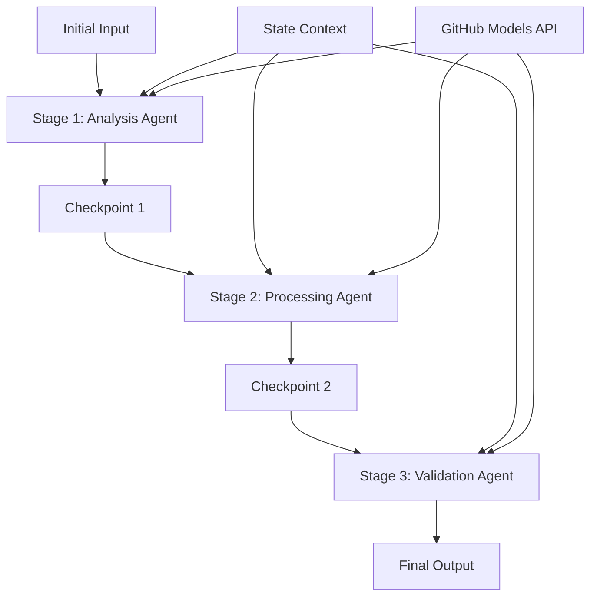

<!--
CO_OP_TRANSLATOR_METADATA:
{
  "original_hash": "1be9c8dcbd79a02d33d2c138684c1394",
  "translation_date": "2025-11-11T13:43:31+00:00",
  "source_file": "08-multi-agent/code_samples/workflows-agent-framework/dotNET/02.dotnet-agent-framework-workflow-ghmodel-sequential.md",
  "language_code": "mo"
}
-->
# ⏩ 使用 GitHub 模型進行順序代理工作流程 (.NET)

## 📋 高級順序處理教程

此筆記本展示了使用 Microsoft Agent Framework for .NET 和 GitHub 模型的**順序工作流程模式**。您將學習如何構建複雜的逐步處理管道，代理按照特定順序執行，每個階段基於前一階段的結果進行構建。

## 🎯 學習目標

### 🔄 **順序處理架構**
- **線性工作流程設計**：創建具有明確依賴關係的逐步處理管道
- **狀態管理**：在順序工作流程階段中保持上下文和數據流
- **GitHub 模型集成**：在多階段 .NET 工作流程中利用 GitHub 的 AI 模型
- **企業管道模式**：構建可投入生產的順序處理系統

### 🏗️ **高級順序模式**
- **階段門處理**：在工作流程階段之間實施驗證檢查點
- **上下文保留**：在所有階段中保持狀態和累積知識
- **錯誤傳播**：在順序處理鏈中優雅地處理失敗
- **性能優化**：以最小的開銷進行高效的順序執行

### 🏢 **企業順序應用**
- **文檔處理管道**：多階段文檔分析、轉換和驗證
- **質量保證工作流程**：順序審查、驗證和批准過程
- **內容生產管道**：研究 → 撰寫 → 編輯 → 審查 → 發佈
- **業務流程自動化**：具有明確階段依賴關係的多步業務工作流程

## ⚙️ 先決條件與設置

### 📦 **所需的 NuGet 套件**

.NET 順序工作流程的基本套件：

```xml
<!-- Core AI Framework -->
<PackageReference Include="Microsoft.Extensions.AI" Version="9.9.0" />

<!-- Client Model Abstractions -->
<PackageReference Include="System.ClientModel" Version="1.6.1.0" />

<!-- Azure Identity and Async LINQ Support -->
<PackageReference Include="Azure.Identity" Version="1.15.0" />
<PackageReference Include="System.Linq.Async" Version="6.0.3" />

<!-- Local Agent Framework References -->
<!-- Microsoft.Agents.AI.dll - Core agent abstractions -->
<!-- Microsoft.Agents.AI.OpenAI.dll - GitHub Models integration -->
```

### 🔑 **GitHub 模型配置**

**環境設置 (.env 文件)：**
```env
GITHUB_TOKEN=your_github_personal_access_token
GITHUB_ENDPOINT=https://models.inference.ai.azure.com
GITHUB_MODEL_ID=gpt-4o-mini
```

**配置管理：**
```csharp
// Load environment variables securely
Env.Load("../../../.env");
var githubToken = Environment.GetEnvironmentVariable("GITHUB_TOKEN");
var githubEndpoint = Environment.GetEnvironmentVariable("GITHUB_ENDPOINT");
var modelId = Environment.GetEnvironmentVariable("GITHUB_MODEL_ID");
```

### 🏗️ **順序工作流程架構**



**主要組件：**
- **順序代理**：每個處理階段的專用代理
- **狀態上下文**：在階段中保持累積的數據和決策
- **檢查點**：階段之間的驗證點以確保質量和一致性
- **GitHub 模型客戶端**：在所有工作流程階段中提供一致的 AI 模型訪問

## 🎨 **順序工作流程設計模式**

### 📝 **文檔處理管道**
```
Raw Document → Content Extraction → Analysis → Validation → Structured Output
```

### 🎯 **內容創作工作流程**
```
Brief/Requirements → Research → Content Creation → Review → Final Polish
```

### 🔍 **質量保證管道**
```
Initial Review → Technical Validation → Compliance Check → Final Approval
```

### 💼 **商業智能工作流程**
```
Data Collection → Processing → Analysis → Report Generation → Distribution
```

## 🏢 **企業順序的優勢**

### 🎯 **可靠性與質量**
- **確定性處理**：通過結構化階段實現一致、可重複的結果
- **質量門檻**：驗證檢查點確保每個階段的質量
- **錯誤隔離**：一個階段的問題不會傳播到後續階段
- **審計追蹤**：完整跟蹤每個階段的決策和轉換

### 📈 **可擴展性與性能**
- **模塊化設計**：每個階段可以獨立優化
- **資源管理**：在階段中高效分配 AI 模型資源
- **狀態優化**：階段之間的最小狀態傳輸以實現最佳性能
- **並行階段組**：多個順序工作流程可以並行運行

### 🔒 **安全性與合規性**
- **階段級安全性**：不同處理階段的不同安全策略
- **數據驗證**：在每個檢查點確保數據完整性和合規性
- **訪問控制**：不同工作流程階段的細粒度權限
- **法規合規性**：通過結構化處理滿足法規要求

### 📊 **監控與分析**
- **階段級指標**：每個工作流程階段的性能監控
- **瓶頸識別**：識別並優化慢速階段
- **質量指標**：跟蹤每個階段的質量和成功率
- **流程優化**：基於階段級分析進行持續改進

讓我們構建穩健的順序 AI 處理管道吧！🚀

## 💻 運行代碼

完整實現可在 `02.dotnet-agent-framework-workflow-ghmodel-sequential.cs` 文件中找到。此文件展示了一個**三階段家具分析工作流程**：

1. **第一階段 - 銷售代理**：分析家具圖片並提供購買建議
2. **第二階段 - 價格代理**：提供詳細的價格分解和預算選項
3. **第三階段 - 報價代理**：生成專業的 Markdown 格式報價文檔

### 🏗️ **工作流程架構**

```
Image Input → Sales Analysis → Price Estimation → Quote Generation → Final Output
```

每個代理：
- 接收前一階段的輸出作為上下文
- 基於之前的分析進行專業化擴展
- 通過狀態管理保持工作流程的連續性

### 🚀 運行示例

**先決條件：**
- 將家具圖片放置在 `../imgs/home.png`（或更新 `imgPath` 變量）
- 使用 GitHub 模型憑據配置您的 `.env` 文件

```bash
# Make the script executable (Unix/Linux/macOS)
chmod +x 02.dotnet-agent-framework-workflow-ghmodel-sequential.cs

# Run the sequential workflow
./02.dotnet-agent-framework-workflow-ghmodel-sequential.cs
```

或在 Windows 上：
```powershell
dotnet run 02.dotnet-agent-framework-workflow-ghmodel-sequential.cs
```

### 📝 預期輸出

工作流程將：
1. **銷售代理**：從圖片中識別家具項目並提供建議
2. **價格代理**：添加詳細的價格分析，包括預算層級和購物建議
3. **報價代理**：生成包含所有信息的格式化報價文檔

最終輸出將是一份基於圖片分析的全面專業家具報價。

### 🔧 自定義選項

**修改代理行為：**
```csharp
// Adjust agent instructions to change their focus
const string SalesAgentInstructions = "Your custom instructions...";
```

**更改順序流程：**
```csharp
// Add or reorder workflow stages
var workflow = new WorkflowBuilder(salesagent)
    .AddEdge(salesagent, priceagent)
    .AddEdge(priceagent, quoteagent)
    .AddEdge(quoteagent, newAgent)  // Add another stage
    .Build();
```

**使用不同輸入：**
```csharp
// Process text instead of images
ChatMessage userMessage = new ChatMessage(ChatRole.User, [
    new TextContent("Analyze pricing for a modern living room set")
]);
```

### 🎯 實際應用

此順序模式非常適合：
- **電子商務**：產品分析 → 價格 → 報價生成
- **房地產**：房產分析 → 估值 → 列表創建
- **保險**：索賠分析 → 評估 → 報價生成
- **內容創作**：研究 → 撰寫 → 編輯 → 發佈

### 🔍 理解狀態流

順序中的每個代理接收：
- **原始輸入**：初始用戶消息（圖片 + 文本）
- **前代理輸出**：對話歷史中所有前代理的響應
- **累積上下文**：在整個工作流程中保持的完整狀態

這使得每個代理能夠基於所有前階段的綜合上下文進行複雜的多階段處理。

---

<!-- CO-OP TRANSLATOR DISCLAIMER START -->
**免責聲明**：  
本文件已使用 AI 翻譯服務 [Co-op Translator](https://github.com/Azure/co-op-translator) 進行翻譯。儘管我們努力確保準確性，但請注意，自動翻譯可能包含錯誤或不準確之處。原始文件的母語版本應被視為權威來源。對於關鍵信息，建議使用專業人工翻譯。我們對因使用此翻譯而引起的任何誤解或誤釋不承擔責任。
<!-- CO-OP TRANSLATOR DISCLAIMER END -->